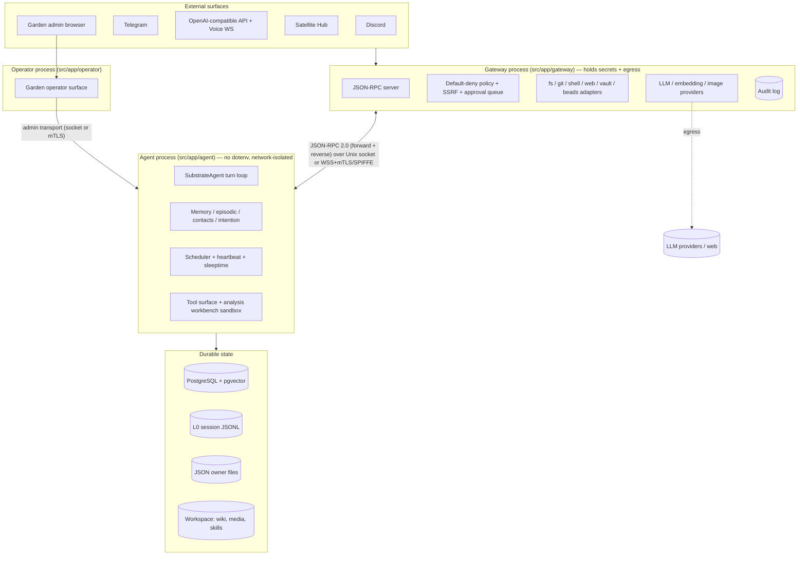
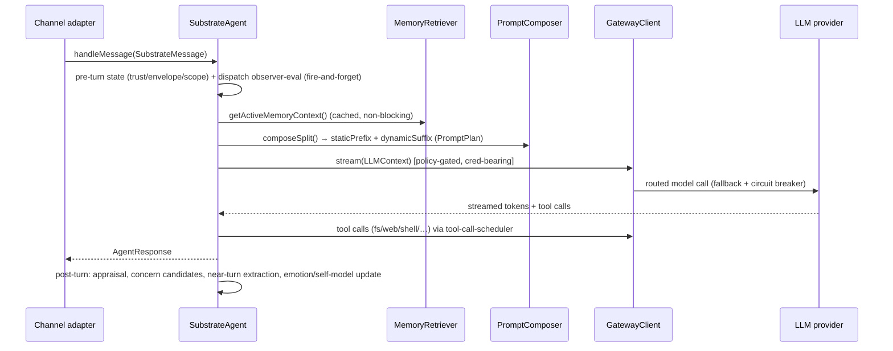
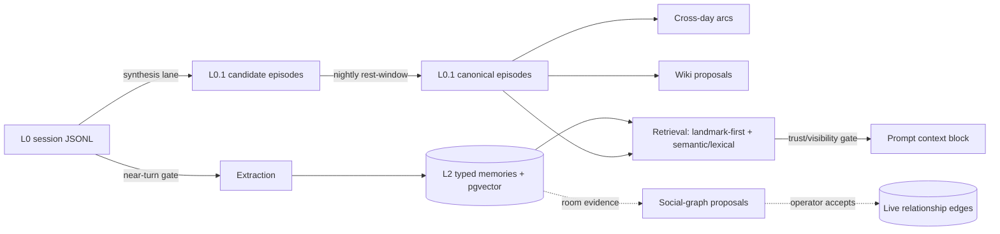

# Codebase Map

> Auto-generated by Cartographer. Last mapped: 2026-07-08.
> The runtime entrypoints and contracts under `src/` remain the source of truth when this map drifts.
> Anchor entrypoints: `src/app/gateway/main.ts`, `src/app/agent/main.ts`, `src/app/operator/main.ts`, `src/app/startup/composition/composition.ts`.

PSFN (Persona Substrate Formation Network) is a split TypeScript runtime for long-lived AI companions. Identity lives in **data, not weights**: Postgres-backed memory/contacts/intentions, JSONL session transcripts, and JSON owner-file config. The runtime is **fail-closed by default** — unknown providers, malformed config, missing `pgvector`, unsafe TLS overrides, and un-permitted tool calls all stop rather than degrade.

## System Overview

Three cooperating processes with a hard secrets boundary. The **gateway** holds all credentials and owns external egress; the **agent** ("the mind") runs isolated with no ambient secrets and proxies every privileged operation over RPC; the **operator/Garden** is a thin admin surface.



**Runtime modes** (`PSFN_RUNTIME_MODE`): `split` (default; gateway+agent+operator via `scripts/start-gateway-agent.sh`), `yolo` (broader `fs.read` policy), containerized agent (`npm run agent:docker`). The legacy unified entrypoint `src/app/startup/index.ts` is disabled and exits fail-closed.

## Directory Structure

```text
src/
  app/            Process entrypoints + startup composition (gateway, agent, operator, cert-manager, cli, e2e, maintenance)
  boundary/       Gateway security perimeter: RPC, policy/SSRF, audit, sandbox, host-tool adapters, credential vault, intake screeners
  channels/       Discord, Telegram, OpenAI-compatible API, backplane (adapter registry, Satellite Hub)
  core/           The mind: agent loop, session, identity/prompts, scheduler, contacts, intention, emotion, self-model, tools, cogsec (incl. intake firewall), eval
  faculties/      Memory (L0.1/L2, extraction, retrieval, consolidation, social-graph, wiki), skills, subagents, shards, values, north-star, core-memory, file-ingest
  operator/       Garden admin server: transport, route groups, ~35 services, audit/telemetry
  persistence/    Two-root layout + guards, Postgres stores/migrations, session JSONL, backups/restore, repair, cutover
  primitives/     LLM provider ports (routing/fallback/circuit-breaker), voice (STT/TTS registries + transports), images
  shared/         Event bus, logger, cross-boundary contracts, routing envelope, telemetry ledgers, gating, resilience, net/mTLS, cache
  system/         Config owner-files + loaders, settings contract guard, capability tiers, trust/privacy engine, lifecycle, modules

admin-ui/         Svelte 5 Garden SPA (served as static assets)
companion-ui/     Standalone Satellite Hub PWA client
config/           Seed owner files (templates only — NOT runtime authority)
k8s/ docker/ proxy/ deployment/   Kubernetes/Helm manifests, container config, LiteLLM proxy, systemd artifacts
docs/             This map + design docs; CHANGELOG.md at repo root
```

**Scale**: ~977 non-test + ~581 test TypeScript files under `src/`, ~498k source lines. Postgres-only runtime; SQLite (`better-sqlite3`/`sqlite-vec`) is retained **only** for migration tooling and adapter tests. Built on `@mariozechner/pi-agent-core` + `pi-ai` `0.62.0` (Node ≥22, ESM).

## Module Guide

### `src/app` — entrypoints & composition

Process entrypoints plus the shared composition library. `composition.ts` is a **library of `compose*`/`wire*` builders**, not a single wiring function — the actual startup order lives in `agent/main.ts` → `core-bootstrap.ts` → `core-runtime.ts`. Agent startup order: `prepareAgentStartupContext` → network-isolation guard → connect to gateway → `createAgentPersistenceRuntime` → identity/ML warmup → `buildAgentCoreRuntime` (the `SubstrateAgent`) → hydration → scheduler runtime → module loader → shard/think runtime → memory writer/sleeptime → control plane (ordered shutdown) → signal handlers.

- **Entry**: `gateway/main.ts` (loads dotenv, builds privileged core), `agent/main.ts` (955 lines; **no dotenv**, launched with `env -i` + allowlist), `operator/main.ts` (thin Garden surface).
- **Composition**: `composition/composition.ts`, `composition/parity.ts` (parity-critical shared wiring), `composition/post-turn-actions.ts` (1355 lines — largest), `support/bootstrap-helpers.ts`, `support/startup-preflight.ts`, `support/shutdown-helpers.ts`, `support/signal-shutdown.ts`, `agent/startup-guards.ts` (`enforceNetworkIsolationOnStartup`).
- **Run targets**: `npm run split|gateway|agent|operator|yolo|chat|e2e|agent:docker`; maintenance scripts under `app/maintenance/*` (layout migration, session/transcript repair, embeddings migration, character import).
- **Cert-manager sidecar** (`app/cert-manager/`): a standalone private-CA process (`npm run cert-manager`, commands `init`/`serve`) that issues and auto-renews the satellite/backplane mTLS certificates `satellites.json` client-cert bindings use. Token-authenticated loopback API (default port 10070), requires `CERT_MANAGER_TOKEN`, shares only `src/shared/`. See `docs/certificates.md`.

### `src/shared` — cross-cutting infrastructure

No dependency on `app/`; everything else depends on it.

- `event-bus.ts` — the single typed pub/sub backbone (large `EventMap`: turns, sessions, memory, capability eligibility, deterministic gates, run-charge, fatigue). Startup emits telemetry events rather than calling sinks directly.
- `contracts/runtime.ts` — canonical `SubstrateMessage`/`AgentResponse`/turn/session cross-boundary types; also `charge-policy.ts`, `episodic-memory.ts`, `completion-handoff.ts`, `satellite-registry.ts`, `settings-garden-contract.ts`.
- `gating/deterministic-gate.ts` — pure "don't run the LLM if nothing changed" primitive (fail-closed, emits typed skip/ran events) used by extraction, episode synthesis, consolidation, emotion appraisal, wiki pass, orientation rewrite.
- `telemetry/run-charge.ts` (AsyncLocalStorage charge-lane context) + JSONL `charge-ledger.ts`/`fatigue-ledger.ts`; `logger.ts` (Winston + diagnostic ring buffer + `diagnostics/redaction.ts`); `routing/envelope.ts` (`GatewayRoutingEnvelope`); `resilience/circuit-breaker.ts`; `net/mtls.ts`+`hosts.ts`; `cache/` (memory/Redis app-cache).

### `src/core/agent` — the turn loop

Wraps the pi-agent-core `Agent` as `SubstrateAgent` and layers PSFN specifics: prompt assembly, memory/emotion/self-model context, a tiered tool surface (`core` vs `extended`), a patched parallel tool-call scheduler, post-turn actions, background continuation, fatigue budgeting, streaming/steering.

- **Entry**: `handleMessage()` (single turn entrypoint → `AgentResponse`), `steer()` (no-op unless streaming), `followUp()`, `observeMessage()`.
- **Key files**: `substrate-agent.ts`, `substrate-agent/turn-execution-runtime.ts` (`handleMessageForTurn` pipeline), `turn-execution/{pre-turn-state,prompt-assembly,prompt-plan,agent-invocation,post-turn-scheduling}.ts`, `tool-surface/registry.ts` (`CANONICAL_FIRST_PARTY_TOOL_SURFACES` + retired-alias drift guard), `adaptive-tools-runtime.ts` (`tool_search`/`toolset`), `../../boundary/pi-agent/agent-loop-patch.ts` (monkey-patches private pi-agent-core Agent internals; lives in the pi-agent version-coupling boundary), `tool-call-scheduler.ts`, `post-turn-action-runtime.ts`, `completion-handoff.ts` (never persisted to journal), `stream-adapter.ts`, `fatigue/*`, `no-reply-tool.ts` (`response_control`).
- **Pattern**: null-until-wired provider fields (`memoryProvider`, `contactStore`, `promptComposer`, …) attached post-construction; pure-function core + stateful facade split; step limit `AGENT_LOOP_MAX_ASSISTANT_STEPS_PER_RUN = 36`.

### `src/core/session` + `turns` + `contacts`

Conversational timeline, turn observability, and relationship/trust modeling.

- **Session**: `manager.ts` (`SessionManager`), `manager/context-builder.ts` (assembles `LLMContext` + a parallel `ContextManifest` audit record), `entry-attribution.ts` (group-chat speaker-attribution grammar — `stableId` is the trust anchor, display names sanitized/forgery-escaped), `conversation-scope.ts` (resolved once per turn), `session-routes.ts` (fresh-split/quarantine), compaction + continuity.
- **Turns**: contracts only — branded `TurnID` (UUIDv7), `TurnSnapshot`/`TurnObservabilityRecord` (sanitized clones for replay). No orchestrator class.
- **Contacts**: `contact-store-port.ts` (async seam; SQLite `store.ts` + Postgres `postgres-adapter/*`), a **three-tier trust ratchet** — low-tier drift (deterministic, agent-confirmed), high-tier mutation (manual/`operator:`/`admin:` actor only), and `propose_trust` (human-in-the-loop `ApprovalQueuePort`, only ever proposes `trusted`); trust-drift review lane; social-relationship edge classification; contact-tracking privacy gate; machine-intelligence auto-tagging.

### `src/core/identity` + `scheduler` + `cogsec`

- **Identity**: the single prompt-assembly path. `PromptComposer.composeSplit` (the *only* assembly entrypoint) returns a byte-stable `staticPrefix` + turn-volatile `dynamicSuffix`; `prompt-runtime.ts` enforces macro volatility (`static`/`session_stable`/`turn`) and fails closed if a turn-volatile macro leaks into the static (cache) prefix. `PromptLayerStore` (5 layer types base→operator→system_language→runtime→channel→task), character-card loading/import/versioning (CCv2/v3), `createIdentityTool`.
- **Scheduler**: tick-driven `Scheduler` with eligibility gating; heartbeat template + post-turn runtimes (the big orchestrators, ~2.6k/1.6k lines); **durable scheduled prompts** persisted in Postgres and rehydrated at startup (survive agent restarts); temporal wakeup, free-time blocks, rest-window, weighted-thought outreach.
- **CogSec**: two halves. *Post-hoc remediation* — tombstone/revocation/regeneration/notice modes for tainted content, lineage tracing, forensic archive, driven from the Garden Remediation page. *Pre-hoc intake firewall* (htm9, `docs/cognitive-security.md`) — `intake/screening.ts` (L1 scanner pipeline + L1.5 score → `IntakeEnvelope` decision), `intake/scanners/` (deterministic, bounded-regex L1 scanners + hot-reloadable `config/intake-l1-rules.json` rule engine), `intake/sink-gates.ts` + `../session/intake-sink-gating.ts` (six consequential sinks, lethal-trifecta rule), `intake/quarantine-store.ts` (held items, `companion-data/state/intake-quarantine.json`), `intake/source-lists.ts`/`marking.ts` (trusted/denied lists, Spotlighting datamarking), `drift/` (nightly zero-LLM drift-velocity + second-arrow review lanes → operator cards), `canary/` (per-session egress tripwire), `contact-block-list.ts` (companion-initiated soft/hard blocks), `intake-firewall-notice-templates.ts` (fixed, load-time-verified companion notice wording whose signature phrase keys the emotion/memory exclusions). Envelope contract: `src/shared/contracts/intake-envelope.ts`; policy owner: `intake-policy.json` (`src/system/config/intake-policy-config.ts`).

### `src/core/emotion` + `self-model` + `intention` + `internal-role-envelopes`

Affect and internal-state substrate. `EmotionState` (decaying VAD/mood accumulator), `EmotionObserver` (text+audio fusion), `EmotionAppraisal` (LLM "chain of emotion"). `self-model/state.ts` (`InternalStateComputer` — one normalized snapshot per turn; the real orchestrator is `core/agent/substrate-agent/emotion-self-model-runtime.ts`, not `wireSelfModelRuntime` which is a no-op flag). `MetacognitiveMonitor` (5 behavioral flags). `intention/` — LLM post-turn appraisal, active concerns (+ candidate review, nightly grooming, route handoff), pending follow-ups, care reminders, weighted thoughts, and **proactive outbound** (Discord-only, single-channel-gated, fails closed). `internal-role-envelopes/` — append-only ledger for the companion's non-user-facing artifacts with a promotion lifecycle.

### `src/core/tools` + `eval`

- **Tools**: direct agent tools — `self-status.ts`/`self-diagnosis.ts` (companion self-diagnosis surface), `session.ts` (unified list/new/resume/search/grep), `lifecycle.ts` (`self_restart`/`self_rebuild`), `ntfy.ts`, and **`analysis-workbench/`** — a bounded, budgeted, out-of-process JS REPL ("RLM") the agent invokes as one `analysis_workbench` tool. In production composition it is **read-only** (repo/workspace mutation flags hard-set false); REPL-only helpers (`memory_search`, `grep`, `diff`, …) are distinct from direct tools.
- **Eval**: `observer-sidecar/` — a passive, **non-authoritative** observability sidecar (EmoSim projection v2, crosswalk vs PSFN emotion, Postgres persistence, shadow "would-act" levers). Hard-isolated from the live loop (test-enforced): the only touchpoint is `dispatchObserverEvalTurn` at the pre-turn seam; everything else is read only through Garden. EmoSim runs as a long-lived server via `emosim-server-adapter.ts`.

### `src/faculties/memory` — the memory system

Postgres/pgvector-backed, split into lanes (see `docs/memory.md`). **L0** = append-only session JSONL. **L0.1** = episodic landmarks (`l01_episodes` + spans/arcs/claims/watermarks/lineage). **L2** = 7 typed memory types with pgvector retrieval.

- **Write/extraction** (`extraction/`, `extraction.ts`): near-turn deterministic pre-LLM gate → chunk → LLM parse → fail-closed speaker routing → group write-caps. `NearTurnMemoryLane` gates per-turn extraction.
- **Read/retrieval** (`retrieval.ts` + `retrieval/`): landmark-first episodic + semantic/lexical candidate merge → trust/visibility access gate (withheld surfaced honestly, not dropped) → scoring/budget → prompt block. E5.5 cached **active-memory context** never blocks a turn.
- **Consolidation** (`sleeptime-agent.ts`, `episodic/sleep-consolidation.ts`, `arc-formation.ts`, `dream-meaning-pass.ts`): nightly rest-window chain (candidate→canonical fold, claim transfer with supersede-not-delete, audited mutable arcs). Only reachable via the scheduler's `memory.sleeptime.rest-window` task (test-enforced).
- **Stores**: `postgres-store.ts` (runtime default, pgvector fail-closed) vs legacy `store.ts` + `store/*` (SQLite, migration/test only). Typed evolution/abstraction links beside rows, never in-place mutation.
- **Social graph** (`social-graph/`): pure-heuristic worker mines room memories for evidence → **proposals** (file-backed, quarantined from the live edge table); only operator acceptance in Garden writes live edges; both contacts must be tracked.

### `src/faculties` — other faculties

- **wiki**: durable authored/imported reference knowledge under `WORKSPACE_PATH/knowledge/wiki` (markdown+JSON is canonical), pgvector projection is a rebuildable mirror; nightly `sleeptime-wiki-pass.ts` proposes entries with hard personal-vs-world guardrails; independent RAG budget subordinate to memory.
- **shards**: long-horizon worker plane. `ShardManager` (1807 lines; implements both `ShardExecutionPort` and `SubagentExecutionPort`) gates every output behind a core-reviewed **fold-back** (`ShardFoldReviewController`); emotional/relational memory always requires core review.
- **subagents**: bounded short-horizon `subagent` tool (`spawn`/`message`/`wait`/`cancel`/`status`), `maxConcurrent`, recursion-blocked toolsets.
- **skills**: file-based workflow-guidance docs, eligibility-filtered (binaries/env/config), budgeted XML prompt block, unified `skill` tool; self-authoring `SkillStore`.
- **values** / **north-star**: append-only values journal (read back into the prompt via `buildCompanionDerivedLayer`; surfaced through the `orient` tool, not a standalone tool) and a max-3-item `[North Star]` layer.
- **core-memory**: the `orient` surface (persona/human/goals), deliberately **file-backed** (`core_memory.json`), not Postgres.
- **file-ingest** (htm9.9): channel-agnostic document attachment ingestion extracted from the Discord-only pipeline — one parse + binary-quarantine + intake-screening path (`document-ingest.ts`, `quarantine.ts`, `office-document.ts`, `zip-container.ts`) shared by Discord, Telegram, and the API channel; the same fixture file must produce the same parsed text, envelope shape, and screening decision on every channel (`adapter-parity.test.ts`).
- **context-feedback**: **dormant/unwired by design** (bead `psfn-framework-ls1k`) — needs a config-owned deterministic gate before composition. (There is no `faculties/media`; image tools live in `primitives/images`.)

### `src/boundary` — gateway security perimeter

Host-side process holding all secrets. **Fail-closed policy**: `evaluatePolicy()` is a `switch` whose `default` is `DENY`; decisions are `ALLOW`/`DENY`/`NEEDS_APPROVAL` (approval auto-executes only at `autonomous` tier, else queues + pings operator).

- **RPC**: `gateway/protocol.ts` (JSON-RPC contract), bidirectional — forward (agent→gateway: `llm.*`, `fs.*`, `git.*`, `shell.exec`, `web.*`, `vault.*`, `beads.*`, `image.*`, `discord.*`, `notify.*`) and reverse (gateway→agent: `voice.*`, `api.chat.*`). Transport: Unix socket or WSS+mTLS+SPIFFE (split-host shards).
- **Defenses**: `url-policy.ts` (SSRF: private/metadata IP blocks + **post-DNS re-validation pinned to the resolved IP** to defeat rebinding), streamed response-body byte caps in `methods/web.ts` (8 MiB text/binary, socket destroyed on overrun), path allowlist with `realpath` canonicalization (defeats symlink escape), `sanitize.ts` (prompt-injection stripping of fetched content), append-only SQLite/Postgres audit.
- **Intake screeners** (`gateway/intake/`): the gateway-side classifier layers of the cognition intake firewall — `compose-screening.ts` (builds the gateway `IntakeScreeningService` from `intake-policy.json`; missing ONNX weights = loud skip, broken weights = fail closed), `injection-classifier.ts` (L1.5 in-process ONNX DeBERTa-v3, provisioned via `npm run provision:injection-model`), `l2-screener.ts`/`l3-screener.ts` (tool-less OpenRouter escalation screeners over the shared `screener-transport.ts`, invoked gateway-side through the `IntakeEscalationPort` in `escalation.ts`; the agent process holds no escalation port and stays L1-only), `vision-screener.ts` (VLM OCR+description per inbound image, exposed as the `intake.screen_image` RPC; transcript re-screened as `image_ocr`, hostile tier). See `docs/cognitive-security.md`.
- **Adapters** (`integrations/*`): each repeats `ops.ts` (contract) → `local-ops.ts`/`gateway-ops.ts` → `tools.ts` → `runtime-wiring.ts`. Note two unrelated "vaults": `custody/credential-vault.ts` (secrets, env/OpenBao) vs `integrations/vault` (Obsidian notes).
- **Sandbox**: `analysis_workbench` code runs in a locked-down child (`--permission`, empty env, no code-gen-from-strings); `shell-runner.ts` uses a curated PATH and reserved-var denylist (`PATH`/`NODE_OPTIONS`/`LD_*`).

### `src/persistence` — layout, stores, backups

- **Layout** (`layout.ts`): two-root topology (`system-data` vs `companion-data`); production mode rejects overlapping/duplicate mutable roots and forbids the legacy shared `DATA_DIR`. The most widely imported file in the module.
- **Runtime factory** (`runtime-factory.ts`): composes the Postgres store bundle; throws if `persistenceBackend !== 'postgres'`.
- **Migrations**: idempotent `CREATE/ALTER ... IF NOT EXISTS` statement arrays (`postgres/migrations.ts`), re-run every boot; `postgres/parity-matrix.ts` codifies the Postgres-only + migration-only-SQLite contract.
- **Sessions**: append-only JSONL with HMAC integrity chaining and quarantine-on-corruption; Postgres transcript projection (rebuildable from JSONL).
- **Backups** (`backups/`): pg_dump + companion/workspace/system-config tree snapshots, tiered rotation, **mandatory** at-rest encryption, and restore verification that actually restores into a scratch DB and asserts pgvector + critical-table fidelity. `pg_dump` credentials go via `PGPASSWORD` env, never argv.
- **Repair/cutover**: JSONL/attribution/projection/participant-name/provenance repair; legacy→two-root migration with signed manifest.

### `src/system` — config, capabilities, trust, lifecycle

- **Config**: strict **owner-file** contracts — each mutable field belongs to exactly one JSON file (`settings/models/providers/scheduler/capability-tier/trust-policy/charge-policy/backup/skills.json`, plus channel-owned `channels.json`). `load-config.ts` sources only bootstrap-tier fields from `.env` (paths/secrets/`POSTGRES_DATABASE_URL`); model/provider fields start as an owner-file sentinel. `settings-contract-guard.ts` is a build/test metadata check; `verifyStartupOwnerFiles` is the runtime check. Stale `.env` for JSON-owned config is warned-and-ignored, but stray keys in `settings.json` hard-throw.
- **Capabilities**: tiers `nursery < apprentice < autonomous` (+ `custom`) map to `CapabilityToken` sets; `gate.ts` wraps every tool; `confirmation-queue.ts`/`safeguards.ts` add an independent cooldown/reversibility layer.
- **Trust**: the honne/tatemae engine. `evaluateMemoryPolicy` is a 6-layer precedence waterfall (operator > boundary > consent > trust ceiling > channel envelope > default); `context-envelope.ts` derives `{privacy, broadcast, audience, delivery style, contact-tracking}` per turn. Secret/config separation is type-enforced (`CoreSubstrateConfig` forbids secret keys via `never`).

### `src/primitives` + `src/channels`

- **primitives/llm**: `LLMProviderPort` (`stream`/`complete`) with two implementations — `LLMClient` (direct, holds creds) and `GatewayClient` (RPC proxy). Routing → fallback (per-candidate cooldown) → retry → circuit breaker (keyed `method::provider::model::routeKind`). Handles the empty-tool-args backstop (retries the whole completion up to 2×, never fabricates args) and GLM `:exacto` routing.
- **primitives/voice**: STT/TTS registries with fail-closed `isConfigured`/eligibility, a frame→processor→runner pipeline, websocket + Discord transports.
- **primitives/images**: `ImageOperations` port (`ImageService` local vs `GatewayImageOps` RPC), reference store + vision reviewer.
- **channels**: `backplane/types.ts` (`ChannelAdapterPort`) + registry; `api/` (`/v1/chat/completions` SSE + voice WS), `discord/` (voice, file quarantine, same-author coalescing), `telegram/` (polling/webhook). Activation is eligibility-gated at boot **and** re-checked on every runtime call.

### `src/operator/garden` — admin server

Two-tier split: `GardenOperatorSurface` (public-facing auth + SPA static + reverse proxy) and `GardenAdminTransportServer` (real API, Unix socket or mTLS+SPIFFE network). Both share `buildAdminApiRoutes` (~15 route groups over `/api/admin/*`) and ~35 `services/*` adapting core stores. Highlights: `AdminMemoryBodyGate` (session-scoped, TTL'd, honest-`[REDACTED]` sensitivity gating of high-intimacy memory bodies), audit-log-everything mutations (JSONL), live turn telemetry over WebSocket, read-only reflection journals (`/values`). Fail-closed auth (`validateAdminAuthStartupPolicy` requires `ADMIN_TOKEN` unless insecure+loopback; login token comparison is timing-safe via `timingSafeStringEqual`).

Cognitive-security routes/services (htm9.11/.14/.15): `routes/intake-quarantine-routes.ts` (`/api/admin/intake/policy|quarantine`, two-step confirm/decide release with a server-side single-use confirm token) + `services/intake-quarantine-service.ts`; `routes/intake-source-list-routes.ts` (`/api/admin/intake/source-lists` flywheel CRUD); `routes/drift-review-routes.ts` (`/api/admin/intake/drift-reviews`, resolve `acknowledged|dismissed|consolidated`) + `services/drift-review-service.ts` (consolidation applies memory supersession only on operator approval); CogSec events/remediation ride `routes/session-routes.ts` (`/api/admin/session-routes/cogsec/*`). Admin-ui pages: `admin-ui/src/routes/cognitive-security/{approvals,firewall,drift,remediation}/+page.svelte`, registered as the `cognitive-security` nav group in `admin-ui/src/lib/nav.ts`.

## Data Flow

**Turn lifecycle** — inbound message to response and post-turn work:



**Memory lanes** — write path, retrieval, and nightly consolidation are separate:



## Conventions

Patterns that recur across nearly every module:

- **Fail closed, no silent fallback.** Default-deny policy, `persistenceBackend !== 'postgres'` throws, missing pgvector/backup-key/config throws, network-isolation guard, unknown providers rejected. Absence is an explicit typed state, never a silent skip.
- **Port/adapter split, Postgres-primary.** Every store has a `*StorePort` interface with a Postgres runtime implementation and a legacy SQLite one selected at composition time. SQLite files look like runtime stores but are migration/test-only (`postgres/parity-matrix.ts` is the contract).
- **Deterministic pre-LLM gating.** Recurring nondeterministic passes check `evaluateDeterministicGate` first and emit a typed skip/ran event — zero LLM spend when nothing changed.
- **Owner-file config.** One JSON file owns each mutable subsystem; `.env` is bootstrap/secrets only; cross-domain keys in `settings.json` hard-throw.
- **`compose*` builds and returns; `wire*` mutates/attaches.** `SubstrateAgent` uses null-until-wired provider fields attached after construction.
- **Canonical tool surface + retired-alias drift guard.** `tool-surface/registry.ts` is the single source of truth; reintroducing a retired alias (`fs_read`, `spawn_subagent`, `notify_operator`, …) throws at startup. Tools are unified action-style (`orient`, `subagent`, `north_star`, `skill`, `memory`).
- **Human-in-the-loop review gates.** Trusted-tier trust promotion, shard fold-back, social-graph edge proposals, and gateway `NEEDS_APPROVAL` actions all queue for operator confirmation rather than auto-applying.
- **Provenance preserved, never deleted.** Supersede-not-delete for episodes/claims; typed evolution/abstraction links beside memory rows; audited mutable arcs; append-only journals with HMAC integrity.
- **Honest redaction.** Withheld memories and gated Garden bodies show explicit `[REDACTED]`/withheld-summary markers, never silent omission.
- **Event bus is the telemetry seam.** Code emits typed events; ledgers/diagnostics subscribe.

## Gotchas

- **`composition.ts` is a builder library, not a wiring function** — the real order is in `agent/main.ts` + `core-bootstrap.ts`. The largest composition file is `post-turn-actions.ts` (1355 lines).
- **Agent process has no dotenv and no ambient secrets** — launched with `env -i` + allowlist; only gateway/operator/cli/e2e load dotenv. Startup runs a real outbound network probe (`http://1.1.1.1/cdn-cgi/trace`) and fails closed unless `ALLOW_AGENT_OUTBOUND_NETWORK=true`.
- **Two Garden surfaces**: standalone `operator/main.ts` and in-process `agent/admin-surface.ts` — both use the same transport/contract machinery.
- **Unix-socket admin/gateway transport has no peer auth** — security is filesystem permissions (0o600) + colocation; only network mode enforces mTLS/SPIFFE.
- **pi-agent-core monkey-patch** (`src/boundary/pi-agent/agent-loop-patch.ts` overrides private Agent loop internals) is fragile across version bumps; all direct pi-agent-core imports are now confined to `src/boundary/pi-agent/` and enforced by lint.
- **`self-model` real orchestrator is in `core/agent/substrate-agent/emotion-self-model-runtime.ts`**, not `src/core/self-model/`; `wireSelfModelRuntime` is a no-op flag setter.
- **The `shard` tool is a stub** ("future canonical control plane"); `ShardManager` does double duty for shards and bounded subagents. `spawn_subagent` in `shards/tools.ts` is dead code — the live path is `subagent`.
- **`context-feedback` is unwired by design** (bead `psfn-framework-ls1k`); `faculties/media` does not exist (image tools are in `primitives/images`).
- **Naming traps**: `store/trust-filters.ts` builds scope SQL clauses (not trust gating); two unrelated "vaults" (credentials vs Obsidian notes); L2 `episodic` memory type ≠ L0.1 `l01_episodes`.
- **CogSec has two halves with different postures** — remediation (tombstone/revocation/regeneration) is operator-driven from Garden, but the intake firewall is always-on once `intake-policy.json` mode is `shadow`/`enforce` (shadow screens and journals without changing delivered content). L2/L3 escalation runs gateway-side only, and is skipped when L1/L1.5 have already decided quarantine/block.

## Navigation Guide

| Task | Start here |
| --- | --- |
| How does the runtime start? | `src/app/agent/main.ts` → `core-bootstrap.ts` → `core-runtime.ts`; gateway `src/app/gateway/main.ts` |
| How is one turn processed? | `src/core/agent/substrate-agent.ts` → `substrate-agent/turn-execution-runtime.ts` |
| What can the model call? | `src/core/agent/tool-surface/registry.ts`, `docs/tool-surface.md` |
| Why did startup reject config? | `src/system/config/{load-config,startup-owner-files}.ts`, `src/persistence/layout.ts` |
| How is memory written / retrieved? | `src/faculties/memory/extraction.ts`, `retrieval.ts`, `postgres-store.ts` |
| Where does nightly memory work run? | `src/faculties/memory/sleeptime-agent.ts` via scheduler `memory.sleeptime.rest-window` |
| How is the prompt assembled? | `src/core/identity/prompt-composer.ts` (`composeSplit`), `prompt-runtime.ts` |
| How is a privileged op gated? | `src/boundary/gateway/policy.ts`, `approval-boundary.ts`, `url-policy.ts` |
| How does trust/privacy gate memory? | `src/system/trust/policy.ts` (`evaluateMemoryPolicy`), `context-envelope.ts` |
| How is a channel added/activated? | `src/channels/backplane/`, `src/app/startup/composition/channel-runtime.ts` |
| Where are admin APIs defined? | `src/operator/garden/api-routes.ts` + `routes/*` + `services/*` |
| How is untrusted inbound content screened/quarantined? | `src/shared/contracts/intake-envelope.ts`, `src/core/cogsec/intake/screening.ts`, `src/boundary/gateway/intake/compose-screening.ts`, `docs/cognitive-security.md` |
| How are satellite mTLS certs issued/renewed? | `src/app/cert-manager/main.ts`, `src/channels/backplane/http/client-cert.ts`, `docs/certificates.md` |
| How are LLM calls routed/retried? | `src/primitives/llm/{client,routing,fallback,retry}.ts` |
| What changed recently / project status? | `CHANGELOG.md`, `docs/development-status.md`, `bd ready` |

If cartographer helped you, consider starring: https://github.com/kingbootoshi/cartographer - please!
