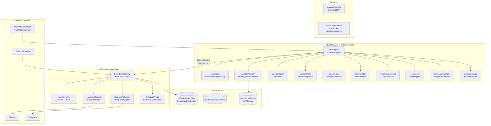
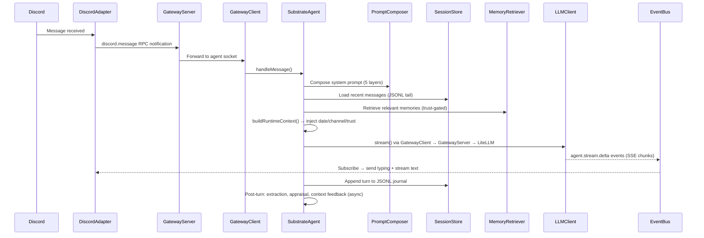
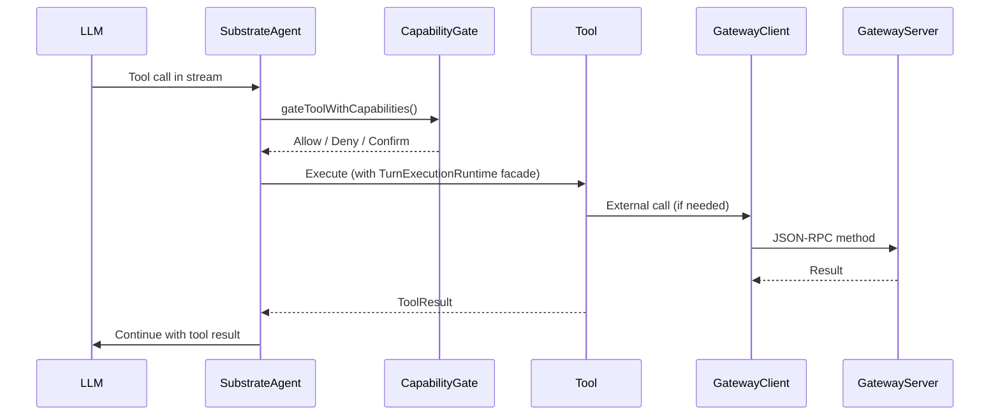
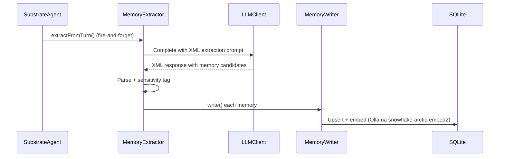
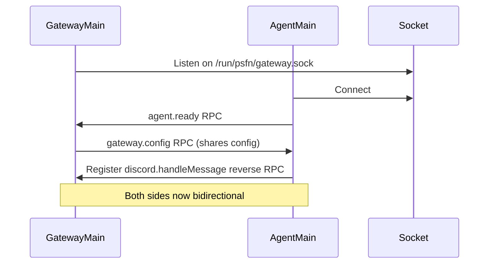

# Codebase Map

> Auto-generated by Cartographer. Last mapped: 2026-04-11T08:35:25Z

## System Overview

PSFN is a TypeScript runtime for long-lived AI companions. The central abstraction is **SubstrateAgent** — a persistent, stateful agent that can hold conversations across multiple channels (Discord, Telegram, API, Voice), maintain a trust-aware memory system, and modify its own prompts, skills, and values through agent tools.

The runtime is split across two processes (gateway + agent) connected by JSON-RPC 2.0 over a Unix socket. The gateway holds secrets and network access; the agent runs `--network=none` and calls back to the gateway for all external communication.



---

## Directory Structure

```
src/
├── app/                    # Runtime entrypoints and process wiring
│   ├── agent/              #   Agent process main (--network=none)
│   ├── cli/                #   Terminal chat interface
│   ├── e2e/                #   End-to-end test suite + runtime harness
│   ├── gateway/            #   Gateway process main
│   ├── maintenance/        #   One-off migration scripts
│   ├── operator/           #   Operator process main
│   └── startup/            #   Shared composition + config hydration
│
├── boundary/               # Trust enforcement and isolation layer
│   ├── custody/            #   Content sanitization helpers
│   ├── gateway/            #   JSON-RPC 2.0 server, 36 gateway methods, SSRF defenses
│   ├── integrations/       #   gateway-ops / local-ops pairs (beads, fs, git, shell, vault, web)
│   └── sandbox/            #   node:vm RLM sandbox for `analysis_workbench`
│
├── channels/               # Inbound protocol adapters
│   ├── api/                #   OpenAI-compatible REST + Voice WebSocket
│   ├── backplane/          #   Internal message bus routing
│   ├── discord/            #   Discord text + voice runtime
│   └── telegram/           #   Telegram polling + webhook
│
├── core/                   # Core runtime systems
│   ├── agent/              #   SubstrateAgent: turn execution, tool dispatch, event bridge
│   ├── contacts/           #   ContactStore: trust levels, social graph, identity verification
│   ├── emotion/            #   VAD state machine, EmotionObserver, persona adaptation
│   ├── identity/           #   Layered prompt stack, character card, PromptComposer
│   ├── intention/          #   Post-turn appraisal, active concerns, follow-ups, motivation
│   ├── internal-role-envelopes/ # Structured internal message envelopes
│   ├── scheduler/          #   60s-tick task scheduler, heartbeat, reflection templates
│   ├── self-model/         #   Metacognitive snapshots, internal state modeling
│   ├── session/            #   JSONL session journals, compaction, cross-channel continuity
│   ├── tools/              #   Tool registration, core/extended tier, lazy loading
│   └── turns/              #   Turn record types and turn state management
│
├── faculties/              # Higher-level capability modules
│   ├── context-feedback/   #   Post-turn context quality scoring
│   ├── core-memory/        #   Pinned/permanent core memory slots
│   ├── memory/             #   L2 memory: SQLite vec0, MemoryRetriever (trust-gated), extraction
│   ├── north-star/         #   Long-term goal tracking
│   ├── shards/             #   Ephemeral sub-agents (spawn_shard), max 5 concurrent
│   ├── skills/             #   Skill storage, loading, and tools
│   ├── subagents/          #   Named persistent sub-agent management
│   └── values/             #   Values journal and tools
│
├── operator/               # Admin and observability surfaces
│   ├── garden/             #   SvelteKit SPA admin UI (Garden), REST + WebSocket API
│   └── tool-health/        #   Tool call telemetry and health monitoring
│
├── persistence/            # Storage layer
│   ├── artifact-lifecycle/ #   Lifecycle hooks for companion artifacts
│   ├── backups/            #   Scheduled backup and restore verification
│   ├── importers/          #   Bulk data import helpers
│   ├── journals/           #   Append-only JSONL journal primitives
│   ├── postgres/           #   Optional Postgres adapter
│   ├── reflections/        #   Persisted reflection/introspection store
│   ├── repair/             #   JSONL journal repair and crash recovery
│   ├── sessions/           #   SessionStore: per-channel JSONL files + index
│   ├── cutover.ts          #   Split-root migration engine (~940 lines)
│   └── layout.ts           #   Single path authority for all persistence paths (~786 lines)
│
├── primitives/             # Low-level building blocks (no business logic)
│   ├── images/             #   Image encoding/decoding utilities
│   ├── llm/                #   LLMClient, FallbackRunner, ModelBudgetController, routing
│   └── voice/              #   STT/TTS connector registries, Deepgram, ElevenLabs, WebSocket
│
├── shared/                 # Cross-cutting utilities and contracts
│   ├── contracts/          #   SubstrateMessage, AgentResponse, TurnRecord types
│   ├── routing/            #   Message routing helpers
│   ├── telemetry/          #   Shared telemetry types
│   ├── time/               #   Time utilities, wall-clock helpers
│   ├── utils/              #   General utility functions
│   └── event-bus.ts        #   Typed EventBus (~50+ event families), coordination backbone
│
├── system/                 # Platform infrastructure
│   ├── capabilities/       #   Tier system (nursery/apprentice/autonomous/custom), 19 tokens
│   ├── config/             #   SubstrateConfig megaobject, required owner files, explicit examples
│   ├── lifecycle/          #   Lifecycle interface, startup/shutdown coordination
│   ├── modules/            #   Runtime module registry and hot-loading
│   ├── security/           #   Policy enforcement helpers
│   ├── settings/           #   EditableSettings (~120 fields), domain split
│   └── trust/              #   TrustLevel + SensitivityLevel types and policy helpers
│
└── test-support/           # Shared test fixtures and builders
```

---

## Module Guide

### `app/startup` — Process Composition

**Purpose**: Shared startup wiring that both the gateway and agent processes use. `hydrateCanonicalStartupConfig()` is the single function that loads all 9 owner files and assembles `SubstrateConfig`.

**Entry point**: `src/app/startup/index.ts`

**Key files**:
| File | Purpose |
|------|---------|
| `startup/index.ts` | Main composition helper: `hydrateCanonicalStartupConfig()` |
| `startup/parity.ts` | Runtime parity checks — ensures gateway + agent have matching feature flags |

**Exports**: `hydrateCanonicalStartupConfig`, composition helpers
**Dependencies**: `system/config`, `system/settings`, `system/capabilities`, `persistence/layout`

---

### `app/agent` — Agent Process Main

**Purpose**: Entrypoint for the isolated agent process. Connects to the gateway socket, instantiates SubstrateAgent, wires all channels, and registers reverse-RPC handlers.

**Entry point**: `src/app/agent/main.ts`

**Key files**:
| File | Purpose |
|------|---------|
| `agent/main.ts` | Process entrypoint; wires GatewayClient + SubstrateAgent |

**Dependencies**: `core/agent`, `boundary/gateway` (client-side), all channel adapters

---

### `app/gateway` — Gateway Process Main

**Purpose**: Entrypoint for the host-side gateway. Starts the JSON-RPC server, wires Discord/Telegram/Voice adapters, proxies all external egress.

**Entry point**: `src/app/gateway/main.ts`

**Key files**:
| File | Purpose |
|------|---------|
| `gateway/main.ts` | Process entrypoint; starts GatewayServer + all host adapters |

**Dependencies**: `boundary/gateway` (server-side), `channels/discord`, `channels/telegram`, `primitives/voice`, `primitives/llm`

---

### `boundary/gateway` — JSON-RPC Bridge

**Purpose**: Implements the gateway↔agent communication boundary. The server side (gateway process) exposes 36 JSON-RPC methods. The client side (agent process) is a typed proxy that calls them. All external network access (LLM, Discord, fetches) goes through here.

**Key files**:
| File | Purpose |
|------|---------|
| `gateway/server.ts` | JSON-RPC 2.0 server over NDJSON Unix socket; 36 methods, SSRF defenses |
| `gateway/client.ts` | Typed proxy client; streaming via `llm.chunk` notifications |
| `gateway/url-policy.ts` | SSRF: `evaluateUrlPolicy()` (sync) + `checkResolvedIP()` (async DNS rebinding) |
| `gateway/audit-log.ts` | JSONL audit trail for all gateway decisions |
| `gateway/fs-policy.ts` | File read/write policy, symlink defense via `realpathSync()` |

**Key patterns**:
- `JSONRPCServerAndClient` — bidirectional (handles `discord.handleMessage` reverse RPC)
- `redirect: 'manual'` + validate redirect target — prevents 302→private-IP SSRF
- `realpathSync()` before path policy — symlinks outside workspace → DENY
- Per-request `req-<counter>` IDs for streaming fan-out; gateway generates `gw-<counter>` IDs

**Exports**: `GatewayServer`, `GatewayClient` (satisfies `LLMProvider + EmbeddingService`)

---

### `boundary/sandbox` — Analysis Workbench Sandbox

**Purpose**: Implements the `analysis_workbench` tool: a sandboxed node:vm environment for bounded multi-stage analysis of large files, codebases, logs, transcripts, datasets, or evidence sets. Injects read-oriented file/repo/web helpers, memory search, LLM query, session message access, and evidence collection.

**Key files**:
| File | Purpose |
|------|---------|
| `analysis-workbench/sandbox.ts` | Runs code in node:vm with injected helpers, globalThis var transform |
| `analysis-workbench/tools.ts` | AgentTool wrapper for `analysis_workbench` |
| `sandbox/evidence.ts` | AnalysisWorkbenchEvidence collection from sandbox calls |

**Key patterns**:
- `var/let/const x =` → `globalThis.x =` regex transform: preserves variable state across iterations
- `FinalAnswerSignal` pattern: throw to exit the RLM loop
- Evidence hooks instrument `memory_search`, `llm_query`, `session_messages` calls

---

### `boundary/integrations` — Ops Pattern

**Purpose**: Provides dual-path implementations for external operations: `gateway-ops` (routes through JSON-RPC when in split mode) and `local-ops` (direct access in single-process mode). Covers: beads (issue tracker), filesystem, git, shell, vault, web fetch.

**Key files**:
| File | Purpose |
|------|---------|
| `integrations/web/gateway-ops.ts` | Web fetch via gateway (SSRF-safe) |
| `integrations/web/local-ops.ts` | Web fetch direct (single-process) |
| `integrations/git/` | Git self-modification ops (path allowlist, protected branches, audit log) |
| `integrations/beads/` | `bd` issue-tracker tool integration |
| `integrations/vault/` | Obsidian vault integration |

---

### `boundary/custody` — Content Sanitization

**Purpose**: Cleans untrusted content before it enters the agent context. Structural (strip HTML), pattern (injection delimiters), tagging (`<untrusted_content>`).

---

### `core/agent` — SubstrateAgent

**Purpose**: The heart of the runtime. `SubstrateAgent` wraps `@mariozechner/pi-agent-core` Agent, owns the turn execution pipeline, dispatches tools, bridges events to EventBus, and manages streaming/steering/follow-up queues.

**Entry point**: `src/core/agent/index.ts`

**Key files**:
| File | Purpose |
|------|---------|
| `agent/substrate-agent.ts` | Main class: wraps pi-agent-core, owns turn lifecycle |
| `agent/substrate-agent/turn-execution-runtime.ts` | TurnExecutionRuntime interface: 60+ methods for turn context |
| `agent/substrate-agent/tool-runtime-facade.ts` | Facade injected into each tool's execution context |
| `agent/substrate-agent/emotion-self-model-runtime.ts` | Emotion + self-model access during tool execution |
| `agent/event-bridge.ts` | Bridges Agent events → EventBus (text_delta, tool_start/end, thinking) |
| `agent/background-completion-policy.ts` | Governs when background continuations fire |
| `agent/background-completion-delivery-queue.ts` | Queue for async background completions |

**Key patterns**:
- `coreTools` / `extendedTools` split: `load_tools` meta-tool hot-swaps to extended set; reset each turn
- `steer()` — mid-stream interrupt for concurrent channel messages (Discord steer vs defer-latest)
- `followUp()` — queues a follow-up after the agent goes idle
- `buildRuntimeContext()` — injects date/time/channel/trust/model/tool directory into system prompt
- Post-turn action queue: memory extraction, intention appraisal, context feedback run after response

**Exports**: `SubstrateAgent`, `AgentLoop` (legacy alias via re-export)

---

### `core/session` — JSONL Session Journals

**Purpose**: Manages per-channel conversation journals. Each channel gets one append-only JSONL file. Supports compaction (LLM summarization of oldest 50% of messages), cross-channel continuity, and HMAC-SHA256 chain integrity.

**Key files**:
| File | Purpose |
|------|---------|
| `session/store.ts` | SessionStore: JSONL read/write, tail optimization, channel index |
| `session/compaction.ts` | Compacts oldest messages via LLM summarization |
| `session/continuity.ts` | Cross-channel context sharing (`channelsShareContinuity()`) |
| `session/manifests.ts` | Session manifests for context window building |
| `session/provenance.ts` | Message provenance tracking |

**Key patterns**:
- `resolvedPath` in ChannelCache prevents split-brain (always writes to first-loaded file)
- `listChannels()` two-path decode: `%`-encoded files decode directly; legacy files read first JSONL line
- `encodeURIComponent` / `decodeURIComponent` for channel IDs; legacy `:→-` / `/→_` fallback

---

### `core/identity` — Prompt Stack

**Purpose**: Manages the 5-layer prompt system. Stores layers in JSON (atomic write) + JSONL history. `PromptComposer` filters layers by context, sorts by precedence, computes a SHA-256 hash, and falls back to `lastKnownGood` on failure.

**Key files**:
| File | Purpose |
|------|---------|
| `identity/prompt-types.ts` | LayerType (base/operator/runtime/channel/task), PromptLayer |
| `identity/prompt-store.ts` | PromptLayerStore: JSON + JSONL history, seed from character card |
| `identity/prompt-composer.ts` | PromptComposer: context-aware composition, SHA-256, lastKnownGood |
| `identity/prompt-tools.ts` | 4 agent tools: list/get/update/toggle |
| `identity/character-card.ts` | Character card loader (skips placeholder values) |
| `identity/versioning.ts` | Character card versioning history |

**Layer order** (precedence): `base → operator → runtime → channel → task`

---

### `core/emotion` — Affective State

**Purpose**: Tracks the agent's emotional state as a VAD (Valence/Arousal/Dominance) state machine. `EmotionObserver` watches for emotional signals in completions. Drives `honne/tatemae` persona adaptation per trust tier.

**Key files**:
| File | Purpose |
|------|---------|
| `emotion/state.ts` | EmotionState: VAD machine with decay |
| `emotion/observer.ts` | EmotionObserver: classifies emotional signals from completions |
| `emotion/persona-adaptation.ts` | `getPersonaAdaptation(trustLevel)` → honne/tatemae prompt fragment |
| `emotion/classifiers/` | Per-emotion classifiers |

---

### `core/intention` — Post-Turn Appraisal

**Purpose**: After each turn, the intention system appraises what was said, updates active concerns, tracks pending follow-ups, fires care reminders, and maintains a motivation bridge. Runs asynchronously after the response is sent.

**Key files**:
| File | Purpose |
|------|---------|
| `intention/appraisal.ts` | Main appraisal pipeline, runs async after turn |
| `intention/active-concerns.ts` | Persistent store of active concerns |
| `intention/follow-ups.ts` | Pending follow-up tracking |
| `intention/care-reminders.ts` | Reminds the agent about pending care actions |
| `intention/motivation-bridge.ts` | Connects emotional state to motivation model |

---

### `core/contacts` — Trust and Social Graph

**Purpose**: SQLite (+ optional Postgres) store of known contacts with trust levels, relationship types, and contact notes. `primaryUserId` is locked to `'primary'` trust. Provides `resolveUserId()` for stable user identity.

**Key files**:
| File | Purpose |
|------|---------|
| `contacts/store.ts` | ContactStore: CRUD, trust level management |
| `contacts/types.ts` | Contact interface, RelationshipType, TrustLevel |
| `contacts/tools.ts` | 4 agent tools: contact_set_trust, contact_note, contact_lookup, contact_list |
| `contacts/identity-verification.ts` | Identity verification helpers |

---

### `core/scheduler` — Task Scheduler

**Purpose**: 60-second tick scheduler. Supports `every` (interval) and `one-shot` (at time) tasks. Heartbeat is a special `every` task. `skipFirstRun` option prevents first-tick burst. `updateTask()` enables runtime interval changes.

**Key files**:
| File | Purpose |
|------|---------|
| `scheduler/scheduler.ts` | Core scheduler: task registry, tick, wall-clock cadence |
| `scheduler/heartbeat-policy.ts` | HeartbeatPolicyStore: 4 default reflection templates, atomic JSON persist |
| `scheduler/schedule-tool.ts` | Unified `schedule` tool for task and reflection-template operations |

**Default reflection templates**: daily-review and weekly-review, scheduled during the configured rest window when enabled.

---

### `core/tools` — Tool Registry

**Purpose**: Manages the tool catalog. Registers tools as `core` or `extended`. `load_tools` meta-tool (always in core) hot-swaps to the extended set. Each turn resets back to core tools.

**Key files**:
| File | Purpose |
|------|---------|
| `tools/registry.ts` | Tool registry: register, list, get by name |
| `tools/load-tools.ts` | `load_tools` meta-tool implementation |

**Core tools**: analysis_workbench, spawn_shard, memory_write/import, contact_lookup/list, self_restart/rebuild, load_tools

**Extended tools** (loaded on demand): 6 git, 4 prompt, 3 heartbeat/schedule, contact_set_trust, contact_note + more

---

### `core/self-model` — Metacognition

**Purpose**: Maintains metacognitive snapshots of the agent's internal state — what it knows about itself, its current concerns, confidence levels, and operational posture.

---

### `core/turns` — Turn Records

**Purpose**: Turn record types and turn state management. `TurnRecord` captures the full context of a conversation turn including messages, tool calls, token usage, and provenance.

---

### `faculties/memory` — L2 Memory System

**Purpose**: The episodic memory system. Stores extracted, salient facts in SQLite with sqlite-vec embeddings (1024d, snowflake-arctic-embed2 via Ollama). Retrieval is trust-gated via `evaluateMemoryPolicy()`. Extraction runs async after turns via an LLM-powered XML-prompt pipeline.

**Key files**:
| File | Purpose |
|------|---------|
| `memory/retriever.ts` | MemoryRetriever: composite scoring, trust-gated, configurable limits |
| `memory/writer.ts` | MemoryWriter: upsert with sensitivity + consent flags |
| `memory/extraction/extractor.ts` | Async extraction pipeline: LLM → XML parse → sensitivity tag |
| `memory/extraction/prompt.ts` | Extraction prompt (updated for relational memories) |
| `memory/store.ts` | SQLite vec0 store: CRUD, nearest-neighbor search |
| `memory/decay.ts` | Salience decay scheduler task |
| `memory/tools.ts` | memory_write, memory_import_batch agent tools |

**Memory types**: episodic, semantic, procedural, emotional, relational (with optional contactId FK)

**Sensitivity levels**: public → personal → intimate → confidential

**Key patterns**:
- Distance-based similarity: `similarity = 1 - distance`
- `Buffer.from(float32Array.buffer)` for sqlite-vec embedding storage
- `memoryBudgetPct` (default 20%) limits retrieval token budget
- `extractionThresholdPct` (default 30%) triggers extraction when session content exceeds % of context window

---

### `faculties/shards` — Ephemeral Sub-Agents

**Purpose**: Manages ephemeral sub-agents launched via `spawn_shard`. Each shard gets a unique `shard:<uuid>` channelId, shares the parent's LLM/memory, has no extraction/archival, depth=1 max (no sub-shards), max 5 concurrent.

**Key files**:
| File | Purpose |
|------|---------|
| `shards/manager.ts` | ShardManager: lifecycle, concurrency cap, cleanup |
| `shards/tools.ts` | spawn_shard agent tool |

---

### `faculties/skills` — Skill System

**Purpose**: Loads and manages the agent's skills — procedural knowledge stored as structured documents. The agent can install, list, and invoke skills via tools.

---

### `faculties/values` — Values Journal

**Purpose**: Persistent journal of the agent's values. The agent can read, update, and reflect on its values via tools. Values persist across sessions.

---

### `faculties/context-feedback` — Context Scoring

**Purpose**: After each turn, scores the quality of the context window (memory relevance, session length, tool use appropriateness). Feeds back into retrieval and compaction decisions.

---

### `faculties/core-memory` — Pinned Memory

**Purpose**: Permanent, always-loaded memory slots (e.g., the agent's name, core facts). These bypass the retrieval system and are always present in context.

---

### `faculties/north-star` — Long-Term Goals

**Purpose**: Tracks the agent's long-term goals. Goals persist across sessions and inform intention appraisal.

---

### `faculties/subagents` — Named Sub-Agents

**Purpose**: Manages persistent named sub-agents (distinct from ephemeral shards). Useful for long-running background work with named identities.

---

### `channels/discord` — Discord Adapter

**Purpose**: Full Discord integration including text conversations and voice. `DiscordAdapter` steers concurrent messages (mid-stream) rather than dropping them. `DiscordVoiceRuntime` manages voice turn lifecycle with STT→agent→TTS pipeline.

**Key files**:
| File | Purpose |
|------|---------|
| `discord/adapter.ts` | DiscordAdapter: steer vs defer-latest for concurrent messages |
| `discord/voice-runtime.ts` | DiscordVoiceRuntime: voice turn lifecycle |
| `discord/lifecycle-notifier.ts` | Reboot/startup lifecycle notifications to Discord |

**Key patterns**:
- `sendTyping()` requires type narrowing (not on PartialGroupDMChannel)
- `setVoiceHandler()` field on adapter — preferred over text handler when set

---

### `channels/telegram` — Telegram Adapter

**Purpose**: Telegram integration with polling and webhook modes. Supports text and attachments.

---

### `channels/api` — OpenAI-compatible API

**Purpose**: Node.js `http` (no framework) server exposing `/v1/chat/completions` with SSE streaming. `X-Session-ID` header → `api:<sessionId>` channelId. Seeds session with prior messages from request. Optional `API_KEY` Bearer auth. Voice WebSocket endpoint for real-time voice conversations.

**Key files**:
| File | Purpose |
|------|---------|
| `api/server.ts` | HTTP server: chat completions + voice WebSocket |
| `api/sse.ts` | SSE streaming helpers |
| `api/voice-ws.ts` | Voice WebSocket runtime |

**Activation**: `API_PORT` env var activates

---

### `channels/backplane` — Internal Message Bus

**Purpose**: Internal routing for messages between channels and subsystems. Handles cross-channel routing and message dispatch coordination.

---

### `operator/garden` — Admin UI

**Purpose**: SvelteKit SPA at `/garden`. Full-featured admin interface for memory, sessions, contacts, identity, settings, scheduler, and tool health. Backed by REST API at `/api/admin/*` and real-time telemetry via WebSocket at `/api/admin/events`.

**Key sections**:
- Dashboard — overview + SSE event stream
- Memory Blossoms — memory browser with type/sensitivity filters
- Conversation Roots — session viewer
- Garden Visitors — contacts + trust management
- Prompt Soil — layered prompt stack editor
- Garden Rhythms — scheduler + heartbeat templates
- Active Branches — shard viewer
- Identity — character card display
- Settings — all ~120 editable settings with validation ranges
- Garden Primer — internal reference for config knobs

**Auth**: `ADMIN_TOKEN` Bearer token

---

### `operator/tool-health` — Tool Telemetry

**Purpose**: Tracks tool call success/failure rates, latency, and usage patterns. Surfaces metrics in Garden UI.

---

### `persistence/sessions` — SessionStore

**Purpose**: Per-channel JSONL session files with tail-read optimization (only reads last N lines for recent context), HMAC-SHA256 integrity chain, and crash recovery via `repair/`.

---

### `persistence/layout.ts` — Path Authority

**Purpose**: Single source of truth for all persistence paths (~786 lines). Enforces fail-closed path rules. Production mode rejects overlapping mutable roots. Two-root topology: `system-data` (operator state) and `companion-data` (companion artifacts).

---

### `persistence/cutover.ts` — Migration Engine

**Purpose**: Split-root migration engine (~940 lines). Handles migration from legacy single-root to split system-data/companion-data topology.

---

### `primitives/llm` — LLM Client

**Purpose**: All LLM interaction. `LLMClient` wraps `@mariozechner/pi-ai`, adds retry/fallback logic, deliberation (multi-candidate sampling), budget tracking, and streaming normalization. Routes through LiteLLM proxy.

**Key files**:
| File | Purpose |
|------|---------|
| `llm/client.ts` | LLMClient: stream() + complete(), normalizeContent(), reasoning support |
| `llm/fallback-runner.ts` | FallbackRunner: try candidates in order |
| `llm/budget-controller.ts` | ModelBudgetController: token budget tracking |
| `llm/discovery.ts` | ModelDiscovery: fetches /v1/models from LiteLLM (5-min cache) |
| `llm/routing.ts` | Model routing candidates |
| `llm/tokens.ts` | estimateTokens() (chars/4 heuristic) |
| `llm/models.ts` | createModel() factory for LiteLLM proxy custom models |

**Key patterns**:
- `normalizeContent()` + `extractQuotedText()`: handles pi-ai + LiteLLM content block format bug (stringified `[{'type': 'text', 'text': '...'}]`)
- `thinkingFormat` compat: kimi-k2.5→`'qwen'`, glm-5→`'zai'`
- `thinking_delta` bridging → `agent.stream.thinking` EventBus event
- `ModelPurpose`: chat | background | reasoning | longContext; `resolveModelSlot()` with fallback chains

---

### `primitives/voice` — Voice Pipeline

**Purpose**: STT/TTS connector registries. Deepgram (streaming WebSocket STT) and ElevenLabs (streaming TTS). Voice transport layer handles the full audio pipeline.

**Key files**:
| File | Purpose |
|------|---------|
| `voice/connectors/stt/` | STT connectors: Deepgram, registry |
| `voice/connectors/tts/` | TTS connectors: ElevenLabs, registry |
| `voice/transport/` | WebSocket voice transport |
| `voice/runtime.ts` | Voice turn runtime coordination |
| `voice/policies.ts` | Voice policy (activation, routing) |

---

### `system/config` — Configuration

**Purpose**: Assembles `SubstrateConfig` (the megaobject passed to all runtime components). Loads and validates required owner JSON files; distributed `config/*.seed.json` files are examples only. `ConfigStorePort` is the database-backed config interface.

**Key files**:
| File | Purpose |
|------|---------|
| `config/runtime-config.ts` | SubstrateConfig type + assembly |
| `config/settings-contract.ts` | Owner file map and schema metadata |
| `config/settings-contract-guard.ts` | Owner-file validation on write |

**9 owner files**: `settings.json`, `models.json`, `scheduler.json`, `capability-tier.json`, `channels.json`, `skills.json`, `trust-policy.json` (+ 2 more)

---

### `system/settings` — Editable Settings

**Purpose**: `EditableSettings` interface (~120 fields) with domain split: runtime, models, capabilities, scheduler. `loadSettings`/`saveSettings`/`applySettings`/`parseSettingsForm`. Atomic write via `.tmp`+rename. Validation ranges in `SETTINGS_VALIDATION`. Settings mutate live config in place — components read per-call.

---

### `system/capabilities` — Capability Tiers

**Purpose**: The safety gate for all tool calls. Tier system: `nursery | apprentice | autonomous | custom`. 19 capability tokens. `gateToolWithCapabilities()` checks tier before tool execution. Safeguards provide additional per-tool safety checks.

**Key files**:
| File | Purpose |
|------|---------|
| `capabilities/tiers.ts` | Tier definitions and upgrade paths |
| `capabilities/tokens.ts` | 19 capability tokens |
| `capabilities/gate.ts` | `gateToolWithCapabilities()` |
| `capabilities/safeguards.ts` | Per-tool safety checks |
| `capabilities/confirmations.ts` | Human-in-the-loop confirmation flows |
| `capabilities/eligibility.ts` | Eligibility checks for tier upgrades |

---

### `system/trust` — Trust Policy

**Purpose**: Type definitions and policy engine for the trust/privacy model. `evaluateMemoryPolicy()` implements 5-layer decision: operator → consent → trust → visibility → default.

**Key files**:
| File | Purpose |
|------|---------|
| `trust/types.ts` | TrustLevel, SensitivityLevel, ChannelVisibility, TRUST_CEILING |
| `trust/policy.ts` | `evaluateMemoryPolicy()`, `classifyChannel()`, `channelsShareContinuity()` |

**Trust levels**: primary → trusted → regular → public
**Sensitivity levels**: public → personal → intimate → confidential

---

### `system/lifecycle` — Startup/Shutdown

**Purpose**: `Lifecycle` interface (`start()` / `stop()`). All runtime components implement this. `closeAllConnections()` on admin/API servers for SSE cleanup.

---

### `system/modules` — Module Registry

**Purpose**: Runtime module registry. Modules can be loaded, unloaded, and hot-reloaded. Enables the self-build target (Purrsephone installing new capabilities).

---

### `shared/event-bus.ts` — EventBus

**Purpose**: The coordination backbone. Typed EventBus with ~50+ event families. All async coordination (streaming, tool events, lifecycle) routes through here.

**Key event families**:
- `agent.stream.delta` — streaming text chunks
- `agent.stream.thinking` — reasoning token stream
- `agent.tool.start` / `agent.tool.end` — tool execution lifecycle
- `agent.idle` — agent finished responding
- `discord.message` — incoming Discord message notification
- `llm.chunk` — gateway LLM streaming notification

---

### `shared/contracts` — Runtime Contracts

**Purpose**: Shared type contracts between gateway and agent processes.

**Key files**:
| File | Purpose |
|------|---------|
| `contracts/runtime.ts` | SubstrateMessage, AgentResponse, TurnRecord |
| `contracts/gateway-protocol.ts` | JSON-RPC method types for gateway↔agent |

**Note**: `SubstrateMessage.timestamp` serializes as ISO string over JSON-RPC; deserialized back to `Date` in agent.

---

## Data Flow

### Incoming Message (Discord → Agent → Response)



### Tool Execution



### Memory Extraction (Async Post-Turn)



### Gateway ↔ Agent Startup



---

## Conventions

### Naming
- Files: `kebab-case.ts`
- Classes: `PascalCase`
- Interfaces: `PascalCase` (no `I` prefix)
- Types: `PascalCase`
- Functions: `camelCase`
- Constants: `SCREAMING_SNAKE_CASE` for module-level, `camelCase` for local

### Tool Pattern
All tools follow the `AgentTool` pattern from `@mariozechner/pi-agent-core`:
- TypeBox schema for parameters
- Receives `toolCallId`, `AbortSignal`, `onUpdate` (streaming)
- Returns `string` (tool result text)
- Tools injected with `TurnExecutionRuntime` facade for context access

### Config Pattern
- Mutable runtime settings live in JSON owner files (not `.env`)
- `.env` is for secrets, socket paths, and bootstrap overrides only
- All settings exposed through Garden admin UI
- Required owner files fail closed when missing; copy/import examples intentionally before startup.

### Error Handling
- Fail closed — never swallow errors or silently fall back
- No legacy compatibility shims
- `realpathSync()` before any path policy check (symlink defense)
- All external network calls go through gateway SSRF validation

### Logging
- `createComponentLogger(name)` returns a Winston child logger with `{component}` tag
- Format: `HH:mm:ss LEVEL [Component] message {metadata}`
- `LOG_LEVEL` env var (default: info)
- Custom levels: error/warn/info/debug/trace
- Demo/CLI scripts intentionally keep `console.log`

### Persistence
- JSONL append-only for sessions (L0) — never mutate existing lines
- SQLite for memories (L2) — mutable, with salience decay
- All file paths go through `persistence/layout.ts`
- Atomic writes via `.tmp` + rename
- `compactionThresholdPct` (default 70%) triggers auto-compaction of oldest 50% of messages

---

## Gotchas

1. **Content block format bug**: pi-ai + LiteLLM streaming sometimes delivers content as stringified `[{'type': 'text', 'text': '...'}]`. `normalizeContent()` in `primitives/llm/client.ts` unwraps this. Compounds each turn if not caught.

2. **SessionStore split-brain**: Always use `resolvedPath` from the ChannelCache, not the raw channel ID. The first-loaded file path wins for the lifetime of the channel cache entry.

3. **node:vm var persistence**: `var/let/const x =` declarations lose scope across `vm.Script` executions. The sandbox transforms them to `globalThis.x =` to persist across iterations.

4. **pi-ai conversation seeding**: Conversations must start with a user message. When replaying `AssistantMessage` for context, provide empty/zero placeholders for `api`, `provider`, `model`, `usage`, `stopReason`.

5. **SSE endpoint flushing**: `res.writeHead()` alone doesn't flush to HTTP client. Must call `res.write(':ok\n\n')` immediately after to flush headers. Use `server.closeAllConnections()` before `server.close()` to handle lingering SSE streams.

6. **SSRF IPv4-mapped IPv6**: `isPrivateIP()` must handle `::ffff:` prefix — strip before re-checking. `fetch()` must use `redirect: 'manual'` to prevent 302→private-IP bypass.

7. **Memory extraction is probabilistic**: The LLM picks different facts each run. E2E tests should assert on retrieval (deterministic) rather than extraction (non-deterministic).

8. **`sendTyping()` type narrowing**: Not available on `PartialGroupDMChannel` — always type-narrow before calling.

9. **LiteLLM is a required security boundary**: Never add "fallback to direct provider" paths. The proxy keeps keys away from the agent process.

10. **discord.handleMessage is a reverse RPC**: The gateway sends voice transcripts *to* the agent, not the other way. Uses `JSONRPCServerAndClient` bidirectional mode.

11. **`vm.Script` timeout**: The `timeout` option goes in `runInContext()`, NOT in `new vm.Script()` constructor.

12. **Thinking format compat**: kimi-k2.5 uses `'qwen'` thinkingFormat, glm-5 uses `'zai'`. Pass via `compat.thinkingFormat` on the model object.

13. **Tool counts in docs**: Do NOT rely on hardcoded tool counts. The live set is wired at runtime. Check `core/tools` registry or `buildRuntimeContext()` tool directory output.

---

## Navigation Guide

**To add a new agent tool**:
1. Create tool in appropriate module (e.g., `core/contacts/tools.ts`)
2. Follow `AgentTool` pattern (TypeBox schema, returns string)
3. Register in `bootstrap/composition.ts` or `app/agent/main.ts`
4. Add to core or extended tier in `core/tools/registry.ts`
5. Check `system/capabilities` — does this tool need a capability gate?

**To add a new channel adapter**:
1. Create directory under `channels/<name>/`
2. Implement `Lifecycle` interface (`start()` / `stop()`)
3. Register in `app/gateway/main.ts` (if host-side) or `app/agent/main.ts` (if agent-side)
4. Wire to EventBus for incoming messages
5. Add activation env var (follow `API_PORT` / `ADMIN_TOKEN` pattern)

**To add a new gateway RPC method**:
1. Add handler in `boundary/gateway/server.ts` via `server.addMethod()`
2. Add typed caller in `boundary/gateway/client.ts`
3. Add type to gateway protocol contracts in `shared/contracts/`

**To modify LLM routing**:
1. Edit `primitives/llm/routing.ts` for candidate logic
2. Edit `system/config/runtime-config.ts` for new model slots
3. Update `system/settings/` for admin-editable settings
4. Add `ModelPurpose` entry if needed

**To add a new memory type**:
1. Add to union in `faculties/memory/types.ts`
2. Update extraction prompt in `faculties/memory/extraction/prompt.ts`
3. Update Garden UI memory type filter

**To add a new editable setting**:
1. Add to `EditableSettings` in `system/settings/`
2. Add to `SETTINGS_VALIDATION` if range-constrained
3. Add to appropriate owner JSON file schema in `system/config/settings-contract.ts`
4. Add Garden UI form field in `operator/garden/`

**To add a new prompt layer**:
1. Use `prompt_update` agent tool (or `PromptLayerStore.upsert()` directly)
2. Set `LayerType` appropriately (base/operator/runtime/channel/task)
3. Agent cannot modify `base` or `operator` layers — only runtime/channel/task

**To add a scheduled reflection template**:
1. Use `schedule action="upsert_template"` or the Garden scheduler UI
2. Or edit `HeartbeatPolicyStore` directly
3. Templates sync to scheduler tasks as `reflection:<id>` on startup

**To trace a Discord message end-to-end**:
`channels/discord/adapter.ts` → EventBus `discord.message` → `boundary/gateway/server.ts` notification → Unix socket → `boundary/gateway/client.ts` → `core/agent/substrate-agent.ts::handleMessage()` → LLM stream → EventBus `agent.stream.delta` → Discord reply

**To understand why a tool was denied**:
Check `system/capabilities/gate.ts` — `gateToolWithCapabilities()` returns the denial reason. Check current tier in `capability-tier.json`. Check safeguards in `system/capabilities/safeguards.ts`.

**To check persistence paths**:
`persistence/layout.ts` is the single source of truth. All path construction goes through it.

---

If cartographer helped you, consider starring: https://github.com/kingbootoshi/cartographer - please!
