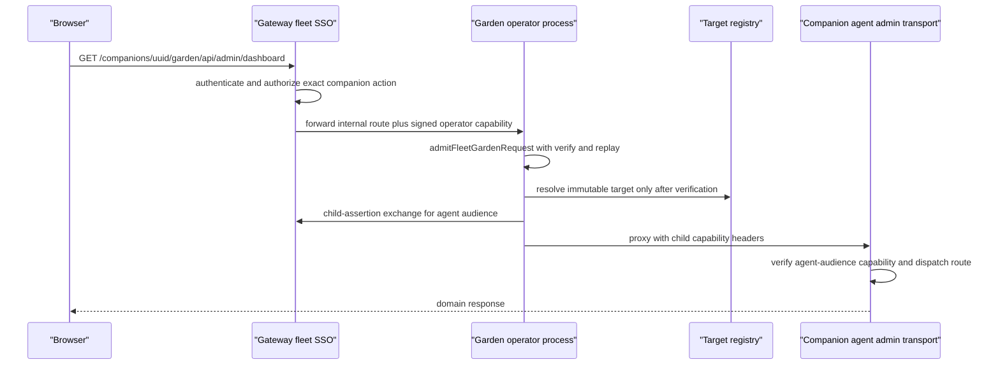

# Garden Operator Plane and Admin UI

> **Terminology:** Per charter §8.12 the multi-companion system is a
> **companion cluster**; "fleet" persists only in code identifiers (the
> `fleet-auth` subsystem, `fleet-garden-*` modules). The companion control plane
> is **Garden**, and this page documents its **operator plane** — the process,
> surfaces, and machinery a human operator uses to inspect and steer companions.
> The charter is operator-owned law: [docs/PSFN_PROJECT_CHARTER.md](/docs/PSFN_PROJECT_CHARTER.md).
> Authority-model prose lives in [operator/fleet-auth.md](/openwiki/operator/fleet-auth.md),
> the human-approval flow Garden drives in [security/approval-envelope.md](/openwiki/security/approval-envelope.md),
> and deployment lifecycles in [operations.md](/openwiki/operations.md).

Garden is the operator plane, not a companion surface. In the split runtime
(gateway, isolated agent, operator) the operator process is the only process
that runs a Garden surface: it serves the SvelteKit Garden admin UI
(`admin-ui/`) and the canonical `/api/admin/*` API on `ADMIN_PORT`. The gateway
is the browser authentication and authorization authority and the only signer
of request capabilities; each companion's agent owns its runtime and canonical
owner files; the operator process brokers between them through per-request,
companion-bound admission and transport selection.

## Runtime topology and process surfaces

There are two operator-side server shapes plus the agent-side transport server:

- **`AdminServer`** (`src/operator/garden/server.ts`) — the original admin GUI
  server. It serves the Garden UI shell and the `/api/admin` endpoints in
  process, supports both admission modes (standalone token and fleet
  principal), and is the surface used when the operator runs inside the
  gateway/agent process topology. In fleet-principal mode it buffers the
  request body, admits through `admitFleetGardenRequest`, and dispatches with
  the admitted `GardenRequestContext`; WebSocket upgrades go through the same
  admission.
- **`GardenOperatorSurface`** (`src/operator/garden/operator-surface.ts`) — the
  dedicated operator-process surface. It owns a `GardenOperatorRouting`
  strategy (fixed transport or fleet control plane), an `AdminServerTransport`
  for static assets, optional HTTPS mTLS (`fleetSsoTls`) for non-loopback
  fleet-auth listeners, a direct operator→gateway confirmation resolver, a
  fleet child-assertion client, fleet direct-database and intake-quarantine
  read ports, and a Postgres readiness snapshot for `/health`.
- **`GardenAdminTransportServer`** (`src/operator/garden/transport-server.ts`) —
  the companion-bound agent side of the admin transport: a Unix socket or
  HTTPS mTLS listener that admits operator-forwarded child capabilities and
  dispatches into the same `buildAdminApiRoutes` domain API. It carries the
  agent's own runtime readiness gate (`markRuntimeReady` / `withdrawReadiness`).

*Every fleet Garden request passes gateway authorization, operator admission with replay consumption, immutable target resolution, and an agent-audience child-assertion exchange before a domain module runs.*

## Operator process wiring

The operator entrypoint (`src/app/operator/main.ts`) requires `ADMIN_PORT`,
hydrates the runtime config, and — when fleet auth is enabled — requires the
complete `companionFleet` roster and builds the `FleetGardenTargetRegistry`,
`FleetGardenControlPlane` (with the `AtomicRequestCapabilityReplayPort`),
`FleetGardenAdminTransportProxy`, `FleetGardenDirectDatabase`, and
`FleetModelUsageService` before constructing the surface. In standalone mode
it resolves the fixed admin transport endpoint from
`ADMIN_TRANSPORT_MODE`/`ADMIN_TRANSPORT_SOCKET`/`ADMIN_TRANSPORT_TLS_*`. It
seals Postgres store readiness before marking the surface ready, and wires the
operator confirmation resolver and child-assertion client from
`GATEWAY_OPERATOR_API_BASE_URL` (`gatewayAuthPlan`).

## Authentication and admission

Admission mode is resolved once at startup by `resolveGardenAdmissionMode`
(`src/operator/garden/garden-admission.ts`):

- **`standalone-token`** — the operator surface authenticates with
  `ADMIN_TOKEN` presented as a bearer header or the `psfn_token` HttpOnly
  cookie (`checkAdminRequestAuth`). `validateAdminAuthStartupPolicy` refuses to
  start without a token unless `ADMIN_ALLOW_INSECURE=true`, and insecure mode
  is only permitted on a loopback host. Browser requests without credentials
  are redirected to `/login`; API and htmx requests receive `401`.
- **`fleet-principal`** — no shared token exists. Every request carries a
  short-lived signed request capability (`x-psfn-request-capability`) plus an
  encoded capability context header (`x-psfn-capability-context`). The gateway
  mints the capability; the Garden verifies signature, audience, action,
  companion, authority versions, and replay state.

`admitFleetGardenRequest` is the single admission function used by every fleet
listener (operator surface, admin server, agent transport). Its order of
operations matters: validate request metadata → reject and strip any
browser-authority headers (`authorization`, `cookie`, `x-contact-id`,
`x-actor-id`, `x-role`, and the other `FLEET_CALLER_AUTHORITY_HEADERS`) →
compile the agent or operator request target (method, path, query policy, body
digest) → for `always`-public routes reject any capability material, for
`feature_off_only` routes deny 404, otherwise require the capability headers →
parse the capability context → verify the signed capability against the
operator or agent audience → consume replay → deny generically on every
failure. Denials use generic statuses (`404` for unknown routes/selections so
companion existence is not revealed, `401` for missing capability, `403` for
invalid/replayed/context-mismatched capability, `409` for already-consumed,
`503` for replay-authority failure) and always record a reason-coded denial.

## The fleet control plane

`FleetGardenControlPlane` (`src/operator/garden/fleet-garden-control-plane.ts`)
is the deep admission seam for the fleet-scoped Garden. Callers hand it a raw
companion-scoped request; it hides companion resolution, capability
verification, replay consumption, context binding, immutable target-registry
resolution, and failure normalization behind `admit()`, `probe()`, and the
registry accessor. It enforces these invariants:

- every admitted request carries exactly one immutable, server-derived
  companion target parsed from the canonical route — never from a header, body
  field, cookie, or browser switcher state;
- malformed, unknown, unauthorized, mismatched, stale, and replayed selections
  deny before the target registry is consulted;
- route target, signed capability, audience, and authenticated context must be
  equal for the same companion or the request denies with no fallback;
- there is no process-global mutable "current companion": each `admit()` call
  constructs its own frozen route-derived binding, so simultaneous requests for
  companions A and B cannot cross;
- `ADMIN_TOKEN` or any legacy shared-token authority has no seam: admission
  rejects requests that carry bearer/cookie caller authority.

`FleetGardenTargetRegistry` is the immutable routing identity. Entries hold the
canonical companion ID, the exact socket or mTLS agent-admin endpoint, and the
derived `expectedAgentAudience` (`agent:<companionId>`). An incomplete,
colliding, or malformed registry fails construction instead of starting a
Garden that could route wrongly; health/probe state lives in a separate mutable
map that can never rewrite where a companion's requests go. Endpoint identity
is derived, never caller-supplied: socket mode names
`garden-admin-<companionId>.sock` in the gateway socket directory
(`resolveCompanionAdminTransportSocketPath`), and network mode derives the
Kubernetes Service label and the SPIFFE URI path `/psfn/agent/<companionId>`
from the validated companion ID (`resolveFleetGardenNetworkClientEndpoint`).
The agent-side transport server in network mode requires HTTPS mTLS with
`mtls-spiffe` peer authorization and exactly one SPIFFE URI SAN on its own
certificate.

## Operator routing and transport proxies

`GardenOperatorRouting` selects the transport/admission strategy once at
startup: a **fixed** `GardenAdminTransportProxy` for single-companion mode or a
**fleet** `FleetGardenOperatorRouter` backed by the control plane. Combining
`fleetControlPlane` with `transportEndpoint` refuses startup; a fleet transport
without a fleet control plane refuses startup; fleet routing requires a
resolved roster and Fleet Auth configuration.

`FleetGardenOperatorRouter` dispatches an admitted request in a fixed order:
public and non-`/api/admin` targets dispatch locally; `POST
/api/admin/confirmations/resolve` is resolved by the direct operator→gateway
confirmation resolver when present; `FleetGardenDirectDatabase` handles the
invariant-11 routes served from companion-bound Garden DB services
(`/api/admin/model-usage*` and the observer-eval-sidecar read routes); intake
quarantine reads are served from companion-bound mounted snapshots; the
fleet-wide `/api/admin/fleet-model-usage` fan-out is handled from the
gateway-signed roster (the admitted actor's `fleetCompanionIds` must include
the selected companion); and every remaining agent-owned route is proxied to
the admitted companion's transport with an exchanged child capability. A
WebSocket upgrade follows the same admission and is only forwarded when the
target is exactly `WS /api/admin/events` with no query.

`GardenAdminTransportProxy` (`src/operator/garden/transport-client.ts`) is the
transport adapter in both modes. In fleet mode it forwards only an
allowlisted set of headers (`accept`, `content-type`, `if-match`,
`x-request-id`, …) plus the exchanged capability headers, and always strips the
operator `ADMIN_TOKEN` bearer credential and the `psfn_token` session cookie
before the request reaches the agent — the agent authenticates transport peers
via mTLS/SPIFFE and must never hold the operator credential (x5rt.10). It also
owns the health probe (`GET /api/admin/__transport_probe__`) and WebSocket
forwarding with capability expiry.

The child-assertion exchange (`fleet-child-assertion-client.ts`) calls the
gateway `POST /internal/fleet-auth/child-assertions` with the parent
capability, request/decision IDs, target digest, and expected agent audience,
and returns an exact `agent:<companionId>`-audience child capability. The
response is validated key-for-key (schema version, token bounds, version keys,
parent binding) before it is trusted.

## Route authorization and capability compilation

`GARDEN_ROUTE_AUTHORIZATION` (`src/boundary/fleet-auth/garden-route-authorization.ts`)
is the route authorization catalogue built from route-authorization groups.
Every declared Garden route (page and API) maps to a `FleetAuthAction`, a base
role, a workspace scope and resource area, a subject relation
(`none` / `current_companion` / `self` / `self_or_co_subject`), and conjunctive
requirements:

- **assurance** — `oauth` (authenticated Discord SSO session; the only
  authentication tier), `escalated` (a consumed audited escalation grant,
  reserved for other-humans' sensitive memories and cogsec remediation), or
  `privacy_break_glass` (the gateway mints `break_glass` session assurance from
  the same audited escalation grant path);
- **confirmation** — `none` or `explicit`;
- **approvals** — `contact_approval`, `cogsec`, and/or `independent_reviewer`;
- **publicAccess** — `never`, `always`, or `feature_off_only`;
- **recoveryAccess** — `forbidden` or `trusted_host_exact_scope`.

A duplicate route classification fails the catalogue build; a classified route
with no compiled capability (or an undeclared route at server construction)
fails `assertGardenRouteDeclarationsCovered`.

`compileGardenRouteDeclarations` (`garden-route-capabilities.ts`) merges route
handlers with their capability: canonical pattern, query-field policies
(singleton/multiple cardinality, bounded values), and body policy
(`forbidden` / `optional` / `required`, with byte caps — 64 KB default, larger
upload and chat ceilings). The route matchers (`route-matchers.ts`) expose the
canonical `capabilityPattern` used by the fleet request-target boundary and
decode URL segments defensively (rejecting encoded traversal, control
characters, and non-canonical encodings).

## The /api/admin domain API and audit

`buildAdminApiRoutes` (`src/operator/garden/api-routes.ts`) composes the entire
domain API from per-domain builders — overview/dashboard, memory, episodic and
group memory, biographical review, wiki and wiki scopes, sessions, settings,
channel envelope, bearer-companion and intake source lists, contacts and
approvals, rooms, room arbiter, places, enrollment, graph proposals, concerns,
images, identity, prompts, scheduler, automata, wishlist, action pipe, shards,
skills, subsystem health, partner-affect shadow, tool conformance, ICP
autonomy, model discovery, values and reflection journals, shared workspace,
intake quarantine and drift review, privacy break glass, observer eval
sidecar, model usage, and the confirmation queue. It receives the
audit-timeline appender and body reader; handlers receive a
`GardenRequestContext` derived from the authenticated request (or built
standalone). The break-glass surfaces — memory/profile disclose plus the
companion-private values and reflection journals, which are welfare-sensitive
substrates an operator may not read through an ordinary admin GET — demand the
`break_glass` session assurance and emit `memory_access` audit evidence,
failing closed if the audit append itself fails so a disclosure never happens
without a durable record. The services behind the API are declared by
`GardenAdminDomainServices` (`admin-contract.ts`) and, for the in-process agent
Garden, constructed by `createInProcessGardenAdminContract`
(`local-admin-contract.ts`), which binds companion data directories and the
owner-file config store per companion.

Audit has two layers:

- **`AdminAuditTimelineStore`** (`audit-timeline.ts`) — a bounded in-memory
  timeline (500 entries, newest first) with the canonical action types
  (`tool_invocation`, `tool_activation`, `identity_edit`, `external_action`,
  `memory_mutation`, `memory_access`, `settings_change`, `confirmation`,
  `charge_decision`, `gateway_policy`, `autonomy_control`), decisions
  (`allowed` / `denied` / `needs_approval`), and time ranges (`15m` … `all`).
- **Persistent audit history** (`services/audit-history-service.ts`) — the
  `GardenAuditHistoryJsonlStore` appends `garden_audit_history` records to a
  JSONL file and re-reads them under a file-identity discipline: device/inode/
  size/mtime are captured before and after the read, and any change (or a
  partial read) throws so a torn or rewritten file is never served. The
  `AdminAuditHistoryDataService` merges `garden`, `gateway`, and `charge`
  sources and renders entry IDs through the HMAC-derived opaque-ID keyring
  (`audit-opaque-id-keyring.ts`), keyed from the agent's role-bound worker
  proof so no gateway root key is delegated. `appendGardenEntry` is wired at
  every route build (server-routes, transport-server) so domain mutations land
  in the same audit path with actor and request context.

## Request context and service boundaries

`GardenRequestContext` (`garden-request-context.ts`) is the per-request
authority carrier with three kinds:

- **`fleet_principal`** — carries the verified capability metadata: requestId,
  decisionId, authorizationEventId, authority versions, issuedAt/expiresAt, and
  the actor context (provider, providerSubjectId, contactId, contactBindingId,
  role, operatorGrantId, sessionRecordId, sessionAssurance,
  fleetAccessMode). Creation requires the verified capability's companion,
  action, and auth-context companion to equal the admitted target's — a
  mismatch throws before any handler runs.
- **`standalone_token`** — the legacy-token operator actor
  (`standalone-token:operator`), built from the route authorization at
  dispatch.
- **`public`** — anonymous (`public:anonymous`), for `always`-public routes.

Two enforcement chokepoints consume the context. The **service boundary**
(`gardenRequestServiceBoundaryDenial`, wired by `denyFleetGardenServiceBoundary`
at every dispatch) refuses to run any fleet principal's request against a
Garden service whose subject selectors are not explicit: sessions,
episodic-memory, biographical, and memory routes pass only through their
subject-scoped projections keyed on `actor.contactId`, and anything else in
those areas stays fail closed. D1 sole-admin deployments (exactly one rostered
human with admin-class role and `sole_admin` access mode) bypass subject
partitioning. The **companion-scope guard** (`garden-companion-scope.ts`, wired
in `dispatchAdminRoute` and the transport server) enforces invariant 11: every
direct-database service instance is bound to exactly one companion, and a
request is refused unless its authenticated companion target equals that
binding — a request for companion A can neither read nor write companion B's
schema, rows, or writes.

## Telemetry transport

`WS /api/admin/events` is the telemetry surface
(`server-telemetry-transport.ts`). It is the only WebSocket route and carries a
bounded, scalar-only projection of `external.telemetry.ingested` events:
strings are capped at 256 characters, payloads are limited to 32 fields, and
any biometric-shaped key (`vector`, `embedding`, `image*`, `blob`, `pixels`,
…) is dropped — a defense-in-depth second wall behind the ingest boundary.
Upgrades are authenticated either by the standalone token or by fleet admission
plus capability expiry, and the route id must match `WS /api/admin/events`
exactly with no query.

## Admin UI

The admin UI is the SvelteKit app in `admin-ui/src` (Svelte 5, Tailwind 4,
static adapter), served by `AdminServerTransport` from the built bundle:
path-traversal-safe static serving with SPA fallback to `index.html`, weak
ETags, brotli/gzip negotiation (precompressed build siblings preferred,
on-the-fly compression memoized and capped), and cache controls that mark
`/_app/immutable/*` as one-year immutable.

The public URL contract keeps the server-authorized companion target in the
URL: `/companions/<companionId>/garden/...` and `/fleet`. The SvelteKit
`reroute` hook (`admin-ui/src/hooks.ts`) strips the companion prefix for
bundle resolution while the browser keeps the authoritative path; the
companion-scope helpers (`lib/fleet/companion-scope.ts`) validate the scope
(RFC-4122 UUID + `/garden` marker), scope every data path, and notify listeners
on scope change. `apiFetch` (`lib/api/client.ts`) derives request URLs only
from the canonical browser path, aborts in-flight requests on companion switch,
and rejects responses that race with navigation; `apiGet` uses `no-cache`
revalidation so polled reads skip re-downloading byte-identical payloads while
always seeing fresh data. The layout shell (`routes/+layout.svelte`) renders
operator navigation, the fleet portal projection (the authorized roster from
the gateway — never the raw cluster manifest), companion names, themes,
attention badges, and the auth/session ceremony. The gateway itself serves the
same SvelteKit bundle for the `/fleet` portal (`FleetGardenUiAssets`,
`src/boundary/gateway/fleet-garden-ui-assets.ts`) with a strict content-security
policy and hardened response headers, and answers `/v1/fleet/portal` with the
schema-v2 authorized-roster projection (bounded to 256 companions / 64 KB);
companion-scoped Garden pages and all `/api/admin` data still come from the
operator surface. The `/fleet` narrow-rail shell
offers cluster views (health, usage, costs, global firewall) plus the operator
nav groups for live operations, memory and identity, runtime and tools, review
and safety, cognitive security, and configuration.

## Health and observability

`GET /health` is always public. The standalone surface returns the admin
transport probe plus Postgres readiness (degraded optional stores vs. required
stores unavailable); the fleet surface aggregates readiness across every
registered target and reports `ready` only when all targets are ready — but
never discloses fleet membership, endpoints, or raw failure reasons. Both
include `gardenDenialsLastHour` from the shared denial observability module
(`src/shared/observability/garden-denial-observability.ts`), which records
reason-coded denials (the full `GardenDenialReasonCode` set covers admission,
replay, browser-authority, transport-peer, service-boundary, and
internal-model-usage denials) with routeId/action/principalId and a last-hour
count.

## Invariants and failure semantics

The design doc (`docs/garden-control-plane.md`) fixes eleven invariants; the
code enforces them at the seams above. Representative failure behavior:

| Condition | Result |
|---|---|
| malformed or unknown companion selection | generic 404; no registry or agent call |
| principal lacks the selected companion/action | generic 404; no registry or agent call |
| route, capability, audience, or context companion mismatch | deny; no transport fallback |
| replayed, stale, or revoked capability/session | deny (409/403); no transport fallback |
| browser authority headers on a fleet request | 400 `browser_authority_forbidden` |
| selected agent unavailable | authenticated 503 for that target only |
| target registry incomplete/colliding at startup | Garden refuses to start |
| request companion ≠ bound companion of a direct-DB service | 403; fails closed |
| fleet principal reaches an unprojected sessions/memory route | 403 service-boundary denial |
| operator confirmation with no resolver/credential | operator-owned entries stay pending |

The agent-side `GardenAdminTransportServer` additionally withdraws runtime
readiness without closing the control listener, so the narrowly admitted
capability-tier recovery route (`GET|POST /api/admin/settings/capabilities`)
remains available during a wedged data-plane shutdown; all other routes return
`503` until `markRuntimeReady()` after gateway auth and runtime
initialization.

## Configuration and operations

| Env / config | Meaning |
|---|---|
| `ADMIN_PORT` | operator Garden listener port (required for the operator process) |
| `ADMIN_HOST` | default `127.0.0.1`; non-loopback fleet-auth requires mTLS |
| `ADMIN_TOKEN` | standalone-token credential; bearer or `psfn_token` cookie |
| `ADMIN_ALLOW_INSECURE=true` | permit tokenless standalone mode, loopback only |
| `ADMIN_TRANSPORT_MODE` / `ADMIN_TRANSPORT_SOCKET` | `socket` (default) or `network` |
| `ADMIN_TRANSPORT_TLS_*` + `ADMIN_TRANSPORT_TLS_EXPECTED_PEER_SPIFFE_URI` | mTLS material for network mode |
| `GATEWAY_OPERATOR_API_BASE_URL` | gateway base for child assertions and operator confirmations |
| `POSTGRES_DATABASE_URL` | required for fleet direct-database routes (postgres backend) |
| `fleetAuthVerifier` + `companionFleet` config | enable fleet-principal admission and the target registry |

The one Garden deployment serves the cluster: no per-companion or per-shard
Garden processes, ports, Services, or certificates are created, and the raw
cluster-status listener is retired.

## Focused tests

- `fleet-garden-control-plane.test.ts` — admission isolation with two
  simultaneous companions, unregistered-selection denial, replay behavior.
- `fleet-garden-target-registry.test.ts` — construction failure modes for
  incomplete, colliding, or malformed registries and per-target health.
- `operator-surface.fleet-routing.test.ts` — end-to-end fleet routing over the
  surface, including direct-database and intake-quarantine dispatch.
- `garden-admission.test.ts` and `garden-route-authorization.test.ts` — denial
  reason codes, header forbiddance, and catalogue classification.
- `garden-request-context.test.ts` — subject-bound session/episodic/biographical
  projections, D1 sole-admin bypass, and request-context kind construction.
- `transport-server-isolation.test.ts` — per-companion service isolation behind
  the agent transport.
- `audit-timeline.test.ts`, `api-routes-audit-history.test.ts`, and
  `services/audit-history-service.test.ts` — timeline bounds, JSONL
  fail-closed reads, and history merging.
- `api-routes.test.ts` — the domain API surface and its audit wiring.
- `admin-ui/src/lib/fleet/companion-scope.test.ts` and
  `admin-ui/src/lib/api/client.test.ts` — companion-scope validation and the
  scope-switch abort/race behavior of the UI data client.
