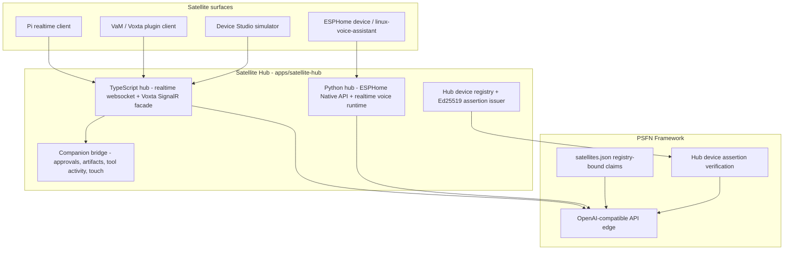
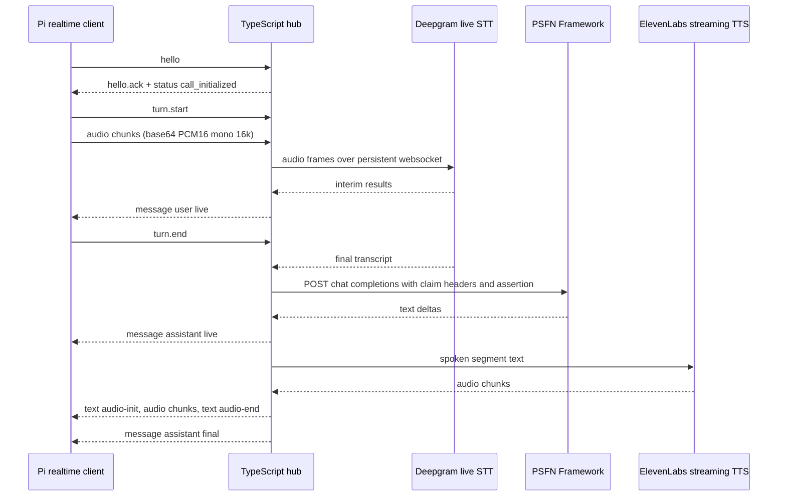

# Satellite Hub

Satellite Hub (`apps/satellite-hub`) is the **endpoint and embodiment runtime**
of PSFN: the middleware layer between physical hardware (Pi-class voice
endpoints, stock ESPHome devices), embodiment clients (VaM via the Voxta
protocol, Device Studio simulators), and PSFN Framework. It is a session router
with modular adapters. It owns satellite transport, voice orchestration (STT,
TTS, VAD/endpointing, interrupt), media conversion, turn control, and capability
fan-out to whatever embodied surface is attached.

PSFN Framework is the **sole agent backend**. The hub sends every agent turn to
PSFN over its OpenAI-compatible `/v1/chat/completions` API edge and keeps only
transport-side continuity; prompt assembly, identity, memory, cognition, tools,
and author attribution are PSFN-owned and must not be duplicated here
([`AGENTS.md`](/apps/satellite-hub/AGENTS.md)). The hub is the component that
authenticates to PSFN on behalf of satellites — including mTLS client identity,
satellite claim headers, and, for enrolled devices, short-lived Hub device
assertions.

The hub is **not** a gateway-hosted Wyoming server. Gateway-hosted Wyoming is
retired: `createGatewayVoiceSurfaces`
([`src/boundary/gateway/voice-surfaces.ts`](/src/boundary/gateway/voice-surfaces.ts))
throws when `WYOMING_ENABLED` is set and directs operators to run
Wyoming/OpenHome endpoints through Satellite Hub.

## Runtime shape and integration model

There are two hub processes and three integration paths:

| Path | Hub | Surface |
| --- | --- | --- |
| Custom realtime websocket | TypeScript hub (`npm run hub:ts`) | Pi-class devices with continuous mic streaming, local playback ownership, explicit interrupt — the primary path |
| Voxta-compatible SignalR facade | TypeScript hub | VaM / AcidBubbles plugin clients via `/hub` |
| ESPHome Native API fallback | Python hub (`uv run hub run`) | Stock ESPHome voice devices and `linux-voice-assistant` |

Both hubs speak the same PSFN registry contract (claim envelope, scalar
`X-PSFN-Satellite-*` headers, optional device assertion). The Python side also
ships its own realtime websocket runtime used when `DEVICE_TRANSPORT=realtime`
or `hybrid` runs under the Python process.



*The hub translates satellite transport into registry-bound PSFN turns; the
framework side of that contract (the `satellites.json` claim spine and Hub
device assertion verification) is documented in
[World and Presence](../channels/world-and-presence.md) and
[Fleet Auth](../operator/fleet-auth.md).*

Home Assistant is not part of the default runtime path. An opt-in integration
(`HOME_ASSISTANT_ENABLED=true`) additionally requires `HUB_DEVICE_REGISTRY_PATH`
and adds a Hub control server (`/internal/v1/`) that proxies device-scoped state
reads and allowlisted `call_service` calls to a Home Assistant websocket
([`src/ts/hub/main.ts`](/apps/satellite-hub/src/ts/hub/main.ts),
[`env.ts`](/apps/satellite-hub/src/ts/shared/env.ts)).

## Satellite model

A satellite is any endpoint that connects to the hub and exposes a real device,
simulated device, or client surface to a PSFN-backed conversation. The satellite
proves what it can do through the `hello` payload; the hub normalizes those
capabilities into one embodied session. Capability vocabularies are fixed in
`src/ts/shared/protocol.ts`:

- **input**: `text`, `microphone_pcm`, `final_transcript`, `vision_upload`, `wake_event`
- **output**: `text`, `subtitle`, `streamed_audio`, `local_file_audio`, `animation`, `action`, `expression`, `gaze`, `servo`, `artifact`, `tool_activity`
- **control**: `interrupt`, `mute`, `sleep_wake`, `presence`, `session_attach`, `approvals`, `touch`
- **safety**: `action_allowlist`, `confirmation_required`, `local_only`

Satellites should advertise only what actually works at runtime. Multiple
satellites can attach to the same session — a Pi provides mic input while VaM
renders the avatar — and only one component owns a Partner turn: the hub receives
satellite input, calls PSFN once, then fans assistant deltas, audio, captions,
actions, and state out to attached satellites. Duplicate PSFN calls for the same
utterance are a correctness bug
([`PLAN.md`](/apps/satellite-hub/PLAN.md)).

The hub keeps a per-session **EmbodiedSessionRegistry**
([`embodied-session.ts`](/apps/satellite-hub/src/ts/hub/embodied-session.ts#L101-L216)):

- sessions are keyed by `sessionId`; the PSFN channel id is derived as
  `channelType:sessionId` (default `satellite.endpoint:<sessionId>`) unless the
  client supplies `channelId`;
- each satellite's current capabilities, claim identity, and device authority
  are stored per attachment;
- attachment ownership is enforced with in-process `Symbol` tokens, so a stale
  connection cannot keep acting after a newer hello replaced it;
- when the last satellite detaches, the session is deleted.

## TypeScript hub (primary realtime path)

The TypeScript hub entrypoint is `src/ts/hub/main.ts`. It builds a
`RealtimeHubServer` from `loadHubConfig`, starts the optional companion bridge
and Home Assistant integration, and binds the websocket/HTTP server on
`REALTIME_VOICE_BIND_HOST` / `REALTIME_VOICE_PORT` (default `0.0.0.0:8787`). The
Voxta facade shares the same HTTP server: its HTTP routes and `/hub` upgrade are
served before the realtime websocket path
([`server.ts`](/apps/satellite-hub/src/ts/hub/server.ts#L71-L178)).

### Realtime websocket protocol

One persistent websocket at `ws://<hub-host>:8787/`. All frames are JSON text.
The full contract lives in
[`docs/realtime-client-protocol.md`](/apps/satellite-hub/docs/realtime-client-protocol.md).
Client-to-hub messages (`src/ts/shared/protocol.ts`): `hello` (deviceId,
deviceName, optional sessionId/channelId/satelliteId/satelliteName, capabilities,
and — for enrolled devices — `credential`), `user.text`, `audio` (base64 PCM16
mono 16 kHz chunks), `turn.start`, `turn.end`, `interrupt`, `text` signals
(`interrupt-event`, `bot-speaking`, `bot-speak-end`), `ping`, `relay.stt`,
`relay.tts`, `touch.interaction`, `approval.decision`, `artifact.preview`.

Hub-to-client: `session.ready`, `hello.ack` (the authoritative accepted
attachment, with normalized capabilities), `status: call_initialized`, `message`
events (live/final user and assistant text), `text` with `audio-init` /
`audio-end` around streamed audio, `audio` chunks, `assistant.interrupted`,
`error-event`, `pong`, and the companion relay events (`approval.requested`,
`approval.resolved`, `artifact.created`, `artifact.preview.result`,
`artifact.preview.error`, `tool.activity`).

The hub replies `hello.ack` with the resolved session, channel, and normalized
capabilities; satellites that do not advertise an audio or relay capability
receive none of the corresponding events.

### Turn lifecycle



*One voice turn: hub-side Deepgram live session drives utterance boundaries, the
hub calls PSFN once, and streamed text is flushed into ElevenLabs audio segments
between `audio-init` / `audio-end`.*

Voice input is endpointed by a **hub-side persistent Deepgram live session**, not
by client-side turn gating: `ensureSttSession` opens one
`DeepgramRealtimeSession` per connection and interim results are echoed as live
user `message` events, while a final `TranscriptResult` starts the reply
([`server.ts`](/apps/satellite-hub/src/ts/hub/server.ts#L779-L859)). The reply
pipeline is a single serialized task per connection:

- assistant deltas stream out as `message` `live: true` events;
- text is accumulated into spoken segments via `takeFlushChunk`
  (`src/ts/shared/text.ts`) and synthesized through the `ElevenLabsStream`
  adapter, bracketed by `audio-init` / `audio-end`;
- `interrupt` (client, typed-text, or disconnect) aborts the in-flight PSFN
  request and TTS stream; a cancelled reply is recorded as `reply.cancel` and is
  **not** surfaced as an `error-event`;
- final assistant text is appended to the transport session history
  ([`server.ts`](/apps/satellite-hub/src/ts/hub/server.ts#L861-L1049)).

`SessionStore` is explicitly transport-side continuity only: it keeps the last
12 messages per session with a TTL (`SESSION_TTL_SECONDS`, default 300 s). PSFN
Framework owns authoritative conversation memory
([`session-store.ts`](/apps/satellite-hub/src/ts/hub/session-store.ts#L11-L44)).

### Framework agent adapter and satellite claims

`FrameworkAgentAdapter` exposes `streamReply(inputMode, userText,
conversationId, history, channel, signal)`; the concrete `PsfnModelAdapter`
posts to `<base>/v1/chat/completions` (non-streaming request, yields the full
completion text) with:

- a `satellite_claim` envelope (`satellite-claim.v1`: claim, capabilities,
  telemetry, auth) and `channel_metadata` body fields;
- `X-PSFN-Channel-Type`, `X-PSFN-Channel-ID`, `X-PSFN-Satellite-ID`,
  `X-PSFN-Satellite-Name`, plus the registry headers from
  `buildSatelliteRegistryHeaders`, `X-PSFN-Satellite-Claim`, and
  `X-PSFN-Channel-Metadata`;
- optional mTLS via `PSFN_CLIENT_CERT_PATH` / `PSFN_CLIENT_KEY_PATH` (an https
  base URL is required);
- a fresh `X-PSFN-Hub-Device-Assertion` when the session has a device authority;
- header-value sanitization that strips control characters and non-ASCII
  punctuation before they cross HTTP
  ([`psfn-model.ts`](/apps/satellite-hub/src/ts/hub/psfn-model.ts#L376-L408)).

The adapter enforces a bounded reply budget: voice turns default to an 8 s total
deadline with 6 s per attempt, text turns to 80 s / 75 s (configured via
`PSFN_VOICE_REPLY_DEADLINE_MS`, `PSFN_VOICE_ATTEMPT_TIMEOUT_MS`,
`PSFN_TEXT_REPLY_DEADLINE_MS`, `PSFN_TEXT_ATTEMPT_TIMEOUT_MS`). Non-OK responses
that look like agent-busy (`503` "already processing another prompt") are retried
with backoff (default up to 12 retries); an empty completion is retried once
inside the budget; only a timed-out/empty attempt set is ever recorded in
telemetry so discarded text cannot leak
([`psfn-model.ts`](/apps/satellite-hub/src/ts/hub/psfn-model.ts#L78-L217),
[`env.ts`](/apps/satellite-hub/src/ts/shared/env.ts#L209-L233)).

### Hub device registry and device assertions

`HUB_DEVICE_REGISTRY_PATH` enables the **enrolled device authority**
([`device-registry.ts`](/apps/satellite-hub/src/ts/hub/device-registry.ts#L62-L144)):

- every device entry must declare `credentialSha256` (SHA-256 hex), a unique
  `deviceId`, `satelliteId`/`endpointId`/`claimType` (unique per
  satellite/endpoint), `enrollmentVersion`, `enrollmentAssurance:
  "device_credential"`, `enrollmentStatus`, `companionId` (UUID), and
  `maxCapabilities`; `placeId` and `homeAssistantEntityIds` are optional;
- the registry file is a **live authority, not a startup snapshot**: it is
  re-read and validated before every enrolled hello, before accepting another
  message from an attached enrolled device, and before each Framework transport
  attempt; removal, revocation, enrollment-version drift, or changed
  assertion-binding fences the socket and requires a new hello; unreadable or
  malformed state fails closed;
- hello with a device registry is strict: `credential` and the exact registry
  `deviceId` are required, and `placeId`, `companionId`, `contactId`,
  `humanPrincipalId`, `humanSessionId`, and `channelId` are forbidden in the
  browser hello (identity comes from the registry);
- the requested capabilities are intersected with the registry
  `maxCapabilities` per category, so a satellite can only ever advertise less
  than its registry maximum;
- requested `sessionId`s are hashed under the device id
  (`realtime:<deviceId>:<sha256-prefix>`) to keep continuity bound to the
  enrolled device
  ([`server.ts`](/apps/satellite-hub/src/ts/hub/server.ts#L301-L401)).

After an enrolled hello succeeds, each logical Hub-to-Framework turn carries a
new compact `X-PSFN-Hub-Device-Assertion` token
([`device-assertion.ts`](/apps/satellite-hub/src/ts/hub/device-assertion.ts#L41-L98)):

- EdDSA over Ed25519, protected header `alg=EdDSA`, `typ=PSFN-HUB-DEVICE`,
  `v=1`, `kid`, with canonical-JSON header and claims
  (`iss`, `device_id`, `enrollment_version`, `enrollment_assurance`,
  `place_id` when bound, `aud`, `companion_id`, `session_id`, `iat`, `exp`,
  `jti`);
- TTL must be 5–60 seconds; the private-key file must be mode `0600` and
  Ed25519; the hub is the only holder of the private key;
- recovery transport attempts for the same turn reuse the exact token bytes;
  a later logical turn gets a new token and replay id. Framework verification
  binds audience, companion, device, enrollment version, and consumes `jti`
  transactionally ([`realtime-client-protocol.md`](/apps/satellite-hub/docs/realtime-client-protocol.md)).

### Companion backplane bridge

`PSFN_COMPANION_BASE_URL` enables the companion backplane bridge
([`companion-bridge.ts`](/apps/satellite-hub/src/ts/hub/companion-bridge.ts#L45-L93)):

- consumes the authenticated `GET <base>/companion/events` SSE stream with
  reconnect/backoff and fans validated, contract-projected events to
  satellites;
- proxies `approval.decision` to `POST <base>/companion/approvals/{id}`, touch
  stimuli to `POST <base>/companion/stimuli`, and size-capped artifact previews
  from `GET <base>/companion/artifacts/{id}/preview`;
- is **deny-by-default**: events that fail strict validation are dropped,
  unknown payload fields are stripped so nothing beyond the wire contract leaks,
  and an unconfigured or unreachable backplane relays nothing — there is no fake
  or cached data;
- both `GET` endpoints require the hub's registry identity as query parameters
  (`satelliteId`, `endpointId`, `claimType`); an incomplete identity disables
  the bridge at startup (fail closed);
- preview payloads are capped at `PSFN_COMPANION_PREVIEW_MAX_BYTES` (default
  1 MiB); PSFN decides per artifact whether bytes are released
  ([`realtime-client-protocol.md`](/apps/satellite-hub/docs/realtime-client-protocol.md)).

Companion events are capability-gated per satellite: `approval.requested` /
`approval.resolved` need the `approvals` control capability, `artifact.created`
and previews need `artifact` output, `tool.activity` needs `tool_activity`, and
`touch.interaction` needs `touch` (control) plus `touch` in the registry
`maxCapabilities.control` and in the PSFN endpoint's `maxCapabilities`.
`approval.decision` from a satellite without `approvals` is rejected with an
`error-event`; failures are classified by HTTP status (401/403 auth/scope, 404
unknown approval, 409 already resolved). Touch payloads are validated enums
(kind `headpat|petting|hug|kiss`, region `head|cheek|body`, count 1–20,
duration 0–60000 ms) and a 429 from PSFN maps to a "cooling down" error
([`server.ts`](/apps/satellite-hub/src/ts/hub/server.ts#L449-L512)).

### Voxta SignalR facade

The Voxta facade (`voxta-facade.ts`) is a Voxta-server-shaped surface for VaM /
AcidBubbles clients that still routes every conversation through PSFN. It is
mounted on the TypeScript hub and enabled by default (`VOXTA_FACADE_ENABLED`):

- `POST /hub/negotiate?negotiateVersion=1` and `WS /hub?id=<connectionToken>`
  (SignalR JSON framing, record separator `\x1e`, 15 s keepalive), plus the
  alternate namespaced `/voxta/hub` routes;
- inbound `SendMessage` payloads dispatch on `$type`: `authenticate`
  (sends `welcome` + configuration), `registerApp` (registers the VaM satellite
  capabilities), `loadCharactersList` / `loadScenariosList` / `loadChatsList`
  (minimal lists backed by the configured PSFN assistant identity),
  `startChat` / `resumeChat` / `subscribeToChat`, `send` (routes Partner text into
  PSFN; `/secret` and `/note` become context without generating a reply),
  `interrupt`, `updateContext`, and `triggerAction`; `speechPlaybackStart`,
  `speechPlaybackComplete`, `typingStart`, `typingEnd`, `pauseChat`, `inspect`,
  `inspectAudioInput` are acknowledged for compatibility
  ([`voxta-facade.ts`](/apps/satellite-hub/src/ts/hub/voxta-facade.ts#L495-L582));
- outbound `ReceiveMessage` events: `chatFlow` (Thinking / WaitingForUser),
  `replyGenerating`, `replyStart`, `replyChunk` (with `audioUrl`), `replyEnd`,
  `chatStarted`, `recordingRequest`, `visionCaptureRequest`, and
  `appTrigger`; the Voxta session/chat/assistant/user ids are stable GUIDs
  derived from the satellite, assistant, and user ids unless pinned by
  `VOXTA_SESSION_ID` / `VOXTA_CHAT_ID`
  ([`voxta-facade.ts`](/apps/satellite-hub/src/ts/hub/voxta-facade.ts#L700-L749));
- TTS artifacts: with `VOXTA_AUDIO_FOLDER` set, `replyChunk.audioUrl` is a local
  `.wav` written into the VaM audio folder (typically
  `Custom\Sounds\Voxta`); otherwise it is a proxy-fetchable HTTP URL under
  `/api/voxta/audio/`; when TTS is unavailable the facade uses a `silence:0`
  placeholder so the text path still works
  ([`voxta-facade.ts`](/apps/satellite-hub/src/ts/hub/voxta-facade.ts#L930-L969));
- `triggerAction` emits `appTrigger` **only** when the action is in
  `VOXTA_APP_TRIGGER_ALLOWLIST`; anything else fails the invocation
  ([`voxta-facade.ts`](/apps/satellite-hub/src/ts/hub/voxta-facade.ts#L787-L806));
- vision: with ComputerVision enabled, each Partner turn sends `visionCaptureRequest`
  for `Screen` and `Eyes` sources (timeout `VOXTA_VISION_CAPTURE_TIMEOUT_MS`),
  accepts the plugin's multipart JPEG upload or cancellation, persists the image
  under the artifact root, and surfaces capture metadata in PSFN channel
  metadata;
- with `VOXTA_STT_STREAM_ENABLED=true`, `recordingRequest` prompts the client or
  relay to open `WS /ws/audio/input/stream?sessionId=<guid>` and stream 16 kHz
  mono PCM, which the facade transcribes and echoes as
  `speechRecognitionStart` / `speechRecognitionPartial` / `speechRecognitionEnd`
  ([`voxta-facade.ts`](/apps/satellite-hub/src/ts/hub/voxta-facade.ts#L623-L652));
- service toggles are exposed as `PUT /api/configurations/{id}/services/SpeechToText`
  (and `TextToSpeech`, `ComputerVision`); the facade adopts the configuration id
  and accepts proxy service syncs.

### Turn artifacts

Every turn is recorded under `.artifacts/runtime-ts` (TypeScript) or
`.artifacts/runtime` (Python): `audio.pcm`, `audio.wav`, `transcript.json`,
`reply.json`, and an `events.jsonl` trace of lifecycle events. Artifacts are
intentionally kept for debugging transport, latency, and failure recovery
([`artifacts.ts`](/apps/satellite-hub/src/ts/hub/artifacts.ts#L20-L70)).

## Python hub (ESPHome fallback path)

The Python hub (`uv run hub run`, entrypoint `hub/cli/run.py`) implements the
ESPHome fallback path and its own realtime runtime. `DEVICE_TRANSPORT` selects
`esphome`, `realtime`, or `hybrid`; the runtime starts a `StaticAudioServer`
for announcement playback, a `SessionCache`, and the chosen runtimes in an
asyncio task group ([`run.py`](/apps/satellite-hub/hub/cli/run.py#L180-L224)).

### ESPHome session and streaming runtime

`ESPHomeSession` wraps the `aioesphomeapi` Native API client (host/port, legacy
password, Noise PSK, `expected_name` guard) and reconnects forever with a 2–5 s
backoff loop ([`esphome_session.py`](/apps/satellite-hub/hub/devices/esphome_session.py#L22-L70)).
`StreamingVoiceAssistantRuntime` handles the voice-assistant lifecycle:

- `handle_start` (wake word or button) opens a turn, starts the Deepgram turn,
  emits ESPHome `VOICE_ASSISTANT_RUN_START` / `STT_START` events, and arms a
  watchdog;
- `handle_audio` appends PCM to the turn artifact, computes RMS against
  `VOICE_SPEECH_RMS_THRESHOLD`, tracks speech chunks, and forwards frames to
  Deepgram;
- endpointing and safety timeouts are config-driven: initial silence, endpoint
  grace, silence timeout, max turn seconds, and a minimum speech-chunk count;
- a new start supersedes an active turn (abort + media-player stop), and barge-in
  cancels the response task and stops local playback;
- `VOICE_CONVERSATION_ID` pins every ESPHome turn to one PSFN channel suffix
  (defaults to `PSFN_SATELLITE_ID` and overrides device-provided conversation
  ids) ([`voice_runtime_streaming.py`](/apps/satellite-hub/hub/devices/voice_runtime_streaming.py#L50-L200)).

### Python adapters

- `DeepgramLiveSTTProvider` keeps one persistent Deepgram live websocket with
  interim results, `endpointing`/`utterance_end_ms`, `vad_events`, and a
  `Finalize` message per turn
  ([`deepgram_live.py`](/apps/satellite-hub/hub/adapters/stt/deepgram_live.py#L29-L120));
- `ElevenLabsStreamingTTS` keeps a persistent ElevenLabs websocket, flushes
  spoken segments per context, and streams MP3 chunks
  ([`elevenlabs_streaming.py`](/apps/satellite-hub/hub/adapters/tts/elevenlabs_streaming.py#L19-L109));
- `PsfnStreamingProvider` posts to the same `/v1/chat/completions` contract as
  the TS adapter: satellite claim envelope, registry headers, optional client
  certificate, `X-PSFN-Hub-Device-Assertion` per request, per-conversation
  history, and `submit_touch_stimulus`
  ([`psfn_streaming.py`](/apps/satellite-hub/hub/adapters/agent/psfn_streaming.py#L30-L147)).

### Media

`FfmpegMp3ToFlacTranscoder` converts ElevenLabs MP3 chunks to 48 kHz mono FLAC
for FLAC-only ESPHome speakers (the Waveshare bedroom build) and requires
`ffmpeg` on the bridge host ([`audio_transcoder.py`](/apps/satellite-hub/hub/media/audio_transcoder.py#L14-L80)).
`StaticAudioServer` + `LiveAudioStream` serve streamed announcement audio back to
devices over HTTP ([`http_audio.py`](/apps/satellite-hub/hub/media/http_audio.py#L23-L79)).

### Interactions

`ESPHomeInteractionRecorder` watches a `binary_sensor` whose object id is
`headpat`; a state-on event becomes a `SatelliteInteraction` (recorded to
`.artifacts/runtime/interactions/events.jsonl`) and is delivered through the
companion stimuli endpoint as a headpat/head touch with count 1 and response
mode `respond`
([`interaction_runtime.py`](/apps/satellite-hub/hub/devices/interaction_runtime.py#L47-L104)).

### Python realtime server and fleet authority

`RealtimeVoiceServer` implements the realtime websocket path in Python with a
snake_case wire variant (`hello` with `conversation_id`, `turn.start`, `audio`,
`turn.end`, `interrupt`; `session.ready`, `hello.ack`, `assistant.interrupted`)
on `REALTIME_VOICE_BIND_HOST` / `REALTIME_VOICE_PORT`, used when the Python
process runs `DEVICE_TRANSPORT=realtime` or `hybrid`
([`realtime_server.py`](/apps/satellite-hub/hub/devices/realtime_server.py#L45-L150)).

Physical Python fallback turns can use the same Fleet Hub-device authority as
the TypeScript hub. Set `PSFN_COMPANION_ID`,
`HUB_DEVICE_ASSERTION_FLEET_AUTH_PATH`, `HUB_DEVICE_ASSERTION_SATELLITE_REGISTRY_PATH`,
`HUB_DEVICE_ASSERTION_PRIVATE_KEY_PATH`, and
`HUB_DEVICE_ASSERTION_TTL_SECONDS` as one complete set; the bridge re-reads the
exact endpoint's active `hubDeviceEnrollment` before every turn, requires the
private key to match the single active Fleet verifier, requires an enabled
registry with exactly one matching satellite/endpoint, and sends a fresh
assertion without persisting it
([`device_assertion.py`](/apps/satellite-hub/hub/security/device_assertion.py#L47-L157)).

The Python CLI also ships `hub probe` (device metadata, entities/services, state
subscription) and `hub transport-spike` (raw ESPHome voice transport capture and
artifact logging) ([`probe.py`](/apps/satellite-hub/hub/cli/probe.py#L72-L104)).

## Voxta relay (.NET)

The repo-local `PsfnVoxtaRelay` (`.NET`, `relay/psfn-voxta-relay`) runs on the
VaM Windows machine so the AcidBubbles plugin can point at one local endpoint:

- serves local SignalR `/hub` for VaM and creates one remote SignalR `/hub`
  connection per local VaM client, staying JSON-pass-through without depending
  on `Voxta.Model.dll`;
- rewrites `authenticate` capabilities from VaM `LocalFile` audio to remote
  `Url` audio while preserving the VaM audio folder;
- downloads remote `replyChunk.audioUrl` / `thinkingSpeechUrl` WAV artifacts into
  the VaM audio folder and rewrites those fields to local file paths;
- forwards local `/api/...` REST calls to the remote hub for service toggles and
  vision uploads;
- captures Windows microphone audio with NAudio after `recordingRequest` and
  streams 16 kHz mono PCM to the remote hub
  ([`Program.cs`](/apps/satellite-hub/relay/psfn-voxta-relay/Program.cs#L41-L113),
  [`README.md`](/apps/satellite-hub/relay/psfn-voxta-relay/README.md)).

## Pi realtime client

The dedicated Pi-class TypeScript client (`src/ts/pi-client`, deployable via
`scripts/deploy-ts-pi-client.sh`) is the top-tier conversational path for devices
that can afford a custom client. It owns continuous local microphone capture,
immediate local playback stop on interrupt, local playback state, explicit ALSA
device selection and playback ducking before interrupt, and direct websocket
streaming back to the hub
([`client.ts`](/apps/satellite-hub/src/ts/pi-client/client.ts#L21-L150)). It also
ships:

- a `HubOpenAiRelayClient` that turns hub `relay.stt` / `relay.tts` into
  OpenAI-shaped `/v1/audio/transcriptions` and `/v1/audio/speech` endpoints for
  third-party apps, plus a `/mic` mute API
  ([`mic-control-server.ts`](/apps/satellite-hub/src/ts/pi-client/mic-control-server.ts#L14-L63));
- an `AmicaBridge` that posts `user.final`, `assistant.segment`,
  `assistant.final`, and `interrupt` events to an Amica satellite endpoint when
  configured.

## Device Studio

Device Studio is repo-local browser tooling for ESP32-class embodied companion
devices — a **behavioral simulator, not an emulator**, and never a required part
of hub startup. It provides profile-aware previews (Stack-chan with a Three.js
pan/tilt face preview; Waveshare ESP32-S3 1.85-inch round LCD with 360x360 round
clipping), behavior timeline authoring and playback, a deterministic mock
transport and a live websocket transport that connects as one simulated
satellite, structured command/event logging, sprite generation through the
server-side provider that owns `FAL_KEY` (browser code never receives the key),
deterministic sprite packing (`npm run studio:sprites`), import/export with
provenance, and hardware verification states (`unverified`,
`simulated-only`, `partially-verified`, `verified-on-hardware`, `unsafe`). A
behavior is only as verified as its least-verified safety-sensitive channel
([`device-studio.md`](/apps/satellite-hub/docs/device-studio.md)).

The hub remains responsible for realtime transport, PSFN execution, STT/TTS
orchestration, and turn/session lifecycle; Device Studio previews, behavior
selection, and embodiment state stay local simulator state unless an explicit,
capability-gated, typed protocol extension is added later
([`transport.ts`](/apps/satellite-hub/src/ts/device-studio/transport.ts#L26-L99)).

## Configuration and operations

Runtime config comes from the project-local `.env`. Key settings:

- **Transport**: `DEVICE_TRANSPORT` (`esphome` | `realtime` | `hybrid`);
  `ESPHOME_HOST`, `ESPHOME_PORT` (6053), `ESPHOME_NOISE_PSK`;
  `REALTIME_VOICE_BIND_HOST`, `REALTIME_VOICE_PORT` (8787), and a public host
  (`AUDIO_PUBLIC_HOST` or `REALTIME_VOICE_PUBLIC_HOST`) is required in
  realtime-only mode — the hub no longer probes an outbound address when ESPHome
  is unused.
- **Providers**: `DEEPGRAM_API_KEY`, `ELEVENLABS_API_KEY`,
  `ELEVENLABS_VOICE_ID`, `ELEVENLABS_MODEL_ID` (default `eleven_flash_v2_5`).
  `HUB_TEXT_ONLY=true` makes the provider keys optional.
- **PSFN identity**: `PSFN_API_BASE_URL`, `PSFN_API_KEY`, `PSFN_MODEL`,
  `PSFN_PROVIDER` (when set, `PSFN_MODEL` must name a concrete provider model),
  `PSFN_CLAIM_NAMESPACE`, `PSFN_CLAIM_TYPE`, `PSFN_CAPABILITY_PROFILE`,
  `PSFN_CHANNEL_TYPE`, `PSFN_SATELLITE_ID`, `PSFN_ENDPOINT_ID`,
  `PSFN_ENDPOINT_NAME`, `PSFN_CLIENT_CERT_PATH` / `PSFN_CLIENT_KEY_PATH`
  (+ optional `PSFN_CA_CERT_PATH`), and the paired `PSFN_AUTHOR_ID` /
  `PSFN_AUTHOR_NAME`.
- **Voice turn control**: `VOICE_REPLY_TIMEOUT_SECONDS`,
  `VOICE_ENDPOINTING_GRACE_SECONDS`, `VOICE_SILENCE_TIMEOUT_SECONDS`,
  `VOICE_MAX_TURN_SECONDS`, `VOICE_SPEECH_RMS_THRESHOLD`,
  `VOICE_MIN_SPEECH_CHUNKS_FOR_ENDPOINTING`, `SESSION_TTL_SECONDS`.
- **Enrolled devices**: `HUB_DEVICE_REGISTRY_PATH` plus the complete assertion
  authority (`HUB_DEVICE_ASSERTION_ISSUER`, `_KID`, `_AUDIENCE`,
  `_PRIVATE_KEY_PATH` mode-0600 Ed25519, `_TTL_SECONDS` 5–60).
- **Companion backplane**: `PSFN_COMPANION_BASE_URL` (typically the same
  `<gateway>/v1` value as `PSFN_API_BASE_URL`), `PSFN_COMPANION_API_KEY`,
  `PSFN_COMPANION_PREVIEW_MAX_BYTES`, `PSFN_COMPANION_RECONNECT_BASE_MS`,
  `PSFN_COMPANION_RECONNECT_MAX_MS`.
- **Voxta**: `VOXTA_FACADE_ENABLED` (default true), `VOXTA_SATELLITE_ID`,
  `VOXTA_SATELLITE_NAME`, `VOXTA_SESSION_ID`, `VOXTA_CHAT_ID`,
  `VOXTA_ASSISTANT_NAME`, `VOXTA_USER_NAME`, `VOXTA_PUBLIC_BASE_URL`,
  `VOXTA_AUDIO_FOLDER`, `VOXTA_STT_STREAM_ENABLED`,
  `VOXTA_VISION_CAPTURE_TIMEOUT_MS`, `VOXTA_APP_TRIGGER_ALLOWLIST`.
- **Pi client**: `HUB_WS_URL`, `AUDIO_DEVICE_CARD`, `AUDIO_INPUT_DEVICE`,
  `AUDIO_OUTPUT_DEVICE`, `ALSA_DUCK_CARD` / `ALSA_DUCK_CONTROL` /
  `ALSA_DUCK_PERCENT`, `VOICE_START_THRESHOLD`, `VOICE_CONTINUE_THRESHOLD`,
  `VOICE_AMBIENT_START_RATIO`, `VOICE_INTERRUPT_RATIO`.

Commands (see [`README.md`](/apps/satellite-hub/README.md)):

```bash
npm run verify:satellite-hub        # bounded monorepo gate (TS + Python, no live devices/providers)
uv sync --dev                       # Python deps for the ESPHome fallback path
npm ci                              # TS deps; Node.js 24 LTS (>=24.19.0) with npm 11.17.0
uv run hub run                      # Python fallback bridge (esphome/realtime/hybrid)
uv run hub probe --host <ip> --noise-psk <psk>
uv run hub transport-spike --host <ip> --noise-psk <psk>
npm run hub:ts                      # TypeScript realtime hub on ws://0.0.0.0:8787/
npm run pi:ts                       # TypeScript Pi client
npm run smoke:ts                    # end-to-end smoke harness against the realtime hub
npm run shell:psfn -- "hello"       # text-only thin-shell satellite
npm run studio:dev                  # Device Studio (DEVICE_STUDIO_HOST=0.0.0.0 for LAN)
./scripts/apply-linux-voice-assistant-patch.sh /path/to/linux-voice-assistant
```

ESPHome speaker endpoints that advertise FLAC-only playback (including the
Waveshare bedroom build) require `ffmpeg` on the bridge host. Natural follow-up
and interrupt behavior on the ESPHome fallback path depends on the patched
`linux-voice-assistant` endpoint: the patch adds speech-first barge-in detection
knobs, turns wake-word and stop-word interrupts into explicit local
"stop output now, then reopen mic" behavior, and preserves follow-up
conversation reopening after TTS instead of relying on fragile announce-state
side effects. It is intentionally endpoint-local and does not change PSFN
Framework ([`README.md`](/apps/satellite-hub/README.md)).

## Invariants and failure semantics

- **PSFN is the sole brain.** The hub never generates companion speech,
  identity, policy, or memory; it relays redacted payloads PSFN emits and
  rejects or drops everything else. Never present developer-authored, system-
  authored, diagnostic, or failure text as companion speech.
- **One owner per turn.** Duplicate PSFN calls for one utterance are a
  correctness bug; interrupts abort the in-flight request and are reported as
  `reply.cancel`, not as `error-event`.
- **Fail closed on authority.** Missing/incomplete `HUB_DEVICE_ASSERTION_*`
  config with a registry throws; private keys must be mode 0600 Ed25519; TTL is
  bounded to 5–60 s; the registry is re-read live and any drift fences the
  socket; the companion bridge fails closed at startup when identity is
  incomplete and relays nothing when the backplane is unreachable.
- **Deny by default.** Companion events and Voxta `appTrigger` are capability-
  or allowlist-gated; advertising a capability never grants permission (PSFN's
  `satellites.json` is the grant authority); omitted telemetry is treated as no
  telemetry, not as permission to use registry scopes.
- **Bounded replies.** Voice and text reply budgets bound the adapter's retry
  window (empty completions retried once, agent-busy retried with backoff), so
  a client is never left waiting on an unbounded fallback; the same turn's
  recovery attempts reuse the exact device-assertion token bytes.
- **Transport continuity only.** `SessionStore` (TS) and `SessionCache` (Python)
  hold a bounded recent window; PSFN owns authoritative memory.

## Testing

The bounded gate is `npm run verify:satellite-hub` from the monorepo root; it
runs TypeScript and Python checks without contacting live devices or paid
providers. Firmware compilation, physical-hardware validation, live-device
deployment, provider-backed voice/image calls, and the optional .NET relay are
separate operator actions.

- **TypeScript** (`npm run test:ts`): `node --test` over
  `dist/ts/**/*.test.js`, covering the realtime server, protocol message
  handling, `psfn-model` reply budgets and busy-retry, `device-registry` /
  `device-assertion` / `server-auth`, `voxta-facade` protocol, `companion-bridge`
  SSE validation, and `embodied-session` attachment ownership.
- **Python** (`uv run --frozen pytest`): config loading (`test_runtime`),
  `PsfnStreamingProvider` claims/history/errors, `HubDeviceAssertionIssuer`
  fail-closed validation, the realtime server, and voice runtime turn control.
- **End-to-end smoke**: `npm run smoke:ts` replays a recorded PCM clip against a
  running realtime hub and asserts a transcript, assistant text, and audio
  chunks arrive
  ([`smoke-ts-hub.mjs`](/apps/satellite-hub/scripts/smoke-ts-hub.mjs#L1-L80)).

## Related pages

- [World and Presence](../channels/world-and-presence.md) — the `satellites.json`
  claim spine that binds devices to places and the framework-side registry
  bounds the hub advertises into.
- [Fleet Auth](../operator/fleet-auth.md) — the framework side of the Hub
  device contract: the issuer/public-key ring, Hub device ingress, and
  assertion verification and replay.
- [Voice](../channels/voice.md) — live voice surfaces, including the hub's
  realtime websocket and ESPHome paths and the retired gateway Wyoming
  endpoint.
- [Runtime Architecture](../architecture.md) — where the hub sits in the split
  runtime and the voice channel map.
- [Approval Envelope](../security/approval-envelope.md) — the approvals
  contract the companion bridge relays.
- [Channel Plugins](../channels/plugins.md) — PSFN channel adapter surface.
- [Cognitive Security](../security/cognitive-security.md) — screening
  boundaries the hub must not bypass.
