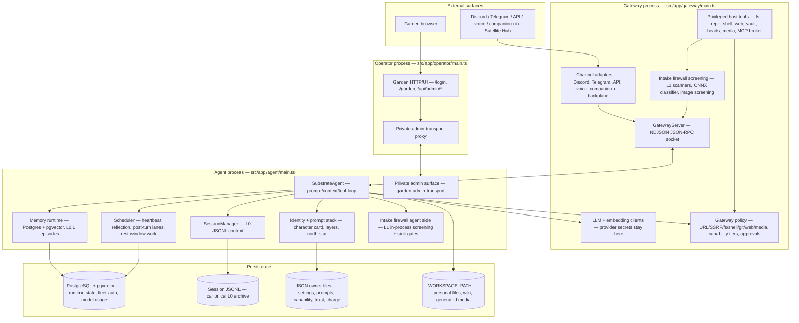
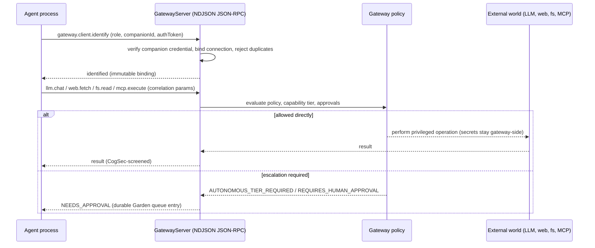

# Runtime Architecture

This page documents the current runtime shape: which OS processes exist, who
owns which responsibility, how they compose at startup, and how they talk to
each other. The component graph lives in the hand-maintained
[`docs/architecture-diagram.mmd`](../docs/architecture-diagram.mmd); the
end-to-end anatomy of one chat turn (inbound queueing, in-turn continuations,
reply disposition, post-turn lanes) lives in
<!-- openwiki: broken internal link [chat-turn-lifecycle.md] file "chat-turn-lifecycle.md" does not exist. Fix the href or restore the target, then delete this comment. -->
[`chat-turn-lifecycle.md`](chat-turn-lifecycle.md). Current feature status and
active work are in [`development-status.md`](development-status.md).

The architectural authority for Companion Core identity-and-continuity is the
project charter ([`docs/PSFN_PROJECT_CHARTER.md`](../docs/PSFN_PROJECT_CHARTER.md));
this page describes how the runtime realizes it. When prose and code disagree,
the code wins — entrypoints and composition files first.

## Canonical runtime model

The split runtime is the only supported shape. Four process roles exist:

| Process | Entrypoint | Role |
| --- | --- | --- |
| Gateway | `src/app/gateway/main.ts` | Host-side privileged edge: secrets, provider credentials, outbound network, policy, approval queues, audit, gateway-backed tool execution, CogSec screening, OpenAI-compatible API edge |
| Agent | `src/app/agent/main.ts` | Isolated Companion Core process: companion loop, prompt stack, memory/retrieval, scheduler, post-turn work, private admin transport |
| Operator | `src/app/operator/main.ts` | Operator plane: Garden HTTP/UI, admin traffic proxied over the private admin transport |
| Cert-manager | `src/app/cert-manager/main.ts` | Optional sidecar hosting the private CA for the satellite backplane |

The legacy monolith entrypoint `src/app/startup/index.ts` is disabled and
exits fail-closed with an error directing operators to the split entrypoints.

*Process topology of the split runtime: gateway holds the privileged edge, the agent runs the Companion Core loop in isolation, and the operator proxies Garden admin traffic to the agent's private admin surface.*

### Runtime terminology

A **PSFN installation** may host one or more peer Companion Cores. A
**Companion Core** owns the authoritative identity-and-continuity state of
exactly one companion (charter law, §6.2); the isolated OS process that runs it
is an **agent process**. A peer companion has its own root identity — it is not
a shard, subagent, or satellite. The **Gateway** is the Core's privileged
policy/credential edge. The **Satellite Hub** is an endpoint transport and
relay service; a **satellite** is a device/app endpoint, an **embodiment** is
the form through which a companion is perceived, and **emanation** is that
companion's active situated presence in an embodiment. CogSec is the
cross-boundary cognitive-security system; its intake firewall is only its
pre-hoc half.

## Gateway responsibilities

`src/app/gateway/main.ts` builds the privileged edge. It loads and hydrates the
canonical config, applies TLS settings, resolves the startup preflight bundle
and the runtime-mode contract, provisions fleet auth and backup schedulers, and
then constructs the privileged core via `buildGatewayPrivilegedCore`
(`src/boundary/gateway/privileged-core.ts`). The gateway process:

- owns LLM and embedding clients so provider secrets stay out of the agent;
- resolves gateway policy: filesystem scope, URL policy, SSRF checks, approval-gated actions, and per-companion capability tiers;
- runs the CogSec intake firewall (L1 deterministic scanner pipeline plus the optional in-process ONNX injection classifier) and the `intake.screen_image` RPC;
- hosts the native external MCP client broker, credential custody, TLS transport, and system-trust policy;
- starts Discord, Telegram, and installable channel plugins when enabled, plus the voice module host (`GatewayVoiceModuleHost` with the Discord reverse-RPC voice module). Gateway-hosted Wyoming is retired: `createGatewayVoiceSurfaces` throws at startup if `WYOMING_ENABLED` is set, and Wyoming/OpenHome endpoints now run through the Satellite Hub — see [`channels/voice.md`](channels/voice.md) and [`apps/satellite-hub.md`](apps/satellite-hub.md);
- hosts operator-facing support surfaces: ntfy notifications, confirmation queue, beads/vault tools, shell execution, git-backed mutations;
- serves the public OpenAI-compatible API edge and the fleet portal bundle through `startOptionalGatewayApiServer`.

All agent-facing privileged operations are exposed as audited JSON-RPC methods
registered through `registerGatewayMethods` (`src/boundary/gateway/methods/`):
LLM chat/complete/embed, Discord, web fetch/search, shell, fs, git, vault,
beads, image, intake-image, home-assistant, MCP, confirmation, session HMAC,
notify, runtime health, and the connection lifecycle methods
(`gateway.client.identify`, `gateway.client.ready`, `gateway.client.health`).

## Agent responsibilities

`src/app/agent/main.ts` builds the isolated Companion Core runtime:

1. Resolves the startup context, alerts configuration, and lifecycle runtime contract, then runs `enforceNetworkIsolationOnStartup` — a probe against a public endpoint that fails startup if outbound network is reachable, unless the operator explicitly sets `ALLOW_AGENT_OUTBOUND_NETWORK=true`.
2. Connects to the gateway with `GatewayClient.connectEndpoint` (bounded retry budget) and self-identifies with `gateway.identifyAsAgent()` before any other traffic.
3. Creates the PostgreSQL-backed agent persistence runtime through `createAgentPersistenceRuntime` (which fails closed unless `persistenceBackend=postgres` and `POSTGRES_DATABASE_URL` are set).
4. Bootstraps the core runtime: `SessionManager`, `SubstrateAgent`, memory store/retriever/extractor, scheduler, gateway-routed API backend, contacts, values, skills, safeguards, core memory, subagents, shard internals, wiki/journal tools, post-turn actions, and the companion presence/availability runtimes.
5. Starts the optional private admin transport (`startOptionalAdminTransportServer`) that the Garden operator surface proxies into, plus the OpenAI-compatible API backend handlers.
6. Starts the scheduler and declares runtime ready only after every inbound notification handler is installed.

The agent talks to the gateway through `GatewayClient`, a typed RPC wrapper that
implements `LLMProviderPort` and `EmbeddingProviderPort`, so it acts as a
drop-in provider inside the isolated process. A gateway disconnect outside the
startup path triggers the disconnect-recovery exit through the supervised
restart path.

If the bounded connect retry budget is exhausted before the gateway becomes
ready, the agent exits through the lifecycle restart contract (supervised
restart code) so a fresh process re-attempts the connection rather than dying
with a generic fatal exit.

## Operator responsibilities

`src/app/operator/main.ts` runs the operator plane. It requires `ADMIN_PORT`,
resolves the operator config and lifecycle Kubernetes settings, and builds a
`GardenOperatorSurface` (`src/operator/garden/operator-surface.ts`). Admission
is either **fleet-principal** (when `fleet-auth.json` is configured: exact
companion-bound request capabilities verified before transport selection) or
**standalone** (`ADMIN_TOKEN`, or the explicit loopback-only
`ADMIN_ALLOW_INSECURE=true` bypass). The surface proxies admin traffic to agent
private admin transports over the authenticated private admin transport —
`garden-admin.sock` by default, or a network endpoint with mTLS where the peer
SPIFFE identity must be pinned to `/psfn/agent/<companionId>`.

## Cert-manager sidecar

`src/app/cert-manager/main.ts` is an optional standalone process: it shares
nothing with the gateway/agent runtimes except `src/shared/` utilities, the
logger, and the persistence path discipline. `npm run cert-manager -- init`
generates the root CA and default config; `npm run cert-manager` serves a
token-authenticated loopback issuance API plus a background renewal loop
(`CERT_MANAGER_TOKEN` is required — at least 32 characters, and there is no
insecure mode). The CA key never leaves the state directory (mode 0600) and is
never served; issued private keys are returned exactly once. The listener binds
loopback by default and requires an explicit `listen.allowNonLoopback` opt-in
otherwise. The full bootstrap walkthrough is in
[`docs/certificates.md`](../docs/certificates.md).

## Gateway↔agent RPC

The contract between the gateway (host) and agent (container) is JSON-RPC 2.0
defined in `src/boundary/gateway/protocol.ts`, framed as NDJSON lines over the
transport in `src/boundary/gateway/transport.ts`.

- **Unix socket (default)** — `NdjsonConnection` wraps a `net.Socket` with
  newline-delimited JSON frames plus transport-level heartbeat ping/pong
  frames. The socket is `chmod`-ed to `0770`, so access is delegated to the OS
  owner/group; processes with socket filesystem access are trusted to reach the
  connection protocol, and deployments must not grant that owner/group to
  unrelated workloads.
- **WSS (remote-host alternative)** — requires mutual TLS plus the configured
  peer SPIFFE identity (`GATEWAY_RPC_TLS_*` env), the `psfn-rpc-v1` subprotocol
  at the `/rpc` path, and rejects peers whose certificate does not match the
  expected SPIFFE URI. Plain `ws://` is not allowed.
- **Endpoints** — resolved from `GATEWAY_RPC_ENDPOINT` (`unix:///path.sock` or
  `wss://host:port/path`) or the legacy `GATEWAY_SOCKET`.

Agent connections must identify once with `gateway.client.identify`: the role
(`agent` or `internal_session_integrity`) plus, in fleet mode, the companion
credential. The gateway binds that connection to exactly one manifest
companion; an unknown companion, a missing or wrong-role credential, a
duplicate live owner, or an attempt to re-identify as a sibling is rejected and
alarmed. All subsequent RPC authorization uses the immutable connection binding
rather than caller-supplied companion parameters.

*One agent RPC round trip: connection identity is bound once, every subsequent method is policy-checked gateway-side, and privileged work never executes inside the agent.*

### Fail-closed frame authorization

Every inbound method passes `enforceCompanionFrameIdentity`:

- unidentified connections may call only `gateway.client.identify`;
- `internal_session_integrity` connections may call only the HMAC sign/verify methods;
- normal agents may not call those internal signing methods;
- in fleet mode, a frame claiming a `companionId` different from the connection's
  bound id is treated as identity spoofing → audit alarm + disconnect;
- a malformed identity claim on any frame is rejected and disconnects the connection.

### Escalation classes

Gateway policy (`src/boundary/gateway/policy.ts`) distinguishes two escalation
decisions:

- `AUTONOMOUS_TIER_REQUIRED` may execute directly only for the authenticated
  companion's autonomous tier; lower tiers enter the durable Garden approval
  queue.
- `REQUIRES_HUMAN_APPROVAL` enters that queue at every tier (for example Home
  Assistant operations outside the explicit autonomous affordance and all
  generic git mutations).

Unknown policy decisions deny. If a queued confirmation cannot reach Discord
or ntfy, the request remains inspectable in Garden and the
`approval_notifications` runtime-health subsystem reports `unavailable` with
the delivery error.

## Composition layer

Shared runtime construction is concentrated in
`src/app/startup/composition/composition.ts` (session runtime, memory store,
identity, substrate agent, fatigue budget, shard/think tooling),
`src/app/startup/composition/parity.ts` (prompt stack, character card, REPL
config, settings/session/fs tools, reflection runtime), and
`src/app/startup/composition/post-turn-actions.ts`. These helpers keep the
split-runtime entrypoints aligned on core wiring: identity loading, session
runtime, memory runtime, prompt/runtime settings surfaces, shard and analysis
workbench tooling, heartbeat/scheduler wiring, and channel adapter manifests.

Composition is fail-closed about persistence: `composeSessionRuntimeAsync` and
`composeMemoryStoreAsync` throw unless `persistenceBackend=postgres` and a
`postgresDatabaseUrl` are configured — there is no SQLite runtime path.

## Runtime mode and lifecycle contract

`src/system/lifecycle/runtime-mode.ts` canonicalizes runtime modes across
entrypoints (`PSFN_RUNTIME_MODE`: `split` | `gateway-agent`, with `yolo`,
`gateway`, and `agent` accepted aliases) and resolves the restart strategy:

- the **split** entrypoint defaults to `reexec` restart with exit code 75;
- the **gateway-agent** entrypoint defaults to `supervisor` restart.

The gateway entrypoint accepts both `gateway-agent` and `split` modes; the
split entrypoint accepts only `split`. Unsupported modes fail closed before
startup.

## Persistence topology

- System-owned mutable config lives under `system-data/`; companion-owned state
  lives under `companion-data/`.
- `WORKSPACE_PATH` is one companion's Personal Workspace, not runtime state.
- Continuous mode may use the legacy shared `data/` root; production mode
  forbids overlapping mutable roots and fails closed on partial split-root
  configuration (`src/persistence/layout.ts` asserts no duplicate roots).
- L0 session history is the canonical archive, append-only JSONL under
  `sessions/`; fast-search copies live behind projection/search ports.
- Runtime memory/session composition requires PostgreSQL-backed ports
  (`MemoryStorePort`, `ContactStorePort`, `SessionArchivePort`, `EpisodicStore`,
  and the rest) — raw adapter code stays behind those ports and is not a
  composition-root seam. SQLite implementations and migration readers are
  removed.

The path contract is defined in `src/persistence/layout.ts` and summarized in
[`specifications.md`](specifications.md).

## Multi-companion topology

Every deployment is a cluster of one or more companions enumerated by the
mandatory system-owned `companions.json` manifest. The default topology is one
gateway, one agent process, one Companion Core, and one companion — a
one-entry manifest. A multi-companion topology (a manifest with more than one
entry) runs N agent processes behind the one gateway, each running a peer
Companion Core. Topology is derived from the manifest entry count; there is no
`PSFN_MULTI_COMPANION` flag, and a one-entry cluster is byte-identical to the
old single-companion behavior.

Tenancy is schema-per-companion (each agent's Postgres `search_path` is pinned
to its provisioned tenant boundary; startup verifies but never repairs tenant
roles, schemas, or extensions) plus one `shared` schema for cross-companion
world data. Same-cluster companion↔companion conversation runs through the
normal turn pipeline as ordinary channels (`companion-room:<placeId>` and
`companion-dm:<a>:<b>`), routed by the gateway companion lane and governed by
the existing fatigue budgets — active only when the manifest has more than one
entry. Operability uses one authenticated Garden frontend for the cluster
overview and authorized companion administration at
`/companions/<companion-uuid>/garden/...`. See
<!-- openwiki: broken internal link [multi-companion.md] file "multi-companion.md" does not exist. Fix the href or restore the target, then delete this comment. -->
[`multi-companion.md`](multi-companion.md).

## Core subsystems

- **Sessions and context** — `SessionManager` handles the sliding active
  context window, token budgeting, continuity, internal role envelopes, focus
  knowledge, observation masking, and prompt-aware context assembly.
  Auto-compaction is a durable between-turn background job driven by the
  configured session-history budget; it summarizes older context into
  untrusted carry-forward notes and leaves canonical L0 history intact.
  Session integrity can be HMAC-backed through the gateway-provided integrity
<!-- openwiki: broken internal link [chat-turn-lifecycle.md] file "chat-turn-lifecycle.md" does not exist. Fix the href or restore the target, then delete this comment. -->
  provider. See [`chat-turn-lifecycle.md`](chat-turn-lifecycle.md).
- **Memory** — `EpisodicStore` owns the L0.1 `l01_episodes` and
  `l01_episode_arcs` tables; `EpisodicSynthesizer` runs from the gated
  episode-synthesis lane; nightly rest-window sleeptime consolidates episodes.
  `MemoryRetriever` combines L0.1 landmark-chain retrieval, semantic retrieval,
  lexical fallback, trust filtering, emotional continuity, and optional
  reranking; `MemoryExtractor` runs post-turn, crash-recovery, and compaction
<!-- openwiki: broken internal link [memory.md] file "memory.md" does not exist. Fix the href or restore the target, then delete this comment. -->
  extraction. See [`memory.md`](memory.md).
- **Identity and prompts** — character card loading and prompt composition
  live under `src/core/identity/`; prompt layers, registry entries, north-star
  state, and core memory are persisted in companion-owned files; admin
  surfaces mutate prompt/runtime state through the JSON owner-file contract.
- **Trust, safeguards, capabilities** — trust policy loads from
  `trust-policy.json`; channel privacy vocabulary is
  `private | invite_only | public` plus a `broadcast` flag; eligibility gates
  and capability tiers are enforced before privileged tools run; safeguards
  audit cooling-off, restart protection, and external communication rate
  limits.
- **Cognitive security (intake firewall)** — untrusted inbound content is
  wrapped in a taint-tracked `IntakeEnvelope` and screened before it can reach
  prompt assembly, memory, wiki, persona, trust state, or tool egress.
  Screening composes on both sides of the socket: the gateway builds the full
  L1 deterministic scanner pipeline plus the optional in-process ONNX
  injection classifier; the agent runs an L1-only screening service for
  in-process surfaces and writes quarantine decisions to the same
  companion-data store Garden reviews. Quarantined items resolve only through
  the Garden Cognitive Security queue with a server-side double-confirm
  release. Rollout mode is owned by `intake-policy.json`
  (`off`/`shadow`/`enforce`; the seed ships `shadow`). See
<!-- openwiki: broken internal link [cognitive-security.md] file "cognitive-security.md" does not exist. Fix the href or restore the target, then delete this comment. -->
  [`cognitive-security.md`](cognitive-security.md).
- **External MCP client** — the gateway owns one protocol client per
  (companion, server) session over the official SDK's Streamable HTTP
  transport; credential custody, DNS/IP policy, TLS verification, capability
  checks, per-tool allowlists, and confirmation all remain gateway-side. The
  model sees one stable first-party tool named `mcp` with staged actions
  (`catalog`, `search`, `inspect`, `call`, `release`); remote schemas are
  absent from the fixed provider payload and unloaded on release or idle TTL.
  Each action is authorized with a connection-scoped, single-use opaque permit
  minted only for the exact tool call returned by the model provider.
- **Channels and voice** — first-class adapters (Discord, Telegram, API) load
  through the gateway channel-surface composition; additional text channels
  register as plugins via `ChannelPluginHost`. Voice is a plugin-style surface
  composed gateway-side (`createGatewayVoiceSurfaces`); the gateway-hosted
  Wyoming runtime has moved to the Satellite Hub, so setting `WYOMING_ENABLED`
  now fails startup instead of enabling an endpoint. See
  [`channels/voice.md`](channels/voice.md) and
  [`apps/satellite-hub.md`](apps/satellite-hub.md).
- **Locations, presence, world** — a soft-registry `places.json` models sites,
  places, and affordances; an absent file degrades to no world surface, a
  malformed file fails closed. The last-known situated location is durable
  companion state in the Postgres `internal_state_snapshots` row; turn
  execution awaits each state write so a completed turn cannot outrun its
  latest snapshot.
- **Scheduler and background work** — `Scheduler` handles heartbeat/reflection
  tasks, maintenance, one-shot tasks, backups, and deferred work. Heavy
  passes (sleep consolidation, arc weaving, dream meaning, orientation
  rewrite) run only from the rest-window scheduler task, never from turn
  cadence. Post-turn actions and intention appraisal live outside the main
  response path but stay in the same audited runtime.

## Extension surfaces

The main existing extension points:

- model/provider registries;
- channel adapter factory manifests and the `ChannelPluginHost` plugin surface;
- module registry and loader;
- skills runtime;
- native gateway MCP client broker and protocol-client port;
- gateway-backed git, filesystem, vault, media, shell, web, journal, and beads
  tool surfaces;
- the agent private admin transport, which the Garden operator surface proxies
  into with per-companion capability admission.

## Related pages

<!-- openwiki: broken internal link [chat-turn-lifecycle.md] file "chat-turn-lifecycle.md" does not exist. Fix the href or restore the target, then delete this comment. -->
- [`chat-turn-lifecycle.md`](chat-turn-lifecycle.md) — one turn end to end
- [`specifications.md`](specifications.md) — config, persistence, fail-closed contracts
- [`setup.md`](setup.md) — supported install paths and lifecycle
<!-- openwiki: broken internal link [multi-companion.md] file "multi-companion.md" does not exist. Fix the href or restore the target, then delete this comment. -->
- [`multi-companion.md`](multi-companion.md) — fleet topology and isolation
<!-- openwiki: broken internal link [garden-control-plane.md] file "garden-control-plane.md" does not exist. Fix the href or restore the target, then delete this comment. -->
- [`garden-control-plane.md`](garden-control-plane.md) — operator plane
<!-- openwiki: broken internal link [cognitive-security.md] file "cognitive-security.md" does not exist. Fix the href or restore the target, then delete this comment. -->
- [`cognitive-security.md`](cognitive-security.md) — intake firewall, sink gates, quarantine
<!-- openwiki: broken internal link [memory.md] file "memory.md" does not exist. Fix the href or restore the target, then delete this comment. -->
- [`memory.md`](memory.md) — memory contract
- [`channels/voice.md`](channels/voice.md) — voice surfaces, connectors, and the retired gateway-hosted Wyoming path
- [`apps/satellite-hub.md`](apps/satellite-hub.md) — the Hub that owns Wyoming/OpenHome endpoints and satellite traffic
- [`development-status.md`](development-status.md) — current feature status
- [`docs/architecture-diagram.mmd`](../docs/architecture-diagram.mmd) — hand-maintained component graph
- [`docs/PSFN_PROJECT_CHARTER.md`](../docs/PSFN_PROJECT_CHARTER.md) — charter law for Companion Core authority
