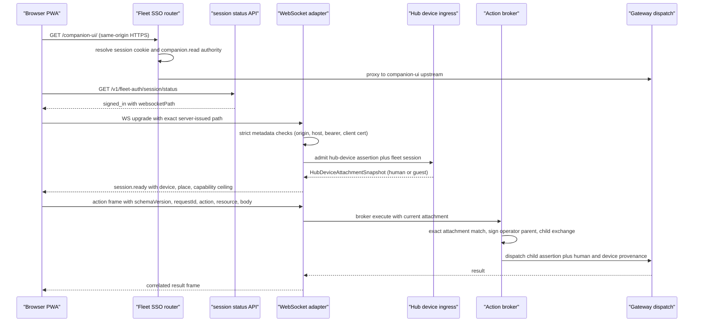
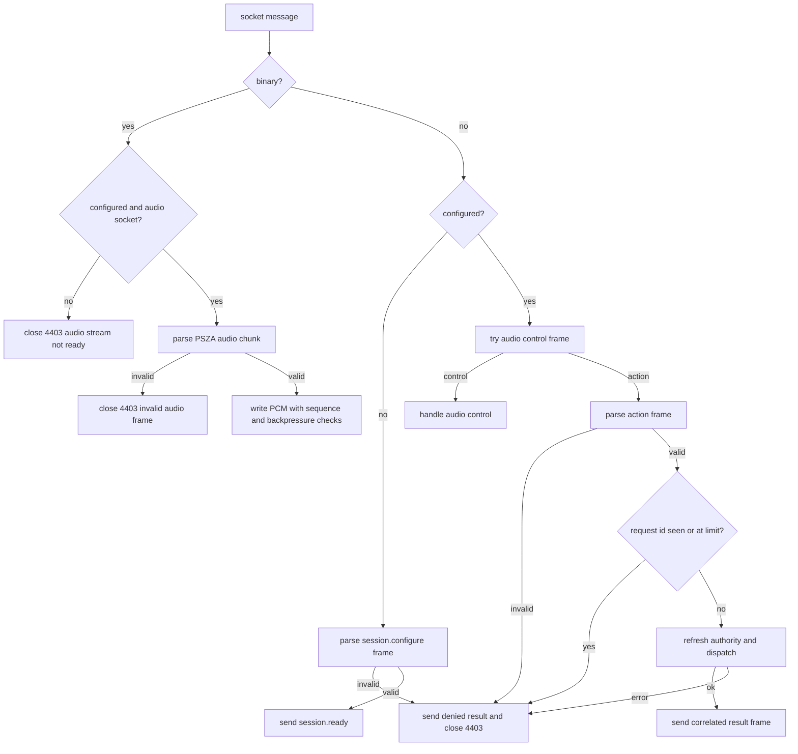
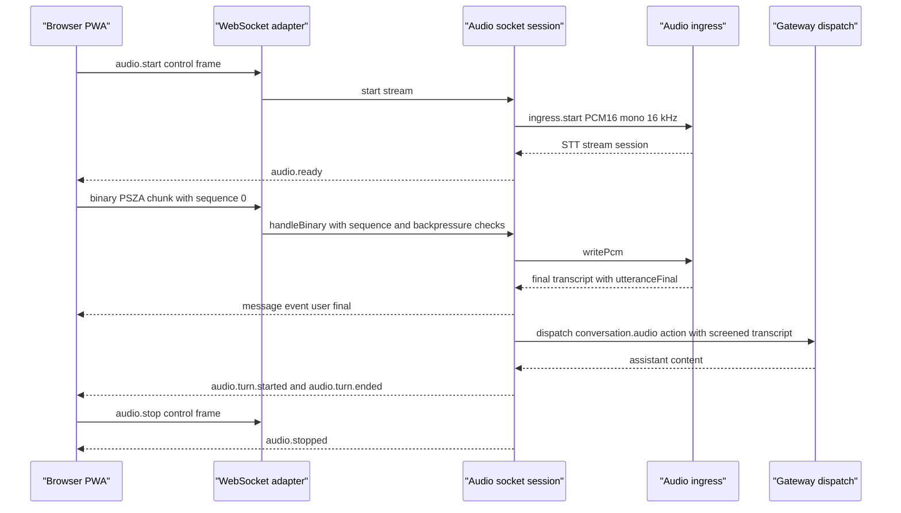

# Companion UI

The **Companion UI** (`companion-ui/`) is a standalone, mobile-first PWA for
companion chat. It is a client of the PSFN Satellite Hub: it renders the
relational chat surface plus presence and operational state, and all realtime
traffic flows through the gateway-owned Companion UI WebSocket protocol. It
runs no PSFN server logic, owns no memory or identity, and never calls PSFN
core or `/api/admin/*` endpoints directly. Protocol changes are coordinated
with the in-repo Hub source — the package deliberately stays standalone and
its client-side protocol mirror (`src/lib/protocol/`) is a strictly validated
view adapter, not the shipped wire contract.

## Channel position

`companion-ui` is a **first-class named channel type**, not a header-claimable
adapter channel. Browser turns that reach the runtime via the Companion UI
WebSocket enter the agent as ordinary inbound turns of channel type
`companion-ui`, authenticated server-side by their hub-device attachment
(never a client-supplied `X-PSFN-Channel-Type` header). A Discord-SSO'd human
lands bound to their canonical contact through the attachment's contact
binding. The channel has `scheduledContinuity: false` and `liveWakeup: true`
in the channel policy table, and the backplane always builds the
`companion-ui` channel profile so the runtime can source server-authored
turns.

## How the gateway serves the UI

The app is served on the canonical same-origin HTTPS path `/companion-ui/`.
There is no build-time Hub URL and no editable Hub, device, session, channel,
or credential field in the browser — the browser has no
deployment-authority configuration.

- The **`GatewayFleetSsoRouter`** matches the `/companion-ui` prefix
  (`COMPANION_UI_PREFIX`) for GET/HEAD requests. An unauthenticated navigation
  receives the fleet login landing page; an authenticated request is first
  authorized with a `companion.read` action against the bound companion and
  then proxied to the internal Companion UI upstream (an exact `http:` origin
  bound to a registered companion) via `serveCompanionUi`, which requires a
  zero-length body and pipes the upstream response.
- The app reads fleet session state from `/v1/fleet-auth/session/status`
  (`FleetAuthHttpRoutes`), which returns `signed_out` or `signed_in` plus the
  exact server-issued `websocketPath` (`/companion-ui/companions/<uuid>/ws`),
  and in `explicit` guest mode also hands out the guest websocket path in the
  signed-out response.
- The WebSocket upgrade itself is not proxied by the router: the
  `CompanionUiWebSocketAdapter` inside the gateway-hosted API server owns the
  `/companion-ui/companions/<uuid>/ws` upgrade path.
- The fleet portal roster projection also emits each companion's canonical
  `websocketPath` via `compileCompanionUiWebSocketPath`, and the client's
  roster parser (`fleet-roster.ts`) requires the path to equal exactly
  `/companion-ui/companions/${companionId}/ws`.

*Every browser action crosses the same admission, authorization, signed
capability, and dispatch path; the browser never supplies authority.*

## The WebSocket path

`compileCompanionUiWebSocketPath` (`src/boundary/gateway/companion-ui-websocket-path.ts`)
is the canonical builder for the one Companion UI WebSocket path a browser may
open for a companion: `/companion-ui/companions/<uuid>/ws`, requiring an
RFC-4122 companion id. The active companion is expressed **only** by which of
these URLs the client opens — never by a header, body, or cookie — and the
builder mirrors the server-side matcher in the adapter (`PATH_PATTERN`). The
path is not tied to the signed-in companion, so the app may open any
authorized companion's stream from the roster.

## Upgrade admission

`CompanionUiWebSocketAdapter.handleUpgrade` only claims paths under
`/companion-ui/`; anything else falls through to the rest of the server.
Admission (`resolveUpgradeAuthority` then `hubDeviceIngress.admit`) is
fail-closed:

- **Strict metadata** — exactly one `Host`, `Origin`, and `Authorization`
  header, zero `Sec-WebSocket-Protocol`, exact canonical origin and host, no
  forbidden browser authority headers (a closed set that includes every
  `x-psfn-*` claim header plus request-capability assertion headers), and
  exactly one fleet session cookie (or none, only under `explicit` guest
  mode). Any violation rejects the upgrade.
- **Authenticated backchannel** — the browser bearer must match a configured
  satellite API key (the Hub backchannel principal), the transport must be WSS
  (or a trusted-proxy client cert), and the satellite claim must resolve in
  the registry with a hub-device assertion extracted from headers.
- **Attachment** — `GatewayHubDeviceIngressService.admit` returns the
  `HubDeviceAttachmentSnapshot`: a `human` actor when a fleet browser session
  token is present, or a `guest` actor otherwise. A session token with a
  non-human attachment (and vice versa) is rejected.
- **Continuous authority** — every action dispatch and the 5-second watchdog
  re-run admission; if the refreshed attachment's authority key differs from
  the initial one, the socket closes with `4401 authority changed`. Server
  shutdown closes sockets with `1012`.

*Unknown, replayed, uncorrelated, discriminator-only, or structurally
malformed frames fail closed: the adapter sends one `ok: false` result with
`error.code = denied` and closes the socket.*

## Wire protocol

Browser frames have the exact top-level shape
`{schemaVersion: 1, requestId, action, resource, body}`. The first frame on a
fresh socket must be `session.configure` with exactly
`eventCapabilities: ['approvals.v2']`; only after that does the server send
the single `session.ready` frame carrying server-owned device and place
presentation (from the satellite claim's endpoint display name and static
location label), the advertised capability ceiling, telemetry scopes, and the
negotiated event capabilities. The authenticated gateway sends only:

- one exact server-owned `session.ready` attachment presentation;
- one exact correlated `result` for each action;
- `event` frames for subscribed companion events (approval lifecycle, artifact
  creation, tool activity, emotion snapshots) filtered to the negotiated
  telemetry scopes;
- audio stream control frames (`audio.ready`, `audio.ack`, `audio.turn.*`,
  `audio.stopped`) when the audio ingress is active.

The client parses every one of these strictly (`gateway-protocol.ts`):
`parseAttachmentReady` requires exact keys, a bounded device/place label, and
capability values drawn from closed registry sets; `parseGatewayResult`
accepts only `requestId: ''` + `error.code: 'denied'` for failures and exact
keys for success; `parseGatewayEvent` re-validates the embedded relay event
through the legacy Hub mirror and additionally requires the v2 approval
fields when the event is `approval.requested`.

## The action contract

The contract lives in `src/boundary/fleet-auth/companion-ui-action.ts` and is
shared by the gateway, the request-capability classifier, and the adapter:

- **Resources** — the closed `COMPANION_UI_ACTION_RESOURCES` set:
  `conversation.status`, `conversation.interact`, `conversation.interrupt`,
  `conversation.touch`, `conversation.audio`, `shards.list`,
  `shards.history`, `shards.interact`, `shards.interrupt`,
  `confirmations.list`, `confirmations.resolve`, `artifact.preview`,
  `tool_activity.subscribe`, `embodiment.status`, `embodiment.handoff`.
- **Action mapping** — `RESOURCE_ACTION` maps each resource to a fleet action
  (`companion.read`, `companion.interact`, `confirmations.read`,
  `confirmations.resolve`, `artifacts.read`, `tool_activity.read`,
  `embodiment.handoff`); the frame's `action` must equal the mapping or the
  frame is denied.
- **Physical ceiling** — `RESOURCE_PHYSICAL_CEILING` declares the satellite
  capabilities and telemetry scopes each resource requires (e.g.
  `conversation.interact` needs `text`; `conversation.audio` needs
  `audio_input` + `speech_to_text`; `confirmations.*` needs the `approvals`
  telemetry scope). `compileCompanionUiAction` intersects the server-resolved
  Hub ceiling and denies with `physical_capability_denied` when a resource
  exceeds it.
- **Authority rejection** — `rejectAuthorityFields` walks the entire body and
  denies with `authority_forbidden` if any key (case- and
  separator-normalized) matches the forbidden set: `assertion`, `audience`,
  `capability`, `channel`, `companion`, `contact`, `device`, `enrollment`,
  `human`, `identity`, `place`, `principal`, `provider`, `requestcapability`,
  `session`, `trusted`, `trustlevel`, `user`, and their variants.
- **Bounds** — `COMPANION_UI_PROTOCOL_LIMITS`: 1 MiB frames, 65 536 text
  characters, 200 artifact-id characters; request ids and artifact ids match
  bounded patterns; each resource's body is validated with exact keys
  (`parseBody`).
- **Compilation** — `compileCompanionUiAction` produces a
  `CompiledCompanionUiAction` whose `target` is a `CompiledGardenRequestTarget`
  (WS method, canonical path `/companion-ui/companions/<uuid>/ws/actions/<resource>`,
  and SHA-256 digests over body, resource, authorization, and target).
  `resolveCompanionUiActionClassification` is what plugs Companion UI actions
  into the request-capability authorization flow; `companionUiPromptContent`
  is the exact prompt text source for the three prompt-bearing resources
  (`conversation.interact`, `shards.interact`, `conversation.audio`) and
  synthesizes the bounded touch pseudo-prompt.

## The action broker

`GatewayCompanionUiActionBroker.execute` is the gateway-owned browser action
broker (`src/boundary/gateway/companion-ui-action-broker.ts`). For every
frame it:

1. compiles the frame against the physical ceiling;
2. resolves the **current** human fleet authorization context from the session
   token (audience `fleet`, companion, action, correlation id);
3. requires `exactHumanAttachmentIsCurrent` — the human attachment's
   companion, principal, provider subject, contact binding, operator grant,
   and session record must exactly equal the resolved authorization context;
4. denies `confirmations.resolve` for `guest` operator roles and for approval
   ids the gateway does not attribute to this companion;
5. for shard resources, resolves the live shard's owner through the agent's
   `shard.directory.owner` RPC and denies unless the owner is this companion;
6. signs an **operator parent** capability with the restrictive
   `multi_admin` fleet access mode (Companion UI is not a human admin surface,
   so the restrictive mode is applied unconditionally, fail closed);
7. exchanges the parent for a linked **agent-only child assertion** and
   verifies both digests match the compiled target; and
8. dispatches **only the child** plus separate human/device provenance — the
   operator token never reaches the agent.

## Dispatch wiring

`api-surface.ts` composes the adapter with a dispatch port that routes each
resource:

- `shards.list` / `shards.history` / `shards.interact` / `shards.interrupt`
  go through `gatewayApiRuntime.handleCompanionUiShardAction`, which forwards
  the `api.companion-ui.shard.action` RPC to the owning companion agent with
  the child capability attached.
- `embodiment.status` / `embodiment.handoff` go to
  `dispatchCompanionUiPrimaryEmbodiment`.
- `confirmations.list` / `confirmations.resolve` go to
  `dispatchCompanionUiApproval`.
- `conversation.status` returns the gateway runtime health response.
- `artifact.preview` resolves the relay's preview source and returns
  `artifactId`, `mediaType`, `sizeBytes`, `dataBase64`.
- `tool_activity.subscribe` returns `{ subscribed: true }`.
- `conversation.interrupt` aborts the tracked interaction
  (`activeCompanionUiInteractions`).
- Prompt-bearing resources run `gatewayApiRuntime.handleChatCompletion` with
  an interaction `AbortController` (mirroring the socket's signal) so
  interrupts and socket cancellation propagate into the agent turn.

Under `fleetSsoCompanionUi.guestMode === 'explicit'` a separate
`guestActionBroker` accepts only `conversation.status`, `conversation.interrupt`,
`conversation.interact`, `conversation.audio`, and `conversation.touch` on a
guest attachment — approvals, embodiment, artifacts, and shards are denied for
guests.

## Approvals surface

`dispatchCompanionUiApproval` (`src/boundary/gateway/companion-ui-approvals.ts`)
handles the confirmation subset:

- `confirmations.list` projects pending confirmation-queue entries through
  `redactApprovalRequested`, keeping only entries whose attribution parent and
  approval owner both equal the target companion (and whose shard ids match
  when shard provenance is present). Raw params never leave the boundary —
  the test asserts the serialized result contains no `must-not-leak` value,
  no other-owner entry, and no mismatched shard entry.
- `confirmations.resolve` resolves through the gateway port, which calls
  `approvalBoundary.resolveConfirmationForOwner` with the operator id
  `companion-ui:<companionId>` (`server.ts`). Owner scoping is applied again
  at this port so callers that bypass the browser broker stay safe.

Approval **events** flow from the companion relay subscription: the adapter
projects only `approval.requested` / `approval.resolved` envelopes that carry
the required v2 fields and matching routing metadata, gated on the
`approvals` telemetry scope and the negotiated `approvals.v2` event
capability. On the client, `approvals.ts` keeps the whole surface
fail-closed: `deriveApprovalPanelState` reports `unsupported` until the
session acknowledges both the `approvals` control capability and the
`approvals.v2` event capability, and `submitApprovalDecision` throws
otherwise. `fleet-approval-routing.ts` merges the stream approvals with
fleet-roster approvals (bounded to 1 024 entries), routes a decision to the
correct companion (switching companions first when needed), and surfaces
expiry countdowns and resolved states in the contextual approval cards.

## Audio ingress

`GatewayCompanionUiAudioIngress` (`src/boundary/gateway/companion-ui-audio-ingress.ts`)
is the gateway-owned continuous PCM-to-utterance bridge. Browser audio is
fixed to **PCM16 mono 16 kHz**; a streaming STT connector with
`interimResults: true` marks utterance boundaries, and only bounded transcript
text leaves the module:

- constructor-validated positive-integer limits: `maxFrameBytes`,
  `maxPendingUtterances`, `maxTranscriptBytes`;
- `writePcm` rejects non-`Uint8Array`, empty, odd-sized, or oversized frames
  before they reach STT;
- transcripts pass `assertBoundedText` at every emission point; final
  segments accumulate into a combined bounded utterance;
- utterance delivery is serialized on a promise chain with a pending-utterance
  ceiling — exceeding it fails visibly (`onError`) instead of buffering
  unbounded completed utterances;
- `stop` ends input and drains pending deliveries; `cancel` aborts the
  controller and cancels the stream; any failure aborts the controller and
  cancels the stream once.

The socket-level `CompanionUiAudioSocketSession`
(`src/channels/api/companion-ui-audio-socket.ts`) owns one socket's optional
PCM stream: binary frames are PSZA chunks (`0x50 0x53 0x5a 0x41`, version 1,
big-endian sequence, even-length PCM) parsed by the shared
`companion-ui-audio.ts` contract; each chunk must carry the expected
monotonic sequence and respects the pending-frame backpressure ceiling
(default 32). JSON control frames `audio.start` / `audio.interrupt` /
`audio.stop` drive the stream; the server acks chunks (`audio.ack`), emits
`audio.ready`, `audio.turn.started`, `audio.turn.ended`, `audio.stopped`, and
echoes live (`live: true`) and final user/assistant messages as `message`
events. Completed utterances are screened through the intake screening
service (`screenAudioTranscript`, origin ref `companion-ui-audio:...`) before
being dispatched as a `conversation.audio` action; `audio.interrupt` cancels
the active interaction and emits an `interrupt` action event; failures
terminate the socket.

*The audio stream is capability-gated end to end: the adapter only advertises
`audio_input` and `speech_to_text` when the ingress plus screening and
cancellation ports are configured and the physical ceiling includes both, so
an absent capability leaves browser capture inert. The client starts a stream
only after `session.ready` advertises `microphone_pcm`, and enforces the same
1 MiB buffered-byte and 32 pending-ack ceilings on its side.*

Client-side playback of spoken replies is gated on the `streamed_audio`
output capability: the client reassembles the hub's bracketed audio stream
(`audio-init` text signal, base64 `audio` frames, `audio-end`), decodes it
through Web Audio, drives amplitude-only lipsync on the sprite, and drops any
audio outside a bracket, malformed base64, or over the size ceiling. The Z02
BLE badge link (Web Bluetooth, `use-z02-link.ts`) captures PCM through the
phone and reports `Mic received` / `Mic decoded` — it never claims upstream
relay, because the shipped transport accepts final transcripts, not raw PCM.
The live voice surfaces themselves (Discord voice, the `/v1/voice/ws` API
websocket, the Satellite Hub) are documented on the voice page, not here.

## Primary embodiment

`dispatchCompanionUiPrimaryEmbodiment`
(`src/boundary/gateway/companion-ui-primary-embodiment.ts`) handles
`embodiment.status` and `embodiment.handoff` through the
`PrimaryEmbodimentAuthorityPort`:

- `embodiment.status` returns the browser projection of the
  `PrimaryEmbodimentSnapshot`: `generation`, `version`, `primaryPresent`,
  `currentDeviceIsPrimary` (compared against this socket's attachment id),
  and the redacted `lastDecision` (decision, reason, decided-at) — never
  device ids, place ids, attachment ids, enrollment versions, hub session
  ids, or decision ids.
- `embodiment.handoff` requires `expectedGeneration`, an RFC-4122
  `decisionId`, and a reason from
  `user_requested | device_replacement | recovery`; the authority denies on
  decision replay, cross-companion decisions, stale generations, non-current
  attachments, missing Partner authority, and already-primary states.

Neither authentication nor reconnection claims primary embodiment: the
`session.ready` device/place presentation is displayed separately and the
embodiment state is always read fresh from the authority.

## Client application architecture

The client is a React 19 + Vite PWA rooted at `companion-ui/src`:

- `main.tsx` mounts `App` and registers the service worker; `index.html`
  declares the manifest and icons under `/companion-ui/`.
- `App.tsx` renders one continuous relationship thread — no conversation
  lists, sidebars, or permanent banners: a floating sprite (reflecting
  attentive / speaking / listening / thinking / tool-use / error states),
  a composer (plus button, multiline text, mic toggle, send), a contextual
  toast layer for approval and artifact cards, an Activity drawer (the
  redacted event-bus transparency surface with All / Messages / Artifacts /
  Approvals / Voice / Tools / System / Errors filters), and a Settings
  drawer. Taps on the sprite are coalesced for three seconds and sent as one
  bounded `conversation.touch` interaction.
- `CompanionGatewayClient` (`lib/api/gateway-client.ts`) owns the socket:
  connect sends `session.configure`, waits for `session.ready`, validates
  request ids (`validCompanionRequestId`), correlates results, tracks the
  active interaction and authorized shard, and implements the PCM audio
  stream with per-frame backpressure. It deliberately reuses the view
  store's event port but never emits the legacy Hub hello protocol and never
  places device/session/channel authority in a browser frame.
- `lib/stream/hub-stream.ts` is the client state store that derives session,
  message, approval, artifact, tool-activity, and voice-playback state from
  the parsed frames; `fleet-session.ts` reads and validates the status
  endpoint (no-store required) and serializes login/logout/refresh
  transitions through `navigator.locks`.
- The fleet roster (`fleet-roster.ts`) feeds the companion selector: the
  active companion is expressed only by opening that companion's exact
  server-issued websocket path.

## PWA and service worker

The service worker is generated at build time (`vite/companion-service-worker.ts`)
from `service-worker/sw.js`, registered with the exact `/companion-ui/`
scope, and versioned by `COMPANION_UI_BUILD_REVISION` (pinned commit in
container builds, deterministic bundle hash locally):

- it precaches only the build-time static shell (scope, index, manifest,
  icons, hashed assets) with credentials omitted, refusing any response that
  is not a public static asset (no-store, private, cookie-varied, or
  set-cookie responses are rejected);
- it handles only query-free same-origin GET shell navigations and the
  allowlisted assets; Fleet, Garden, callback, authentication, WebSocket,
  query-bearing, credential-header, and no-store traffic stays on the
  browser network;
- offline mode serves only the build-time unauthenticated shell; online shell
  responses are never written to Cache Storage;
- the client retires the legacy root-scoped worker registration and its cache
  (`retireLegacyRootRegistration`), the new worker removes stale
  `psfn-companion-ui-*` caches on activate, and updates are passive — they
  never navigate an open client, which keeps its draft, attachments, and live
  session and shows an update-ready notice instead.

## Capability ceiling and fail-closed semantics

The physical capability ceiling is the intersection of the authenticated Hub
satellite's registry claim (capabilities and telemetry scopes) with the
per-resource ceiling table, then with the broker's authorization decisions.
Surfaces stay inert until the hub acks them: approvals require the
`approvals` telemetry scope plus the `approvals.v2` event capability;
artifact and tool-activity families are only relayed to satellites that
advertise them; audio input requires `audio_input` + `speech_to_text` plus
the gateway ingress wiring. Every fail-closed path is exercised in tests:
malformed frames, forbidden authority fields, duplicate or exhausted request
ids, sequence or backpressure violations, capability gaps, owner mismatches,
and authority changes all deny and close the socket.

## Shard chat and approvals

`shards.*` resources are live: the browser lists a server-resolved directory,
opens direct chat threads with a shard (the `shardId` is a resource selector,
revalidated on every action), reads bounded history, and interrupts shard
turns. Shard-originated approval requests carry `shardId` as provenance in
the redacted envelope. The `companion-ui/SHARD_APPROVALS.md` specification is
an approved target contract (parent-owner attribution, server-side fleet
filtering, request-scoped temporary grants) whose implementation is pending;
the page documents shipped behavior, not that target.

## Validation and tests

The package's gates are `npm run test`, `npm run test:browser`, `npm run
typecheck`, `npm run lint`, `npm run build`, and `npm audit --omit=dev`. The
Playwright browser gate runs in real Chromium against a deterministic fake
OAuth/Hub lifecycle and proves fresh connections across login and Partner
switch, authority clearing on logout, revocation and offline transitions,
uncontrolled fleet/Garden/callback pages, and cache keys/bodies/stores/URLs
free of authority secrets, plus install/update/rollback/offline reloads.

Focused server-side suites cover:

- the websocket adapter (`companion-ui-websocket.test.ts`) — upgrade metadata,
  query-bearing paths rejected, session configure/ready, event projection,
  audio control, authority changes;
- the action broker (`companion-ui-action-broker.test.ts`) — exact attachment
  matching, guest denial on resolution, shard ownership, child-assertion
  digest verification;
- approvals dispatch (`companion-ui-approvals.test.ts`) — redaction and
  owner/shard projection, companion-scoped resolution;
- audio ingress (`companion-ui-audio-ingress.test.ts`) — PCM streaming,
  malformed-frame rejection, bounded utterances, backlog failure;
- primary embodiment (`companion-ui-primary-embodiment.test.ts`) — no
  identity leakage in projections, no handoff from ordinary interactions.

## Operations

The repository ships an optional static web container
(`docker/companion-ui/`): a multi-stage image that builds this package and
serves only the built `dist/` tree at `/companion-ui/` on a pinned
`nginx-unprivileged` base (port 8080, uid 999); `build-image.sh` tags commits
and refuses dirty trees. Ingress, service, and network-policy configuration
belongs in the consuming deployment repository — the container holds no
server logic.
