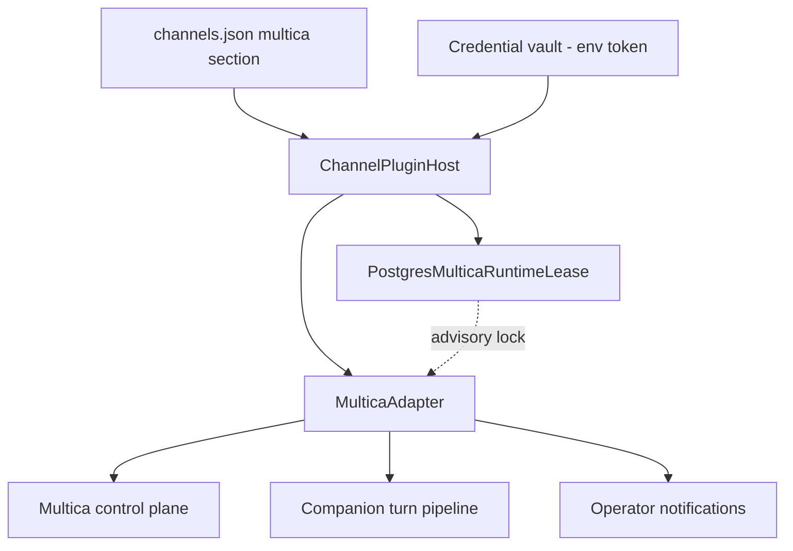
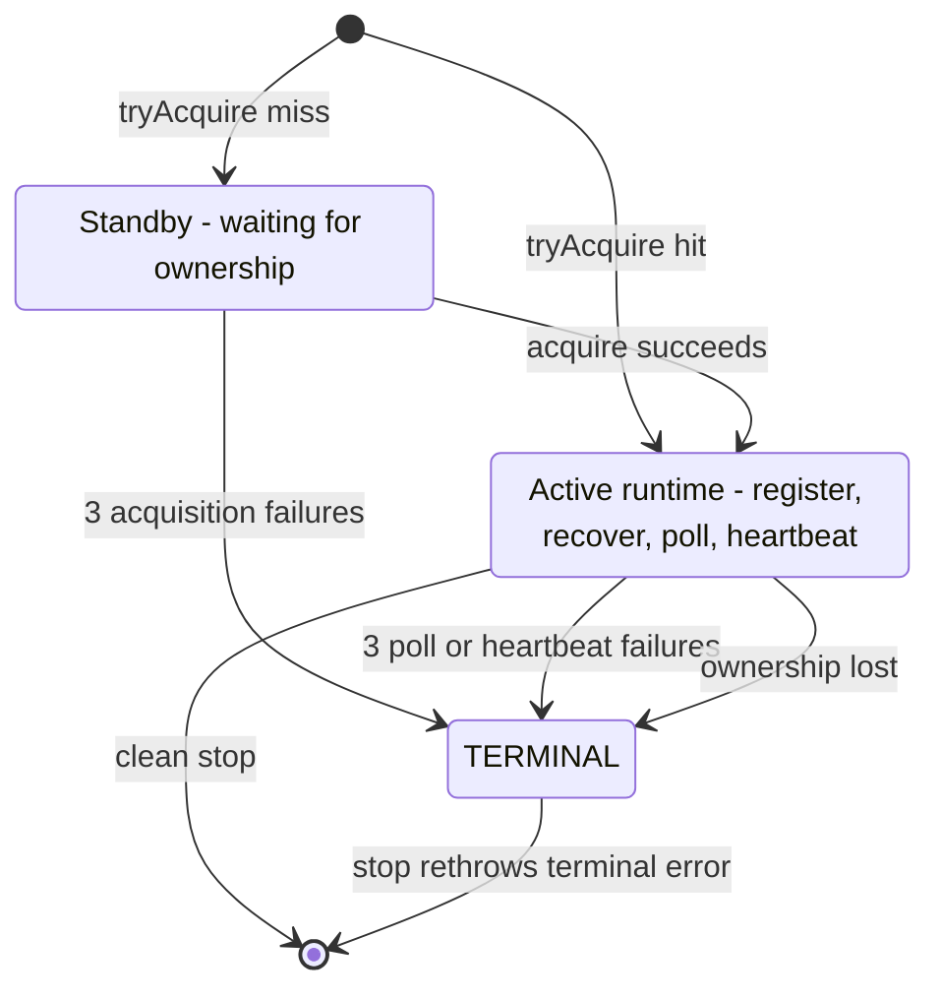
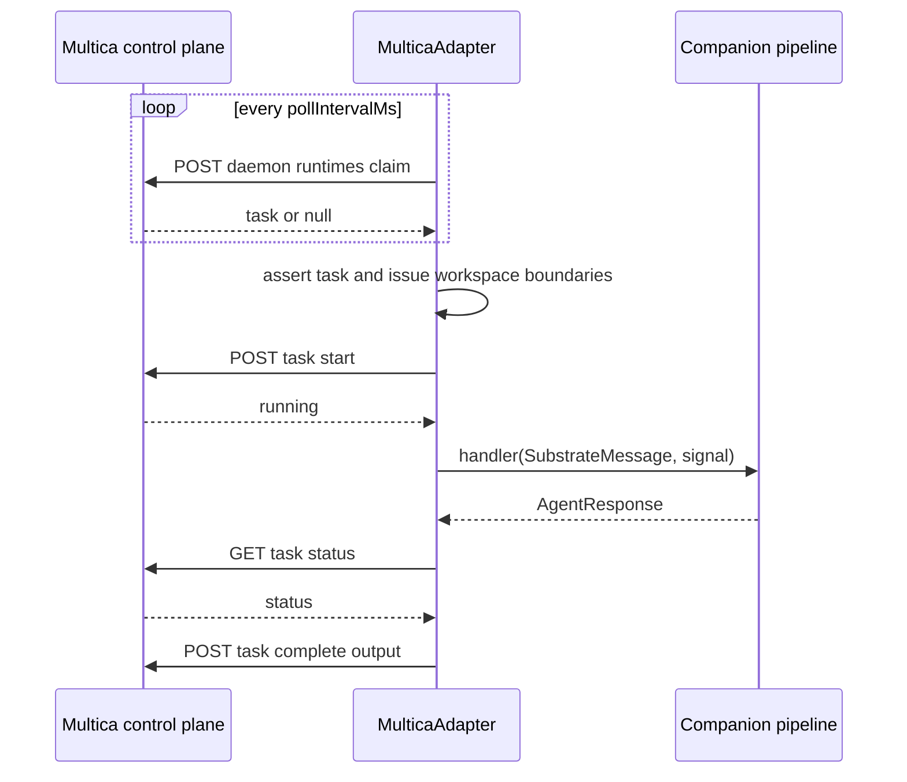

# Multica Channel

Multica is an external work-item platform (workspaces, issues, tasks, squads,
autopilot runs, chat sessions) that the gateway serves as a **daemon runtime**.
The Multica channel adapter registers a `psfn` runtime with the Multica control
plane, polls that runtime for claimed tasks, executes each work item through the
ordinary companion turn pipeline, and settles the outcome back on the control
plane (`complete` / `fail`). It is the only built-in channel **plugin** — unlike
Discord, Telegram, and the API channel it is not a manifest adapter but a
`channels.json`-declared plugin loaded by the `ChannelPluginHost`
(`src/channels/plugins/builtin.ts#L5-L7`).

The authority for this page is `src/channels/multica/*`,
`src/persistence/postgres/multica-runtime-lease.ts`, and their tests, together
with the gateway wiring in `src/boundary/gateway/channel-surfaces.ts`. See
<!-- openwiki: broken internal link [../channel-plugins.md] file "../channel-plugins.md" does not exist. Fix the href or restore the target, then delete this comment. -->
[channel-plugins.md](../channel-plugins.md) for the plugin contract this channel
<!-- openwiki: broken internal link [../chat-turn-lifecycle.md] file "../chat-turn-lifecycle.md" does not exist. Fix the href or restore the target, then delete this comment. -->
implements, [chat-turn-lifecycle.md](../chat-turn-lifecycle.md) for what happens
to the synthesized message once the companion pipeline takes it,
<!-- openwiki: broken internal link [../multi-companion.md] file "../multi-companion.md" does not exist. Fix the href or restore the target, then delete this comment. -->
[multi-companion.md](../multi-companion.md) for surface routing, and
<!-- openwiki: broken internal link [../eidoverse-hub-integration.md] file "../eidoverse-hub-integration.md" does not exist. Fix the href or restore the target, then delete this comment. -->
[eidoverse-hub-integration.md](../eidoverse-hub-integration.md) for the separate
satellite-hub transport (Multica is unrelated to it).

*Where the Multica channel sits: a plugin-declared adapter whose daemon identity is fenced by a Postgres advisory runtime lease, whose turns run through the companion pipeline, and whose terminal failures page the operator.*

## Plugin surface and channels.json configuration

`createMulticaChannelPlugin` (`src/channels/multica/plugin.ts#L47-L62`) exposes
the channel as plugin id `multica` with `parseConfig` and `create`.
`parseMulticaChannelConfig` (`src/channels/multica/plugin.ts#L64-L132`) is the
reference example of the fail-closed plugin section contract:

| Key | Requirement |
| --- | --- |
| `enabled` | Mandatory when the section exists; boolean |
| `baseUrl` | Absolute HTTP(S) origin; normalized by `normalizeMulticaOrigin` |
| `workspaceId` | Lowercase RFC-4122 UUID |
| `companionId` | Parsed via `createCompanionId` |
| `tokenRef` | Credential reference, `env` kind only, uppercase env var name |
| `pollIntervalMs` | Positive integer in `[250, 60_000]`, default `1_000` |
| `runtimeName` | Optional display name for the registered runtime |

The parser rejects an inline `token` field (`channels.json.multica.tokenRef
must be used instead of token`), rejects unknown keys, requires `enabled` to be
present whenever the section exists, and requires `baseUrl`, `workspaceId`,
`companionId`, `tokenRef`, **and** `pollIntervalMs` when `enabled: true`
(`src/channels/multica/plugin.ts#L102-L110`). The credential need is declared
as id `token` with description `Multica gateway token`, so the vault resolves
the secret before `create` runs (`src/channels/multica/plugin.ts#L115-L121`).

`normalizeMulticaOrigin` (`src/channels/multica/origin.ts#L4-L20`) hardens the
control-plane origin: the URL must be absolute HTTP(S), must not carry
credentials, a path, a query, or a fragment, and plain `http:` is only accepted
for loopback hosts (`localhost`, `127.0.0.1`, `[::1]`). This is what protects
the owner bearer token from being embedded in a configured URL.

`createMulticaPluginInstance` (`src/channels/multica/plugin.ts#L134-L165`)
fails closed when the enabled section has no `companionId` or no resolved
`token` secret. It derives the runtime lease from
`context.postgresDatabaseUrl` via `createGatewayMulticaRuntimeLease`
(`src/channels/multica/plugin.ts#L167-L177`), which builds a dedicated pool
(`applicationName: 'psfn-multica-runtime-lease'`, `max: 1`,
`connectionTimeoutMillis: 5_000`) and throws when the gateway supplied no
database URL — the adapter never falls back to a non-Postgres ownership store.

## Adapter surface

`MulticaAdapter` (`src/channels/multica/adapter.ts#L115-L185`) implements
`ChannelAdapterPort`:

- `id`/`name` `multica`, label `Multica`
- capabilities: `chatTypes ['channel', 'thread']`, `threads: true`, no media,
  no reactions, no streaming, `promptChannelType: 'multica_work_item'`
- `security.supportsDirectMessages: false`
- `prompt.resolveChannelType` returns `multica_work_item` and
  `prompt.resolveTaskKind` returns `work_item` — the agent-side channel prompt
  registry consumes these to shape prompt assembly and turn task kind
  (`src/channels/multica/adapter.ts#L119-L130`; consumed in
  `src/core/agent/substrate-agent/channel-routing-runtime.ts#L66-L86`)
- `outbound.sendText` throws: *"Multica task replies are delivered from the
  channel handler result"* — the response content is posted to the task
  completion endpoint instead of being sent out of band
  (`src/channels/multica/adapter.ts#L174-L179`)

The adapter derives its stable daemon identity from the companion:
`daemonId = psfn-gateway-{companionId}` and
`leaseKey = multica:{workspaceId}:{companionId}`
(`src/channels/multica/adapter.ts#L38-L42`, `#L170-L171`). Runtime constants are
provider `psfn`, version `gateway-channel-v1`, device name `PSFN Gateway`.

## Daemon runtime lifecycle and ownership

Starting the adapter is a two-phase ownership dance that keeps the stable
Multica identity single-owner across gateway pods:

1. `start()` is a no-op when the channel is disabled, requires an inbound
   `onMessage` handler and an `onOperatorAlert` handler, and coalesces
   concurrent starts through `startPromise`; a start issued while a stop is in
   flight awaits the stop and then restarts
   (`src/channels/multica/adapter.ts#L194-L217`).
2. `beginRuntimeStart` first probes the lease with the non-blocking
   `tryAcquire` (`src/channels/multica/adapter.ts#L219-L226`). A hit activates
   immediately.
3. On a miss — a rolling replacement arriving while the old pod still owns the
   identity — the adapter becomes a standby: `acquireStandbyOwnership` retries
   `lease.acquire` up to three times at `pollIntervalMs` and only then
   activates (`src/channels/multica/adapter.ts#L255-L279`). Three failures
   alert the operator (`standby`) and become the terminal error instead of
   wedging silently.

`activateOwnedRuntime` (`src/channels/multica/adapter.ts#L281-L362`) combines
the run controller and `ownership.lost` into one signal, then:

- registers the daemon: `POST /api/daemon/register` with `workspace_id`,
  `daemon_id`, `device_name: 'PSFN Gateway'`, `cli_version:
  'gateway-channel-v1'`, `launched_by: 'gateway'`, and a runtime entry
  `{ name: runtimeName || 'PSFN Companion', type: 'psfn', version,
  status: 'online' }`; the response must contain a `runtimes[]` entry whose
  provider matches `psfn` (`parseRegistrationResponse`)
- runs orphan recovery: `POST
  /api/daemon/runtimes/{registeredId}/recover-orphans`, which lets a standby
  that took over after an owner crash re-adopt the crashed pod's runtime
- then starts the poll loop, the heartbeat loop, and the ownership watcher.

*Runtime ownership states: a gateway pod is either a standby waiting on the lease or the active owner of the stable Multica identity; bounded failures and lost ownership move it to a terminal state that stop() surfaces.*

While active, the **poll loop** claims one task per iteration and waits
`pollIntervalMs` between attempts; three consecutive failures call
`failRuntime('polling')` (`src/channels/multica/adapter.ts#L451-L470`). The
**heartbeat loop** posts `POST /api/daemon/heartbeat { runtime_id }` every
`heartbeatIntervalMs` (default 15 s) and stops the runtime after three failures
(`src/channels/multica/adapter.ts#L472-L493`). `requestTimeoutMs` defaults to
the same 15 s and `shutdownTimeoutMs` defaults to `requestTimeoutMs`
(`src/channels/multica/adapter.ts#L157-L161`).

## One task turn: claim, guard, execute, settle

`claimAndHandleOne` (`src/channels/multica/adapter.ts#L495-L596`) is the
single-turn pipeline:

*One claimed work item: boundary guards run before companion ingress, the handler executes under a cancellation signal, and settlement only posts complete when the task is still running.*

Steps, in order:

1. **Claim** — `POST /api/daemon/runtimes/{runtimeId}/tasks/claim`; a `null`
   task means "nothing to do" and the loop polls again
   (`src/channels/multica/adapter.ts#L495-L502`).
2. **Task boundary** — `assertTaskBoundary` requires the claimed task's
   `runtime_id` to equal the registered runtime and its `workspace_id` to equal
   the configured workspace; any mismatch throws
   `MulticaWorkspaceBoundaryError` and terminates the runtime with
   `failRuntime('workspace-boundary')` **without** posting a `/fail` and
   **without** invoking the handler — the crossed work item is rejected before
   companion ingress (`src/channels/multica/adapter.ts#L719-L730`, `#L576-L579`).
3. **Issue fetch** — when the task carries `issue_id`, the adapter fetches
   `GET /api/issues/{issueId}` using the task's own `auth_token` (a
   task-scoped credential that must be present), then `assertIssueBoundary`
   verifies the returned issue id and workspace match the task
   (`src/channels/multica/adapter.ts#L732-L751`). Task and issue are therefore
   validated together before any companion work.
4. **Start** — `POST /api/daemon/tasks/{taskId}/start` with reconciliation:
   if the start request fails after a possible commit, the adapter polls the
   status and treats `running` as success, treats a terminal status as an
   interruption (no companion execution), and retries only when the status is
   still `dispatched` or `waiting_local_directory`. An unreconcilable ambiguous
   start throws `MulticaTaskStartReconciliationError`, which becomes
   `failRuntime('start-reconciliation')` — the task is **not** failed on the
   control plane because the adapter cannot prove it never started
   (`src/channels/multica/adapter.ts#L598-L660`).
5. **Execute** — the task is rendered into a `SubstrateMessage`
   (`toMulticaSubstrateMessage`) and handed to the channel handler with an
   `AbortSignal`. A parallel **cancellation watcher** polls the task status
   every `pollIntervalMs` and aborts the handler when the task reaches a
   terminal status, returns 404 (task deleted/reassigned), or after three
   failed status checks (`src/channels/multica/adapter.ts#L678-L717`). An
   aborted handler result is discarded and no completion or failure is posted
   — the task was settled externally
   (`src/channels/multica/adapter.ts#L520-L530`).
6. **Settle** — after the handler resolves, the adapter re-checks status; a
   terminal status means the control plane already settled the task. Otherwise
   it posts `POST /api/daemon/tasks/{taskId}/complete { output:
   response.content }` with up to three attempts. A failed completion is
   reconciled against a fresh status read: terminal wins, anything else
   becomes `failRuntime('completion-settlement')`
   (`src/channels/multica/adapter.ts#L531-L562`).
7. **Fail** — a handler error posts `POST /api/daemon/tasks/{taskId}/fail
   { error, failure_reason: 'psfn_gateway_companion_error' }` with up to three
   attempts; if even the failure report fails, the runtime stops with
   `failRuntime('failure-settlement')`
   (`src/channels/multica/adapter.ts#L580-L594`).

`getTaskStatus` treats a 404 from the status endpoint as
`MulticaTaskInterruptedError` ("no longer exists")
(`src/channels/multica/adapter.ts#L662-L676`).

## Task message shaping

`toMulticaSubstrateMessage` (`src/channels/multica/task-message.ts#L56-L89`)
projects a claimed task into the runtime's inbound message contract:

- **channelId** is derived from the task's strongest identity:
  `multica:{workspaceId}:issue:{issueId}` when an issue exists, otherwise
  `:chat:{chatSessionId}`, `:autopilot:{autopilotRunId}`, or finally
  `:task:{taskId}` (`src/channels/multica/task-message.ts#L6-L12`).
- **content** is a markdown work-item brief: task id and kind (defaulting to
  `direct`), issue identifier, project, squad, resolved squad role
  (leader/worker), issue details, handoff note, trigger comment, earlier
  coalesced comments, chat message, quick-create request, autopilot title or
  description, assignment instructions, and project description
  (`src/channels/multica/task-message.ts#L19-L46`).
- The body runs through the **intake firewall** via `screenChatMessageBody`
  with surface `multica`, source class `tool_output`, channel privacy
  `invite_only`, and group topology; the returned snapshot rides along in
  `routing.intakeEnvelopes` so later context assembly and memory extraction
  can consult the sink gates without re-screening
  (`src/channels/multica/task-message.ts#L62-L71`).
- The message is authored as the machine: `authorId:
  multica:system:{workspaceId}`, `authorName: 'Multica system'`,
  `isDirectMessage: false`, `replyToMessageId` set from the trigger comment,
  and `routing.authorIsMachineIntelligence: true`
  (`src/channels/multica/task-message.ts#L72-L88`).

Because Multica work enters as a machine-authored invite-only group message, it
is subject to the same fatigue/trust machinery as any other turn. Note the
channel behavior policy marks `multica` with `scheduledContinuity: false` and
`liveWakeup: false` (`src/shared/contracts/channel-types.ts#L25`).

## Protocol and HTTP client

The response parsers in `src/channels/multica/protocol.ts` are strict and
fail-closed:

- `parseRegistrationResponse` requires `runtimes[]`, each with non-empty `id`
  and `provider`, and selects the entry whose lowercased provider matches
  `psfn` (`#L103-L119`).
- `parseClaimResponse` accepts `{ task: null }` or a task object; `id`,
  `runtime_id`, and `workspace_id` are required non-empty strings, optional
  strings are trimmed and type-checked, and the optional booleans
  (`is_leader_task`, `leader_role_resolved`), `coalesced_comments`, and
  `agent.instructions` are validated field by field (`#L121-L166`).
- `parseIssueResponse` and `parseTaskStatusResponse` apply the same discipline;
  `isTerminalTaskStatus` recognizes exactly `completed`, `failed`, and
  `cancelled` (`#L168-L194`).

`MulticaHttpClient` (`src/channels/multica/http-client.ts#L42-L85`) sends JSON
with `Authorization: Bearer {token}` (the owner token by default, overridable
per request for the task-scoped issue fetch), throws `MulticaHttpError` on
non-OK status, maps an empty body to `{}`, and rejects invalid JSON.
`withMulticaOperationTimeout` (`#L14-L40`) races each operation against the
per-operation timeout and the parent abort signal; the adapter's `withAttempts`
helper layers three attempts over it with backoff-free retries and a bounded
operation timeout (`src/channels/multica/adapter.ts#L753-L774`).

## Runtime lease: Postgres advisory locks

`MulticaRuntimeLease` (`src/channels/multica/runtime-lease.ts#L1-L18`) is the
cross-pod ownership contract: `tryAcquire` is a non-blocking readiness probe,
`acquire` waits (polling) without blocking gateway readiness, and a handle
exposes `lost` (aborts on unexpected ownership loss) plus `release`.

`PostgresMulticaRuntimeLease`
(`src/persistence/postgres/multica-runtime-lease.ts#L139-L228`) implements it
with **session-scoped advisory locks**: `SELECT
pg_try_advisory_lock(hashtextextended($1, 0))` is run on a dedicated checked-out
connection, so the lock lives exactly as long as that session
(`#L150-L186`). The handle (`#L89-L132`) aborts its `lost` signal when the
session emits an `error` — the fencing guarantee: process or connection death
releases the lock automatically for a standby pod. `release()` runs
`pg_advisory_unlock` and then destroys the session, bounded by a 5 s operation
timeout (`#L109-L131`). Connect and query are abort-interruptible so shutdown
never hangs on a stalled pool. The focused lease tests cover cancellation while
the connection is pending, connection destruction on stalled queries, explicit
release, session-death fencing, and bounded unlocks
(`src/persistence/postgres/multica-runtime-lease.test.ts`).

The rolling-replacement behavior falls out of this design: a replacement pod
registers the same `daemon_id`, waits on `acquire`, and only registers and
recovers orphans once the old pod's session (and lock) is gone; the old pod
skips deregistration when it observes `lost` so a stale deregistration can
never cancel the standby's fresh registration
(`src/channels/multica/adapter.test.ts#L512-L663`).

## Failure semantics and operator alerts

Bounded failures stop the channel instead of wedging. `failRuntime` →
`terminateRuntime` (`src/channels/multica/adapter.ts#L776-L829`):

- sets `running = false` and aborts the run controller, so the poll and
  heartbeat loops exit and in-flight task signals abort;
- alerts the operator with an idempotency key
  `multica-channel:{workspaceId}:{kind}[:taskId]` and a disposition message:
  *"The channel stopped after 3 attempts and will not claim more work."* —
  except for `workspace-boundary`, whose disposition says the crossed work item
  was rejected before companion ingress (`#L914-L937`);
- deregisters the runtime (`POST /api/daemon/deregister { runtime_ids }`) and
  releases the lease through `cleanupOwnedRuntime`, or takes the
  `abandonLostOwnership` path when the lease was already lost
  (`#L831-L885`);
- records a terminal error that the next `stop()` rethrows — stop preserves a
  terminal failure that finishes while stop awaits the loops.

`stop()` (`src/channels/multica/adapter.ts#L364-L449`) is re-entrant
(`stopPromise`), aborts the runtime with an `AbortError`, awaits the loops and
watcher under a single `shutdownTimeoutMs` deadline shared across
deregistration retries and lease release, and aggregates any errors it
observes. Startup failures also clean up: a failed `start()` deregisters and
releases ownership before propagating, and the host rolls back partially
started plugins (`src/channels/plugins/host.ts#L89-L109`).

The gateway wires terminal alerts into `notifyOperator` with sender provenance
`system.channels.multica_failure` and priority 5, and routes every Multica
message through the same `requestAgentVoiceStream` pipeline as other channels,
passing the adapter's `AbortSignal` through
(`src/channels/plugins/host.ts#L111-L143`,
`src/boundary/gateway/channel-surfaces.test.ts#L174-L213`).

## Gateway composition and routing

`loadGatewayChannelSurfaces` loads the builtin plugin registry through
`ChannelPluginHost.load`, supplies each plugin `context.postgresDatabaseUrl`
from the gateway config, a `shutdownTimeoutMs` of half the force-exit budget,
and the companion-resolved intake screening service; enabling any plugin
without a credential vault aborts startup
(`src/boundary/gateway/channel-surfaces.ts#L351-L375`). Plugin adapters stop
before Discord and Telegram on shutdown
(`src/boundary/gateway/channel-surfaces.ts#L597-L604`).

For multi-companion fleets, the plugin section's `companionId` feeds
`channelRouting` (`src/boundary/gateway/multi-companion.ts#L45-L54`), `multica`
is one of the four routable gateway surfaces
(`src/boundary/gateway/multi-companion.ts#L14-L15`, `#L61-L76`), and routing to
a companion absent from `companions.json` fails closed
(`src/boundary/gateway/server.multi-companion.test.ts#L675-L693`).

## Focused tests

- `src/channels/multica/adapter.test.ts` — full happy path (register, claim,
  issue fetch with the task-scoped token, start, complete with retry, heartbeat,
  deregister); start reconciliation without replaying the non-idempotent
  transition; ambiguous-start failure without a `/fail`; cancellation and 404
  aborts mid-turn; completion-failure reconciliation; rolling replacement and
  crash recovery; stale deregistration cancellation; standby acquisition
  alerts; concurrent start coalescing; shutdown-budget boundedness; workspace
  and issue boundary rejection before ingress; malformed claim responses;
  terminal-failure preservation; request timeouts.
- `src/channels/backplane/config.test.ts` — fail-closed `channels.json`
  parsing (tokenRef over token, unknown keys, origin hardening, poll bounds,
  required-when-enabled fields, credential references kept unresolved).
- `src/persistence/postgres/multica-runtime-lease.test.ts` — advisory-lock
  acquisition/release, session-death fencing, interruptible connect/query,
  bounded unlocks.
- `src/boundary/gateway/channel-surfaces.test.ts` and
  `src/channels/plugins/channel-plugin-host.test.ts` — message and alert
  wiring through the host, and Multica loading as a plugin alongside others.
