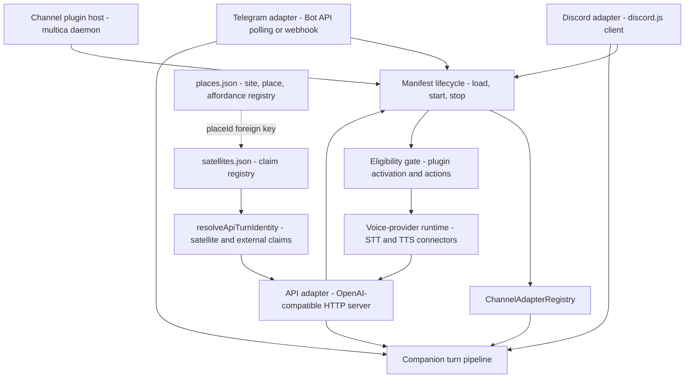

# Channels Overview

The channels subsystem (`src/channels/*`) is the transport boundary of the PSFN
runtime: every external surface that carries turns into and out of the companion
pipeline — Discord, Telegram, an OpenAI-compatible HTTP API, and registry-bound
satellite endpoints — is represented by a **channel adapter**. Adapters are
loaded from a manifest into an in-process registry by the **channel backplane**,
which also owns eligibility gating, voice-provider selection, the
`satellites.json` claim registry, and the `places.json` world registry. The
backplane's job is to make every channel surface obey the same lifecycle,
<!-- openwiki: broken internal link [../channel-plugins.md] file "../channel-plugins.md" does not exist. Fix the href or restore the target, then delete this comment. -->
identity, and fail-closed rules. See [channel-plugins.md](../channel-plugins.md)
for the plugin-declared channel contract (Multica), [multica.md](./multica.md)
for that adapter, [companion-ui.md](./companion-ui.md) for the PWA surface,
<!-- openwiki: broken internal link [../chat-turn-lifecycle.md] file "../chat-turn-lifecycle.md" does not exist. Fix the href or restore the target, then delete this comment. -->
[chat-turn-lifecycle.md](../chat-turn-lifecycle.md) for what happens to a
synthesized message after an adapter accepts it, and
<!-- openwiki: broken internal link [../eidoverse-hub-integration.md] file "../eidoverse-hub-integration.md" does not exist. Fix the href or restore the target, then delete this comment. -->
[eidoverse-hub-integration.md](../eidoverse-hub-integration.md) for the
satellite-hub transport that rides the satellite claim surface.

## Integration model

*Channel topology: the backplane loads every adapter through one manifest
lifecycle, registers it for prompt/outbound docking, gates it by capability
eligibility, and feeds inbound turns to the companion pipeline; satellites
enter through registry-bound claims on the API surface.*

Two boundaries cross this subsystem:

- **The adapter boundary** — human-facing messengers (Discord, Telegram), the
  HTTP API, and plugin-declared adapters all implement one port,
  `ChannelAdapterPort`, so the backplane treats them uniformly.
- **The claim boundary** — machines (satellites, telemetry sidecars, external
  channel claims) enter through the API adapter's HTTP headers, and their
  identity is resolved only against `satellites.json` plus authenticated
  principals, never from caller-asserted certificate headers.

## The channel adapter contract

Every channel is a `ChannelAdapterPort` (`src/channels/backplane/types.ts`):
a stable `id`/`name`/`meta`, a `capabilities` declaration (`chatTypes`,
`media`, `reactions`, `threads`, `streaming`, `promptChannelType`), a
`config` (`enabled`, optional `accountId`, `connectionLabel`), an `outbound`
facet, and a `gateway` facet carrying the `Lifecycle` (`start`/`stop`) and
`onMessage(handler)` hook. Optional facets an adapter may implement:

- `security` — `supportsDirectMessages`, `requiresMentionForChannelMessages`,
  `allowlist`
- `streaming` — `sendTyping` (with a `typingIntervalMs`)
- `availability` — `setAvailability` to a `CompanionAvailabilityState`
- `threading` — `toThreadChannelId`/`fromThreadChannelId` composites
- `prompt` — `resolveChannelType`, `resolveTaskKind`, and
  `listAvailableReactions` (the curated emoji surface for a turn)

The outbound facet is the delivery contract: `sendText` (bounded by
`textChunkLimit`), optional `sendMedia`, optional `sendReaction` (a channel
advertising `reactions: true` must implement it; a failed reaction rejects so
it is never silently converted into a text reply), and optional
`deliverClarification` (interactive structured choices, author-bound and
fail-closed on timeout or unrecognized answers). Shared call sites that only
need one facet consume lightweight docks — `asOutboundDock` and
`asPromptDock` — instead of the whole adapter.

Adapters live in a `ChannelAdapterRegistry` (`src/channels/backplane/registry-port.ts`),
the single in-process store keyed by adapter id. `require(id)` throws when an
adapter is missing; `optional(id)` returns `null`; `list()` snapshots the
adapter set. The agent's prompt assembly reads the same registry through the
`ChannelPromptRegistryPort` view, so a turn's `channelType`, task kind, and
reaction surface are resolved from the adapter that owns the channel
(`src/core/agent/substrate-agent/channel-routing-runtime.ts`).

## Channel backplane

### Manifest lifecycle

`channel-lifecycle.ts` owns adapter boot. `buildChannelAdapterFactoryManifest`
normalizes manifest ids (trims, rejects empty and duplicate ids).
`loadChannelAdaptersFromManifest` walks factory entries:

- a disabled entry is skipped with a warning, but a disabled **required**
  adapter aborts startup;
- each enabled entry passes `requirePluginActivationEligibility` (a denied
  required adapter aborts; a denied optional one is skipped and logged);
- the created adapter must report `adapter.id === manifest.id`, then is
  registered and the registry is synchronized;
- an initialization failure in a required adapter aborts; in an optional one
  it is skipped; **zero loaded adapters abort startup**.

`startChannelAdapters` starts all registered adapters concurrently with
`Promise.allSettled`, unregisters every adapter whose start failed, logs
partial availability, and throws when none started — the runtime keeps running
on a subset of channels rather than failing the whole process, but refuses to
boot with no channels at all. `stopChannelAdapters` stops in reverse
registration order.

### Registry and eligibility

`plugin-eligibility.ts` is the fail-closed gate between the capability system
(`EligibilityGate`, `src/system/capabilities/eligibility.ts`) and channel
operation. Adapters with effective requirements (`requiredTokens` or
`minimumTier`) are wrapped:

- `gateway.start` runs a `plugin.activate` check;
- `outbound.sendText`, `outbound.sendMedia`, `streaming.sendTyping`, and the
  legacy `send` shim each run a `plugin.action` check before the real call;
- STT/TTS connectors get the same treatment: `startStream`,
  `synthesizeStream`, and `synthesizeBuffer` are per-action gated.

When there is no gate or no effective requirements the wrapper is the identity
— zero overhead for unconstrained channels. An optional `companionId` resolves
activation and per-action decisions against that companion's own capability
tier instead of the gateway root (per-account Discord voice bindings).

### Voice-provider runtime

`voice-provider-runtime.ts` turns the operator's `sttProvider`/`ttsProvider`
settings into live streaming connectors. The selection is fail-closed: the
value must be `"disabled"` or a registered provider id; anything unset, empty,
or unknown throws. `resolveRuntimeVoiceProviderGate` reports whether each side
is selected *and* configured. `createRuntimeVoiceSttConnector` /
`createRuntimeVoiceTtsConnector` return `null` for `disabled` or for implicit
providers that are not configured, but an **explicitly selected** provider that
is misconfigured or denied by the eligibility gate throws instead of degrading.
Connectors come back wrapped with per-stream eligibility and an optional
per-companion tier.

### Satellite registry (`satellites.json`)

`satellite-registry.ts` is the security-authoritative claim spine for external
endpoints. `parseSatelliteRegistryConfig` is fail-closed: schemaVersion 1
only, unknown keys rejected, duplicate satellite/endpoint/claim/hub-device
bindings rejected, endpoint auth is `api_key` or `mtls` (mTLS requires at
least one certificate binding), shared-device observation scopes must be
granted by some endpoint, and an enabled registry must contain satellites.
`loadSatelliteRegistryConfig` degrades a missing file to an empty registry
(`EMPTY_SATELLITE_REGISTRY_CONFIG`, `enabled: false` — claims then fail with
503, never silently pass). `saveSatelliteRegistryConfig` re-validates the wire
form before writing and writes atomically under the session-journal write
lock, optionally verifying an expected digest (the synthetic-retirement path
guards against stale writes).

`resolveSatelliteClaim` maps claim headers (`X-PSFN-Satellite-Claim-Type`,
`-ID`, `-Endpoint-ID`, `-Session-ID`, `-Capabilities`, `-Telemetry-Scopes`,
`-Addressed-Companion-ID`) to a registered endpoint. It requires an enabled
registry, matching `(satelliteId, endpointId, claimType)` registration, and
successful auth: an api-key principal admitted by `auth.apiKeyPrincipalIds`,
or mTLS where **every** configured certificate binding must match.
Per-request advertised capabilities only reduce the registry maximum —
anything outside it rejects; the effective set also drops runtime-disabled
capabilities. A resolved claim yields `channelId = satellite:<claimType>:<sessionId>`
with the endpoint's default identity (author, name, canonical contact,
channel privacy) and the full `SatelliteRoutingMetadata`. An explicitly
addressed companion must be a shared-device Emanation Member. Client-cert
identity is derived **only** from the TLS peer certificate or a
token-authenticated trusted proxy; raw `X-PSFN-Client-Cert-*` request headers
are stripped at the ingress and never consulted for matching.

The same verification core serves `resolveSatelliteConfigPull` (the
`GET /v1/satellites/config` surface, returning a bounded runtime config with a
stable-hash `configVersion`), `resolveCompanionRelayAccess` (deny by default;
the endpoint's `telemetryScopes` gate which companion event kinds an SSE
subscriber may receive), and `resolveCompanionApprovalActor` (authorized when
any endpoint admits the principal **and** grants the `approvals` scope).

### Places registry (`places.json`)

`places-registry.ts` implements the soft world registry — Site → Place →
Affordance. A missing file loads as empty (no boot gate); a present file is
parsed fail-closed: unknown keys, duplicate site/place ids, and places
referencing unknown sites throw. An affordance is a perceiver or an effector
with one namespaced kind vocabulary and one of three backends (`ha`,
`satellite`, `vr`). Places never grant device authority: a satellite binds to
a place only through the `placeId` foreign key, and
`assertSatellitePlaceBindings` requires every bound place to exist and be
**physical** (virtual presence comes from chat origin resolution, never from a
device binding). A virtual place may declare itself the twin of exactly one
physical place, and a physical place may have at most one twin (fail closed).
Room privacy is a property of the place: absent means `public`; `private`
opts the place's companion room into presence-windowed delivery, and a
misspelled key or value fails closed at parse time rather than silently
demoting a private room.

### Channel plugins

`plugins/host.ts` hosts channels declared in `channels.json` rather than the
manifest: `ChannelPluginHost.load` instantiates every enabled plugin section
(after resolving its declared vault credentials), verifies the constructed
adapter id matches the plugin manifest id, then `initialize`, `start`, and
`stop` in order. `wireMessages` binds each plugin's `onMessage` through
`requestAgentVoiceStream` and routes plugin operator alerts through
`notifyOperator` with a `system.channels.<pluginId>_failure` provenance. The
builtin registry (`plugins/builtin.ts`) contains exactly one plugin:
`multica` (see [multica.md](./multica.md)); gateway surfaces require a
credential vault when any plugin section is enabled.

## First-class adapters

### Discord (`src/channels/discord/adapter.ts`)

The Discord adapter is the richest surface: `chatTypes` direct/channel/thread,
`media`, `reactions`, `threads`, `streaming`, `promptChannelType:
'discord_text'` (with `discord_voice` for voice channels), direct-message
support, and `requiresMentionForChannelMessages: true`. The manifest entry is
**required**: single-account identity `discord`, or one
`discord:<accountId>` adapter per companion in multi-account mode (tokens come
from per-account env vars; a per-account bot missing its token refuses to
start rather than silently disabling a companion identity). It hosts the
Discord voice runtime, an optional evidence-lifecycle adapter surface,
startup backfill with a 100-message limit and 500ms dedup window, typing at
9s intervals with a 3-strike failure disable, per-channel turn locking with
contention telemetry, and coalescing of same-author turns by message
addressing. Clarifications render as buttons bound to the originating Partner's
id; reactions resolve from the curated surface plus guild-custom emojis that
carry configured meanings.

### Telegram (`src/channels/telegram/adapter.ts`)

The Telegram adapter is **optional** and enabled by `channels.json`. It runs
in long-polling or webhook mode (webhook requires `url`, `secretRef`, `host`,
`port`, `path`), supports direct/channel/thread chat with `media` and
`streaming` but **no reactions**, threads via the `/thread/` delimiter,
`promptChannelType: 'telegram_group'` / `'telegram_dm'` by direct-message
state, and an `allowedUsers` allowlist (normalized, `@`-stripped). Inbound
commands parse through `parseTelegramCommand` into `resolveTaskKind:
'telegram_command'`. Clarification is a numbered plain-text list answered only
by the originating `(chatId, userId)` — a parse-miss leaves the waiter pending
so the message becomes a normal turn instead of being dropped. Typing uses
Bot API `sendChatAction`; long-running tools post incremental status messages.

### API — OpenAI-compatible server (`src/channels/api/server.ts`)

`ApiServer` implements `ChannelAdapterPort` with id `api` (manifest entry
required) and the widest route table: `GET /v1/models`, `GET /v1/identity`,
`POST /v1/chat/completions` (streaming and non-streaming, inline images, and
`file` content parts through the shared file-ingest faculty), `GET /health`,
`POST /v1/telemetry/ingest`, `GET /v1/satellites/config`, the companion relay
surface (`/v1/companion/events`, artifact preview, approval decisions), the
`/v1/voice/ws` voice websocket (Bearer or `auth.b64.*` subprotocol), fleet-auth
routes, and (in fleet bootstrap mode) authenticated Hub-device chat. Its
outbound `sendText` records the assistant message into the session manager —
replies are session state, not a push. Auth is a shared `API_KEY`, an
`ADMIN_TOKEN`, per-satellite keys (`API_SATELLITE_KEYS`, each a distinct
satellite-scoped principal), and the dedicated testing-harness credential;
satellite-scoped principals are rejected on every non-satellite surface. The
adapter is hosted by the gateway process with two interchangeable runtime
backends: an in-process `SubstrateAgent` loop (operator/agent deployments) or
`GatewayApiRuntime` (`src/channels/api/gateway-runtime.ts`), which forwards
chat/health/telemetry RPC to the agent process, subscribes to stream deltas,
resolves satellite claims itself, and arbitrates shared-device chat against
the gateway's shared-satellite arbitration. The agent process implements the
other half as `AgentApiBackend` (`src/channels/api/agent-backend.ts`).

## Shared channel code

`src/channels/shared/` holds dependency-free logic reused across adapters:

- **Reaction surface** (`reaction-surface.ts`) — the curated standard-emoji
  subset (code-owned taxonomy, each emoji with a one-line meaning) plus
  guild-custom emojis that are present/usable **and** carry a configured
  meaning; unknown custom emojis are excluded fail-closed, and
  `normalizeCustomEmojiMeanings` bounds the `channels.json` map (512 guilds,
  512 meanings per guild, 200 chars per meaning, name pattern enforced).
- **Long-running tool status** (`long-running-tool-status.ts`) — a tracker
  that posts incremental "Still analyzing…" status messages for
  `analysis_workbench` turns: first status after 12s, refreshes at most every
  20s, cleared when the channel has no active long-running tool.

## Satellite and external claim integration

`src/channels/api/external-channel-claim.ts` decides who a request *is* before
the turn is built. `resolveApiTurnIdentity` applies a strict precedence:

1. **Satellite claim headers** — must resolve against the enabled registry
   and authenticate; a failed claim is the terminal error. A
   satellite-scoped principal **without** claim headers fails with 403
   (satellite credentials never fall through to the default API identity).
2. **External channel headers** (`x-psfn-channel-id`, `-type`, `-author-id`,
   `-author-name`) — require API-key authentication, a known PSFN channel
   type, a channel id prefixed `<type>:`, and the type must be on the
   external allowlist (currently only `psfn-amica`); identity falls back to
   the `channels.json` profile (`psfnAmica.defaultIdentity`,
   `companionUi.channelPrivacy`).
3. **Default** — the adapter's own pinned identity (channelType `api`,
   source `api`).

`buildExternalChannelProfiles` always publishes the companion-ui profile (so
server-authored companion-ui turns always have a channel privacy) but
companion-ui is intentionally **not** header-claimable.

## Configuration and operations

`channels.json` (parsed by `loadRuntimeChannelsConfig`,
`src/channels/backplane/config.ts`) is the single operator-owned channel
config, validated fail-closed at load **and** on save
(`saveChannelsOwnerFile`):

- `telegram` — `enabled`, `tokenRef` (inline `token` rejected), `allowedUsers`,
  `operatorChatId`, `mode` (`polling`|`webhook`), `pollIntervalMs`, webhook
  block, optional `companionId`
- `discord` — `heartbeatChannelId`, `allowedBotUserIds`, `groupMemory`,
  `customEmojiMeanings`, optional `companionId`, or the multi-account
  `accounts[]` (each with its own `companionId`, `tokenEnvVar`,
  `heartbeatChannelId`); `assertDiscordAccountTokensConfigured` aborts gateway
  startup when any configured account's token env var is unset
- `api` — `companionId`, `selectableCompanionIds` (requires `companionId`;
  enables per-request Bearer companion selection), `testingHarness`
  (`principalId` + `tokenRef`, `gardenAdmin`)
- `plugins` — fail-closed plugin sections (see
<!-- openwiki: broken internal link [../channel-plugins.md] file "../channel-plugins.md" does not exist. Fix the href or restore the target, then delete this comment. -->
  [channel-plugins.md](../channel-plugins.md))
- `psfnAmica` — `enabled` + optional `defaultIdentity`
- `companionUi` — `channelPrivacy` (default `private`)
- `contextEnvelope` — per-channel Context Envelope labels and operator-signed
  classification epochs; a label claiming `classificationSource:
  'operator_confirmed'` is rejected unless a matching invite-only → public
  epoch record exists, so the marker is only writable through the Garden
  click-to-accept demotion flow

Secrets never live in `channels.json`: tokens resolve from env vars or the
credential vault through `tokenRef` references. The owner-file registries
(`satellites.json`, `places.json`) live beside `channels.json` in the system
data directory.

## Invariants and failure modes

- **Fail closed on identity**: unknown channels, plugins, providers, claim
  types, capabilities, telemetry scopes, and certificate sources are rejected,
  never defaulted into a permissive posture.
- **Required vs optional**: Discord and API adapters are required (a disabled
  or failed required adapter aborts startup); Telegram and plugins are
  optional and degrade to partial availability with warnings.
- **Registry maximums**: satellites may advertise less than `satellites.json`
  permits, never more; runtime-disabled capabilities (`robotics` is defined
  but not runtime-enabled) are dropped.
- **No silent drops**: a failed reaction rejects, a clarification without a
  bound author fails closed, a parse-miss clarification reply becomes a normal
  turn, and an eligibility denial on an explicitly selected voice provider
  throws.
- **Deny-by-default relay**: companion event kinds and approval authority flow
  only to endpoints whose `telemetryScopes` grant them.

## Focused tests

- `channel-lifecycle.test.ts` — manifest normalization, duplicate/disabled/
  required entries, eligibility denials, partial-start continuation, and
  zero-start failure.
- `satellite-registry.test.ts` / `external-channel-claim.test.ts` — claim
  resolution, auth modes, capability maximums, and the satellite-scoped
  principal 403 rule.
- `places-registry.test.ts` / `places-registry-privacy.test.ts` — fail-closed
  parse, twin links, physical-only satellite bindings, and privacy defaults.
- `adapter.test.ts` (discord, telegram), `voice.test.ts`,
  `voice-tts-first-byte.test.ts` — adapter surfaces, turn handling,
  clarification binding, and voice turn behavior.
- `server.runtime.test.ts`, `gateway-runtime.test.ts`,
  `server-sensor-ingest.test.ts`, `companion-ui-websocket.test.ts` — API
  routes, RPC backends, telemetry ingest, and websocket upgrades.
