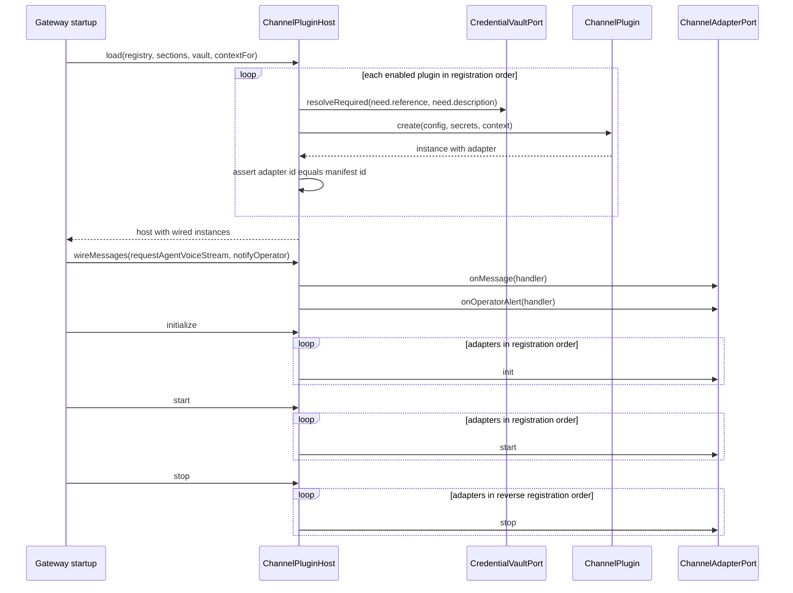
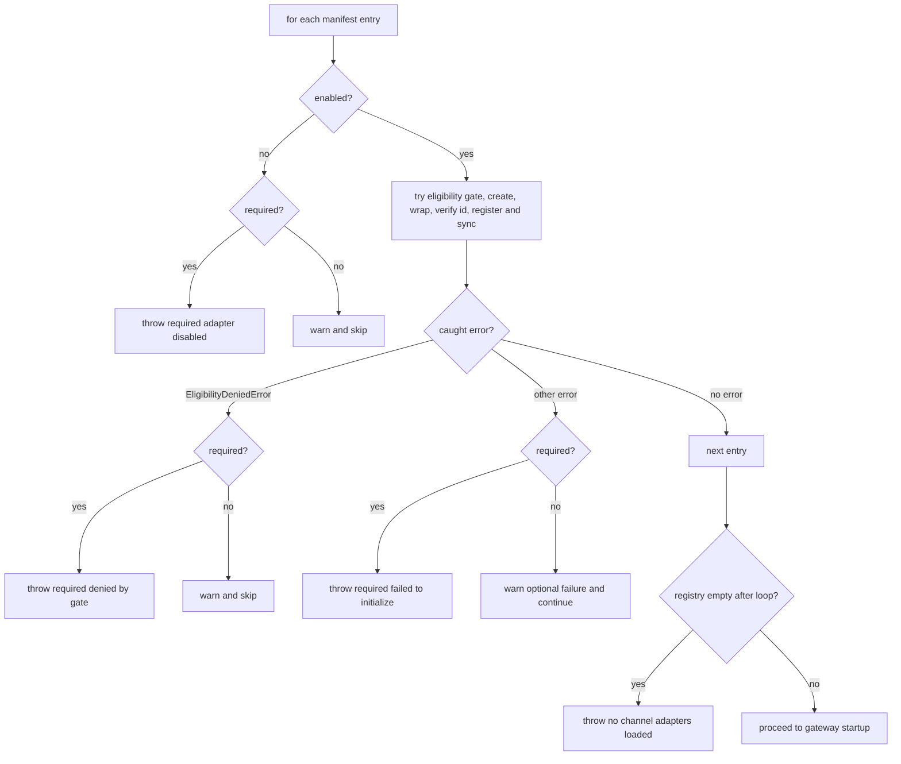

# Channel Plugins

Channel plugins are the extension boundary through which new channel surfaces
attach to the gateway backplane. The contract has two distinct attach paths that
share the same adapter shape (`ChannelAdapterPort`) but different declaration,
validation, and lifecycle owners:

- **Manifest-declared adapters** — first-class channels (Discord — one entry per
  configured account in multi-account mode — and Telegram) declared as
  `ChannelAdapterFactoryPort` entries, normalized by
  `buildChannelAdapterFactoryManifest`, loaded by the backplane's
  `loadChannelAdaptersFromManifest`, and registered into a
  `ChannelAdapterRegistry`.
- **Plugin-declared adapters** — extension channels declared as unknown
  `channels.json` sections, parsed by a registered `ChannelPlugin`, resolved
  against the credential vault, and instantiated by `ChannelPluginHost`.

Both paths produce the same `ChannelAdapterPort` shape. Manifest adapters are
validated and registered into a `ChannelAdapterRegistry`; plugin adapters are
owned by the `ChannelPluginHost`, which additionally owns operator alert wiring
and per-plugin credential resolution. The OpenAI-compatible API surface is a
first-class `channels.json` key (`api`) owned by the core parser in
`src/channels/backplane/config.ts` and is served by its own HTTP server; it is
neither a manifest adapter entry nor a plugin in the gateway composition.

The authority for this page is `src/channels/plugins/*` and
`src/channels/backplane/*` together with the gateway composition in
`src/boundary/gateway/channel-surfaces.ts` and the startup order in
`src/app/gateway/main.ts`. See [overview.md](overview.md) for the channels subsystem, and
<!-- openwiki: broken internal link [../chat-turn-lifecycle.md] file "../chat-turn-lifecycle.md" does not exist. Fix the href or restore the target, then delete this comment. -->
[chat-turn-lifecycle.md](../chat-turn-lifecycle.md) for what happens to an
inbound message after an adapter delivers it.

## The plugin contract

`src/channels/plugins/types.ts` pins the whole contract. A `ChannelPlugin` is
three things:

- **`manifest`** — `{ id, label }`. The id is the registry key and the
  `channels.json` section key; the adapter the plugin constructs must return
  the same id (enforced by the host, see below).
- **`parseConfig(raw)`** — a fail-closed parser that turns one untrusted
  `channels.json` section into a `ChannelPluginParseResult`:
  `{ config, enabled, companionId?, credentials }`. `credentials` is a
  `ChannelPluginCredentialNeed[]` — each need names an `id` (the key under
  which the secret is later presented to `create`), a `CredentialReference`
  (currently `env`-kind only), and a human `description` used in vault error
  messages.
- **`create(input)`** — receives `{ config, secrets, context }` and returns a
  `ChannelPluginInstance`: a constructed `ChannelAdapterPort` plus an optional
  `onOperatorAlert` registration hook the adapter uses to raise operator
  alerts. `create` may be synchronous or async.

`ChannelPluginHostContext` supplies the adapter's ambient dependencies: the
`RuntimeChannelLifecycleLogger`, a `shutdownTimeoutMs`, the cognition
`IntakeScreeningService` (or null), and optionally the gateway's
`postgresDatabaseUrl` when a plugin needs its own persistence.

## Registry

`createChannelPluginRegistry` (`src/channels/plugins/registry.ts`) builds the
id → plugin map with fail-closed validation: the manifest id is trimmed and
must be non-empty, and a duplicate registration throws
`Duplicate channel plugin registration "<id>"`. The registry exposes `get`,
`has`, and `list` (registration order). Plugins are never looked up by label —
the manifest id is the only key used by section parsing, host loading, and the
gateway.

## Load sections: how channels.json declares plugins

`parseChannelPluginSections` (`src/channels/plugins/load-sections.ts`) walks the
scoped `channels.json` root (or the root itself when there is no `channels`
object) and classifies every key:

- First-class keys — `discord`, `telegram`, `api`, `psfnAmica`, `companionUi`,
  `contextEnvelope` — are skipped; the core parser in
  `src/channels/backplane/config.ts` owns them.
- Every other key must resolve through the plugin registry; an unknown key
  throws `Unknown channel plugin "<key>"`. The value must be a JSON object
  (else `channels.json.<key> must be an object`), and the plugin's
  `parseConfig` result is recorded as a `ChannelPluginLoadedSection` keyed by
  the section name with the plugin id stamped on it.

`loadRuntimeChannelsConfig` invokes this with the builtin registry (or an
injected registry seam) and carries the result as
`RuntimeChannelsConfig.plugins`. The same validation runs again on
`saveChannelsOwnerFile`, so an owner-file write that would fail runtime load is
rejected fail-closed instead of persisted.

## Host lifecycle

`ChannelPluginHost` (`src/channels/plugins/host.ts`) is the lifecycle owner for
plugin-declared adapters. It is constructed via `ChannelPluginHost.load` and
then driven by the gateway through explicit phases. The gateway's actual call
order is **load → wireMessages → initialize → start → stop**: `wireMessages`
runs before `initialize`/`start` because a plugin adapter may refuse to
start without the inbound message handler and operator-alert handler that
wiring installs.

1. **`load`** — iterates the registry in registration order, skips sections
   whose `enabled` flag is false, and instantiates each enabled plugin. Any
   failure stops the instances already created (reverse order) and rethrows, so
   a half-loaded host never survives.
2. **`wireMessages`** — installs the inbound handler and operator alert wiring
   (see below). Requires every adapter to expose the `onMessage` bootstrap
   hook.
3. **`initialize`** — calls `adapter.init()` sequentially in registration
   order. A failure stops the instances up to and including the failing adapter
   and rethrows `Channel plugin "<id>" failed to initialize`.
4. **`start`** — calls `adapter.start()` sequentially. A failure stops every
   wired instance (via `stop()`) and rethrows
   `Channel plugin "<id>" failed to start`.
5. **`stop`** — tears down every wired instance in reverse registration order;
   `stopInstances` aggregates multiple stop errors into an `AggregateError`
   (`Channel plugin host failed to stop one or more plugins`).



Caption: ChannelPluginHost lifecycle phases as driven by the gateway — load, wireMessages, initialize, start, stop.

### Credential resolution

Secrets never live in `channels.json`. A plugin's `parseConfig` returns only
credential *references*; at instantiation `instantiatePlugin` resolves each
declared need with `vault.resolveRequired(need.reference, need.description)` and
presents the plugin with a flat `secrets` record keyed by need id. A missing
secret throws before `plugin.create` runs, so a plugin is never constructed
half-configured. Secrets are resolved per plugin and never shared across
plugins (each plugin's section declares exactly the needs it consumes).

`create` output is validated fail-closed: if `instance.adapter.id` differs from
`plugin.manifest.id` the host throws `Channel plugin "<id>" constructed adapter
id "<adapterId>"` — a plugin can never register an adapter under another
plugin's identity.

### Message and operator-alert wiring

`wireMessages` requires every adapter to expose the `onMessage` bootstrap hook
(an adapter missing it throws `Channel plugin "<id>" is missing onMessage
bootstrap hook`). Unlike the manifest-declared surfaces, plugin inbound does
not fan out through the gateway's `notifyChannelMessage` RPC: the host wires
`onMessage` directly to `requestAgentVoiceStream`, honoring an optional
`AbortSignal` from `MessageHandlerOptions`, and synthesizes the `AgentResponse`
metadata (`model`, `durationMs`, zero token counts) from the result. Operator
alerts raised through `instance.onOperatorAlert` are forwarded to the gateway's
`notifyOperator` with `sender.provenance = "system.channels.<pluginId>_failure"`
and `priority: 5`, using the plugin's idempotency key.

## Manifest-declared adapters and the backplane

The manifest path shares the adapter shape but is owned by
`src/channels/backplane/channel-lifecycle.ts`:

- `ChannelAdapterFactoryPort` declares `{ manifest, create }` where the manifest
  is `{ id, enabled, required?, label?, eligibility? }`.
  `buildChannelAdapterFactoryManifest` normalizes the entries fail-closed:
  ids are trimmed, must be non-empty, and duplicates throw.
- `loadChannelAdaptersFromManifest` loads enabled entries into a
  `MutableChannelAdapterRegistryPort`. Disabled entries are skipped with a
  warning, unless `required` is set — a required-but-disabled adapter throws.
  Before `create` runs, `requirePluginActivationEligibility` gates activation;
  a denied *required* adapter throws, a denied *optional* adapter is skipped
  with a decision log. After construction the adapter id must equal the
  manifest id (`Manifest id "<id>" does not match adapter id "<adapterId>"`),
  and each successful load registers the adapter and invokes the
  `syncChannelRegistry` callback. Optional create failures log and continue;
  required create failures throw. If the registry ends up empty, startup throws
  `No channel adapters loaded from manifest`.
- `ChannelAdapterRegistry` (`src/channels/backplane/registry-port.ts`) owns the
  loaded adapters by id: `require` throws for an absent id, `optional` returns
  null, `has`/`size`/`list` inspect, and `register`/`unregister`/`clear`
  mutate the map.
- `startChannelAdapters` starts `gateway.start()` on all adapters concurrently
  (`Promise.allSettled`), unregisters the failures, re-syncs the registry, and
  warns that startup continues with partial availability — but throws
  `No channel adapters started successfully` if none started.
  `stopChannelAdapters` stops in reverse registration order.



Caption: loadChannelAdaptersFromManifest decision flow — required adapters fail closed, optional adapters degrade with warnings.

## Eligibility gating

`src/channels/backplane/plugin-eligibility.ts` ties channel adapters into the
capability-eligibility system (`src/system/capabilities/eligibility.ts`), which
also gates the STT and TTS connectors through the same `RuntimePluginKind`
(`'channel' | 'stt' | 'tts'`). Eligibility gating applies to manifest-declared
adapters loaded by `loadChannelAdaptersFromManifest`; the `ChannelPluginHost`
path is not eligibility-gated. Every channel adapter manifest must carry
`eligibility: EligibilityRequirements` — omitting them entirely throws
(`channel plugin "<id>" is missing eligibility requirements`), so a manifest
author cannot silently bypass gating. When the gate is absent or the
requirements are empty (`{}`, no required tokens and no minimum tier), the
checks pass through without an operation.

For effective requirements, activation is gated with operation
`{ kind: 'plugin.activate', pluginType: 'channel', pluginId }`, and the
constructed adapter is wrapped by `wrapChannelAdapterWithEligibility` so
runtime actions — `gateway.start`, `outbound.sendText`, `outbound.sendMedia`,
`streaming.sendTyping`, and the compatibility `send` — each re-check the gate
with `{ kind: 'plugin.action', pluginType: 'channel', pluginId, action }`. A
denied action rejects with `EligibilityDeniedError` *before* the underlying
call runs, so a capability revocation mid-run takes effect immediately.

## Gateway composition

`loadGatewayChannelSurfaces` (`src/boundary/gateway/channel-surfaces.ts`) is
where both paths meet at startup:

1. It builds the manifest entries for Discord (one entry per configured account
   in multi-account mode, keyed `discord:<accountId>`) and Telegram, and loads
   them into a fresh `ChannelAdapterRegistry` via
   `loadChannelAdaptersFromManifest`.
2. If any plugin section is enabled, a credential vault is mandatory —
   `Channel plugins require a credential vault` is thrown otherwise.
3. It constructs the `ChannelPluginHost` with the builtin plugin registry (or an
   injected registry as a test seam) and the parsed `channels.json` sections,
   resolving each plugin's host context: the lifecycle logger,
   `shutdownTimeoutMs` set to half the force-exit timeout, the companion-resolved
   intake screening service (only for enabled sections), and the gateway
   `postgresDatabaseUrl`.

Gateway startup then drives the phases in `src/app/gateway/main.ts`:
`wireGatewayChannelMessages` (which calls the host's `wireMessages` with the
gateway's `requestAgentVoiceStream` and `notifyOperator`) runs before
`initGatewayChannelSurfaces` and `startGatewayChannelSurfaces`. Lifecycle order
within the surfaces: plugin adapters initialize between Telegram and Discord;
plugins start last, after Discord and Telegram; and plugins stop first, then
Telegram, then Discord in reverse. Message wiring routes Discord and Telegram
through `notifyChannelMessage` and hands the plugin host `wireMessages` with the
same `requestAgentVoiceStream` and `notifyOperator` entry points.

## Builtin plugins

`createBuiltinChannelPlugins` registers one plugin: the generic external
channel adapter (`external`, below). The Buzz and Multica plugins were removed
(psfn-framework-lef2o); `channels.json` keys `buzz` or `multica` fail startup
with a pointer to the `migrate-required-settings-blocks` owner-file migration
that strips them.

## External channel adapters

New messaging systems (SMS, WhatsApp, iMessage, ...) are not added as in-tree
channel code. Each one is an out-of-process **bridge** that connects to the
gateway over a small, versioned MCP protocol, in the same way Hermes connects for
companion memory. The gateway is the MCP server and the bridge is the client.
The gateway never dials a bridge or waits on one. Adding a channel needs only a
bridge and one `channels.json` entry. Source: `src/channels/external/*`.

### Configuration

```json
"external": {
  "enabled": true,
  "limits": {
    "maxRequestBytes": 65536, "requestReadTimeoutMs": 5000,
    "maxTextChars": 8000, "maxIdChars": 256,
    "maxInFlightTurns": 4, "turnTimeoutMs": 120000,
    "outboundQueueMax": 100, "outboundPullMax": 20,
    "heartbeatTimeoutMs": 120000, "failureReportIntervalMs": 60000
  },
  "adapters": [{
    "id": "sms", "label": "SMS gateway",
    "companionId": "<companion uuid>",
    "tokenRef": { "kind": "env", "envName": "EXTERNAL_CHANNEL_SMS_TOKEN" }
  }]
}
```

The configuration follows these rules:

- Every limit is required owner-file data. The runtime has no defaults for them.
  The example values are illustrations.
- The bearer token is env-owned. It must be unique across adapters and must not
  be reused from `API_KEY`, `ADMIN_TOKEN`, the testing harness, satellite keys,
  trusted-proxy tokens or external-memory bindings.
- Each adapter is bound to exactly one companion.
- The whole section is validated even when it is disabled. Unknown keys, inline
  secrets, duplicate ids and shared token env names are rejected.
- Adapters are served by the gateway API server, so `API_PORT` must be set. If it
  is not set, the adapters are disabled and the other channels keep running.

### Protocol (version 1)

Each adapter is served at `POST /v1/channels/external/<id>/mcp` as stateless
streamable-HTTP MCP. The request sends `Authorization: Bearer <token>` and has
no `Origin` or `Mcp-Session-Id` header. Unknown adapters and bad credentials
both get `401`. Each tool input carries `protocolVersion: 1`, and any other
version is refused. Identity comes only from the endpoint and its token, never
from tool arguments.

| Tool | Input | Result |
| --- | --- | --- |
| `channel_hello` | `bridge: {name, version}` | `protocolVersion`, `instanceId`, capabilities, advertised limits |
| `channel_inbound` | `message: {id, conversationId, conversationKind: direct\|group, senderId, senderName, text, sentAt?, replyToMessageId?}` | `replied` with `reply: {conversationId, text}`, `no_reply`, or `rejected` with `reason` |
| `channel_pull_outbound` | `maxItems?` | `messages: [{deliveryId, conversationId, text, replyToMessageId?}]` |
| `channel_health` | `status: ok\|degraded, detail?` | adapter status (`connected`, `stale`, queue depths, counters) |

The companion's reply to an inbound message is returned in the same
`channel_inbound` result. Messages that the companion starts go to a bounded
per-adapter queue, and the bridge drains that queue with
`channel_pull_outbound`. Rejection reasons are `busy`, `duplicate`, `invalid`,
`turn_timeout`, `turn_failed` and `not_running`. The bridge should back off and
retry `busy` and `turn_timeout`. It should drop `invalid`.

Inbound ids are namespaced as `external:<id>:<native id>` for the channel,
message and author. This keeps two bridges from colliding with or impersonating
each other. The message body is screened by chat intake as the `external`
surface. The author gets the least-privileged DM-conditioned trust class
(`regular_contact` in direct conversations, `public_contact` in groups).

### Isolation

A bridge can never take down the gateway, agent turns or another channel:

- Each adapter is its own supervised surface (`external:<id>`) under the channel
  isolation supervisor and the `CHANNEL_SURFACE_START_RETRY_*` policy. A load,
  credential or endpoint failure disables that surface alone.
- The route handler always answers. A malformed, oversized (`413`), stalled
  (`408`), wrong-version or unauthenticated request gets an answer and goes no
  further.
- Companion turns are limited by `maxInFlightTurns`. Excess turns are refused
  as `busy`, not queued. Each turn is abandoned after `turnTimeoutMs`.
- The outbound queue is bounded. When it is full, new sends are refused.
- A bridge that is silent for longer than `heartbeatTimeoutMs` is reported as
  `stale`. It recovers on its next call.
- Floods, timeouts, full queues, malformed requests and silence are reported as
  degraded runtime failures of that surface, at most once per
  `failureReportIntervalMs` for each kind. They are never process failures.

### Writing an adapter

`src/channels/external/reference-bridge.ts` is the reference bridge. It has a
typed MCP client (`ReferenceExternalChannelBridge`) and an in-memory
`LoopbackPlatform` that shows the full round trip. To write a real bridge,
replace the loopback platform with your messaging API:

1. Call `channel_hello` and check the protocol version and limits.
2. Send each platform message with `channel_inbound` and post the reply.
3. Poll `channel_pull_outbound` and deliver the messages you receive.
4. Call `channel_health` at an interval shorter than `heartbeatTimeoutMs`.

Every bridge must pass the conformance suite in
`src/test-support/external-channel-conformance.ts`
(`describeExternalChannelBridgeConformance`). A bridge written in another
language is tested through a thin driver that forwards these calls.

## Fail-closed invariants

| Invariant | Enforced by |
| --- | --- |
| Duplicate or empty plugin ids rejected at registration | `createChannelPluginRegistry` |
| Unknown `channels.json` keys rejected at load and at save | `parseChannelPluginSections`, `saveChannelsOwnerFile` |
| Secrets never stored inline; resolved from vault per plugin | `parseConfig` + `instantiatePlugin` |
| Adapter identity must equal manifest/plugin identity | `instantiatePlugin`, `loadChannelAdaptersFromManifest` |
| Required adapters fail closed on disable, denial, or create failure | `loadChannelAdaptersFromManifest` |
| Eligibility requirements may not be omitted | `requireEligibilityRequirements` |
| Plugin host never survives partial construction or partial start | `ChannelPluginHost.load` / `start` rollback |
| No channel surface may attach with zero loaded adapters | `loadChannelAdaptersFromManifest` / `startChannelAdapters` |
| Enabling any plugin without a credential vault aborts startup | `loadGatewayChannelSurfaces` |
