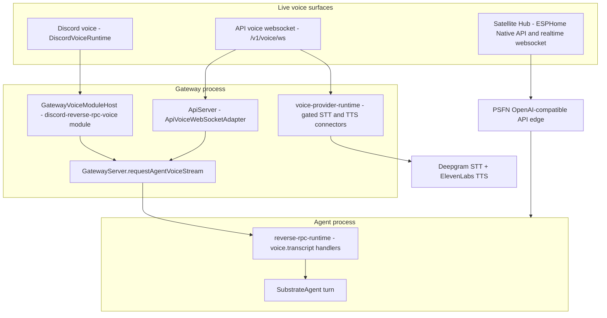

# Voice

Voice is the spoken-turn surface of PSFN. There are exactly three live voice
paths, all of which funnel into the same companion turn pipeline; everything
else named "Wyoming" in the codebase is retired or leftover, not a setup path.

- **Discord voice**, owned by the gateway voice module host: the Discord
  adapter's `DiscordVoiceRuntime` joins the target Partner's channel, transcribes
  captured audio, and the gateway's voice handler forwards each utterance to
  the agent over the reverse voice-stream RPC; the reply is synthesized and
  played back in the channel.
- **API voice websocket `/v1/voice/ws`**: the wire-format voice surface
  (`voice-wire-v2` frames over a websocket) hosted on the API server, with
  Deepgram STT and ElevenLabs TTS, transport control intents (stop / interrupt
  / repeat handled locally with zero model calls), and both a final-only and a
  live streaming reply path.
- **Satellite Hub**: the endpoint and embodiment runtime under
  `apps/satellite-hub` with two voice transports — an ESPHome Native API
  fallback (Python hub) and a custom realtime websocket hub (TypeScript) — both
  using Deepgram STT and ElevenLabs TTS and both treating PSFN Framework as the
  sole agent backend. See [satellite-hub.md](../apps/satellite-hub.md).

Gateway-hosted Wyoming is **retired**: `createGatewayVoiceSurfaces`
(`src/boundary/gateway/voice-surfaces.ts`) throws when `WYOMING_ENABLED` is
set and tells operators to run Wyoming/OpenHome endpoints through Satellite
Hub. Leftover names — `wyomingShardRouting` (default off), the `wyoming.*`
event family, `api:wyoming:*` channel ids, the Garden `wyoming` telemetry
category — must not be treated as a live path.

## Surface topology

*Voice surface topology: Discord voice and the API voice websocket run on the
gateway process and reach the agent through the gateway's reverse voice-stream
RPC; Satellite Hub reaches the agent through the PSFN API edge; the
voice-provider runtime owns connector selection and eligibility gating on the
gateway side.*

## Voice-provider runtime

`src/channels/backplane/voice-provider-runtime.ts` is the shared backbone that
resolves and constructs the streaming STT/TTS connectors used by Discord voice
and the API voice websocket.

- `resolveRuntimeVoiceProviderGate` reads `sttProvider` and `ttsProvider` from
  config (`settings.json`); each may be a registered provider id or `"disabled"`.
  `sttEnabled`/`ttsEnabled` additionally require the provider to be configured
  (`isConfigured`), so the gate reports missing credentials instead of
  constructing broken connectors.
- `createRuntimeVoiceSttConnector` / `createRuntimeVoiceTtsConnector` build the
  provider connector and wrap it with eligibility gating
  (`wrapStreamingSttConnectorWithEligibility` /
  `wrapStreamingTtsConnectorWithEligibility`), so activation and per-stream /
  per-synthesis eligibility resolve against a capability tier. The optional
  `companionId` option (an52.5) resolves per-account voice surfaces — the
  Discord account binding — against that account's own tier instead of the
  gateway root. Creation is **fail-closed**: when a provider was explicitly
  selected but is unconfigured, connector creation throws rather than silently
  returning null.
- Registered providers today: **Deepgram** STT (`deepgram`, requires
  `DEEPGRAM_API_KEY`, `deepgramModel`, `deepgramSttEndpoint`; eligibility token
  `external.web`) and **ElevenLabs** TTS (`elevenlabs`, requires
  `ELEVENLABS_API_KEY`, `ELEVENLABS_VOICE_ID`, `elevenLabsModelId`,
  `elevenLabsEndpointBase`) plus the local **echo** TTS fallback
  (`echoTtsUrl`/`echoTtsVoice`/`echoTtsPreset`/`echoTtsModel`). Provider
  registration is extensible via `registerStreamingSttProvider` /
  `registerStreamingTtsProvider`.

## Discord voice (gateway module host)

The Discord adapter (`src/channels/discord/adapter.ts`) owns a
`DiscordVoiceRuntime` (`src/channels/discord/voice.ts`) that:

- is enabled only when `voiceEnabled` is true **and** `voiceTargetGuildId`,
  `voiceTargetUserId`, an STT connector, and at least one TTS connector all
  resolve; otherwise it logs why and disables itself;
- joins the target Partner's voice channel via `@discordjs/voice` (following
  `VoiceStateUpdate`, reconciling on client-ready, leaving when the channel
  empties or the target leaves), with DAVE end-to-end encryption
  (`voiceDaveEncryption`) and a decryption-failure tolerance
  (`voiceDecryptionFailureTolerance`);
- captures Opus audio, decodes to PCM, transcribes through the STT connector,
  runs the utterance through the configured message handler, and speaks the
  reply through a TTS connector; per-user stream error counters isolate a
  degraded stream and drive graceful teardown.

In **gateway mode** the handler is installed by the voice module host:
`createGatewayVoiceSurfaces` constructs a `GatewayVoiceModuleHost`, registers
the single `discord-reverse-rpc-voice` module, and that module calls
`discord.setVoiceHandler(...)` so every voice utterance becomes a
`gateway.requestAgentVoiceStream(message)` reverse-RPC turn whose result is
shaped into the Discord reply (content, channelId, optional attachments,
model/durationMs metadata). The module host runs the `register`/`start`/`stop`
lifecycle in order, stopping modules in reverse. In **in-process mode**,
`adapter.setAgent(...)` instead wires utterances to the local agent loop; the
voice handler (`setVoiceHandler`) always takes precedence over the text
handler when both are set.

## Gateway voice stream RPC

`GatewayServer.requestAgentVoiceStream` (`src/boundary/gateway/server.ts`) and
`requestAgentVoiceStream` (`src/boundary/gateway/voice-stream-request.ts`)
carry a voice turn from the gateway to the agent process over the JSON-RPC
socket:

- The gateway mints a `correlationId` and `streamId`, and — unless the message
  already carries one — a transport-agnostic `cancellationId` stamped into
  `message.routing.cancellationId` so every voice turn is addressable by
  `cancelTurn` regardless of transport. A gateway routing envelope
  (`createGatewayRoutingEnvelope`) pins the selected companion.
- The reply text is chunked (default `chunkSize` 120 chars) into a
  `BoundedQueue` (default size 32, overflow policy `error`), then streamed as
  reverse-RPC frames `voice.transcript.begin` → `voice.transcript.chunk` ×N →
  `voice.transcript.end`, each chunk acknowledged; the final result carries
  content, channelId, model, durationMs, optional attachments, and a structured
  `disposition` (`decline`/`no_op`) for intentional silence. A default agent
  timeout of 60s races every reverse RPC.
- **Version skew**: the agent registers the inbound family under both the
  legacy `voice.stream.*` and the new `voice.transcript.*` names on the same
  handlers, and a `Method not found` on the begin frame falls back to the
  single-shot `voice.handleMessage` path, so an older peer keeps working during
  rollout.
- **Barge-in**: a whole-turn `AbortSignal` listener rejects the in-flight
  reverse RPC the instant the turn is aborted and sends
  `voice.stream.cancel`/`voice.transcript.cancel` at most once per turn; the
  agent-side handler aborts its per-stream controller, which reaches
  `SubstrateAgent.cancelTurn(cancellationId)` and the provider-port cancel, so
  upstream model and TTS generation stop rather than only local transport
  state. Transport failure on the cancel itself is swallowed — the local turn
  is torn down regardless and a lost cancel frame must not mask the original
  error.
- Multi-companion routing resolves the companion from satellite routing
  metadata, the channel-type surface, or the ready-agent connection, and shared
  satellites go through the shared-satellite response arbiter lease path. A
  reply-egress canary guard (`inspectReply`) scans the raw reverse-RPC result
  before the gateway picks its fields.

On the agent side (`src/boundary/gateway/client/reverse-rpc-runtime.ts`), each
stream is tracked per `correlationId::streamId` with strict sequence checks, a
bounded chunk queue, and its own `AbortController`; `voice.transcript.end`
drains the queue, joins the content onto the base message, and dispatches it
through the same handler as `voice.handleMessage` (mapping `noReply` metadata
to `disposition: 'decline'`). `voice.transcript.cancel` aborts the controller,
clears the queue, and deletes the stream state.

## API voice websocket `/v1/voice/ws`

### Transport adapter

`ApiVoiceWebSocketAdapter` (`src/channels/api/voice-websocket.ts`) upgrades
websocket connections on the configured path (default `/v1/voice/ws`) from the
API server's HTTP upgrade handler. Authentication accepts, in order: a bearer
token, the `psfn_api_token` or `api_key` cookie, or an `auth.b64.<base64url>`
websocket subprotocol; a failed check rejects the upgrade with 401, and an
unknown upgrade path gets 404. When no API key is configured the adapter
accepts the insecure-local principal (local/dev operation only). The adapter
owns connection bookkeeping and close codes (1012 on server shutdown) and
delegates session semantics to a pluggable `VoiceWebSocketRuntime`.

### Wire protocol

The transport is `voice-wire-v2` (`src/primitives/voice/transports/websocket/types.ts`):

- **Inbound**: `session.start`, `audio.chunk` (PCM s16le 48 kHz mono, with a
  monotonic `seq`), `session.end`, `interrupt` (optional reason), `ping`.
- **Outbound**: `ack` (echoing the inbound frame type), `transcript.partial` /
  `transcript.final` (as STT interim/final results arrive), `playback.chunk`
  (TTS audio, monotonic `seq`), `pong`, and `error` with a code and message.

`WebSocketVoiceServer` enforces transport limits — idle session timeout
(default 30s), max frame bytes (default 256 KiB), max pending frames (default
32) — with owner-file settings `voiceSessionTimeoutMs`,
`voiceMaxFrameBytes`, `voiceMaxPendingFrames` taking precedence.

### Runtime session lifecycle

`WebSocketVoiceRuntime` (`src/primitives/voice/transports/websocket/runtime.ts`)
owns one state object per `connectionId:frameSessionId` key:

1. `session.start` opens the STT stream (idempotent re-ack for existing or
   in-flight starts).
2. `audio.chunk` validates the PCM chunk (security + frame-size bounds) and
   writes it to STT, acking each chunk.
3. `session.end` ends STT input, drains the transcript pump (finals capped at
   128 with a drop-oldest overflow policy), and classifies the session's
   control intent. **Transport control intents** — `stop`/`interrupt`/`repeat`
   — are handled locally with zero model invocations: `repeat` replays the last
   spoken assistant utterance for the connection, `stop`/`interrupt` produce
   deterministic silence. The joined transcript is classified first; a
   per-final scan is authoritative only when every non-empty final classifies
   as a control (last final wins on divergence), so mixed content is never
   swallowed. Anything else runs the assistant turn, then streams TTS playback.
4. `interrupt` marks the session interrupted, cancels in-flight work, releases
   state, and acks.

The assistant turn has two shapes. **Final-only** (`onAssistantTurn`):
transcript → agent reply text → TTS playback. **Live streaming**
(`onAssistantStream`, default when the runtime is composed with an agent loop):
`runAgentAssistantStream` runs the *same* normal agent turn — tools execute,
home automation fires, nothing is stripped — while `agent.stream.delta` text is
bridged through `createAgentReplyStreamBridge` into committed reply segments
that are spoken as they finalize, so first audio lands before the turn
completes. The `agent.toolcall.*` channel is never consumed, so tool-call JSON
never reaches TTS; a genuine system withhold (no-reply / broadcast hold /
notification-ack / empty) resolves to `bridge.withhold` — stop, don't speak
the tail — and only a `send` disposition flushes the segmenter tail.

### Gateway-mode composition

On the gateway, `createApiVoiceWebSocketRuntime`
(`src/channels/api/voice-websocket-runtime.ts`) wires
`handleAssistantTurn` → `buildVoiceMessage` (channel id
`api:<principal.id>:<sessionId>` when `x-session-id` is present, else
`api-voice:<principal.id>:<connectionId>`) → intake screening →
`options.gateway.requestAgentVoiceStream(message, { signal })`. Satellite claim
headers override the channel identity to the registry-bound satellite channel.
When a gateway fetch adapter is present, Deepgram STT is forced through the
gateway's `webRequestBinary` (no direct network egress from the API voice
runtime): `GatewayBufferedDeepgramSttConnector` buffers PCM, converts to WAV,
and calls `transcribeWav` through the gateway-proxied fetch. The runtime
disables itself (returns `undefined`) when STT/TTS are not both enabled or the
eligibility gate denies the providers.

### Voice security and reliability policy

Every stage is bounded by `src/primitives/voice/policy/security.ts`:
PCM ≤ 8 MiB, transcript ≤ 4,000 chars, TTS input text ≤ 3,000 chars, TTS audio
≤ 24 MiB — enforced fail-closed as frames arrive, not only on fully buffered
utterances. `src/primitives/voice/policy/reliability.ts` budgets each pipeline
stage: ingest 8s (no retry), stt 20s (1 retry), llm 45s (1 retry),
`tts_first_byte` 8s (1 retry — a stalled first byte fails fast and re-synths),
and `tts`/`output` 125s with **no retry** so playback duration never triggers a
double-speak re-synthesis.

## Satellite Hub voice paths

Satellite Hub (`apps/satellite-hub`) is the endpoint/embodiment middleware; the
voice-relevant paths are:

- **TypeScript realtime websocket hub** (`npm run hub:ts`, `RealtimeHubServer`
  in `src/ts/hub/server.ts`): Pi-class clients stream continuous PCM audio over
  one websocket (JSON frames: `hello`/`hello.ack`/`session.ready`, `audio`,
  `user.text`/`text`, `interrupt` → `assistant.interrupted`, `relay.stt` /
  `relay.tts`, `touch.interaction`, `approval.decision`, `artifact.preview`,
  `ping`/`pong`, `error-event`). Device registry enrollment authenticates the
  hello with a per-device credential and short-lived Ed25519 Hub device
  assertions when configured; capabilities are intersected with the device's
  max profile.
- **ESPHome Native API fallback** (`uv run hub run`, Python hub): stock
  ESPHome voice devices and `linux-voice-assistant` connect over the ESPHome
  Native API; the Python hub drives Deepgram live STT and ElevenLabs streaming
  TTS and returns announcement/media playback over the ESPHome route. FLAC-only
  playback endpoints additionally require `ffmpeg` on the bridge host.
- **Voxta-compatible SignalR facade**: VaM / AcidBubbles plugin clients reach
  `/hub/negotiate` + websocket `/hub` with `SendMessage` inbound /
  `ReceiveMessage` outbound framing (a text/embodiment path, not a raw audio
  path).

Both hubs treat PSFN Framework as the **sole agent backend** over its
OpenAI-compatible API edge; the hub keeps only satellite/transport state,
turn artifacts under `.artifacts/runtime/` and `.artifacts/runtime-ts/`, and
relays the current turn. No Home Assistant is in the runtime path. The bounded
check is `npm run verify:satellite-hub` (no live devices or paid providers).

## Configuration and operations

- `sttProvider` / `ttsProvider`: `deepgram` / `elevenlabs` (or `echo` for TTS),
  or `"disabled"`; missing provider selection throws at runtime-gate
  resolution.
- Discord voice: `voiceEnabled`, `voiceTargetGuildId`, `voiceTargetUserId`,
  `voiceDaveEncryption`, `voiceDecryptionFailureTolerance`,
  `voiceReadyCueText`, `voiceTriggerWords`-adjacent settings; TTS connectors
  are built from the preferred `ttsProvider` with fallback connectors per
  provider.
- API voice websocket: `voiceSessionTimeoutMs`, `voiceMaxFrameBytes`,
  `voiceMaxPendingFrames`, `voiceReplySegmenter` (`minSegmentLength`,
  `maxBufferLength` — the committed reply segmentation thresholds for the
  streaming path).
- Provider credentials: `deepgramApiKey`, `deepgramModel`,
  `deepgramSttEndpoint`, `deepgramListenEndpoint`, `elevenLabsApiKey`,
  `elevenLabsVoiceId`, `elevenLabsModelId`, `elevenLabsEndpointBase` (all
  secret-bearing keys are excluded from the sanitized core config).
- Operator tasks (firmware compilation, physical-hardware validation,
  live-device deployment, provider-backed calls) are separate from the
  default gate; pinned convenience tasks live behind `mise run hub:*`.

## Verification

The closed-loop voice harness `src/app/e2e/e2e-voice-roundtrip.ts` validates
the whole pipeline without a browser or device: seed text → ElevenLabs TTS →
Deepgram STT baseline → PCM through the composed `createApiVoiceWebSocketRuntime`
(`session.start`/`audio.chunk`/`session.end` frames) → agent turn → TTS
playback → Deepgram STT of the response audio → text match plus a
sign/countersign phrase semantic check. Run with
`npx tsx src/app/e2e/e2e-voice-roundtrip.ts`; it requires
`DEEPGRAM_API_KEY`, `ELEVENLABS_API_KEY`, `ELEVENLABS_VOICE_ID`, and
`OPENROUTER_API_KEY` and exits non-zero on transcript or semantic mismatch.
Unit-level coverage for the wire runtime, control-intent guard, barge-in
cancellation composition, and the voice-surfaces module lives alongside the
implementation (`voice-websocket-runtime.test.ts`,
`runtime-control-guard.test.ts`, `voice-stream-request.canary.test.ts`,
`voice-surfaces.test.ts`).

## Wyoming retirement

`createGatewayVoiceSurfaces` refuses to start when `wyomingEnabled` /
`WYOMING_ENABLED` is set — the gateway-hosted Wyoming endpoint runtime moved to
the Satellite Hub repository. `applyWyomingRoutingPolicy`
(`src/boundary/gateway/wyoming-routing.ts`) and `wyomingShardRouting`
(default `{ enabled: false }`) remain as leftover identifiers: the routing
policy only labels messages when explicitly enabled, and the `wyoming.*`
event family, `api:wyoming:*` channel ids, `wyoming-msg-*` message ids, and
the Garden `wyoming` telemetry category are all legacy names. None of them is
a setup path and the gateway never starts a Wyoming endpoint; run
Wyoming/OpenHome endpoints through Satellite Hub instead.
