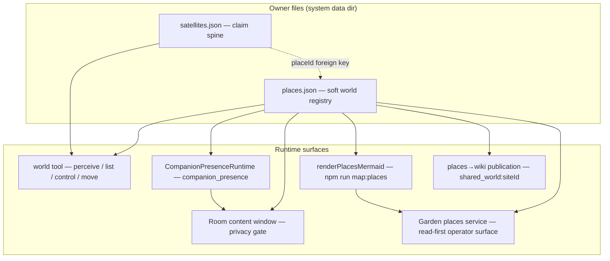
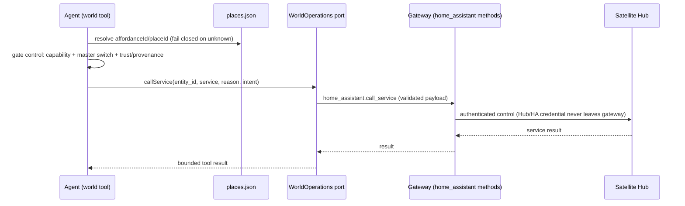
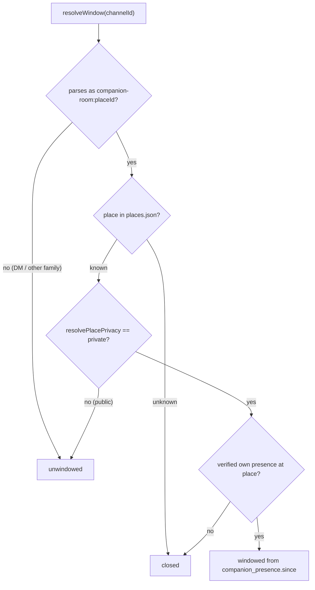

# World and Presence

The "world and presence" surface is how the PSFN runtime models a physical and
virtual world, binds devices into it, and situates a companion inside it. It is
built on two deliberately separate JSON owner files in the system data
directory:

- **`places.json`** — a *soft registry* (loaded-if-present, no boot gate) that
  owns the Site → Place → Affordance world model: rooms, sensors, actuators,
  virtual twins, and room privacy. Places never grant device authority.
- **`satellites.json`** — the *security-authoritative claim spine*: the
  registry maximum for what an external endpoint (a physical device, an avatar
  client, a telemetry sidecar) may claim. A satellite binds into the world
  through a static `placeId` foreign key into `places.json`.

On top of the two owner files sit the runtime surfaces: the **world tool**
(`perceive`/`list`/`control`/`move`) that an agent uses to sense and act on
places, the **presence substrate** (`companion_presence`) that tracks which
companion is at which place, the **presence-windowed delivery** that enforces
private-room privacy at delivery time, the **world-map renderer** that projects
the registries into Mermaid, and the **shared-world wiki publication** that
turns the registry into browsable `shared_world:<siteId>` pages. The hub
transport that carries satellite traffic across this surface is documented on
[apps/satellite-hub.md](../apps/satellite-hub.md); the channel backplane that
hosts the registries is on [channels/overview.md](./overview.md).

*World and presence topology: `places.json` feeds every runtime surface while
`satellites.json` stays the security spine; satellites bind to places only
through the static `placeId` foreign key.*

## The world model (`places.json`)

`places.json` is a **soft registry**: `loadPlacesRegistryConfig` returns a
frozen empty config when the file is absent, so a deployment without the file
boots normally ([`src/channels/backplane/places-registry.ts`](/src/channels/backplane/places-registry.ts)).
The parser (`parsePlacesRegistryConfig`) is fail-closed:

- `schemaVersion` must be `1`; unknown top-level and per-entity keys throw
  (including a misspelled `privacy` key — a typo can never silently demote a
  private room to public).
- A **site** has `siteId`, `displayName`, and a kind (`physical`/`virtual`).
- A **place** has a stable `placeId`, a `siteId` referencing a known site, a
  kind, an optional physical-only `haAreaId`, a description, an optional
  virtual-only `mirrorsPlaceId` twin link, a `privacy` classification, and an
  affordance list. Duplicate `siteId`/`placeId` and unknown-site references
  throw.
- An **affordance** is explicitly a `perceiver` (sensor) or `effector`
  (actuator) — the role is declared, never inferred from kind — with a kind
  from the frozen `AFFORDANCE_KINDS` vocabulary (`light`, `fan`,
  `media_player`, `switch`, `climate`, `presence`, `face`, `mic`, `camera`,
  `virtual_object`) and one of three backends: `ha` (Home Assistant entity),
  `satellite` (satellite-local capability), or `vr` (virtual-object id).
  Duplicate `affordanceId`s within a place throw.

**Stable ID contract**: `placeId`/`siteId` are load-bearing primary keys — the
multi-companion substrate keys its shared `companion_presence` table on them,
and out-of-band consumers such as the `shared_world:<siteId>` wiki scope reuse
the same token grammar (`isValidPlaceIdToken`, ≤128 chars of
alphanumeric/dot/underscore/dash/colon starting with alphanumeric). A display
name may change freely; the ID must not be recycled or re-minted across renames
([`src/shared/contracts/places-registry.ts`](/src/shared/contracts/places-registry.ts)).

**Twin links** model the shared mindspace: a virtual place may declare
`mirrorsPlaceId` naming exactly one physical place it mirrors. The loader fails
closed when a physical place declares a twin, the target is missing, the target
is not physical, or a physical place is mirrored by more than one virtual twin.
`resolveTwinPlaceOf` is the pure lookup core modules use without importing the
`channels` loader.

**Privacy**: `resolvePlacePrivacy` (absent ⇒ `public`) is the single canonical
normalizer shared by the gateway delivery lane
([`src/boundary/gateway/companion-channels.ts`](/src/boundary/gateway/companion-channels.ts))
and the agent-side room-window gate
([`src/core/agent/companion-room-window.ts`](/src/core/agent/companion-room-window.ts)),
so the two halves can never disagree on the default. `private` places opt the
place's companion room into presence-windowed delivery (see below).

## The claim spine (`satellites.json`) and the place binding

`satellites.json` is the authority for what an external endpoint may claim;
per-request advertised capabilities only reduce this registry maximum, never
grant new powers. `loadSatelliteRegistryConfig` returns an empty *disabled*
config when the file is absent; `parseSatelliteRegistryConfig` fails closed:
`schemaVersion` must be `1`, unknown top-level keys throw, `enabled` defaults to
`true` with zero satellites throwing, and registry-wide uniqueness is enforced
across satellite ids, endpoint ids, claim bindings
(`satellite:endpoint:claimType`), and Hub `deviceId` enrollments
([`src/channels/backplane/satellite-registry.ts`](/src/channels/backplane/satellite-registry.ts)).

The world-facing surface of the registry:

- **Capability vocabulary** — `SATELLITE_CAPABILITIES` enumerates 19
  capabilities (`text`, `audio_input`, `speech_to_text`, `audio_output`,
  `text_to_speech`, `vision`, `image_upload`, `avatar`,
  `avatar_expression`, `avatar_action`, `touch`, `location`, `timezone`,
  `presence`, `health`, `battery`, `telemetry`, `outbound_delivery`,
  `robotics`). `SATELLITE_RUNTIME_ENABLED_CAPABILITIES` excludes `robotics`: a
  registry may grant it, but the runtime never enables it, so a claim resolves
  it as `policyDenied`.
- **Telemetry scopes** — `SATELLITE_TELEMETRY_SCOPES` adds the companion-relay
  scopes `approvals`, `artifacts`, `tool_activity` (deny-by-default grants for
  companion event relay) and `emotion` (redacted emotion-snapshot relay) to the
  observation set.
- **Auth** — endpoints authenticate with `api_key` or `mtls`. Satellite-scoped
  principals (per-satellite `API_SATELLITE_KEYS`) are admitted only by
  endpoints that explicitly list their principal id — they never inherit the
  shared-key default. mTLS identity comes exclusively from an authenticated
  source (`tls_peer` socket certificate or token-authenticated trusted proxy);
  raw `X-PSFN-Client-Cert-*` headers are never consulted, and *every*
  configured binding (fingerprint, SPKI, subject, SAN) must match. mTLS config
  with no binding at all is rejected at parse time.
- **Shared-device policy** — one physical device shared by a companion fleet
  splits authority into non-interchangeable roles: `primaryCompanionId`, an
  ordered `emanationMemberIds` allowlist (primary first), and
  `observationRecipients` (observation authority never grants speech,
  movement, world control, or historical room access). Every granted
  observation scope must be permitted by at least one endpoint's
  `telemetryScopes`, and `responseLease` bounds are enforced
  (`durationMs` ≤ 60 s, `activeConversationTtlMs` ≤ 30 min).

The single write path is `saveSatelliteRegistryConfig`: it re-validates the
wire form through the parser before touching disk, writes via temp file +
rename (atomic), and optionally compares an `expectedDigest` against the current
file to refuse stale concurrent mutations (used by retirement and by the Garden
static re-bind surface).

### Cross-registry binding

`assertSatellitePlaceBindings` is the fail-closed cross-registry check: every
satellite that declares a static `placeId` must resolve to a **physical** place
in `places.json`; a bound `placeId` with an absent or empty registry resolves
nothing and throws, and a virtual target throws too — virtual presence comes
from chat-origin resolution, never from a device binding. Both the gateway boot
([`src/app/gateway/main.ts`](/src/app/gateway/main.ts)) and agent boot
([`src/app/agent/startup-context.ts`](/src/app/agent/startup-context.ts)) wire
this check, so agent and gateway reject the same misconfiguration.

### Claim resolution, config pull, and relay access

Satellite turns reach the gateway as chat-completions requests carrying the
`X-PSFN-Satellite-*` claim header set. `resolveSatelliteClaim` requires claim
type, satellite id, endpoint id, and session id; looks up the exact
`satelliteId` + `endpointId` + `claimType` binding; verifies endpoint auth;
intersects advertised capabilities and telemetry scopes with the registry
maximum (advertising anything outside the maximum throws
`satellite_capability_not_allowed`); and builds routing metadata plus a channel
identity of `satellite:<claimType>:<sessionId>` with author identity/privacy
from `defaultIdentity`. An explicit `addressedCompanionId` is accepted only
when it is an Emanation Member of the satellite's `sharedDevice` policy. A
registry that is absent or disabled rejects every claim with
`satellite_registry_not_configured` (503).

`resolveApiTurnIdentity` is the gateway-wide entrypoint: when satellite claim
headers are present it resolves through the registry and never falls through to
the default API identity, and a `satellite`-scoped principal without claim
headers is rejected outright
([`src/channels/api/external-channel-claim.ts`](/src/channels/api/external-channel-claim.ts)).

`GET /v1/satellites/config` serves `resolveSatelliteConfigPull`, which
authenticates the caller the same way and returns `companion.satellite_config`:
satellite/endpoint identity, default identity, the session header contract, the
runtime capability policy, `telemetryScopes`, and endpoint `runtime` config,
with `configVersion` computed as a stable hash of the payload. Companion event
relay (`GET /v1/companion/events`, artifact preview) and approval decisions are
registry-gated too: `resolveCompanionRelayAccess` and
`resolveCompanionApprovalActor` deny by default, and an approval decision is
authorized only when the satellite has an endpoint that admits the presented
principal **and** is granted the `approvals` telemetry scope.

## Synthetic satellite retirement

Testing-harness satellites (`testProvenance` with a named `runId`/`manifestId`)
can be retired without leftover claim authority.
`SyntheticSatelliteRetirementService`
([`src/channels/backplane/satellite-retirement.ts`](/src/channels/backplane/satellite-retirement.ts))
is exact-target and idempotent:

- The target must match the active satellite's provenance AND its exact
  endpoint identity list; a satellite without testing-harness provenance, an
  unknown satellite, or a provenance mismatch is rejected before any backup or
  mutation.
- Default mode is a content-free dry run (`would_retire`); applying requires
  explicit operator approval (`operatorApproved: true` plus a canonical
  `approvalId`).
- Before mutation, a backup port snapshots the current owner file and returns
  `backupRef` + `backupDigest`; the writer is called with the expected digest so
  a registry that changed after backup refuses the stale retirement.
- The retired satellite moves to `retiredSatellites` as a content-free
  lifecycle record (identity, endpoints, provenance, `retiredAt`, backup ref
  and digest). Retired entries never participate in claim resolution, and
  re-running against the same target returns `already_retired` with the
  recorded backup.

The file-backed runtime
([`createFileSyntheticSatelliteRetirementService`](/src/channels/backplane/satellite-retirement-runtime.ts))
writes a content-addressed backup (`satellites.json.<sha256>.backup`, mode
0600, directory 0700, fsynced, verified by re-hash); the operator CLI is
`npm run satellite:retire-synthetic` with `--apply --approval-id`
([`src/app/maintenance/retire-synthetic-satellite.ts`](/src/app/maintenance/retire-synthetic-satellite.ts)).

## The world tool

The agent-side **`world`** tool
([`src/boundary/integrations/world/tools.ts`](/src/boundary/integrations/world/tools.ts))
is one action-dispatched tool over the physical/virtual world:

- **`perceive`** — reads Home Assistant states for a place's HA-backed
  affordances (deictic default: the situated place).
- **`list`** — enumerates affordances for a place (default) or the whole site.
- **`control`** — calls an HA service on an effector affordance.
- **`move`** — deliberate self-invoked *virtual* navigation (contract `s10wm`).

Affordance → entity resolution happens **agent-side against `places.json`
(defence in depth)**: the gateway only ever receives an `entity_id`/`service`
this tool proved is in the registry; an `affordanceId`/`placeId` absent from
the registry is rejected before any RPC crosses to the gateway. The thin
`WorldOperations` port forwards validated payloads to privileged gateway
methods (`home_assistant.get_states`, `home_assistant.call_service`); the agent
process never sees the Hub or Home Assistant credentials, and the gateway
revalidates the affordance
([`src/boundary/integrations/world/ops.ts`](/src/boundary/integrations/world/ops.ts),
[`src/boundary/integrations/world/gateway-ops.ts`](/src/boundary/integrations/world/gateway-ops.ts)).

**Control gating** — three independent, fail-closed gates guard
`action=control` (`perceive`/`list`/`move` gate read-tier and are unaffected):

1. **Capability token** `world.control` — enforced outside the tool by the
   capability gate (`resolveWorldRequirement`: `perceive`/`list`/`move` →
   `world.read`, `control` → `world.control`
   ([`src/system/capabilities/requirements.ts`](/src/system/capabilities/requirements.ts))).
2. **Runtime master gate** `WORLD_CONTROL_RUNTIME_ENABLED` — an embedding may
   override it to false as an emergency stop without disabling perception.
3. **Requester provenance + trust** — all callers need primary/trusted scope
   and known provenance; self-directed/system turns additionally need a
   recognized `intent` and audit `reason`, are restricted to registered light
   affordances (`kind === 'light'`), and every command must be inside the
   affordance's per-affordance `control` allowlist.

*World tool control flow: agent-side registry resolution and gates run before
any RPC; the gateway holds the Hub credential and revalidates the affordance.*

**`move`** (contract `s10wm`): virtual places only — physical places are NOT
movable by tool call, because satellites are static and physical presence is
emanation-driven via the sensor bridge; a physical destination fails closed
with an explain-why error. Presence is written exclusively through
`CompanionPresenceTurnPort.recordDeliberateMove` (never a store/table directly)
so co-location events, the situated "Here:" block, and the wiki shared-scope
swap all follow from that single seam. A failed shared write throws and aborts
the move before any local state changes. Flag-off (no port wired) a move is
local-only. `move` fires the room-entry system note into the invoking session
(honestly reporting when the sink or channel is unavailable) and lists exits as
every other place at the destination's site (virtual siblings are movable,
physical siblings annotated as such). The canonical tool-surface contract
describes it as: "controls are capability-gated and virtual move never changes
sensed physical presence"
([`src/core/agent/tool-surface/descriptions/catalog-boundary-contracts.ts`](/src/core/agent/tool-surface/descriptions/catalog-boundary-contracts.ts)).

The tool is registered as an extended first-party surface with
`requiredGatewayMethods` wiring metadata
([`src/boundary/integrations/world/runtime-wiring.ts`](/src/boundary/integrations/world/runtime-wiring.ts))
and is wired in the agent main with the situated-place resolver, the presence
turn port, the emanation-tracker virtual overlay, the room-entry-note sink, and
live trust/provenance resolvers
([`src/app/agent/main.ts`](/src/app/agent/main.ts)).

## Presence substrate

**`CompanionPresenceRuntime`**
([`src/core/agent/companion-presence-runtime.ts`](/src/core/agent/companion-presence-runtime.ts))
is the multi-companion presence runtime around the shared `companion_presence`
table (never constructed flag-off). It owns four jobs:

1. **Writer** — a turn situated at a place (satellite-place binding) upserts
   this companion's own row; every situated turn refreshes `updated_at` (the
   freshness beat), and the store preserves `since` across same-place
   refreshes.
2. **Co-presence read** — caches who else is at the current place so the
   situated-presence context section can render "Also here: …" synchronously.
3. **Co-location event** — a companion observed at our place that was not there
   on the previous refresh emits `presence.companion.co_located` exactly once
   per arrival.
4. **Deliberate move** — `recordDeliberateMove` runs full arrival semantics and
   is the only presence write not derived from a turn's own routing; unlike the
   auxiliary writes it **throws** on failure (the move did not happen).

The `companion_presence` table is the durable authority for "which companion is
at which place" across a cluster; each agent writes **its own row only** and
everyone reads everyone's rows. The port carries a hard privacy invariant:
nothing personal ever goes through it — presence is companion id + place
coordinates + timestamps, full stop
([`src/core/agent/companion-presence-store-port.ts`](/src/core/agent/companion-presence-store-port.ts)).

**Lifecycle**: graceful shutdown deletes our own row; a crashed agent is
covered by the read-side staleness TTL
(`DEFAULT_COMPANION_PRESENCE_STALE_TTL_MS` = 15 minutes) — rows whose
`updated_at` is older than the TTL are treated as gone. The write side applies
the same TTL to `since` continuity: a same-place refresh only preserves `since`
while the previous row is still fresh, so `since` always means "start of the
current uninterrupted presence window" — the single clock presence-windowed
private-room delivery keys on. There is no explicit "leave" write on
non-situated turns: a Discord DM turn does not mean the emanation left the room.

**Turn presence modes** (`classifyTurnPresenceMode`,
[`turn-presence-mode.ts`](/src/core/agent/substrate-agent/runtime-context-sections/turn-presence-mode.ts)):
every turn is classified by device origin into `physical` (satellite or Wyoming
voice routing — the companion physically emanates into that room; the turn's
own place binding foregrounds the real place) or `mindspace` (plain chat
channels — the companion is co-located with the partner in the virtual twin of
the physical space). The mindspace room defaults to the twin of the
last-known physical room, is overridable by a validated session assertion, and
a deliberate virtual `move` remains the highest-precedence overlay. Fail
closed: with no twin configured, a mindspace turn stays unsituated rather than
borrowing the active physical emanation's room. The **`SituatedEmanationTracker`**
([`situated-emanation.ts`](/src/core/agent/substrate-agent/runtime-context-sections/situated-emanation.ts))
is the per-process, in-memory handoff-aware memory of the current emanation:
a placed (satellite) turn establishes the situated place; a later placeless
turn consumes it; a virtual move overlay is superseded by a later
place-bearing turn (latest event wins), and physically moving into a virtual
room never moves the satellite emanation.

The **situated-presence section producer**
([`situated-presence.ts`](/src/core/agent/substrate-agent/runtime-context-sections/situated-presence.ts))
renders the "where am I / what's here / who else is here" runtime block and is
the first consumer of `message.routing.presence` plus the places registry. It
fails closed: a turn with neither presence nor a resolvable place renders
nothing (no fabricated location), and every free-text value rendered into the
`<runtime_situated_presence>` frame is sanitized against prompt-injection frame
breaks (cogsec H6). `resolveSituatedSiteId` is the seam the wiki shared-scope
swap keys off, so shared-world retrieval and the rendered "Here:" block always
agree on where the companion is — including on placeless turns after a move or
emanation handoff.

## Room privacy and presence-windowed delivery

Private-room privacy is enforced at **delivery time**, never by filtering
memory extraction. Two halves share one normalizer (`resolvePlacePrivacy`):

- **Gateway fan-out** ([`src/boundary/gateway/companion-channels.ts`](/src/boundary/gateway/companion-channels.ts)):
  a `companion-room:<placeId>` message to a `private` place is delivered
  presence-windowed — the recipient must have joined (`since`) no later than
  the message mint, and the sender must currently be present (with a bounded
  stale-reply grace). Public rooms never consult `since` — byte-identical to
  pre-privacy behavior.
- **Agent-side session gate** (`createCompanionRoomContentWindowPort`): maps a
  `companion-room:<placeId>` channel to a content window —
  `unwindowed` for public places and non-room channels, `windowed` from
  `companion_presence.since` for a private place with verified own presence,
  and `closed` (fail closed) for a private place without verified presence or
  an unknown place. Rejoining a private room opens a **new** window;
  earlier-window content persists in the store and extracted memory but is
  never served back into the live room context. The port composes with other
  window families (e.g. voice) through `composeRoomContentWindowPorts`
  ([`src/core/session/room-content-window.ts`](/src/core/session/room-content-window.ts)),
  each family owning its own channel-id prefix.

*Room content window resolution: public and non-room channels stay
`unwindowed`; private places require verified presence and window from the join
time; everything else fails closed to `closed`.*

## Shared-world wiki publication

The places registry is projected into browsable **shared-world wiki pages**:
one site-overview page plus one page per place, scoped
`shared_world:<siteId>` and stored under
`<system-data>/shared-world/wiki/sites/<siteId>/` — never in companion-data.
`npm run wiki:publish:places` (dry-run by default; `--apply` to write, `--site`
to publish one site) loads the registry, builds deterministic page drafts
(`buildSiteWikiPages` fails closed on an unknown siteId), and writes through
the operator-owned `SharedWorldWikiStore`
([`src/app/maintenance/publish-places-wiki.ts`](/src/app/maintenance/publish-places-wiki.ts),
[`src/faculties/wiki/places-wiki-publication.ts`](/src/faculties/wiki/places-wiki-publication.ts)).

- **Idempotent**: each generated page is compared against disk (title + tags +
  body); only changed/new pages are written; pages for removed places are
  pruned — and the prune step only ever deletes documents carrying the
  `generated:places` marker tag, never an operator-imported doc that shares the
  id prefix.
- **W5b boundary**: companions never write `shared_world` scope directly. The
  companion-facing personal store fail-closed rejects any non-personal scope,
  and the `SharedWorldWikiStore` is only ever constructed by operator/caretaker
  maintenance surfaces. The companion-side `wiki` tool offers
  `propose_shared_world` as an enqueue-only action — it queues a public,
  provenance-bearing site fact for operator review and never publishes
  directly ([`src/faculties/wiki/store.ts`](/src/faculties/wiki/store.ts),
  [`src/faculties/wiki/tools.ts`](/src/faculties/wiki/tools.ts)).
- **Projection**: in multi-companion mode the write runs through
  `runSharedWorldWikiWrite` which resolves projection dependencies once before
  any write (failing closed on missing Postgres/embedding) and projects the
  filesystem tree into the shared pgvector schema so retrieval can union
  `shared_world:<siteId>` chunks — consulted only when the turn's plan grants
  that scope
  ([`src/faculties/wiki/shared-pgvector-projection.ts`](/src/faculties/wiki/shared-pgvector-projection.ts),
  [`src/faculties/wiki/runtime-wiring.ts`](/src/faculties/wiki/runtime-wiring.ts)).

## World map and operator surfaces

**`renderPlacesMermaid`**
([`src/channels/backplane/places-mermaid.ts`](/src/channels/backplane/places-mermaid.ts))
projects the places registry plus optional satellite bindings into a
deterministic Mermaid `flowchart TB` (the "render" half of the eventual map
editor): each site is a subgraph, each place a subgraph labeled with its kind,
each affordance a node styled by role (`perceiver` stadium vs `effector` box
via `classDef`), and each satellite bound by `placeId` a hexagon node inside
its place. It is pure — identical inputs produce byte-identical output — and
fail-closed: malformed top-level input throws, an empty registry renders a
valid "No places configured" node, node ids are synthetic and stable-sorted so
arbitrary names can never break Mermaid syntax, every Partner-content label
segment is sanitized against label breakout, and twin links render only from
the canonical `mirrorsPlaceId` field (never inferred from unknown aliases).
`npm run map:places` drives
[`scripts/generate-world-map.ts`](/scripts/generate-world-map.ts), which reads
`places.json`/`satellites.json` (or the committed seeds) and emits
`docs/world-map.mmd`.

The Garden **places service**
([`src/operator/garden/services/places-service.ts`](/src/operator/garden/services/places-service.ts))
is the read-first operator surface over both owner files: `listPlaces` joins
places to bound satellites (surfacing `unboundSatellites` and
`danglingSatellites` — satellites bound to a `placeId` absent from
`places.json`), `rebindSatellite` is the ONLY mutation path (a static re-bind;
there is no runtime auto-rebinding), and `renderMermaidMap` projects the
current registries. This is **data only** — never routed into prompt content,
and no biometric payload lives in core (biometrics live at the hub).

## Focused tests

- `src/channels/backplane/places-registry.test.ts` — parse fail-closed rules,
  duplicate/unknown-site rejection, twin-link validation, satellite place
  bindings (physical-only, absent-registry and virtual-target failures).
- `src/channels/backplane/places-registry-privacy.test.ts` — absent ⇒ `public`
  (zero behavior change), explicit `public`/`private`, unknown privacy values
  and misspelled privacy keys fail closed.
- `src/channels/backplane/places-mermaid.test.ts` — determinism, empty-registry
  rendering, sanitization of hostile labels, twin links only from canonical
  `mirrorsPlaceId`, malformed-input throwing.
- `src/channels/backplane/satellite-registry.test.ts` — claim resolution,
  capability/telemetry intersection, api_key/mtls auth, satellite-scoped
  principal isolation, impersonation, config pull, companion relay and
  approval access.
- `src/channels/backplane/satellite-retirement.test.ts` and
  `satellite-retirement-runtime.test.ts` — exact-target retirement,
  idempotency (`already_retired`), backup verification, stale-digest refusal.
- `src/boundary/integrations/world/tools.test.ts` and `runtime-wiring.test.ts`
  — perceive/list/control/move semantics, control gates (master switch, trust,
  provenance, affordance allowlist), move fail-closed paths, wiring metadata.
- `src/core/agent/companion-room-window.test.ts` — unwindowed/windowed/closed
  resolution and rejoin-window semantics.
- `src/core/agent/substrate-agent/runtime-context-sections/situated-presence.test.ts`
  — situated block rendering, active-emanation integration, mindspace-twin
  fallback, prompt-injection sanitization.
- `src/faculties/wiki/places-wiki-publication.test.ts` — shared-world scope
  correctness, idempotent re-runs, prune safety.
