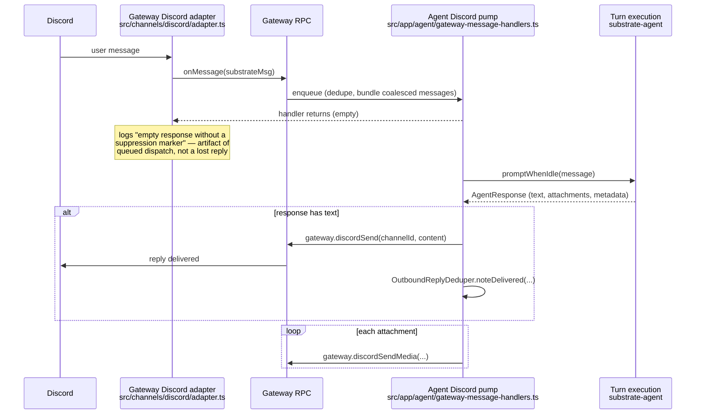
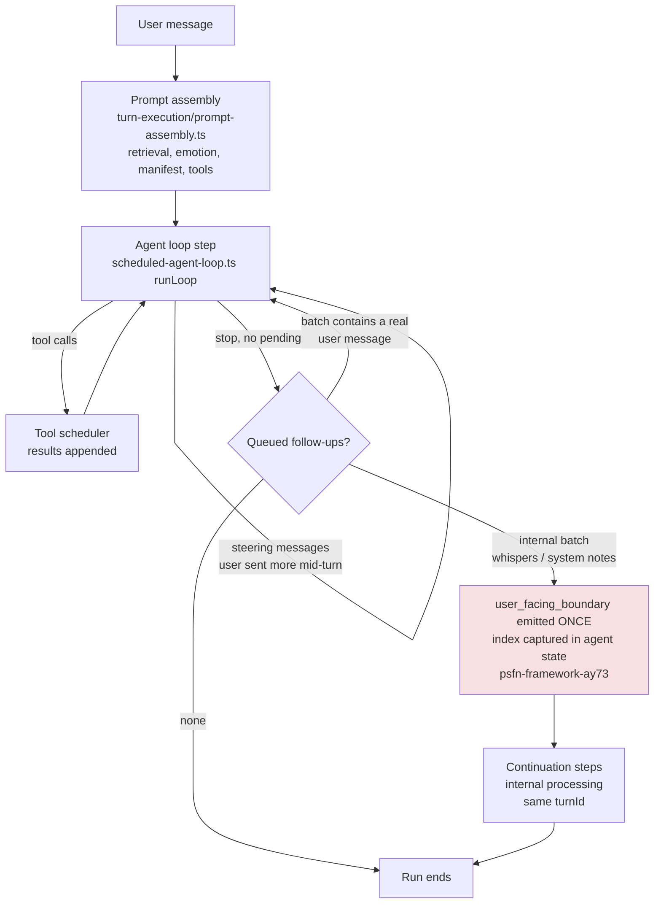
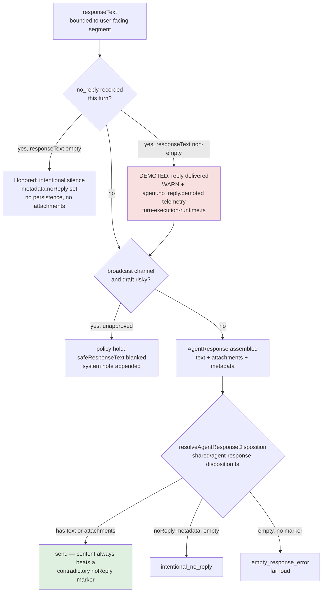
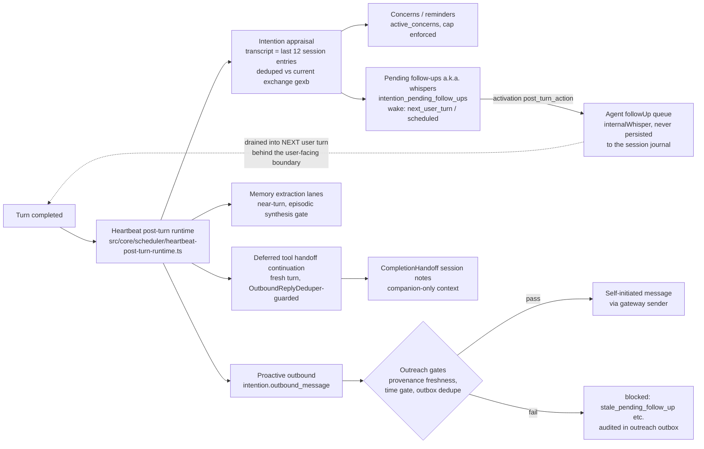

# Chat Turn Lifecycle

Last updated 2026-07-05 (post psfn-framework-ay73 / gexb fixes, image `0.1.0-kube-0ecaa08d`).

This document traces one interactive chat turn end to end: inbound delivery,
turn execution, reply disposition, outbound delivery, and the post-turn
lanes that run after the reply. It exists because the turn pipeline has
grown enough moving parts (queued dispatch, in-turn continuations, no-reply
dispositions, post-turn whispers) that topology diagrams alone no longer
explain observed behavior.

Source of truth for each stage is listed inline. When this document and the
code disagree, the code wins — then fix this document in the same change.

## 1. Inbound delivery (split mode, Discord example)

The gateway adapter does not wait for the reply. It hands the message to the
agent over RPC and returns immediately; the reply is delivered later by the
agent-side pump through a separate outbound RPC.

Notes:

- Duplicate suppression happens at two layers: inbound dedupe/bundling in the
  pump, and `OutboundReplyDeduper` (`src/system/lifecycle/outbound-reply-dedupe.ts`)
  which lets the deferred-tool-handoff continuation recognize a reply the
  operator already received (psfn-framework-mdxu).
- The adapter-side "empty response without a suppression marker" WARN fires
  on every queued dispatch and is noise in split mode; do not read it as a
  dropped reply.

## 2. Turn execution and the user-facing boundary

One `agent.prompt()` call can span more than the user exchange: after the
assistant finishes, the loop drains queued follow-up messages (intention
whispers, system notes) into the same run as continuation steps.

Invariants enforced since psfn-framework-ay73 (2026-07-05):

- `extractResponseText` / `getLatestAssistantMessage` are bounded by the
  boundary index (`substrate-agent/agent-state-runtime.ts`): the outward
  reply is always taken from the user-facing segment. Continuation text can
  neither replace it nor leak outward.
- A `response_control no_reply` issued during continuation cannot suppress a
  reply authored before the boundary (see §3).

Known follow-up (open P2 bead): whispers with `wake_conditions:
[next_user_turn]` are drained at the END of the next turn — after the reply
is authored — so their "shape your next reply" guidance arrives too late.
The drain point should move before step 1 or into its own internal turn.

## 3. Reply disposition

Guards along the way:

- `response_control` (`src/core/agent/no-reply-tool.ts`) rejects no_reply
  while a paid deliverable (charged image) is pending delivery
  (psfn-framework-pk77) — the model must reply so the artifact rides out.
- The last-mile guard in `resolveAgentResponseDisposition` is fail-closed:
  if an upstream bug ever produces content *and* a noReply marker, the
  content is delivered, never silently dropped.

## 4. Post-turn lanes

After the reply is dispatched, `schedulePostTurnWork` fans out background
lanes. None of these run on the response hot path, but their outputs shape
future turns.

Notes:

- The appraisal transcript duplication fixed by psfn-framework-gexb
  (`buildPostTurnAppraisalTranscript`) previously showed the model every
  exchange twice, generating false "repetition glitch" beliefs and
  self-silencing whispers.
- Outreach gates apply only to self-initiated messages. Replies to the
  user never pass through them.
- Heavy memory passes (sleep consolidation, arc weaving, dream meaning,
  orientation rewrite) are rest-window only — see `docs/architecture.md`.

## 5. Situated presence and companion-room delivery

Two location-aware surfaces enter the turn: the situated-presence context block
(prompt assembly) and presence-windowed delivery for private companion rooms
(inbound + context serving). The block and per-turn presence classification are
always on; co-presence and windowed cross-companion delivery activate only under
the multi-companion flag.

- **Prompt assembly — presence mode + situated block.** Each turn is classified
  into a presence mode from its device origin (`classifyTurnPresenceMode`,
  `runtime-context-sections/turn-presence-mode.ts`): `physical` when the inbound
  origin is a satellite/voice endpoint (the companion emanates into that real
  room, whose `placeId` foregrounds directly), or `mindspace` for a plain chat
  channel (the companion is co-located with the partner in a virtual twin of the
  last-known physical room, resolved via `mirrorsPlaceId`;
  `resolveTurnSituatedFallbackPlaceId`). The situated block
  (`runtime-context-sections/situated-presence.ts`) then renders where the
  companion is, its perceivers/effectors, and — under multi-companion — who else
  is co-present (`Also here:`). A turn with no resolvable place renders no block;
  the companion never fabricates a location.
- **Co-presence.** Cross-companion presence is read from `companion_presence` in
  the shared schema (`CompanionPresenceRuntime`,
  `src/core/agent/companion-presence-runtime.ts`); a companion arriving where a
  peer is present emits a `presence.companion.co_located` event once per arrival.
- **Windowed private-room delivery (Q-C).** A place with `privacy: "private"`
  (`places-registry.ts`) delivers its `companion-room:<placeId>` chat
  presence-windowed at two points: the gateway fan-out excludes recipients whose
  presence `since` is later than the message timestamp
  (`GatewayCompanionChannelLane.resolveDelivery`,
  `src/boundary/gateway/companion-channels.ts`), and context serving floors the
  visible window at the occupant's own current `since`
  (`createCompanionRoomContentWindowPort`,
  `src/core/agent/companion-room-window.ts`). An occupant only ever sees what was
  said between their join and exit, so downstream memory processing needs no new
  gating — L0 only holds what they witnessed. A companion not present (or with
  unknown presence) fails closed to a closed window. Public rooms and ordinary
  Discord/Telegram group channels are never windowed (byte-identical prior
  behavior).

Multi-companion topology, fleet operations, and the shared-world wiki are
documented in [`docs/multi-companion.md`](./multi-companion.md).

## Reading live behavior

Quick diagnostics for "she did not reply":

1. `session_messages_projection` for the channel: is there a
   `response_control` tool row (`intentional_no_reply`) for the turn?
2. Agent logs: `agent.no_reply.demoted` WARN means a continuation no_reply
   tried to suppress an authored reply and delivery won.
3. `gateway_audit` rows `discord.send` / `discord.sendMedia`: ground truth
   for what actually left the system.
4. `model_usage_events` by `turn_id`: step count per turn. Multi-step turns
   with small incremental input tokens indicate follow-up continuations.

## Streamed tool-call argument accumulation (gu8m)

Symptom: first-party required-action tools (`memory`, `orient`, `journal`,
`scratchpad`, `toolset`, `notify`, `generate_image`, `subagent`, `web`) intermittently
executed with empty arguments — tools with a required `action` failed schema
validation (`must have required property 'action'`), tools with a defaulted
action silently ran as `list`/`status`. Every affected tool call recorded
`"arguments": null` at turn-record time (args lost *before* validation).

Root cause was in the vendored provider's streaming accumulator
(`@mariozechner/pi-ai` `openai-completions.js`, api `openai-completions`, used
by BOTH OpenRouter-direct and the LiteLLM proxy). It routed streamed tool-call
argument fragments by "whichever content block is current" and the fragment's
`id`, ignoring the OpenAI wire `index`. Models that interleave reasoning deltas
*between* a tool call's name chunk and its argument fragments (z-ai/glm-5.2 with
interleaved thinking) displaced `currentBlock` to a thinking block; the next
(id-less) argument fragment then opened a fresh blank tool block, orphaning the
real arguments while the named call was finalized with `{}`.

Fix (`patches/@mariozechner+pi-ai+0.62.0.patch`, applied on install via
patch-package): accumulate tool-call fragments keyed by the wire `index`, keep
tool blocks open across interleaved reasoning/text, and finalize them once the
stream drains. `pi-ai` is pinned to `0.62.0` so the version-specific patch always
applies — do not loosen it to a caret range.

Diagnostics: the gateway (`LLMClient.stream`) counts streamed tool-argument
fragment bytes and, when a tool call still arrives with empty arguments, emits a
`Tool call arrived with empty arguments` WARN classified by provenance
(`classifyToolArgumentProvenance`):

- `provider_emitted_empty` — empty args, zero fragment bytes streamed (the model
  genuinely called with no arguments).
- `stream_parse_dropped` — empty args but fragment bytes *were* streamed (the
  pre-patch loss mode; must not recur once the patch is applied).
- `validation_rejected` — args were non-empty (any downstream failure is a real
  schema mismatch, not lost/absent arguments).
