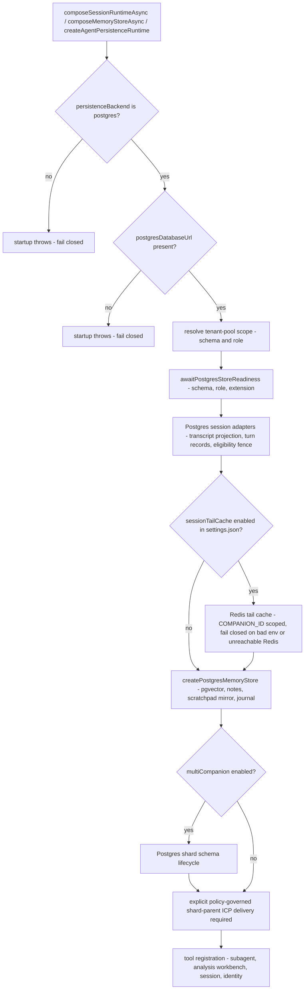

# Development Status

This page records what is actually true in source now: shipped surfaces, active
risks, and alpha caveats, derived from the code and tests rather than sprint
mythology. It is not the issue tracker — the live task graph is `bd`
(`bd ready --json` for executable work, `bd list --status=open,in_progress,blocked,deferred --limit 0 --json` for unfinished work).

The architectural authority for Companion Core identity-and-continuity is the
project charter
([`docs/PSFN_PROJECT_CHARTER.md`](../docs/PSFN_PROJECT_CHARTER.md)); this page
records how the runtime realizes it today. When prose and code disagree, the
code wins — entrypoints, composition, and tests first.

## Current state

PSFN is an early-alpha companion substrate with a real split runtime,
Postgres-backed memory and state, owner-file configuration, the Garden operator
UI, and several bounded autonomy surfaces. The project is past the original
SQLite-centered prototype shape: SQLite implementations and packages are removed, and the live runtime fails closed unless PostgreSQL and `pgvector` are available through `POSTGRES_DATABASE_URL`.

| Area | State | Primary references |
| --- | --- | --- |
| Runtime split | Gateway owns secrets, provider credentials, and external network; the agent runs isolated and talks over gateway RPC; the operator hosts Garden. Split runtime is the only supported shape. | `src/app/gateway/main.ts`, `src/app/agent/main.ts`, `src/app/operator/main.ts` |
| Legacy entrypoint | `src/app/startup/index.ts` is disabled and exits fail-closed with an error directing operators to the split entrypoints. | `src/app/startup/index.ts` |
| Package identity | `psfn-framework` 0.1.0, AGPL-3.0-only, ESM, npm 11.17.0, Node `>=24.19.0 <25`. | `package.json` |
| Persistence | PostgreSQL + pgvector is required for runtime memory, episodes, contacts, intentions, concerns, internal state, scheduled prompts, background work, automata state, and searchable projections; L0 session archives remain JSONL. | `src/persistence/runtime-factory.ts`, `src/app/startup/composition/composition.ts`, `src/faculties/memory/postgres-store.ts` |
| Config authority | Mutable runtime settings live in JSON owner files with startup verification; `.env` is limited to secrets and process/bootstrap wiring. | `src/system/config/startup-owner-files.ts`, `docs/specifications.md` |
| Memory | L0 JSONL archive, L0.1 episodic landmarks/arcs, L2 typed memories, group-memory extraction, scratchpad, wiki, and journal surfaces are distinct. | `src/faculties/memory/`, `docs/memory.md` |
| Garden | Integrated Svelte 5 SPA served from the admin root when built, with nav groups for live operations, memory/identity, runtime tools, review/safety, cognitive security, and configuration (memory, episodes, sessions, contacts, scheduler, settings, prompts, model discovery, charge budget, chat, telemetry, and more). | `admin-ui/src/lib/nav.ts`, `src/operator/garden/` |
| Backups | Scheduled backups stage PostgreSQL dumps, session files, companion/system/workspace trees, then verify restore fidelity before retaining encrypted packages. | `src/persistence/backups/`, `docs/operations.md` |
| Tool surface | Canonical first-party surfaces are consolidated around semantic tools plus `tool_search`/`toolset`; `self_status`, `journal`, `session`, `identity`, `system`, `orient`, `subagent`, and the analysis workbench are current core surfaces. | `src/core/agent/tool-surface/registry.ts`, `docs/tool-surface.md` |

## Startup composition

`src/app/startup/composition/composition.ts` is the shared runtime composition
used by the agent container, the CLI, and test harnesses. Its header documents
the intentional wiring difference: `src/app/agent/main.ts` runs in split mode
(gateway + isolated agent) and wires gateway-backed providers, while core
construction stays in the shared helpers so behavior stays aligned across split
entrypoints. `src/app/startup/composition/parity.ts` holds the wiring shared by
both split-runtime and gateway agent mode (prompt stack, registries, session
tools, filesystem tools, reflection).

The composition layer is deliberately fail-closed. Every Postgres-bound
composer throws at startup instead of degrading:



*Fail-closed Postgres composition: backend, database URL, tenant scope, store readiness, and explicit shard ICP delivery are all startup requirements, not runtime fallbacks.*

Key composition responsibilities and invariants:

- **Session composition** (`composeSessionRuntimeAsync`) requires
  `config.persistenceBackend=postgres`, a database URL (explicit option or
  `config.postgresDatabaseUrl`), and an automata retention `companionId`; it
  migrates the legacy persistence layout first, pins the transcript projection
  to the configured companion schema and topology role, and keeps Postgres
  session adapters behind a TurnRecord eligibility fence. CogSec incident
  observers (session-integrity and projection-drift) record operator-only
  incidents into the canonical `cogsec-events.json` store that Garden reads,
  and a filesystem automata retention write barrier applies to the session
  store.
- **Session tail cache**: a Redis-backed session tail is composed only when
  `settings.json` enables it, and then fails closed — missing/invalid Redis
  env, a missing companion identity, or an unreachable Redis refuses to start.
  Tail/epoch keys are scoped by `COMPANION_ID`, so fleet companions sharing one
  Redis can never read each other's tails.
- **Memory composition** (`composeMemoryStoreAsync`) is Postgres-only and builds
  the pgvector memory store with the notes directory, scratchpad mirror, and
  memory journal; schema and role come from the tenant-pool scope or config.
- **Memory runtime wiring** (`wireMemoryRuntime`) installs the
  `MemoryRetriever` and `MemoryExtractor`, registers the pre-compaction
  extraction handler, and keeps the foreground retriever free of automata bus
  worker access — extraction-only workers may hold that access, the foreground
  never does.
- **Shard and think runtime** (`wireShardAndThinkRuntime`) requires an explicit
  policy-governed shard-parent ICP delivery port and throws when it is absent;
  multi-companion config creates a Postgres shard schema lifecycle; shard
  fold-back memory writes gate at the `memory_write` sink; and the analysis
  workbench tool is wired with repo and workspace mutation disabled
  (`allowRepoMutation=false`, `allowWorkspaceWrite=false`) at the core tool
  tier.
- **Operator hooks** (`wireOperatorHookRuntime`) scans `<workspacePath>/hooks/`
  for `HOOK.yaml` handler definitions, registers the valid ones, and attaches a
  fire-and-forget lifecycle consumer to the agent-process EventBus. Invalid
  hook definitions are rejected with a logged reason and never crash startup;
  an absent hooks directory is a clean no-op.
- **Fatigue runtime** (`composeFatigueBudgetRuntime`) requires
  `chargePolicy.fatigue.humanAttention` (it throws otherwise) and wires the
  deterministic fatigue budget port, fatigue ledger, human-attention ledger,
  and human-attention pressure port.

`parity.ts` shared wiring specifics:

- **Prompt stack** (`wirePromptRuntime`): `PromptLayerStore` over
  `prompt-layers.json` with history, values-journal and north-star derived
  layers, temporal rules, runtime layers, and system-language layers; the
  identity tool registers at the `core` tier and `north_star` at `extended`.
  `wireStaticPromptRegistry` installs the static prompt registry used by
  runtime LLM call-sites (extraction, compaction, and other keyed prompts).
- **REPL budgets** (`buildReplConfig`): owner-set analysis workbench limits are
  the real loop ceilings — matching per-tier clamps (nursery, apprentice,
  autonomous) are lifted so production execution is never silently truncated
  below the settings contract, and the direct-response timeout is validated.
- **Reflection** (`wireReflectionRuntime`) deliberately delegates to the
  canonical `core/scheduler/reflection-runtime`; the comment records that the
  older inline implementation diverged and caused production scheduled
  reflections to miss memory/contact provenance even though standalone runtime
  tests passed.
- **Tool-name canonicality**: composition-time tests pin the shared
  composition to canonical first-party names (`analysis_workbench`, `beads`,
  `fs`, `identity`, `north_star`, `orient`, `schedule`, `session`, `subagent`,
  `system`, `tool_search`, `toolset`) and reject retired per-action aliases
  (`create_concern`, `north_star_list`, `north_star_create`, `self_restart`,
  and friends) through the retired-alias guard.

## Verification gates

The repository enforces its persistence law mechanically.
`scripts/verify-postgres-only.mjs` fails the build when:

- forbidden retired native packages appear in `package.json` or
  `package-lock.json`;
- any retired implementation path from a fixed list exists (a retired
  directory must not contain tracked content);
- an unclassified retired-backend token reference appears in the scanned
  targets (`src`, `scripts`, `config`, `README.md`, and the key docs), with a
  classified allowlist covering cutover contracts, fail-closed regressions,
  legacy-artifact contracts, the network-less shell sandbox CLI toolset, and
  the disposable recovery index; and
- a stale allowlist entry is no longer used by the documents it classifies.

The only sanctioned residual references are the sandbox CLI toolset (local-file
analysis tooling inside the network-less shell sandbox, not a store) and a
disposable recovery-index worker under the OS temporary directory that never
selects a persistence backend. The gate is wired as `npm run verify:postgres-only`
and runs inside `npm run verify:repository-hygiene:structural` alongside the
intake-sink, identity-literal, actor-terminology, model-facing-tool-guidance,
dependency-cycle, shared-type-guard, model-usage-capture, hardcoded-settings,
duplicate-type-name, knip, and todo-bead-link checks.

The companion-identity brand contract is also enforced at compile time:
`tests/types/companion-id.type-test.ts` proves raw strings must cross the
validating constructors (`createCompanionId`, `createShardCompanionId`), that
shard identities are not core identities, and that routing envelopes plus voice
and Wyoming bindings require validated identities. `npm run verify:companion-id-types`
runs `tsc --noEmit` against that file and is required by `npm run build`.

## E2E and test surface

`src/app/e2e/` contains the full-stack certification surfaces:

- `e2e-test.ts` — non-interactive integration test composing the runtime
  through the shared composition entrypoints (identity, session, memory, agent,
  shard/think) with an isolated temp-dir runtime and a scripted LLM provider.
  It requires a configured LLM provider (`providers.json`), an embedding
  provider, and `.env`.
- `runtime-harness.ts` — `createIsolatedE2ERuntime` builds fully isolated temp
  runtime roots (system/companion data, workspace, logs, backups), seeds owner
  files from `config/`, snapshots and restores runtime env keys, and removes
  the root on cleanup.
- `e2e-voice-roundtrip.ts` — closed-loop voice validation: TTS seed, STT
  baseline, PSFN websocket voice runtime (STT → agent → TTS), then text
  recovery comparison through the API voice WebSocket protocol.
- `e2e-walkthrough.ts` — conversational orientation tour for the companion;
  the tour's turns use the scripted LLM provider while embedding resolution
  and Postgres come from the configured runtime.
- `multi-companion-runtime-validation.ts` — fleet certification against a real
  Postgres test harness: per-companion schema tenancy, crossover isolation,
  durable turns across restart, and the fatigue closeout reserve firing under
  continuation evidence, with collision rounds and quiescence windows.
- `icp-certification/` — process-level multi-companion certification with
  per-companion Postgres schemas and tenant owner roles; the agent runtime
  asserts each companion schema is owned by its configured role. An
  OpenAI-compatible fixture server stands in for the provider.
- `idle-purity-certification/` — proves an idle runtime performs no durable
  writes: it snapshots filesystem fingerprints and Postgres write counters
  before and after an idle window and reports every violation.
- `fleet-garden-cutover-certification.integration.test.ts` — exercises the
  production control-plane composition end to end with no test doubles on the
  certified chain: fleet SSO router → Garden operator surface → admin transport
  proxy → per-agent admin transport server → Garden services over real owner
  files on disk; only session authentication is test-provided.
- `fleet-sso-unified-origin.integration.test.ts` — unified-origin fleet auth:
  capability signing, replay/expiry/digest-mismatch, denial
  indistinguishability, and route-level capability enforcement.
- `contact-lifecycle-certification/`, `fleet-posture-runtime-validation.test.ts`,
  and `chat-cockpit-smoke.test.ts` cover the contact lifecycle process,
  fleet-posture telemetry over the gateway server, and the chat cockpit smoke
  report artifact.

The Vitest configuration (`vitest.config.ts`) defines the test profiles:
default runs `src/**/*.test.ts` plus `scripts/**/*.test.ts`; the `unit` profile
excludes integration tests; the `integration` profile adds
`src/**/*.integration.test.ts` plus designated Postgres harness tests; the
setup file installs the fleet-auth persistence boundary; tests time out at 10 s.

## Shipped milestones

| Milestone | What changed | Status |
| --- | --- | --- |
| Split runtime hardening | Gateway/agent/operator responsibilities separated; gateway owns provider secrets, external network, and guarded host tools. | Shipped |
| Owner-file configuration | Runtime/admin settings moved out of env sprawl into JSON owner files with startup verification and Garden editing paths. | Shipped |
| PostgreSQL cutover | Runtime and persistence-aware maintenance use Postgres + pgvector exclusively; tests use Postgres fixtures or port fakes. | Shipped |
| L0.1 episodic memory | Episode landmarks, spans, arcs, lineage, watermarks, synthesis, dream pass, and Garden visibility landed. | Shipped core |
| Group-room memory | Direct/group/auto extraction modes, attribution, salience gates, backfill controls, telemetry, and Garden diagnostics landed. | Shipped |
| Backup/restore coverage | Backups now include pg_dump, companion tree, system owner files, workspace tree, encrypted retention, and restore verification. | Shipped |
| Charge budget | Run-scoped charge accounting, lane quotas, cost visibility, and Garden charge page are wired. | Shipped |
| Values loop | Values evolution ledger read-back into prompt composition is wired and covered by acceptance tests. | Shipped |
| Minimal proactive outbound | Appraisal can produce guarded outbound actions through the proactive dispatcher for configured allowlisted delivery. | Shipped minimal slice |
| Companion self-diagnosis | `self_status` is a core-tier tool exposing snapshots, diagnosis, logs, and LLM-free conformance sweeps; availability actions require the ICP availability runtime and reject unknown keys. | Shipped |
| Durable scheduled prompts | Scheduled and one-shot prompts persist in Postgres (`scheduler_scheduled_prompts`, CHECK-constrained, pending-due index) and rehydrate at startup; completion is recorded only after successful delivery. | Shipped |
| Deliberate trust ratchet | Nightly contact trust-drift review lane derives behavior signals; trusted-tier promotions require human-in-the-loop approval; social-graph edges are backed by persisted memory provenance. | Shipped |
| Tool-call reliability | Fail-closed retry on corrupt-empty tool-call args, streamed args preserved across interleaved reasoning, GLM-5.2 via OpenRouter `:exacto`, backed by a per-provider tool-call eval harness. | Shipped |
| SQLite retirement | SQLite implementations, migration readers, native packages, and dead adapter tests are removed; a repository gate prevents reintroduction. | Shipped |

## Active risks and alpha caveats

- **Early alpha**: the README warns PSFN is under heavy development and not
  every surface is production-safe; use care when testing with a companion.
- **Real providers required for e2e**: the full-stack e2e documents an LLM
  provider (`providers.json`), an embedding provider, and `.env`; the voice
  round-trip drives real TTS/STT providers; the walkthrough uses the scripted
  LLM provider but still needs the configured embedding provider and `.env`;
  none of the harnesses are fully self-contained.
- **Optional Redis tail**: the session tail cache is inert unless
  `settings.json` enables it — but enabling it without Redis or a companion
  identity fails startup rather than degrading silently.
- **Reserved surfaces**: direct shard control is still reserved behind
  approval, proactive outbound only fires for configured allowlisted delivery,
  and the analysis workbench refuses repo/workspace mutation by composition
  default.
- **Live deployment specifics stay private**: addresses, kubeconfigs, Helm
  values, credentials, and host inventory for any live installation are
  operator-owned and never committed here; this repository documents the
  public chart and lifecycle contracts only.
- **Task graph drift**: this page is a snapshot, not the tracker; the
  authoritative sequence of unfinished work lives in `bd`.

## Validation baseline

The smallest validation set that proves a touched area (see also
<!-- openwiki: broken internal link [shakedown.md] file "shakedown.md" does not exist. Fix the href or restore the target, then delete this comment. -->
[`shakedown.md`](shakedown.md) for the cumulative recertification contract):

```bash
npm run lint
npm run build
npm test
npm run verify:settings-contract
npm run verify:startup-owner-files
npm run verify:backup-restore
npm run verify:postgres-only
npm run smoke:chat
```

For tracked code changes this repo requires `npm run lint` before closing a
bead. Repository hygiene runs as `npm run verify:repository-hygiene`; e2e
certification surfaces run through `npm run e2e`, `npm run e2e:voice`,
`npm run e2e:multi-companion-runtime`, `npm run e2e:fleet-posture`, and
`npm run verify:idle-purity`.

## Related pages

- [`architecture.md`](architecture.md) — process roles, composition, and subsystem map
<!-- openwiki: broken internal link [internal-review-workflow.md] file "internal-review-workflow.md" does not exist. Fix the href or restore the target, then delete this comment. -->
- [`internal-review-workflow.md`](internal-review-workflow.md) — review contract for changes
- [`quickstart.md`](quickstart.md) — first install
<!-- openwiki: broken internal link [self-eval-prompt-audit.md] file "self-eval-prompt-audit.md" does not exist. Fix the href or restore the target, then delete this comment. -->
- [`self-eval-prompt-audit.md`](self-eval-prompt-audit.md) — scheduled self-eval prompt rules
<!-- openwiki: broken internal link [shakedown.md] file "shakedown.md" does not exist. Fix the href or restore the target, then delete this comment. -->
- [`shakedown.md`](shakedown.md) — cumulative release recertification
