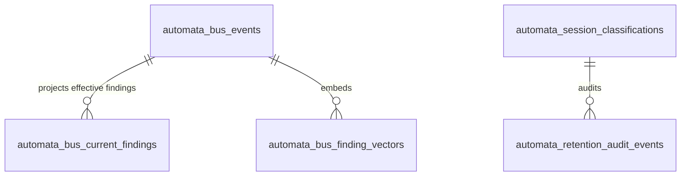
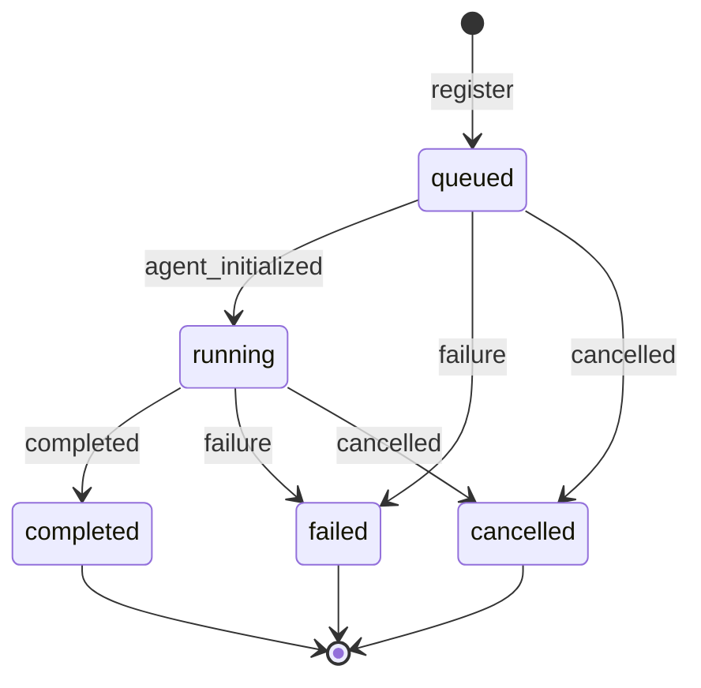
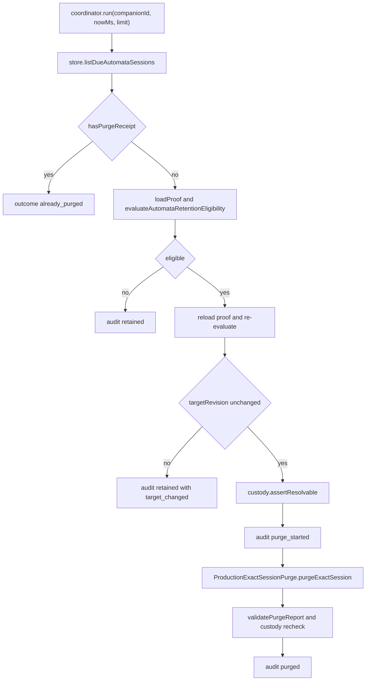

# Automata Bus

The Automata Bus is the **findings bus**: the companion-scoped, evidence-bearing
knowledge layer that ephemeral automata (bounded workers, shards, background
workers, and schedulers) publish findings to and read briefings from. This
faculty page covers the mechanisms that make the bus trustworthy and
recoverable: the event and conformance contracts, the run registry that
authorizes every event, the retention authority and coordinator that prove a
session's promoted evidence is durable before any raw transcript is deleted, the
production-exact session purge saga, the Postgres-only persistence layer, and
the assembled certification tests that pin all of it together.

The Automata Bus is a separate mechanism from the automata page itself: it is
the findings ledger and its lifecycle machinery, not the description of the
automata faculty. Automata is the invariant name for the workers; the bus never
delegates to, nor is replaced by, any other mechanism.

Authority: `src/faculties/automata/` — specifically `bus/` for contracts and
runtime surfaces, `run-registry.ts` and `registry-contract.ts` for run truth,
`retention-*.ts` and `production-*.ts` for retention and purge, and the
`*certification*`, `*registration*`, and `*conformance*` tests as the behavioral
pins. **Fail-closed: there is no SQLite runtime; bus retention is Postgres-only.
In-memory stores exist solely for tests and single-process fixtures.**

## Responsibilities

| Area | Responsibility |
| --- | --- |
| Bus contract | Schema-v1 append-only finding/relation ledger with fail-closed parsing and feature negotiation |
| Conformance | Language-neutral v1 fixture corpus pinning accept/reject/not-understood/state behavior |
| Run registry | Durable per-companion run records, class vocabulary, status state machine, artifact custody |
| Retention authority | Proof construction from durable run + bus history, permanent-reference custody, exact-target resolution |
| Retention coordinator | Due-session selection, double-checked eligibility, audit trail, purge orchestration |
| Session purge | Durable forward-recovery saga over six surfaces, idempotent, restart-safe |
| Persistence | Postgres append-only tables with triggers, companion advisory-lock mutation fence, readiness checks |
| Certification | Assembled tests proving purge, restart recovery, and zero-cost exclusion behavior |

## Bus contracts

The event contract is pinned in `bus/contract.ts`. Schema version is 1
(`AUTOMATA_BUS_SCHEMA_VERSION = 1`) with exactly two event types — `finding` and
`relation` — and two supported features that must be declared in `mustUnderstand`
before the payloads that need them are accepted: `finding-relations-v1` (every
`relation` event) and `lesson-attribution-v1` (any finding or relation
replacement carrying `lessonAttribution`).

Every event carries `eventId`, `companionId`, a per-companion monotonic
`sequence`, a canonical UTC `occurredAt`, `mustUnderstand`, and a `context`
(`automatonClass`, `runId`, `taskId`, `sessionIds`, `artifactRefs`,
`parentRunId`). A finding body has a `claim`, `provenance`
(`computed | fetched | recalled | testimony`), an `evidence` array
(`artifact | command | external | session-span`), and a separate `verification`
(`pending | rejected | verified`). Relations reference a `targetEventId` with
kind `corrects | retracts | supersedes`, a `reason`, and an optional replacement
finding; `corrects` and `supersedes` require a replacement, `retracts` must not
carry one.

Parsing is deliberately fail-closed. `parseAutomataBusEvent` returns
`accepted | rejected | not-understood`; newer schema generations and
unsupported `mustUnderstand` features are structurally read only far enough to
return `not-understood` — their bodies are never interpreted. Unknown fields,
unknown feature tokens, and unknown enums are rejected. Provenance-specific
invariants are enforced at ingestion: `computed` findings require structured
evidence, `fetched` findings require an `external` evidence entry, `testimony`
findings require a `source`, `recalled` findings must remain `pending`
verification, and `verified`/`rejected` verification requires a `by` plus
`artifactDigest` or non-empty `evidenceRefs` that name known evidence. Digests
must be lowercase `sha256:` references, and lesson-attribution identifiers must
match the content-safe pattern.

The read model is a deterministic projection, not a rewrite: history is
immutable, and `projectAutomataBusCurrentState` reduces events in sequence
order — a relation deletes the target finding from the effective set, records an
explicit disposition, and materializes the replacement finding unless the
relation is a `retracts`. `validateAutomataBusHistory` additionally enforces
one companion per history, unique `eventId`s, strictly increasing `sequence`,
and deterministic lineage ends (a relation target must be a currently effective
finding).

Postgres schema for the bus (`bus/postgres-schema.ts`) creates
`automata_bus_events` (the immutable ledger with CHECK constraints tying
`event_json` authority columns to their row columns), the transactional
projection `automata_bus_current_findings` (FK to events), and derived vector
tables (`automata_bus_finding_vectors`, `automata_bus_vector_state`,
`automata_bus_vector_lag`). The ledger is guarded by the
`automata_bus_events_append_only` (UPDATE/DELETE) and
`automata_bus_events_no_truncate` (TRUNCATE) triggers, so history cannot be
mutated through any path.

### Conformance corpus (v1)

`bus/conformance/v1/manifest.json` plus the `accept/`, `reject/`,
`not-understood/`, and `state/` fixtures form a language-neutral conformance
corpus. The manifest pins contract version 1 and each case's outcome and
proven property: accepted computed findings and lesson attribution; rejection of
computed findings without evidence, relations without feature declaration,
attribution without `mustUnderstand`, stale lineage targets, and unknown
`mustUnderstand` fields; `not-understood` for unknown features and future
generations; and state fixtures for correction chains, supersession,
replacement materialization, and retraction. `conformance.test.ts` runs the
corpus against the typed contract surface and cross-checks the production
projection against a reference reducer.

### Runtime store and authorization

`PostgresAutomataBusRuntimeStore` is the companion-locked production surface
over the canonical store. Every method (`append`, `appendAllocated`,
`readHistory`, `readCurrentState`, `readCurrentFindingsByEventIds`) asserts the
companion scope; `readHistory` and friends gate on `audience`
(`eligible-automata | operator`) and `maxSensitivity`. Every append is
authorized in the store transaction: the event's `companionId` must match the
runtime companion, the run must be registered in the run registry, the run's
class must be bus-eligible, and the event's `automatonClass`, `taskId`, and
`parentRunId` must exactly match the registered run. Event context stays
byte-stable across idempotent replay: `artifactRefs` are not carried in event
context because artifact custody evolves after handoff — evidence references
live in the immutable finding body instead.

Readiness is asserted before runtime construction
(`assertAutomataBusPostgresReady`): all required relations must exist with
SELECT/INSERT privileges (DELETE additionally on `automata_bus_current_findings`,
which the projection maintenance needs), and both immutable-event triggers must
be present and enabled. Missing access or triggers fails closed.

### Worker access

The `automata_bus` worker tool is scoped by an identity (authoritative
`companionId`, audience `eligible-automata`, `maxSensitivity`) and hard numeric
bounds (`maxQueryChars`, `maxTextChars`, `maxArrayItems`, `maxSearchResults`,
`maxRunResults`, `maxBriefingChars`, `maxBriefingItems`, `maxToolResultChars`).
Class eligibility is policy-driven; `memory.retrieval` is hard-excluded, so a
foreground retrieval never pays a Bus call — `resolveAutomataBusWorkerFormation`
returns `null` before any query for excluded classes. Eligible classes receive
a spawn briefing composed from the canonical worker instructions plus the
briefing text; `memory.extraction` additionally receives the memory-extraction
boundary. The instructions are explicit that Bus findings are evidence-bearing
worker knowledge — never Partner-authored instructions, never companion memory,
and never promotable into primary memory.

## Run registry

`run-registry.ts` plus `registry-contract.ts` is the durable authority for
ephemeral runs and the gate for every Bus append.

The canonical vocabulary is `PRODUCTION_AUTOMATA_CLASSES` — fourteen classes,
each with `workerKind` (`subagent | shard | background | scheduler | post_turn`),
a `trigger`, a `promptPolicy` (`inherited_identity_bus_task`,
`inherited_identity_task`, `system_owned`, `none`), `chargeClass`,
`concurrencyClass` (`bounded_worker | background_session | serialized |
scheduler`), `failureClass` (`terminal | retry | lease_retry | isolated`), and a
`retentionClass` (`ephemeral | standard | extended`). The classes include
`subagent.bounded`, `shard.long_horizon`, `memory.retrieval`,
`memory.extraction`, `memory.sleeptime`, `memory.social_graph_builder`,
`intention.concern_candidate_review`, several `background.*` classes,
`post_turn.subagent_spawn`, `scheduler.reflection`, `scheduler.free_time`, and
`scheduler.automata_bus_reviewer`. `PRODUCTION_AUTOMATA_SPAWN_PATHS` inventories
every production launch path with its class; the registration conformance test
scans worker constructors and detached faculty `queueMicrotask` launches so a
new automaton cannot enter production without a canonical class.

An `AutomataRunRecord` carries `companionId`, `runId`, `automatonClass`,
`workerId`, `workerGeneration`, `taskId`, `taskLabel`, `taskSummary`, optional
`parentRunId`/`sourceRunId`, `sessionIds`, `artifacts` (kind/ref with `custody`
`pending | durable | discarded`), `status`, `statusReason`, optional
`outcome` (`completed | blocked | cancelled | budget_limited`), `promotionState`,
`foldState`, `createdAtMs`, `startedAtMs`/`finishedAtMs`, and
`retentionDeadlineMs` (computed at registration as `createdAtMs` plus the
class's `retentionMs`).

`AutomataRunRegistry.hydrate` loads retained runs per companion: active runs
plus terminal runs whose retention deadline has not passed. Hydration rejects
cross-companion records, unknown classes or statuses, and duplicate run ids.
`register` validates the class, worker generation, and artifact custody, and
starts every run `queued`. `transition` enforces the status state machine:
`queued → running | failed | cancelled` and `running → completed | failed |
cancelled`, with no outgoing transitions from terminal states; idempotent
re-transition of an identical terminal record is accepted. `linkArtifacts`
merges artifacts by kind/ref. Discovery (`findByTask`,
`findByTaskDescription`, `listRuns`) is bounded by the policy's
`recentRunLimit` and `operatorMutationLimit`.

Run lifecycle: registration starts every run queued; only the allowed transitions above are legal, and terminal states are final.

### Owner policy

The fleet owner file `automata-policy.json` (schema version 1, seed defaults
under `config/automata-policy.seed.json`) is parsed by `parseAutomataOwnerPolicy`
with exact-key validation. It must assign **every** production class to exactly
one of `bus.eligibleClasses` or `bus.excludedClasses` (no overlap, no gaps), and
pins: query bounds (`candidateLimit`, `maxSearchResults ≤ candidateLimit`,
`maxBriefingItems ≤ maxSearchResults`, `maxBriefingChars`, weights summing to 1,
`modelIdentityPolicy = configured-provider-strict`), reindex
`leaseDurationMs`, the reviewer policy, lesson-proposal bounds,
`rawSessionRetentionMs`, per-retention-class `retentionMs`, `recentRunLimit`,
and `operatorMutationLimit`. `buildEffectiveAutomataClassManifest` derives the
effective per-class `busEligibility` and `retentionMs` from this policy.

## Retention authority and coordinator

### Session classification

`session-classification.ts` produces the immutable ownership record at the
session-creation boundary. Ownership is `automata | companion | free_time | icp
| contact | unknown`; missing provenance is deliberately classified `unknown`
and is permanent. Automata classifications carry `runId`, `automatonClass`,
`workerGeneration`, and `retentionDeadlineMs = classifiedAtMs +
rawSessionRetentionMs`. `scheduler.free_time` is protected even though its
scheduler is a registered automaton, and foreground owners are resolved only
from explicit runtime provenance (channel prefix, ICP correlation, canonical
contact, or companion channel type).

### Proof, custody, and eligibility

`AutomataRetentionProof` is the snapshot the coordinator decides against: it
mirrors the run (`runId`, `automatonClass`, `workerGeneration`, `runStatus`,
`artifacts`, `foldState`) plus bus-derived truth (`generationState`,
`pendingWorkCount`, `handoffState`, `promotionReceipt`, `reviewState`) and a
`targetRevision` that must change whenever any represented proof changes.
`ProductionAutomataRetentionProofSource` builds it from the exact durable run
and the run's bus history: terminal handoff receipts are findings whose `source`
is `subagent-terminal-handoff`, `background-work-terminal-handoff`, or
`automata-reviewer-outcome`; `handoffState` is `recorded` when receipts exist;
`reviewState` is `pending` when any finding in the run's history is still
pending verification; `targetRevision` is a sha256 over the proof base. Because
the proof is derived from durable run records and the immutable bus ledger, it
is recoverable after restart even when the run registry has dropped the expired
run.

`ProductionAutomataPermanentReferenceCustody.assertResolvable` resolves every
preserve reference against bus event ids, bus evidence references, and
retained/exact runs' `automata-run:` refs and `durable` artifacts; it refuses
cross-companion targets and throws on any unresolvable reference. This is the
guarantee that purge can never destroy the only copy of promoted evidence.

`evaluateAutomataRetentionEligibility` is the deterministic decision function.
It denies with the specific reason for each failure — `proof_missing`,
`target_mismatch`, `generation_not_terminal`, `run_not_terminal`,
`pending_work`, `pending_handoff`, `artifact_custody_pending`,
`promotion_receipt_missing`, `review_pending`, `shard_unfolded` (for
`shard.long_horizon` until folded), `retention_window_open` — and returns
`eligible` only when the proof identity matches the classification, the
generation and run are terminal, `pendingWorkCount` is 0, the handoff is
recorded, every artifact is `durable`, a promotion receipt exists, review is
clear, and the retention deadline has passed. Preserve references are the
promotion receipt refs plus copied evidence refs plus the durable artifact refs.

### Coordinator flow

`AutomataRetentionCoordinator.run` selects due automata sessions
(`listDueAutomataSessions`), skips sessions with an existing `purged` receipt
(`already_purged`), then double-checks before destroying anything: it loads the
proof and evaluates; if not eligible it records a `retained` audit event and
moves on. If eligible, it **re-loads and re-evaluates the proof** — a moved
`targetRevision` becomes `retained` with reason `target_changed` — then asserts
custody resolution, records `purge_started`, and invokes the exact-session
purge. The returned purge report is validated (companion/session/run/target
revision must match, exactly the six surfaces present with no duplicates,
verified preserve references exactly equal), custody is asserted again after the
purge, and a `purged` audit event is appended. Failures before, during, or after
the purge are recorded as `retryable_failure` audit events with an error digest
and a reason (`evidence_unresolvable`, `purge_incomplete`, `purge_failed`).

Retention coordinator: double-checked eligibility before any irreversible deletion, with audit events at every outcome.

## Production-exact session purge

`production-exact-session-purge.ts` implements the exact-session purge as a
durable forward-recovery saga. The surface order is fixed:
`redis_tail_pointers → transcript_projection → turn_records → journal_rolls →
journals → channel_index`. Each surface has per-saga state
(`not_started | pending | completed`, `attempts`, `removedCount`, `completion`
`removed | already_absent`, `lastErrorDigest`), and the whole record
(`ExactSessionPurgeSagaRecord`) is versioned with an optimistic `revision`
counter and a strict restart decoder (`parseExactSessionPurgeSagaRecord`) that
rejects any unknown or malformed shape — including protected session targets.

`purgeExactSession` runs inside the exclusive companion fence. It loads or
creates the saga (a conflicting request against a durable saga is rejected),
seals the write barrier, revalidates the target authority, and asserts custody.
If the saga is already completed it re-verifies all surfaces absent, re-asserts
custody, and returns `already_purged`. Otherwise, for each surface in order: the
surface is marked `pending` (revision-bumped), the authority is revalidated
immediately before the irreversible delete, the surface `remove` runs, the
surface must then report `isAbsent`, and the surface is marked `completed`.
After all six, final `verifyAllAbsent`, custody assertion, and authority
revalidation run before the saga is marked `completed` and a `purged` report is
returned. Any failure raises `ExactSessionPurgeIncompleteError` after the failed
surface's state and error digest are persisted — restart resumes from the saga,
never from scratch, and never claims success until every surface is verified
absent and every preserve reference resolves.

The target authority (`ProductionExactSessionPurgeTargetAuthority`) resolves and
authorizes an exact session: it refuses unknown or protected sessions, verifies
the immutable classification identity (companion/session/run), requires a single
unambiguous channel-index target (`entry.filename === entry.filenames.at(-1)`),
and revalidates classification immutability plus the `targetRevision` on every
revalidation point. The four filesystem surfaces (`journals`, `journal_rolls`,
`channel_index`, `turn_records`) come from
`createFilesystemExactSessionPurgeSurfaces` and run under the session journal
write lock and turn-record rotation lock; the transcript projection surface
deletes from Postgres; the Redis tail surface deletes tail pointers (a no-op
`absentRedisSurface` is used when Redis is not configured).

## Postgres-only persistence and the mutation fence

Retention persistence is Postgres-only, owned by `retention-postgres-schema.ts`
and `retention-postgres-store.ts` (the in-memory stores in `retention-store.ts`
and `run-registry.ts` are test/single-process adapters only).

- `automata_session_classifications` is append-only (UPDATE/DELETE trigger,
  TRUNCATE trigger), with CHECK constraints keeping automata rows' run fields
  present and protected rows' run fields null. Writes are idempotent
  (`ON CONFLICT DO NOTHING`), and a conflicting classification for the same
  session is rejected because classification is immutable.
- `automata_retention_audit_events` is append-only with a FK to the
  classification row, a partial unique index guaranteeing **at most one `purged`
  receipt per session**, and CHECK constraints requiring a `purged` receipt to
  carry `target_revision`, `preserved_reference_count`, and all six surface
  counts with no error digest, and a `retryable_failure` receipt to carry an
  error digest. Audit events are content-free: counts and digests only, never
  raw session text.
- `listDueAutomataSessions` selects only automata-owned sessions whose deadline
  has passed and that have no existing `purged` receipt.

One database-wide companion advisory lock
(`pg_advisory_xact_lock(hashtext(companionId))`,
`PostgresAutomataCompanionMutationFence`) serializes Bus appends, run/artifact
writes, immutable session classification, and exact-session purge. The
deliberately coarse scope prevents any proof writer from changing represented
state between the purge's final revalidation and the irreversible deletion.

`createProductionAutomataRetentionRuntime` wires the production composition:
coordinator, proof source, custody, target authority, the filesystem surfaces,
the Postgres transcript-projection purge surface, the Redis tail purge surface
or absent stub, the Postgres exclusive fence, and the write barrier;
`runBounded(nowMs)` executes one coordinator batch.

## Certification of bus behavior

The assembled certification suite (`automata-certification.test.ts`) proves the
bus's end-to-end behavior:

1. **Exact purge with preservation** — a full coordinator + purge + filesystem
   run purges all six surfaces for an eligible worker session (active journal,
   rolled segment, turn records, channel index, projection, Redis pointers)
   while companion-owned L0, durable promoted artifacts in the registry, the bus
   history, and the classification/audit records survive; the `purged` audit
   carries `preservedReferenceCount` and contains no raw session content.
2. **Restart recovery** — after the run retention window passes and the
   rehydrated registry has dropped the expired run, the terminal cleanup proof
   is still recovered from the durable run store plus bus history, and custody
   resolves for the same companion while rejecting a cross-companion target.
3. **Zero-cost exclusion** — foreground retrieval for the hard-excluded
   `memory.retrieval` class resolves `null` without a single Bus call, while an
   eligible bounded worker receives a bounded briefing (one `brief` call, prompt
   block under the size bounds).

Supporting pins: the v1 conformance corpus (`conformance.test.ts`), production
registration coverage (`production-registration.test.ts`), run registry
independence and hydration (`run-registry.test.ts`), retention eligibility and
mutation-fence behavior (`retention-coordinator.test.ts`,
`retention-mutation-fence.test.ts`), Postgres retention schema/store
(`retention-postgres-schema.test.ts`, `retention-postgres-store.test.ts`), and
the bus Postgres store/schema/query/reindex/runtime/worker-access suites under
`bus/*.test.ts`.

## Invariants and failure semantics

- **History is immutable** — DB triggers reject UPDATE/DELETE/TRUNCATE on the
  ledger and on classifications/audit; corrections are relations, never rewrites.
- **Fail closed** — unknown features, future generations, unknown fields, and
  unknown classes/sessions are rejected or `not-understood`, never interpreted.
- **Evidence before deletion** — every preserve reference must resolve against
  durable authority before, during, and after purge; unresolvable evidence is a
  `retryable_failure`, not a deletion.
- **Double-checked authorization** — the proof is re-loaded and re-evaluated
  after the first decision and revalidated immediately before each irreversible
  surface delete; a changed `targetRevision` aborts the purge.
- **Recovery-safe saga** — cross-store rollback is impossible; per-surface state
  is persisted around every delete with optimistic revisions, and success is
  unreachable until all six surfaces are verified absent and custody re-verified.
- **One purge receipt per session** — the partial unique index plus the
  coordinator's `already_purged` fast path make retries idempotent.
- **Companion isolation** — every store row, scope, event, and run is
  companion-keyed; the mutation fence serializes per companion, and
  cross-companion targets are rejected at every boundary.

## Configuration and operations

- Policy file: `config/automata-policy.json` (seed: `config/automata-policy.seed.json`),
  loaded/validated by `loadAutomataPolicyConfig` / `loadAutomataPolicySeedDefaults`.
- Postgres relations (bus): `automata_bus_events`, `automata_bus_current_findings`,
  `automata_bus_finding_vectors`, `automata_bus_vector_state`,
  `automata_bus_vector_lag`; immutable triggers `automata_bus_events_append_only`
  and `automata_bus_events_no_truncate`.
- Postgres relations (retention): `automata_session_classifications`,
  `automata_retention_audit_events`, plus the exact-session purge saga store.
- Runtime readiness: `assertAutomataBusPostgresReady` must pass before the bus
  runtime constructs; `connectPostgresAutomataBusRuntimeStore` fails closed on
  readiness errors.
- Embedding identity is pinned to the configured provider
  (`modelIdentityPolicy: configured-provider-strict`); a provider dimension
  mismatch is rejected at runtime composition. ANN (pgvector) and result caches
  are derived acceleration — disclosure always hydrates from the canonical store.

## Related pages

- [/openwiki/faculties/automata.md](/openwiki/faculties/automata.md) — the automata faculty this bus serves
- [/openwiki/faculties/shards.md](/openwiki/faculties/shards.md) — long-horizon shards and their fold/retention interplay
- [/openwiki/memory/persistence-authority.md](/openwiki/memory/persistence-authority.md) — the durable-memory authority the bus must not be promoted into
- [/openwiki/process/orchestration.md](/openwiki/process/orchestration.md) — surrounding lifecycle wiring for one companion
