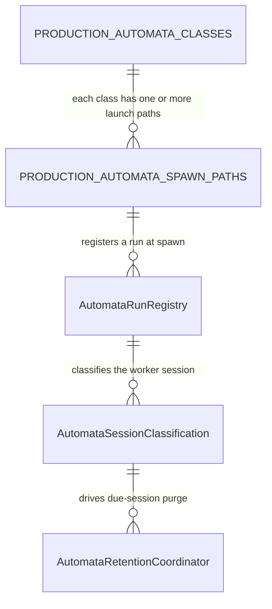
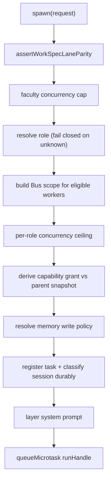
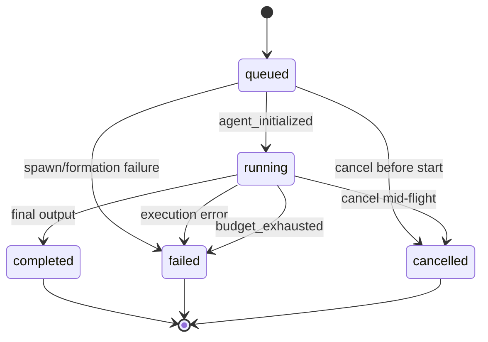

# Automata

**Automata** (invariant singular and plural) is the companion-facing name for the
internal components that act on the companion's behalf inside her own cognition
— anything that would introduce itself as "I am <companion>'s X" ([charter
§6.28](/docs/PSFN_PROJECT_CHARTER.md)). Memory extraction, concern formation,
appraisal, whisper emitters, and the bounded workers whose code lives under
`src/faculties/subagents/` are all automata: they fire off the companion's
central world-facing voice; they are not that voice. This wiki uses automata.
Cite `src/faculties/subagents/` only as a filesystem path.

Two boundaries keep this page precise:

- **Shards are not automata** (charter §6.12 / §6.28). A shard is a scoped
  continuation that folds through review; it gets its own page.
- **The Automata Bus is a separate mechanism** — the findings ledger and its
  lifecycle machinery, documented on [automata-bus](/openwiki/faculties/automata-bus.md).
  It does not replace the automata page, and it never delegates to or replaces
  the workers described here.

Authority: `src/faculties/subagents/` for the bounded-worker faculty and its
governance, and `src/faculties/automata/` for the class vocabulary, durable run
registry, session classification, and retention coordinator (excluding the Bus's
own `bus/` contracts, which belong to the Bus page). **Fail-closed is the
operating principle: unknown classes, unknown roles, missing provenance,
unresolvable evidence, and missing grants are refused, never guessed.**

## Responsibilities

| Area | Responsibility |
| --- | --- |
| Class vocabulary | Canonical `PRODUCTION_AUTOMATA_CLASSES` — 14 class descriptors (worker kind, trigger, prompt policy, charge, concurrency, failure, retention class) |
| Spawn registration | Reviewable `PRODUCTION_AUTOMATA_SPAWN_PATHS` inventory; conformance tests block unregistered worker constructors and detached launches |
| Run registry | Durable per-companion run records with status machine, worker generation, artifact custody, retention deadline |
| Bounded worker faculty | `SubagentFaculty` — spawn/message/wait/cancel/discover/inspect control port, bounded turn loop, honest terminal outcomes |
| Work-spec threading | Typed `LLMWorkSpec` carried through the faculty; lane derived through the single runtime resolver (Law 12.4) |
| Capability governance | One immutable child grant from advertised tokens × atomic parent snapshot; `general` expands to reads only |
| Tool governance | Tier blocklist plus read-only wrappers over core-authoritative multiplexed surfaces (orient, journal, wiki, skill, vault) |
| Memory governance | Opt-in per-spawn writes, restricted-class staging to fold review, read-only provider facade, delete never available |
| Role registry | Schema-owned `subagent-roles.json` narrowing postures layered over inherited identity |
| Session classification | Immutable creation-time ownership record: automata vs protected (companion/free-time/ICP/contact/unknown) |
| Retention | Proof-based eligibility, double-checked purge, exact-session saga over six surfaces, content-free audit |

## Production class vocabulary

`PRODUCTION_AUTOMATA_CLASSES` (`src/faculties/automata/registry-contract.ts`)
is the canonical vocabulary of production ephemeral workers. Every class
carries a descriptor: `workerKind` (`subagent | shard | background | scheduler
| post_turn`), `trigger`, `promptPolicy` (`inherited_identity_bus_task |
inherited_identity_task | system_owned | none`), `chargeClass`, `concurrencyClass`
(`bounded_worker | background_session | serialized | scheduler`), `failureClass`
(`terminal | retry | lease_retry | isolated`), and `retentionClass`
(`ephemeral | standard | extended`). Runtime spawn registries reference these
IDs; adding a new spawn path without adding its class fails the registration
coverage test and the runtime guard.

*Class registry, spawn paths, and the durable run/classification/retention chain.*

The four durable background-work kinds are keyed to classes in
`BACKGROUND_WORK_AUTOMATA_CLASSES` (`memory_extraction → memory.extraction`,
`intention_post_turn_hooks → background.intention_post_turn_hooks`,
`emotion_appraisal → background.emotion_appraisal`,
`auto_compaction → background.auto_compaction`); the record's exhaustiveness is
checked by TypeScript and the registration test. Foreground retrieval is its own
class (`memory.retrieval`, ephemeral retention) and is **hard-excluded** from
the Bus, so a foreground context read never pays a Bus call.

## Spawn registration

`PRODUCTION_AUTOMATA_SPAWN_PATHS` (`production-registration.ts`) is a
reviewable inventory of production cognitive-worker launch paths. Each entry
names the canonical `classId`, the `sourcePath` where the worker launches, and
— where applicable — the `workerSymbol` (a `new XWorker(` constructor) or the
`queueMicrotask` detached-faculty launch marker. `production-registration.test.ts`
scans every production `src/**/*.ts` file for `new <Name>Worker(` constructors
and for detached `queueMicrotask(` launches under `src/faculties/`, and asserts
the found set equals the declared inventory — so a new automaton cannot enter
production without a canonical class.

## Durable run registry

`AutomataRunRegistry` (`run-registry.ts`) is the companion-scoped authority for
run truth. `hydrate` loads retained records from a store, rejecting
cross-companion runs, duplicate run IDs, unknown classes, and unknown statuses.
`register` creates a `queued` run with `workerGeneration` (default 1), session
IDs, artifact refs with custody (`pending | durable | discarded`), and a
`retentionDeadlineMs` derived from the class's `retentionMs`. `transition`
enforces the status machine — `queued → running | failed | cancelled`,
`running → completed | failed | cancelled`, terminal states are final — with an
idempotent re-transition to an identical terminal state allowed (for safe
replay). `linkArtifacts` merges durable artifact references.

## The bounded worker faculty

`SubagentFaculty` (`src/faculties/subagents/faculty.ts`) is the canonical
bounded automaton. It implements the `SubagentControlPort` (`port.ts`):
`execute`, `spawn`, `message`, `wait`, `cancel`, `discover`, `inspect`, plus
runtime snapshot views. Production composition constructs it in
`wireShardAndThinkRuntime` and registers it on the parent agent loop as the
canonical `subagent` tool (actions `spawn | message | wait | cancel | status |
discover | inspect`).

### Spawn-time governance chain

`spawn` fails closed through a fixed order before any worker is registered:

1. **Work-spec lane parity** — `assertWorkSpecLaneParity` before registration;
   a declared lane that does not reconcile with the single runtime lane resolver
   bricks the spawn (Law 12.4).
2. **Concurrency limit** — the faculty-wide cap (explicit deps override, then
   `config.subagentMaxConcurrent`, then default 8); a full faculty emits a
   blocked completion handoff and throws.
3. **Role resolution** — a requested role is resolved against the schema-owned
   registry; an unknown role, blank name, or malformed definition fails the
   spawn closed with a structured blocked handoff (`unknown_role`).
4. **Bus scope formation** — an eligible worker receives a fresh `automata_bus`
   tool bound to its authoritative run scope (`subagent.bounded` run, task ID);
   the ordinary catalog never supplies an unbound Bus surface, and a role's
   allow-list can exclude the Bus.
5. **Role ceiling** — per-role `maxConcurrent` is enforced before registration;
   turns and capability tokens are only ever narrowed (clamped/intersected),
   never widened.
6. **Capability grant** — advertised tokens are derived against one atomic
   parent-owner snapshot; denied explicit tokens (`capability_escalation`) and
   missing required tokens (`missing_capabilities`) fail closed.
7. **Memory write policy** — opt-in `memory.write` capability or an explicit
   non-empty elevation reason; a blank elevation reason fails the spawn before
   registration.
8. **Task registration + durable classification** — the task is registered
   (in-memory or durably through the run registry), then the run's session is
   durably classified *before the worker can write its journal*; classification
   failure throws before the worker starts.
9. **Prompt layering** — stable public order: inherited companion identity,
   bounded Bus layer, then role posture; the task stays the first Partner message.
10. **Launch** — `queueMicrotask(() => runHandle(handle))`; the spawn returns
    the queued task record immediately.

*Spawn-time governance chain: every gate fails closed before registration.*

### Bounded execution loop

`runHandle` constructs a `SessionManager` (with the parent's intake screening
assigned, so subagent tool results screen exactly like the parent's), wraps the
LLM provider with `createSubagentWorkSpecProvider` so every model call carries
the typed work spec, and builds a `SubstrateAgent` with
`backgroundWorkDisabled: true` — automata are ephemeral and intentionally own
no durable post-turn lane. The loop runs at most `maxTurns` bounded turns
(clamped to the global assistant-step cap), each turn feeding the previous
assistant output back as the next Partner message.

Terminal honesty is a first-class contract (`types.ts`): the coarse task
lifecycle stays `completed | failed | cancelled`, while the result carries an
`outcome` of `completed | blocked | cancelled | budget_limited`. A run curtailed
by a declared work-spec ceiling (deadline or accumulated output tokens) with
turns still unused reports `budget_limited` with a `partial` result holding the
remaining budget and the latest checkpoint — it never masquerades as completed.
Every non-completed outcome carries a partial result so callers can account for
work done and decide whether to resume.

`finishHandle` claims the handle synchronously before any await (making it
idempotent against the cancel-before-start race and preventing double release
of a role slot), removes the handle from the active set, releases the role
concurrency slot, awaits the terminal result, **drains outstanding follow-up
turns before reporting terminality** (so a "completed" automaton can never keep
writing to a session whose backing store the caller disposed), then emits the
parent completion handoff and the durable automata terminal handoff.

*Task-registry lifecycle machine; a budget_limited result is recorded through
the coarse failed terminal while reporting the honest outcome.*

### Work-spec threading

`buildSubagentWorkSpec` (`work-spec.ts`) builds the typed `LLMWorkSpec` a
bounded run carries: purpose is always `background` and the run is
`durable: false`. The lane is derived through the **single** resolver
(`buildLLMWorkSpec → resolveAutonomousModelCallLane`), never a second admission
or budget resolver, so the declared lane reconciles byte-identically with the
client's admission lane (Law 12.4). A `companion_private` telemetry visibility
short-circuits the lane resolver, so the builder adopts the canonical collapsed
background telemetry shape in that case, keeping the stored correlation
self-consistent with the resolver's short-circuit. `createSubagentWorkSpecProvider`
wraps the LLM provider: `stream` inherits the spec when the caller supplied
none; `complete` inherits it only when the call's purpose matches the spec's
purpose (fail closed — internal calls of a different purpose are never
mis-attributed).

## Governance layers

### Capability derivation

`deriveSubagentCapabilityGrant` (`capability-access.ts`) produces one immutable
child grant from the advertised spawn tokens and one atomic parent-owner
snapshot. The snapshot must be coherent (granted tokens must equal the tier's
resolved tokens plus custom tokens) or derivation throws. `general` expands only
to read tokens (`identity.read`, `internal.read`, `git.read`, `issue.read`,
`world.read`); explicit capability tokens stay opt-in and are clamped to the
parent set; any denied explicit token fails the spawn as an escalation. A custom
parent tier requires an authoritative `snapshotParentCapabilityGrant` provider —
without it, derivation throws rather than guessing.

### Tool governance

Two layers bound the toolset a bounded worker resolves from the deployment
tier:

- **Blocked at injection** (`BLOCKED_SUBAGENT_TOOL_NAMES`): `subagent` /
  `spawn_subagent` / `spawn_shard` / `shard` / `load_tools` / `toolset` (no
  nested workers), `identity` and `north_star` (identity/purpose truth has no
  task-scoped child use), `notify` (the operator emergency button, never a
  companion outbound surface), all `contact_*` surfaces, the legacy split
  memory mutation surfaces and delete class, and the unbound `automata_bus`.
- **Read-only wrappers** (`GOVERNED_SUBAGENT_TOOL_POLICIES` in
  `tool-governance.ts`): the core-authoritative multiplexed surfaces — `orient`
  (core-memory blocks, values journal, concern ledger, introspection consent),
  `journal`, `wiki`, `vault`, `skill` — reach a bounded loop only behind a
  governance wrapper. Read actions pass through (including the
  omitted-action read defaults the underlying tools resolve); every mutation is
  denied and audit-trailed with `errorClass: policy_blocked` and
  `retryHint: do_not_retry`. There is no opt-in or elevation for these surfaces:
  a bounded child proposes changes in its final result for core to review and
  apply.

### Memory governance

Bounded-ness and write-trust are different axes (charter §6.11). A subagent's
toolset never implies canonical write trust; writes are opt-in per spawn:

- `createSubagentMemoryProviderFacade` forwards **only the read methods** of the
  `MemoryProvider` contract (`retrieve`, turn-retrieval query embeddings, active
  memory context, turn memory snapshot) — any method not forwarded does not
  exist on the facade.
- The canonical `memory` tool is wrapped (`createGovernedSubagentMemoryTool`):
  reads pass through; `write`/`import`/`patch` are governed; `redact`, `delete`,
  and `restore` are denied at **every tier and elevation** (charter 6.11);
  an unknown or unparsable action is denied (fail closed).
- Write tiers: `none` (default), `governed` (via the `memory.write` capability
  token), `elevated` (explicit per-spawn elevation with a non-empty reason,
  audit-trailed at spawn before registration, never accepted from model-facing
  spawn input). `patch` requires elevation.
- Restricted-class candidates — emotional/relational/boundary memory (or an
  undeterminable type, which is the restricted class) — are **never written
  directly** from a non-elevated worker: they stage as provenance-tagged
  fold-review candidates (`subagent_origin`) through the same shard fold-review
  queue core uses, with the subagent ID stamped into provenance. A batch import
  containing any restricted record stages atomically (no partial import).
  Absent fold-review wiring ⇒ restricted writes are denied outright.

### Role registry

`subagent-roles.json` is a cluster-global, schema-owned system owner file
(`src/system/config/subagent-roles-config.ts`). Parsing fails closed: a
malformed file throws, an absent file resolves to the empty registry, and an
unknown role fails any spawn that requests it (with the known-role set surfaced
for diagnostics; prototype-chain names like `__proto__` are rejected before
lookup). A role is a **narrowing posture**: it layers task instructions over the
inherited companion identity (default `inheritIdentity: true`; `false` replaces
identity wholesale) and may only restrict `allowedTools`, `maxTurns`,
`timeoutMs`, `maxConcurrent`, and `capabilities` — enforced as clamps and
intersections at spawn. `layerRoleSystemPrompt` keeps the prompt order stable:
an explicit per-spawn `systemPrompt` override wins wholesale; role instructions
appear under the inherited identity as a `## Role: <name>` section.

### Task registry

`SubagentTaskRegistry` (`task-registry.ts`) owns the coarse lifecycle machine
with `ALLOWED_TRANSITIONS` and a bounded recent-task ring (default 25). When a
durable run registry is supplied, registrations and transitions persist through
it (`register` → run `register`, transitions → run `transition`, hydration
rebuilds active/recent tasks from retained `subagent.bounded` runs), and
`discover`/`findByTaskDescription` query the durable store. `linkReferences`
merges durable artifact refs (kind + ref dedupe) onto the task record.

## Session classification

`classifySessionAtCreation` (`session-classification.ts`) produces the immutable
ownership record at the session-creation boundary — the input that decides
whether a session is a governed automata session or a protected session:

- **Automata** sessions carry `runId`, `automatonClass` (validated against the
  production vocabulary — an unknown class throws), `workerGeneration`, and a
  `retentionDeadlineMs` derived from the owner policy's `rawSessionRetentionMs`.
- **Protected** ownerships (`companion | free_time | icp | contact | unknown`)
  are permanent and never subject to automata retention. Missing provenance is
  deliberately classified `unknown` and is permanent — only explicit runtime
  provenance protects a foreground owner.
- `scheduler.free_time` is a registered production automaton, but sessions it
  owns are classified protected `free_time` — free-time is permanent even though
  its scheduler is a registered automaton.

`resolveForegroundSessionOwner` derives foreground ownership only from explicit
provenance: the free-time channel prefix, ICP correlation, a canonical contact
ID, or companion channel types. `AutomataSessionClassificationService` persists
the classification durably before returning; `ensureClassifiedAtCreation`
tolerates concurrent first-turn races between the read and the immutable insert
(a committed classification is authoritative; other failures escape). The agent
loop wires this at session creation (`src/app/agent/core-runtime.ts`), and the
bounded faculty classifies its execution channel before the worker can write
its journal.

## Retention lifecycle

Terminal automata runs keep their raw sessions only until the retention window
closes; the coordinator then purges them only after proving the promoted
evidence is durable. The full machinery (proof source, custody, exact-session
purge saga over journals, journal rolls, channel index, transcript projection,
turn records, and Redis tail pointers, the Postgres exclusive fence, and the
audit schema) is documented on the [Automata Bus](/openwiki/faculties/automata-bus.md)
page; the automata page records the ownership contract that feeds it:

- `evaluateAutomataRetentionEligibility` requires the proof to match the
  classification's companion/session/run/class, a terminal worker generation
  and run, zero pending work and handoff, all-durable artifact custody, a
  promotion receipt, a clear review state, a folded shard (for
  `shard.long_horizon`), and the closed retention window. Every failure reason
  is explicit (`proof_missing`, `target_mismatch`, `generation_not_terminal`,
  `run_not_terminal`, `pending_work`, `pending_handoff`,
  `artifact_custody_pending`, `promotion_receipt_missing`, `review_pending`,
  `shard_unfolded`, `retention_window_open`).
- The coordinator double-checks: it re-loads and re-evaluates the proof before
  any purge, re-validates the target revision immediately before irreversible
  surface deletes, and asserts permanent-reference custody — unresolvable
  evidence is a `retryable_failure`, never a deletion. Audit events are
  content-free (`automata_retention_audit_events`): removed counts and
  preserved-reference counts, never raw session content.
- The Postgres classification table enforces the ownership shape with CHECK
  constraints and is append-only (UPDATE/DELETE/TRUNCATE triggers), so an
  ownership record can never be rewritten after creation.

## Durable terminal handoff

The automata lifecycle port (`src/faculties/subagents/automata-lifecycle.ts`)
is the narrow seam between the bounded faculty and the durable Bus/run adapter.
`recordTerminalHandoff` receives only lineage (run/task/worker/parent/source
runs, session IDs), lifecycle state, outcome, usage accounting, and references
to separately governed work products. **Deliberately absent: worker output,
transcript entries, prompts, tool calls, and reasoning.** Each terminal outcome
is keyed by a stable SHA-256 idempotency key
(`buildSubagentTerminalHandoffKey(runId)`), so retries and replays record once
(`inserted: false` on exact replay). `inspectRun` returns the durable view
(finding/evidence/artifact/handoff refs) that `SubagentFaculty.inspect` folds
into its `SubagentDurableTaskInspection`.

## Production wiring

`wireShardAndThinkRuntime` (`src/app/startup/composition/composition.ts`)
constructs the faculty with the event bus, LLM provider, session store,
completion-notice delivery, atomic capability snapshot, the shared
fold-review controller, lazy parent intake screening, the durable automata
registry, session classification, Bus worker access, and the lifecycle port,
then registers the `subagent` tool on the parent agent loop. Restricted-class
subagent memory candidates ride the **same** shard fold-review queue core uses
— no parallel review system.

## Invariants and failure semantics

- **Fail closed everywhere** — unknown classes, unknown roles, missing
  provenance, unparsable actions, unresolved work-spec lanes, and missing
  grants are refused with structured errors or blocked handoffs, never guessed.
- **Bounded and ephemeral** — subagents own no durable post-turn lane
  (`backgroundWorkDisabled: true`); work-spec ceilings only curtail, never
  admit.
- **No widening** — roles and capability derivation can only narrow the parent
  tier's tools, tokens, turns, timeout, and concurrency.
- **Core stays authoritative** — values, consent, identity, trust, and
  emotional truth are read-only or fold-reviewed from a bounded child; proposed
  changes go in the final result for core to act on.
- **Delete never** — redact/delete/restore are unavailable at any tier or
  elevation from an automaton context.
- **Honest terminality** — `budget_limited` and `cancelled` never collapse into
  `completed`; partial results carry remaining budget and the latest
  checkpoint; outstanding follow-up turns drain before terminality is reported.
- **Immutable ownership** — session classifications are append-only; missing
  provenance stays `unknown` forever; free-time stays protected.
- **Evidence before deletion** — no raw session is purged until every permanent
  reference resolves against durable authority, revalidated at the last moment.

## Configuration and operations

- `config/automata-policy.json` (seed `config/automata-policy.seed.json`) is
  the owner policy: Bus eligibility, query/reindex/reviewer policy, raw session
  retention, per-class retention, recent-run and operator-mutation limits.
  Loaded/validated by `loadAutomataPolicyConfig` /
  `loadAutomataPolicySeedDefaults` (`src/system/config/automata-policy-config.ts`).
- `subagent-roles.json` (system-data owned, cluster-global) defines named role
  postures; absent file = empty registry; malformed file = startup failure.
- `settings.json` `subagentMaxConcurrent` sets the faculty-wide concurrency cap
  (explicit deps override wins, then settings, then the compiled default 8).
- Postgres relations: `automata_session_classifications` and
  `automata_retention_audit_events` (append-only, content-free audit).

## Focused tests

- `production-registration.test.ts` — class coverage and the spawn-path
  inventory guard (worker constructors + detached faculty launches).
- `run-registry.test.ts` — registry independence, hydration, transitions,
  artifact linking.
- `session-classification.test.ts` — automata deadline derivation, permanent
  protected ownership, free-time protection, unknown-class rejection,
  race-safe `ensureClassifiedAtCreation`.
- `retention-coordinator.test.ts`, `retention-mutation-fence.test.ts`,
  `retention-postgres-schema.test.ts`, `retention-postgres-store.test.ts` —
  eligibility, double-checking, fences, schema, store.
- `automata-certification.test.ts` — assembled end-to-end: exact purge with
  preservation, restart recovery, zero-cost Bus exclusion for `memory.retrieval`.
- `src/faculties/subagents/faculty.test.ts`, `memory-governance.test.ts`,
  `role-registry.test.ts`, `task-registry.test.ts`, `tool-governance.test.ts`,
  `tools.test.ts` — spawn gates, budget-limited outcomes, memory staging,
  role narrowing, lifecycle transitions, tool read/mutation classification.

## Related pages

- [/openwiki/faculties/automata-bus.md](/openwiki/faculties/automata-bus.md) — the findings bus this faculty serves
- [/openwiki/faculties/shards.md](/openwiki/faculties/shards.md) — long-horizon shards (not automata) and their fold review
- [/openwiki/faculties/icp-intentions.md](/openwiki/faculties/icp-intentions.md) — intention/concern automata
- [/openwiki/memory/overview.md](/openwiki/memory/overview.md) — the memory layers automata read and propose into
- [/openwiki/runtime/scheduler.md](/openwiki/runtime/scheduler.md) — scheduler lanes that launch automata
- [/docs/PSFN_PROJECT_CHARTER.md](/docs/PSFN_PROJECT_CHARTER.md) — operator-owned law: §6.11 (subagent), §6.12 (shard), §6.28 (automata)
