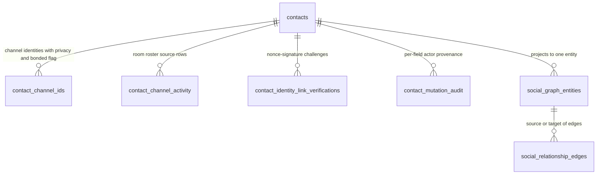
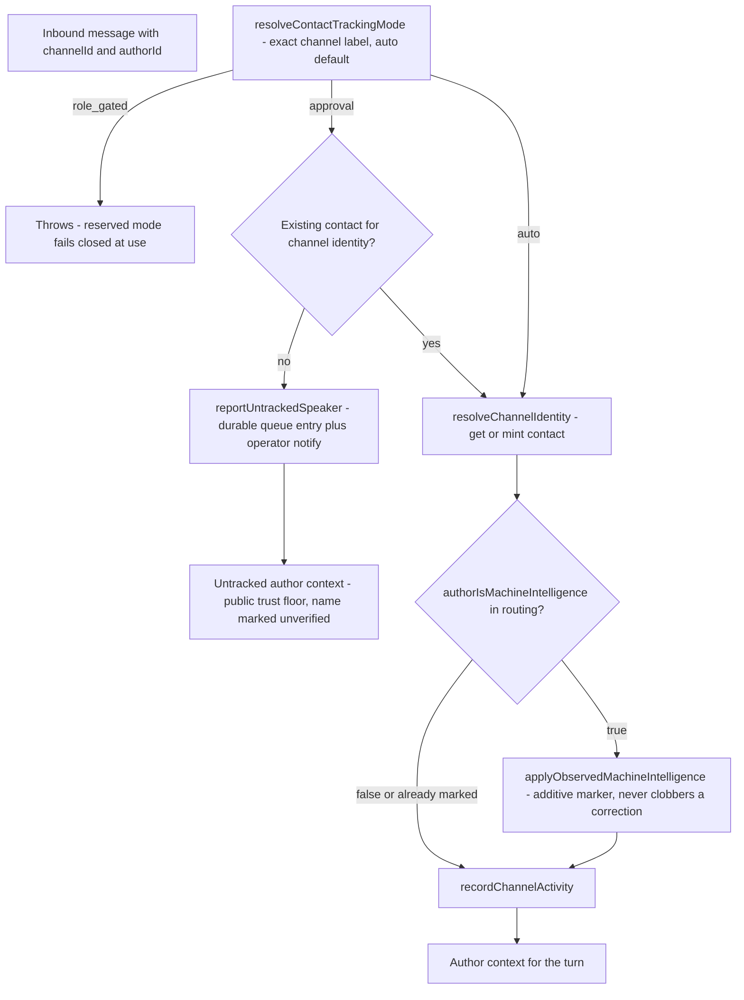
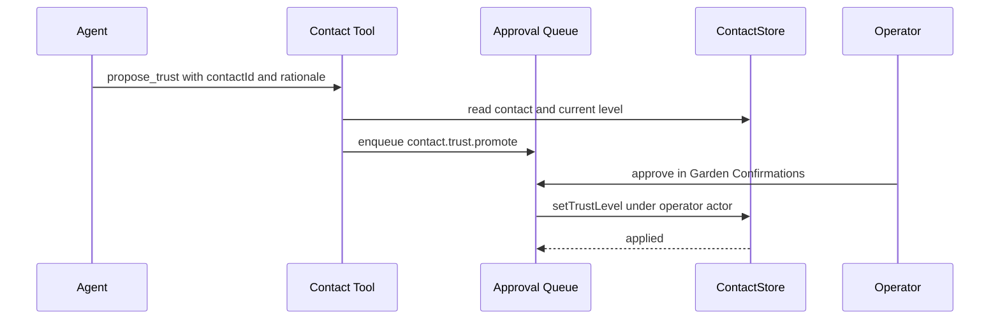
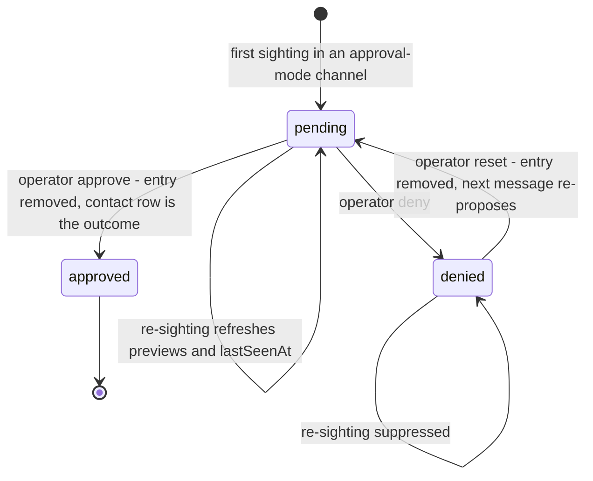

# Contacts

The contacts faculty (`src/core/contacts/`) owns the companion's durable
address book and every per-person classification that rides on it: **trust
level**, **relationship type**, **channel identities** (and the verified
identity-link challenges that corroborate them), **machine-intelligence
marking**, **emotional valence time series**, **room roster** data, and the
**social graph** projection. It also owns the operator-facing approval lanes
that keep the agent out of the system's most consequential classifications:
pending-contact approvals, trusted-tier trust promotion, and family/partner
relationship proposals, plus the authenticated **contact lifecycle saga** that
keeps fleet-level Discord authority (merge, delete, unlink, verify, reapprove,
conflict suspension) crash-safe.

The operating principle is **fail-closed**:

- unknown/invalid stored trust values decode to the `public` floor, never up;
- high-tier trust (`trusted`, `primary`) writes require manual-authorized
  actors, and `primary` can never be changed through the store;
- reserved `role_gated` tracking channels fail closed at use;
- approval-mode speakers who are not yet approved resolve at the `public`
  trust floor with a marked-unverified name and create **zero** contact rows;
- family/partner relationship transitions are operator-gated in both
  directions;
- observations (channel bot metadata, channel privacy provenance) can only
  add evidence, never override a deliberate operator/tool correction.

Related pages: [channels/overview](/openwiki/channels/overview.md) (channel
<!-- openwiki: broken internal link [/openwiki/partner-affect.md] file "/openwiki/partner-affect.md" does not exist. Fix the href or restore the target, then delete this comment. -->
labels and the gateway), [partner-affect](/openwiki/partner-affect.md) and
[emotion](/openwiki/faculties/emotion.md) (emotional evidence that feeds drift
signals), [runtime/session](/openwiki/runtime/session.md) (author-resolution
path that consumes the tracking gate), and
[cognitive-security](/openwiki/security/cognitive-security.md) (intake
screening of trust mutations and companion blocking).

## Responsibilities

| Area | Responsibility |
| --- | --- |
| Store boundary | `ContactStorePort` — the full faculty seam: CRUD, trust policy, drift, relationships, social graph, room roster, identity-link verification, lifecycle ledger, maintenance watermarks |
| Persistence | `PostgresContactStore` — production adapter built from mixin operation installers; schema ensure + ledger health assert + startup recovery in the factory |
| Author resolution | `resolveChannelIdentity` / `resolveUserId` — get-or-mint contacts from channel identities; live-only resolution (archived identities are released) |
| Model-facing tool | `contact` tool with 13 actions (list, search, lookup, note, set_trust, propose_trust, set_relationship, propose_relationship, link_identity, set_channel_privacy, set_machine_intelligence, block, unblock) |
| Trust policy | Four tiers (`public`, `regular`, `trusted`, `primary`); CAS on `trust_version`; manual-only high tier; primary immutable; low-tier drift evaluation with confirmation |
| Drift signals | Deterministic derivation from recorded valence time series + verified identity links — pure arithmetic, zero LLM calls |
| Nightly review | `ContactTrustDriftReviewLane` — scheduler-owned rest-window scan that suggests trust/relationship changes without ever mutating them |
| Relationship ladder | `stranger → acquaintance → friend → family → partner`; one classification at a time; `family`/`partner` gated behind operator approval |
| Tracking gate | Per-channel `contactTracking` mode (`auto`/`approval`/`role_gated`) from channels.json envelope labels; approval mode enqueues new speakers |
| Pending approvals | Durable file-backed queue of untracked speakers; DENY persists, APPROVE/RESET removes; operator notified once per new entry |
| Observed MI | Additive auto-tagging of machine-intelligence contacts from channel bot/app metadata; deliberate corrections never clobbered |
| Lifecycle saga | Fleet-authority merge/delete/unlink/verify/reapprove/conflict as an authenticated prepare → finalize saga with a durable ledger, leases, and startup recovery |
| Social graph | `social_graph_entities` + `social_relationship_edges` with symmetric / inverse-pair / directional classification and viewer trust-privacy filtering |
| Blocking | Companion-initiated `block`/`unblock` — system-owned reversible block list the gateway reads to drop inbound; soft/hard modes; scopes dm/group/all |

## Store architecture and data model

`ContactStorePort` (`src/core/contacts/contact-store-port.ts`) is the
faculty's boundary. It is deliberately wide: contact CRUD and identity
resolution, trust mutation and drift surfaces, relationship and social-graph
operations, emotional-baseline reads, room-roster queries, identity-link
verification, the lifecycle-ledger surface (`prepareContactLifecycleIntent`,
`recordContactLifecycleGatewayResult`, recovery claims/deferrals, diagnostics),
and per-processor maintenance watermarks used by scheduler-owned lanes.

The production implementation is `PostgresContactStore`
(`src/core/contacts/postgres-adapter/store.ts`): a class whose prototype is
extended by eight `installPostgresContact*Operations` mixin installers
(shared queries, social graph, trust policy, authority snapshot, CRUD, ledger,
recovery, mutation commit, coordinator). `createPostgresContactStore`
(`postgres-adapter/factory.ts`) creates the pool, runs `ensurePostgresContactSchema`
(the idempotent `POSTGRES_CONTACT_MIGRATIONS` statements), asserts
`assertContactLifecycleLedgerHealthy`, and — when a lifecycle gateway is wired —
runs `recoverContactLifecycleMutations` before returning, so corrupt authority
state fails store creation rather than starting degraded. The store is
Postgres-only: there is no SQLite runtime.

*Core contact tables: every per-person classification lives on the `contacts`
row or in a table keyed by it; the social graph is a separate projection.*

The `contacts` row carries `trust_level` plus a `trust_version` counter used
for compare-and-set, `relationship_type`, `is_machine_intelligence`, the
`emotional_baseline` / `emotional_time_series` JSONB columns, structured
demographics (`gender`, `pronouns`, `age`, provenance carried by audit actors),
and `archived_at` (NULL = live, ISO timestamp = archived). `contact_channel_ids`
holds per-identity `privacy_level` (provenance evidence only, per the E3.2
Context Envelope contract) and the explicit `bonded` opt-in flag;
`contact_channel_activity` is the derived room-roster source;
`contact_identity_link_verifications` records nonce/signature challenges;
`contact_mutation_audit` records per-field old/new values with the mutating
actor; `contact_maintenance_watermarks` stores per-processor last-run stamps.
All of these are created idempotently by
`POSTGRES_CONTACT_MIGRATIONS` (`src/persistence/postgres/migrations.ts`).

Read normalization is deliberately conservative: `normalizeTrustLevel`
decodes any unknown/invalid stored value to the `public` floor (never up to
`regular`, which would silently grant personal-tier disclosure), and
`normalizePrivacyLevel` decodes the retired `semi_private` vocabulary through
`decodeStoredChannelVisibility` at the read boundary. Channel keys and user
ids are normalized (`channel.trim().toLowerCase()`, trimmed userId; empty
userId throws). The optional `exportDir` mirrors contacts to JSON files after
mutations (`syncContactExports`) — best-effort only, failures are logged and
never fail the mutation.

## Message-path integration

Every inbound turn goes through author resolution in
`resolveAuthorContext` (`src/core/agent/substrate-agent/runtime-context.ts`),
which is where the tracking gate, contact minting, observed-MI marking, and
channel-activity recording meet:

*Per-message author resolution: the tracking mode is resolved outside the
resolution try/catch so a reserved mode fails loudly instead of degrading.*

Key behaviors:

- The tracking mode is resolved **outside** the resolution try/catch, so
  `role_gated` fails closed with its clear not-implemented error instead of
  being absorbed into the untracked fallback. With no gate wired, the mode
  defaults to `auto`.
- In `approval` mode, a speaker with no contact record is enqueued by
  `reportUntrackedSpeaker` and resolves as **untracked**: no contact row, no
  canonical contact key, `public` trust floor (never `regular`), and the
  self-asserted channel name rendered `name (unverified)`. A failure inside
  the gate degrades to that same untracked context with a logged warning.
- `resolveChannelIdentity` mints a new contact at the `public` trust floor
  when no identity match exists; a first message on the gateway-validated
  `companion` lane mints at `acquaintance` relationship (trust stays
  `public`). Existing contacts get `lastSeen` refreshed, their identity link
  upserted, and their social-graph entity touched.
- Observed machine-intelligence marking and `recordChannelActivity` run after
  resolution for every tracked speaker (see below).

## Model-facing contact tool

`createContactTool` (`src/core/contacts/tools.ts`) builds the `contact`
tool the model sees, with a TypeBox schema for all 13 actions. Read actions
(`list`, `search`, `lookup`) require the `identity.read` capability; every
write action (`note`, `set_trust`, `propose_trust`, `set_relationship`,
`propose_relationship`, `link_identity`, `set_channel_privacy`,
`set_machine_intelligence`, `block`, `unblock`) requires
`identity.write.runtime`; omitting `action` defaults to `list`, or to `lookup`
when only `contactId` is present. The tool is tagged irreversible (a contact
change is not a reversible surface) and is wrapped in a capability
requirement. Dependencies fail closed: `propose_trust` and
`propose_relationship` refuse to run without a wired `ApprovalQueuePort`, and
`block`/`unblock` refuse without a wired block list.

*The human-in-the-loop promotion path: the agent proposes, the operator
approves in Garden, and only the approval callback — running under a
manual-authorized actor — performs the high-tier write.*

Trust writes are additionally screened: `executeContactSetTrust` first runs
`screenSelfAuthoredMutation` through the intake-sink gating runtime, and a
held mutation returns the soft, operator-reviewed `sinkHeld` notice (not an
error, so the model does not spiral into retries). With `behaviorSignals`, the
store derives a low-tier drift suggestion; the model previews it and applies
only with `confirmSuggestion: true`. A direct `trustLevel` set of a
high-tier level fails with a manual-approval error, and `setTrustLevel` on a
`primary` contact always fails. `propose_trust` accepts only `trusted` as the
target (never `primary`, which stays owner-only), requires a rationale, and
enqueues onto the confirmation queue with method `contact.trust.promote`; the
approval callback re-validates the contactId and requested level against the
immutable proposal, then applies under `operator:confirmation-queue`.

Relationship actions follow the same pattern via `relationship-tools.ts`
(see the ladder below). `link_identity` binds a channel identity to a contact
and rejects `identity_conflict`; `set_channel_privacy` writes the
provenance-only per-link privacy label; `set_machine_intelligence` writes the
marker with a non-`system:` actor (a deliberate correction, which observations
must not clobber).

## Trust policy, CAS, and drift

Trust has four tiers: `public`, `regular`, `trusted`, `primary` (`trusted`
and `primary` are the high tier). The store enforces the guards from
`src/system/trust/policy.ts`:

- a `behavior_drift` mutation source can never touch a high tier in either
  direction;
- any high-tier write (in or out) requires a manual-authorized actor —
  `admin:`, `human:`, or `operator:` prefixes (an absent actor counts as
  manual, so a store-internal system write passes);
- the current `primary` contact can never be changed at all;
- assigning `primary` requires the target identity to be the configured
  `primaryUserId` (or explicit `allowPrimaryTrustAssignment`), and a denied
  attempt writes a `primary_denied` audit row plus a console warning.

Every trust write is a **compare-and-set on `(trust_level, trust_version)`**:
`compareAndSetExplicitTrust` bumps the version only while the persisted value
matches the authorization snapshot, so a concurrent promotion/demotion wins in
either commit order. Profile upserts use the stricter
`compareAndSetGenericUpsertTrust`, which may only mutate a low-tier value that
still matches the read snapshot and refuses `primary`/`trusted` entirely.

Low-tier drift is the only trust change the runtime may suggest. The shared
evaluator (`evaluateLowTierTrustDriftSuggestion`) proposes `public → regular`
when there are 3+ positive interactions, zero negatives, at least one verified
identity link, and consistent boundary respect; it proposes `regular → public`
defensively on 2+ negatives or boundary disrespect. All suggestions carry
`requiresConfirmation: true` and a confidence score.

`deriveTrustDriftBehaviorSignals` (`src/core/contacts/trust-drift-signals.ts`)
computes the signal inputs deterministically from evidence the runtime already
records: the per-contact emotional valence time series (fed by memory
extraction) and the verified identity-link count. Valence thresholds are
constant (`POSITIVE_INTERACTION_VALENCE_MIN = 0.15`,
`NEGATIVE_INTERACTION_VALENCE_MAX = -0.15`,
`BOUNDARY_BREACH_VALENCE_MAX = -0.4`, `SIGNAL_CONFIDENCE_MIN = 0.35`);
points below the confidence floor are ignored, and boundary respect is
falsified only by an actual breach-level point. The derivation is pure
arithmetic with zero LLM calls and never mutates trust — consumers surface
suggestions for the companion (or the nightly lane) to decide on. The
`applyLowTierTrustDriftSuggestion` store method re-checks the suggestion is
stale-safe (expected `fromTrustLevel` still current) before applying.

The emotional baseline itself (`store/emotional-baseline.ts`) is a
confidence-weighted moving average: each observation updates baseline and
mood valence with learning rates that decay as the sample count grows
(0.4 → 0.3 → 0.2 → 0.12), records `moodDrift`, and appends to a
normalized, deduplicated, capped (max 64) time series.

## Relationship ladder

Human relationship types are `stranger → acquaintance → friend → family →
partner`; `ai_companion` is a separate, non-ladder classification (see
observed MI). `evaluateRelationshipProgressionSuggestion` proposes exactly the
next step when recorded signals clear its thresholds — boundary respect is
required throughout:

| Current | Next | Requires | Approval |
| --- | --- | --- | --- |
| stranger | acquaintance | 3+ positives, ≤ 1 negative | no |
| acquaintance | friend | 12+ positives, ≤ 1 negative | no |
| friend | family | 24+ positives, 0 negatives | **yes** |
| family | partner | 48+ positives, 0 negatives | **yes** |

`family` and `partner` are approval-gated **in both directions**:
`requiresManualRelationshipMutation` returns true whenever the requested or
the current type is gated, so leaving a family/partner classification also
requires the operator (Garden contacts page). Manual mutations are authorized
only for `admin:`/`human:`/`operator:` actors.

`executeContactSetRelationship` enforces the ladder mechanically: it refuses
non-human relationships (pointing to `set_machine_intelligence`), refuses
downgrades and multi-step jumps, and — critically — derives the evidence from
**recorded** history (`getEmotionalTimeSeries` + `countVerifiedIdentityLinks`
via `deriveTrustDriftBehaviorSignals`), ignoring any caller-supplied counts.
The write itself is `compareAndSetRelationshipType`, which atomically applies
only while the persisted value still matches the read snapshot; a concurrent
change or policy denial surfaces as an error rather than a silent overwrite.
`executeContactProposeRelationship` requires a rationale and a wired
confirmation queue, enqueues the proposal with an immutable snapshot of the
behavior signals, and the approval callback refuses if the scope or evidence
changed before applying under `operator:confirmation-queue`.

## Pending contact approvals and the tracking gate

The **tracking gate** (`tracking-gate.ts`) resolves the per-channel
`contactTracking` mode from `channels.json` `contextEnvelope.channels`
labels: `auto` (default; contacts track automatically), `approval` (new
speakers enqueue for operator approval and stay untracked), and
`role_gated` (reserved; validates as config but
`assertContactTrackingModeImplemented` throws at use). Resolution is a direct
exact-channel-id label read with an `auto` default — deliberately not a
classification pipeline.

`reportUntrackedSpeaker` writes through the durable
`PendingContactApprovalStore` and notifies the operator **exactly once per new
entry**; re-sightings update the entry without re-notifying, and a denied
speaker is never re-enqueued or re-notified. Notification goes through the
gateway notification path with a system-derived sender
(`system.contacts.pending_approval`); a delivery failure is logged and does
not fail the turn — the durable queue entry is the source of truth. A coarse
`onQueueChanged` hook signals Garden queue consumers.

*Pending-contact lifecycle. `approved` is not a stored state — approval
removes the entry and mints the contact row; DENY is the only decision that
persists.*

The file-backed store (`pending-contact-approvals.ts`) persists across
restarts so DENY decisions survive, serializes mutations through an in-process
promise chain, and writes via temp-file + rename (atomic). Message previews
are capped (3 previews × 160 chars, whitespace-collapsed, from the seen
channel only — the queue never aggregates content from other channels or
DMs). A bare re-sighting only refreshes `lastSeenAt` in memory and persists
only on a material change (new preview or display-name change) — operator
decision state (status, decidedAt, firstSeenAt) is always persisted
immediately. The file is validated on load and corrupt state throws (fail
closed) rather than silently dropping operator decisions. The Garden surface
drives approve (remove entry), deny (mark `denied`), and reset (remove entry)
via the admin pending-contacts service.

## Nightly trust-drift review lane

`ContactTrustDriftReviewLane` (`trust-drift-review-lane.ts`) is
scheduler-owned nightly work that follows the sleeptime pattern: a rest-window
poll (`evaluateRestWindowEligibility` against scheduler.json
`episodicProcessing`) infers at most one action per local calendar day, keyed
by a durable per-processor watermark (`contacts.trust_drift.review`), so
restarts and repeated polls cannot double-run the review. The executor
re-checks the watermark before delivering. The lane scans every contact,
derives signals from recorded evidence, and evaluates the trust and
relationship axes **independently** — a gated or unchanged trust axis never
suppresses relationship progression. It **never mutates either field**:
applying (or declining) a suggestion stays the companion's decision through
the guarded `contact` actions; the lane's only write is the daily watermark,
advanced only after the scan and delivery succeeded so a thrown scan retries
via the action queue instead of losing the day.

The composed review (`composeTrustDriftReviewContent`) presents trust
suggestions first (with `action=set_trust`, the signals as `behaviorSignals`,
and `confirmSuggestion=true`), then relationship suggestions naming
`set_relationship` or `propose_relationship` depending on whether the step is
gated, and optionally an advisory dyad relationship reading from the emo_sim
affect model. The dyad advisory is purely advisory context — it never mutates
state, and a missing provider, missing data, or an infrastructure failure
degrades to omission (never blocks the review). The review is delivered to
the companion as a heartbeat followUp on the
`internal:reflection:contact-drift-review` channel.

## Contact lifecycle authority and recovery

Fleet-affecting contact mutations (`contact.merge`, `contact.delete`,
`contact.discord_unlink`, `contact.identity_conflict`, `contact.verify`,
`contact.reapprove`) are exactly-once **sagas** between the agent store and
the authenticated gateway (`contact-lifecycle-coordinator.ts`): a prepare
request is fenced at the gateway, the local mutation commits
(`commitLocalMutation` — merge, delete, unlink, verified-identity commit,
reapprove, or conflict suspension), then a finalize request carries the exact
`postState` back. Every intent has a deterministic RFC-4122 intent id derived
from the action and its version tokens, a locked snapshot with digest, and a
durable ledger row whose phase walks `gateway_prepare_pending →
contact_commit_pending → gateway_finalize_pending → finalized` (with
`manual_hold` and `quarantined` for unhealthy states). Replays are idempotent:
a matching pending intent is resumed rather than re-created, and a finalized
intent short-circuits. The companion id is deliberately absent from the
gateway port — it is derived from the authenticated connection, never from
contact data.

`ContactLifecycleRecoveryRuntime` runs the startup integrity check
(`assertContactLifecycleLedgerHealthy` — corrupt authority state fails store
creation) and synchronous recovery before exposure, then polls
`recoverContactLifecycleMutations` every 5s under database-owned leases
(default 30s lease, 25-batch limit, manual hold after 8 attempts) with
exponential backoff on deferral. The timer never overlaps itself and shutdown
waits for the in-flight lease batch to settle. A bounded, identity-free
diagnostics projection (`getContactLifecycleDiagnostics`) exposes pending /
over-fenced / manual-hold work to the operator.

## Archive, merge, block

Contacts are **archived, never deleted** (adjudication R10.3). `archiveContact`
preserves the row, memories, audit trail, conversation history, and a JSON
snapshot of the channel identities, while releasing the live
`contact_channel_ids` rows and `discord_user_id` so a recreated/reused
platform id mints a **new** person. The primary contact can never be archived;
a missing contact returns false; re-archiving is idempotent. Archived history
is hydrated read-only from the `channel_identities` snapshot. Merge and hard
delete exist too (`mergeContacts`, `deleteContact`), routed through the
lifecycle saga when a gateway is wired and direct otherwise.

Companion-initiated blocking (`block`/`unblock`, htm9.16) is the companion's
own escalation surface: a block resolves every known channel identity for the
contact (or a raw `channel + channelUserId` pair), writes into the
system-owned `ContactBlockListStore` that the gateway reads to drop inbound
before it reaches the agent, and is reversible. Modes are `soft` (each drop
surfaces to the operator in the cogsec tab) and `hard` (silent at the
gateway); scopes are `dm`, `group`, `all`. Blocking a `companion`-channel
identity additionally requires the gateway-owned
`ContactBlockPermitInvalidationPort` and invalidates pending initiation
permits on both sides of persistence — before the write to fence in-flight
operations, and after it to drain the pre-visibility issue window.

## Social graph

The social graph (`social_graph_entities`, `social_relationship_edges`) is a
separate projection of people (entity kind `person`, source
`contact | memory | manual | system`) and typed relationships with
sensitivity, provenance refs, evidence memory ids, and confidence.
`social-relationship-classification.ts` is the exhaustive,
compile-time-enforced classification of every `SocialRelationshipKind`:

- **symmetric** kinds (partner, friend, acquaintance, colleague, sibling,
  household, family) store one undirected row with canonical endpoint
  ordering;
- **inverse-pair** kinds (parent↔child, manager↔direct_report) store the
  written directional edge plus a linked **mirror** row sharing confidence,
  evidence, sensitivity, and provenance;
- **genuinely directional** kinds (caregiver, other) store a single row as
  written.

Edge upserts merge rather than replace: max confidence, union of provenance
and evidence refs, and the more-restrictive sensitivity. Queries filter by
viewer trust level and channel privacy, so an edge below the viewer's
visibility ceiling is never returned. `upsertSocialGraphEntityForContact`
keeps the contact projection in sync on resolution. The graph is operator/admin
surface data and future audience-scope input; it is never loaded into prompt
content.

Room roster data (E4.1) is derived entirely from `contact_channel_activity`
rows joined to owning contacts — no new modeling — and is bounded (default
page 50, max 200 roster members; 100/500 for the known-rooms listing). It is
explicitly data for operator/admin surfaces and future audience-scope
consumers, never prompt content.

## Configuration and operations

| Setting | Where | Effect |
| --- | --- | --- |
| `POSTGRES_DATABASE_URL` | agent core env | Required; the store factory fails startup without it |
| `primaryUserId` | store construction | Identifies the owner's Discord account; gates `primary` trust assignment and primary-contact protection |
| `exportDir` | `PostgresContactStoreOptions` | Best-effort JSON mirror of contacts after mutations |
| `contactLifecycleGateway` | `PostgresContactStoreOptions` | When wired, all fleet-authority mutations become authenticated sagas and startup recovery runs |
| `schema` / `role` / `pool` | `PostgresContactStoreOptions` | Per-companion Postgres schema pinning and pool injection |
| `channels.json` `contextEnvelope.channels[].contactTracking` | channels config | Per-channel `auto` / `approval` / `role_gated` tracking mode |
| scheduler.json `episodicProcessing` rest-window | scheduler config | Required by `ContactTrustDriftReviewLane`; missing config fails lane construction |
| pending-approvals file path | agent main | Durable pending-contact queue under the companion data dir |

The agent main (`src/app/agent/main.ts`) composes the gate: the file-backed
pending store, the gateway notification closure (`system.contacts.pending_approval`,
priority 4, pointing the operator at `/contact-approvals`), and the Garden
queue-changed event. The runtime wiring (`runtime-wiring.ts`) assigns the
store, bootstraps primary identity links when a Partner is configured,
and registers the `contact` tool.

## Focused tests

- `tracking-gate.test.ts` — mode resolution defaults, exact-label reads,
  `role_gated` fail-closed (AC4), enqueue-once/notify-once, no re-enqueue for
  denied speakers, durable entry on notification failure.
- `contact-tracking-approval-flow.test.ts` — end-to-end AC1: approval-room
  speakers stay untracked at the `public` floor with marked-unverified names,
  zero contact rows until approval, and resolve normally after approval
  through the standard upsert path; auto rooms behave identically to no gate.
- `pending-contact-approvals.test.ts` — preview truncation/capping, denied
  immutability, reset re-proposal, persist-on-material-change.
- `observed-machine-intelligence.test.ts` — additive marking, already-marked
  no-op, operator-override preservation, store-error degradation.
- `relationship-progression.test.ts` — ladder thresholds, approval gating,
  boundary-respect requirement.
- `trust-drift-signals.test.ts` — valence/confidence thresholds and
  conservative derivation.
- `trust-drift-review-lane.test.ts` — construction fail-closed, rest-window
  and watermark once-per-day semantics, never-mutates, dyad-advisory
  fail-soft.
- `tools.test.ts` / `contact-block-tool.test.ts` — action routing, capability
  requirements, block/unblock target resolution and permit invalidation.
- `store.test.ts`, `postgres-adapter.test.ts`,
  `postgres-adapter.integration.test.ts` — store semantics against the
  adapter, including trust CAS and lifecycle ledger behavior.
- `social-graph.test.ts`, `social-relationship-classification.test.ts`,
  `social-graph-consistency.test.ts` — mirror rows, endpoint ordering,
  involutive inverse classification, viewer filtering.
- `room-roster.test.ts` — bounded roster/known-rooms queries.
- `runtime-wiring.test.ts` — tool registration and primary-link bootstrap.
- `contact-lifecycle-recovery-runtime.test.ts` and the
  `postgres-adapter/contact-lifecycle-*.integration.test.ts` suite — saga
  phases, leases, deferral backoff, and startup health checks.
