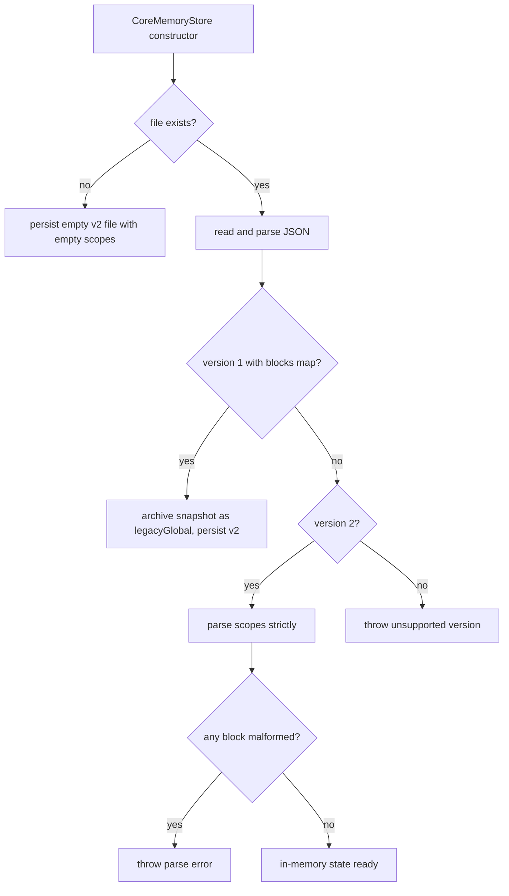
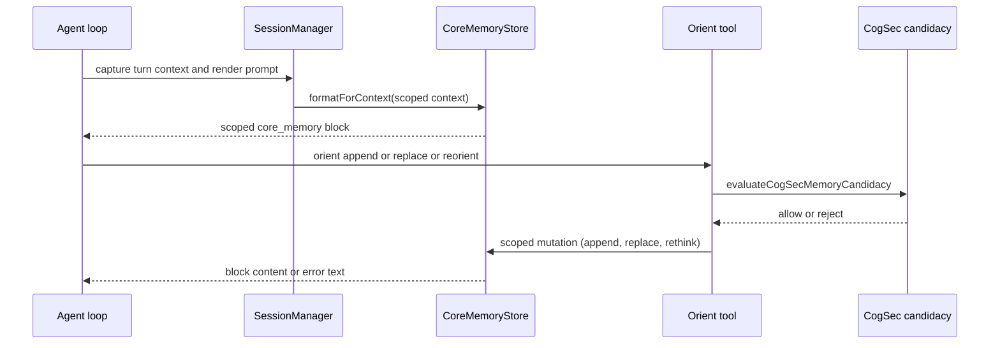

# Core Memory

The core-memory faculty (`src/faculties/core-memory/`) is the small,
high-trust store of the companion's **scoped continuity state**: per-channel
`persona` (local continuity), `human` (participant or room context), and
`goals` (continuity commitments) blocks that survive restarts and are injected
into the model's prompt on every turn. It is deliberately distinct from the
durable typed memory faculty (`memory` tool): core memory is bounded,
always-rendered, session-stable continuity, while durable facts belong in
`memory`, values in the values journal, long-horizon intent in `north_star`,
and persona layers in `identity`.

The faculty is disk-backed and **fail-closed**:

- every block write is bounded by a `maxChars` cap and normalized before
  persistence;
- writes from the agent go through the unified `orient` tool, which runs a
  CogSec candidacy gate before any store mutation and resolves the target
  scope from the current turn's channel context;
- the store parses persisted files strictly on construction — malformed or
  unsupported content throws instead of degrading;
- legacy pre-scoped snapshots are archived under `legacyGlobal` and are never
  injected into scoped prompt context;
- the scope audit reports (never migrates) rows that would miss their scoped
  binding.

Related pages: [north-star-and-values](/openwiki/faculties/north-star-and-values.md)
(long-horizon intent, which orient deliberately does not own),
[memory/overview](/openwiki/memory/overview.md) and
[memory/l2-typed](/openwiki/memory/l2-typed.md) (durable typed memory, the
other side of the orient-vs-memory boundary), and
[runtime/identity](/openwiki/runtime/identity.md) (persona layers, which
orient must not redefine).

## Responsibilities

| Area | Responsibility |
| --- | --- |
| Store boundary | `CoreMemoryStore` (`src/faculties/core-memory/store.ts`) — disk-backed JSON store with per-scope snapshots; `CoreMemoryStorePort` (`src/faculties/memory/memory-store-port.ts`) is the runtime seam |
| Blocks | Three labels per scope: `persona` (max 2400 chars), `human` (max 2400 chars, `trustLevel: 'trusted'`), `goals` (max 1600 chars) |
| Scoping | Canonical channel scope key `channel:<channelId>`; scope descriptors carry DM/group and participant/room metadata; `channel:default` fallback |
| Mutations | `append` (keep newest tail), `replace` (keep head), `rethink` (atomic rewrite of all three blocks in one snapshot) |
| Goals hygiene | Strip orient-log timestamps, drop bare timestamp lines, dedupe, keep semantic tails — applied on write and on load |
| Prompt rendering | `formatForContext` renders the scoped `<core_memory>` XML block used by the turn and compaction paths |
| Agent tool | `orient` (`createOrientTool`) — 13 actions multiplexing block edits, values journal, concern ledger, and introspection consent |
| Write screening | CogSec candidacy gate on every orient block write; rejected text never reaches the store |
| Startup hydration | `hydrateStartupActiveCoreMemoryBlocks` warms scoped blocks for recently active channels at boot |
| Scope audit | `auditCoreMemoryScopes` reports legacy or non-canonical scope rows; read-only, operator-facing CLI |

## Store architecture and data model

`CoreMemoryStore` (`src/faculties/core-memory/store.ts#L589-L810`) owns a
single JSON file at `resolveCoreMemoryPath(companionDataDir)` — by default
`companion-data/state/core_memory.json` (`src/persistence/layout.ts#L700-L702`)
— and persists every mutation through `writeJsonAtomic`, so a crash cannot
leave a half-written file. The constructor takes an optional `now` clock for
deterministic tests.

The persisted file is version 2 (`CORE_MEMORY_FILE_VERSION`); each block
snapshot is version 1 (`CORE_MEMORY_BLOCK_VERSION`). Its shape
(`ScopedCoreMemoryFile`, `store.ts#L314-L330`) is:

```json
{
  "version": 2,
  "updatedAt": "2026-07-01T00:00:00.000Z",
  "scopes": {
    "channel:discord:room-1": {
      "scope": { "kind": "channel", "key": "channel:discord:room-1", "channelId": "discord:room-1" },
      "updatedAt": "2026-07-01T00:00:00.000Z",
      "blocks": {
        "persona": { "label": "persona", "content": "...", "maxChars": 2400 },
        "human": { "label": "human", "content": "...", "maxChars": 2400, "trustLevel": "trusted" },
        "goals": { "label": "goals", "content": "...", "maxChars": 1600 }
      }
    }
  }
}
```

`legacyGlobal` is an optional archived snapshot (`archivedAt` + version-1
snapshot) kept for migration history; it is never rendered.



*Store load/initialize decision path: missing files initialize, version-1 files migrate into the legacy archive, and anything malformed fails construction.*

Parsing is deliberately strict (`parseScopedFile`, `parseScopedRecord`,
`parseBlock`, `parseSnapshot`): unknown block labels, label mismatches,
non-string content, content over `maxChars`, missing `updatedAt`, scope-key
mismatches, and unsupported versions all throw, so a corrupted file surfaces
at startup rather than silently truncating the companion's continuity
(`store.test.ts#L211-L216`). Reads that hit a missing scope lazily create and
persist an empty default snapshot (`getOrCreateScopedSnapshot`,
`store.ts#L752-L760`).

## Scoping rules

Every snapshot belongs to exactly one scope, described by a
`CoreMemoryScopeDescriptor` (`store.ts#L29-L39`):

- `kind: 'channel'` scopes carry the canonical key `channel:<channelId>`,
  where `channelId` is whitespace-normalized (trimmed, runs collapsed to a
  single space) — `expectedChannelKey` in the auditor uses the same
  derivation (`scope-audit.ts#L32-L34`);
- `kind: 'legacy_global'` scopes are the pre-scoped legacy form, key
  `legacy:global`; the store resolves any descriptor with that kind to that
  key and never treats it as a channel binding;
- `channel:default` is the fallback scope when no scope is supplied
  (`store.ts#L403-L409`).

`coreMemoryChannelScope` (`store.ts#L391-L401`) is the canonical factory for
channel scopes and carries optional DM/group metadata: `isDirectMessage`,
`participantId`, `participantName`, `roomName`, `participantCount`, and
`activeParticipantNames` (sanitized, deduped, capped at 5 —
`store.ts#L336-L349`). `resolveScopeDescriptor` (`store.ts#L411-L434`)
accepts a descriptor or a bare channel-id string; `resolveFormatScope`
additionally merges per-call context overrides onto the stored descriptor for
rendering.

Channel-scoped orientation is fully isolated: two channels never share
blocks, and group vs DM scopes render differently (`store.test.ts#L172-L209`).

## Prompt rendering

`formatForContext` (`store.ts#L673-L732`) is the single read path the runtime
uses — the turn pipeline, compaction, and startup hydration all render
through it. Given a scope it returns `''` when no scoped record exists or no
block has content; otherwise it emits a `<core_memory>` element with
`scope_kind`, `scope_key`, and `channel_id` attributes (values escaped via
`escapeXmlAttribute`):

- DM scope → `<participant_context name="..." id="...">` wrapping the
  `human` block (or the literal `(empty)`);
- group scope → `<room_context name="..." participant_count="..."
  active_participants="...">` wrapping the `human` block (or `(empty)`);
- non-empty `persona` → `<local_continuity>`; non-empty `goals` →
  `<continuity_goals>`.

The prompt-provenance registry labels this block `core_memory` with producer
`core-memory.store`, `scopeClass: 'dm'`, and `volatility: 'session_stable'`
(`src/core/identity/prompt-section-provenance.ts#L47`). `SessionManager`
builds the format context from the resolved `ConversationScope`: DM binding
uses the single contact, while group scope is **never** a single-person
binding — it renders room identity plus up to five recently active speaker
names (`src/core/session/manager.ts#L1991-L2001`).

## Mutations and normalization

Three mutation entry points exist on the store (`store.ts#L608-L671`):

- `append` trims and merges text with a separator (default newline) and
  **keeps the newest tail** when the result exceeds `maxChars`
  (`normalizeTruncateTail`);
- `replace` normalizes and **keeps the head** (`normalizeTruncateHead`);
- `rethink` rewrites all three blocks from one input in a single snapshot and
  persists one atomic write — the companion's periodic reorientation.

The `goals` block gets extra hygiene on both write and load
(`normalizeDurableGoalsContent`, `store.ts#L155-L204`): orient-log lines
matching `matrix orient` / `orient` / `orientation log` prefixes are stripped
to their semantic tails, bare timestamp-only lines are dropped, and remaining
lines are deduped case-insensitively. This is what keeps nightly orient-log
noise out of durable goals (`store.test.ts#L72-L104`). `append` therefore
reports a **no-durable-change** error when normalization collapses the
appended text away (`tools.ts#L636-L646`, `tools.test.ts#L253-L275`).

## Orient tool

`createOrientTool` (`src/faculties/core-memory/tools.ts#L223-L724`) builds
the unified `orient` `SubstrateAgentTool` whose description comes from the
canonical tool-surface contract (`CANONICAL_TOOL_SURFACE_DESCRIPTIONS.orient`,
`src/core/agent/tool-surface/descriptions/continuity-contracts.ts#L31-L51`).
It multiplexes four authoritative stores: core-memory blocks, the global
values journal, the companion concern ledger, and the introspection consent
policy — the action set is `append`, `replace`, `reorient`, `values_list`,
`values_add`, `values_update`, `create_concern`, `list_concerns`,
`resolve_concern`, `transition_concern`, `introspection_consent_get`,
`introspection_consent_set`, and `introspection_turn_sensitivity_set`
(`tools.ts#L59-L74`).



*Turn-time read path (top) and the CogSec-gated orient write path (bottom); both resolve the same canonical channel scope.*

Block-writing actions (`append`, `replace`, `reorient`) resolve the target
scope from the **current request context**: `getRequestContext()` must expose
a non-empty `channelId` (plus `viewerIsDirectMessage` when present) or the
tool errors with "orient requires current channel context" before touching
the store (`tools.ts#L210-L221`, `tools.test.ts#L212-L228`). Every write is
screened by `validateOrientCandidacy`, which calls
`evaluateCogSecMemoryCandidacy` with `type: 'reflection'`, tags
`['orient', context]`, and `sourceType: 'tool_write'`; any non-`allow`
disposition rejects the write and the store is never called
(`tools.ts#L199-L208`, `tools.test.ts#L371-L395`). `reorient` requires all
three of `persona`, `human`, `goals` as complete replacement strings.

The concern actions reuse the intention-faculty executors
(`executeCreateConcernAction`, `executeListConcernsAction`) and the concern
store's resolve/transition API: `resolve_concern` accepts `concernId` or
`concernIds`, dedupes, reports missing ids as an error payload, snapshots the
agent's live VAD via the optional `resolutionVadProvider` when a terminal
resolution happens, and emits concern-resolution appraisal events on the
event bus (vw3w.1, `tools.ts#L502-L550`). `transition_concern` does the same
for transitions into a terminal status (`tools.ts#L552-L610`). The
introspection actions require an active foreground companion turn
(`turnId` + `requestId`, background `callType` rejected) because they mutate
explicit consent policy (`tools.ts#L382-L441`).

Two governance details keep the surface honest: the agent-managed concern
`status` enum excludes the internal `candidate` state
(`tools.ts#L55-L58`), and model-facing prose avoids worry-word vocabulary
while preserving the lifecycle action names (`tools.test.ts#L170-L196`).
Subagent and shard tool governance share one p0le orient policy: reads
(`values_list`, `list_concerns`, `introspection_consent_get`) pass through,
every orient mutation is denied and audit-trailed
(`src/faculties/subagents/tool-governance.ts#L66-L85`,
`src/faculties/shards/tool-governance.ts#L21-L44`).

## Startup hydration

`hydrateStartupActiveCoreMemoryBlocks` (`src/faculties/core-memory/startup-hydration.ts#L40-L78`)
is a read-only, synchronous warm-up pass: it takes up to
`recentSessionLimit` (default 8) recent sessions from the session manager,
dedupes by channel id, skips retired/quarantined sessions, and renders each
channel's active block through `renderActiveCoreMemoryBlock` — the same read
path a turn uses — recording `attempted`/`hydrated` counts and a `degraded`
list of per-channel errors. It never mutates core memory.

`SessionManager.renderActiveCoreMemoryBlock` (`src/core/session/manager.ts#L2004-L2038`)
resolves the persisted session state for a channel (last Partner turn's
`authorId`, and `channelVisibility === 'private'` as the authoritative DM
signal), derives the `ConversationScope`, and calls `formatForContext` — so
the first post-restart prompt carries a populated, correctly-bound scoped
block while async memory (sleeptime/orient) catches up.

The pass is wired through `hydrateStartupContinuity`
(`src/app/agent/startup-continuity.ts#L38-L69`), which runs active-memory,
core-memory, and wiki hydration together. Degraded **core-memory** hydration
is **fatal to startup** (it throws
`Startup continuity hydration failed: active core memory [...]` together with
active-memory failures), while wiki hydration is explicitly best-effort and
non-fatal (mmo9.7.4). `startup-continuity.test.ts#L124-L158` pins the fatal
behavior.

## Scope audit

`auditCoreMemoryScopes` (`src/faculties/core-memory/scope-audit.ts#L40-L125`)
is a pure, never-throwing auditor over an already-parsed file object. It
returns the file version, scope count, the list of canonical
`channel:<channelId>` keys, and issues of six kinds:
`legacy_single_snapshot_file` (version-1 file with no scope binding),
`archived_legacy_global`, `legacy_global_scope`, `scope_key_mismatch` (map
key differs from the descriptor key), `noncanonical_channel_key` (map key is
not the canonical derivation for its `channelId`), and `unreadable_scope`
(structural problems). It performs **no migration or mutation**.

The operator surface is the maintenance CLI `npm run
audit:core-memory-scopes` (`src/app/maintenance/audit-core-memory-scopes.ts`):
`--file <path>` overrides the default `companion-data/state/core_memory.json`,
`--json` emits the full report, and the process exits 1 when any issue is
found — a signal that a channel would miss its scoped core-memory binding.

## Runtime wiring

`wireCoreMemoryRuntime` (`src/app/startup/composition/composition.ts#L548-L572`)
composes the faculty at startup: it constructs the disk-backed
`CoreMemoryStore` at `resolveCoreMemoryPath(companionDataDir)`, wraps it in
`createCoreMemoryStorePort` (the `CoreMemoryStorePort` seam,
`src/faculties/memory/memory-store-port.ts#L745-L756` and `L890-L898`), hands
it to the session manager via `setCoreMemoryProvider`, and registers the
`orient` tool on the agent loop with the values journal, concern store,
introspection consent stores, event bus, and a `resolutionVadProvider` built
from `resolveCurrentInternalStateConcernVAD`. The sleeptime agent consumes
the store through a narrower `Pick<CoreMemoryStorePort, 'getSnapshot' |
'rethink'>` `CoreMemoryRewriter` seam.

## Nightly orient rewrite

The heaviest background consumer is the sleeptime orientation rewrite,
gated deterministically (jpvd.4): `OrientationRewriteGateConfig`
(`src/system/config/scheduler-config/sleep-memory.ts#L43-L68`) opens the
`orientation_rewrite` lane only on evidence of change — at least
`minNewEntriesSinceRewrite` (default 4) new entries since the last rewrite,
OR any new activity once `refreshAfterQuietDays` (default 7) has passed.
Skipping is the common case and costs zero LLM spend (`src/faculties/memory/sleeptime-agent.ts#L80-L97`).

## Invariants and failure semantics

- **Boundedness**: every persisted block content is ≤ its `maxChars`; reads
  of an over-limit persisted file throw rather than truncate silently.
- **Scoped isolation**: mutations target exactly one canonical scope key;
  legacy-global content is archived and never rendered into a channel
  context.
- **Atomicity**: every mutation rewrites the whole file via `writeJsonAtomic`
  and only then swaps in-memory state (`writeSnapshot`, `store.ts#L762-L774`).
- **Fail-closed writes**: orient block writes are CogSec-screened and require
  live channel context; values/concern/consent actions fail with explicit
  "not wired" errors when their stores are absent; missing concern ids are
  reported, not silently dropped.
- **Startup honesty**: malformed store files fail construction, and degraded
  startup core-memory hydration aborts startup so operators see it.
- **Report-only audit**: the scope auditor can flag problems but never
  migrates data by itself.

## Focused tests

- `store.test.ts` — initialization and persistence, append tail-cap, goals
  log rejection/summarization, replace head-cap, atomic rethink, legacy
  archive (v1 → v2, never injected into context), DM vs group scope
  isolation and rendering, malformed-file failure.
- `tools.test.ts` — canonical description, prose gentleness vs action names,
  candidate-status exclusion, scoped append/replace/reorient, empty-text and
  no-durable-change errors, CogSec rejection before store touch, values and
  concern routing, introspection consent rules.
- `scope-audit.test.ts` — clean scoped files, version-1 flagging, legacy
  global flags, non-canonical keys and descriptor mismatches.
- `startup-continuity.test.ts` — hydration of active channels and the fatal
  degradation path.
- `group-chat-regression.test.ts` — the real scoped `CoreMemoryStore` behind
  the group harness keeps the group core-memory binding stable (E1.2) and
  hydrates scoped blocks after a simulated restart.
