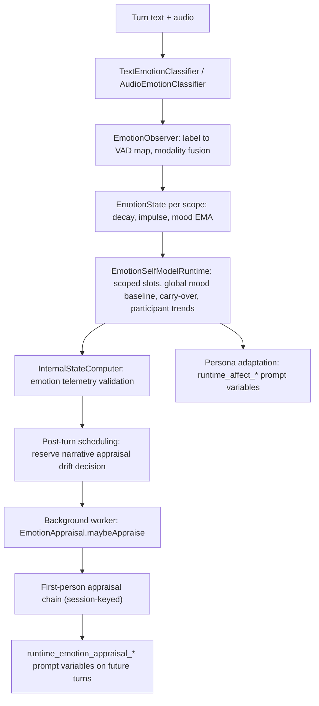
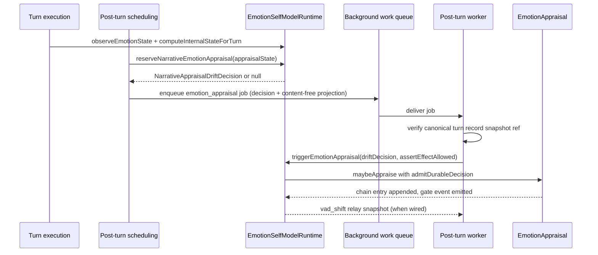

# Emotion

The emotion faculty (`src/core/emotion/`) is the companion's **self-affect**
pipeline: how observed text and audio become a numeric emotion state, how that
state is scoped per conversation and modulated by a companion-global mood
baseline, how a first-person narrative appraisal is scheduled when emotion moves
significantly, and how the whole result is shaped into persona-affect prompt
variables. It is the behavioral companion-affect surface and is deliberately
separate from the **Partner Affect shadow foundation** (the inspection-only
record of partner Signal Observations), which lives in the same directory tree
but is covered by [partner-affect](/openwiki/faculties/partner-affect.md) and
must never feed prompts, appraisal, memory candidacy, or scheduling.

The faculty's runtime owner is `EmotionSelfModelRuntime`
(`src/core/agent/substrate-agent/emotion-self-model-runtime.ts`), which wires
together `EmotionState`, `EmotionObserver`, `EmotionAppraisal`, scoped-emotion
state, participant trends, and the internal-state projection consumed by
post-turn background work.

## Responsibilities

| Area | Responsibility |
| --- | --- |
| Numeric state | `EmotionState` (`src/core/emotion/state.ts`) — VAD (valence/arousal/dominance in [-1,1]), discrete emotions in [0,1], confidence, and a slow mood EMA; exponential half-life decay, observation impulses, concern-resolution deltas |
| Observation | `EmotionObserver` (`src/core/emotion/observer.ts`) — classifies text, maps labels to VAD, fuses text+audio modality observations, produces the `EmotionObservation` that updates state |
| Text classifier | `TextEmotionClassifier` (`src/core/emotion/text-classifier.ts`) — HuggingFace Transformers text-classification pipeline, lazy init, top-28 scoring |
| Audio classifier | `AudioEmotionClassifier` (`src/core/emotion/audio-classifier.ts`) — sherpa-onnx SenseVoice offline recognizer producing emotion and event tags; env-configured, shared singleton |
| Deterministic lexicon | `src/core/emotion/vad-lexicon.ts` — NRC VAD lexicon loading/scoring; standalone deterministic signal |
| Telemetry integrity | `src/core/emotion/telemetry-validation.ts` — trusted/uncertain/suppressed validation, provenance normalization, intra-discrete conflict detection; `src/core/emotion/discrepancy.ts` — cross-family divergence surfacing |
| Scoping | `src/core/emotion/scoped-emotion.ts` (bead E1.5) — per-scope transient state, companion-global mood baseline, directional group→DM carry-over modifier |
| Participant trends | `src/core/emotion/participant-trends.ts` + `participant-trend-persistence.ts` (bead E6.3) — per-participant slow EMA trend lines inside group rooms, persisted for restart survival |
| Narrative appraisal | `EmotionAppraisal` (`src/core/emotion/appraisal.ts`) — drift-gated, LLM-written first-person chain-of-emotion entries; content-free durable projection in `appraisal-state.ts` and `narrative-appraisal-drift.ts` |
| Persona adaptation | `src/core/emotion/persona-adaptation.ts` — trust-gated honne/tatemae affect behavior and `runtime_affect_*` prompt variables |
| Persistence | `src/core/emotion/session-metadata.ts` — emotion snapshots embedded in session-message metadata; `participant-trend-persistence.ts` for room trends |
| Calibration contract | `src/core/emotion/calibration.ts` — JSON-schema contract for per-model-family emotion-axis calibration tables consumed by eval tooling |
| Other contracts | `src/core/emotion/acac.ts` (ACAC self-report normalization + schema), `relay-emotion-snapshot.ts` (axis scores only for the companion emotion relay) |

## Data flow

Caption: the companion self-affect pipeline from classifier observation to
prompt variables, with the drift-gated narrative appraisal running on the
durable post-turn background path.

## Core state: `EmotionState`

`EmotionState` (`src/core/emotion/state.ts#L43-L198`) is the numeric heart of
the faculty. A snapshot (`EmotionStateSnapshot`, defined in
`src/shared/contracts/emotion-contracts.ts`) has four parts:

- `vad`: valence/arousal/dominance, each clamped to [-1, 1];
- `mood`: the same three axes, an EMA of `vad` (default `moodAlpha` 0.1) that is
  the slow "settled baseline" distinct from the momentary reading;
- `discrete`: lower-cased emotion-label scores in [0, 1] (e.g. joy, anger,
  sadness, surprise, love), pruned at epsilon 1e-4;
- `confidence`: a signal-quality estimate in [0, 1], EMA-updated with
  `confidenceAlpha` 0.25 toward each observation's confidence (default 0.7 when
  an observation carries none).

`update(observation, elapsedSeconds)` runs the fixed cycle **decay → impulse →
mood EMA**. Exponential half-life decay is applied first to every VAD axis and
discrete label; then the observation's VAD impulse (signed, scaled by the
signal weight) and discrete impulses are added; then the mood EMA pulls toward
the new VAD. Default half-lives are per-axis (valence 30 min, arousal 20 min,
dominance 45 min) and per-label for the research set (joy 30 min, anger 45 min,
sadness 60 min, surprise 5 min, love 2 h), with a 30-minute default for other
labels; all are configurable via `EmotionStateConfig`. `elapsedSeconds` must be
a finite non-negative number or `update` throws a `RangeError`.

`applyConcernResolutionDelta(generationId, delta)`
(`src/core/emotion/state.ts#L111-L123`) applies a signed resolution appraisal
(a VAD delta with confidence 1) **once per immutable generation**: a duplicate
generation id returns `false` and an empty id throws. This is the emotion side
of the concern-resolution arc: when a concern is resolved,
`concern-resolution-arc.ts` emits a relief delta that the runtime sinks into
the active DM scope, deferring it when that scope is not currently active
(`emotion-self-model-runtime.ts#L729-L761`).

## Observation pipeline

`EmotionObserver` (`src/core/emotion/observer.ts#L122-L201`) turns text into an
`EmotionObservation`. `observe(text, elapsedSeconds)` classifies the text, maps
the strongest classification to a canonical label and a fixed VAD vector, and
updates the wrapped `EmotionState`; it also returns the fused discrete label and
confidence.

Key behaviors:

- The **label→VAD map** (`observer.ts#L54-L77`) is a fixed 13-label table
  (anger, anticipation, confusion, disgust, fear, joy, love, neutral, optimism,
  pessimism, sadness, surprise, trust). A **17-entry alias map**
  (`observer.ts#L79-L98`) canonicalizes richer GoEmotion-style labels
  (admiration→trust, amusement→joy, caring→love, grief→sadness, …). Unknown
  labels throw; the classifier must return at least one classification or
  `buildObservation` throws.
- The strongest classification is chosen by score, ties broken
  lexicographically; its VAD, a `discrete: { label: 1 }` entry, and its
  confidence form the observation. An all-zero-confidence result yields `{}` —
  a no-signal observation.
- **Modality fusion** (`observer.ts#L254-L306`): text and (when configured)
  audio observations are merged by confidence-weighted averaging of the VAD
  axes; the strongest categorical label (highest confidence, tie-broken
  lexicographically) becomes the discrete entry; confidence is the maximum.
  Fusion throws if no modality carries positive confidence or no VAD signal.
- `observe` truncates text to `maxTextLength` (default 2000 chars) and rejects
  empty input.

`TextEmotionClassifier` (`src/core/emotion/text-classifier.ts#L47-L100`) wraps
a HuggingFace Transformers `text-classification` pipeline: lazy single-flight
initialization (`initPromise`), `top_k: 28`, output rows normalized and sorted
by score (ties lexicographic), dtype restricted to the
`TEXT_EMOTION_DTYPE_VALUES` enum (auto, fp32, fp16, q8, int8, uint8, q4, bnb4,
q4f16), and `preload()` warmup that fails closed on error. The default pipeline
factory sets `env.cacheDir` when configured.

`AudioEmotionClassifier` (`src/core/emotion/audio-classifier.ts#L132-L196`) is
a sherpa-onnx `OfflineRecognizer` with the SenseVoice model: PCM16-LE buffers
are converted to Float32, decoded, and the SenseVoice `emotion`/`event` tags are
mapped to canonical labels (angry→anger, happy→joy, …) and events
(applause, bgm, breath, cough, cry, laughter, sneeze, speech).
`toAudioEmotionSignal` (`audio-classifier.ts#L226-L311`) picks the strongest
emotion label, attaches its VAD (only for the seven labels in
`AUDIO_EMOTION_LABEL_VAD_MAP`), collects unique sorted events, and returns an
empty observation when nothing clears epsilon. Model paths are required at use
time: `EMOTION_AUDIO_SENSE_VOICE_MODEL_PATH` and
`EMOTION_AUDIO_SENSE_VOICE_TOKENS_PATH` (plus language/provider/numThreads/
featureDim/useInverseTextNormalization env vars), and the optional
`sherpa-onnx-node` dependency must be installed or classification throws a
specific install error. `getSharedAudioEmotionClassifier()` builds a process
singleton from env; app bootstrap wires it into the observer.

`src/core/emotion/vad-lexicon.ts` loads the NRC VAD lexicon
(`nrc-vad-lexicon-v2.tsv` under the system data dir, overridable with
`NRC_VAD_LEXICON_PATH`), tokenizes text, and scores token-average VAD with a
neutral fallback when nothing matches; loading is cached and can be cleared.
The `EmotionObserverConfig.vadLexicon` field is accepted today but the
classification path does not yet consume it — the lexicon is a standalone
deterministic signal available to callers.

## Telemetry integrity: validation and divergence

`validateEmotionTelemetry` (`src/core/emotion/telemetry-validation.ts#L103-L175`)
grades an emotion snapshot as `trusted`, `uncertain`, or `suppressed` from a
reasons set (`missing_signal`, `missing_provenance`, `low_confidence`,
`conflicting_signal`, `stale_signal`). Trusted requires no reasons and
confidence ≥ 0.6 (default); missing signal or low confidence is immediately
`suppressed`. The effective snapshot is weighted (1 / 0.25 / 0) so an
untrusted signal's VAD is scaled down and its discrete distribution emptied —
downstream consumers cannot act on a full-strength untrusted reading. The
provenance normalizer is exported and reused by the partner-affect shadow
observation guard so both boundaries share one vocabulary.

The module also owns the shared **discrete polarity taxonomy**
(`discreteAffectPolarity`, `telemetry-validation.ts#L90-L101`) and the
**intra-discrete conflict detector** (positive and negative labels both ≥ 0.35).

`detectEmotionDiscrepancies` (`src/core/emotion/discrepancy.ts#L103-L152`)
surfaces **cross-family** divergence as surfaced data, never forced coherent:
`valence_vs_discrete` (VAD valence opposed by a strong discrete label),
`momentary_vs_mood` (momentary VAD split from the slow mood EMA), and
`self_report_vs_classifier` (ACAC connection self-report against classifier
valence). Each side keeps its own value, confidence, and provenance. The whole
detector is gated on the telemetry validation status being `trusted` — a
divergence built on a suppressed signal is itself suppressed.

## Scoped emotion and the global mood baseline (E1.5)

`src/core/emotion/scoped-emotion.ts` implements the operator-ratified scoping
model: per-scope transient `EmotionState` keyed by `ConversationScope.key`
(`dm:<contactId>` | `room:<channelId>`), a **separate companion-global mood
baseline** that scope moods modulate via EMA and that seeds freshly-observed
scopes, and a **directional carry-over modifier** applied additively on top of a
scope's snapshot. `EmotionSelfModelRuntime` owns the runtime half
(`emotion-self-model-runtime.ts#L293-L356` and `L634-L809`).

Direction rules for carry-over:

- group → DM: allowed only when the DM contact is a member of that group
  (`isDmContactGroupMember`, checked against the group's recent-speaker roster
  or the contact's room membership);
- DM → group, group → group, DM → DM: never.

The modifier is bounded per-axis, decays with a config half-life (default 180 s),
and is dropped once below `minEffectThreshold`. It nudges only the transient
`vad` of the snapshot returned to the caller — stored `EmotionState` is never
mutated by it (`applyCarryOverToSnapshot`). Each scope's mood pulls the global
baseline a little (`blendGlobalMoodBaseline`, default alpha 0.05), so "her
mood" stays one coherent thing that survives per-scope state.

## Participant trends (E6.3)

Inside group rooms, `EmotionSelfModelRuntime` accumulates a **slow EMA trend
line per participant**, fed only by that participant's own messages and reusing
the exact observation the scoped layer already computed for the turn — zero
extra classifier or LLM calls (`emotion-self-model-runtime.ts#L877-L935`;
pure arithmetic in `participant-trends.ts`). Idle participants never appear in
a turn's author slot, so their trend never moves. Discrete labels are
EMA-blended with decay-toward-zero and pruned below 1e-3, capped at 16 labels.

Two consumption gates matter:

- `participantMovementIsMeaningful` requires both a minimum interaction volume
  (default 3) and a minimum VAD displacement (default 0.1) before a trend may
  move orientation — a single sentence or barely-nonzero drift never counts;
- `maintainRoomTrends` enforces the per-room participant cap (default 16) and
  stale eviction (default 14 days), evicting least-recently-updated first.

Trends are persisted through `ParticipantTrendStorePort`
(`participant-trend-persistence.ts`) so a room's orientation survives restart;
the runtime hydrates lazily per room on first touch and deletes evicted trends
from the store too. When `carryOverUsesParticipantTrend` is enabled, the
group→DM carry-over sources from the DM contact's own meaningful trend in that
room instead of the room aggregate.

## Narrative appraisal (E2.6): drift gate and the chain

`EmotionAppraisal` (`src/core/emotion/appraisal.ts#L359-L433`) writes the
companion's private first-person chain-of-emotion entries. It is **drift-only**:
the mode (`drift_only` or `disabled`, default `drift_only`) admits a narrative
appraisal only when the maximum absolute VAD-axis movement from the last
appraised snapshot crosses `vadDeltaThreshold` (default 0.35, from
`narrativeEmotionAppraisal` runtime settings). Stable turns never appraise, no
matter how many elapse, and a first observation after restart seeds the
baseline reference without paying for a synthetic neutral-to-current appraisal
(`baseline_seeded`).

The appraisal chain is session-keyed and in-memory (max 20 entries); entries
carry timestamp, trigger (`vad_shift`), the summary, the VAD at appraisal time,
and optionally the turn id. The chain feeds future prompts through the
`runtime_emotion_appraisal_*` macro group (length, latest trigger/summary/ISO
timestamp, and the last two entries rendered as recent lines),
`src/core/agent/substrate-agent/runtime-context-sections/emotion-appraisal.ts#L19-L36`.
The system prompt is version 3 (`APPRAISAL_SYSTEM_PROMPT_VERSION`): continuous
first-person voice, telemetry explicitly framed as fallible
"automata-derived signals" (not authoritative ground truth), conversation
preferred over signals on conflict, unclear reads reported plainly, 60-120
words, plain text. The Partner message carries VAD/mood/top-5 discrete/confidence,
the telemetry validation block, cognitive/attention/relational aggregates from
the appraisal-state projection, personality traits (≤16), and the recent
conversation.

Because the whole system prompt is byte-stable, it is marked as a static-prefix
cache region — but the cache plan is only offered when a `companionId` is
present (the outer prompt-cache isolation scope); without it, the provider
affinity token cannot be proven disjoint across companions and the plan fails
closed (`appraisal.ts#L426-L432`, `L540-L597`).

### Scheduling: foreground reservation, durable background execution

Caption: the drift decision is reserved on the foreground turn, persisted
content-free in the background payload, re-validated on the worker, and only
then converted into an LLM appraisal call.

Concretely: post-turn scheduling projects `InternalState` into the content-free
`EmotionAppraisalStateSnapshot` (`appraisal-state.ts#L251-L288` — aggregate
emotional/cognitive/attention/relational signals, **never** concern text,
follow-ups, reminders, or salient-entity text), calls
`reserveNarrativeEmotionAppraisal`, and enqueues an `emotion_appraisal`
background job carrying the `driftDecision`
(`post-turn-scheduling.ts#L317-L357`). The worker
(`post-turn-runtime.ts#L370-L415`) verifies the canonical turn record's
`internalStateSnapshotRef` matches the payload, runs the appraisal inside the
effect-lease fence (`assertEffectAllowed`), and passes `preemptionProtected` /
`welfareGrantJobId` when the job holds a welfare escalation (mmo9.7.4/fxt1) so
the model call is not preempted. Direct in-process callers can skip the queue
by supplying `internalState`/`currentEmotion`; the two state forms are mutually
exclusive.

`admitDurableDecision` (`appraisal.ts#L677-L724`) re-validates the persisted
decision at admission: schema and `drift_only` mode are parsed by
`parseNarrativeAppraisalDriftDecision` (which recomputes `vadDelta` from the
VAD pair and rejects mismatches), the target VAD must equal the queued
appraisal state's VAD, and stale/duplicate decisions are skipped
(`decision_deduplicated`, `stale_decision`, `appraisal_pending`).
`releaseNarrativeAppraisal` clears a reservation only on exact decision match,
so an older failed job cannot release a newer reservation.

## Persona adaptation: affect expression variables

`mapEmotionToPersonaAffect` (`persona-adaptation.ts#L184-L222`) converts the
emotion snapshot into a `PersonaAffectBehavior` for prompt steering. The trust
level chooses the mode and the expression bounds (`resolveTrustGate`,
`persona-adaptation.ts#L357-L382`): `primary` → honne (genuine, ceiling 1,
control floor 0); `trusted`/`regular` → tatemae with lower expressivity
ceilings (0.82 / 0.66) and higher control floors (0.35 / 0.55); `public` →
tatemae default (ceiling 0.5, floor 0.75). The emotional-expression profile
(intensity, variability, control, display range) is resolved from character
template variables and config paths (`resolveEmotionalExpressionProfile`), then
the VAD is blended mood/current by variability, scaled by intensity and control,
trust-scaled by expressivity ceiling × confidence scale, and bounded to the
display range. Outputs are warmth, formality, energy, assertiveness,
expressiveness, plus the profile and mode.

`buildEmotionalAffectPromptVariables` (`persona-adaptation.ts#L224-L303`)
renders the `runtime_affect_*` macro group (30+ keys: mode flags, warmth,
formality, energy, assertiveness, expressiveness, profile values, raw
VAD/mood/confidence, and human-readable guidance labels like "warmer/cooler",
"more formal/more relaxed", "strong/moderate/light/minimal" expressiveness).
When no snapshot is present, every variable is blanked and
`runtime_affect_snapshot_present` is `false`. The runtime-context builder merges
this group into the turn prompt (`runtime-context.ts#L394-L399`).

## Persistence and restart

- **Per-scope snapshots**: `EmotionState` snapshots are embedded in
  session-message metadata under the `emotionState` key
  (`session-metadata.ts#L98-L126`). On first touch of a scope,
  `getOrHydrateScopedState` scans recent session entries (skipping intention
  appraisal artifacts) for the newest metadata snapshot, deserializes it, and
  re-seeds the global mood baseline from its mood so "her mood" survives a
  restart (`emotion-self-model-runtime.ts#L634-L678`). Malformed metadata
  throws rather than degrading.
- **Participant trends**: persisted through `ParticipantTrendStorePort`
  (Postgres in production), hydrated lazily per room; in-memory updates take
  precedence over stale reads.
- **Appraisal chain**: in-memory only by design; after a restart the first
  observation seeds the VAD reference (`baseline_seeded`) instead of producing
  a synthetic appraisal.

## Measurement and calibration hooks

- **Calibration table contract** (`src/core/emotion/calibration.ts`): a
  versioned JSON-schema artifact (`psfn.calibration_table`) describing
  per-model-family, per-axis correction factors (pipeline bias, logprob-entropy
  correlation, honest layer, suppression magnitude) with evidence sample counts
  and confidence. `tools/evals/eval/calibration/aggregate.ts` produces it from
  logprob-harness and repeng reader results; `src/core/emotion/calibration.ts`
  is part of the `EVALS_INPUT_PATTERNS` complete file-graph manifest
  (`docs/self-eval-prompt-audit.md#L325-L372`).
- **Observer-eval sidecar**: the eval-owned sidecar captures the
  `observeEmotionState` snapshot and appraisal-chain length at the pre-turn
  seam (`src/core/eval/observer-sidecar/types.ts#L46-L74`) and persists it as
  eval telemetry only — never as companion memory. See
<!-- openwiki: broken internal link [/openwiki/observer-eval-sidecar.md] file "/openwiki/observer-eval-sidecar.md" does not exist. Fix the href or restore the target, then delete this comment. -->
  [observer-eval-sidecar](/openwiki/observer-eval-sidecar.md).
- **Typed gate telemetry**: `EmotionAppraisal` emits
  `DeterministicGateEvent`s (lane `emotion_appraisal`, outcomes `ran`/`skipped`
  with reason and inputs) through `onGateEvent`, surfaced on the Garden
  subsystem-health lane (jpvd.4).
- **Companion relay**: after a `vad_shift` appraisal, the runtime fires
  `onEmotionSnapshot` with a content-free VAD/mood/discrete/confidence
  projection so the companion relay receives a responsive emotion update
  (psfn-framework-7ang.1, `emotion-self-model-runtime.ts#L606-L625`).

## Configuration and operations

| Key | Owner | Defaults / values |
| --- | --- | --- |
| `narrativeEmotionAppraisal.mode` | `narrative-emotion-appraisal-config.ts` | `drift_only` (or `disabled`) |
| `narrativeEmotionAppraisal.vadDeltaThreshold` | same | 0.35, range (0, 2] |
| `emotionScoping.carryOver` | `emotion-scoping-config.ts` | enabled, half-life 180 s, strength 0.5, max magnitude 0.35, min effect 0.02 |
| `emotionScoping.baseline` | same | seed new scopes from baseline true, mood blend alpha 0.05 |
| `emotionScoping.participantTrends` | same | enabled, emaAlpha 0.12, cap 16, stale 14 d, min interactions 3, min delta 0.1, carryOverUsesParticipantTrend false |
| `textEmotionModel` / `textEmotionCacheDir` / `textEmotionDtype` | settings | dtype ∈ auto, fp32, fp16, q8, int8, uint8, q4, bnb4, q4f16 |
| Audio env | `audio-classifier.ts` | `EMOTION_AUDIO_SENSE_VOICE_MODEL_PATH`, `..._TOKENS_PATH`, `..._LANGUAGE`, `..._PROVIDER`, `..._NUM_THREADS`, `..._FEATURE_DIM`, `..._USE_ITN` |
| Lexicon env | `vad-lexicon.ts` | `NRC_VAD_LEXICON_PATH` |

`EmotionState` half-lives, mood/confidence alphas, and default observation
confidence are constructor-configurable for tests and specialized runtimes;
app bootstrap uses defaults.

## Invariants and failure semantics

- **Wiring fails closed**: `EmotionSelfModelRuntime.assertEmotionRuntimeConfigured`
  throws when only one of state/observer is provided, when appraisal is wired
  without both, or when `requireWiring` is set and state/observer are missing.
- **Untrusted telemetry never drives appraisal**: the drift gate skips with
  `untrusted_telemetry` when the projected telemetry status is not `trusted`.
- **Numbers are always clamped and validated**: VAD in [-1,1], discrete and
  confidence in [0,1], `elapsedSeconds` finite ≥ 0, thresholds in (0,2], trait
  count ≤ 16, messages bounded (8 by default, 240 chars each), summaries capped
  (900 chars).
- **Durable decisions are re-validated**: `vadDelta` is recomputed from the VAD
  pair, target VAD must match the queued state, stale/duplicate decisions are
  skipped, and release requires exact match.
- **Appraisal skips, never degrades**: on a restart, first observation seeds
  the baseline without a synthetic appraisal; a pending decision suppresses
  further reservations; a skipped run still emits a typed gate event.
- **Participant trends are bounded**: per-room cap, stale eviction, label cap,
  and a volume+displacement gate prevent any single message from swinging a
  trend line.
- **Carry-over is a surface modulation**: it never mutates stored state, only
  the snapshot returned to the turn, and only for member DM scopes.

## Focused tests

- `state.test.ts` — decay/impulse/mood EMA, clamping, concern-resolution delta
  idempotence.
- `observer.test.ts` — label/VAD mapping, aliases, confidence weighting, empty
  signal, modality fusion errors.
- `text-classifier.test.ts` / `audio-classifier.test.ts` — output
  normalization, dtype validation, SenseVoice tag mapping, PCM conversion,
  env-based singleton.
- `appraisal.test.ts` — stable state never appraises, threshold crossing,
  restart baseline seeding, reservation dedup across worker restart, gate
  events, cache-plan fail-closed behavior.
- `appraisal-state.test.ts` — strict projection parse (unknown keys, ranges).
- `scoped-emotion.test.ts` and `emotion-scoping-runtime.test.ts` — carry-over
  directionality, membership gating, global baseline seeding, concern-resolution
  delta deferral.
- `participant-trends.test.ts` / `participant-trend-persistence.test.ts` —
  EMA accumulation, meaningful-movement gate, cap/stale eviction, round-trip
  persistence.
- `telemetry-validation.test.ts` (via `telemetry-validation` coverage),
  `discrepancy.test.ts` — statuses/weights, conflict detection, divergence
  shapes, trusted gating.
- `persona-adaptation.test.ts` — trust gates, profile resolution from prompt
  variables and config paths, prompt variable rendering.
- `partner-affect/` tests — guard, shadow estimate, ingest bridge, and the
  mechanical isolation test keeping shadow imports out of behavioral code.

## Related pages

- [partner-affect](/openwiki/faculties/partner-affect.md) — the shadow-only
  partner observation foundation in the same directory, deliberately isolated
  from this faculty.
- [icp-intentions](/openwiki/faculties/icp-intentions.md) — ICP autonomy
  correlation carried on appraisal model calls for cost attribution.
- [north-star-and-values](/openwiki/faculties/north-star-and-values.md) — the
  values that bound how emotion telemetry may be used.
- [scheduler](/openwiki/runtime/scheduler.md) — the background-work lane that
  delivers `emotion_appraisal` jobs.
- [evals](/openwiki/tools/evals.md) — the calibration-table contract and
  observer-sidecar measurement hooks.
