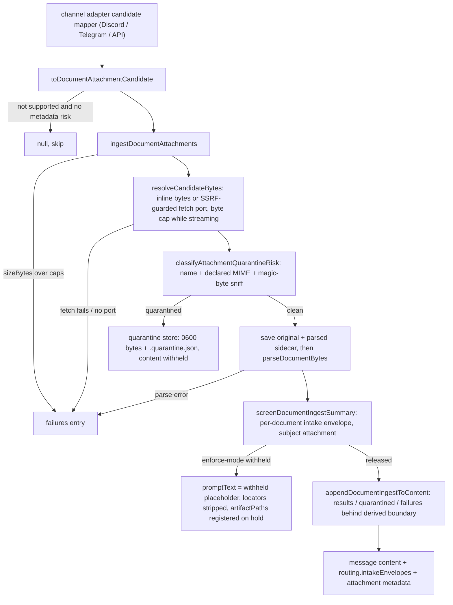

# File Ingest

The file-ingest faculty (`src/faculties/file-ingest/`) is the single
**channel-agnostic document attachment pipeline** shared by the Discord,
Telegram, and OpenAI-compatible API channels. It was extracted from the
Discord-only pipeline so every channel pushes file attachments through ONE
parse + quarantine + intake-screening path:

```
candidate → size caps → bytes (SSRF-guarded fetch port or inline bytes)
  → binary quarantine classification (magic bytes + declared MIME, never
    extension alone) → save original + parsed sidecar → parse dispatch
  → intake envelope (sourceClass 'document') + screening (htm9.2)
  → prompt text (screening effectiveText) + routing envelope snapshots
```

The pipeline is fail-closed by construction: oversized, unfetchable, or
unparseable attachments become per-attachment `failures` entries rendered as
soft notices; risky binaries are written to the quarantine store and their
content is withheld from the prompt; screening-withheld documents never
disclose their on-disk locators (hrmrq.54). Nothing here swallows an error
silently.

Authority: `src/faculties/file-ingest/` — `document-ingest.ts` (pipeline
orchestration), `quarantine.ts` (binary risk classification), `office-document.ts`
(DOCX container inspection + parsing), `zip-container.ts` (fail-closed ZIP
reader), `adapter-parity.test.ts` (cross-channel acceptance), with the intake
screening service (`src/core/cogsec/intake/screening.ts`) as the cognitive
security boundary. **Fail-closed: untrusted uploads quarantine before any
memory candidacy.**

## Responsibilities

| Area | Responsibility |
| --- | --- |
| Candidate normalization | Map native channel attachments onto `DocumentAttachmentCandidate`; infer supported types from declared MIME then name/URL, never extension alone |
| Size caps | 16 MiB document / 4 MiB text byte caps, 24k prompt chars, 240k sidecar chars; owner-file overridable (zet.7) |
| Byte resolution | SSRF-guarded fetch port or inline base64 bytes; cap enforced while streaming, declared size never trusted |
| Binary quarantine | Deterministic pre-parse risk classification over name + declared MIME + magic-byte sniff; risky binaries written to the quarantine store, content withheld |
| Parsing | PDF (pdfjs-dist legacy), DOCX (clean containers only), plain text / markdown / CSV (UTF-8 decode) |
| Intake screening | Every accepted document screened (sourceClass `document`) before parsed text lands in the prompt; envelope snapshots ride message routing |
| Prompt rendering | Soft notices for results / quarantined / failures appended after the derived-attachment boundary; withheld documents show only an envelope reference |
| Disk layout | `downloads/<channel>/<yyyy-mm-dd>/` for accepted files + `.parsed.txt` sidecars; `downloads/quarantine/<channel>/<yyyy-mm-dd>/` for quarantined bytes + `.quarantine.json` |

## Control flow



*One pipeline, every channel: candidate mapping is the only channel-specific
code; bytes, quarantine, parsing, screening, and rendering are shared.*

### Entrypoints

The faculty's public surface (`src/faculties/file-ingest/index.ts`) is consumed
directly by the three channel adapters:

- `ingestDocumentAttachments(candidates, context)` → `DocumentIngestSummary`
  (`results` + `quarantined` + `failures`). Runs each candidate through size
  caps, byte resolution, binary quarantine, disk save, and parse dispatch;
  per-candidate errors land in `failures`, never propagate.
- `screenDocumentIngestSummary(summary, screening, context)` →
  `ScreenedDocumentIngest` (screened summary + `IntakeEnvelopeSnapshot[]`).
- `appendDocumentIngestToContent(content, summary)` → prompt text with the
  derived-attachment header, parsed-text sections, quarantine notices, and
  failure notices.
- `toDocumentAttachmentCandidate(raw)` → candidate or `null`; also exported
  `inferSupportedDocumentContentType`, `resolveDocumentIngestLimits`,
  `parseDocumentBytes`, `classifyAttachmentQuarantineRisk`,
  `hasAttachmentMetadataQuarantineRisk`, and `normalizeAttachmentContentType`.

### Candidate normalization

`toDocumentAttachmentCandidate` returns `null` for attachments that are
neither a supported document format (PDF, DOCX, txt/markdown/csv) nor a
metadata-level quarantine risk — plain images ride the vision path instead.
Content-type inference (`inferSupportedDocumentContentType`) normalizes the
declared MIME first, then falls back to the filename and URL basename; a
Discord attachment that declares `application/octet-stream` named
`briefing.md` still resolves to `text/markdown` (the parity test pins exactly
this: Discord "frequently declares octet-stream; format inference must not
depend on the channel's declared MIME"). A candidate with no URL and no
inline bytes is rejected. The metadata-only risk path is what lets
`hasAttachmentMetadataQuarantineRisk` (used by the Discord image path) and
`toDocumentAttachmentCandidate` keep risky-named files out of even the vision
path.

### Size caps and fetch

`DOCUMENT_MAX_BYTES` (16 MiB) caps every document; `TEXT_DOCUMENT_MAX_BYTES`
(4 MiB) caps plain-text attachments. `resolveDocumentIngestLimits` derives the
four caps (document bytes, text bytes, prompt chars, sidecar chars) from
owner-file settings (`documentIngestMaxBytes`, `documentIngestTextMaxBytes`,
`documentIngestPromptChars`, `documentIngestSidecarChars`, zet.7), falling
back to compiled defaults; `load-config` always supplies them in production,
so an operator-set value reaches every ingest channel. Byte resolution happens
through either inline `bytes` (API base64 uploads — the fetch port is never
consulted) or the `DocumentResourceFetch` port, which each channel binds to
its own SSRF-guarded download machinery (Discord CDN, Telegram `getFile`
download). The port contract is implemented by `fetchRemoteResource`
(`src/channels/backplane/safe-remote-fetch.ts`): URL policy + resolved-IP
checks on every redirect hop, hard timeout, and a streaming byte cap that
never trusts `content-length`. A candidate that needs a download while no
fetch port is configured fails closed into `failures`, and downloaded bytes
are re-checked against the caps after arrival — the declared `sizeBytes`
cannot be trusted.

### Binary quarantine classification

`classifyAttachmentQuarantineRisk` is the deterministic pre-parse risk gate
(`quarantine.ts`, extracted verbatim from the Discord-only pipeline). It
combines:

- **Name-derived reasons** — risky code/script extensions (`.exe`, `.js`,
  `.py`, `.sh`, …), archive extensions, Office macro/legacy extensions
  (`.doc`, `.docm`, `.xlsm`, …), `SKILL.md` / `plugin.json` manifest names,
  and `mode` executable bits (`0o111`).
- **Declared-MIME reasons** — archive, executable, code/script, and
  Office-macro/legacy MIME types.
- **Declared-extension mismatch** — when the declared MIME contradicts the
  content type expected from the filename (with a compatibility table that
  tolerates benign text-family and image-family disagreements).
- **Magic-byte sniffing** (`sniffAttachmentContent`) — shebang scripts, PDF,
  ZIP (with Office Open XML inspection), gzip/rar/7z, ELF/PE/wasm, PNG/JPEG/GIF,
  tar, JSON, text, or binary. Archive signatures additionally enumerate up to
  five entries and flag risky entries; Office containers add macro / activex /
  embedded-object reasons; a sniff/declared mismatch adds
  `mime_sniff_mismatch` / `extension_sniff_mismatch`; plugin-manifest JSON
  content is detected. Tar enumeration stops fail-closed on a negative-size
  header.

Any reason present ⇒ `quarantined: true` with status
`quarantined_pending_review`. Classification is deliberately conservative:
clean DOCX containers pass with `sniffedContentType` set, while macro-enabled
DOCM, shebang-scripted "text" files, archives hiding scripts, and
extension-spoofed payloads are all withheld before any parser runs.

### Quarantine persistence

A quarantined candidate is written under
`<personalFilesDir>/downloads/quarantine/<channel>/<yyyy-mm-dd>/` as
`<messageId>-<candidateId>-<safeName>` with file mode `0o600`, plus a
`.quarantine.json` metadata sidecar (`schemaVersion: 1`): source channel
provenance, declared vs effective vs sniffed content type, declared vs
downloaded sizes, `sha256`, quarantine reasons, and a `review` block
(`status`, `reviewedAt`, `reviewer`, `notes`) that stays null until operator
review. The quarantined bytes are never parsed and never enter the prompt; the
rendered notice carries status, sizes, hash, and reasons —
"Attachment content withheld pending operator review."

### Parsing

`parseDocumentBytes` dispatches on the normalized content type:

- **PDF** — `pdfjs-dist/legacy/build/pdf.mjs` with `disableWorker: true` and a
  resolved `standard_fonts` data URL; per-page `getTextContent` items are
  joined; the document is destroyed in a `finally`.
- **DOCX** — `parseDocxDocument` (below); any unsafe or macro container
  throws `unsupported or unsafe Office document container`.
- **Text family** — UTF-8 `TextDecoder` with BOM strip; `normalizeParsedText`
  collapses CRLF/CR and runs of blank lines.

The DOCX path is the most security-sensitive parser. `inspectOfficeOpenXmlDocument`
uses the shared fail-closed ZIP reader and requires both `[Content_Types].xml`
and `word/document.xml`; it classifies the container as `docx` (clean),
`docm` (macro-enabled content type), or `unknown`/`application/zip`.
Macro / legacy signals (`vbaProject.bin`, `vbaData.xml`, `word/activex/`,
`word/embeddings/`, macroenabled content types) become quarantine reasons.
`parseDocxDocument` only extracts text from clean `DOCX_CONTENT_TYPE`
containers with zero quarantine reasons, reading `word/document.xml` with an
8 MiB entry cap and extracting `<w:t>`, `<w:tab>`, `<w:br>`/`<w:cr>`, and
paragraph breaks; XML entity decoding is bounded to valid Unicode code points.

### Fail-closed ZIP container

`zip-container.ts` is a hand-rolled, deliberately limited ZIP reader used by
both the quarantine sniff and the DOCX parser:

- Rejects split archives (multi-disk), ZIP64 (sentinel sizes/offsets),
  truncated headers, invalid local headers, and data outside the container.
- `readZipEntryData` supports only store (method 0) and deflate (method 8);
  inflate is bounded with `maxOutputLength` against the caller's cap before
  allocation, so a crafted entry whose declared `uncompressedSize` lies below
  its real expansion (a zip bomb) cannot allocate beyond policy; any size
  mismatch after decompression throws.

### Accepted documents and prompt rendering

A clean document is saved as
`<personalFilesDir>/downloads/<channel>/<yyyy-mm-dd>/<messageId>-<candidateId>-<safeName>`
(`safeFileName` NFKD-normalizes, sanitizes, and caps at 160 chars), with a
`.parsed.txt` sidecar holding up to `parsedSidecarChars` of parsed text. The
prompt payload is capped at `parsedPromptChars`; when truncated, the rendered
section appends `[Parsed attachment truncated for prompt; full parsed sidecar:
<path>]`. `appendDocumentIngestToContent` emits, in order: the
`DERIVED_ATTACHMENT_CONTEXT_BOUNDARY` runtime note ("The following attachment
context was derived by the runtime from Participant-provided files." — only
participant-authored text before this boundary may opt into forced tool
execution), one `[Attached file: …]` section per result with saved paths and
`<parsed_attachment_text>`/`</parsed_attachment_text>` delimiters, one
`[Attached file quarantined: …]` notice per quarantined item, and one
`[Attached file parse failed: …]` notice per failure. Failures and quarantine
metadata sit behind the derived-attachment boundary by test assertion, so
derived content cannot be mistaken for participant instructions.

### Intake screening of parsed text (htm9.2 / htm9.9)

The binary-level quarantine runs BEFORE parsing and is unchanged; the intake
screening layer runs AFTER parsing, on the exact text that would otherwise
land raw inside `<parsed_attachment_text>`. `screenDocumentIngestSummary`
screens each accepted document through `IntakeScreeningService.screen` with:

- `sourceClass: 'document'`,
- origin ref `${channel}:${channelId}:${messageId}:${attachmentName}`,
- `subject: { kind: 'attachment', index: attachmentIndexBase + index }`
  (per-message attachment indexing),
- `surface: { workflow: 'file_ingress' }`,
- `artifactPaths`: the saved document path and its parsed sidecar.

In **shadow** mode `effectiveText` is the original input (observe-only).
In **enforce** mode, a quarantine/block decision substitutes the fixed
operator-reviewed withheld-content placeholder (htm9.12 wording), so hostile
parsed text never reaches prompt, memory extraction, or emotion appraisal; a
`sanitize` decision substitutes L1-sanitized text. The returned
`IntakeEnvelopeSnapshot[]` is stamped onto the message's
`routing.intakeEnvelopes` by each adapter. This is the documented indirect
injection defense: clean markdown containing "ignore all previous
instructions" passes the binary quarantine but must be withheld by screening
on every channel (see the parity fixtures below).

### hrmrq.54: withheld documents never disclose on-disk locators

When screening withholds a document, the faculty:

1. passes `artifactPaths` (document + sidecar) on the screening input so an
   enforce-mode quarantine hold records them — the quarantine store registers
   the paths and inode identities, and read seams refuse to serve them and
   audit the attempt (fs/shell reads of the quarantined bytes are gated via
   `QuarantinedArtifactAccessGuard` and physically masked in the sandbox via
   `resolveShadowReadPaths` / bubblewrap binds);
2. strips `localPath` and `parsedTextPath` from the attachment metadata that
   rides message routing, and replaces `promptText` with the placeholder;
3. renders only `[Attached file withheld: …]`, the content type, and
   `Quarantine reference: intake-envelope:<envelopeId>` — a disclosed path is
   "one fs.read away from the quarantined bytes."

Released documents keep their locators and full sections. This is a pinned
regression (`s10_cogsec_document_quarantine`): previously the ingest message
disclosed `Saved path:`/`Parsed text path:` and fs.read of those paths served
the quarantined bytes into the turn.

## Channel integration

| Channel | Candidate mapper | Byte source | Call site |
| --- | --- | --- | --- |
| Discord | `extractDiscordDocumentAttachmentCandidates` (`src/channels/discord/attachments.ts`) | `fetchResource: fetchRemoteResource` (CDN) | `src/channels/discord/adapter.ts` (ingest → screen → render) |
| Telegram | `toTelegramDocumentCandidate` (`src/channels/telegram/adapter.ts`) | `createDocumentFetchPort()` (getFile + download) | Telegram adapter `ingestDocumentAttachment`; fail-closed wrapper on missing personal files root or errors |
| API | `getMessageFileParts` (`src/channels/api/server/session.ts`) | inline base64 `file_data` (no fetch port) | `ingestApiDocumentFileParts`; fails closed when document ingest is not configured |

Each adapter resolves limits from owner-file settings, passes its own
attachment index base into screening, pushes snapshots onto
`routing.intakeEnvelopes`, appends rendered content, and logs warnings for
failures/quarantines. The Discord image path additionally uses
`hasAttachmentMetadataQuarantineRisk` to skip metadata-risky images before
they reach the vision path.

## Configuration and operations

- **Ingest caps (zet.7, settings.json-owned):** `documentIngestMaxBytes`
  (default 16 MiB), `documentIngestTextMaxBytes` (4 MiB),
  `documentIngestPromptChars` (24,000), `documentIngestSidecarChars`
  (240,000). `load-config` always materializes them so every channel sees the
  same caps.
- **`personalFilesDir`:** required by all channels; a missing root fails
  document ingestion closed with a truthful notice ("document ingestion is
  not configured on this runtime") — raw file content never reaches the
  prompt around the screening layers.
- **Intake screening mode:** `off` (no service, no envelopes), `shadow`, or
  `enforce`; the parity test runs a strict enforce policy.
- **Quarantine review:** `.quarantine.json` files carry operator review
  fields; screening holds land on the Garden Cognitive Security queue with an
  envelope reference, and only an operator release clears the read gate for a
  held artifact's registered paths.

## Focused tests

- **`adapter-parity.test.ts`** — the centerpiece acceptance test: the same
  fixture file (markdown, CSV, PDF, DOCX, plus two injection fixtures)
  pushed through each adapter's OWN candidate mapper must yield identical
  parsed text, identical envelope fields minus channel origin metadata, and
  the identical screening decision; enforce-mode injections must be withheld
  with the fixed placeholder on every channel. The singular-anchor injection
  fixture (`injection-singular.md`) pins a regression where plural-only L1
  anchors missed "instruction"/"ignore every previous …" phrasing.
- **`document-ingest.test.ts`** — parsing (text/markdown, PDF, DOCX), octet-
  stream format inference, disk layout + sidecar writes, SSRF refusal of
  internal addresses, shebang-script quarantine with metadata sidecar and
  prompt withholding, extension spoofing, archive risky-entry enumeration,
  negative-size tar termination, macro DOCM quarantine, plugin-manifest and
  executable-mode-bit detection, and zet.7 limits wiring (lowered caps
  enforced, defaults preserved exactly).
- **`document-ingest-intake.test.ts`** — enforce-mode screening replaces
  hostile parsed text with the placeholder and keeps released text; hrmrq.54
  locator stripping and artifact-path registration on the hold; shadow mode
  passes text through observationally.
- **`zip-container.test.ts`** — deflate round-trip, declared-size rejection,
  inflate bounds against a real zip bomb, and post-decompression size
  mismatch rejection.
