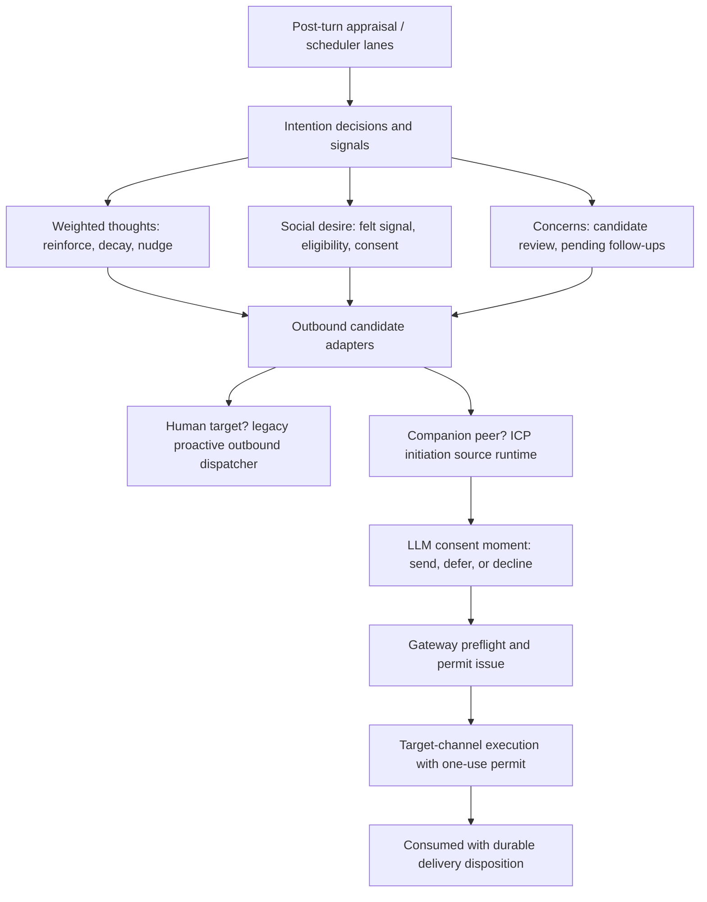
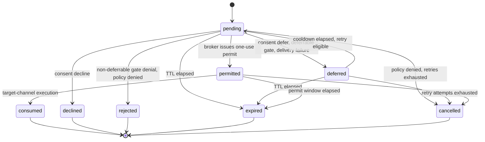

# ICP and Intentions

Two directories in `src/core/` implement the companion's **self-initiated
action** stack. They are one story split across two authorities:

- **`src/core/icp/`** — Inter-Companion Protocol (ICP) **initiation**: the
  durable, consent-gated, gateway-arbitrated lane for one companion to
  initiate contact with a *peer companion* (another machine intelligence).
  Its spine is the initiation candidate (`initiation-candidate.ts`), the source
  runtime that drives a candidate through consent/preflight/permit/delivery
  (`initiation-source-runtime.ts`), the LLM consent evaluator
  (`initiation-consent-evaluator.ts`), the agent-facing autonomy facade
  (`agent-facing-autonomy.ts`), and the claim-capable lifecycle supervisor
  (`candidate-lifecycle-supervisor.ts`).
- **`src/core/intention/`** — the **intention faculty**: the companion's
  durable internal intentionality — what she is quietly holding, weighing, and
  deciding to do. It owns post-turn appraisal (`appraisal/`), active concerns
  (`concerns.ts`, `concern-candidates.ts`, `concern-grooming.ts`), pending
  follow-ups (`pending-follow-ups.ts`), care reminders (`care-reminders.ts`),
  weighted thoughts (`weighted-thoughts.ts` + outreach/nudge), per-contact
  social desire (`social-desire.ts` + consent/outreach), and the policy-gated
  proactive outbound dispatcher (`proactive-outbound.ts`).

The bridge between the two is a set of **candidate adapters**: when an
intention-side mechanism decides a companion-targeted outreach is warranted
and consented, an adapter (`intention-candidate-adapter.ts`,
`weighted-thought-candidate-adapter.ts`, or the affect-driven felt-impulse
adapter) converts the durable intention provenance into an ICP initiation
candidate. Human targets keep the legacy outbound path; canonical companion
peers ride the ICP broker, so consent, gateway arbitration, permits,
retry/TTL, and capability-tier authorization apply identically to every
source. **Fail-closed is the operating principle across both trees: unparsable
consent responses, missing provenance rows, expired permits, and unknown
config keys are refused, never guessed.**

## Control flow

Caption: intention-side signals converge on the ICP candidate broker for
companion targets; the source runtime applies consent, gateway arbitration,
and a one-use permit before any message turn is scheduled.

## ICP initiation candidate

`IcpInitiationCandidate` (`src/core/icp/initiation-candidate.ts#L27-L57`) is
the durable unit of private motivation for one companion-to-companion
initiation. Every field is validated by `parseIcpInitiationCandidate`, which
rejects unknown keys, requires a different local/peer companion pair, caps
candidate TTL at `MAX_ICP_CANDIDATE_TTL_MS` (7 days), and requires a positive
`revision`. The `preferredChannel` is `dm` or `current_room`; a
`targetChannelId` (when present) must parse as a canonical companion channel
whose kind matches and whose participants bind exactly the candidate pair.

Privacy is structural: `reasonSummary`, `peerContactId`, `targetChannelId`,
`permitId`, `pendingFollowUpId`, `deliveryDisposition`, retry fields, and
`continuationTaskKind` are **companion-local**. The only projection allowed to
cross into shared arbitration is
`IcpInitiationCandidateSharedMetadata`
(`initiation-candidate.ts#L59-L71`, `toIcpInitiationCandidateSharedMetadata`),
and `parseIcpInitiationCandidateSharedMetadata` re-validates with
`[private]` sentinels so private fields are rejected as unknown at the gateway
boundary before they could leak into shared state or telemetry.

Sources (`ICP_INITIATION_SOURCES`, `src/shared/contracts/icp-autonomy.ts#L27-L42`)
are `free_time`, `weighted_thought`, `intention`, `foreground`,
`felt_impulse` (affect-driven, operator ruling D4), and `operator_test`
(authenticated Garden-initiated test traffic). Provenance is an opaque
`icp-prov:<uuid>` handle; descriptive provenance stays companion-local.

Caption: the ICP initiation candidate state machine (`TRANSITIONS` in
`initiation-candidate.ts#L91-L100`); `deliveryDisposition` is written
atomically with the `consumed` transition.

## Initiation source runtime

`createIcpInitiationSourceRuntime` (`initiation-source-runtime.ts#L75-L859`)
is the single orchestrator every initiation source funnels through. It exposes
`submit(request)` (resolves after the full pipeline), `accept(request)`
(resolves as soon as the candidate is **durably stored**, with the broker work
continuing asynchronously), and `resumeClaim(claim)` (exact source-independent
lifecycle recovery from a durable claim).

Key mechanisms:

- **Deterministic identity.** `deriveIcpInitiationCandidateId` hashes
  `deriveIcpSourceIdentity` (local companion, peer companion, source,
  preferred channel, and the durable source record — or `pending-follow-up:<id>`
  when the source is `intention`) into a v5-shaped UUID. Replays of the same
  source input collide to the same candidate, so a scheduler replay can never
  create a duplicate (a deterministic identity collision with different
  motivation is an invariant violation and throws
  `ICP candidate identity conflict`).
- **Acceptance vs completion.** `accept()` resolves only after durable
  creation (or a dedupe/terminal replay); the `inFlight` map dedupes concurrent
  submissions of the same candidate. If detached broker work later fails, the
  pending candidate is durably deferred with `delivery_failed`
  (`recordAcceptedBackgroundFailure`, `initiation-source-runtime.ts#L735-L763`)
  — never silently dropped.
- **Pipeline order** in `run()`: durable create or claim → expiry check →
  deferred-cooldown re-entry → terminal-outcome replay → capability-tier
  authorization → **gateway preflight** → LLM **consent** (skipped only for
  `operator_test`, where the authenticated Garden request is the consent) →
  **permit issue** → `permitted` transition → `executeCompanionOutreach` →
  `consumed` with `deliveryDisposition: delivered | suppressed`. Every gateway
  decision is translated via `resolveIcpTransitionDenial` into a deferrable
  (`deferred`) or terminal (`rejected`) candidate transition with a stable
  `IcpAutonomyReasonCode`.
- **Retry/TTL policy.** Defaults: candidate TTL 24 h, retry cooldown
  `ICP_INITIATION_RETRY_COOLDOWN_MS` (5 min), `MAX_ICP_INITIATION_RETRY_ATTEMPTS`
  (3), permit TTL 5 min. `deferCandidateForCooldown` transitions to `deferred`
  with `retryAttempt + 1` and `retryEligibleAtMs`, or to `cancelled` when
  retries are exhausted; a candidate that expires mid-deferral transitions to
  `expired`.
- **Claim-capable stores.** When the store implements the full six-operation
  claim surface (`createClaimedCandidate`, `createClaimedFeltImpulseCandidate`,
  `claimCandidate`, `renewCandidateClaim`, `releaseCandidateClaim`,
  `claimDueCandidates`, `transitionClaimedCandidate`), the runtime creates
  candidates with a producer lease, runs a heartbeat that renews the lease at
  half its TTL, and releases it on completion. Partial claim support is
  rejected at construction.
- **Lifecycle events.** Every transition emits
  `icp.initiation.candidate.lifecycle` on the bus; listener failure is
  deliberately non-transactional — telemetry never rolls back a durable
  transition.

## Consent evaluators

`IcpInitiationConsent` is `send | defer | decline`. The production evaluator
(`createLlmIcpInitiationConsentEvaluator`,
`initiation-consent-evaluator.ts#L50-L93`) presents the peer, source, private
reason, and preferred channel to the companion as herself, explicitly noting
that all deterministic gates already passed, that the decision does **not**
author the message (a separate ordinary turn in the target channel writes the
actual content), and that send/defer/decline are equally valid. It parses
exactly one JSON object with no extra keys; any malformed, non-JSON, or
thrown response **fails closed to `decline`** (`invalid_consent_response` /
`consent_evaluation_failed`), so a malfunction can never cause an unprovoked
send.

The intention side has two sibling consent moments, both LLM and both
fail-closed:

- **Weighted-thought nudge** (`weighted-thought-nudge-evaluator.ts`): the
  companion accepts with an actual message (`{"act": true, "message": …}`) or
  declines; any error or unparsable response declines.
- **Social-desire consent** (`social-desire-consent-evaluator.ts`): a
  `message` choice must carry non-empty content, and `defer`/`decline` are
  valid for warm and repair desires alike; unparsable responses defer.

## Gateway arbitration and agent-facing autonomy

`createAgentFacingIcpAutonomyRuntime` (`agent-facing-autonomy.ts#L165-L262`)
is the companion-side facade over the shared gateway: read/publish/clear own
availability, list known-peer availability, prepare and execute companion
outreach. It enforces **canonical peer validation**
(`resolveCanonicalKnownPeer`): the contact must be a machine-intelligence
contact with exactly one canonical companion identity that
reverse-resolves, or `CanonicalCompanionPeerValidationError` is thrown.
`executeCompanionOutreach` verifies the candidate origin (candidate id, root
initiation id, provenance) matches the permit episode, re-checks execution
authorization after broker preparation, then hands the permit to the target
channel command port.

The shared contracts (`src/shared/contracts/icp-autonomy.ts`) define the
content-free control-plane vocabulary: availability leases (states
`available | open_to_chat | busy | resting | do_not_disturb`), conversation
episodes, initiation permits (one-use, statuses
`issued | consumed | revoked | expired`, TTL capped at 15 min), and the stable
`ICP_AUTONOMY_REASON_CODES` shared by deterministic policy and stores. The
local-policy contract (`local-policy-contract.ts`) defines the
inspect/acquire/release RPC shapes with a canonical exact-operation digest,
used by the gateway coordinator for preflight and permit-issue arbitration.

The **candidate lifecycle supervisor** (`candidate-lifecycle-supervisor.ts`)
owns candidate progress independently of every producer: it claims due
candidates with `claimDueCandidates` (SKIP LOCKED semantics), resumes each via
`resumeClaim`, and relies on the durable lease for crash recovery. Failed work
remains leased until a later bounded pass reclaims it. `createIcpCandidateClaimRecovery`
(`candidate-lifecycle-recovery.ts`) reconstructs the exact source-independent
request from a claim and re-runs it, so restart recovery never requires the
original producer to resubmit.

## Initiation sources and adapters

All sources submit through the same runtime; the differences are in what
produces the request and what provenance it carries.

- **Felt impulse (affect-driven).** `createIcpFeltImpulseInitiationAdapter`
  (`felt-impulse-initiation.ts`) consumes the emo-sim proactivity sidecar's
  `would_message` lever (`icp.felt_impulse.lever` bus event) — operator ruling
  D4: "ICP triggers on social need via emo-sim, not by wall clock timers".
  Each fire selects the most receptive eligible companion peer (deterministic
  ranking by availability receptivity, then contact id), requires the
  `feltImpulseFiredAtMs` sustained fire time to encode the first crossing, and
  records every disposition in the content-free funnel store
  (`felt-impulse-funnel.ts`), making replays idempotent. A local flood floor
  (`FELT_IMPULSE_MIN_INTERVAL_MS`, 15 min) bounds submission rate; when no
  eligible canonical peer exists the failure is explicit (warn log + outcome
  event naming the `seed:sibling-contacts` maintenance entrypoint), never a
  silent no-op. When the lane is disabled or incomplete, a terminal consumer
  records `suppressed`/`not_authorized` so the observer never retries a
  qualified impulse forever.
- **Weighted-thought adapter.** `createIcpWeightedThoughtCandidateAdapter`
  (`weighted-thought-candidate-adapter.ts`) routes a threshold-crossing thought
  to the broker when its contact resolves as a canonical companion, blocking
  with `stale_provenance` when the peer identity is invalid and with
  `recursive_trigger` when a peer-derived thought lost its ICP root or
  co-location lineage (never upgraded to an independent initiation). Its
  `sourceRecordId` is `${thought.id}:r${reinforcementCount}`, so a scheduler
  replay of the same reinforcement epoch dedupes while a genuinely new
  reinforcement may ask again.
- **Intention adapter.** `createIcpIntentionCandidateAdapter`
  (`intention-candidate-adapter.ts`) is the delivery route for
  `INTENTION_OUTBOUND_MESSAGE_ACTION_KIND` actions carrying
  `pendingFollowUpId`, `concernIds`, or consented `socialDesire` provenance.
  It **re-checks every cited row at execution time**: a missing, activated,
  dampened, or expired pending follow-up, a resolved/dismissed/expired
  concern, a missing desire record, or two distinct contacts in one action
  fails closed as `stale_provenance` / `ambiguous_contact` (or `not_companion`
  for human targets). It also binds the candidate to
  `pendingFollowUpId` — the durable intention owner used to reconcile delivery
  across action identities — and preserves at most one inherited ICP root so
  peer-derived intentions can never recurse.
- **Co-location thought.** `registerIcpCoLocationThoughtAdapter`
  (`co-location-thought-adapter.ts`) treats co-location as evidence, never a
  greeting trigger: on `presence.companion.co_located` it writes a low-weight
  (`trivial`, relationship multiplier 0.25) weighted thought with
  `coLocationRef` lineage and no model or broker dependency.

## Intention appraisal

`IntentionAppraisal` (`appraisal/evaluator.ts`, re-exported by
`intention/appraisal.ts`) is the post-turn LLM evaluator that turns a session
snapshot into `IntentionActionDecision[]`. It runs only when a deterministic
**trigger** matches (`appraisal/classification.ts`): `frequency` (default every
3 turns), `emotional_shift` (max VAD/mood delta ≥ 0.35), `concern_due` (an
active concern due within the window), or an explicit `motivation` override
from the motivation bridge (`motivation.ts`, which detects VAD deltas, arousal
spikes, sustained negative valence, and mood drift). Per-session state tracks
`turnsSinceLastAppraisal` and `lastEmotion`.

The prompt payload (persona context + normalized input) asks for a strict JSON
decision array over five types (`appraisal/types.ts`): `followUp` (internal
Whisper note to self, or `delivery: external` for policy-gated outbound),
`concern` (create/transition), `schedule` (daily-review / weekly-review
template), `reminder` (durable care reminder), and `noop`. A no-op decision is
returned on any trigger miss, unparsable response, or evaluation error —
**appraisal fails closed**. Decisions translate to `PostTurnActionCandidate`s
via `appraisal/action-translation.ts`: internal follow-ups become
`intention.follow_up` actions (author `system:intention` / `Whisper`),
external follow-ups become `intention.outbound_message` actions gated by the
proactive-outbound time gate, reminders become `intention.reminder` actions,
and schedule decisions become `heartbeat.run_template` actions.

`runtime-wiring.ts` composes the hooks that apply decisions: concern decisions
create concerns (via `appraisal/concern-matching.ts`), follow-up decisions
enqueue pending follow-ups (routing past-horizon items to the durable
scheduled-prompt router via `long-horizon-follow-up.ts`), and activation
snapshots a completion VAD for the emotional arc (bead vw3w.3).

## Concerns: formation, review, grooming, resolution

**Active concerns** (`concerns.ts`, contracts in
`src/shared/contracts/intention-contracts.ts`) are the short-time attention
list: statuses `candidate | active | watching | deferred | blocked | resolved
| dismissed | suppressed`, priorities `high | medium | low`, TTL by priority
(high 48 h, medium 24 h, low 8 h, capped by `MAX_ACTIVE_CONCERN_LIFETIME_MS`),
a hard cap of `MAX_ACTIVE_CONCERNS` (7) attention-status concerns, evidence
refs, and optional formation/resolution VAD snapshots (the emotional arc).

**Candidate formation** (`concern-candidates.ts`): `deriveConcernCandidatesFromExtraction`
projects accepted memory facts (or a transcript signal) into `ConcernCandidate`
records when text matches the concern-signal pattern (follow-up, check-in,
remind, worried, hasn't, didn't …). Temporal hints (`concern-temporal-hints.ts`)
resolve due dates from language like "tomorrow" / "next week" into
`temporalResolution` / `dueAt`. The `ConcernCandidateReviewer` runs the LLM
review (`create | merge | defer | clarify | reject | route`) with a strict JSON
shape; `parseConcernCandidateReviewResponse` rejects unknown candidates and
fails omitted candidates closed to `reject`. `applyConcernCandidateReview`
applies the decisions through the concern store, enforcing the open-thread cap
and routing `route` actions to durable substrates via the
`ConcernRouteDispatcher` (`concern-route-handoff.ts`); a partial apply failure
throws `ConcernCandidateApplyError` carrying already-applied outcomes so the
worker requeues only unapplied candidates (never duplicating side effects).
The `ConcernCandidateWorker` gates reviews behind a pending-count gate (> 1
candidate) and a turn-interval cadence; the deadline-aware supervisor task
(`concern-review-supervisor.ts`) additionally reviews temporal candidates
before their deadline and retires expired durable candidates.

**Grooming** (`concern-grooming.ts`, registered as a background-maintenance
operation requiring `memory.write`): `groomConcernSet` resolves stale concerns
(past their review window) and enforces the active cap by priority/expiry/
salience ordering. Every retired concern becomes a concrete durable route
(`grooming_stale` / `grooming_cap_overflow`, default target
`introspection`) or an explicit blocked-route result — a retired concern is
never a free-text resolution that silently disappears — and each resolution
emits a resolution appraisal when both VAD snapshots exist.

**Resolution-as-appraisal** (`concern-resolution-appraisal.ts`): resolution
persists `resolutionVAD` symmetrically with `formationVAD`; the emitter
publishes `intention.concern.resolution_appraisal` carrying the relief delta
(resolutionVad − formationVad, sign preserved — resolution is not forced to
feel good). Subscribers include the concern-arc recorder
(`concern-resolution-arc.ts`, writes a first-person reflection-journal entry)
and the "said fine but signals disagree" contradiction damper
(`weighted-thought-contradiction.ts`), which dampens the contact's active
weighted thoughts when a concern resolves while resolution valence stayed
non-positive with no relief — reduce, never zero (Charter Law 27).

## Pending follow-ups

`PendingFollowUp` (`pending-follow-ups.ts` + `pending-follow-up-types.ts`)
is the scarce durable queue of Whisper notes: priorities `low | medium |
high`, timings `immediate | soon | scheduled`, optional
`wakeConditions` (`next_user_turn | background_recheck |
sustained_negative_mood`), and `formationVAD`/`completionVAD` for the
emotional arc. `resolvePendingFollowUpEnqueueResolution` enforces a per-scope
backlog cap (default 5) with content-similarity dedupe (≥ 0.72 → supersede;
≥ 0.45 at cap → supersede; otherwise drop). Activation is gated by
`evaluatePendingFollowUpActivationState`: due time plus wake conditions (the
`next_user_turn` condition waits for an external participant turn,
`sustained_negative_mood` waits on mood/motivation signals below a −0.2
valence threshold). Follow-ups expire by priority age (low 8 h, medium 24 h,
high 48 h, extended past `dueAt`), can be dampened (consent-preserving
deferral) rather than deleted, and malformed writes land in a quarantine
table (`intention_pending_follow_up_quarantine`). Follow-ups carry
`originIcpRootInitiationId` and can be enqueued from post-turn appraisal,
resurfaced on later turns, or routed to the ICP broker as the durable owner of
an intention-source candidate (`pendingFollowUpId` on
`IcpInitiationCandidate`).

## Care reminders

`CareReminder` (`care-reminders.ts`) is the durable, restart-surviving layer
for important dates and self-reminders: kinds `important_date | self_reminder`,
classifications `birthday | anniversary | important_date | check_in |
self_note`, schedules `one_time | annual`, statuses
`active | completed | dismissed`, and provenance `companion_appraisal |
operator`. `advanceYear` rolls an annual reminder to the next occurrence
strictly after now. Reminders are created by appraisal `reminder` decisions
and by operator tools; they surface through the durable
`intention.reminder` action path.

## Weighted thoughts

`weighted-thoughts.ts` is the **pure, deterministic** weight lifecycle
(Charter 6.24): a thought class profile (time-sensitive / standard / trivial)
gives base weight and half-life; `createThoughtWeight` starts from base weight
scaled by emotional charge and relationship tier; `reinforceThoughtWeight`
decays the prior weight to `nowMs` first (recency), then adds a repeat
increment (repeat boost × emotional charge × relationship), capped at
`accumulatedWeightCap` (default 3). Decay is applied **at read time**
(`decayedWeight`, exponential half-life, clamped ≤ 1 on clock skew), so
weights survive restart without a decay writer. A thought whose decayed weight
crosses `nudgeThreshold` produces a **nudge**; accepting marks it `accepted`,
declining applies `applyDeclineDampening` (factor in (0, 1], default 0.5 —
config validation rejects 0 because hard-zeroing disables the mechanism) and
sets `declined`; the next reinforcement reopens a declined thought.
`applyContradictionDampening` implements "said fine but context suggests
otherwise" toward, never to, zero.

The outreach half (`weighted-thought-outreach.ts`) runs as the scheduler lane
`weighted_thought.outreach` (`scheduler/weighted-thought-outreach-lane.ts`),
gated by a deterministic gate (any thought ≥ threshold) so **zero LLM runs
when nothing is near threshold**. For each top thought: companion contacts
route through the ICP weighted-thought adapter first; human targets resolve a
provenance-driven, fail-closed channel (`resolveOutreachChannel`: primary
private channel preferred; group continuation only with explicit policy
approval; personal-project thoughts route only to the primary channel; missing
live provenance → `internal_only`), then the quiet-hours time gate (recipient
timezone when resolvable), then the LLM nudge. Accepted nudges emit
`intention.outbound_message` candidates into the same post-turn action path
the durable outbox delivers; declined or empty-content accepts dampen.

## Social desire

`social-desire.ts` (epic oth4, bead oth4.1) models per-contact durable
pressure to reach out as a **deferred intention**: warm (missing/connect) and
repair (negative-origin: apology, explanation, talk it over) components,
coalesced to **exactly one record per contact**. Carved invariants:
accumulation input derives **only** from felt state (the emotion/appraisal
signal path — `deriveSocialDesireFeltSignal` in
`social-desire-felt-signal.ts` projects per-turn appraisal VAD × confidence
into a felt signal; zero valence or zero confidence accumulates nothing);
elapsed time only decays or gates, never creates; accumulation is
relationship-tier gated (`SOCIAL_DESIRE_ACCUMULATING_TIERS`: acquaintance
through partner plus ai_companion — stranger/public never accumulate); repair
desires cool off longer (`coolingOff.repairMs > coolingOff.warmMs`, enforced
at config validation); and a concern may reinforce but never manufacture a
desire (`reinforceSocialDesireFromConcern` is multiplicative, one boost per
concern, dormant desires untouched).

Eligibility (`evaluateSocialDesireEligibility`) is deterministic and
zero-LLM: tier re-resolved live, decayed total ≥ action threshold, every live
component settled past its cooling-off window, then the quiet-hours gate
checked last (so a desire blocked only by quiet hours becomes eligible the
moment they end). The consent half (`social-desire-outreach.ts`, bead oth4.2)
runs `runSocialDesireOutreachOnce` on a scheduler lane: strongest desires
first, deterministic budget over the durable send ledger (restart-proof),
fail-closed delivery-channel resolution, then the LLM consent moment
(`message | defer | decline`). `message` mints a **single-use, TTL-bound
consent** (`SocialDesireConsentLedger`, deliberately in-memory so restart or
expiry invalidates it and the gate fails closed), binds it to the exact
normalized durable action fingerprint, and emits an
`intention.outbound_message` candidate with social-desire provenance. The
outbound gate verifies the consent against the ledger **and** the desire
record (a fabricated block always fails closed); pressure is released
(`releaseSocialDesirePressure`, residual kept) only on successful dispatch or
delivered ICP candidate, dampened on defer/decline, and settled exactly once
per action identity (`settle`).

## Proactive outbound and time gates

`ProactiveOutboundDispatcher` (`proactive-outbound.ts`) is the fail-closed
last mile for companion-authored proactive messages (non-ICP targets and the
shared policy layer): content is normalized (history stamps stripped), then
blocked on `empty_content`, `unsupported_channel_type` (only `discord` in
this slice), `channel_not_approved_for_primary` (exact-match allowlist for the
configured primary-contact private channel), or `rate_limited`. Dispatched and
blocked outcomes emit `intention.outbound.dispatched` / `intention.outbound.blocked`.

`evaluateProactiveOutboundTimeGate` (`proactive-time-gate.ts`) centralizes
delivery timing: an optional `earliestSendAtMs` and quiet-hours window,
evaluated in the **recipient's** IANA timezone when resolvable
(`Contact.timezone`) with fail-closed fallback to the global window zone. The
durable `outreach-outbox` ledger (`outreach-outbox.ts`) records every
candidate phase (queued → scheduled → dispatching → sent/blocked/failed/
skipped), provides terminal dedupe by `dedupeKey`, counts sent records since a
timestamp for the social-desire budget, and records ICP candidate delivery
completions keyed by `pendingFollowUpId` so an intention source can reconcile
delivery across action identities.

## ICP-over-social precedence

The free-time speaking arbiter consults
`resolveIcpSocialPrecedence` (`social-precedence.ts`): where ICP and ordinary
social participation contend, **ICP wins on any conflict or race** (bible
§8.5, adjudication R2 §3.7). The three conditions are distinct mechanisms,
checked in stable order — `icp_turn_fenced` (durable turn fence live) →
`icp_fatigue_exhausted` (continuation lane at hard stop) → `icp_availability`
(non-open own lease such as DND); an absent lease is open and does not block.
`createIcpSpeakingPrecedenceResolver` (`speaking-precedence-resolver.ts`)
transports real signals (own availability lease, turn fence, fatigue lane)
into the reservation phase and **never swallows a signal-source error** —
uncertainty about ICP state suppresses the social turn. For unlinked
installations sharing a room with no common arbiter, `resolveUnlinkedPeerSpeakLeast`
provides a deterministic per-installation "speak least" fallback with jitter
so sends never dogpile.

## Configuration and operations

- **`scheduler.json > icpAutonomy`** (`icp-autonomy-scheduler-config.ts`):
  `enabled` (default **on**, per operator ruling D4), `candidate`
  (`defaultTtlMs` 24 h, `retryCadenceMs` 5 min, `maxRetryAttempts` 3),
  `permit.ttlMs` 5 min, `policyHolds` (ttl 10 s, `maxOutstanding` 8), and
  `availability.operatorLeaseTtlMs` (24 h ceiling). Structural ceilings are
  enforced by config validation.
- **`scheduler.json > weightedThoughtOutreach`**
  (`scheduler-config/weighted-thought.ts`): disabled by default (fail-closed
  until an operator enables companion-initiated outreach); `checkIntervalMs`
  30 min, `nudgeThreshold` 1, `maxNudgesPerRun` 1, and the full lifecycle
  settings (class profiles, reinforcement, caps, dampening factors, relevance
  floor 0.05).
- **`scheduler.json > socialDesire`** and the intention-follow-up scheduler
  config control the consent-moment lanes; social-desire outbound runtime is
  composed only when `socialDesire.enabled`, and its absence makes the gate
  fail closed for any social-desire payload.
- **Runtime enablement** (`runtime-enablement.ts`) is a one-way live-process
  fence: startup grant comes from `scheduler.json`; `disable()` can only
  narrow it (emergency operator disable). `createIcpRuntimeAvailabilityController`
  (`runtime-availability.ts`) publishes `resting` when the fleet fatigue
  posture is exhausted, else `available`, with a 24 h lease ceiling.
- The composition seam is `src/app/agent/icp-initiation-source-wiring.ts`:
  it builds the source runtime (only when enabled and all ports are present),
  the weighted-thought and intention candidate adapters, the felt-impulse
  lever subscription (or an explicit terminal suppression when the topology
  cannot support it), the co-location thought adapter (requires presence +
  weighted-thought store), and starts/stops the candidate lifecycle
  supervisor. Single-companion topologies log the omission explicitly rather
  than silently dropping the affect-driven impulse.

## Invariants and failure semantics

- **Privacy by construction.** Private motivation, contact ids, permits, and
  retry fields never enter shared arbitration (`initiation-candidate.ts`
  shared projection; `icp-autonomy.ts` "content-free cross-companion
  control-plane vocabulary").
- **Consent is never assumed.** Every outbound path — ICP initiation,
  weighted-thought nudge, social desire — has an LLM consent moment that
  fails closed (decline/defer) on error, and `operator_test` is the only
  source that bypasses the companion consent question (and only because the
  authenticated Garden request is itself the consent).
- **Provenance is re-verified at dispatch.** The intention adapter re-reads
  pending follow-ups, concerns, and desire records; the outbound gate
  verifies single-use consents; peer-derived thoughts without lineage are
  blocked as `recursive_trigger`; missing ICP root lineage on a generated turn
  throws (`initiation-lineage.ts`).
- **Exactly-once structural markers.** Deterministic candidate ids, permit
  consumption outcomes (`consumed | not_found | expired | revoked | replayed |
  mismatch`), terminal outbox dedupe by `dedupeKey`, single-use consent
  records, and `settlementId` exactly-once settlement.
- **Cap and decay discipline.** Active-concern cap 7, follow-up backlog cap 5,
  weighted-thought accumulated-weight cap, desire pressure cap — all
  enforced with dampening/release that keeps residuals so mechanisms can
  re-accumulate; config validation rejects factors that would hard-zero a
  mechanism (Charter Law 27).
- **Telemetry never rolls back state.** Lifecycle, gate, and outbox events
  are emitted best-effort; a listener failure never replays or reverts a
  durable transition.

## Focused tests

- `src/core/icp/initiation-source-runtime.test.ts` — acceptance resolves
  before broker preflight, detached broker failure durably defers with
  `delivery_failed`, deterministic dedupe across restart, idempotent terminal
  replay, retry exhaustion, and candidate-identity conflict rejection.
- `src/core/icp/felt-impulse-initiation.test.ts` — durable funnel linking and
  dedupe across adapter restart, throttle floor, no-eligible-peer and
  not-authorized dispositions.
- `src/core/icp/intention-candidate-adapter.test.ts` and
  `weighted-thought-candidate-adapter.test.ts` — stale-provenance blocking,
  ambiguous-contact blocking, human-target preservation, lineage inheritance.
- `src/core/intention/appraisal.test.ts` / `appraisal-integration.test.ts` —
  trigger classification, decision parsing, fail-closed noops, decision →
  action-candidate translation.
- `src/core/intention/concern-candidates.test.ts`, `concern-grooming.test.ts`,
  `concern-resolution-arc.test.ts` — candidate extraction/review/apply,
  cap/stale retirement with route outcomes, resolution arcs and relief deltas.
- `src/core/intention/social-desire.test.ts`, `social-desire-outreach.test.ts`,
  `weighted-thought-outreach.test.ts` — tier gating, cooling-off, quiet-hours
  ordering, consent single-use verification, budget exhaustion, nudge
  accept/decline dampening.
- `src/core/icp/initiation-consent-evaluator.test.ts` and
  `src/persistence/postgres/icp-intention-lifecycle.integration.test.ts` —
  strict consent parsing with fail-closed decline, and durable
  intention-source candidate lifecycle across restarts.
