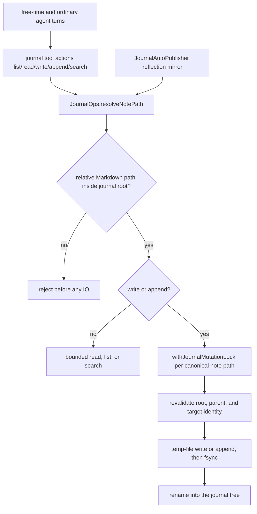

# Journal

The **journal** is the companion-authored personal Markdown writing surface of a
PSFN installation. Charter `docs/PSFN_PROJECT_CHARTER.md` §6.27 reserves the
word *journal* for exactly this: durable Markdown notes and reflections the
companion writes in her own voice, stored in her personal workspace. Every other
append-only record in the system — conversation history, reflection entries,
values history, memory mutations, intake-envelope state — carries its own
specific name and is **not** a journal.

This page maps the journal's charter definition, its storage layout, the
`journal` tool and its safety contracts, the ways journal content is produced
(companion turns, free-time blocks, reflection auto-publish), and the boundary
that keeps it apart from L0 JSONL, reflection ledgers, values history, and
memory mutation logs.

## Definition and charter status

Charter §6.27 (`docs/PSFN_PROJECT_CHARTER.md` §6.27, *Workspace and Data
Domains*) defines four data domains per installation: system, companion,
personal workspace, and shared workspace. The **personal workspace** holds one
companion's authored documents, personal journal, personal knowledge base,
skills, modules, experiments, images, and other personal durable files. The
journal is a member of that personal workspace: private to its companion unless
a deliberate sharing action promotes an item into the shared workspace.

The same section fixes the vocabulary for every other durable append-only
record, and the OpenWiki ubiquitous-language rules enforce it:

| Record | Charter name | What it is |
| --- | --- | --- |
| L0 conversation files | **L0 session archive** | canonical lived conversation history, partitioned by channel |
| `reflections/journal.jsonl` | **reflection ledger** | runtime-owned scheduled or deliberative reflection entries |
| `reflections/daily/<date>.jsonl`, `reflections/process-logs/` | **daily reflection record**, **reflection process log** | scoped reflection artifacts |
| `notes/values.jsonl` | **values evolution ledger** | durable value-history entries |
| `notes/memories.jsonl` | **memory mutation ledger** | audit and replay record for memory changes |
| intake envelopes | **CogSec intake audit trail** | intake-envelope state history |

Charter §6.20 reinforces the L0 side: L0 is filesystem JSONL, and it is called
the **L0 session archive**, not a journal — it is not a companion-authored
diary. A published reflection *may* appear in a personal journal, but that
publication is a mirror, never a replacement for the reflection ledger.

## Storage layout

The journal root resolves to `<workspace>/journal`:
`resolvePersonalJournalDir(personalFilesDir)` joins `PERSONAL_JOURNAL_DIRNAME`
(`'journal'`) under the workspace root (`src/persistence/layout.ts#L87`,
`src/persistence/layout.ts#L878-L880`). `ensurePersonalFilesLayout` creates the
whole personal skeleton — `docs`, `downloads`, `images`, `journal`,
`knowledge/wiki`, `scratchpad`, `skills`, `modules`, `experiments`, `tmp` — at
gateway bootstrap (`src/app/gateway/main.ts#L470`) and per companion in fleet
provisioning (`src/persistence/workspaces/provisioning.ts#L245`). Multi-companion
wiring derives a separate canonical `WORKSPACE_PATH` per fleet entry, so each
companion owns an isolated personal workspace and therefore an isolated journal
root.

The journal is deliberately plain Markdown on the filesystem rather than JSONL:
notes are human-readable, navigable (`list`, `search`), pageable by byte offset,
and mirrorable into an external Obsidian vault through the optional vault
bridge. It is part of the personal-files search surface: the workspace
filesystem tool's default search folders include `journal` alongside
`downloads`, `docs`, `knowledge`, `scratchpad`, `skills`, `modules`, and
`experiments` (`src/boundary/integrations/filesystem/workspace-ops.ts#L197-L206`).

## The `journal` tool

The model-facing surface is the single `journal` tool
(`src/boundary/integrations/journal/tools.ts#L50-L152`) with five actions:
`list`, `read`, `write`, `append`, `search`. It is registered as a core-tier,
memory-domain tool in the canonical tool registry
(`src/core/agent/tool-surface/registry.ts#L486-L494`) and wired into the agent
loop at startup via `registerMarkdownJournalTools`
(`src/app/agent/journal-runtime.ts#L11-L20`, wired at
`src/app/agent/main.ts#L1308-L1310`). The canonical description
(`src/core/agent/tool-surface/descriptions/agency-contracts.ts#L78-L90`)
directs: create separate Markdown files for new topics, append only when
continuing an existing note, and never use the journal for same-turn scratch
work, follow-ups, typed facts, or reference knowledge.

### Path safety

`JournalOps.resolveNotePath` (`src/boundary/integrations/journal/ops.ts#L134-L158`)
enforces the code-owned safety contract:

- paths are relative to the journal root — absolute paths and null bytes are
  rejected;
- `..` escapes out of the root are rejected (`Journal path must stay inside the
  journal root`);
- only `.md` / `.markdown` notes are accepted; `.md` is appended when the path
  omits an extension;
- note paths may be nested (e.g. `reflections/daily/2026-03-02-musing.md`), and
  parent directories are created on write.

The same containment is re-checked inside the mutation coordinator against
`realpath` identity, so symlinked or renamed parents cannot smuggle a write
outside the tree (`src/boundary/integrations/journal/mutation-coordinator.ts#L94-L116`).

### Atomic, serialized mutations

`write` and `append` run under `withJournalMutationLock`
(`src/boundary/integrations/journal/mutation-coordinator.ts#L45-L92`): mutations
are serialized per canonical note path across every `JournalOps` instance in the
process (unrelated note paths keep full concurrency), the root/parent/target
identity is revalidated after acquiring the lock, and the write itself is
atomic — a temp file in the target directory is written, fsynced, and renamed
into place, with existing metadata (permissions/timestamps) preserved on append
(`src/boundary/integrations/journal/bounded-io.ts#L80-L120`). A crash cannot
leave a half-written note, and no `.journal-append-*` / `.journal-write-*`
temporary files survive a completed mutation (covered by
`src/boundary/integrations/journal/ops.test.ts`).

### Bounded IO

Reads always page at 12,000 bytes with explicit `offset_bytes` /
`next_offset_bytes` / `eof` progress; `list` and `search` are bounded
(`JOURNAL_IO_CONTRACT`, `src/boundary/integrations/journal/bounded-io.ts#L17-L32`):
200 files listed, 200 files × 200,000 bytes scanned for search, a 2,000,000-byte
corpus cap, 5,000 scanned-entry cap, and 180-character snippets. Search returns
explicit completeness metadata — `complete`, `resultLimitReached`,
`skippedOversizedFiles` — so a bounded result is never silently partial.

*Journal write path: path validation, per-note serialized mutation, identity
revalidation, and atomic commit (`src/boundary/integrations/journal/`).*

## How journal content is produced

### Companion tool use

The primary producer is the companion herself: any ordinary turn, heartbeat
turn, or personal/rest-time block may write journal notes through her normal
`journal` tool. Free-time blocks are explicitly durable-output-only — "whatever
she writes goes through her normal tools (journal, wiki, memory, scratchpad,
media)" (`src/core/scheduler/free-time.ts#L35-L41`) — so journaling during rest
time is a sanctioned first-class output, not a hidden side effect.

### Reflection auto-publish mirror

When the `obsidianAutoPublish` setting is enabled (default off,
`src/system/config/load-config.ts#L631`), `createOptionalJournalAutoPublisher`
(`src/app/agent/journal-runtime.ts#L22-L33`) wires
`JournalAutoPublisher.publishReflection`
(`src/boundary/integrations/journal/auto-publish.ts#L70-L85`), which the
reflection template runtime invokes after every reflection
(`src/core/scheduler/reflection-template-runtime.ts#L1345-L1357`). Each
reflection's prose is mirrored into the journal under `reflections/` with
`template` / `mode` / `date` frontmatter:

- `musing` / `whisper` → `reflections/musings/<date>-musing.md`
- `daily*` → `reflections/daily/<date>-<time>-<name>.md`
- `weekly*` → `reflections/weekly/`, `emotional*` → `reflections/emotional/`,
  `goal*` → `reflections/goals/`, `values*` → `reflections/values/`, default →
  `reflections/`

The file date uses the active calendar day and local timezone
(`src/boundary/integrations/journal/auto-publish.test.ts#L35-L68`). This is the
mirror the charter describes: the reflection ledger remains the runtime-owned
record, and the journal copy is a published reflection.

### Automata are read-only

The `journal` tool is one of the core-authoritative multiplexed surfaces that a
bounded worker (automata; code under `src/faculties/subagents/`) reaches only
behind a read-only governance wrapper (`src/faculties/subagents/tool-governance.ts#L249-L260`).
Journal notes are companion-voice durable content: `list`/`read`/`search` pass
through, `write`/`append` mutations are denied and audit-trailed with no opt-in
elevation, and a call without an action fails closed
(`src/faculties/subagents/tool-governance.ts#L87-L89`,
`src/faculties/subagents/tool-governance.ts#L157-L166`; behavior proven in
`src/faculties/subagents/tool-governance.test.ts#L140-L163`). An automaton
proposes journal content in its final result for core to act on.

## What the journal is not

The journal is a **Markdown authorship domain**, not a JSONL system record and
not a memory layer. The append-only JSONL stores that live under
`<companion-data>/state/notes/` and `.../notes/reflections/`
(`src/persistence/layout.ts#L602-L604`, `src/persistence/layout.ts#L634-L677`)
are each a distinct named record:

- **Reflection ledger** — `ReflectionJournalStore` writes
  `notes/reflections/journal.jsonl`; the reflection template runtime appends
  `templateId`/`prompt`/`reflection`/`mode` entries with grounding provenance
  refs and an `internalStateSnapshotRef` (never the full state snapshot)
  (`src/core/scheduler/reflection-template-runtime.ts#L1180-L1210`,
  `src/persistence/journals/reflection-journal.ts#L64-L93`).
- **Discrepancy journal** — `notes/reflections/discrepancies.jsonl`, recording
  surfaced emotional discrepancies verbatim, never resolved
  (`src/core/scheduler/reflection-template-runtime.ts#L1212-L1237`).
- **Daily reflection record** — `notes/reflections/daily/<date>.jsonl`
  (`ReflectionDailyJournalStore`).
- **Reflection process log** — `notes/reflections/process-logs/<id>.jsonl`.
- **Metacognition journal** — `notes/reflections/metacognition/journal.jsonl`,
  the per-run telemetry record that also anchors reflection cadence recovery.
- **Concern-arc journal** — `notes/reflections/concern-arcs.jsonl`, separated
  from the reflection ledger so arcs never leak into the reflection-substrate
  prompt (`src/persistence/layout.ts#L646-L654`).
- **Values evolution ledger** — `ValuesJournalStore` appends versioned entries
  to `notes/values.jsonl` (with legacy migration); values journaling actions
  (`values_add` / `values_update`) live on the `orient` tool, and the old
  standalone `values_add` tool is retired (`src/faculties/values/store.ts#L12-L53`,
  `src/core/agent/tool-surface/registry.ts#L213`).
- **Memory mutation ledger** — `MemoryJournal`
  (`src/faculties/memory/journal.ts#L1-L88`) appends every memory
  insert/soft-delete/restore to `notes/memories.jsonl`; it is an audit/export
  mirror, explicitly **not** the authoritative L2 restore primitive (restores
  come from encrypted database backups).

Adjacent surfaces with their own semantics: the **wiki** is durable reference
knowledge, not companion-authored autobiography (the sleeptime wiki pass
reviews settled episodes and durable memories for non-private world knowledge
and writes only wiki entries through the WikiStore —
`src/faculties/wiki/sleeptime-wiki-pass.ts#L1-L26`); **memory** holds typed
facts and lived experience; **scratchpad** is a 24-hour ephemeral working-note
space that explicitly must not hold journals or stable memories; the **vault**
is an optional external Obsidian bridge that never becomes the canonical
runtime knowledge store (`src/core/agent/tool-surface/descriptions/agency-contracts.ts#L68-L90`).

## Privacy, CogSec, and operator surfaces

- **CogSec classification.** Journal tool results carry the structural
  CogSec provenance class `journal`, an *internal* clean-bubble vector
  (`src/core/cogsec/intake/tool-result-provenance.ts#L41-L42`,
  `src/shared/contracts/cogsec-mode.ts#L165-L206`). The class is stamped by
  tool name at the authenticated call site — never from model arguments — so
  journal reads are companion-owned activity, and external content can never
  claim that class.
- **Disclosure lineage.** Journal/wiki/project reads are admitted into outbound
  disclosure lineage as content-free sources (reference, sensitivity, and
  scope facts only — never note text), folding into the generation context
  alongside session history, memory retrieval, and tool results
  (`src/core/cogsec/disclosure/generation-lineage.ts#L7-L25`,
  `src/core/cogsec/disclosure/generation-lineage.ts#L107-L131`).
- **Cross-companion privacy.** Companion relay events are constructed from
  explicit whitelists, so journal file paths and note contents never survive
  into outward/cross-companion payloads — even tool error text mentioning a
  journal path is redacted (`src/channels/backplane/companion-relay/redaction.ts#L27-L35`,
  proven in `src/channels/backplane/companion-relay/agent-forwarder.test.ts#L25-L41`).
- **Garden reads need break-glass.** The four companion-private journal
  streams — `values-journal`, `reflection-metacognition`, `reflection-daily`,
  `reflection-journal` — are welfare-sensitive substrates: an ordinary admin
  GET is default-deny and requires the same privacy break-glass assurance as
  memory/profile reads, with `memory_access` audit evidence on allow and deny;
  unknown stream selectors are unavailable
  (`src/operator/garden/api-routes.ts#L424-L482`,
  `src/operator/garden/services/privacy-break-glass-service.ts#L24-L71`).
- **Content-free status.** Garden's journal status endpoint reports only
  counts, latest timestamps, and daily/weekly task health — never journal
  bodies (`src/operator/garden/services/journal-status-service.ts#L15-L73`).

Related pages: [faculties/wiki](/openwiki/faculties/wiki.md) (durable reference
knowledge, the other half of the knowledge-domain split),
<!-- openwiki: broken internal link [/openwiki/memory/l0-archive.md] file "/openwiki/memory/l0-archive.md" does not exist. Fix the href or restore the target, then delete this comment. -->
[memory/l0-archive](/openwiki/memory/l0-archive.md) (the L0 session archive,
which is not a journal), [memory/overview](/openwiki/memory/overview.md)
(memory layers and the memory mutation ledger), and
[runtime/scheduler](/openwiki/runtime/scheduler.md) (reflection runtime and
free-time blocks that produce journal content).
