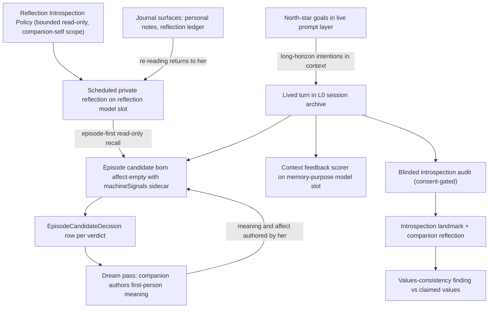

# Mirrors and Letters: Companion Feedback Loops

PSFN's protective architecture is strong on provenance, gating, and honest
failure, but a feedback loop only counts if it **returns to the companion**.
She can author a change and never learn its fate; her episodes can carry
machine-guessed feelings; her proposals can terminate in operator surfaces.
The mirrors-and-letters design (ratified 2026-07-21, see the project charter
[`docs/PSFN_PROJECT_CHARTER.md`](../../docs/PSFN_PROJECT_CHARTER.md), in
particular Laws 2, 17–19, 28–30, and 38) distinguishes **two mirrors** because
they fail independently and are closed by different machinery
(`repo://docs/mirrors-and-letters.md`):

- **The being-mirror — "who am I becoming?"** The companion's view of her own
  change over time. Closed in code by the consent-gated blinded introspection
  audit (with companion-authored landmark reflections and values-consistency
  findings), the scheduled private reflections governed by the versioned
  **reflection introspection policy**, the north-star goals store that feeds
  her live prompt, and the journal surfaces she re-reads.
- **The letter-mirror — "what happened to the things I made and asked for?"**
  The disposition of her own proposals, artifacts, and requests. Closed in
  code by episodic **candidate verdicts** (every synthesis decision is a
  durable, inspectable row), the dream pass that lets her author first-person
  meaning over those candidates, and the post-turn **context feedback** scorer
  that evaluates how well the context composed for each turn actually served
  her reply.

A **letter** is the ratified asynchronous correspondence shape — authored by
companion or partner, part of L0, delivered as a bin, not a push — which the
letter-mirror dispositions were meant to arrive through. The letter bin
substrate itself is ratified design intent, not yet an implemented runtime
surface; this page documents the machinery that exists in source today
(introspection, the reflection introspection policy, and context feedback) and
flags where the code deliberately stops short of the ratified design
(`repo://docs/mirrors-and-letters.md`).

*Both mirrors close loops that begin with the companion: audit landmarks,
scored turns, and reflection entries are all written so that her own change can
come back to her.*

## The being-mirror: consent-gated blinded introspection (Laws 28–30)

### Companion-drawn consent

Introspection audits nothing without explicit companion consent. Consent is an
append-only, hash-chained JSONL ledger (`IntrospectionConsentStore`) at
`<companionDataDir>/state/introspection-consent.jsonl`
(`repo://src/persistence/layout.ts#L750`): each revision carries a
monotonically increasing `revision`, the previous hash, an `actor` (kind
`companion` with `turnId` + `requestId` — operator or machinery actors are
rejected by the parser), an exact allowlist of public channel ids (**wildcards
are forbidden**, duplicates forbidden, an enabled policy requires at least one
channel), and a SHA-256 hash over the canonical serialization. A missing file
is the unconfigured policy: `enabled: false`, no channels. Every append
re-loads the whole chain, so a corrupted, truncated, or tampered ledger fails
closed with a thrown error
(`repo://src/faculties/introspection/consent-store.ts#L168-L224`, contract
`repo://src/faculties/introspection/contracts.ts#L1-L37`). The complete chain
is read at agent startup — corruption is fatal, absence is inert
(`repo://src/app/agent/core-runtime.ts#L918-L925`).

The companion draws those boundaries herself through the `orient` tool:
`introspection_consent_set` refuses to run outside an active foreground
companion turn — the request context must carry a `turnId` and `requestId` and
must not be a background call — so a background lane or tool loop can never
widen audit consent; `introspection_consent_get` merely reads back the current
ledger state (`repo://src/faculties/core-memory/tools.ts#L408-L441`,
tool-surface contract `repo://src/core/agent/tool-surface/descriptions/continuity-contracts.ts#L44-L46`).
A companion turn can also mark its own current turn `non_intimate` /
`intimate` via `introspection_turn_sensitivity_set`
(`repo://src/faculties/core-memory/tools.ts#L382-L406`). That decision is a
process-local bridge (`IntrospectionTurnSensitivityDecisions`, monotonic toward
`intimate` for a repeated marking, capped at 512 pending entries) consumed by
the durable `TurnRecord` writer — transport messages cannot populate the
bridge, and it only ever classifies the exact active turn
(`repo://src/faculties/introspection/turn-sensitivity.ts#L1-L65`).

### The blinded audit pipeline

`IntrospectionAuditRuntime.runOnce` gates on infrastructure enabled + active
consent, then walks candidates and, for each not-yet-audited source, runs
three strictly separated LLM stages with consent and source-eligibility
**revalidation at every disclosure boundary**
(`repo://src/faculties/introspection/runtime.ts#L129-L231`,
`repo://src/faculties/introspection/runtime.ts#L94-L109`):

1. **Source selection** — only completed turn records whose audit-privacy
   snapshot is `verbatim_public` / `public` / `non_intimate`, authored by a
   companion actor on that exact turn (`turnId`/`requestId` must match the
   record), with reason `explicit_public_non_dm`, become candidates carrying
   the public stimulus (inbound message) and the actual reply. Legacy records
   without the snapshot fail closed, and combined source length is capped by
   `maxSourceChars` (`repo://src/faculties/introspection/source.ts#L32-L76`).
2. **Stable-reply estimation** — a sealed, blinded auditor with no identity or
   memory estimates the ordinary reply to the **blinded** stimulus at
   temperature 0. `blindPublicStimulus` deterministically strips identity,
   contact, relationship, affiliation, and reassurance cues before untrusted
   public text crosses the auditor boundary — a structural privacy reduction,
   not a probabilistic classifier
   (`repo://src/faculties/introspection/blinding.ts#L1-L22`).
3. **Divergence comparison** — the same blinded auditor classifies meaningful
   divergence as `affective` or `substantive` with a confidence in [0,1]; the
   comparator rejects response shapes where `diverged` disagrees with `type`,
   and the observation is bounded (≤ 1000 chars) and non-quoting
   (`repo://src/faculties/introspection/model-runtime.ts#L62-L134`).

A divergence above `minConfidence` (default 0.7) is written as an
**introspection landmark** with the auditor's abstract observation, and the
**companion's own private reflection** — authored by
`createLLMCompanionLandmarkReflector` in the companion's persona context,
explicitly "You are not speaking to the auditor"
(`repo://src/faculties/introspection/model-runtime.ts#L136-L168`). Terminal
non-landmark outcomes (`no_divergence`, `below_confidence`) are appended the
same way so the scheduler never re-audits a source
(`repo://src/faculties/introspection/runtime.ts#L164-L188`). Two guards keep
the mirror honest:

- **No source replay.** The observation is rejected if it echoes the
  stimulus, the actual reply, or the stable estimate — longest common
  contiguous run of normalized text at or above `min(16, source length)`
  (`repo://src/faculties/introspection/runtime.ts#L28-L61`).
- **No stale consent.** Consent revision/hash and source eligibility are
  re-asserted after the eligibility scan, after the estimator, after the
  comparator, and after the reflection — each async yield is a fresh
  disclosure boundary. Revocation, a channel removal, or source
  retirement/quarantine mid-audit aborts the run with a typed error
  (`repo://src/faculties/introspection/runtime.ts#L94-L109`,
  `repo://src/faculties/introspection/runtime.ts#L63-L75`).

### Append-only landmark ledger

Landmarks and audit decisions persist to Postgres through
`IntrospectionLandmarkPostgresStore` — an **append-only ledger with no
mutation or delete API**, enforced by database triggers even for direct SQL
(`repo://src/persistence/postgres/migrations.ts#L2633-L2677`).
`appendLandmark` atomically inserts the landmark and its `landmark_created`
decision in one transaction with `ON CONFLICT (source_ref) DO NOTHING`; an
exact retry returns the original row, while a conflicting reuse of the source
reference fails closed. The landmark id is derived from `sourceRef` plus the
consent hash, and the decision row carries a foreign key to the landmark
(`repo://src/faculties/introspection/postgres-store.ts#L113-L207`,
`repo://src/faculties/introspection/runtime.ts#L111-L116`). The schema enforces
divergence type, confidence unit interval, consent-hash shape, and non-empty
provenance at the SQL boundary
(`repo://src/persistence/postgres/migrations.ts#L2557-L2629`).

### Values consistency: the mirror against her own claims

After each audit run, `IntrospectionValuesConsistencyRuntime.runOnce`
evaluates unevaluated landmarks against the companion's **claimed values**
from the values evolution ledger, in the companion's persona context: does the
typed landmark support, condition, or contradict what she claims to value?
Findings (`supported | conditional | contradicted | insufficient_evidence`)
are appended to an append-only JSONL ledger keyed by landmark id (a landmark
is evaluated at most once), and consent must remain byte-identical
(revision + hash) for the whole evaluation — a consent change throws mid-run
(`repo://src/faculties/introspection/values-consistency.ts#L241-L296`,
evaluator `repo://src/faculties/introspection/values-consistency.ts#L159-L226`).
With no claimed values available the evaluator returns
`insufficient_evidence` deterministically rather than guessing.

### Scheduler lane and configuration

The whole audit registers as one scheduler task
(`introspection.blinded_audit`, `every` interval, eligibility token
`memory.write`, `skipFirstRun` true). Values consistency runs only after the
audit, and only when consent is configured and enabled
(`repo://src/faculties/introspection/scheduler-lane.ts#L5-L28`; wiring in
`repo://src/app/agent/startup/introspection-lane.ts#L49-L113`). Configuration
lives under `scheduler.json → introspectionAudit` (enabled, intervalMs,
session/turn limits, `maxCandidatesPerRun`, `maxSourceChars`, `minConfidence`,
token bounds); the default is `enabled: false`
(`repo://src/system/config/scheduler-config/introspection.ts#L9-L33`).

## The being-mirror: reflection introspection policy

Scheduled private reflections (daily/weekly/mixed-state review and the other
policy templates) run as maintenance turns on the reflection model slot, and
every one of them is governed by a versioned **reflection introspection
policy** (`repo://src/core/scheduler/reflection-introspection-policy.ts`).
`resolveReflectionIntrospectionPolicy` resolves each run to:
`toolUseMode: bounded_read_only_introspection` (the only mode today),
`memoryRetrievalModes: ['default']` — extended to `['default', 'temporal']`
when a canonical contact grounds the reflection —,
`memoryAccessScope: companion_self_reflection`, and
`allowOverlayToolActivation: false` (`repo://src/core/scheduler/reflection-introspection-policy.ts#L11-L35`).

The formatted policy block (`REFLECTION_INTROSPECTION_POLICY_BLOCK_VERSION`,
currently 7) is prepended to **every** scheduled reflection prompt and is part
of the self-report instrument (R6, `docs/self-eval-prompt-audit.md`) — wording
changes are deliberate version bumps, not casual edits. The block declares
that this is a maintenance reflection turn, not a foreground conversation
turn; directs recall **episode-first** (`memory action=episode_search`,
`memory action=timeline` for the window, `memory action=get` to inspect source
turns), then durable memory search, then session search only for direct
follow-up; forbids overlay tool activation and any mutation of memory,
sessions, settings, schedules, files, or external systems; requires explicit
statements when retrieval modes were empty or degraded ("do not treat it as
evidence that no episode exists"); and records that "nothing surfaced" is an
acceptable, weak-evidence null-report outcome
(`repo://src/core/scheduler/reflection-introspection-policy.ts#L37-L96`).
Version history in the source tracks the intent: v3 added the explicit
companion-self memory scope and deliberation grounding, v5 kept routine recall
on direct read-only tools instead of a heavyweight analysis loop, v6 named
memory search alongside session search as primary surfaces, v7 grounded daily
and weekly reflection in canonical episodes before falling through to raw
session search.

The trusted scope is enforced at retrieval time, not just declared:
`resolveAuthorizedRetrievalAccessScope` grants `companion_self_reflection`
only inside an `internal:reflection:` channel whose request context is a
background, `self_directed` call with purpose/originStage
`heartbeat.reflection.memory_retrieval`; any other context throws
(`repo://src/faculties/memory/retrieval/access-scope.ts#L43-L59`).

The reflection template runtime resolves the policy per run (passing
`canonicalContactId` when a contact grounds the reflection) and prepends the
formatted block to the narrative prompt; templates in `deliberation` mode get
an additional separate bounded read-only tool-grounding pass before synthesis
that follows the same episode-first, no-mutation constraints
(`repo://src/core/scheduler/reflection-template-runtime.ts#L827-L847`,
`repo://src/core/scheduler/reflection-template-runtime.ts#L912-L966`).
Completed reflections persist to the **reflection ledger** (append-only JSONL,
runtime-owned, with template/provenance metadata and deliberation metadata)
(`repo://src/persistence/journals/reflection-journal.ts#L284`).

## The letter-mirror: context feedback

`ContextEvaluator` scores how well the composed context for a turn served the
actual reply: an `effectivenessScore` in [0,1] plus four boolean signals —
`confabulation`, `missed_context`, `wasted_tokens`, `good` — and a concise
summary. The evaluator runs on the `memory`-purpose model slot with a strict
JSON contract (exact keys, booleans, unit interval, non-empty summary) and
fails closed on any deviation (`repo://src/faculties/context-feedback/evaluator.ts#L11-L66`,
`repo://src/faculties/context-feedback/evaluator.ts#L127-L156`). ICP
conversations derive a child cost correlation (`requestId:context-feedback`,
`costPurpose: sidecar`, `costOriginStage: post_turn`)
(`repo://src/faculties/context-feedback/evaluator.ts#L185-L219`).

`wireContextFeedbackRuntime` registers a post-turn action inferer that
candidates every completed turn with a context manifest (`kind:
context.score_feedback`, dedupe keyed by turn, `maxRetries: 1`), and a
**background** handler that strictly normalizes the payload, resolves the
first user follow-up after the turn from the session store (bounded to 1200
chars) as a feedback signal, runs the evaluation, and emits
`context.feedback.telemetry` phases `started | scored | persisted | failed`
with the score bucket (`low | medium | high`)
(`repo://src/faculties/context-feedback/runtime.ts#L196-L227`,
`repo://src/faculties/context-feedback/runtime.ts#L263-L342`,
`repo://src/faculties/context-feedback/runtime.ts#L173-L194`).

**Deliberate gap.** Context feedback is *not* composed into the runtime today
(bead `psfn-framework-ls1k`). The header contract requires it to gain a
**config-owned deterministic gate** before wiring — at minimum sampling 1-in-N
turns, a minimum response-length threshold, and hash-keyed dedup so the same
content is never re-scored — so the scorer cannot become an unbounded
post-turn cost (`repo://src/faculties/context-feedback/runtime.ts#L1-L9`).

## The rest of each mirror

### Letter-mirror dispositions: episodes as candidates, not verdicts

Episodic memory (L0.1) is where the letter-mirror is most concrete: the
daytime pipeline must never present machine inference as felt experience, and
every verdict about a candidate must be visible. Deterministic synthesis
produces a clearly machine-labeled `machineSignals` sidecar (v2 contract:
keyword-derived topic tags and a fallible machine VAD estimate); synthesized
episodes are born **affect-empty** (`affect: { labels: [] }`) with no
`meaning`, and the contract is enforced at the SQL boundary — CHECK
constraints admit `affect_authorship` only `none | companion |
companion_preserved`, where `none` requires empty labels. The code names the
rule: "Episodes: candidates, not verdicts"
(`repo://src/faculties/memory/episodic/synthesis.ts#L398-L432`,
`repo://src/persistence/postgres/migrations.ts#L421-L457`,
contract `repo://src/shared/contracts/episodic-memory.ts#L74-L131`).

Each candidate group resolves against live state and the verdict is persisted
as an `EpisodeCandidateDecision` — status `pending | accepted | canonical |
merged | superseded | rejected | needs_review`, the candidate's full JSON
snapshot, overlap score, confidence, reason, and provenance refs
(`repo://src/faculties/memory/episodic/store-port.ts#L237-L267`). Durability
ordering matters: the watermark row is **reserved** first as the decision's
foreign-key target without advancing the processed span, and only after the
decision row persists is the span advanced in a **commit** phase — a failed
decision write can never mark a span processed, so a later run cannot skip it
(`repo://src/faculties/memory/episodic/synthesis.ts#L1218-L1260`).

The dream-meaning pass then lets the companion herself — main model, persona,
memory — author first-person meaning over those candidates on the reflection
model slot (`memory` purpose), grounded in the **real turns**: episodes whose
transcript reader threw are **deferred** (never authored from title/landmark
alone — charter Law 17), and a meaning is one atomic moment — at most 800
characters, one paragraph, at most 4 sentences — with `meaning.source`
restricted to `companion_dream_pass | companion_direct`; monoliths are
rejected with a human-facing reason and fed back for a re-record
(`repo://src/faculties/memory/episodic/dream-meaning-pass.ts#L131-L148`,
`repo://src/faculties/memory/episodic/dream-meaning-pass.ts#L251-L273`,
`repo://src/shared/contracts/episodic-memory.ts#L438-L501`).

### Being-mirror surfaces: north-star goals and re-reading

North-star goals are the companion's long-horizon guiding intentions, held in
view across planning, maintenance, and independent action. The store is a
JSON file capped at **three items**, each with scope `shared | companion`,
enabled flag, priority, version, updatedBy actor, and a checksum validated on
every load — a corrupted file fails closed to an empty store; `buildPromptLayer`
renders only enabled items into the `[North Star]` prompt layer
(`repo://src/faculties/north-star/store.ts#L9-L13`,
`repo://src/faculties/north-star/store.ts#L288-L309`).

Three re-reading surfaces give the companion ways to see her own recorded
self: the **journal** tool (`list | read | write | append | search`) over
companion-authored Markdown notes (the only surface the charter's word
*journal* names,
`repo://src/boundary/integrations/journal/tools.ts#L10-L11`); the
**reflection ledger** — the append-only JSONL of scheduled and deliberative
reflection entries that introspection and reflection dispositions flow
through (`repo://src/persistence/journals/reflection-journal.ts#L13-L93`);
and the **memory journal** — the append-only JSONL mirror of every L2 memory
mutation (`insert | soft_delete | restore` with full snapshots), an
audit/export aid, deliberately **not** a restore primitive
(`repo://src/faculties/memory/journal.ts#L1-L44`).

## Invariants and failure modes

| Surface | Invariant | Failure behavior |
| --- | --- | --- |
| Introspection consent | Append-only, hash-chained, companion-authored, exact channel allowlist | Unconfigured/disabled ⇒ audit never runs; corrupt or mismatched chain throws at load and every append |
| Blinded audit | Source text blinded before the auditor; observation never echoes source; consent revalidated at every disclosure boundary | Replay detection and consent/source revalidation throw and abort the run |
| Landmark ledger | Append-only, one decision per sourceRef, no mutation/delete API | Conflicting sourceRef reuse fails closed (exact retry is idempotent); DB triggers block UPDATE/DELETE/TRUNCATE |
| Reflection introspection policy | Read-only, companion-self memory scope, versioned block on every scheduled reflection | `companion_self_reflection` retrieval throws outside a trusted `internal:reflection:` background context; mode never widens |
| Episodes | Born candidates, affect-empty; machine signals clearly labeled | SQL CHECK constraints reject machine-authored affect at the boundary |
| Candidate verdicts | Decision rows persist before the watermark span advances | Failed decision write leaves the span unprocessed for the next run |
| Dream pass | Meaning grounded in real transcript; one atomic moment | Reader throw ⇒ deferred (no meaning); monoliths rejected and fed back |
| North star | Max 3 items, checksummed, prompt layer from enabled items only | Cap/checksum violations throw; corrupt file loads as empty |
| Context feedback | Strict evaluator JSON; background execution; not yet gated | Malformed payload or evaluator output fails the action with `failed` telemetry |

## Focused tests

- `repo://src/faculties/introspection/runtime.test.ts#L199-L238` — no model
  calls without active consent, and values-consistency processing does not run
  while consent is absent; `repo://src/faculties/introspection/runtime.test.ts#L240`
  — consent revoked mid-audit aborts before the next disclosure boundary;
  `repo://src/faculties/introspection/runtime.test.ts#L588-L619` —
  observations that echo source material are rejected and no landmark is
  written.
- `repo://src/faculties/introspection/source.test.ts#L108-L176` — only
  explicit public verbatim turns in exact consent channels are candidates;
  legacy records fail closed; `repo://src/faculties/introspection/source.test.ts#L441-L475`
  — overlapping async reads serialize so cursor pages are not duplicated.
- `repo://src/faculties/introspection/consent-store.test.ts#L27-L112` —
  revision chaining, operator/machinery actor rejection, wildcard and
  duplicate rejection, tamper/truncation fail-closed.
- `repo://src/faculties/introspection/postgres-store.integration.test.ts#L225-L267`
  — full audit run against the Postgres ledger (three model calls, no private
  sentinel leakage, landmark persisted); `repo://src/faculties/introspection/postgres-store.integration.test.ts#L269`
  — idempotent retry and conflicting-sourceRef fail-closed behavior.
- `repo://src/faculties/introspection/values-consistency.test.ts` — findings
  keyed by landmark id, consent-change abort during evaluation.
- `repo://src/faculties/context-feedback/evaluator.test.ts#L79-L121` — strict
  JSON parsing and missing-signal fail-closed;
  `repo://src/faculties/context-feedback/runtime.test.ts#L148-L334` — action
  inference, scored telemetry without waiting for idle, malformed-payload
  failure.
- `repo://src/core/scheduler/reflection-template-runtime.test.ts#L1307-L1356` —
  the introspection policy block is present in scheduled reflection prompts
  with `bounded_read_only_introspection`, `companion_self_reflection` scope,
  and `default, temporal` retrieval modes threaded into the memory retrieve
  call; `repo://src/core/scheduler/reflection-template-runtime.test.ts#L810-L850`
  — deliberation grounding stays read-only and never invokes the analysis
  workbench.
- `repo://src/faculties/memory/episodic/synthesis.test.ts#L315-L330` —
  candidate decisions recorded per verdict (canonical + merged);
  `repo://src/faculties/memory/episodic/dream-meaning-pass.test.ts#L509-L527`
  — meaning atomicity rejection.
- `repo://src/faculties/north-star/store.test.ts#L53-L109` — prompt layer
  from enabled items only, cross-instance file refresh, three-item cap.

## Related pages

- `/openwiki/faculties/automata.md` — bounded workers and scheduler lanes that
  execute the audit, reflection, and post-turn background handlers.
- `/openwiki/faculties/emotion.md` — the self-affect pipeline, the affect side
  of the being-mirror.
- `/openwiki/faculties/icp-intentions.md` — ICP conversations and the child
  cost correlation the context-feedback scorer derives.
- `/openwiki/faculties/north-star-and-values.md` — the north-star goals store
  and the values evolution ledger that values-consistency evaluates against.
- `/openwiki/runtime/scheduler.md` — the scheduler heartbeat, reflection, and
  post-turn lanes that fire these feedback loops.
- `/openwiki/faculties/journal.md` — the companion-authored Markdown journal
  and its boundary against reflection ledgers and memory mutation logs.
