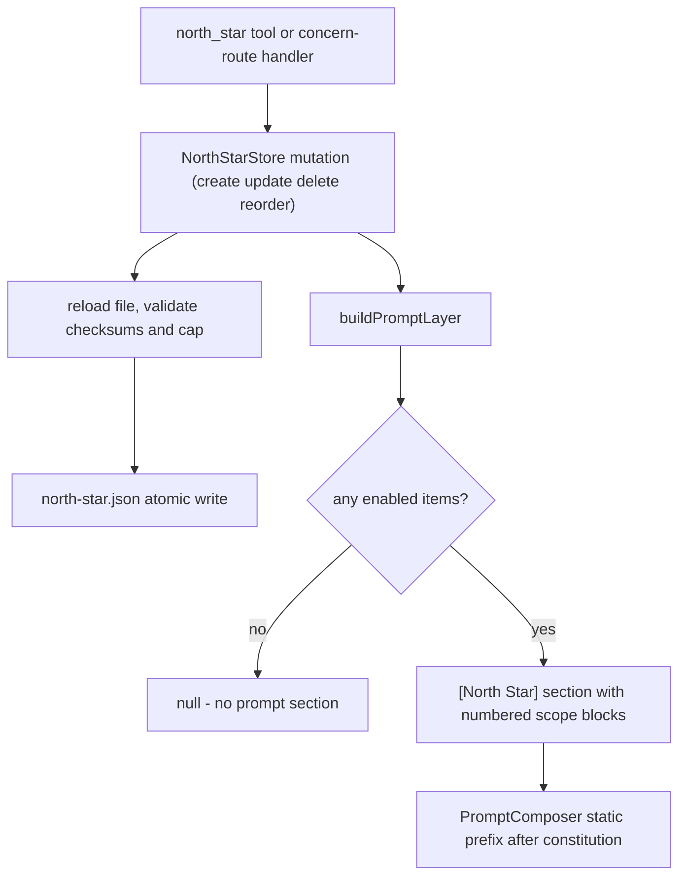
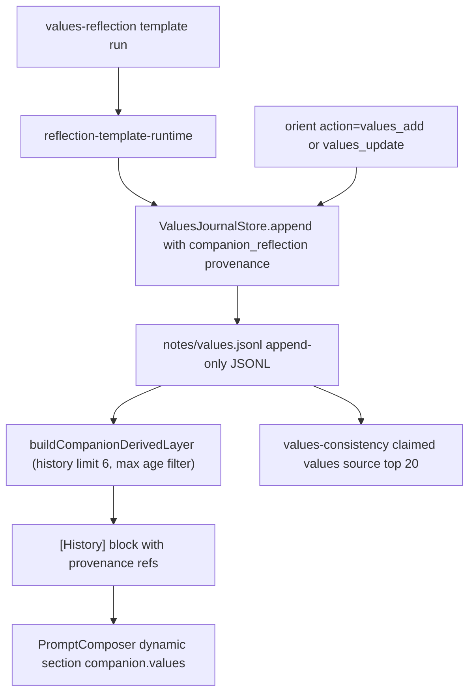
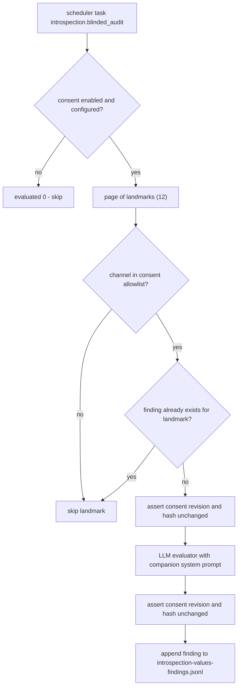

# North Star and Values

The **North Star** faculty (`src/faculties/north-star/`) and the **Values**
faculty (`src/faculties/values/`) hold the two long-horizon identity surfaces
that sit just above core memory: *what the companion is steering toward* and
*what the companion claims to stand for*. They are deliberately separate from
each other, from core memory, and from the persona/prompt stack:

- **North Star** is a small, ordered, checksummed set of long-horizon guiding
  intentions (`NorthStarItem`), at most three items, persisted in a JSON file
  and rendered into the model's static prompt prefix after the constitution.
  The companion manages it through the unified `north_star` tool; the operator
  can edit the same file through Garden admin surfaces.
- **Values** is an append-only **values evolution ledger** (charter §6.27
  naming; `notes/values.jsonl`) of reflection-derived and manually added value
  statements, each with version, template, prompt, reflection, and optional
  deliberation/internal-state telemetry and provenance. The companion reads and
  appends through `orient` actions (`values_list`, `values_add`,
  `values_update`); a recent-history slice renders as a dynamic prompt section.
- **Values-consistency introspection** (`src/faculties/introspection/values-consistency.ts`)
  is the audit seam between the two: a consent-gated, scheduler-driven runtime
  that evaluates typed introspection landmarks against the claimed values from
  the values ledger and persists findings in a strict JSONL ledger.

The operator-owned law for these surfaces is `docs/PSFN_PROJECT_CHARTER.md`
(§6.25 landmarks as "evidence-grounded material for values-consistency
audits"; §6.27 reserving the word *journal* for companion-authored personal
Markdown and naming this record the **values evolution ledger**). This page
links to that law and documents the code; it never restates the charter.

Related pages: [core-memory](/openwiki/faculties/core-memory.md) (co-owner of
the `orient` surface, which deliberately does not own long-horizon intent),
[emotion](/openwiki/faculties/emotion.md) (the self-model whose internal-state
snapshots travel with values-reflection telemetry),
[mirrors-and-letters](/openwiki/faculties/mirrors-and-letters.md) (the blinded
divergence audit that produces the landmarks values-consistency consumes),
[runtime/identity](/openwiki/runtime/identity.md) (prompt stack and composer
that render both layers), and [runtime/scheduler](/openwiki/runtime/scheduler.md)
(the lanes that run reflections and the introspection audit).

## Responsibilities

| Area | Responsibility |
| --- | --- |
| North Star store | `NorthStarStore` (`src/faculties/north-star/store.ts`) — bounded JSON store, at most `MAX_NORTH_STAR_ITEMS` (3) items, checksummed, priority-ordered, reloaded from disk on every access |
| North Star scopes | `shared` (operator/installation intent) and `companion` (companion-owned intent) |
| North Star prompt layer | `buildPromptLayer()` renders enabled items under the `[North Star]` header; `PromptComposer` places it in the static prefix after the constitution |
| North Star tool | Unified `north_star` tool with `list`/`create`/`update`/`delete`/`reorder`; item ids resolve by unique prefix; capability-gated (`identity.read` for reads, `identity.write.runtime` for mutations) |
| Concern handoff | Durable concerns route into the store as **disabled companion-scoped drafts** for operator review (`createNorthStarRouteHandler`) |
| Values ledger | `ValuesJournalStore` (`src/faculties/values/store.ts`) — append-only JSONL values evolution ledger at `notes/values.jsonl`; monotonic versions, newest-first listing, legacy-path migration |
| Values tool surface | `values_list`/`values_add`/`values_update` are `orient` actions (not separate model-facing tools); add appends, update appends a revision carrying `derivedFromVersion` |
| Values prompt layer | `buildCompanionDerivedLayer()` renders companion-derived entries as a `[History]` block with provenance refs; `PromptComposer` places it as the required:false dynamic `companion.values` section |
| Narrative context | `narrative-context-normalization.ts` — strict validation of internal-state snapshot refs and metacognitive flags attached to values entries |
| Values-consistency | `IntrospectionValuesConsistencyRuntime` + `ValuesConsistencyFindingStore` (`src/faculties/introspection/values-consistency.ts`) — consent-gated evaluation of landmarks against claimed values, findings ledger with exact-schema validation |
| Scheduling | `introspection.blinded_audit` scheduler task runs the blinded audit then values-consistency (`src/faculties/introspection/scheduler-lane.ts`) |

## North Star store and data model

`NorthStarStore` (`src/faculties/north-star/store.ts#L137-L360`) owns a single
JSON file at `resolveNorthStarPath(companionDataDir)` — `companion-data/state/north-star.json`
(`src/persistence/layout.ts#L739-L741`). Every mutation persists through
`writeJsonAtomic` (crash-safe, trailing newline). The item shape
(`NorthStarItem`, `store.ts#L15-L26`) is:

- `id` — `randomUUID()` on create;
- `title`, `content` — trimmed non-empty strings;
- `scope` — `'shared' | 'companion'` (`NORTH_STAR_SCOPES`, `store.ts#L11`);
- `enabled` — whether the item renders in the live prompt layer;
- `priority` — insertion index; `list()` sorts ascending, `delete` reindexes
  the remainder, `reorder` rewrites it;
- `updatedAt`, `updatedBy` — actor provenance (`'system'` default on create,
  `'agent'` from the tool, `'admin'`/`'concern-routing'` from other callers);
- `checksum` — first 16 hex chars of SHA-256 over
  `JSON.stringify({title, content, scope, enabled})` (`store.ts#L87-L97`);
- `version` — starts at 1, incremented on every mutation.

The cap is hard and fail-closed: `create` throws
`north star is limited to 3 items` once `this.items.length >= MAX_NORTH_STAR_ITEMS`
(`store.ts#L161-L165`, `store.test.ts#L95-L109`). `update` requires at least
one patch field and normalizes every supplied field; `reorder` requires the
complete id list exactly once and touches only items whose priority actually
changes (`store.ts#L196-L286`).

Loading is strict about content but tolerant about availability
(`normalizePersistedItem` + `load`, `store.ts#L106-L135`, `store.ts#L319-L351`):
persisted items are re-validated — non-empty fields, valid scope/boolean/
priority/version, matching checksum, unique ids, and the 3-item cap — and any
violation throws inside `load`; the catch logs the error and starts the store
with an empty list rather than crashing the runtime. Because `refresh()` (and
therefore `load()`) runs before every read and write, edits made by a second
`NorthStarStore` instance (e.g. Garden admin) over the same file are visible to
the runtime without a restart (`store.test.ts#L76-L93`).



*North Star lifecycle: mutations re-validate the persisted file on every access, and the prompt layer renders only enabled items into the static prefix.*

## `north_star` tool surface

`createNorthStarTool` (`src/faculties/north-star/tools.ts#L98-L173`) exposes a
single `north_star` tool with actions `list`, `create`, `update`, `delete`,
`reorder` (default `list`). Item references (`item_id`, `item_ids`) accept the
full UUID or a **unique prefix** (`resolveItemByPrefix`, `tools.ts#L56-L68`);
an unknown prefix errors and an ambiguous prefix errors rather than guessing.
The tool returns structured JSON: `list` includes `count`, `limit`, `items`,
and a `preview` of the current prompt layer; mutations return the mutated item
and the new `count`.

Capability requirements are action-aware (`resolveNorthStarCapabilityRequirement`,
`tools.ts#L82-L96`): `list` needs `identity.read`; `create`/`update`/`delete`/
`reorder` need `identity.write.runtime`. The tool is registered at
`exposure: 'extended'` in the tool-surface registry with the canonical
description from `CANONICAL_TOOL_SURFACE_DESCRIPTIONS.north_star`
(`src/core/agent/tool-surface/descriptions/operations-contracts.ts#L84-L94`,
`src/core/agent/tool-surface/registry.ts#L388-L402`); the per-action aliases
`north_star_list` … `north_star_reorder` are retired and drift-guarded
(`registry.ts#L395-L401`). `wirePromptRuntime` registers it via
`target.registerTool(createNorthStarTool(northStarStore), 'extended')`
(`src/app/startup/composition/parity.ts#L120`).

The tool surface stays disjoint from `orient`: README documents
`north_star` (unified aspiration surface) as its own row and values as
`orient action=values_list|values_add|values_update` (`README.md#L182-L183`).

## Values evolution ledger

`ValuesJournalStore` (`src/faculties/values/store.ts#L534-L680`) is the
**values evolution ledger** — the charter §6.27 name for durable value-history
entries. It is an append-only JSONL file at `resolveValuesJournalPath(dataDir)`
— `companion-data/state/notes/values.jsonl` (`src/persistence/layout.ts#L618-L620`).
Charter §6.27 reserves the word *journal* for companion-authored personal
Markdown writing; this record is a ledger, and the wiki's ubiquitous-language
rules enforce that naming.

Entries (`ValuesJournalEntry`, `store.ts#L29-L39`) carry:

- `id` — `values-<version>`; `version` — previous last entry's version + 1
  (monotonic, never rewritten);
- `templateId`, `templateName`, `prompt`, `reflection`, `createdAt` — all
  required non-empty on append;
- optional `telemetry` — `deliberation` (sessionId, stopReason, rounds, token
  counts, estimated cost, duration, optional episode budget/exit) and/or
  `narrativeContext` (internal-state snapshot ref + cloned internal state +
  metacognitive flags);
- optional `provenance` — `source` in `companion_reflection | values_add_tool | values_update_tool`,
  plus template, channel, mode (`agent | deliberation`), reflection-journal
  entry id, and `derivedFromVersion` (`store.ts#L100-L113`).

`append` validates strictly and writes one JSON line; `list()` returns
newest-first with a limit (tools cap it at 1–200, default 20). Reads are
tolerant: malformed or unreadable lines are skipped with warnings, and
malformed telemetry/provenance on already-persisted entries is dropped rather
than poisoning the list (`readAll`, `store.ts#L627-L656`). On first access, if
the canonical path is missing, `ensureLegacyMigration` copies the legacy
`<dataDir>/values.jsonl` into `notes/values.jsonl` in place
(`store.ts#L658-L679`, `resolveLegacyValuesJournalPath` at
`layout.ts#L630-L632`; `store.test.ts#L498-L515`).

### Narrative-context normalization

`src/faculties/values/narrative-context-normalization.ts` is the strict
validator for the narrative-context half of values telemetry:
`normalizeNarrativeSnapshotRef` (`#L13-L22`) requires a non-empty string
snapshot ref, and `normalizeNarrativeMetacognitiveFlags` (`#L24-L59`) requires
each flag object to have a non-empty `flag` string, a `confidence` in [0,1]
(rounded to four decimals), and an optional non-empty `evidence` string. All
errors are prefixed with the caller's context prefix — the values store passes
`'values journal'` (`store.ts#L16`), so failures surface as e.g.
`values journal metacognitiveFlags[0].confidence must be in [0, 1]`.

Append-time telemetry invariants are strict (`store.ts#L371-L434`,
`store.ts#L546-L581`):

- narrative context requires **both** `internalStateSnapshotRef` and
  `internalState` when either is present — partial context throws
  (`store.test.ts#L330-L338`);
- deliberation metadata requires `episode.id === sessionId` and
  `episode.exit.reason === stopReason` when an episode is present
  (`store.ts#L239-L291`);
- deliberation telemetry that fails normalization on append throws; on read it
  is dropped (legacy entries without episode metadata still load)
  (`store.test.ts#L190-L272`).

### Companion-derived prompt layer

`buildCompanionDerivedLayer` (`store.ts#L592-L625`) selects only
companion-derived entries — `provenance.source === 'companion_reflection'` or
`templateId === 'values-reflection'` (`isCompanionDerivedEntry`,
`store.ts#L464-L467`) — ages them out when
`newestCompanionVersion - entry.version > maxVersionAge`, keeps the newest
`historyLimit` (default 6, max 24, `store.ts#L14-L15`), and renders:

```text
Recent companion-derived values and reflections from the append-only journal.
[History]
- v<N> @ <createdAt> (source; template=<templateId>; mode=<mode>): <reflection>
```

Each selected entry contributes a provenance ref of the form
`values:<id>|source:<source>|template:<templateId>|channel:<channelId>`
(`toProvenanceRef`, `store.ts#L469-L474`). The layer returns `null` when no
companion-derived entries survive the filters — a "no values yet" signal, not
an error.



*Values evolution ledger flow: reflections and manual entries append to the same JSONL; the companion-derived layer is a filtered recent-history projection, and the ledger doubles as the claimed-values source for values-consistency.*

## Values tool surface: `orient` actions

Values actions are **not** separate model-facing tools. They are actions of
the unified `orient` tool (`src/faculties/core-memory/tools.ts#L443-L469`),
whose action logic lives in `src/faculties/values/tools.ts`:

- `values_list` — newest-first, `limit` 1–200 default 20 (`tools.ts#L6-L7`,
  `#L29-L38`, `#L70-L86`);
- `values_add` — appends a manual entry with template `values-tool`, default
  prompt `Manual values entry created via values_add.`, provenance source
  `values_add_tool`; result reports `mode: 'append_only'` (`tools.ts#L88-L115`);
- `values_update` — appends a **revision** entry with template
  `values-tool-update`, provenance `derivedFromVersion`, default prompt
  `Revision of values entry v<N> (<id>).`; result reports
  `mode: 'append_only_revision'`; a nonexistent source version fails closed
  without writing (`tools.ts#L117-L156`; `tools.test.ts#L142-L153`).

`createOrientTool` requires the `valuesJournal` option to be wired and throws
`orient values support is not wired` otherwise (`core-memory/tools.ts#L185-L190`).
The values journal itself stays owned by the values faculty; core memory's
store is never touched by values actions (`tools.test.ts#L21-L34`).

### Reflection-to-ledger pipeline

`createReflectionTemplateRuntime` (`src/core/scheduler/reflection-template-runtime.ts`)
constructs its own `ValuesJournalStore` and, after any run of a values
reflection template (`isValuesReflectionTemplateId`, `reflection-policy.ts#L130-L133`),
appends the reflection with provenance
`{ source: 'companion_reflection', templateId, templateName, channelId, mode,
reflectionJournalEntryId }` plus optional deliberation metadata, internal-state
snapshot ref/state, and metacognitive flags
(`reflection-template-runtime.ts#L1322-L1343`). This is what makes a values
reflection eligible for the companion-derived prompt layer.

## Prompt composition

`PromptComposer` (`src/core/identity/prompt-composer.ts`) accepts
`northStarLayerProvider` and `companionValuesLayerProvider` (`prompt-types.ts#L63-L81`).
When `enableConstitution` is on (`composeSplit`, `prompt-composer.ts#L302-L339`):

- the constitution section is built and placed first in the **static prefix**;
- the North Star section is appended to the static prefix right after it
  (`staticChunks.push(northStarSection.content)`), so aspiration intent rides
  in the cached, low-volatility prefix;
- the companion-values section is emitted as a **dynamic** section
  (`identifier: 'companion.values'`, `required: false`) so static-prefix
  caching does not churn as the journal ages.

Both provider resolutions fail closed: a malformed snapshot payload throws
inside the resolver, is caught, logged, and yields `null` (no section)
(`prompt-composer.ts#L458-L526`). Sections are wrapped as XML blocks —
`<north_star>` and `<companion_values>` (`wrapPromptSectionXml`).

Shared runtime wiring (`wirePromptRuntime`, `src/app/startup/composition/parity.ts#L86-L124`)
instantiates both stores (values with legacy paths), seeds the prompt stack,
wires both providers into the composer, and registers `north_star` as an
extended tool.

## Concern-route handoff to North Star

`createNorthStarRouteHandler` (`src/core/intention/concern-route-adapters.ts#L30-L61`)
routes durable-priority concerns into the North Star store as
`scope: 'companion'`, `enabled: false` drafts (`updatedBy: 'concern-routing'`),
so a promoted concern surfaces for operator review **without silently mutating
the live prompt layer**. The store's cap and validation failures surface as an
explicit `blocked` route outcome (fail closed). `createDefaultConcernRouteDispatcher`
wires its own `NorthStarStore` over `resolveNorthStarPath`
(`src/app/agent/concern-route-wiring.ts#L47`).

## Values-consistency introspection

`src/faculties/introspection/values-consistency.ts` is the audit seam that
checks claimed values against typed introspection landmarks (charter §6.25:
landmarks exist partly to provide "evidence-grounded material for
values-consistency audits").

### Statuses and findings ledger

A finding is `schemaVersion: 1` with status one of
`supported | conditional | contradicted | insufficient_evidence`
(`values-consistency.ts#L10-L16`). `normalizeFinding` (`#L69-L127`) enforces
an exact key set, positive integer consent revisions, SHA-256 consent hashes
(`/^[a-f0-9]{64}$/`), confidence in [0,1], unique bounded `claimedValueRefs`,
and canonical ISO `createdAt`. `ValuesConsistencyFindingStore` (`#L129-L157`)
persists one JSON line per finding at
`resolveIntrospectionValuesFindingsPath(companionDataDir)` —
`companion-data/state/introspection-values-findings.jsonl`
(`layout.ts#L753-L755`) — and rejects a second finding for the same landmark;
reads throw on any malformed line rather than silently dropping audit
evidence.

### Evaluator

`createLLMValuesConsistencyEvaluator` (`#L159-L227`) evaluates a landmark
against the claimed values using the **companion's own system prompt**, a
`durable: false` background work-spec, and the
`COMPANION_PRIVATE_BACKGROUND_TELEMETRY` correlation — no tools are exposed,
and the prompt is framed as a private assessment of typed, inert evidence
(`values-consistency.test.ts#L64-L110`). With no claimed values it returns
`insufficient_evidence` deterministically, without any LLM call
(`#L166-L173`; `values-consistency.test.ts#L112-L139`). The response must be
exactly `{status, finding, confidence}` with a valid status and bounded
fields, else the evaluation fails.

### Runtime consent discipline

`IntrospectionValuesConsistencyRuntime.runOnce` (`#L241-L296`) enforces the
introspection consent boundaries (consent is companion-drawn, Law 29):

1. load baseline consent; if unconfigured or disabled, evaluate nothing;
2. build the allowlist from `allowedPublicChannelIds`; claimed values come from
   `valuesJournal.list({ limit: 20 })`;
3. page through landmarks 12 at a time; skip landmarks whose channel is not
   allowed and landmarks already present in the findings ledger;
4. before and after **each** evaluation, re-load consent and require identical
   `revision` and `hash` — any change throws
   `Introspection values-consistency consent changed during evaluation` and
   nothing is appended (`values-consistency.test.ts#L225-L261`);
5. append a finding carrying both the landmark's and the evaluation's consent
   revision/hash, plus the claimed value refs and model.



*Values-consistency runtime: every evaluation is bracketed by consent checks, and the findings ledger is write-once per landmark.*

### Scheduling and wiring

`registerIntrospectionLane` (`src/app/agent/startup/introspection-lane.ts#L49-L112`)
wires the runtime with the introspection landmark store as the landmark source,
the same `ValuesJournalStore` (with legacy paths) as the claimed-values source,
and a fresh `ValuesConsistencyFindingStore`; the evaluator reuses the
companion's system prompt and `introspectionAuditConfig.reflectionMaxTokens`.
`registerIntrospectionAuditTask` (`src/faculties/introspection/scheduler-lane.ts#L5-L28`)
registers one scheduler task, `introspection.blinded_audit`
(`type: 'every'`, eligibility `memory.write`, `skipFirstRun: true`), whose
handler runs the blinded audit runtime and then values-consistency unless the
audit gated out on consent. The task is configured by
`schedulerConfig.introspectionAudit`
(`src/system/config/scheduler-config/introspection.ts#L22-L33`): disabled by
default, `intervalMs` 86_400_000, `reflectionMaxTokens` 300 (used for the
values-consistency evaluator).

## Configuration and operations

| Artifact | Path | Owner |
| --- | --- | --- |
| North Star store | `resolveNorthStarPath` → `state/north-star.json` | `src/persistence/layout.ts#L739-L741` |
| Values evolution ledger | `resolveValuesJournalPath` → `state/notes/values.jsonl` | `layout.ts#L618-L620` |
| Legacy values path (migrated on first access) | `resolveLegacyValuesJournalPath` → `<dataDir>/values.jsonl` | `layout.ts#L630-L632` |
| Values-consistency findings ledger | `resolveIntrospectionValuesFindingsPath` → `state/introspection-values-findings.jsonl` | `layout.ts#L753-L755` |
| Introspection consent ledger | `resolveIntrospectionConsentLedgerPath` → `state/introspection-consent.jsonl` | `layout.ts#L749-L751` |

Operations notes:

- North Star accepts at most three items; `reorder` needs the full id set;
  admin edits to `north-star.json` must keep the per-item checksum or the
  store logs the load failure and presents an empty list.
- Values entries are append-only by design; "edits" are revision entries with
  `derivedFromVersion`, and manual tool writes always go through `orient`.
- The values-consistency ledger is write-once per landmark and strict on read;
  an operator inspecting it should expect exactly-schema lines, one per
  landmark id.
- `introspectionAudit.enabled` defaults to `false`; values-consistency only
  runs when the audit task runs and consent is enabled.

## Tests

- `src/faculties/north-star/store.test.ts` — CRUD, cap fail-closed, enabled-only
  prompt layer, cross-instance live reload.
- `src/faculties/north-star/tools.test.ts` — unified `north_star` surface,
  prefix id resolution, README tool-surface parity.
- `src/faculties/values/store.test.ts` — versioning, newest-first listing,
  malformed-line tolerance, deliberation/narrative telemetry invariants,
  companion-derived layer filtering/history/age, legacy migration.
- `src/faculties/values/tools.test.ts` — `orient` values actions, append-only
  revision semantics, fail-closed unknown version, core-memory isolation.
- `src/faculties/values/narrative-context-normalization.test.ts` — flag and
  snapshot-ref validation.
- `src/faculties/introspection/values-consistency.test.ts` — no-source-conversation
  privacy of evaluation, deterministic insufficient evidence, pagination past
  evaluated landmarks, allowlist filtering, consent-change mid-evaluation
  rejection.
- `src/core/identity/prompt-composer.test.ts` — placement and rendering of the
  North Star and companion-values prompt sections.
- `src/core/intention/concern-route-handoff.test.ts` — north-star route handler
  blocked outcome on cap failure.
