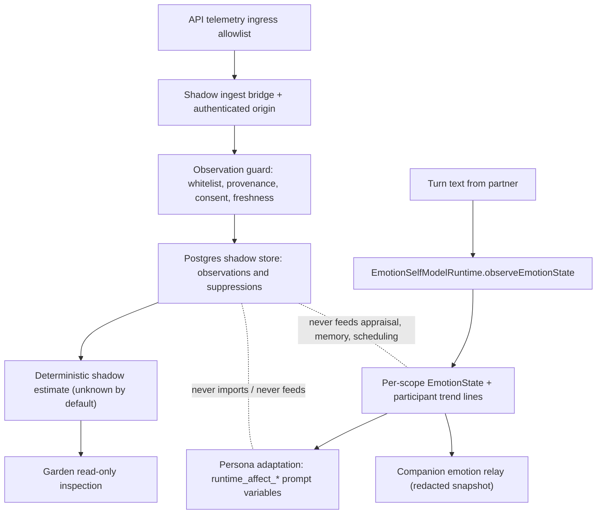

# Partner Affect

Partner affect is the companion's governed account of emotion on **both sides of
the relationship**, and the boundaries that decide what it may infer and how it
may express its own state. It is the answer to two questions: *what can the
companion know about the human's emotional state*, and *how does its own
measured affect shape how it responds*.

The faculty splits into four connected slices:

1. **Partner-affect appraisal (shadow foundation)** — the fail-closed pipeline
   that screens authorized external telemetry about the partner, records
   accepted/suppressed Signal Observations, and projects a deterministic
   evidence-health estimate. Everything here is **shadow-only**: it exists for
   Garden inspection and evaluation and is deliberately unreachable as
   behavioral authority (enforced by a static source-scan test).
2. **Participant trends (E6.3)** — deterministic per-participant emotional
   trend lines inside group rooms, fed only by each participant's own messages,
   persisted across restarts. This is how the companion models "how this person
   is toward me" separately from the room's aggregate emotion.
3. **Persona adaptation** — how the companion's own measured affect
   (`EmotionStateSnapshot` VAD/mood/discrete/confidence) is projected through a
   trust gate and an emotional-expression profile into the
   `runtime_affect_*` prompt variables that shape its displayed behavior.
4. **Companion emotion relay (bead 7ang.1)** — a redacted, content-free
   per-turn emotion snapshot published to companion satellites.

The companion's own self-affect pipeline (classifier → `EmotionState` →
scoped-emotion → narrative appraisal) is the behavioral surface of this
faculty and is documented in depth on the [emotion](/openwiki/faculties/emotion.md)
page; this page covers how that surface meets the partner side and how its
measured signals are expressed.

## The two affect surfaces

Caption: The two affect surfaces — the shadow-only partner-affect observation
foundation (top) and the behavioral companion-affect surface (bottom) — with
the isolation boundary that keeps shadow output out of behavior.

The partner-affect shadow surface is **inspection-only**. Its contracts state
that nothing in the foundation may feed prompts, emotion appraisal, memory
candidacy, scheduling, notifications, or world actions, and
`partner-affect-shadow-isolation.test.ts` fails the build if a new importer
appears outside the reviewed allowlist (or if a behavioral subsystem, a bus
subscriber, or raw SQL outside the persistence layer reaches the shadow
surfaces).

## Partner-affect appraisal: the shadow observation foundation

"Appraisal" here is deliberately different from the companion's narrative
self-appraisal: it is a **deterministic, model-free evidence projection** over
accepted partner Signal Observations. The design lives in
`docs/partner-affect.md` (slice 1 shipped: contracts and shadow observations;
the composite estimate, Support Posture state machine, and Affect Advisory ICP
message remain intended behavior, not shipped code). It applies the charter's
core laws — Law 27 (contextual weighting), Law 29 (consent by analogy),
Law 34 (provenance and taint), Law 35 (no implicit cross-companion sharing),
Law 36 (reversible guidance) — rather than creating exceptions.

### Contracts: Signal Observations, families, directions, assertion bases

`src/shared/contracts/partner-affect.ts` defines the observation foundation;
everything in the file is shadow-scoped.

- **Signal Families** are independence groups: `self_report`, `conversation`,
  `sleep`, `activity`, `presence`, `interaction_cadence`, `schedule_context`,
  `personal_operations`. Several metrics from one family share one evidence
  budget; independence quorums count families, never raw observations.
- **Direction** (`higher_supports_need` | `lower_supports_need` | `unknown`)
  is partner-specific configuration, never a source claim; `unknown` can never
  raise a future composite. The guard stamps it from
  `policy.directions["family.metricName"]` (default `unknown`).
- **Assertion basis** (`partner_asserted` | `model_inferred` |
  `sensor_summary` | `unverified`) records how the observation relates to the
  partner's own voice. A `model` or `classifier` anywhere in provenance forces
  `model_inferred`; a self-declared `self_report` over telemetry degrades to
  `unverified`; `partner_asserted` is reserved for a future trusted in-runtime
  self-report path and is **not reachable** from the external-telemetry
  ingress. Inference or an unverifiable claim must never be stamped as
  partner-asserted fact.
- An accepted `PartnerAffectObservation` is a provenance-bearing, time-bounded
  **summarized scalar** from one authorized source, bound to exactly one
  canonical partner contact, with a stable idempotency key
  `observationKey = sourceId:observationId`.
- A `PartnerAffectSuppressedObservation` carries reason codes and routing
  identity only — never the rejected payload content — so revoked or
  raw-sensitive material cannot leak through the audit trail.
- There are 18 suppression reason codes (for example `raw_sensitive_payload`,
  `malformed_observation`, `unregistered_source`, `revoked_source`,
  `consent_mismatch`, `future_observation`, `stale_observation`,
  `missing_provenance`).

### Observation guard: the fail-closed door

`guardPartnerAffectObservation` (`src/core/emotion/partner-affect/observation-guard.ts`)
is the single boundary between raw external payloads and the shadow store:

- **Payload whitelist**: only 17 named scalar keys may appear. Any other key —
  raw coordinates, biometric streams, message bodies, purchase line items,
  third-party content, however named or nested — suppresses the candidate as
  `raw_sensitive_payload`. Key names are not echoed into the audit record.
- **Provenance screening**: provenance entries are screened key-by-key
  (whitelisted provenance keys, bounded token pattern for `model`/`classifier`/
  `provenanceRef` free text, at most 8 entries, enum validation) **before** the
  shared emotion-telemetry normalizer sees them, because that normalizer is
  length/charset-blind and throws with inlined raw values. A suppressed record
  interpolates only structural codes, never a rejected value.
- **Consent registry is the authority**: the source must be registered in
  `policy.sources`, not revoked, its `consentRef` must match exactly, the
  Signal Family must be consented for the source and enabled by policy, and the
  metric must exist in the source's authorized scalar schema with matching unit
  and in-range value. Claimed payload consent refs can only match, never
  authorize.
- **Window and freshness**: `0 <= windowStartMs <= windowEndMs`,
  `observedAtMs` must fall inside the window, forward clock skew beyond
  `PARTNER_AFFECT_CLOCK_SKEW_TOLERANCE_MS` (120 s) is `future_observation`,
  and anything older than `policy.staleAfterMs` is `stale_observation`.
  Confidence below `policy.minConfidence` suppresses as `low_confidence`.
- **Exact partner binding**: the observation must name the configured
  canonical `policy.partnerContactId` (`wrong_partner` otherwise); the
  suppression audit context is scoped to the bound partner, not to any contact
  the payload names.
- It collects **every** applicable suppression reason (not first-fail) so the
  Garden audit can show a complete explanation, and it throws on an
  inconsistent accept state rather than returning a partial observation.

On acceptance the guard stamps what sources cannot claim: `direction` from
policy, `sensitivity` and `consentRef` from the registry, `assertion` derived
from provenance, and `missingness` defaulting to `1 - coverage`.

### Ingest bridge: shadow-only observer on the telemetry spine

`createPartnerAffectShadowIngestBridge`
(`src/core/emotion/partner-affect/shadow-ingest-bridge.ts`) subscribes to
`external.telemetry.ingested` and:

- Filters to `external.telemetry.partner_affect.observation` events only.
- **Authenticated origin check**: before any payload interpretation, the
  event's `auth.principalMode` must be `api_key` and the principal id must be
  bound to the claimed `sourceId` in the policy's `apiKeyPrincipalIds`;
  otherwise the candidate is suppressed as `missing_authenticated_origin`.
  Payload-claimed identities are never trusted without the credential that
  authenticated the request.
- Routes accepted/suppressed candidates through the guard, records the outcome
  in the shadow store, prunes to the retention cap after every record, and
  emits only structural telemetry counters (`accepted`, `suppressed`,
  `duplicate`, `store_error`).
- Replays are expected: `recordAccepted` reports `inserted: false` for a
  duplicate `(sourceId, observationId)` key and the bridge counts it as
  `duplicate`, never an error; the first accepted record stays authoritative.
- **Fail-inert**: unless `policy.enabled` is true with a non-null
  `partnerContactId` (which the config contract only allows together), the
  factory returns an `InactivePartnerAffectShadowIngestBridge` — byte-identical
  to no bridge at all: no subscription, no records.

### Shadow estimate: deterministic, model-free, `unknown` by default

`computePartnerAffectShadowEstimate`
(`src/core/emotion/partner-affect/shadow-estimate.ts`) projects per-family
evidence health from accepted observations:

- For every policy-allowed family it computes fresh count, latest observed
  time, freshness (`fresh` | `stale` | `missing`), max confidence, max
  coverage, min missingness, conflict flag, contributing source ids, and
  assertion bases. The family list always covers every allowed family so
  missing evidence stays explicit instead of disappearing.
- **`unknown` is the honest default**: missing, stale, low-confidence, or
  conflicting evidence is never promoted to an ordinary/healthy claim.
  `ordinary` requires a fresh, usable, conflict-free quorum: at least
  `minIndependentFamilies` fresh families with `coverage > 0`,
  `missingness < 1`, and `confidence >= minConfidence`. Reason codes explain
  the outcome (`no_fresh_evidence`, `insufficient_family_quorum`,
  `conflicting_evidence`, `low_confidence_evidence`, `partner_unbound`,
  `quorum_met`).
- **Cross-source conflicts stay explicit and block `ordinary`**: two fresh
  values for the same family+metric from different sources conflict when
  `|a - b| > tolerance * max(1, |a|, |b|)`. Conflicts are never averaged away
  and never declare either source false.
- The estimate is defensively scoped to the configured partner
  (`partnerContactId === policy.partnerContactId`), records
  `derivation: 'deterministic_shadow_v1'` and `policyRevision`, and is a pure
  function of observations + policy + now — the same inputs always produce the
  same estimate. There is deliberately no posture, score, or directional claim
  in this slice.

### Persistence: Postgres shadow store

`PostgresPartnerAffectShadowStore`
(`src/persistence/postgres/partner-affect-shadow-store.ts`) implements
`PartnerAffectShadowStorePort`:

- `recordAccepted` inserts with `ON CONFLICT (source_id, observation_id)
  DO NOTHING` and returns `inserted: false` on replay; `recordSuppressed`
  appends a structural audit row (reasons JSONB, bounded `detail`).
- `listAccepted` and `listSuppressed` return newest-first rows, both scoped to
  an exact partner contact when a filter is given; suppression rows from a
  prior binding, a different partner, or the unbound state never surface under
  a non-null filter.
- `pruneToRetentionCap` deletes oldest rows beyond the cap from **both**
  tables and returns the total removed.
- Row mapping is fail-closed: unsupported schema versions, unknown signal
  families, directions, or assertion bases, and malformed suppression reasons
  throw instead of surfacing corrupted records.
- Migrations (`src/persistence/postgres/migrations.ts`) create
  `partner_affect_shadow_observations` and `partner_affect_shadow_suppressions`
  with CHECK constraints on window ordering, unit intervals, direction and
  assertion enums, non-empty JSONB provenance, and size caps on provenance and
  reasons JSON, plus partner-scoped indexes for the list orderings.
- The store is constructed in `src/persistence/runtime-factory.ts`
  (`PostgresPartnerAffectShadowStore.connect` with tenant schema/role) and
  wired into the agent entrypoint (`src/app/agent/main.ts`) and the Garden
  admin surface.

### Configuration and operations

The owner file `partner-affect-shadow.json` (seeded from
`config/partner-affect-shadow.seed.json`, validated by
`src/system/config/partner-affect-shadow-config.ts`) is the JSON-owned policy.
The subsystem **ships disabled and partner-unbound**; both must be explicitly
configured before any observation is accepted, and validation throws if
`enabled` is true while `partnerContactId` is null. Every mutable knob lives
here — there are no hidden module constants.

| Field | Seed default | Meaning |
|---|---|---|
| `enabled` | `false` | Master switch; requires a bound partner |
| `partnerContactId` | `null` | Exact canonical partner contact (null = inert) |
| `staleAfterMs` | 86 400 000 (24 h) | Reject older than this at ingest |
| `evidenceWindowMs` | 259 200 000 (72 h) | Estimate freshness window |
| `minConfidence` | 0.35 | Minimum accepted confidence and quorum bar |
| `minIndependentFamilies` | 2 | Independence quorum for `ordinary` |
| `conflictValueTolerance` | 0.25 | Cross-source conflict tolerance |
| `allowedSignalFamilies` | 7 of 8 families | Pack-owned `personal_operations` excluded |
| `directions` | `{}` | Per-metric partner-specific direction |
| `sources` | `[]` | Authorized-source registry (families, API-key principals, metric schema, consentRef, sensitivity, revoked) |
| `maxRetainedObservations` | 5 000 | Shadow retention cap per table |
| `policyRevision` | `shadow-v1` | Recorded in every estimate for audit |

### Garden inspection surface

The read-only Garden surface
(`src/operator/garden/services/partner-affect-shadow-service.ts` and
`src/operator/garden/routes/partner-affect-shadow-routes.ts`) exposes:

- `GET /api/admin/partner-affect/shadow` — the current policy summary plus the
  deterministic shadow estimate with per-family evidence health.
- `GET /api/admin/partner-affect/observations` — recent accepted and
  suppressed records (suppression audit scoped to the currently bound
  partner), newest-first, bounded limit.
- The service loads a **fresh** policy per read so Garden edits are reflected
  without restart, and returns 503 when no shadow service is wired rather than
  fabricating an empty-but-healthy state.

## Participant trends: modeling each person's emotional state (E6.3)

Inside a group room, one person being cruel and another being protective must
move the companion's stance toward each of them **separately**. The scoped
emotion layer (E1.5) keys transient affect per DM/room but cannot tell who did
what inside a room. Participant trends
(`src/core/emotion/participant-trends.ts`, `participant-trend-persistence.ts`)
supply the deterministic substrate for that distinction.

### Deterministic EMA substrate

- A `ParticipantEmotionTrend` is a slow EMA of **one participant's own message
  VAD** (clamped to [-1, 1] per axis) plus a discrete-label EMA and an
  `interactionCount`. It is keyed by the stable participant identity (canonical
  contact key, else `authorId`).
- Accumulation is pure arithmetic over the `EmotionObservation` the scoped
  emotion layer already computed for the turn — **zero LLM/classifier calls**
  happen in the trend path. Orientation moves slowly (EMA) so no single
  sentence swings a trend line; idle participants never appear in a turn's
  author slot, so their trends stay put by construction.
- Discrete labels absent from the latest observation decay toward 0 (same EMA
  with target 0); labels below `DISCRETE_PRUNE_EPSILON` (1e-3) are dropped and
  at most `DISCRETE_LABEL_CAP` (16) labels are retained, keeping growth
  bounded.

### Meaningful-movement gate

`participantMovementIsMeaningful(trend, thresholds)` requires **both** a
minimum interaction volume (`minInteractions`) and a minimum VAD displacement
(max-axis `participantTrendMagnitude >= minTrendDelta`) before a participant's
trend may move orientation toward them — a single sentence or a barely-nonzero
drift never counts. The runtime exposes this as
`hasMeaningfulParticipantMovement(roomKey, participantKey)` and hands out
cloned trends via `getParticipantTrend` / `getRoomParticipantTrends`.

### Room maintenance and persistence

`maintainRoomTrends` enforces the two bounded-scale rules **in place**:
evict trends untouched longer than `staleEvictionSeconds`, then — if still over
`maxTrackedParticipantsPerRoom` — evict the least-recently-updated first. It
returns the evicted keys so the caller can delete them from the store too.

`ParticipantTrendStorePort` (`loadRoom` / `saveTrend` / `deleteTrends`)
persists trends so a room's orientation survives restart. Normalization is
fail-closed (VAD axes finite and clamped, `interactionCount` a non-negative
integer, `updatedAt` an ISO timestamp). The runtime lazy-loads a room's trends
on first touch (`ensureRoomTrendsLoaded`) and gives in-memory updates
precedence over stale persisted reads.

### Runtime wiring and carry-over integration

In `EmotionSelfModelRuntime.observeEmotionState`
(`src/core/agent/substrate-agent/emotion-self-model-runtime.ts`), the turn
path (`turn-execution/pre-turn-state.ts`) passes the author's participant key
alongside the message; `accumulateParticipantTrend` folds the already-computed
observation into that author's room trend — only when
`participantTrends.enabled` is true, the scope is a group room, and an author
key is present — then enforces cap/stale eviction and persists. The trend
becomes a carry-over source only under the explicit behavior flag
`carryOverUsesParticipantTrend` (default `false`, preserving the E1.5
aggregate-VAD contract); when on, `resolveCarryOverSourceVad` uses the DM
contact's own trend VAD, and only when the trend is "meaningful".

Defaults (owner-file `emotionScoping.participantTrends`): `enabled: true`,
`emaAlpha: 0.12` (slow — roughly 7–10 of a participant's own messages to
approach their level), `maxTrackedParticipantsPerRoom: 16`,
`staleEvictionSeconds: 14 days`, `minInteractionsForMovement: 3`,
`minTrendDelta: 0.1`.

## Measured affect → persona adaptation

`src/core/emotion/persona-adaptation.ts` turns the companion's own measured
affect (`EmotionStateSnapshot`: VAD, mood, discrete, confidence) into the
behavioral register the model is instructed to use — without the companion
advertising raw numbers as ground truth.

### Emotional expression profile

`resolveEmotionalExpressionProfile` merges two sources with **config
precedence over prompt variables**: prompt-variable keys (`hexaco_*`,
`extensions_hexaco_*`, `character.hexaco.*`, bare aliases) and nested config
paths (`emotionAffect.emotionalExpression.*`, `hexaco.*`, …). Defaults:
`intensity 0.5`, `variability 0.5`, `control 0.6`, `displayRange [0, 0.8]`.

### Trust-gated affect behavior

`mapEmotionToPersonaAffect` projects the snapshot through a trust gate and the
profile:

- **Trust gate** (`resolveTrustGate`): `primary` → `honne` (genuine,
  expressivity ceiling 1, control floor 0); `trusted` → `tatemae`
  (ceiling 0.82, floor 0.35); `regular` → `tatemae` (0.66 / 0.55); `public` →
  `tatemae` (0.5 / 0.75). Lower trust means tighter expressivity ceilings and
  higher control floors, so the same internal emotion displays differently
  across audiences.
- The profile's `variability` blends mood (the settled baseline) against the
  momentary VAD; `intensity` scales the blended VAD (lerp 0.55→1.45); effective
  control is `max(profile.control, trustGate.controlFloor)` and damps the
  signal; the trust ceiling and the snapshot's confidence
  (`confidenceScale = 0.35 + confidence * 0.65`) scale it further; the display
  range bounds the result.
- Output axes: `warmth` (valence), `energy` (arousal), `assertiveness`
  (dominance), `formality` (a fixed linear blend: `-0.65·warmth -0.25·energy
  -0.1·assertiveness`), and `expressiveness` (VAD intensity 0.7 + discrete
  peak 0.3, then control-dampened), plus the resolved `profile`.

### Prompt variables and wiring

`buildEmotionalAffectPromptVariables` is **empty-safe**: with no emotion
snapshot it returns `runtime_affect_snapshot_present: 'false'` and blank
values, so templates prune the section. With a snapshot it emits atomic
`runtime_affect_*` values (mode + honne/tatemae flags, warmth/formality/energy/
assertiveness/expressiveness, profile axes, raw VAD/mood/confidence) and
directional guidance labels (`runtime_affect_guidance_*`). Per the E2.5 purity
rule it emits **bare values only** — no prose privacy guidance and no
duplicate `profile_*`/`snapshot_vad_*` spellings; phrasing lives in the
templates. `buildRuntimeContext` (`src/core/agent/substrate-agent/runtime-context.ts`)
spreads these into the prompt variable set on every turn.

## Companion emotion relay (bead 7ang.1)

The measured affect signals also cross the relay boundary to companion
satellites, redacted at the source:

- `extractRelayAcacAxisScores` (`src/core/emotion/relay-emotion-snapshot.ts`)
  extracts **only** the ACAC axis scores from a self-report snapshot; the axis
  `rationale` text is deliberately dropped at the source so it never enters the
  agent event bus, the RPC boundary, or a relay payload. Returns `undefined`
  when no ACAC snapshot is present so the caller omits the field entirely.
- The post-turn path (`src/core/agent/substrate-agent/turn-execution-runtime.ts`)
  emits `agent.emotion.snapshot` with `trigger: 'post_turn'`, VAD, mood,
  discrete, confidence, and the ACAC axis scores — fire-and-forget, so a relay
  failure can never break the turn.
- A second emitter fires on a significant movement: when a post-turn appraisal
  succeeds on a `vad_shift` and the runtime's `onEmotionSnapshot` sink is
  wired, a content-free snapshot (`EmotionSnapshotRelayInput`: VAD, mood,
  discrete, confidence, channelId) is relayed (`src/core/agent/substrate-agent.ts`).
- The `agent-forwarder` (`src/channels/backplane/companion-relay/agent-forwarder.ts`)
  redacts again via `redactEmotionSnapshot` — VAD + mood vectors, top-K
  discrete scores, aggregate confidence, and ACAC axis scores only, no
  rationale, concerns, salient entities, or telemetry provenance — and
  publishes `emotion.snapshot` to satellites that advertise the emotion output
  surface (deny-by-default scope).

## Appraisal and the telemetry-trust gate

The companion's narrative emotion appraisal (`EmotionAppraisal`,
`src/core/emotion/appraisal.ts` — detailed on the emotion page) is the
behavioral instrument that interprets the companion's own state, and it is
explicitly gated on telemetry trust: both `reserveNarrativeAppraisal` and
`admitDurableDecision` skip with `untrusted_telemetry` when the appraisal-state
projection reports `telemetry.status !== 'trusted'`. The shadow observation
foundation can never influence this gate — the isolation boundary is
mechanical, not advisory. The appraisal prompt itself downgrades VAD, mood, and
discrete values to "fallible automata-derived signals", prefers the
conversation on disagreement, and reports unclear reads plainly rather than
constructing them.

## Invariants and failure semantics

- **`unknown` is the default and absence is never recovery**: stale shadow
  evidence degrades the estimate to `unknown`; missingness stays visible;
  conflicts block `ordinary` and are never averaged away.
- **Rejected content never enters the system**: whitelisted scalar values
  only, structural reason codes only, bounded provenance tokens only — at the
  API door, at the guard, and in the audit trail.
- **Direction and consent are operator-owned**: sources cannot claim a
  direction, self-report a higher assertion basis, or authorize themselves.
  Revocation stops future acceptance immediately without erasing the audit
  trail.
- **Exactly-once shadow persistence**: the `(source_id, observation_id)` key
  makes telemetry replay idempotent, with the first accepted record
  authoritative.
- **Fail-inert when unconfigured**: disabled or unbound shadow policy is
  byte-identical to no shadow subsystem at all.
- **Shadow output is unreachable as behavioral authority**: the static
  isolation test holds imports, bus subscriptions, and table access to the
  reviewed allowlist — and asserts the inverse, that the agent entrypoint still
  wires the bridge and store so shadow-only does not degrade into dead code.
- **Appraisal never runs on stable or untrusted state**: stable VAD does not
  appraise regardless of turn count; restart seeds a reference baseline without
  a synthetic appraisal; pending decisions deduplicate; stale or mismatched
  durable decisions are rejected.
- **Trends are slow and bounded**: EMA orientation, meaningful-movement gates,
  per-room participant caps, and stale eviction keep trends from swinging on
  single messages or accumulating forever.

## Extension points

- **New Signal Family**: extend `PARTNER_AFFECT_SIGNAL_FAMILIES` in the
  contract, the family list in the estimate, the seed/owner file
  `allowedSignalFamilies`, and any source metric schema.
- **New source or metric**: add a `PartnerAffectSourceAuthorization` with its
  API-key principals, metric scalar schema (unit, min/max), consentRef,
  sensitivity, and revoked flag in the owner file.
- **Future slices** (documented in `docs/partner-affect.md`, not shipped):
  personal baselines and directional deviation, the composite estimate, the
  Support Posture state machine, and the Affect Advisory ICP message.
  Slice-1 outputs must remain shadow-only until those boundaries are
  deliberately reviewed.
- **Participant-trend consumers**: `getParticipantTrend` /
  `getRoomParticipantTrends` / `hasMeaningfulParticipantMovement` are the
  reviewed consumption surfaces; the carry-over behavior flag
  `carryOverUsesParticipantTrend` is the only place a trend may change
  companion affect behavior today.
- **New appraisal triggers**: the current `EmotionAppraisalTrigger` set is
  exactly `'vad_shift'`; adding triggers means revisiting the gate definition,
  the reservation protocol, and the chain-feed wording (`runtime_emotion_appraisal_*`
  macros).
