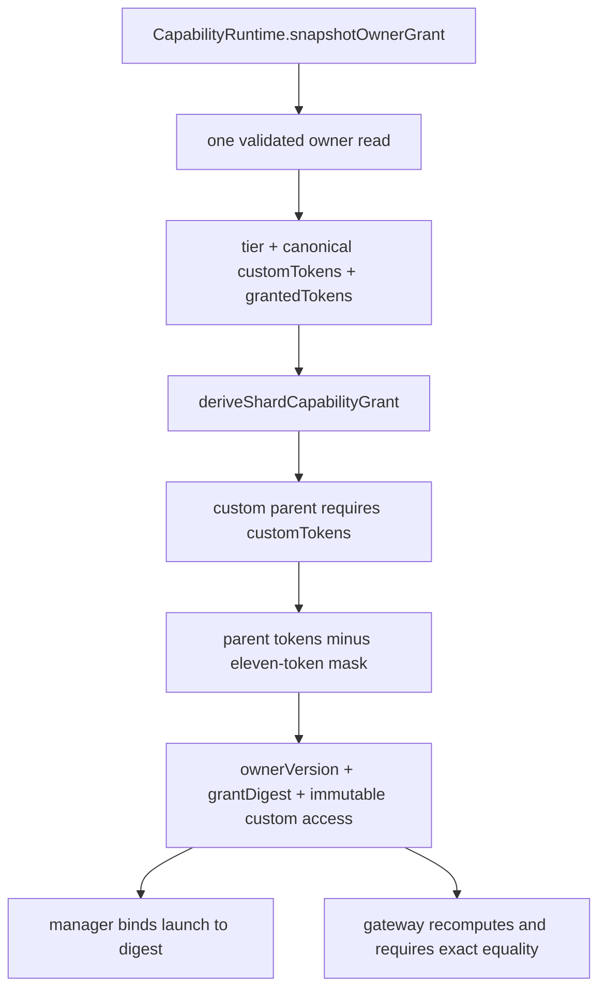
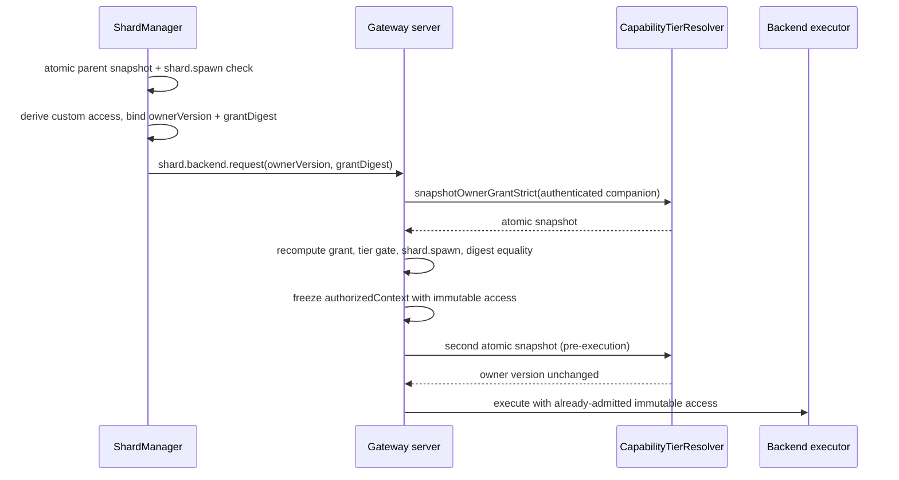
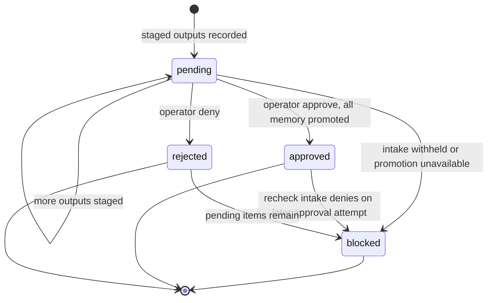
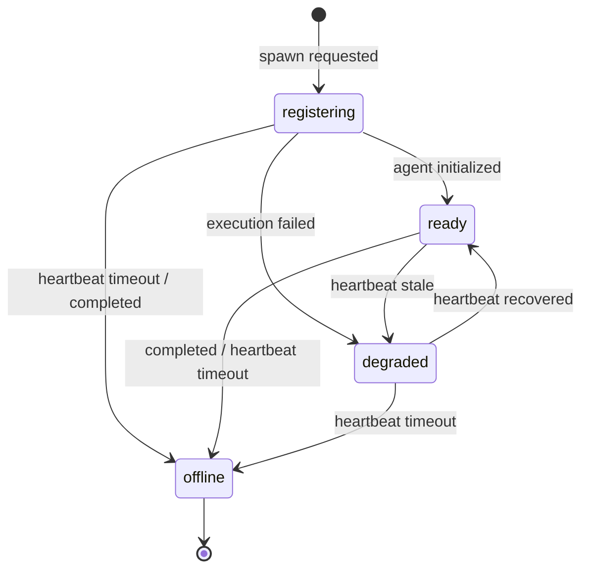

# Shards

**Shards are not automata** (charter §6.12 / §6.28). A shard is a
time- and task-bounded, isolated derived runtime of an origin Companion Core,
seeded from an explicit snapshot and declared scope: a **scoped continuation
that folds proposed changes back through origin-side review**, not a bounded
worker that reports a terminal packet and is discarded. The engineering term
shard remains correct in code and operator surfaces; the shard faculty is
documented here, the automata register on
[automata](/openwiki/faculties/automata.md).

Authority: `src/faculties/shards/` for the execution faculty and its review
gates, `src/system/capabilities/` for the derivation and request-grant
primitives, `src/boundary/gateway/` for the admission and workload-registration
boundaries, and `docs/shard-capability-tier-derivation.md`
(psfn-framework-yijy.1) as design authority for tier derivation. **Fail-closed
is the operating principle: a shard never chooses a capability tier, never
mutates canonical state directly, and every authority value — tier, tokens,
digest, workload generation, review decision — is resolved, frozen, and
rechecked at the boundary that consumes it.**

## Responsibilities

| Area | Responsibility |
| --- | --- |
| Execution authority | `ShardManager` (`manager.ts`) — `spawn` + `delegateSatelliteSession`, bounded turn loop, concurrency cap, heartbeat lifecycle, completion handoffs |
| Capability derivation | One atomic parent owner snapshot → derived immutable `custom` access minus the eleven-token denial mask, bound by owner version + SHA-256 grant digest |
| Gateway admission | `shard.backend.request` recomputes the grant from the authenticated companion's own owner file and admits only on exact digest equality, rechecked before the first backend side effect |
| Configuration snapshot | Launch-time `ShardConfigurationControl` with `inherited` (read-only) / `override` (model + workerBudget only) / `effective` layers and a content-stable revision |
| Context pack | Bounded transcript + memory priming under the compositional policy and the shard session-memory sync policy |
| Tool governance | Injection blocklist, tier toolsets, memory write/import staging, read-only `orient` wrapper, per-invocation capability gates |
| Review gates | `output-review.ts` staging + `ShardFoldReviewController` (`fold-review.ts`) — memory and artifact returns fold back only through operator approval |
| Workload registry | `ShardWorkloadRegistry` — one authenticated generation per (parent, shard) launch, channel tombstones, reference-stable frozen grants |
| Request-scoped authority | `ShardApprovalGrantAuthority` — exact-once temporary grants; only `world.control` is an eligible exceptional action |

## Capability tier derivation

A shard never chooses a capability tier. At launch the runtime takes **one
atomic snapshot** of the parent companion's authoritative capability grant and
derives an immutable shard grant from that single read
(`deriveShardCapabilityGrant`, `src/system/capabilities/shard-derivation.ts`):
parent tokens minus the standing denial mask, bound to a content-stable owner
version and a SHA-256 grant digest (`psfn.shard-grant.v2`). The manager binds
the launch to that digest and the gateway independently recomputes it from the
authenticated companion's own owner file before admitting any backend side
effect.

The authoritative owner file is `capability-tier.json`, resolved per companion
data directory and loaded eagerly by `CapabilityRuntime`
(`src/system/capabilities/runtime.ts`); a missing or malformed file throws
rather than falling back to a seed. `snapshotOwnerGrant()` is the atomic
primitive the whole chain depends on: one validated disk read produces tier,
authoritative `customTokens`, and effective granted tokens together, so a
result can never mix two owner-file versions. The tier enum is exactly four
values — `nursery`, `apprentice`, `autonomous`, `custom` — and `custom`
expands to exactly the owner's `customTokens`, never tier-name defaults.

*The derivation pipeline: every shard grant starts from one atomic owner read
and ends in an immutable `custom` access carrying the owner version and grant
digest.*

`SHARD_CAPABILITY_DENIAL_MASK` removes **eleven** tokens from every derived
shard grant regardless of parent authority: `identity.write.base`,
`identity.write.operator`, `memory.delete`, `external.discord`, `external.email`,
`external.web`, `external.companion`, `external.mcp`, `lifecycle.restart`,
`lifecycle.rebuild`, and `world.control`. Every `external.*` egress token is
masked so a shard never holds standing outbound-communication authority;
`notify` is additionally name-blocked at injection, so dropping the tokens is
defense-in-depth against renamed or newly injected egress tools. Tokens not in
the mask — notably `identity.write.runtime` and `memory.write` — survive
derivation only when the parent actually grants them.

`SHARD_MASK_TEMPORARY_GRANT_DISPOSITIONS` declares, per masked token, whether
temporary authority is delegable: only `world.control` is eligible for
request-scoped authority (`human-approval-required`, with TTL
`policy-gated-disabled` until a separately approved canonical server policy
exists); the other ten masked tokens are `never` in both request-scoped and
TTL form. No disposition ever mutates the standing custom token set or the
parent's owner file. `computeCapabilityOwnerVersion` (contract
`psfn.capability-owner.v1`) is a SHA-256 over canonical validated owner content
— content-stable across processes and independent of file mtimes. A `custom`
parent **requires** its authoritative `customTokens`; re-resolving a custom
grant from the tier name alone fails closed.

A running shard keeps its launch snapshot: a parent owner-file change affects
future launches only, and revoking a running shard's grant requires the manager
to terminate and relaunch it. `ShardConfig.capabilities` (a routing
advertisement for diagnostics) and `ShardConfig.requiredCapabilities` (a
narrowing routing constraint) are never authorization inputs and can never
widen the derived grant.

## Launch capabilities (manager side)

`src/faculties/shards/launch-capabilities.ts` resolves and validates one
digest-bound shard grant **before any launch side effect** — before the shard
Postgres schema is prepared, before any backend is requested, and before the
first LLM turn:

1. `snapshotParentCapabilityGrant()` — one atomic authoritative owner read.
2. `deriveShardCapabilityGrant` on that snapshot, then a consistency check that
   the snapshot's `grantedTokens` exactly equal the derivation's parent tokens
   (a mismatch throws: the atomic snapshot and its owner content disagree).
3. A hard requirement that the parent grant contains `shard.spawn`; a parent
   without it is denied with a `policy_blocked`
   `CompanionVisibleOperationalError` (retry hint `try_alternative_input`).

The result becomes the immutable, audit-safe `ShardCapabilityGrantEvidence`
(`src/faculties/shards/types.ts`): `parentTier`, `derivedTier: 'custom'`,
canonical `tokens`, `ownerVersion`, `grantDigest`, `denialMask`, and
`derivationVersion`. That evidence rides on the active-shard record, the
result, the audit trail, and the configuration snapshot so every consumer sees
the same bound authority. Both `ShardManager.spawn` and
`ShardManager.delegateSatelliteSession` converge on this path; the derived
`capabilityGrant.access` is injected into each `SubstrateAgent` via
`setCapabilityAccess` (`src/faculties/shards/agent-runtime.ts`), so the
**derived token set** — not the parent's tier name — is the final authorization
boundary for tool gates and tool-availability metadata. When a
`ShardWorkloadRegistry` is wired, the manager registers the authenticated
workload generation with the frozen derived access before execution (2h6q.3).

## Gateway admission (backend launch)

`GatewayCapabilityTierResolver` (`src/boundary/gateway/capability-tier-resolver.ts`)
owns one `CapabilityRuntime` per fleet companion, rooted at that companion's own
data dir and cached like the workspace map (an52.3). In the one-gateway /
N-companion topology every tier-gated decision resolves against the
**authenticated** companion's own `capability-tier.json`, not the gateway's
hydrated root: `resolveTier` / `resolveAccessStrict` /
`snapshotOwnerGrantStrict` **fail closed** in multi-companion mode when no
authenticated companion identity is supplied, while `resolveAccess` is the
deliberately lenient path for gateway-global plugin activation and must never
gate a per-companion call. `privileged-core.ts` wires the resolver into the
eligibility gates and exposes `capabilityTierProvider` plus
`capabilityGrantSnapshotProvider` to the server.

`shard.backend.request` (`src/boundary/gateway/methods/shard-backends.ts`) is
an independent trust boundary. The request contract carries **no
caller-declared tier or token fields** — only `backend`, `shardId`, `name`, and
the manager-bound assertions `ownerVersion` and `grantDigest` (validated as
lowercase SHA-256 hex). Admission then:

1. Requires an authenticated companion connection identity (fails closed).
2. Takes **one** atomic snapshot via `capabilityGrantSnapshotProvider` and
   recomputes the grant with `deriveShardCapabilityGrantFromSnapshot`.
3. Requires the parent tier to be `autonomous` or `custom` **and** the parent
   tokens to include `shard.spawn` — a custom parent without `shard.spawn` is
   denied even though its tier name is `custom`.
4. Requires the recomputed `ownerVersion` and `grantDigest` to **exactly equal**
   the manager-bound request values; any authority churn between the manager
   snapshot and this check denies the launch.
5. Freezes one server-owned `authorizedContext` containing the recomputed
   immutable access, then takes **a second** atomic snapshot immediately before
   the first backend side effect and requires the owner version to be unchanged
   (executor-bound TOCTOU closure).

*The digest-bound launch handshake: manager and gateway each take one atomic
snapshot, and the gateway admits only on exact owner-version and grant-digest
equality, rechecked immediately before the first backend side effect.*

Once admitted and consumed, the immutable launch snapshot governs that shard; a
later owner change follows the running-shard termination/relaunch rule rather
than silently recomputing a broader grant.

## Configuration snapshot and overrides

`src/faculties/shards/configuration-snapshot.ts` freezes the launch-time
authority into a `ShardConfigurationControl` with three layers — `inherited`,
`override`, and `effective`:

- **`inherited`** is read-only and captures the launch snapshot: capability
  tier as `{ parent, effective: 'custom' }`, trust (`source: 'parent_runtime'`),
  identity (`parentCompanionId` + `shardCompanionId`), prompts (`source:
  'parent_launch_snapshot'`), and the full `capabilityGrant` evidence. The
  inherited worker budget derives from the parent's `maxTurns`, the parent's
  `primaryMaxTokens` capped by the inherited model's `maxOutputTokens`, and the
  charge policy's `runChargeQuotaByLane.shard` quota. Inherited models come
  from `resolveParentAllowedShardModels`, which builds the live
  provider/model-registry allowlist and requires the parent primary model to be
  eligible — otherwise creation fails closed.
- **`override`** is the only mutable layer and admits exactly two keys: `model`
  (provider/model pair) and `workerBudget` (`maxTurns`, `maxOutputTokens`,
  `maxChargeUnits`). `parseShardConfigurationOverridePatch` rejects unknown
  keys, and `applyShardConfigurationOverride` revalidates the requested model
  against the **live** parent allowlist and bounds every budget field by the
  inherited parent bound (`assertWithinBound`). Overrides are applied
  atomically inside `ShardConfigurationRegistry.update` with a restore path
  that rolls back the control **and** the mirrored charge-policy lane quota on
  failure.
- `configurationRevision` is a SHA-256 digest over the
  `psfn.shard-configuration.v1` contract binding `parentCompanionId`,
  `capabilityGrant.ownerVersion`, `grantDigest`, the allowed-model list, and a
  hash of the parent system prompt — any authority or prompt change is
  observable in the snapshot's `source.revision`.
- `ShardConfigurationRegistry.resolve` refuses controls whose lifecycle is
  `offline`, whose health is `failed`, or whose lineage does not exactly match
  the queried parent and shard ids.

## Context pack and memory sync

`ShardContextPackHelper` (`src/faculties/shards/context-pack.ts`) builds the
task-scoped priming material a shard runs with. `buildContextPack` normalizes
the source context, evaluates the compositional policy for the source channel
under the resolved capability tier, and then primes bounded session transcript
and derived-memory blocks — each gated by the shard session-memory sync policy
(`evaluateShardSessionMemorySyncPolicy`, `src/boundary/gateway/policy.ts`) and
carrying an idempotency-bound `ShardSessionMemorySyncEnvelope`
(`shardId`, `sourceId`, `targetId`, `idempotencyKey`). Limits are enforced:
12-session scan cap, 6 transcript entries, 600 chars per entry, and a 4,000
char memory block. A context pack that yields neither entries nor memory
returns `null`; the shard system prompt is the parent prompt, optionally
augmented by the rendered context pack.

Shard session/memory sync is strictly one-directional at priming time
(`direction: 'prime_to_shard'`, `authority: 'prime'`). On the return path the
shard tool wrapper evaluates the reverse policy (`direction: 'shard_to_prime'`,
`authority: 'shard'`) — memory writes are not directly promoted (they stage for
fold review, below) and patch/redact/delete/restore mutations are denied by the
shard-to-prime sync policy.

## Tool governance

Tool injection is where the derived grant meets the live surface
(`src/faculties/shards/manager.ts`):

- **`BLOCKED_SHARD_TOOL_NAMES`** removes, at injection, every recursion /
  tool-loading surface (`subagent`, `spawn_subagent`, `load_tools`), the
  operator emergency button `notify`, all memory mutation tools
  (`memory_write`, `memory_import_batch`, `memory_patch`, `memory_redact`,
  `memory_delete`, `undo_memory_delete`, scratchpad), the core-authoritative
  identity/purpose/trust surfaces (`identity`, `north_star`, `contact*`), and
  any catalog copy of `shard_parent_icp` (the manager injects its own
  shard-bound instance instead). Name-blocking is the first line; the
  capability mask is the defense-in-depth backstop.
- Tier toolsets select a candidate catalog (`DEFAULT_SHARD_TOOLSETS_BY_TIER`):
  `nursery`/`apprentice` get the default list, while `autonomous` and `custom`
  resolve to `'*'` (every catalog tool that survives the blocklist). The
  derived token set remains the final authorization boundary regardless of
  catalog width.
- **`ShardToolSyncHelper.wrapShardTool`** (`src/faculties/shards/tool-sync.ts`)
  stages every `memory` write/import into `StagedShardMemoryOutput`s with
  `blockedCorePromotion: true` and records them as pending fold-review
  candidates; other memory mutations (patch/redact/delete/restore) are denied
  by the shard-to-prime sync policy, and each invocation carries an
  idempotency-bound `ShardSessionMemorySyncEnvelope` plus the internal
  `__psfnShardSource` provenance param on memory writes.
- **`createGovernedShardTool`** (`src/faculties/shards/tool-governance.ts`)
  wraps the multiplexed `orient` surface: read actions pass through unchanged,
  every mutation is denied and audit-trailed, reusing the exact subagent (p0le)
  classification so the two seams never drift. There is no third governance
  model and no opt-in elevation.
- **`gateToolWithCapabilities`** (`src/system/capabilities/gate.ts`) enforces
  the token boundary per invocation: a tool that declares **no** capability
  requirement is refused fail-closed, and required tokens come from
  `resolveToolCapabilityRequirement`. The only escape hatch is
  `allowShardRequestScopedCapabilityTransport`
  (`src/faculties/shards/request-scoped-capability-transport.ts`), a narrow
  transport permit admitting exactly the `world` tool's `control` action
  (`world.control`) and the `beads` tool's `close`/`issue_close` actions
  (`issue.close`) — it lets the tool implementation submit a request for later
  privileged binding and never adds a token to the derived access.
- **Artifact returns** (`src/faculties/shards/artifact-policy.ts`) accept only
  `http`/`https` URLs with `image/*` content types, id-stamped per
  shard/turn/index, and every returned artifact carries
  `mergePolicy: 'review_required'` — there is no direct artifact merge.

## Review gates (fold review)

Shard outputs never reach canonical state directly (charter 6.13). The shard
folds proposed changes back through origin-side review.

**Staging** (`src/faculties/shards/output-review.ts`):
`resolveStagedShardMemoryOutputs` turns memory write/import calls into
`StagedShardMemoryOutput`s of kind `l2_memory` with `reviewRequired: true`,
`reviewState: 'pending'`, and `blockedCorePromotion: true`. The single
authoritative classifier `isEmotionalOrRelationalShardMemory` flags restricted
memory **types** (`emotional`, `relational`, `boundary`), relational and
boundary/consent **tag** hints, and restricted lived-history **content** hints
(childhood, upbringing, trauma, grief) — mirroring the subagent governance
classifier so the fold-review queue never receives an under-scrutinized
boundary or relational interpretation. Flagged outputs carry the provenance
tag `interpretive:emotional_or_relational`.
`computeShardMergeReviewBlockingReasons` then derives the blocking set:
`artifact_output_pending_merge_review`,
`staged_shard_memory_pending_merge_review`, and
`emotional_or_relational_interpretation_requires_core_review`.

**Resolution** (`src/faculties/shards/fold-review.ts`):
`ShardFoldReviewController` persists one record per shard to a versioned JSON
store (`shard-fold-reviews.json`, schema v1) and exposes the admin validation
path `/api/admin/shards/{shardId}`.

- `recordPendingMemoryCandidates` screens every candidate through the CogSec
  intake firewall (`screenDerivedContent`, source class `shard_foldback`,
  sink `memory_write`); withheld content is redacted to the effective text and
  the item is marked `blocked` with `fold_review_intake_denied`.
- `recordArtifactReturn` stages returned artifacts as pending review items.
- `resolveFoldReview` with `approve` promotes every pending memory candidate
  through the injected `MemoryWriter` (building shard/subagent provenance,
  source refs, and intake-envelope references), **re-checking intake** first —
  a newly denied envelope blocks the item instead of promoting it — and marks
  artifacts approved only when every memory promotion succeeded; any promotion
  failure blocks the sibling artifacts with the failure reason. `deny` rejects
  all non-approved items.
- A missing memory writer when promotions are pending blocks the whole review
  (`fold_review_memory_promotion_unavailable`).
- Record state is recomputed from item states: any `pending` keeps the record
  `pending`, any `blocked` moves it `blocked`, mixed approved/rejected is
  `blocked`, and a `rejected`-only record is `rejected`.

*Fold-review record state aggregation: pending dominates, any block blocks, and
mixed approvals and rejections resolve to blocked.*

An approved fold review emits a `folded_back` completion handoff
(`ShardManager.resolveFoldReview`), keeping the approved outputs visible in the
parent's own voice without mutating canonical state directly.

## Workload registry and request-scoped authority

`ShardWorkloadRegistry` (`src/faculties/shards/workload-registry.ts`) is the
production authenticated workload registry (2h6q.3). The manager registers one
generation per launch — with the frozen derived access — before any execution
and ends it on release. Guarantees:

- **one live handle per (parent, shardId)**; registering a replacement
  generation supersedes the previous handle, which then resolves undefined
  (replacement-generation denial);
- ended handles resolve undefined (ended-workload denial);
- `resolveAuthenticatedWorkload` returns the **same frozen registration
  object** for the life of a generation, so the approval authority's
  reference-identity `sameWorkload` comparison holds;
- handles are process-local frozen objects — RPC/tool/browser values can never
  mint or forge one;
- every channel key that has EVER hosted a workload persists as a tombstone, so
  an ended or superseded shard channel (including arbitrary-scheme
  satellite/Wyoming channels) is still recognizably shard-originated and
  denies — a shard fence is never auto-cleared and never falls through to the
  parent's own authority; ambiguous multi-claimant channels throw rather than
  guess.

`GatewayShardWorkloadRegistrar` (`src/boundary/gateway/shard-workload-registrar.ts`)
exposes the `shard.workload.register` / `shard.workload.end` lifecycle RPCs.
The connection scope and companion identity are supplied by the server, never
by RPC params; registration re-derives the grant from the gateway's own atomic
snapshot and denies unless `ownerVersion` and `grantDigest` exactly match the
current gateway authority.

Temporary authority is separate from the standing grant
(`src/system/capabilities/shard-approval-grants.ts` +
`shard-approval-grant-policy.ts`): `ShardApprovalGrantAuthority` is the
exact-once authority for request-scoped grants —
`prepareRequestGrant` → `bindRequestGrant` (approval id + expiry) →
`activateRequestGrant` (requires a confirmed **operator** resolution, live
workload, and unexpired timestamp) → `consumeRequestGrant` (single use; replay
and expired consumption are denied and audited). Every grant is bound to an
authenticated workload generation. `resolveShardExceptionalAction` is a trusted
mapping: **only** `world.control`, via `home_assistant.call_service` /
`home_assistant.control`, is eligible — every other masked token rejects both
request-scoped and TTL authority, and a shard-originated gated dispatch that is
not an eligible exceptional action is denied at the approval boundary.

## Lifecycle and execution

`ShardManager.spawn` (`src/faculties/shards/manager.ts`) derives the shard
companion id (`coreCompanionId::shard-<uuid>`), resolves the capability grant,
builds a lineage envelope (schema v2 — source message, source context, optional
satellite routing, ingested intake envelopes), registers the configuration
control, and — before any execution — registers the authenticated workload
generation. In multi-companion mode each shard also derives a Postgres schema
binding from the parent schema (`shard.postgres.prepared` / cleaned around
execution); multi-companion shard execution requires the Postgres shard schema
lifecycle at construction.

Execution runs a bounded turn loop under the configuration registry's
effective model and worker budget (`maxTurns`, capped by the agent-loop
ceiling; default 1). Each shard gets two agent runtimes: the task loop on
`shard:<id>` and the direct human-to-shard chat lane on `shard:<id>:human` with
an explicit "do not impersonate the parent" prompt suffix. Shards do not run a
post-turn extraction worker; between turns the manager owns compaction so the
next turn sees a committed summary. Every launch emits lifecycle handoffs
(`started` / `progress` / `completed` / `failed` / `blocked`) and a terminal
result carrying the capability evidence and lineage.

*Shard lifecycle states: `registering` → `ready` → `degraded` → `offline`, with
heartbeat-driven degradation and eviction; `offline` is terminal.*

Heartbeat governance is owner-file backed: a shard is marked
`degraded`/`heartbeat_stale` after `shardHeartbeatStaleAfterMs` (default 60 s)
and evicted `offline`/`heartbeat_timeout` with workload release after the
disconnect window (default 3× stale). Tool events and turns touch the
heartbeat. Concurrency is capped (`shardMaxConcurrent`, default 5); exceeding
it emits a blocked handoff and a `policy_blocked`/`unavailable` operational
error. `releaseActiveShard` ends the workload generation first, then removes
the active record, directory runtime, configuration control, and channel
binding.

The live shard directory (`src/faculties/shards/directory.ts`) is the
server-visible projection: `listShards` / `readShardChatHistory` /
`sendShardChat` / `interruptShardChat`, with `sendShardChat` requiring a
current human parent attachment and asserting parent binding on every
operation. Shard→parent ordinary ICP (`shard_parent_icp`, injected into every
shard loop) runs through `LiveShardParentIcpRuntime`: it denies unavailable or
foreign shards, requires a policy-governed ordinary ICP ingress, and
re-checks the live generation before delivering a late parent response so a
reply never lands in a stale or replaced workload.

## Invariants and failure semantics

- Every shard token was effective for its parent at launch; no token in the
  eleven-token mask is ever in a standing shard grant, even when the parent
  grants every capability token.
- A shard is represented through the existing `custom` tier and an explicit
  token set; there is no `shard` tier enum value, and derivation never reads or
  writes the owner-file format.
- One atomic owner read can never mix a tier from one owner version with tokens
  from another; equal canonical owner content yields equal owner versions and
  grant digests across manager and gateway processes, while any authority,
  parent identity, mask, derivation-version, or derived-token change changes
  the digest.
- Missing or malformed owner files, unknown tokens or tiers, absent companion
  identity in multi-companion mode, missing `shard.spawn`, digest mismatches,
  and owner churn between admission and execution all fail closed — there are no
  compatibility shims, silent fallbacks, or "choose the newer" resolution rules.
- Routing capability arrays (`capabilities`, `requiredCapabilities`) are
  diagnostic/narrowing only and can never widen the derived grant.
- Shard outputs never merge directly: memory writes/imports stage as pending
  fold-review items and artifacts return with `review_required`, both resolved
  only through the fold-review controller.

## Related pages

- [Automata](/openwiki/faculties/automata.md) — the bounded-worker register; shards are scoped continuations, not automata (charter §6.12/§6.28).
- [Automata Bus](/openwiki/faculties/automata-bus.md) — the findings ledger; the bus tokens that appear in tier defaults and the runtime composition binding owner-eligible automata classes.
- [ICP and Intentions](/openwiki/faculties/icp-intentions.md) — the companion's self-initiated action stack, whose post-turn hooks and outbound lanes are separate from shard execution.
<!-- openwiki: broken internal link [/openwiki/approval-envelope.md] file "/openwiki/approval-envelope.md" does not exist. Fix the href or restore the target, then delete this comment. -->
- [Approval Envelope](/openwiki/approval-envelope.md) — the confirmation queue, `once` grant modes, and how shard request-scoped grants ride the approval envelope.
<!-- openwiki: broken internal link [/openwiki/shard-capability-tier-derivation.md] file "/openwiki/shard-capability-tier-derivation.md" does not exist. Fix the href or restore the target, then delete this comment. -->
- [Shard Capability Tier Derivation](/openwiki/shard-capability-tier-derivation.md) — the design authority (psfn-framework-yijy.1) behind the derivation chain.
<!-- openwiki: broken internal link [/openwiki/tool-surface.md] file "/openwiki/tool-surface.md" does not exist. Fix the href or restore the target, then delete this comment. -->
- [Tool Surface](/openwiki/tool-surface.md) — canonical model-facing tools and their capability requirements.
<!-- openwiki: broken internal link [/openwiki/cognitive-security.md] file "/openwiki/cognitive-security.md" does not exist. Fix the href or restore the target, then delete this comment. -->
- [Cognitive Security](/openwiki/cognitive-security.md) — the intake firewall that screens shard fold-back candidates and the tool-egress sink gate.
<!-- openwiki: broken internal link [/openwiki/multi-companion.md] file "/openwiki/multi-companion.md" does not exist. Fix the href or restore the target, then delete this comment. -->
- [Multi-Companion](/openwiki/multi-companion.md) — the one-gateway / N-companion topology that makes per-companion tier resolution fail-closed.
