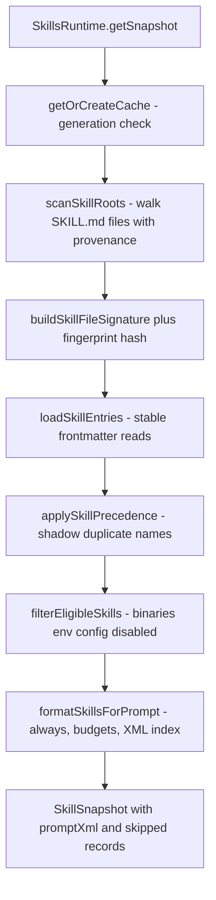
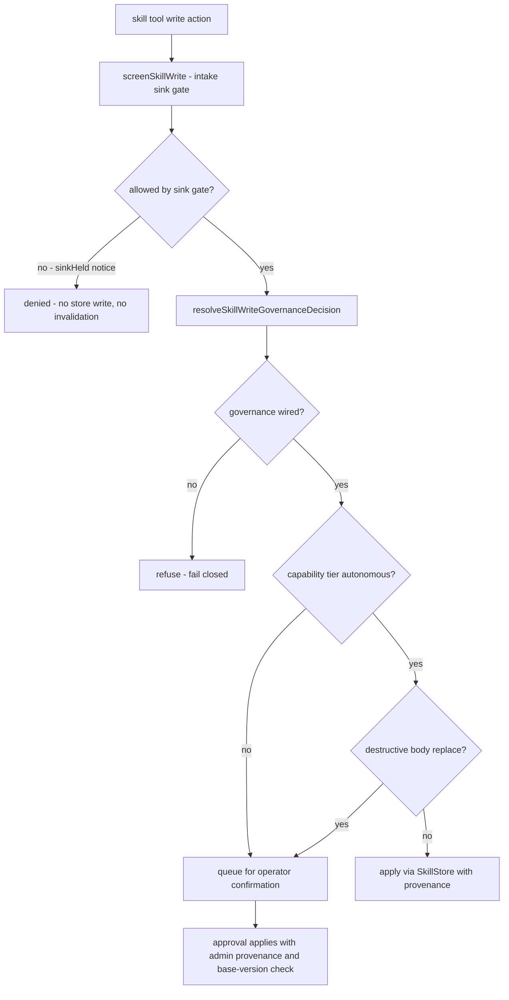

# Skills faculty

The Skills faculty (`src/faculties/skills/`) turns plain `SKILL.md` documents into
reusable workflow guidance for the companion. It is responsible for the whole
pipeline: discovering skills across **bundled** (image), **extra** (deployment
configured), and **custom** (per-companion managed) roots, parsing and
validating their frontmatter, filtering out skills whose binary/env/config
prerequisites are unmet, formatting a **bounded XML index** that is injected
into the prompt, persisting operator-managed personal skills with a versioned
history journal, recording content-free usage telemetry, and exposing
everything through one unified `skill` tool with intake screening and
capability-tiered write governance.

Authority: `src/faculties/skills/` — `loader.ts` (discovery, parsing, stable
reads, collection limits), `filter.ts` (eligibility), `format.ts` (prompt
index), `runtime.ts` (`SkillsRuntime` snapshot pipeline), `store.ts`
(managed-skill persistence and history), `telemetry.ts` (usage stats),
`tools.ts` (the `skill` tool, intake screening, write governance),
`runtime-wiring.ts` (agent wiring), and `reflection-nudge.ts` (post-turn
nudges). **Fail-closed: collection-limit overflows reject the whole skill set
with no partial injection; managed skill writes refuse when governance is not
wired; every managed write requires provenance; the prompt index never
contains skill bodies.**

## Responsibilities

| Area | Responsibility |
| --- | --- |
| Roots | Resolve bundled/extra/custom skill directories with precedence; report per-root scan provenance |
| Discovery | Walk roots for `SKILL.md` files under fail-closed collection limits |
| Parsing | Hand-rolled YAML frontmatter parsing; required name/description; typed `requires` |
| Stable reads | Stat-before/after reads, size budgets, oversize rejection, no partial bodies |
| Eligibility | Binary (PATH/PATHEXT), env, config-flag, global-enable, and disabled-list checks |
| Prompt index | `always`-first, precedence, name ordering under skill-count and char budgets |
| Runtime | Bounded async snapshot cache with sha1 fingerprint and generation invalidation |
| Managed store | `<category>/<name>/SKILL.md` + append-only `SKILL.history.jsonl` with provenance |
| Telemetry | Content-free usage stats with debounced atomic persistence |
| Tool | Unified `skill` tool: list/view/stats/create/update/history/rollback |
| Governance | Intake screening + capability-tiered confirmation queue; destructive updates queue |
| Operator surface | Garden admin create/update/delete/toggle with `operator:garden` provenance |

## Pipeline and control flow

The snapshot pipeline below is fully cooperative — scanning, hashing, sorting,
filtering, and body reads yield to the event loop at `yieldEvery` boundaries so
large skill collections never block prompt assembly.

The write path for managed skills adds two gates before any store mutation:
intake screening (content safety) and write governance (capability tier and
destructiveness). Queued proposals are applied only after operator approval.

## Roots, discovery, and provenance

`resolveSkillDirectories` builds the ordered root list from the default
`['skills']` plus `config.directories` plus `config.extraDirectories`
(`src/faculties/skills/loader.ts`). Display paths under `skills` are tagged
`bundled`; any other path is `extra`. `SkillsRuntime.mergeManagedDirectory`
prepends the managed root (`source: 'custom'`) with precedence 0 and
re-assigns precedence by index, deduplicating by resolved absolute path — so a
personal managed skill with the same name as a bundled skill always shadows
it.

`scanSkillRoots` walks every root depth-first, skipping symbolic links and
collecting only regular files named `SKILL.md`. It reports **per-root scan
provenance** (`SkillRootScan`: `exists`, `skillCount`, `source`, `precedence`,
`message`) and never treats a missing root as a silent empty: a missing or
non-directory non-managed root emits a WARN through a rate-limited emitter (10
minute window) naming the path. A missing managed root is expected (it is
created lazily on first skill creation) and is only surfaced through the
provenance payload.

## Parsing and stable reads

`SKILL.md` documents must begin with `---`-delimited YAML frontmatter, parsed
by a hand-rolled YAML subset (`parseYamlFrontmatter`) that handles scalars,
arrays, and nested maps. `normalizeFrontmatter` requires a `name` (or `id`) and
a `description` (or `summary`); `category`, `version`, `created`/`createdAt`,
and `updated`/`updatedAt` are optional, with `metadata.*` fallbacks. The
`requires` block merges alias keys into three lists: binaries
(`binary`/`binaries`/`bin`/`bins`/`command`/`commands`), env
(`env`/`environment`/`envVars`), and config (`config`/`settings`). Timestamps
must parse as ISO-8601 and versions must be positive integers; violations make
the entry a `parse_error` skip.

Reads are **stable and bounded** (`readStableSkillBytes`): the file is stat'ed
before and after the read, an aggregate byte budget is charged, documents over
1 MB are rejected as `oversized`, frontmatter beyond 64 KB is rejected, and a
size change between the two stats throws a retry error (`SKILL.md changed while
it was being read`). The body is never injected partially. A `SkillEntry` id is
`${name}@${relativePath}`, which is also the key used for content lookups in
list payloads.

## Collection limits: fail closed, no partial sets

Discovery and metadata collection are bounded by
`DEFAULT_SKILL_COLLECTION_LIMITS`: `maxDiscoveryEntries` 16384,
`maxCandidates` 2048, `maxRetainedBytes` 24 MiB, `maxMetadataBytes` 16 MiB,
`maxContentBytes` 16 MiB, `maxBinaryRequirements` 64, `yieldEvery` 32.
Exceeding any of these limits **aborts the collection and rejects the entire
skill set** with a `collection_limit` skip record whose details state that no
partial skill set was accepted — at the scan stage (`walkSkillFiles` / root
scan), at the metadata-projection stage (before reads begin), or mid-read (the
charged-bytes error path). Per-file defects are the opposite: an individual
oversized or malformed `SKILL.md` becomes an `oversized`/`parse_error` skip
while the rest of the collection still loads.

## Eligibility filtering

`evaluateSkillEligibility` (`src/faculties/skills/filter.ts`) marks a skill
ineligible when: the runtime is globally disabled (`config.enabled === false`);
the skill name is in `disabledSkills`; a declared binary is unavailable; a
declared env var is undefined or empty; or a declared config flag is falsy.
Binaries are resolved against `PATH` (with `PATHEXT` extension candidates on
Windows); config flags are dot-path truthiness lookups into
`SkillsRuntimeConfig`. If a skill declares more binaries than
`maxBinaryRequirements` (default 64), **no binary is evaluated at all** and the
skill is ineligible — a fail-closed bound that prevents PATH-check abuse.
Ineligible entries become `ineligible` skip records carrying the joined
reasons, and every evaluation (eligible or not) is retained in the snapshot's
evaluation list so tools can explain *why* a skill is absent from the prompt.

## Prompt index formatting

`formatSkillsForPrompt` (`src/faculties/skills/format.ts`) orders eligible
entries by `always` flag first, then root precedence, then name, and applies
two budgets from config: `maxLoadedSkills` (default 32, fallback if invalid)
and `maxSkillChars` (default 24000). The result is a `<skills_index>` XML
document whose `<skill>` nodes carry `name`, `source`, `path`, `always`,
`category`, and `version` attributes plus a `
` holding only the
description — **never the body**. Skills excluded by either budget become
`budget` skip records. The `always: true` frontmatter flag therefore forces a
skill to the top of the index regardless of precedence or name ordering.

## Runtime: bounded snapshot cache and lifecycle

`SkillsRuntime` (`src/faculties/skills/runtime.ts`) owns the pipeline. A
snapshot is built once per fingerprint: the fingerprint is a sha1 hash of the
config-relevant fields, directory specs, root scans, collection stats, skip
records, and a per-file signature of `relativePath|mtimeMs|size|precedence`.
When the fingerprint is unchanged the cached snapshot is reused; `invalidate()`
(used after managed writes, toggles, and config changes) bumps a generation so
the next access rebuilds. Concurrent builds are coalesced through a single
in-flight promise, and a stale builder whose generation was superseded resolves
to the latest cache rather than returning outdated data.

The `SkillSnapshot` aggregates the full provenance: `generatedAt`, `signature`,
`configEnabled`, `budget`, `directories`, `roots`, `scannedFiles`,
`loadedSkills`, `collection` stats, `includedSkills`, `promptXml`, and the
concatenated `skipped` records from scan, parse, precedence, eligibility, and
format stages. `getPromptXml` feeds the index into prompt assembly as
`skillsContext` (`src/core/agent/substrate-agent/prompt-context-builder.ts`),
so the index is part of every turn's dynamic context; `getCachedPromptXml`
returns the cached XML synchronously. `findSkill` resolves by trimmed lowercase
name, and `recordSkillInvocation` returns `null` for unknown skills while
recording telemetry under the canonical entry name otherwise.

## Managed skill store

`SkillStore` (`src/faculties/skills/store.ts`) persists personal skills at
`<managedRoot>/<category>/<name>/SKILL.md` (production
`managedRootDir` resolves into the companion's Personal Workspace) with an
append-only `SKILL.history.jsonl` journal next to each document. Names and
categories must match `^[A-Za-z0-9][A-Za-z0-9_-]{0,63}$`, descriptions are
capped at 240 characters, and every mutation requires non-empty provenance
(`updatedBy`) — there is no anonymous write path. All resolved paths are
containment-checked against the managed root to prevent escapes.

Every create/update/rollback appends a journal entry carrying the full previous
and new rendered document, version, truncated sha256 checksums, timestamp, and
provenance. No-op updates (identical body and description) short-circuit
without burning a version. Rollback restores a journaled version
byte-exactly as a **new** version and is itself journaled and reversible.
`delete` removes the skill directory and prunes the category directory when
empty.

## Usage telemetry

`SkillUsageTelemetryStore` (`src/faculties/skills/telemetry.ts`) keeps a
content-free in-memory aggregate keyed by lowercased skill name and persists it
atomically (tmp file + rename) to `skill-usage-stats.json` on a debounced timer
(default 1000 ms, `unref`'d so it never holds the event loop open). Records
hold only success/failure outcome, duration samples, and timestamps — never
skill content. Timer-path write failures (ENOSPC/EACCES/EIO) are swallowed and
retried on the next record while `dirty` stays true; direct `flush()`/`close()`
callers still surface errors. The runtime's `flushSkillUsageTelemetry()` is
wired as a shutdown target (`shutdownTargets.skillUsageTelemetry`), so the
debounced tail is never lost. Loaded files are validated strictly (counts must
add up, keys must match names, timestamps must be ISO-8601).

## The unified skill tool

`createSkillTool` (`src/faculties/skills/tools.ts`) builds the `skill` tool,
registered as a **core** tool by `wireSkillsRuntime`. Actions are
`list`/`skill_list`, `view`/`skill_view`, `stats`/`skill_stats`,
`create`/`skill_create`, `update`/`skill_update`, `history`, and `rollback`; the
action defaults to `list` when no action-specific parameters are supplied, and
invalid actions or missing required fields return structured errors. The tool
is annotated with an action-aware capability requirement: read actions require
`identity.read`, write actions require `identity.write.runtime`
(`src/system/capabilities/requirements.ts`), and the capability gate denies
writes without the token.

- **list** returns snapshot provenance, `managedOwnership`, budget, category
  summary, `includedInPrompt` flags, per-skill eligibility/reasons/requires,
  and skipped records (default on). `includeContent` reads bodies in one
  bounded batch under `maxContentBytes` and fails closed on overflow without
  per-skill rediscovery.
- **view** returns metadata plus the body and records a successful usage
  telemetry invocation (warn-only on telemetry failure).
- **stats** returns named statuses `ok`/`no_stats`/`stats_without_loaded_skill`/
  `not_found` or list-level totals and never includes skill content.
- **history** lists journal entries (with lengths/checksums) or returns the
  full document for a requested version; **rollback** restores a journaled
  version as a new version.

### Write path: intake screening then governance

Every managed write passes two gates. **Intake screening**
(`screenSkillWrite`) screens content and the optional description through the
intake `IntakeScreeningService` with scope `strict`, evaluates the sink gate
for sink `skill_write`, and returns the `sinkHeld` firewall notice on denial —
with no store write, no invalidation, and no raw-content leak into audits.
**Write governance** (`resolveSkillWriteGovernanceDecision`) is deliberately
conservative: with governance unwired every write refuses (fail closed); below
the autonomous tier every write queues for operator confirmation (refusing
when no queue is configured); at the autonomous tier creates, non-destructive
updates, and rollbacks apply directly with journaled provenance; and
heuristically destructive updates (via `detectDestructiveSkillContentReplace`)
**always queue** with no self-service override. Queued proposals enqueue with
method `skills.skill.<action>`, scope, params (including `baseVersion` for
updates), and a companion reason; approval applies with
`admin:confirmation` provenance and refuses an approved update whose base
version drifted, preventing silent clobbers.

### Operator surface

Garden's `AdminSkillsDataService` (`src/operator/garden/services/skills-service.ts`)
backs `/api/admin/skills`: it reads the snapshot and the bounded managed
projection, creates/updates/deletes managed skills directly through the
runtime with `operator:garden` provenance (operator approval authority — no
queue), and toggles `disabledSkills` through the canonical owner-file config
store; the runtime itself never receives a configuration mutation surface.
`skills.json` must be registered as a per-companion owner file.
`SkillsRuntime.listManaged()` fails closed on aggregate managed-body overflow:
when total bodies exceed `maxContentBytes` it returns an empty managed list
with a `collection_limit` skip instead of a partial projection.

## Configuration

Skills config is the per-companion `skills.json` owner file (seeded from
`skills.seed.json`): `enabled`, `directories`, `extraDirectories`,
`disabledSkills`, `maxLoadedSkills` (1–512), and `maxSkillChars`
(256–1 000 000), all validated strictly. The seed shipped in `config/` enables
the runtime with `['skills']` as the bundled directory, 32 loaded skills, and
24 000 index characters.

## Reflection nudge

`ReflectionNudgeTracker` (`src/faculties/skills/reflection-nudge.ts`), owned by
the substrate agent, emits a system nudge suggesting `skill action="create"`
after every Nth qualifying turn (default: at least 3 tool calls or
analysis-workbench use, every 3rd qualifying turn, to avoid nagging). Its
thresholds are configurable and its counter resets on restart.

## Relationships

- **Tool surface**: the `skill` tool is part of the canonical tool surface
  (`src/core/agent/tool-surface/descriptions/operations-contracts.ts`), with a
  documented purpose, action contract, and guidance that skills are guidance,
  not executable capabilities or durable reference documents (use a tool or
  wiki for those).
- **Capabilities**: write actions ride `identity.write.runtime` and the same
  capability-tier + Garden confirmation queue as card/prompt proposals
  (charter 9.5 category-2 governance).
- **Cogsec**: skill writes are a first-class intake sink (`skill_write`), so
  prompt-override, encoded-injection, exfiltration, destructive-command, and
  persistence-mechanism content is denied before any store write.
- **Prompt assembly**: `getPromptXml` feeds the bounded index into
  `prompt-context-builder` as `skillsContext`.
- **Lifecycle**: `flushSkillUsageTelemetry` is a shutdown target, and managed
  roots live under the companion's Personal Workspace while deployment skills
  stay rooted at `repoRoot`.
