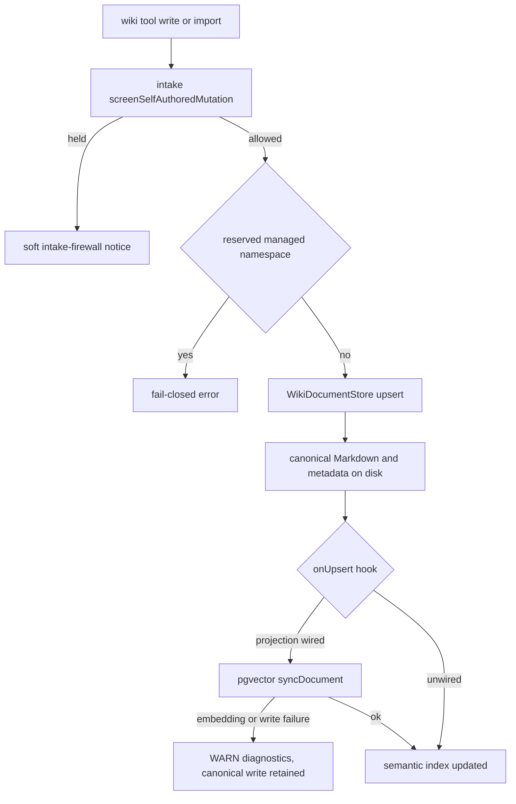
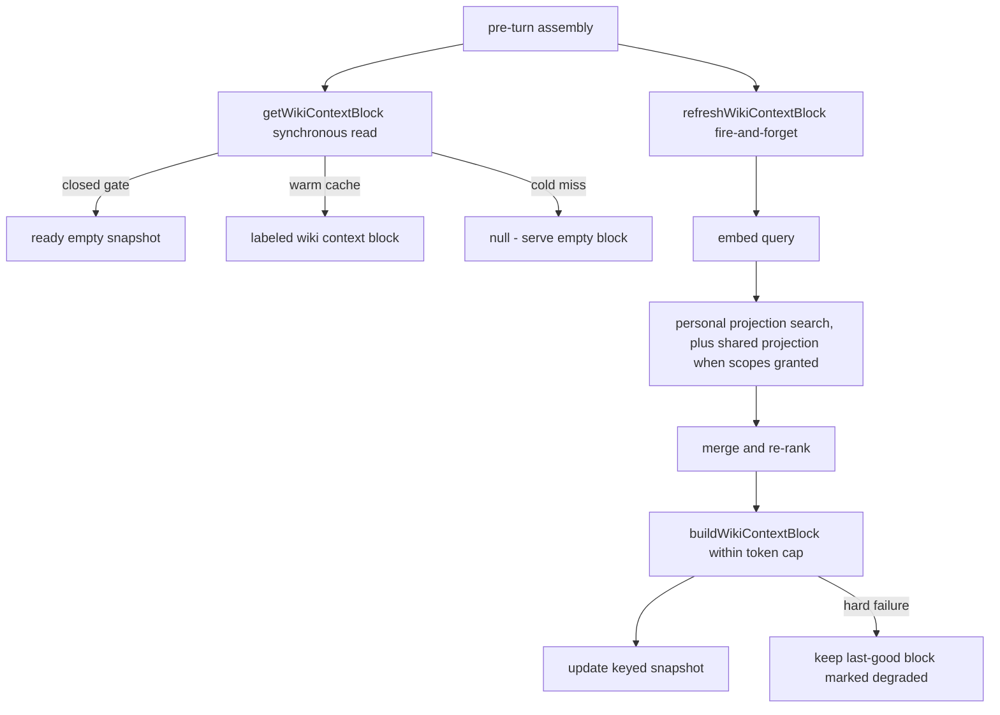
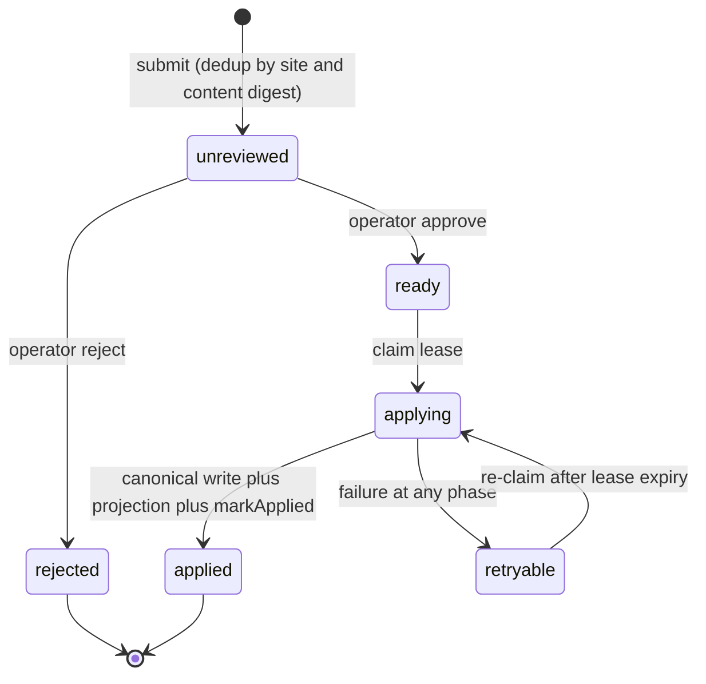

# Companion Wiki Faculty

The **wiki faculty** is the companion's durable reference-knowledge domain: a
personal Markdown wiki stored in the companion workspace, a Postgres/pgvector
semantic projection over it, the model-facing `wiki` tool, and a set of
background and operator surfaces (sleeptime curation, shared-world caretaker,
places publication, bulk import). It lives in `src/faculties/wiki/`.

This page documents that **companion wiki faculty** — not the OpenWiki code wiki
that documents this repository, and not the companion's journal or memory
faculties. The distinctions are load-bearing and enforced:

- **Wiki vs memory (charter §6.26 / L0/L0.1/L2):** the wiki is *world knowledge
  and reference notes*, never lived memory. The retrieval context block is
  labeled `## Reference Wiki (supplemental world knowledge — NOT lived memory)`
  (`src/faculties/wiki/retrieval.ts#L34-L35`) and every tool response repeats a
  "not lived memory" boundary string.
- **Wiki vs journal:** journal means companion-authored personal Markdown
  writing in her own voice (`<workspace>/journal`, a separate faculty). The wiki
  pass may write synthesized, source-cited reference entries; those are wiki
  documents with `sourceClass: generated_synthesis`, not journals, and memory
  layers are never relabeled as journals.
- **Wiki vs skills/tools:** repeatable procedures become skills and direct
  actions become tools; the sleeptime pass's prompt and guard encode that
  boundary.

## Scope dimension (W5b)

Every wiki document belongs to exactly one scope (`src/faculties/wiki/scope.ts`):

- `personal` — the companion's own reference knowledge. Default for every
  existing document and every companion write path; an absent scope field means
  `personal` and a personal document omits the field entirely so it stays
  byte-identical to a pre-W5b document (`src/faculties/wiki/types.ts#L31-L38`).
- `shared_world:<siteId>` — world knowledge attached to a physical/virtual site
  (the places registry). Companions **read** the current site's shared scope
  when situated under multi-companion; they **never write** it directly. Shared
  writes belong to the caretaker layer with operator approval.

Scope is normalized through `normalizeWikiScope`, which validates the siteId
token against the canonical places-registry ID grammar and fails closed on any
other shape (`src/faculties/wiki/scope.ts#L57-L72`).

## Storage: `WikiDocumentStore`

The canonical store is filesystem-backed, with documents and metadata in two
sibling directories under the wiki root:

- `<workspace>/knowledge/wiki/documents/<id>.md` (Markdown body)
- `<workspace>/knowledge/wiki/metadata/<id>.json` (metadata, `schemaVersion: 1`)

The root resolves via `resolvePersonalWikiDir` under the personal knowledge
tree; the shared-world root is `<system-data>/shared-world/wiki/sites/<siteId>`
(`src/persistence/layout.ts#L415-L434`). There is **no SQLite runtime**;
semantic search is a Postgres/pgvector projection only.

`WikiDocumentStore` (`src/faculties/wiki/store.ts#L329-L530`) owns the on-disk
format and every generic operation:

- ids are normalized (`normalizeWikiDocumentId`) against `[a-z0-9][a-z0-9._-]{0,95}`
  and must not contain `..`; a write id defaults from a slugified title;
- metadata round-trips are **checksum-verified**: `bodySha256` is recomputed
  from the body on read and a mismatch throws (`store.ts#L311-L313`);
- `sourceClass` is one of seven classes (`companion_authored_note`,
  `operator_authored_note`, `imported_partner_vault_note`, `parsed_document`,
  `generated_synthesis`, `external_reference`, `system_seed`); four of them
  **require at least one provenance ref** (`store.ts#L60-L65`, `L253-L257`);
- an optional `intakeEnvelopeId` stamps the canonical
  `intake-envelope:<id>` provenance ref so a poisoned source's lineage stays
  excisable later (htm9.1, `store.ts#L386-L401`);
- `upsert` bumps `version`, preserves `createdAt`, records `updatedBy` (default
  `agent`), and writes the body first, then the metadata atomically;
- `search` is substring over title/summary/tags/body with a line-preview
  builder; `list` sorts by `updatedAt` descending.

The write path invokes an injected `onUpsert` hook **after** the canonical write
has durably landed (`store.ts#L438-L452`). The hook is side-effect-only from the
store's perspective: projection failures never block wiki writes (the canonical
document is the source of truth and rejecting it now would falsely fail the
write and mutate its version on retry), but they are loud — a WARN record with
the digest lands in the Garden-visible diagnostics ring (redacted of body
content). This is the rebuildable search mirror being fail-open relative to the
write while remaining fail-closed for search.

### Scope write guards

The single engine is parameterized by an injected `WikiScopeWriteGuard`
(`store.ts#L187-L227`):

- `PERSONAL_SCOPE_WRITE_GUARD` backs the companion-facing `WikiStore`: it
  fail-closed rejects **any** non-personal scope. This is the W5b world-info
  leak surface — companion tools only ever construct a `WikiStore`, so the
  model can never author shared-world knowledge directly.
- `sharedWorldScopeWriteGuard(siteId)` backs the operator-owned
  `SharedWorldWikiStore`: it accepts **exactly** `shared_world:<siteId>` for its
  own site and rejects everything else. Only operator/caretaker maintenance
  surfaces (places publication, bulk import, caretaker apply) construct it.

`SharedWorldWikiStore` defaults an omitted scope to its own site scope and
otherwise delegates to the guard, so a mismatched scope still fails closed
(`store.ts#L566-L589`).

## The `wiki` tool

The model-facing surface is the single `wiki` tool (`src/faculties/wiki/tools.ts#L245-L598`),
registered at the core capability tier. `action` defaults to `search` when a
query is present, `read` when only an id is present, and `list` otherwise. The
action set:

| Group | Actions |
| --- | --- |
| Documents | `list`, `read`, `search`, `semantic_search` |
| Writes | `write`, `import`, `propose_shared_world` |
| Wishes | `wish_list`, `wish_read`, `wish_create` |
| Personal projects | `project_list`, `project_read`, `project_create`, `project_update`, `project_add_artifact`, `project_share` |
| Wardrobe | `wardrobe_list`, `wardrobe_read`, `wardrobe_save`, `wardrobe_revise` |

Read-only actions map to the `identity.read` capability requirement;
write/import/proposal/wish-create/project-write/wardrobe-write actions map to
`identity.write.runtime` (`tools.ts#L187-L216`).

`write` and `import` go through the self-authored-mutation intake screen
(`screenSelfAuthoredMutation`, sink `wiki_write`) before the store upsert
(`tools.ts#L419-L441`). A screened-out write returns a **soft, truthful
intake-firewall notice** (not an error) so the model does not spiral into
retries.

The generic write/import action is fully model-controlled, so it is **fail-closed
rejected when it targets the reserved managed-manifest namespace**: document ids
with the `project.` or `wardrobe.look.` prefixes, or the reserved
`psfn:personal-project` / `psfn:named-look` tags (`personal-projects.ts#L154-L193`,
checked before and after screening in `tools.ts#L407-L440`). Those manifests
carry runtime-derived disclosure metadata; a model-authored write could forge
`metadataLineage: runtime_derived` and defeat the egress gate (bible §6.2,
§9.5). They are only written through the dedicated `project_*` / `wardrobe_*`
actions.

`semantic_search` fails closed with guidance when no projection is wired, and
`propose_shared_world` is unavailable outside the multi-companion caretaker
flow — a companion can enqueue a proposal but never publish one.

## Personal projects, wishes, and wardrobe looks

These are existing personal-wiki documents with reserved ids/tags, interpreted
through typed layers:

- **`PersonalProjectLibrary`** (`src/faculties/wiki/personal-projects.ts`):
  manifests at `project.<id>` tagged `psfn:personal-project`, schema v2, with a
  companion-owned `workContext` (private / room / publication). Disclosure
  metadata — artifact `sensitivity`, `intendedAudience`, `shareState`, and
  `metadataLineage` — is **runtime-derived from project visibility**, never
  model-asserted; `project_add_artifact` rejects model-supplied sensitivity and
  audience arguments fail-closed, and `requestArtifactShare` refuses to broaden
  an artifact with `legacy_unverified` lineage beyond `self` until re-grounded
  (`personal-projects.ts#L312-L390`). One-time idempotent migrations ship in the
  library: legacy-artifact quarantine, free-time `public`→`primary_contact`
  containment, and manifest v1→v2 upgrade.
- **`PersonalWishlist`** (`src/faculties/wiki/personal-wishlist.ts`): wishes at
  `wishlist.wish.<uuid>` tagged `wishlist:companion-authored`, with the state
  machine `open → acknowledged → planned → done` driven by operator surfaces and
  an anti-clock-drift guard on every transition.
- **Wardrobe looks** at `wardrobe.look.<id>` tagged `psfn:named-look`, with
  supersede chains; `resolveWardrobeLook` fails closed on a superseded reference
  and enforces visibility for the requesting audience.

## pgvector projection (personal)

`WikiPgvectorProjectionStore` (`src/faculties/wiki/pgvector-projection.ts`)
mirrors the canonical workspace into the Postgres table `wiki_document_chunks`
(keyed `(document_id, chunk_index)`), provisioned by
`POSTGRES_WIKI_PROJECTION_MIGRATIONS` (`src/persistence/postgres/migrations.ts#L803-L829`).
It is **never a source of truth**: every row carries `body_sha256` and the
canonical Markdown + metadata files are authoritative.

- `chunkWikiBody` splits the body at paragraph boundaries with a hard cap
  (default 1200 chars, max 64 chunks per document) so each embedded unit is
  semantically coherent (`pgvector-projection.ts#L27-L69`).
- `syncDocument` is delete-and-replace for one document version. Embedding
  failures **fail closed for search**: the row set is left unchanged, a typed
  `wiki.projection.sync` event reports the failure, and the canonical write is
  untouched (`pgvector-projection.ts#L249-L335`).
- `computeWikiProjectionDrift` is the pure, DB-free repair decision: documents
  whose projected checksum is missing or drifted must be re-embedded; projected
  documents with no canonical source are orphans to delete
  (`pgvector-projection.ts#L83-L119`). `rebuild` applies it.
- `search` runs cosine similarity (`1 - (embedding <=> $1::vector)`), over-fetches
  chunk rows and dedups to the best chunk per document, and re-sorts by score
  with a documentId tiebreak. A `scopes` filter is opt-in: `undefined` keeps the
  query byte-identical to the pre-W5b path (`pgvector-projection.ts#L373-L423`).
- Under multi-companion the pool pins its `search_path` to the companion schema
  (`schema`/`role` options) so companion-private chunks never land in `public`
  and collide (`pgvector-projection.ts#L177-L190`, `L430-L443`).

Caption: write path — canonical workspace first, the pgvector mirror is a
fail-open-relative-to-write hook and fails closed for search.

## Shared-world projection

`SharedWikiPgvectorProjectionStore` (`src/faculties/wiki/shared-pgvector-projection.ts`)
projects the per-site shared-world filesystem tree into the **one**
`shared.shared_wiki_chunks` table. The table's schema enforces the W5b boundary
at the database layer: `CHECK (scope = 'shared_world:' || site_id)` makes a
personal-scoped or cross-site-mis-scoped row unrepresentable
(`src/persistence/postgres/migrations.ts#L3394-L3419`). The migration lives in
its own statement list (`POSTGRES_SHARED_WIKI_MIGRATIONS`), deliberately not
appended to the base shared chain, because it requires the pgvector extension;
the gateway provisions it under the migration advisory lock before agents start.

- `syncDocument` rejects any document whose scope is not exactly this site's
  scope — a mis-scoped row is never written (`shared-pgvector-projection.ts#L136-L144`).
- `rebuildSite` reconciles **one site's** rows against that site's canonical
  documents (re-embed drifted/missing, prune orphans); other sites' rows are
  never touched.
- `search` **requires** scopes — there is no unfiltered shared read; an empty
  grant returns empty, never everything. Per-document dedup keys on
  `scope + documentId` because ids repeat across sites (`site-overview` exists
  in every site) (`shared-pgvector-projection.ts#L291-L342`).

`runSharedWorldWikiWrite` wraps every shared-world write surface (places
publish, bulk import) with its projection pass so filesystem and chunks cannot
drift silently (`shared-pgvector-projection.ts#L456-L552`). It resolves the
projection decision **before** the filesystem write: under multi-companion,
missing Postgres/embedding throws with nothing mutated; flag-off it degrades to
an honest `skipped`/`failed` report, never silent success
(`resolveSharedWikiProjectionDecision`, `shared-pgvector-projection.ts#L412-L436`).

## Retrieval: supplemental wiki RAG

`WikiRetrievalService` (`src/faculties/wiki/retrieval.ts#L296-L622`) is the
opt-in, gated, capped wiki RAG for chat turns. It is appended to prompt
assembly **after** memory context, in its own labeled block with its own token
budget, so wiki can never displace memory content.

- **Deterministic gate** (`resolveWikiRetrievalPlan`, `retrieval.ts#L61-L105`):
  pure function of config + turn signals. Focus-scoped turns win first with the
  highest cap; group turns get the conservative cap and a stricter similarity
  threshold (0.78 vs 0.6 default); DM turns get the normal ~1k cap. A disabled
  feature or zero cap returns `null` — the turn serves a `ready`, empty,
  non-degraded snapshot (a skip, never a degradation).
- **Cached-snapshot model** (mmo9.7.4): the turn hot path reads a synchronous
  last-good snapshot via `getWikiContextBlock` (no embed, no search) and
  schedules an off-path `refreshWikiContextBlock`. Snapshots are keyed by
  `channelId + contextClass + allowedScopes`, **not** query text — the same
  query-relative staleness tradeoff active-memory makes. Concurrent refreshes
  for one key coalesce (`active-context.ts#L47-L63`).
- **Fail-closed semantics**: a hard embed/search failure keeps the last-good
  block and marks the snapshot `degraded`; a cold failure has nothing to
  preserve and returns `null` (caller serves an empty block and emits
  `wiki.retrieval.turn_degraded`). A partial shared-slice failure still serves
  the personal block but the `wiki.retrieval` event reports the partial
  degrade — never a silent `ran` (`retrieval.ts#L474-L621`).
- **Block building** (`buildWikiContextBlock`): fits entries into the wiki cap,
  truncating the highest-scoring entry by characters when a single entry
  exceeds the cap, and projects content-free disclosure facts (ref +
  sensitivity) for exactly the documents rendered (`retrieval.ts#L198-L260`).
  Wiki world-knowledge authorizes no outward destination, so each disclosure
  source collapses to companion-self at the seam.
- **Retrieval union** (s10f9): when the plan grants shared scopes, the shared
  projection is queried with exactly those scopes and `mergeWikiSemanticMatches`
  merges personal + shared candidates — dedup on `(scope, documentId)` keeping
  the best score — and re-ranks with the same comparator the projection uses,
  never a blind concatenation (`retrieval.ts#L116-L131`). Under flag-off
  `allowedScopes` is `undefined`, the shared block never executes, and the
  personal path is byte-identical to single-companion.

Caption: retrieval flow — synchronous last-good read on the hot path, off-path
refresh, fail-closed degradation.

Startup hydration primes the cache: `hydrateStartupWikiContexts` refreshes the
DM-class lane for recently-active channels so the first turn serves a warm block
(`src/faculties/wiki/startup-hydration.ts#L59-L120`).

## Sleeptime wiki pass

`SleeptimeWikiPass` (`src/faculties/wiki/sleeptime-wiki-pass.ts`) is a nightly
pass that runs inside the rest-window sleeptime stack **after** the day's
episodes and memories settle (consolidation → arcs → dream). It reviews
newly-canonical episodes and durable (semantic/procedural) memories for
non-private world knowledge worth recording, and writes wiki entries through the
personal `WikiStore` with provenance back to the source episodes/memories.

- **Deterministic gate** (jpvd.4): the LLM proposal call fires only when the
  day produced enough wiki-shaped material — new canonical episodes since the
  watermark OR new durable memories since the watermark (defaults: ≥1 episode or
  ≥3 durable memories). Quiet days short-circuit with **zero LLM spend**
  (`sleeptime-wiki-pass.ts#L347-L357`, `L442-L455`).
- **Personal/world boundary**, encoded in both the schema-bound prompt and a
  deterministic post-filter: personal facts about a specific person stay in
  memory; repeatable procedures become skills; direct actions are tools.
  `filterPersonalFactProposals` rejects a proposal that cites a personal
  (relational/emotional, intimate/confidential, or contact-linked) memory as its
  source, contains a first-person relational marker ("my partner …"), or
  substantially restates a personal memory by distinctive-token overlap — it
  errs toward NOT writing (`sleeptime-wiki-pass.ts#L178-L190`, `L303-L345`).
- **Fail-closed on malformed output**: a malformed model envelope writes
  nothing, the watermark is **not** advanced (the same material is reviewed
  again next night), and a typed gate event records the failure
  (`sleeptime-wiki-pass.ts#L457-L500`).
- Successful proposals are written with `sourceClass: generated_synthesis`,
  `sensitivity: personal`, provenance `wiki_pass:<sessionId>` plus
  `episode:`/`memory:` refs, and the `wiki-pass` tag; existing entries are
  preferred over duplicates via the cited id or an exact-title search
  (`sleeptime-wiki-pass.ts#L556-L593`).
- Config lives in `schedulerConfig.wikiPass` (`SleeptimeWikiPassConfig`:
  `enabled`, `reviewWindowHours`, gate thresholds, per-run caps); the prompt is
  registry-keyed `memory.sleeptime.wiki` (`src/core/identity/prompt-registry.ts#L26`).
- The pass runs from the sleeptime agent's rest-window action list
  (`src/faculties/memory/sleeptime-agent.ts#L727-L741`) and emits
  `memory.sleeptime_wiki.gate` events.

## Shared-world caretaker

The caretaker is the operator-approved path for companion-proposed world
knowledge (`src/faculties/wiki/shared-world-caretaker.ts`,
`shared-world-caretaker-types.ts`, `shared-world-caretaker-store.ts`).

**Enqueue-only proposal surface** (`SharedWorldWikiProposalService`): a
companion submits a proposal with site, title, body, source ref, and provenance.
`guardSharedWorldWikiProposal` is the deterministic, fail-closed guard used both
at submission and again immediately before application: the site must be known
and registry-valid, sensitivity must be `public`, provenance is required and
must not carry a personal-memory prefix (`memory:`/`l0:`/`l1:`/`l2:`/…), and the
content must pass the same `filterPersonalFactProposals` personal-fact filter
the sleeptime pass uses — one grammar, not two
(`shared-world-caretaker-types.ts#L163-L240`).

**Persistence** (`SharedWorldWikiProposalStore`): rows in
`shared_wiki_proposals`, deduplicated by `UNIQUE (site_id, content_digest)` and
constrained so a pending proposal carries no review fields, an approved one
carries a reviewer, and only `applying` rows hold a lease
(`src/persistence/postgres/migrations.ts#L3421-L3465`).

**Apply lifecycle** (`SharedWorldWikiCaretakerService.applyApproved`):
approve → `claimApproved` mints a 60-second lease → a mandatory **second
deterministic guard** re-runs (a stale or now-private input cannot become a
write) → the canonical document is written through the gateway system-data
writer with provenance markers `caretaker-proposal:<id>` and
`caretaker-digest:<sha>` → the shared projection syncs the document → `markApplied`
records version + sha. The markers make retries idempotent: if the canonical
write already happened, resuming reuses the existing document instead of
incrementing its version (`shared-world-caretaker.ts#L210-L241`). A failure at
any phase marks the proposal `retryable` (never silently dropped) with a
phase-tagged, content-redacted error; `cleanupChangedContent` is a bounded drift
repair that re-projects applied documents whose canonical sha drifted.

Caption: shared-world proposal lifecycle — enqueue, operator review, leased
apply, retryable failure.

## Places → wiki publication

`publishSiteWiki` (`src/faculties/wiki/places-wiki-publication.ts`) is a
**deterministic projection** of the `places.json` soft-registry into browsable
shared-world wiki pages: one `site-overview` page plus one page per place,
scoped `shared_world:<siteId>` and tagged `generated:places`. The registry stays
the single source of truth. Re-running compares title + tags + body and writes
only changed/new pages; pages for removed places are pruned — but only among
pages this projection generated, never an operator-imported doc sharing the id
prefix. It is an operator/caretaker surface: it writes through
`SharedWorldWikiStore`, never the companion personal store, so the W5b
companion-side rejection stays intact. A maintenance CLI
(`npm run wiki:publish:places`, dry-run by default, `--apply` to write) drives
it per site through `runSharedWorldWikiWrite` (`src/app/maintenance/publish-places-wiki.ts`).

## Bulk import

`importMarkdownDirectory` / `importMarkdownFiles`
(`src/faculties/wiki/bulk-import.ts`) import a directory of Markdown files into
a store in one of two modes: **shared-world import** runs every file through
`filterPersonalFactProposals` (a file containing a personal fact is rejected
with a per-file reason, never silently scrubbed or dropped), while **personal
import** skips that gate. Document ids derive from filenames, so re-importing
updates in place; `dryRun` previews without writing. Only operator-owned
surfaces (maintenance CLI, Garden admin routes) construct the shared store.

## Runtime wiring and lifecycle

`wireWikiRuntime` (`src/faculties/wiki/runtime-wiring.ts#L152-L404`) assembles
the subsystem at agent startup and returns a closable handle:

- builds the personal `WikiStore` and, when Postgres + embedding are available,
  the personal projection (single-companion: best-effort — if the projection
  cannot be created, the wiki tool still offers text search; multi-companion:
  the shared projection and caretaker dependencies are **required**);
- under multi-companion it additionally requires a Postgres URL, an embedding
  provider, a companion identity, the system-data root with a valid places
  registry, a topology-owned Postgres role (when a schema is pinned), and the
  gateway system-data writer — otherwise startup fails closed
  (`runtime-wiring.ts#L157-L195`);
- wires the retrieval service only when a projection exists, with
  config-owned settings resolved through `resolveWikiRetrievalSettings`
  (`src/shared/context-budget.ts#L113-L147`);
- constructs the caretaker services and registers the `wiki` tool at the core
  tier;
- runs a **startup projection repair** — `rebuild` re-embeds drifted/missing
  documents and deletes orphans from the canonical workspace, so a lost or
  stale projection self-heals on boot (`runtime-wiring.ts#L365-L391`);
- `close()` closes all projection pools and the proposal store, aggregating
  failures.

Shared-world canonical writes in the agent runtime go through
`createGatewaySharedWorldWikiDocumentWriter`, which writes via the gateway's
system-data writer and then **reads the document back** from the shared store —
proving both processes see the same system-data volume before projection or
proposal completion continues (`src/faculties/wiki/gateway-shared-world-writer.ts#L15-L41`).

## Operator (Garden) surfaces

The Garden admin surface exposes the scope dimension and the operator-owned
write surfaces at `/api/admin/wiki/*` (`src/operator/garden/api-routes-wiki-scopes.ts`),
all operator-token gated:

- `GET /api/admin/wiki/scopes` — enumerate scopes + document counts;
- `GET /api/admin/wiki/shared-world/:siteId` — list/read a site's shared docs;
- `POST /api/admin/wiki/shared-world/:siteId/publish` — run places→wiki publication;
- `POST /api/admin/wiki/shared-world/:siteId/import` — bulk import (personal-fact guarded);
- `GET/POST /api/admin/wiki/shared-world-proposals[...]` — list, inspect,
  approve, reject, and cleanup caretaker proposals.

`AdminWikiDataService` (`src/operator/garden/services/wiki-service.ts`)
implements these; approval and cleanup construct the caretaker with the gateway
writer and a freshly-opened shared projection, and verify write visibility
(read-back assertions) so gateway/agent volume divergence fails loudly.

## Events and observability

| Event | Emitted by | Meaning |
| --- | --- | --- |
| `wiki.projection.sync` | personal + shared projections | per-document projection outcome (`ran`/`failed`, chunk count, error) |
| `wiki.retrieval` | retrieval service | per-refresh outcome `ran`/`skipped`/`degraded` with context class, candidate/selected counts, caps, error |
| `wiki.retrieval.turn_degraded` | turn execution | turn served a degraded/stale wiki block (`pre-turn-state.ts#L1106-L1130`) |
| `memory.sleeptime_wiki.gate` | sleeptime agent wiring | wiki pass gate outcome `ran`/`skipped` with gate inputs |

## Invariants and failure semantics

- **Companions never write shared world.** The personal store's write guard is
  the W5b leak surface; shared writes exist only through the caretaker (operator
  approval), operator publication, and bulk-import surfaces, each of which
  constructs `SharedWorldWikiStore` directly.
- **Fail-closed over silent degradation.** Invalid scopes, ids, checksums,
  provenance-less source classes, mis-scoped shared projections, malformed
  sleeptime output, and missing multi-companion caretaker dependencies all throw
  or return a typed degraded outcome — never a silently wrong write or a
  silently empty search.
- **Canonical-first.** The filesystem workspace (and per-site shared tree) is
  the source of truth; every projection row carries `body_sha256` and is
  rebuildable from the canonical store, so projection loss degrades only
  semantic search.
- **Write-then-mirror.** The projection hook runs after the durable write and
  never blocks it; failures are WARN-diagnosed, and the startup repair pass
  heals drift on the next boot.
- **Bounded background LLM.** The sleeptime pass gates on deterministic
  material, caps source size and entries per run, and reuses one personal/world
  content grammar across the pass, the proposal guard, and bulk import.

## Extension points

- `WikiScopeWriteGuard` injection is the only difference between the personal
  and shared-world stores — new write surfaces pick a guard, never a fork.
- `WikiStorePort` / `WikiPassStore` / `WikiPassEpisodicReader` /
  `WikiPassMemoryReader` are narrow surfaces that keep the faculty decoupled
  from the memory and session faculties.
- `WikiSemanticSearchFn` and `SharedWikiSearchPort` are the search seams the
  tool and the retrieval union consume; `SharedWorldWikiProposalSubmissionPort`
  is the enqueue-only companion seam into the caretaker.
