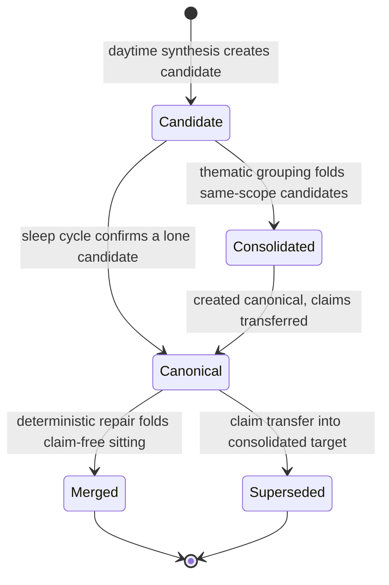
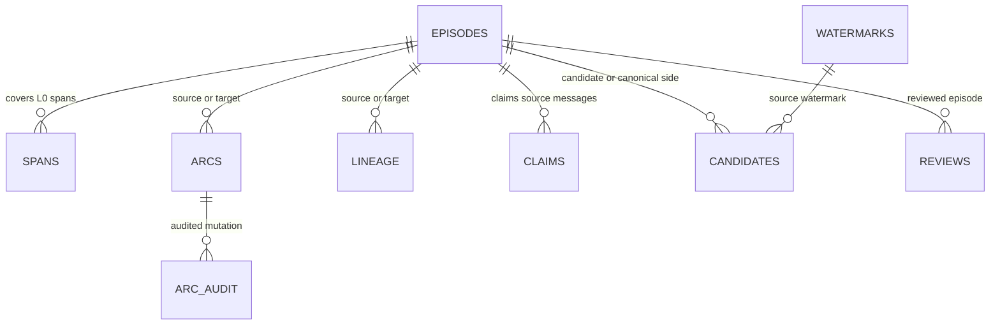

# Memory L0.1: Episodic Landmark Candidates, Arcs, and Watermarks

## What L0.1 is

L0.1 is the **episodic landmark layer** of canonical memory. It sits between L0
(the append-only, per-channel signed JSONL session archive on the filesystem)
and L2 (typed long-term memories with pgvector embeddings): bounded,
provenance-bearing records of stretches of conversation that mattered, stored
as Postgres rows with a versioned JSON contract, plus the graph edges (arcs,
lineage) and lifecycle state (watermarks, candidate decisions, message claims)
that surround them. The governing law is the operator-owned project charter
([`docs/PSFN_PROJECT_CHARTER.md`](../../docs/PSFN_PROJECT_CHARTER.md)): canonical
history is append-only and never rewritten; derived layers restore from
encrypted `pg_dump` backups, never from re-derivation.

Two hard facts define the layer's boundaries:

- **L0.1 is Postgres-only.** There is no SQLite runtime path. Episodes, spans,
  arcs, arc audit, lineage, processing watermarks, candidates, reviews, and
  message claims are all `postgres_runtime` surfaces created from
  `src/persistence/postgres/migrations.ts` and backed by the Postgres store
  created in `src/persistence/runtime-factory.ts`; restore is from encrypted
  backups, and repair of derived layers is supersede-based re-derivation from
  L0 with provenance intact.
- **Candidates, not verdicts** (ratified in `mirrors-and-letters.md`). Daytime
  synthesis output is a `candidate` episode — live and retrievable, the only
  record of the day — until the nightly sleep cycle consolidates or confirms it
  into a `canonical` episode. Machine heuristics are retrieval hints in a
  clearly machine-labeled sidecar, never felt experience; only the companion's
  own authorship (the dream-meaning pass) establishes felt affect and meaning.



*Episode lifecycle: born candidate, confirmed or folded by the nightly cycle, never deleted — merged and superseded rows stay for history and arc audit.*

## The episode contract

The canonical record shape is the `Episode` interface in
`src/shared/contracts/episodic-memory.ts`; every persisted row stores a
serialized copy in `l01_episodes.episode_json` (JSONB) beside the queryable
column projections. Key fields:

| Field | Meaning |
| --- | --- |
| `schemaVersion` | `1` or `2`. Version 2 (`EPISODIC_CONTRACT_VERSION = 2`) adds the `machineSignals` sidecar. Reads preserve the stored version verbatim — no silent shape drift; only explicit migration (bead h4fp.7) upgrades. |
| `id`, `title`, `landmark` | Stable id (`episode:<sha256-24>`), a short title, and the landmark: one or two sentences of narrative meaning. A machine-drafted landmark is a structural summary; only companion authorship turns it into an autobiographical account. |
| `startedAt`, `endedAt` | Canonical ISO-8601 UTC instants, `startedAt <= endedAt`. |
| `threadId`, `channelId` | `threadId` is **topic identity** (apq0), not a session. |
| `participantContactIds` | Sorted unique author ids from the covered entries. |
| `salience` | `score` plus optional `novelty`, `emotionalIntensity` — all unit-interval. |
| `affect` | The companion's felt affect. **Born empty** (`{ labels: [] }`) from synthesis; machine heuristics never write here. |
| `machineSignals` | v2-only sidecar: `source`, `topicTags`, optional machine `vad` — retrieval hints, never felt affect. |
| `themes` | Topic tags; deterministic synthesis produces the top-5 keywords (fallback `['conversation']`). |
| `spanRefs`, `artifactRefs` | L0 span references (`l0-session-span:<hash>` with channel/session/turn ids and instants) and artifact references inferred from entry metadata. |
| `provenanceRefs` | Kinds `l0_span`, `l0_artifact`, `turn`, `session`, `operator_note` — the durable link to L0. |
| `meaning` | Companion-authored prose: `{ text, recordedAt, source }` where source is `companion_dream_pass` or `companion_direct`. |
| `createdAt`, `updatedAt` | ISO instants. |

`parseEpisode` is a strict, fail-closed reader: unknown keys are rejected,
timestamps must be canonical instants, `startedAt <= endedAt`, at least one
span or artifact reference is required, `machineSignals` on a v1 record is
malformed (not silently upgraded), and `meaning.source` is restricted to the
two companion sources. `serializeEpisode` round-trips through the parser, so
every write is validated before it reaches the database. Arcs follow the same
discipline via `parseEpisodeArc`, with the source and target episode ids
required to differ.

## Daytime synthesis — the candidate lane

### Entrypoints and gates

Synthesis is rest-window-adjacent work triggered from turn cadence
(`src/faculties/memory/episodic/synthesis-lane.ts`). The lane registers the
post-turn action kind `memory.episode-synthesis.run` (background execution) and
a scheduler timer task `memory.episode-synthesis.timer`
(`scheduler.json episodeSynthesis.timerIntervalMinutes`, eligibility token
`memory.write`), plus a per-session turn-threshold trigger. Before any
processing, two deterministic zero-LLM gates run: **Gate 1** — new messages
since the durable processing watermark (a future-dated watermark is treated as
no evidence); **Gate 2** — a minimum companion-relevant turn count
(`minRelevantTurns`), where relevance reuses the group-chat addressing /
mention / attribution detection. Every skip is typed —
`no_new_messages`, `below_relevance_minimum`, `session_retired`,
`testing_session` — so the subsystem-health view can show why the lane did or
did not process a session. Because a held lane never advances the watermark,
unprocessed turns accumulate into the next period.

<!-- openwiki: mermaid parse failed and this diagram was converted to a text fence so it does not break rendering. Fix the diagram source and restore the mermaid fence. Parser error: Heuristic: a semicolon inside a label breaks rendering; rephrase the label. -->
```text
flowchart TD
    A["Recent session entries"] --> B["Filter conversational, sort, drop actively claimed entries"]
    B --> C["Deterministic grouping: UTC day, 45 min gap, 14-entry cap"]
    C --> D{"Topic segmentation enabled?"}
    D -->|no| E["Take newest maxEpisodesPerRun groups"]
    D -->|yes| F["LLM contiguous topic segments per chunk; open trailing topic held back"]
    E --> G["Build EpisodeCandidateInput with stable id, title, landmark, span refs"]
    F --> G
    G --> H{"Stable id already exists?"}
    H -->|yes| I["Decision superseded / discard"]
    H -->|no| J{"Scored consolidation target?"}
    J -->|yes| K["Decision merged / extend, first-person-preserving update"]
    J -->|no| L["Create episode with lifecycleStatus candidate"]
    I --> M["Claim source messages, persist candidate decision, commit watermark"]
    K --> M
    L --> M
    M --> N["Link arc to related prior episode, union topic threads, write lineage"]
```

*Daytime synthesis control flow: grouping, verdict resolution, durable claim + decision + watermark writes, then arc linking.*

### Grouping, salience, and candidate fields

`EpisodicSynthesizer.run` reads recent messages (default 96), keeps only
conversational user/assistant entries, sorts deterministically, repairs any
future-dated watermark, applies a lookback behind the watermark
(`max(gapSplitMs, 45 min)`), and **drops entries actively claimed by another
live episode** before grouping. Groups split on the UTC day boundary, a long
gap (`gapSplitMinutes`, default 45), or the entry cap (`maxEntriesPerEpisode`,
default 14). A group counts as salient only if it has at least
`minConversationalEntries` (default 2) entries or, for a single entry, at least
`minSingleEntryChars` (default 120) characters. Deterministic mode takes the
newest `maxEpisodesPerRun` (default 6) groups; older groups stay unclaimed
with the watermark behind them, so the next pass can pick them up.

Each group becomes an `EpisodeCandidateInput` with:

- **Stable id** `episode:<sha256-24>` over session id, span id, and per-entry
  fingerprints — repeated rest runs over the same spans reproduce the same id
  (idempotency).
- **Title** — the first Partner message clipped to 72 characters, else
  `Conversation about <top themes>`.
- **Landmark** — a deterministic structural summary:
  `A N-message exchange with X Participant turns and Y assistant turns around <themes> from <start> to <end>.`
- **Salience** — heuristic `0.35 + min(0.3, entries/40) + min(0.2, chars/4000)`,
  novelty from theme/Partner-turn density, emotional intensity from punctuation
  and keyword markers.
- **Affect** — born `{ labels: [] }` (bead h4fp.6). The old machine-felt-affect
  inference is gone: keyword/VAD heuristics move to `machineSignals`
  (`source: 'deterministic_synthesis'`, topic tags `positive` / `concerned` /
  `focused`, a machine VAD estimate), explicitly labeled as retrieval hints,
  never as the companion's felt state. This is test-enforced: synthesized
  episodes carry `affect: { labels: [] }` and no `meaning`.
- **Span ref** — `l0-session-span:<hash>` with channel, session, start/end turn
  ids, and instants.
- **Provenance refs** — `l0_span` for the span, `session`, up to 12 `turn`
  refs, and `operator_note` refs lifted from entry metadata; artifact refs come
  from metadata `artifacts` arrays.
- **Topic thread** — a new episode seeds its **own singleton thread**
  (`threadId = id`), never the session id (apq0).

### Hard message claiming

Every covered source message is claimed under key
`l0-message:<channelId>:<entryId>`. A partial unique index guarantees **at
most one active claim per key across all episodes**, so overlapping passes can
never re-process the same turns. Synthesis pre-checks claim availability before
mutating store state (a conflict aborts the run without creating or extending
an episode, since new episodes cannot be claimed before they exist), then
writes the authoritative claims after the episode exists. Re-claiming for the
same episode is idempotent. Claims are never deleted: transferred claims are
retained as history.

### Verdicts — how a candidate is resolved at write time

Each candidate group is resolved against live state before any mutation:

1. **Superseded** — a canonical episode with the same stable id already
   exists: the candidate is discarded (`action: 'discard'`, status
   `superseded`).
2. **Merged** — a consolidation target scored high enough: the candidate is
   folded into the live episode via
   `updateEpisodePreservingFirstPersonFields(mergeEpisodeWithCandidate(...))`
   (`action: 'extend'`, status `merged`).
3. **Created** — otherwise a new episode with `lifecycleStatus: 'candidate'`
   is created (`action: 'create'`, status `canonical` on the decision row —
   the *decision* records the verdict while the *episode* stays a candidate
   until the sleep cycle).

Consolidation scoring requires a matching scope (channel plus span-session or
thread identity) and a merge only when there is semantic overlap (theme
overlap ≥ 1 or artifact overlap > 0) **and** span overlap (≥ 0.5 of the
smaller span, or shared turn boundaries with a gap ≤ 10 minutes). Scores rank
by span overlap, theme overlap, artifact overlap, boundary overlap, then time
gap.

Every verdict is recorded as an `EpisodeCandidateDecision` row (status
`pending | accepted | canonical | merged | superseded | rejected |
needs_review`) with the candidate's full JSON snapshot, `overlapScore`,
`confidence`, provenance/artifact refs, and a link to its source processing
watermark. New canonical episodes created during synthesis are also linked to a
related prior episode in a 30-day window (`findRelatedSource`): a deterministic
arc is written (`buildArcInput` classifies
`continuation | causal | contrast | resolution | recurrence | same_theme |
operator_defined` with per-kind confidence), the two episodes' topic threads
are unioned (apq0), and a `derived_from` lineage row is recorded. The arc write
and the thread union are deliberately two steps — if the process dies between
them, `EpisodeArcWeaver` replays every persisted arc's thread assignment before
judging new arcs, so the write is retryable even though the candidate's source
turns are already claimed.

### Two-phase processing watermark

Durability ordering matters (mlwk.8): the watermark row is first **reserved** —
created or updated as the decision's FK target without advancing the processed
span — then, only after the decision row persists, the span is advanced in a
**commit** phase (`updateWatermarkDecisionArtifacts`). A failed decision write
therefore cannot mark a span processed. Watermark instants are clamped to the
runtime clock so durable watermarks can never jump into the future; a
future-dated watermark found at run start is rewound to the retained-transcript
boundary with a repair artifact.

### LLM topic segmentation (E5.4)

When enabled via `scheduler.json` (`episodeSynthesis.topicSegmentationEnabled`),
the deterministic cuts remain the **outer bounds** of each gated chunk; within
a chunk an LLM proposes contiguous topic segments (`proposeTopicSegments`). The
contract is schema-bound and fail-closed: segments must cover every entry
exactly once in order, `status: 'open'` is allowed only on the final segment,
and a malformed proposal throws — the chunk writes and claims nothing, a typed
`failed` segmentation event fires, and the watermark never advances past the
chunk so its turns stay visible to the next pass. An open trailing topic of the
newest chunk is held back (not claimed, no episode) and rolls into the next
pass. Enabling segmentation without an LLM provider fails closed at
construction time — it never silently degrades to deterministic cuts.

## The nightly lifecycle

Sleep consolidation, arc weaving, the dream-meaning pass, and the orientation
rewrite run **only** from the `memory.sleeptime.rest-window` scheduler task
inside the `episodicProcessing` rest window (default 00:00–09:00 plus 60
minutes of inactivity); `SleeptimeMemoryAgent` throws at construction without a
rest-window config and exposes no turn-cadence inference surface
(`inferPostTurnActions` is absent — test-enforced unreachability). The heavy
passes run in isolation: one pass failing does not cancel the others.

### Stage 1 — candidate consolidation

`SleepCycleEpisodeConsolidator.run` clusters live `candidate` episodes in the
review window (default 60 days) by **real scope** (channel + span-session +
participants, never `thread_id`) with 45-minute adjacency. Single-candidate
clusters are **confirmed canonical deterministically**
(`confirmEpisodeCanonical`, idempotent). Multi-candidate clusters go through a
schema-bound LLM thematic grouping that must **exactly partition** the
cluster's candidate ids — no invented, dropped, or duplicated ids — and fails
closed per cluster: a typed failure event fires and candidates stay untouched
for the next night. Each multi-candidate group is folded into one consolidated
canonical episode:

- stable id `episode:consolidated:<hash>` over the sorted source ids, so a
  crash between episode creation and claim transfer converges on the next run;
- union of spans/artifacts/provenance with an **L0 coverage guarantee** (every
  covered transcript span keeps an `l0_span` provenance ref);
- machine signals merged (head's VAD preferred, tags unioned);
- the head's topic thread adopted — unless it is a legacy session-keyed
  thread, in which case the consolidated episode seeds its own;
- message claims moved via the transactional `transferEpisodeMessageClaims`:
  sources are marked **superseded — never deleted**, claims transfer with
  retained history, arc memberships are re-pointed so no arc dangles on a
  non-live episode, and `canonicalizes` lineage plus `superseded` candidate
  decisions are written per source.

### Stage 2 — deterministic repair

Time-adjacent, same-scope `canonical` episodes with **no active message
claims** (the pre-claim historical backlog) merge into the head of their chain
(`mergeChainIntoHead`), with `merges` lineage. Claim-holding episodes are
products of the claim-era pipeline and are protected: blind adjacency merging
would destroy deliberate thematic splits.

### Stage 3 — bounded LLM refinement

For unrefined in-window episodes (default 36 hours), the LLM rewrites `title`,
`landmark`, `themes`, and `salience` from real transcript excerpts. The system
prompt is explicit that the landmark is "one or two sentences of narrative
meaning — never message counts or statistics," and that exchange length must
not drive salience. Refinement preserves `affect`, `machineSignals`, and
companion-authored `meaning` untouched; episodes without transcript coverage
are skipped rather than refined from metadata alone (no confabulated meaning).
Runs are capped (`maxRefinementsPerRun` default 8, `maxConsolidationsPerRun`
default 6) and tracked in the watermark's `refinedEpisodeIds`.

### Dream-meaning pass — the only author of felt meaning

`DreamMeaningPass` runs in the companion's first-person persona context through
the agent loop on the reflection model (the `memory` purpose slot), grounded in
**actual attributed turns** via per-episode transcript excerpts (bead dtym) —
never a summary-of-a-summary. It writes `meaning` through the companion-authored
store port (`source: 'companion_dream_pass'`). Its nightly budget is
prioritized deterministically: highest participant contact-trust first
(`trustOrd`), then machine-signal density, then oldest-first, so the capped
review lands on likely-mattering episodes. Each meaning is bounded to one
atomic moment (at most 4 sentences / 800 characters), and episodes whose
transcript reader threw are deferred — a failed read must never author
first-person meaning from title/landmark alone. Unreviewed episodes render with
an explicit **unreviewed** marker in companion-facing retrieval, so a machine
draft never reads as a settled autobiographical account.

### Arc formation and topic threads

`EpisodeArcWeaver` runs on a slower cadence (default 6-day interval, 30-day
review window) and links **canonical episodes only** — candidates wait for
consolidation — into cross-day narrative arcs via an LLM judgment with typed
fail-closed outcomes (`proposal_rejected`, `judgment_failed`; a malformed or
low-confidence proposal is rejected individually, never partially applied, and
an empty arcs array is a valid answer). Arc membership is mutable
(join/leave/re-point) with a full audit trail in `l01_episode_arc_audit`
(`written | repointed | removed`, actor, reason).

**Topic-thread identity (apq0).** An episode's `threadId` is the connected
component of the arc graph: each episode starts as its own singleton thread,
and every arc between two episodes unions their threads onto the
lexicographically-smallest episode id — deterministic and order-independent, so
a global recompute over the same arc set reproduces the live assignment
exactly. A single union is bounded by `maxThreadEpisodes` (default 500); an
oversize losing thread is left unmerged fail-safe and surfaced via a typed
`memory.episodic.thread_assignment` event, never silently mis-threaded.
Pre-apq0 legacy rows carry `threadId = sessionId` (the unbounded per-channel
mega-thread); when an arc touches such an endpoint, that single episode is
first extracted into its own singleton thread so the mega-thread is neither
absorbed nor mass-relabeled.

## Persistence model

All L0.1 state lives in Postgres (`src/persistence/postgres/migrations.ts`);
there is no SQLite path.



*Core L0.1 tables: episodes plus spans, arcs, lineage, watermarks, candidates, reviews, and claims.*

- **`l01_episodes`** — `id` PK, `schema_version`, `title`, `landmark`,
  `status` (`candidate | canonical | merged | superseded`), self-referencing
  `canonical_episode_id` / `merged_into_episode_id` / `superseded_by_episode_id`,
  `thread_id`, `channel_id`, `started_at`/`ended_at` (CHECK
  `started_at <= ended_at`), participant/themes/artifact/provenance/scope/consent
  JSONB columns, `salience_score` + `salience_json`, `affect_json`,
  `embedding VECTOR` with embedding profile columns, `episode_json` (the L0.1
  contract), `affect_authorship`/`meaning_authorship`, timestamps. Indexes cover
  scope/time, thread/time, channel/time, status, canonical, embedding, and GIN
  indexes over participants, themes, artifact refs, provenance refs, scope,
  consent flags, and `episode_json`.
- **`l01_episode_spans`** — one row per span ref with `span_range TSTZRANGE`
  (GIST) for range search.
- **`l01_episode_arcs`** — arc rows with `source_episode_id <> target_episode_id`,
  status lifecycle mirroring episodes, and `arc_json`.
- **`l01_episode_arc_audit`**, **`l01_episode_lineage`** (`relation`
  constrained to `canonicalizes | merges | supersedes | splits_from |
  derived_from | conflicts_with | updates`), **`l01_processing_watermarks`**
  (unique scope `(processor, source_ref, channel_id, thread_id, session_id)`,
  status `active | reconciling | blocked | complete`), **`l01_episode_candidates`**
  (status `pending | accepted | canonical | merged | superseded | rejected |
  needs_review`, `overlap_score` and `confidence` in [0,1]),
  **`l01_episode_reviews`** (status
  `pending | approved | rejected | merged | superseded | dismissed`,
  `recommended_action` `canonize | merge | supersede | reject |
  needs_human_review`), and **`l01_episode_message_claims`** (PK
  `(episode_id, claim_key)`, status `active | transferred`, `transferred`
  requires `transferred_at`, and the partial unique index on
  `claim_key WHERE status = 'active'`).

Live queries use the shared filter `ACTIVE_CANONICAL_EPISODE_FILTER`
(`status IS NULL OR status IN ('canonical','candidate')` plus
`canonical_episode_id IS NULL OR = id` and no merged/superseded pointer) —
which is why **candidates are live memory**: they are the only record of the
day until the sleep cycle runs. Semantic search embeds episodes into pgvector
using a deliberately narrow document projection (`l01-episode-search/1`):
title, landmark, themes, affect labels, and companion meaning only —
transcript, participant, and provenance data are never embedded. Indexing is
write-through via an attached live indexer plus a bounded backfill
(`EpisodeSemanticIndexer`).

### First-person authority at the SQL boundary

`PostgresEpisodeFirstPersonWriter` is the only writer of episode rows. Machine
callers (`createEpisode`, `updateEpisode`,
`createEpisodePreservingFirstPersonFields`) cannot originate first-person
content: a machine full-row update that changes `affect` or `meaning` fails
unless every component comes from persisted source rows (the preservation port
proves each carried component), and a machine update that would **drop**
companion-authored meaning fails — erasure exists only on the
companion-authored narrow patch (`updateCompanionAuthoredEpisode`, which also
forbids setting and clearing meaning together). Updates are compare-and-swap
against the persisted `episode_json` and authorship columns, so a concurrent
companion write is never silently overwritten by stale machine state.
Authorship is persisted per field
(`none | companion | companion_preserved | legacy_unknown`; NULL means legacy,
never guessed or backfilled) with DB CHECK constraints tying
`affect_authorship = 'none'` to `affect_json = '{"labels": []}'` and
`meaning_authorship` values to the presence of `meaning` in `episode_json`.

## Invariants and failure semantics

- **One live claim per source message** — enforced by a partial unique index;
  synthesis aborts before mutation on a conflict, and only the nightly
  consolidation may restructure claims (via transfer).
- **Supersede, never delete** — merged/superseded episodes, arcs, and
  transferred claims remain as history; arc memberships are re-pointed so
  nothing dangles on a non-live episode.
- **Candidates are live** — search/list surfaces include them until the sleep
  cycle confirms or folds them.
- **Fail closed on LLM output** — segmentation, thematic grouping, and arc
  judgment all throw on schema violations; nothing is partially applied,
  watermarks do not advance, and typed failure events reach the event bus.
  Enabling a feature without its provider fails at construction.
- **Affect/meaning are companion-only** — no machine path writes them; a v1
  row never silently gains v2-only `machineSignals`; merges prefer the
  survivor's authored meaning and preserve affect components from persisted
  sources only.
- **Watermarks never run ahead of truth** — two-phase reserve/commit ordering,
  clock clamping, future-watermark repair, and lookback keep a failed run from
  skipping spans.
- **Stable ids make everything retryable** — candidate ids over entry
  fingerprints and consolidated ids over source-id sets mean a crash between
  episode creation and claim transfer converges on the next run instead of
  duplicating state.

## Configuration and operations

Tuning is JSON-owned (`scheduler.json`, seed defaults in
`config/scheduler.seed.json`):

- `episodeSynthesis` — `timerIntervalMinutes`, `turnThreshold`,
  `minRelevantTurns`, `transcriptMessageLimit`, `maxEpisodesPerRun`,
  `maxPriorCandidates`, `gapSplitMinutes`, `maxEntriesPerEpisode`,
  `minConversationalEntries`, `minSingleEntryChars`,
  `topicSegmentationEnabled` (+ provider wiring);
- `sleepConsolidation` — `reviewWindowDays`, `refinementWindowHours`,
  `adjacencyGapMinutes`, `maxRefinementsPerRun`, `maxConsolidationsPerRun`,
  `transcriptMessageLimit`, `maxTranscriptCharsPerEpisode`;
- `arcFormation` — `passIntervalDays`, `reviewWindowDays`, `minConfidence`,
  `maxArcsPerRun`, `maxEpisodesPerRun`;
- `episodicProcessing` — `enabled`, `startLocalTime`, `endLocalTime`,
  `timeZone`, `inactivityThresholdMinutes` (the rest window that gates every
  sleeptime pass).

The synthesis lane and the sleeptime operation both require the `memory.write`
capability token. Diagnostics surface through `getMaintenanceDiagnostics`
(decision counts by status, duplicate rates, watermark queue age) and typed
events — `memory.episodic.thread_assignment`, `memory.episode_synthesis.gate`,
`memory.episode_synthesis.segmentation`,
`memory.sleep_consolidation.failure`,
`memory.sleep_consolidation.refinement_gate`, and
`memory.arc_formation.outcome` — for the Garden subsystem-health view. Repair
of derived layers is supersede-based re-derivation from L0 with provenance
intact, never deletion; restoration is via encrypted `pg_dump` backups.

## Extension points

- **Topic segmentation (E5.4)** — an optional LLM stage inside deterministic
  chunk bounds; absent or disabled keeps the deterministic path byte-identical.
- **Candidate verdict pipeline** — `l01_episode_reviews` and the
  `needs_review` decision status exist for a reviewer surface; currently the
  sleep cycle resolves verdicts deterministically or via schema-bound
  judgments.
- **Companion authorship ports** — `CompanionAuthoredEpisodicStorePort`
  (affect/meaning patches) and `FirstPersonPreservingEpisodicStorePort`
  (machine lifecycle with preserved components) are deliberately separate
  capability surfaces.
- **Semantic index** — the search-document projection is versioned
  (`l01-episode-search/1`) and indexable via `EpisodeSemanticIndexer` backfill
  or live indexer attach.
- **Historical repair (h4fp.7/h4fp.8)** — migration of v1 rows and recompute
  of thread assignments are separate, documented concerns that reproduce the
  live deterministic assignment exactly.

## Related pages

- `/openwiki/memory/l0-archive.md` — the L0 filesystem JSONL layer that L0.1
  derives from.
- `/openwiki/memory/l2-typed.md` — the L2 typed-memory layer with pgvector
  embeddings.
- `/openwiki/memory/overview.md` — the three-layer memory architecture.
- `/openwiki/memory/projection.md` — search and retrieval projections over the
  layers.
- `/openwiki/runtime/scheduler.md` — scheduler-owned lanes, rest windows, and
  capability tokens that drive L0.1.
