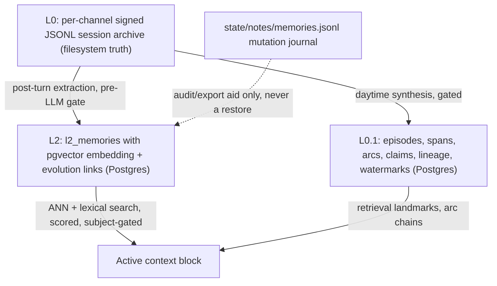
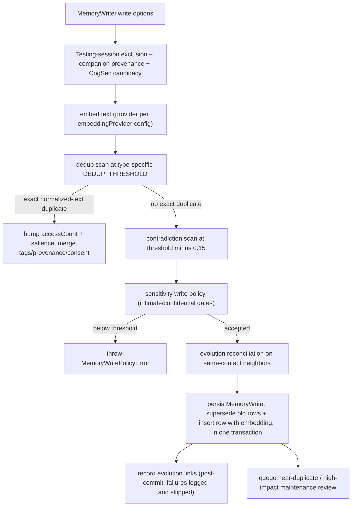
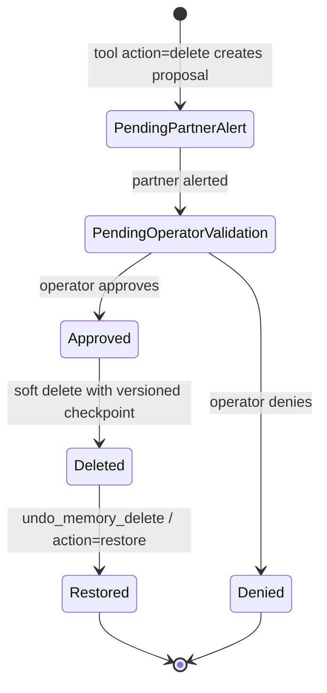
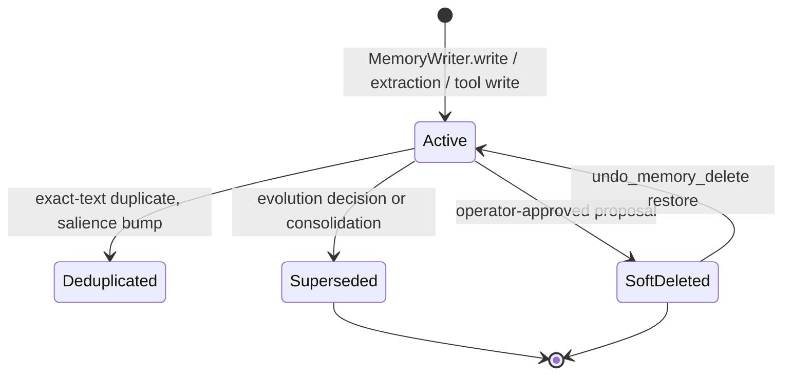

# Memory L2: Typed Long-Term Memory with pgvector Embeddings

## What L2 is

L2 is the **typed long-term memory layer** of canonical memory. Where L0 is the
append-only, per-channel signed JSONL session archive on the filesystem and L0.1
is the episodic landmark layer (`l01_*` Postgres tables, see
[`l01-episodes.md`](l01-episodes.md)), L2 stores durable, typed facts —
`PurrMemory` rows with pgvector embeddings, evolution links, maintenance
reviews, soft-delete version checkpoints, and recent-contact shapes — in
Postgres `l2_*` tables. The governing law is the operator-owned project charter
([`docs/PSFN_PROJECT_CHARTER.md`](../../docs/PSFN_PROJECT_CHARTER.md)): canonical
history is append-only and never rewritten; derived layers restore from
encrypted `pg_dump` backups, never from re-derivation.

Three hard facts define the layer:

- **L2 is Postgres + pgvector only.** There is no SQLite runtime path. The
  `l2_memories` table and its satellites (`l2_memory_subject_classifications`,
  `l2_memory_subject_contacts`, `l2_memory_delete_versions`,
  `l2_memory_abstraction_links`, `l2_memory_patch_events`,
  `l2_memory_maintenance_reviews`, plus `memory_evolution_links` and the
  deletion-proposal tables) are created from
  `src/persistence/postgres/migrations.ts` (`POSTGRES_MEMORY_MIGRATIONS`).
- **The JSONL mutation journal is an audit mirror, not a restore primitive.**
  Every L2 mutation appends to `state/notes/memories.jsonl` via `MemoryJournal`
  (`src/faculties/memory/journal.ts`), whose file header is explicit: embeddings,
  evolution links, and Postgres-only memory tables are restored from encrypted
  database backups. Nothing replays the journal as a restore.
- **`episodic` L2 memories are not L0.1 episodes.** The seven L2 memory types
  are `boundary`, `emotional`, `episodic`, `procedural`, `reflection`,
  `relational`, `semantic`; an `episodic` L2 row is a typed long-term category,
  while L0.1 `l01_episodes` rows are provenance-bearing landmarks used to scope
  recall.



*L2 is a Postgres-only derived layer fed by L0 extraction; its JSONL mutation journal is an audit mirror, never a restore primitive.*

## The record shape

The canonical record is `PurrMemory` (`src/faculties/memory/types.ts`):

| Field | Meaning |
| --- | --- |
| `id` | uuidv7 row id. |
| `text`, `type`, `importance`, `confidence` | The fact, one of the seven types, and unit-interval scores. |
| `emotionalValence`, `formationVAD?`, `emotionalTexture?` | Dominant scalar plus the multi-signal VAD vector and discrete-emotion distribution captured at formation. |
| `salience`, `salienceDecayAnchorAt?` | Retrieval weight and the epoch the stored salience snapshot was calculated at. |
| `sourceRef`, `sourceType`, `provenance` | Durable source identity (`MemoryProvenance`: channel, companion, turn, tool, session, subject contacts, source-message spans, and the fail-closed `sourceConversationAt` admission instant). |
| `extractedAt`, `lastAccessed`, `accessCount` | Lifecycle timestamps and access reinforcement. |
| `supersededBy?` | Evolution supersession pointer. |
| `tags`, `scopeRef`/`scopeTags`, `provenanceRefs` | Queryable facets. |
| `retentionClass` (`standard` \| `durable`), `sensitivity` (public \| personal \| intimate \| confidential), `consentFlags`, `contactId?` | Policy facets feeding write gates, retrieval gating, and privacy-risk scoring. |
| `deletedAt`/`deletedBy`/`deleteReason` | The soft-delete triple; nothing is hard-deleted outside bulk maintenance paths. |

Rows persist in `l2_memories` with a pgvector `embedding VECTOR` column, a
generated `search_vector` tsvector (`to_tsvector('simple', ...)`), GIN indexes
over tags/scope/provenance JSONB, and lifecycle indexes over
`superseded_by`/`deleted_at`. Two extra columns back subject authorization:
`authorization_revision` (monotonic per-row counter) and
`subject_evidence_digest` (SHA-256 of the classified evidence; NULL means
"needs (re)classification"). The vector-extension migration fails closed unless
pgvector is installed in `public` or `extensions`, and tenant migrations require
the explicitly provisioned `extensions` schema
(`src/persistence/postgres/vector-extension-migration.ts`).

## Embeddings

### Providers and configuration

`src/faculties/memory/embedding.ts` defines the three runtime provider kinds —
`ollama`, `transformers`, `api` — each with its own model, dimensions, and
defaults (ollama `nomic-embed-text` 768, transformers `Xenova/all-MiniLM-L6-v2`
384, api `text-embedding-3-small` 1536). The provider is resolved by
`createEmbeddingProviderFromConfig` from `settings.json` `embeddingProvider` and
per-provider model/dims; `resolveEmbeddingProviderKind` throws when the provider
is missing or unsupported — startup no longer defaults embeddings from seed
config. API credentials resolve through the credential vault
(`EMBEDDING_API_KEY` / `OPENAI_API_KEY` env-name references or an explicit
`embeddingApiKeyRef`).

### Fail-closed warmup and dimension checks

`warmupEmbeddingProvider` embeds the sentinel `__psfn_startup_embedding_warmup__`
at startup and **fails startup** on any error or on a dimension mismatch against
the configured `dims`. Every insert and search path validates the embedding
dimension (`validateEmbeddingDimensions`) so a stale or mis-configured vector
never silently lands. A missing pgvector extension or an embedding-dimension
mismatch is a startup failure, never a silent fallback to app-side array
scanning.

### The dimension-pinned ANN index

The embedding column is declared as an unbounded pgvector `VECTOR` because the
runtime dimension is config-owned, but HNSW requires a fixed dimension
(`src/faculties/memory/postgres-store/embedding-index.ts`). The runtime therefore
builds a partial HNSW cosine index over the fixed-dimension cast expression
`embedding::vector(N)`, and every ANN query orders by the identical cast so the
planner uses the index. The live index name carries the dimension as a `_d<N>`
suffix — a dimension change mints a NEW index name and the stale sibling is
detected and dropped, so a stale index can never silently full-scan semantic
search forever. The candidate pool oversamples the requested page
(`ANN_CANDIDATE_OVERSAMPLE = 4`, floor 200, ceiling 1000) and `ef_search` is
pinned to at least the pool; on pgvector ≥ 0.8 iterative scans make a filtered
top-k exact up to `hnsw.max_scan_tuples`. The index build runs concurrently
during startup and is registered as optional readiness for the process.

### Embedding usage accounting

`withEmbeddingUsageAccounting` (`src/faculties/memory/embedding-accounting.ts`)
wraps any embedding provider and records a `callKind: 'embedding'` usage event
per call into the shared `ModelUsageRecorder`:

- **Settlement** is `complete` when provider cost evidence reconciles,
  `partial` when `hasProviderCostEvidenceConflict` fires on the raw usage, and
  `unknown` when no usage details are available — so contested cost evidence
  never silently settles as complete.
- **Attribution** is built from the request context (companion/session/channel/
  turn/tool/shard/subagent) merged with `EmbeddingUsageProvenance`
  (`callType`, `purpose`, `originType`, `originStage`, `service`, `process`,
  `runtimeLaneClass`, `workloadType`, `workloadId`), with `telemetryVisibility`
  honoring `companion_private`.
- **Costs** reconcile provider-reported cost against `estimatedRates` when the
  provider did not report one; failures are recorded as `status: 'failure'` with
  error code/message and re-thrown.

The wrapper marks itself `recordsModelUsageInternally: true` so callers can
avoid double-counting. Composition (`src/system/config/provider-runtime-factory.ts`)
wraps the configured provider with accounting whenever a Postgres model-usage
store exists, resolving cost rates per provider/model identity.

## Write path

`MemoryWriter.write` (`src/faculties/memory/writer.ts`) runs every durable L2
write through the same pipeline:



*The L2 write pipeline: dedup and contradiction scans run in Postgres/pgvector, policy gates fail closed, and the insert plus supersede commits atomically.*

Details that matter:

- **Pre-write gates.** Every write asserts `assertTestingSessionExcluded`
  (a testing-session id throws `TestingSessionMemoryWriteError` — testing
  sessions never write durable memory), `assertCompanionProvenance` (companion
  provenance binding via `assertCompanionMemoryProvenance`), and
  `assertCogSecCandidacy`: `evaluateCogSecMemoryCandidacy` (risk classes A–E,
  disposition allow/review/reject), optionally consuming an intake sink-gate
  decision for the `memory_write` sink; rejection throws
  `MemoryCandidacyPolicyError`.
- **Dedup is exact-text, not paraphrase.** The dedup stage suppresses a write
  only when the embedding neighbor ALSO has byte-identical normalized text
  (whitespace/case-folded), same type, same contact, and compatible scope. A
  restated fact with new phrasing inserts as a `created` row — a deliberate
  design choice that keeps healthy paraphrase evolution alive; near-duplicate
  stacks are flagged as `merge_candidate` maintenance reviews instead.
- **Sensitivity policy.** `intimate` writes need `minSalience 0.6 /
  minNovelty 0.18`; `confidential` need `0.72 / 0.3`; `public`/`personal` are
  ungated (`MEMORY_CONFIG.sensitivityWriteThresholds`). Novelty is computed from
  the same-contact contradiction-scan similarities. A failed gate throws
  `MemoryWritePolicyError` with the threshold breakdown.
- **Atomic commit.** `persistMemoryWrite` marks superseded rows and inserts the
  new row inside one `runInTransaction`: a dedicated client with
  BEGIN/COMMIT, AsyncLocalStorage capture of fire-and-forget writes, and a
  rollback that restores the in-memory cache snapshots and marks the retrieval
  corpus changed. Embeddings are not hydrated into process memory (a27w.1) —
  the database ROLLBACK is the sole authority for their transactional state.
- **Evolution links are post-commit.** `supersedes`/`updates`/`negates`/
  `conflicts_with` links are recorded AFTER the memory is durable; a link
  failure is logged and skipped, never reported as a write failure, so a
  persisted memory is not re-written twice.
- **Maintenance reviews are queued post-write.** `MemoryMaintenanceScheduler`
  upserts `near_duplicate`, `provenance_confidence`,
  `high_impact_low_confidence`, and `conflicting_memory` reviews into
  `l2_memory_maintenance_reviews`.
- **Journal mirror.** `insertMemory` calls `journal.onInsert`, so every durable
  row is mirrored to `memories.jsonl` (see above).

## Decay and maintenance

Salience decays exponentially from `salienceDecayAnchorAt` with per-type
half-lives from the retrieval policy, composed with retention multipliers:
durable ×8, durable-preference ×12, and emotional persistence scaling with
formation intensity (`getMemoryDecayProfile`, `types.ts`).

`calculateEffectiveMemorySalience` (`src/faculties/memory/decay.ts`) computes the
effective salience lazily at ranking time:

```
decayFactor = exp((-ln2 * max(0, now - decayAnchorAt)) / halflife)
effectiveSalience = max(salienceFloor, storedSalience * decayFactor)
```

`SalienceDecay` persists floor-enforced values on the hourly maintenance sweep
(`MEMORY_CONFIG.maintenanceIntervalMs = 3_600_000`) with:

- **Tracked anchors.** Per-memory `TrackedDecayAnchor` records base salience,
  decay epoch, last persisted salience, half-life, and floor; anchors are
  re-derived only when the memory's salience inputs change.
- **Meaningful-delta writes.** A row is written only when the computed value
  differs from the stored salience by more than `MEANINGFUL_SALIENCE_DELTA`
  (0.01), and `nextMeaningfulDecayAt` schedules the next wake precisely at the
  crossing time so no-op runs are skipped.
- **Revision-based skip.** When the store exposes
  `getSalienceMaintenanceRevision`, a run whose revision is unchanged before the
  next meaningful decay time returns immediately; own writes bump the revision
  counter, and a mismatched revision count invalidates the tracked state so the
  next run re-derives. Stores without the revision primitive fall back to an
  eager paged sweep.

Access bumps salience: dedup and access paths raise salience by
`MEMORY_CONFIG.salienceBumpOnAccess` (0.05) up to 1. The sweep is registered as
the background maintenance operation `salience-decay` with `memory.write` token
eligibility (`src/app/agent/scheduler-runtime.ts`).

## Subject classification and authorization

### Classification

`classifyMemorySubject` (`src/faculties/memory/subject-classification.ts`)
derives a `MemorySubjectClassification` for a memory revision:

- **Subject classes** (`src/shared/contracts/memory-subject.ts`):
  `single_contact`, `multiple_contacts`, `shared_room`, `companion_private`,
  `unbound_person`, `unattributed`, `ambiguous`.
- **Evidence order.** Explicit `subjectContactId`/`subjectContactIds`
  (single vs multiple, with `shared_room` when the address mode is
  `overheard_room_context` in a structured room); otherwise canonical
  mention-routing via `resolveCanonicalMemorySubjectContactId` (mention
  contacts win over routed/source/trigger contacts); otherwise
  `companion_private` for reflection/heartbeat/shard/subagent sources and
  system/shard scopes; otherwise an unbound named person (hashed label); else
  `unattributed`. Contradictory room evidence or an unknown contact in the
  valid-contact set downgrades to `ambiguous`.
- **Digest binding.** `createMemorySubjectEvidenceDigest` hashes text, type,
  source, provenance, refs, contacts, scope, tags, and embedding, so the
  classification is provably bound to the exact evidence it was computed from.

### The SQL projection

The Postgres projection is trigger-maintained
(`src/persistence/postgres/migrations.ts`):
`l2_memory_subject_classifications` (status `current`/`invalidated`, CHECK
constraints per class) and `l2_memory_subject_contacts`. A BEFORE UPDATE trigger
bumps `authorization_revision` and NULLs `subject_evidence_digest` whenever any
subject-evidence column changes; an AFTER INSERT/UPDATE trigger invalidates
stale classifications. Startup backfills classifications to completion
(`runMemorySubjectBackfillToCompletion`) and logs coverage gaps.

### The default-deny authorized store

Product recall goes through `createSubjectAuthorizedMemoryStore`
(`src/faculties/memory/subject-authorized-store.ts`), a `Proxy` over the raw
store with an explicit subject-authorization projection for every
`MemoryStorePort` member:

- `MEMORY_STORE_METHOD_POLICY` is an exhaustiveness gate: adding a method to the
  port fails to compile until it is classified `authorized` or
  `pass-through-safe`. At runtime only `pass-through-safe` methods (process-local
  counters, capability-free `runInTransaction`, companion scratchpad) reach the
  raw store; any other unclassified callable throws loudly ("default-deny").
- Authorized reads (search, detail, list, admin page/summary, links) route
  through `queryAuthorizedMemorySubjects`/`aggregateAuthorizedMemorySubjects` —
  hard SQL predicates, never post-hoc JS filtering. `getByIds`/link endpoints
  authorize every referenced endpoint in bounded batches of
  `MEMORY_SUBJECT_DETAILS_BATCH_MAX` (256); batching never widens access.
- Companion-internal-only primitives (`listActiveMemoriesInWindow`) throw
  through the proxy; maintenance lanes (`bulkUpdateSalience`,
  `backfillMemorySubjectClassifications`) deny.
- The access context must come from resolved ingress/correlation
  (`memorySubjectAccessContextFromCorrelation` reads `viewerMemorySubjectContactId`
  and requester provenance) — never from tool or request parameters. Admin
  projection modes (`sole_admin`, `multi_admin`) are set only from a signed
  fleet-actor context; `multi_admin` hides intimate/confidential "other"-relation
  rows unless an audited escalation clears `escalated`.

### The SQL predicate

`buildMemorySubjectAuthorizationPredicate` (`src/faculties/memory/postgres-store/subject-policy.ts`)
emits an `EXISTS` clause over the current classification row for the memory,
requiring: matching classifier version, memory revision, and evidence digest;
`subject_class` within the allowed set; a viewer relation (`self` for
single_contact matching a viewer contact, `co_subject` for
multiple_contacts/shared_room, `other`, or `none` for contact-less rows); the
multi-admin sensitivity carve-out; and JIT grant bindings (memory id + revision
+ classifier version + digest) when the caller consumed an audited grant.
`parseMemorySubjectQueryAuthorization` validates the authorization object and
rejects a stale classifier version — authorization cannot silently fall back to
an older classifier.

### Raw search fails closed

The raw `PostgresMemoryStore.searchByEmbedding` (`src/faculties/memory/postgres-store.ts`)
**throws** unless the caller declares `{ authorization:
'bypass-system-internal' }` — an auditable, greppable opt-out for
memory-formation dedup/contradiction scans and operator admin surfaces. A
product-recall caller accidentally wired to the raw store with
`'subject-enforced'` throws instead of leaking unscoped rows. Retrieval builds a
subject-authorized store per call from the request context (plus the canonical
contact id for cross-channel continuity) and asserts the matching stance.

## Retrieval and the model-facing tool surface

`MemoryRetriever.retrieve` (`src/faculties/memory/retrieval.ts`) assembles the
memory prompt block for a turn: budget resolution, recent-contact-shape and
emotional-snapshot access, episodic landmark chains, then the semantic
`searchByEmbedding` ANN pass (candidate limit `max(40, limit * 4)`) plus lexical
augmentation (`collectRecentLexicalMemoryCandidates` / `searchByText` fallback),
followed by quarantine filtering, scoring, and budget-bound selection. Foreground
turns never block on retrieval — the turn serves the cached active-memory context
and schedules a background refresh, with degraded state surfaced through typed
events.

`registerMemoryTools` (`src/faculties/memory/runtime-wiring.ts`) registers the
canonical `memory` tool with actions `write`, `search`, `episode_search`, `get`,
`shared_background`, `census`, `exists`, `timeline`, `import`, `patch`,
`redact`, `delete`, `restore` (`src/faculties/memory/tools.ts`), plus the
scratchpad tool. Tool writes stamp provenance: `source:tool:<name>|invocation:<id>`
source refs, shard/subagent internal origins via the
`__psfnShardSource` parameter, request-context session ids (so testing-session
writes both trip the writer fence and are purgeable), and — for fresh live-turn
writes only — `sourceConversationAt: Date.now()` (import/patch/redact never
claim now as their conversation time, failing closed for since-demoted rooms).

## Deletion: operator-gated proposals

Deletion is deliberately not a model decision. The `memory` tool `delete` action
requires a `justification_category` validated against `settings.json`
`memoryDeletionPolicy` (`resolveMemoryDeletionJustification`: unknown, ineligible,
or unsubstantiated categories throw), plus a written `explanation`; it then
creates a proposal and requests partner/operator approval — the memory stays
active until the operator approves.



*Deletion lifecycle: proposals flow companion → partner alert → operator validation; deletion is a soft delete with a versioned checkpoint that restore undoes.*

- **Proposal store.** `PostgresMemoryDeletionProposalStore`
  (`src/faculties/memory/postgres-store/deletion-proposals.ts`) implements
  `MemoryDeletionProposalStorePort` (`src/faculties/memory/deletion-proposals.ts`)
  with row-level `FOR UPDATE` locking, a full audit event log
  (`proposed`/`partner_alerted`/`approved`/`denied`/`deleted`/`restored`, actors
  Companion/Partner/Operator), and a unique partial index guaranteeing at most
  one pending proposal per memory. Proposals reference `l2_memories` with
  `ON DELETE RESTRICT`.
- **Soft delete + restore.** Approval creates a versioned checkpoint in
  `l2_memory_delete_versions` (full `PurrMemory` snapshot); `undo_memory_delete`
  / the tool `restore` action restores it. `MemoryJournal` mirrors soft deletes
  and restores to `memories.jsonl`.
- **Crash recovery.** `recoverPendingMemoryDeletionProposals`
  (`src/faculties/memory/deletion-proposal-recovery.ts`) rebuilds the volatile
  confirmation surface from durable pending proposals at startup.

## Lifecycle summary



*L2 memory lifecycle: rows are created, deduplicated in place, superseded via evolution links, and soft-deleted with versioned checkpoints; nothing is hard-deleted outside bulk maintenance paths.*

## Invariants and failure semantics

- **No SQLite runtime.** L2 is Postgres + pgvector only; the parity matrix
  classifies every surface and the runtime rejects other backends at startup.
- **Missing pgvector or embedding-dimension mismatch fails startup** — never a
  silent fallback to app-side array scanning; warmup and every insert/search
  validate dimensions.
- **Raw embedding search cannot leak.** Subject enforcement is mandatory on
  product recall; every bypass site is greppable by the literal
  `'bypass-system-internal'`, and the authorized proxy is default-deny for any
  unclassified port method.
- **Testing sessions never write durable memory**
  (`TestingSessionMemoryWriteError`); malformed intake-envelope ids fail the
  write.
- **Evolution links never rewrite a durable row.** A link failure is logged and
  skipped — the memory is already committed and is not re-written.
- **Authorization mutations fail closed.** `MemorySubjectAuthorizationDeniedError`
  is fatal for callers performing mutations; access-stat bookkeeping degrades
  instead of discarding the caller's work.
- **Deletion is soft and audited.** Every proposal transition appends an audit
  event inside the memory-store transaction; a proposal's `delete_id` is bound
  to a versioned checkpoint that restore undoes.

## Configuration and operations

- `settings.json` `embeddingProvider` (ollama | transformers | api) with
  per-provider models and dims, credential-vault resolution, and startup warmup
  (`src/faculties/memory/embedding.ts`); `memoryRetrievalPolicy` owns type
  half-lives, salience floors, retrieval priors, and caps; `memoryDeletionPolicy`
  owns justification categories and explanation patterns.
- `MEMORY_CONFIG` constants: `maintenanceIntervalMs` (3_600_000),
  `salienceBumpOnAccess` (0.05), `contradictionThresholdOffset` (0.15),
  `durableHalflifeMultiplier` (8), `preferenceDurableHalflifeMultiplier` (12),
  `sensitivityWriteThresholds` (`src/faculties/memory/types.ts`).
- `scheduler.json` / background maintenance registers the `salience-decay`
  operation with `memory.write` token eligibility.
- Startup runs migrations, validates the schema, detects pgvector iterative-scan
  support, backfills subject classifications, and builds the dimension-pinned
  HNSW index concurrently (optional readiness).
- Backups: encrypted `pg_dump` restores are the canonical restore primitive;
  `memories.jsonl` participates in backup verification as the L0 line-count
  check.

## Focused tests

- `postgres-store.test.ts` / `postgres-store.integration.test.ts` — migration
  SQL, lifecycle buckets (active/superseded/soft-deleted/restored), ANN search,
  transaction rollback, subject authorization end-to-end.
- `writer.test.ts` — dedup bump vs created, sensitivity policy rejection,
  CogSec candidacy, evolution supersession, atomic persist.
- `decay.test.ts` — effective-salience math, floors, multipliers, tracked-anchor
  sweep, revision-based skip, meaningful-delta writes.
- `embedding-accounting.test.ts` — usage-event recording, settlement
  (complete/partial/unknown), cost reconciliation, failure events.
- `subject-classification.test.ts` and `postgres-store/subject-policy.test.ts` —
  class derivation, evidence digests, SQL predicate shape and carve-outs.
- `subject-authorized-store.test.ts` — default-deny proxy, batch authorization,
  admin modes, mutation denials.
- `tools.test.ts` / `tools-episode-search.test.ts` / `tools-shared-background.test.ts` —
  the canonical `memory` tool contract, visibility gates, and deletion proposal
  flow.

## Related pages

<!-- openwiki: broken internal link [../memory.md] file "../memory.md" does not exist. Fix the href or restore the target, then delete this comment. -->
- [`memory.md`](../memory.md) — the three canonical layers (L0 JSONL, L0.1
  episodes, L2 typed memory) and the extraction seam.
- [`l01-episodes.md`](l01-episodes.md) — the L0.1 episodic landmark layer.
<!-- openwiki: broken internal link [../memory-persistence-authority.md] file "../memory-persistence-authority.md" does not exist. Fix the href or restore the target, then delete this comment. -->
- [`memory-persistence-authority.md`](../memory-persistence-authority.md) — who
  may write to canonical storage, layout ownership, and runtime (Postgres)
  authority.
<!-- openwiki: broken internal link [../attribution.md] file "../attribution.md" does not exist. Fix the href or restore the target, then delete this comment. -->
- [`attribution.md`](../attribution.md) — provenance surfaces and repair without
  rewriting L0.
- [`core-memory.md`](../faculties/core-memory.md) — the companion-authored core
  memory blocks that L2 complements.
