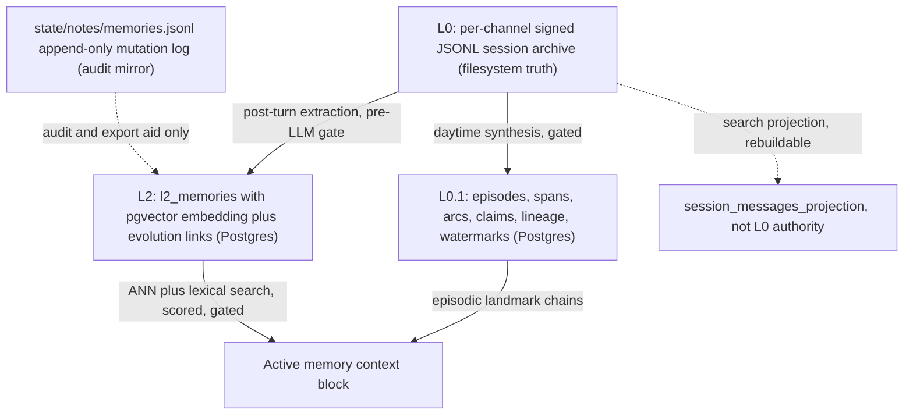
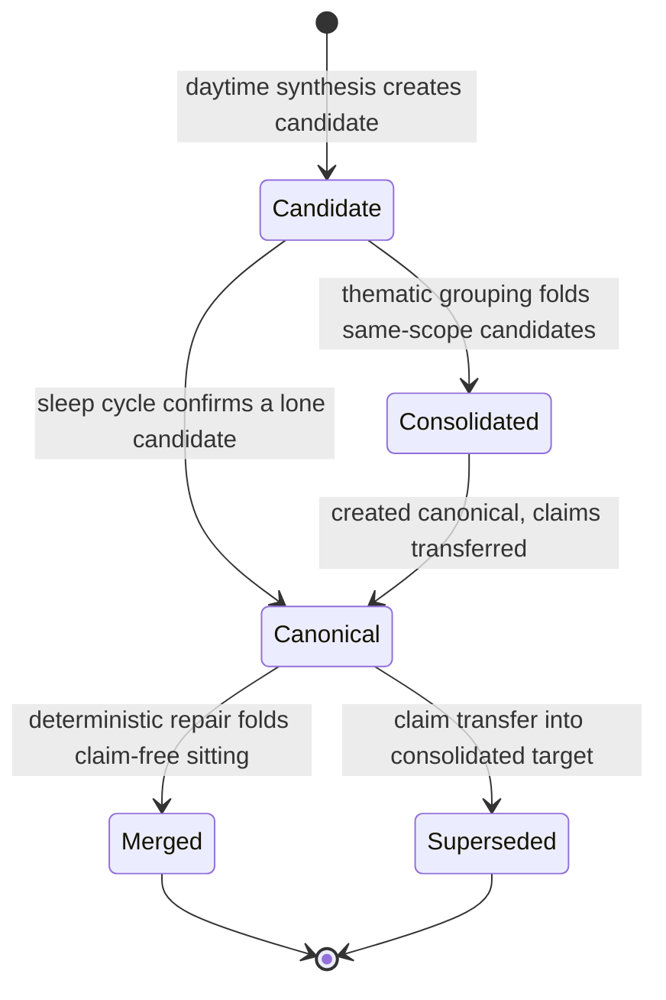
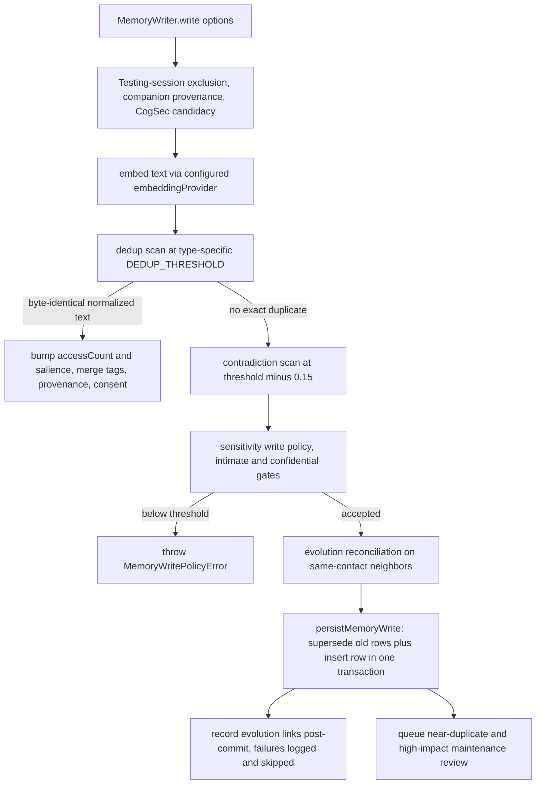
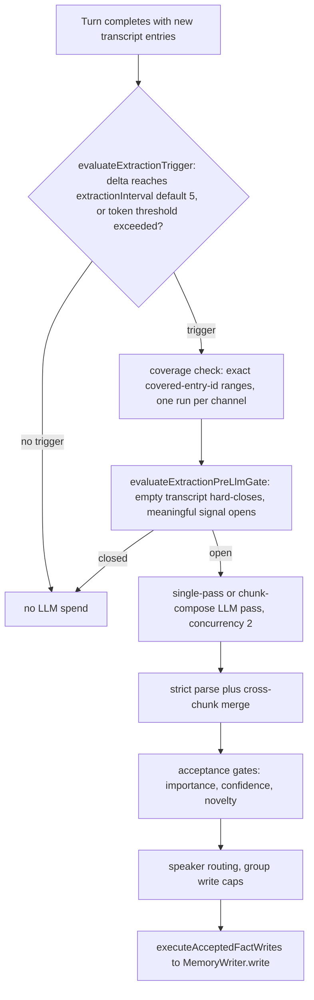
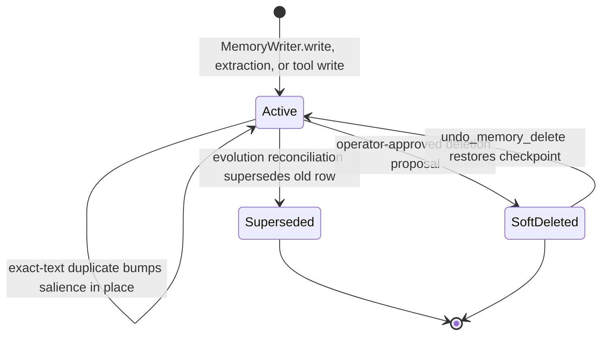

# Memory: L0 Archive, L0.1 Episodes, L2 Typed Memory

This page is the top-level map of the memory faculty
(`src/faculties/memory/`). It covers the three canonical layers, the
extraction seam that projects conversation into typed facts, the write, decay,
and retrieval machinery, authorization and deletion, the background lanes, and
the fail-closed invariants that govern all of it. Deep dives live on the linked
<!-- openwiki: broken internal link [l0-archive.md] file "l0-archive.md" does not exist. Fix the href or restore the target, then delete this comment. -->
pages: [`l0-archive.md`](l0-archive.md), [`l01-episodes.md`](l01-episodes.md),
[`l2-typed.md`](l2-typed.md), and [`projection.md`](projection.md).

## The three canonical layers

PSFN memory is layered, not a single store. Three canonical layers coexist and
each has a distinct owner, restore primitive, and lifecycle:

| Layer | What it is | Runtime home | Restore / rebuild |
| --- | --- | --- | --- |
| **L0** | Append-only autobiographical history: per-channel signed JSONL session archives, plus the append-only memory mutation log (`state/notes/memories.jsonl`) | Filesystem, `filesystem_truth` | Never rewritten; the session-search projection is rebuilt from canon |
| **L0.1** | Episodic landmarks: candidate episodes, verdicts, arcs, lineage, watermarks, and message claims that bind bounded stretches of conversation to durable records | Postgres (`l01_*` tables), `postgres_runtime` | Encrypted `pg_dump` backups; never re-derived as a restore |
| **L2** | Typed long-term memories (`PurrMemory`) with pgvector embeddings, evolution links, maintenance reviews, soft-delete versions, and recent-contact shapes | Postgres (`l2_*` tables), `postgres_runtime` | Encrypted `pg_dump` backups; re-derivation from L0 yields a continuation, not a restoration |

The governing invariant — grounded in the operator-owned project charter
([`docs/PSFN_PROJECT_CHARTER.md`](../../docs/PSFN_PROJECT_CHARTER.md)) — is that
**canonical history is append-only and never rewritten**: L0 stays on the
filesystem as signed JSONL, derived layers restore from encrypted database
backups, projections rebuild from canon, and repair is supersede-based
re-derivation that never mutates originals. The parity matrix records this as a
fail-closed contract — runtime startup rejects every persistence backend other
than Postgres, rejects a missing database URL, unavailable pgvector, schema
mismatch, or embedding-dimension mismatch, and repository verification rejects
retired local-database implementations (`src/persistence/postgres/parity-matrix.ts`,
`src/persistence/runtime-factory.ts`). There is **no SQLite runtime path**.

*Layer ownership: L0 is filesystem truth; L0.1 and L2 are Postgres runtime surfaces derived from L0, and the mutation log is an audit mirror, never a restore primitive.*

## L0: append-only JSONL

### The session archive

The lived transcript is a set of per-channel append-only signed JSONL session
archives owned by the session store (`src/persistence/sessions/store.ts` and
`journal-runtime.ts`). The parity matrix records the contract explicitly: the
signed JSONL files are **authoritative autobiographical history** and
`filesystem_truth`; `session_messages_projection` is rebuildable search state,
never L0 authority, and projection rebuild or repair must not mutate L0 history
(`src/persistence/postgres/parity-matrix.ts`).

The archive is opened through `SessionJournalRuntime` /
`createFilesystemSessionArchivePort`, with HMAC verification enabled when a
keyring is configured (`src/persistence/sessions/store/journal-runtime.ts`).
Sealed segments follow the numbered-sibling contract `<stem>.NNNNN.jsonl`
discovered from the directory listing — higher numbers are newer, there is
deliberately **no manifest**, and scanners claim file identity (dev:ino) so a
rotated file fails closed; physical rows above a byte limit are refused with
`EOVERFLOW` rather than truncated (`src/persistence/jsonl-segments.ts`).

### The memory mutation log

Every durable L2 mutation also appends to `state/notes/memories.jsonl` through
the `MemoryJournal` class (`src/faculties/memory/journal.ts`): `insert`,
`soft_delete`, and `restore` events, each carrying the full `PurrMemory`
snapshot for deletes. The file header is explicit about its role: it is an
append-only JSONL mirror of every memory mutation, an **audit/export aid, not
the authoritative L2 restore primitive** — embeddings, evolution links, and
Postgres-only memory tables are restored from encrypted database backups.

The path is resolved by `resolveMemoryJournalPath` →
`resolveNotesDir(companionDataDir)/memories.jsonl`
(`src/persistence/layout.ts`), and runtime composition wires it into the
Postgres memory store (`src/persistence/runtime-factory.ts`). Backup
verification reads it as the L0 line-count check, and repair scripts rebuild
empty `provenance_json` rows from it — but nothing replays it as a restore.

## L0.1: episodic landmarks

L0.1 sits between L0 and L2: bounded, provenance-bearing records of stretches of
conversation that mattered, stored as Postgres rows with a versioned JSON
contract (`Episode` in `src/shared/contracts/episodic-memory.ts`), plus the
graph edges (arcs, lineage) and lifecycle state (watermarks, candidate
decisions, message claims) that surround them. The full schema and lifecycle are
documented in [`l01-episodes.md`](l01-episodes.md) and
[`docs/SPEC_L01_LANDMARK_SCHEMA.md`](../../docs/SPEC_L01_LANDMARK_SCHEMA.md);
the shape here is:

- **Candidates, not verdicts.** Daytime synthesis writes `candidate` episodes
  (live and retrievable — the only record of the day) until the nightly sleep
  cycle confirms or consolidates them into `canonical` episodes. Merged and
  superseded rows stay for history and arc audit; they are never deleted
  (`l01_episodes.status` CHECK admits `candidate | canonical | merged |
  superseded`, `src/persistence/postgres/migrations.ts`).
- **Affect authorship is companion-only.** Episodes are born affect-empty
  (`affect: { labels: [] }`, `affect_authorship = 'none'`); deterministic
  synthesis never writes felt affect, and database CHECK constraints enforce the
  invariant at the SQL boundary. Only the companion's dream-meaning pass writes
  `meaning`/`affect` with explicit authorship columns.
- **Hard message claiming.** `l01_episode_message_claims` plus a partial unique
  index guarantees at most one live episode per source message; daytime
  synthesis drops actively claimed messages from its input, so overlapping
  passes can never re-process the same turns.
- **Postgres-owned.** Episodes, spans, arcs, arc audit, lineage, processing
  watermarks, candidates, and reviews are all `postgres_runtime` surfaces in
  the parity matrix; they restore from encrypted `pg_dump` backups, not from
  re-derivation.

*L0.1 episode lifecycle: born candidate, confirmed or folded by the nightly cycle, never deleted — merged and superseded rows stay for history and arc audit.*

## L2: typed long-term memory

### The record shape

The canonical L2 record is `PurrMemory` (`src/faculties/memory/types.ts`):
`id` (uuidv7), `text`, `type`, `importance`, `confidence`,
`emotionalValence`, optional `formationVAD` and multi-signal
`emotionalTexture`, `salience` plus `salienceDecayAnchorAt`, `sourceRef`,
`sourceType`, `provenance` (`MemoryProvenance`: channel, companion, turn, tool,
session, subject contacts, source-message spans, and the fail-closed
`sourceConversationAt` admission instant), `extractedAt`, `lastAccessed`,
`accessCount`, `supersededBy`, `tags`, `scopeRef`/`scopeTags`, `provenanceRefs`,
`retentionClass` (`standard` | `durable`), `sensitivity` (public | personal |
intimate | confidential), `consentFlags`, optional `contactId`, and the
soft-delete triple `deletedAt`/`deletedBy`/`deleteReason`.

The seven memory types are `boundary`, `emotional`, `episodic`, `procedural`,
`reflection`, `relational`, `semantic`. An `episodic` L2 memory is a typed
long-term category and is **not** an L0.1 `l01_episodes` row; L0.1 episodes are
provenance-bearing landmarks used to scope recall.

Rows persist in `l2_memories` (`src/persistence/postgres/migrations.ts`) with a
pgvector `embedding VECTOR` column, a generated `search_vector` tsvector
(`to_tsvector('simple', ...)`), GIN indexes over tags/scope/provenance JSONB,
lifecycle indexes over `superseded_by`/`deleted_at`, and two subject-authorization
columns: `authorization_revision` (monotonic) and `subject_evidence_digest`
(SHA-256 of the classified evidence; NULL means needs classification). The
vector extension migration fails closed unless pgvector is installed in `public`
or `extensions`, and tenant migrations require the explicitly provisioned
`extensions` schema (`src/persistence/postgres/vector-extension-migration.ts`);
schema validation rejects a missing `embedding` column or a non-vector type at
startup (`src/faculties/memory/postgres-store/schema.ts`).

### Write path

`MemoryWriter.write` (`src/faculties/memory/writer.ts`) runs every durable L2
write through the same pipeline:

*The L2 write pipeline: dedup and contradiction scans run in Postgres/pgvector, policy gates fail closed, and the insert plus supersede commits atomically.*

Details that matter:

- **Dedup is exact-text, not paraphrase.** The dedup stage suppresses a write
  only when the embedding neighbor ALSO has byte-identical normalized text
  (whitespace/case-folded). A restated worry with new phrasing inserts as a
  `created` row — a deliberate design choice documented in the code that keeps
  healthy paraphrase evolution alive. Near-duplicate stacks are instead flagged
  as `merge_candidate` maintenance reviews, and the second-arrow drift lane
  routes rumination consolidation through Garden (`writer.ts`).
- **Sensitivity policy.** `intimate` writes need `minSalience 0.6 /
  minNovelty 0.18`; `confidential` need `0.72 / 0.3`; `public`/`personal` are
  ungated (`MEMORY_CONFIG.sensitivityWriteThresholds` in `types.ts`). A failed
  gate throws `MemoryWritePolicyError` with the threshold breakdown.
- **Atomic commit.** `persistMemoryWrite` marks superseded rows and inserts the
  new row inside one `runInTransaction` — a dedicated client with
  BEGIN/COMMIT, AsyncLocalStorage capture of fire-and-forget writes, and
  rollback that restores the in-memory cache snapshots. Embeddings are not held
  in memory; the database ROLLBACK is the sole authority for their transactional
  state (`src/faculties/memory/postgres-store.ts`).
- **Evolution links are post-commit.** `supersedes`/`updates`/`negates`/
  `conflicts_with` links are recorded AFTER the memory is durable; a link
  failure is logged and skipped, never reported as a write failure, so a
  persisted memory is not re-written twice (`writer.ts`).

### Decay and maintenance

Salience decays exponentially from `salienceDecayAnchorAt` with per-type
half-lives from the retrieval policy, composed with retention multipliers:
durable ×8, durable-preference ×12, and emotional persistence scaling with
formation intensity (`getMemoryDecayProfile`, `types.ts`). Effective salience is
computed lazily at ranking time; `SalienceDecay` (`decay.ts`) persists
floor-enforced values on the hourly maintenance sweep
(`MEMORY_CONFIG.maintenanceIntervalMs`) using tracked anchors and
meaningful-delta writes (a delta below 0.01 is not persisted). Access bumps
salience by `salienceBumpOnAccess` (0.05).

### Retrieval

`MemoryRetriever.retrieve` (`src/faculties/memory/retrieval.ts`) assembles the
memory prompt block for a turn: budget resolution, recent-contact-shape and
emotional-snapshot access, episodic landmark chains, then the semantic
`searchByEmbedding` ANN pass plus lexical augmentation, followed by quarantine
filtering (retired or quarantined sessions' memories and episodes are excluded),
scoring, and budget-bound selection. `renderPromptBlock`
(`retrieval/formatting.ts`) emits the presentation slots in the configured
`sectionOrder`: `core_profile` (recent contact shape), `relationship_context`,
`emotional_continuity_snapshot`, `cross_session_emotional_continuity`,
`memory_context_note` (withheld summary), `episodic_landmark_chains`, and
`relevant_memories`. Foreground turns never block on retrieval — the turn
serves the cached active-memory context and schedules a background refresh, with
degraded state surfaced through typed events and refresh status
(`active-context.ts`, `retrieval/active-context-refresh.ts`); refresh
fingerprints combine a context hash, the retrieval corpus version, and an access
policy hash.

### Authorization and security

Memory access is not similarity-only:

- **Subject authorization.** Product recall goes through
  `createSubjectAuthorizedMemoryStore`, a default-deny Proxy that pushes a
  subject-classification predicate into SQL and refuses any store method
  without an explicit projection. The raw `PostgresMemoryStore.searchByEmbedding`
  **fails closed** unless the caller declares `bypass-system-internal` (an
  auditable, greppable opt-out for memory-formation dedup and operator admin
  surfaces); a product caller accidentally wired to the raw store throws instead
  of leaking unscoped rows (`postgres-store.ts`, `memory-store-port.ts`,
  `subject-authorized-store.ts`).
- **CogSec candidacy.** Every write asserts `evaluateCogSecMemoryCandidacy`
  (risk classes, disposition allow/review/reject), optionally consuming an
  intake sink-gate decision for the `memory_write` sink; rejection throws
  `MemoryCandidacyPolicyError`. A malformed intake-envelope id fails the write
  (fail closed), never silently drops (`writer.ts`).
- **Sensitivity + consent** feed retrieval gating and privacy-risk scoring;
  boundary memories get dedicated handling; broadcast contexts add
  visibility-scope checks (`evaluateMemoryPrivacyRisk`, `types.ts`).
- **Deletion is operator-gated.** `memory_delete` requires a justification
  category and explanation; the deletion goes through a proposal store with
  `pending_partner_alert → pending_operator_validation → approved/denied`
  lifecycle and a full audit trail (`deletion-proposals.ts`), and deletions
  are soft with versioned checkpoints that `undo_memory_delete` restores.

### Model-facing tool surface

`registerMemoryTools` (`src/faculties/memory/runtime-wiring.ts`) registers the
canonical `memory` tool with actions `write`, `search`, `episode_search`, `get`,
`shared_background`, `census`, `exists`, `timeline`, `import`, `patch`,
`redact`, `delete`, `restore` (`src/faculties/memory/tools.ts`), plus the
`scratchpad` tool. The legacy standalone tool names — `memory_write`,
`memory_import_batch`, `memory_patch`, `memory_redact`, `memory_delete`,
`undo_memory_delete`, `scratchpad_read`, `scratchpad_write` — are **retired
aliases** routed onto the matching `memory`/`scratchpad` actions by the
tool-surface registry (`src/core/agent/tool-surface/registry.ts`).

## Extraction: the L0 → L2 projection seam

`MemoryExtractor` (`src/faculties/memory/extraction.ts`) turns conversation
turns into typed facts:

1. **Trigger.** `evaluateExtractionTrigger` fires when the uncovered message
   delta reaches `extractionInterval` (default 5) or, below the interval, when
   countable transcript tokens exceed `extractionThresholdPct` of the chat
   context window (`extraction/runtime-helpers.ts`).
2. **Coverage.** Coverage is tracked as exact covered-entry-id ranges, not a
   single max watermark, so an out-of-order high snapshot can never prove a
   lower gap consumed; coverage advances only after a successful run. One
   extraction per channel is queued behind in-flight work (live triggers
   coalesce; bounded snapshots serialize).
3. **Pre-LLM gate.** `evaluateExtractionPreLlmGate` hard-closes on an empty
   transcript and otherwise opens when a signal-role turn scores meaningful or
   nothing was explicitly low-signal; a closed gate emits telemetry with
   `preLlmGateSkipped: true` and spends no LLM call (`extraction/signals.ts`).
4. **LLM pass + parse.** Single-pass or chunk-compose
   (`EXTRACTION_CHUNK_LLM_CONCURRENCY = 2`), strict `parseFactsXml`, cross-chunk
   merge, then acceptance gates (importance/confidence/novelty), speaker
   routing, group write caps, and `executeAcceptedFactWrites` →
   `MemoryWriter.write` (`extraction/orchestrator.ts`).

*The extraction seam: deterministic trigger and gate decide before any LLM spend; accepted facts flow through the shared writer pipeline into L2.*

Extraction also runs in crash-recovery, pre-compaction, observed-group, group
backfill, and final-reflection paths (`queueRetroactiveExtraction`,
`queueCompactionExtraction`, `extractObservedGroupRange`,
`extractGroupBackfillRange`, `extractFinalReflection`), and side effects refresh
per-contact emotional state and the recent-contact-shape synthesis.

## Background lanes

`scheduler.json` owns three memory cadences:

- **`nearTurnMemory`** — the deterministic zero-LLM lane
  (`NearTurnMemoryLane`, `src/faculties/memory/near-turn-memory-lane.ts`): it
  holds no LLM provider and structurally cannot spend tokens. It queues
  stale-memory maintenance reviews against the active-memory set and reuses the
  canonical direct-vs-group scope classifier; heavy passes (sleep
  consolidation, arc weaving, dream meaning) are unreachable from here. Cadence
  is required and validated at construction — the lane fails closed instead of
  falling back to hardcoded turn counts.
- **`episodeSynthesis`** — the daytime candidate-synthesis lane (gated,
  tuned) that writes `candidate` episodes from transcript ranges.
- **`episodicProcessing`** — the rest-window schedule
  (`startLocalTime`/`endLocalTime`/`timeZone`/`inactivityThresholdMinutes`).
  Heavy sleep passes run only inside the window via `SleeptimeMemoryAgent`
  (`src/faculties/memory/sleeptime-agent.ts`): sleep consolidation, arc
  formation, the dream-meaning pass, and orientation rewrite, each with
  deterministic pre-LLM gates.

## State and lifecycle summary

*L2 memory lifecycle: rows are created, deduplicated in place, superseded via evolution links, and soft-deleted with versioned checkpoints; nothing is hard-deleted outside bulk maintenance paths.*

## Invariants and failure semantics

- **No SQLite runtime.** Runtime startup rejects every persistence backend
  other than Postgres; repository verification rejects retired local-database
  packages (`parity-matrix.ts` fail-closed list, `runtime-factory.ts`).
- **Missing pgvector or embedding-dimension mismatch fails startup**, never a
  silent fallback to app-side array scanning (`vector-extension-migration.ts`,
  `validatePostgresMemorySchema`).
- **L0 is never rewritten.** Projections rebuild from canon; repair is
  supersede-based re-derivation.
- **Raw embedding search cannot leak.** Subject enforcement is mandatory on
  product recall; every bypass site is greppable by the literal
  `'bypass-system-internal'`, and the subject-authorized store is default-deny
  for unprojected methods.
- **Testing sessions never write durable memory**
  (`TestingSessionMemoryWriteError`), and malformed intake-envelope ids fail the
  write.
- **Fail-closed reads.** `parseEpisode` rejects unknown keys, non-canonical
  timestamps, `startedAt > endedAt`, and records with no L0 span or artifact
  reference; missing `sourceConversationAt` denies auto-share to since-demoted
  rooms rather than widening access.

## Configuration and operations

- `settings.json` `memoryRetrievalPolicy` owns per-type half-lives, salience
  floors, retrieval priors, selection caps, lexical-augment bounds, episodic
  retrieval bounds, and the score guarantee; `memoryPresentationProfile`
  (versioned) owns the rendered block. Both fail closed on partial/unknown
  data (exact-key assertions).
- `scheduler.json` owns the background lane cadence above: `nearTurnMemory`,
  `episodeSynthesis`, and `episodicProcessing`.
- `groupMemory` (settings.json) and channel overrides (channels.json) own
  direct/group/auto extraction modes and write caps.
- Embedding provider is configured via `embeddingProvider` (ollama |
  transformers | api) with per-provider models and dims, credential-vault
  resolution for API keys, and startup warmup
  (`src/faculties/memory/embedding.ts`); a missing or unsupported provider
  throws rather than defaulting.
- Backups: encrypted `pg_dump` restores are the canonical restore primitive
  for L0.1/L2; the memory mutation log participates in backup verification as
  the L0 line-count check.

## Focused tests

- `postgres-store.test.ts` / `postgres-store.integration.test.ts` — migration
  SQL, lifecycle buckets (active/superseded/soft-deleted/restored), ANN search,
  transaction rollback, subject authorization.
- `writer.test.ts` — dedup bump vs created, sensitivity policy rejection,
  CogSec candidacy, evolution supersession, atomic persist.
- `decay.test.ts` — effective-salience math, floors, multipliers, tracked-anchor
  sweep.
- `retrieval.test.ts` — budget, quarantine, withheld summaries, episodic
  chains, prompt-block rendering goldens.
- `extraction.test.ts` / `extraction/orchestrator.test.ts` — trigger/coverage,
  pre-LLM gate, fact acceptance, group caps, side effects.
- `tools.test.ts` — the canonical `memory` tool contract and visibility gates.
- `episodic/postgres-store.test.ts`, `episodic/sleep-consolidation.test.ts`,
  `episodic/synthesis.test.ts` — candidate lifecycle, claims, arcs, and
  affect-authorship enforcement.
- `subject-authorized-store.test.ts` — default-deny proxy and subject-scoped
  reads/mutations.

## Related pages

<!-- openwiki: broken internal link [l0-archive.md] file "l0-archive.md" does not exist. Fix the href or restore the target, then delete this comment. -->
- [`l0-archive.md`](l0-archive.md) — the L0 signed JSONL session archives and
  the append-only memory mutation log in full.
- [`l01-episodes.md`](l01-episodes.md) — the L0.1 episode contract, synthesis
  lane, arcs, and lifecycle in full.
- [`l2-typed.md`](l2-typed.md) — `PurrMemory`, embeddings, decay, deletion
  proposals, subject authorization, and the memory tool surface in full.
- [`projection.md`](projection.md) — extraction, writer, embeddings, retrieval
  projections, and the pgvector migration in full.
<!-- openwiki: broken internal link [../memory-persistence-authority.md] file "../memory-persistence-authority.md" does not exist. Fix the href or restore the target, then delete this comment. -->
- [`../memory-persistence-authority.md`](../memory-persistence-authority.md) —
  who may write to canonical storage, layout ownership, cutover, and runtime
  (Postgres) authority.
- [`../faculties/core-memory.md`](../faculties/core-memory.md) — the bounded,
  always-rendered scoped continuity store behind the `orient` tool, the other
  side of the orient-vs-memory boundary.
- [`../runtime/chat-turn-lifecycle.md`](../runtime/chat-turn-lifecycle.md) —
  where per-turn extraction, background work, and deferred post-turn actions
  fit in one interactive turn.
- [`docs/SPEC_L01_LANDMARK_SCHEMA.md`](../../docs/SPEC_L01_LANDMARK_SCHEMA.md)
  and [`docs/SPEC_MEMORY_PROJECTION_LAYER.md`](../../docs/SPEC_MEMORY_PROJECTION_LAYER.md)
  — the operator-owned specifications for the L0.1 schema and the L2 projection
  layer.
