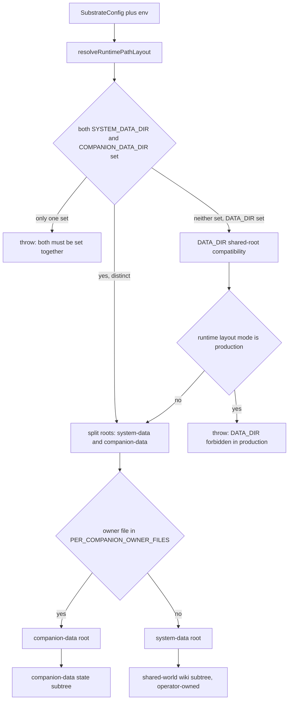
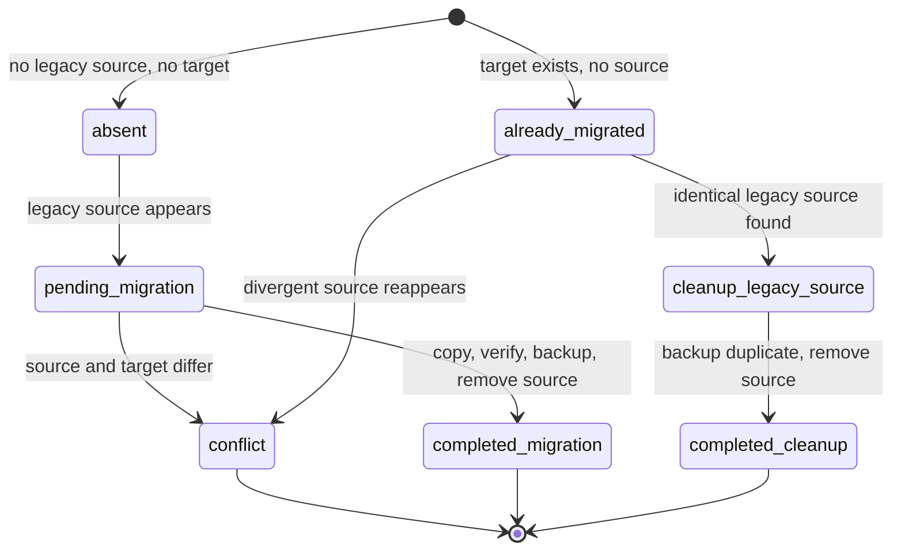
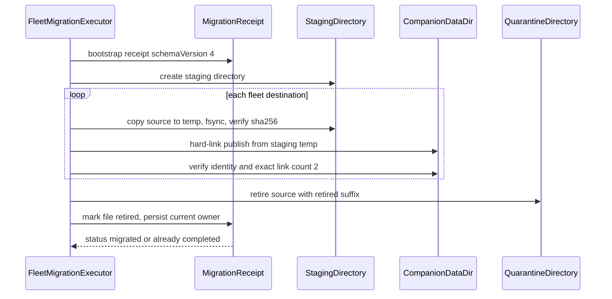

# Memory Persistence Authority

This page documents **who may write to canonical storage and under what
rules**. PSFN persistence is governed by four authority layers that must be
understood together:

| Layer | Module | What it decides |
| --- | --- | --- |
| Layout ownership | `src/persistence/layout.ts` | Which root owns which artifact: `system-data` vs `companion-data`, the `state/` subtree, shared-world storage, and the production disjointness guards |
| Cutover authority | `src/persistence/cutover.ts` | How legacy shared-root data is migrated into split roots, who owns each migrated artifact, and the startup gate that refuses to boot on incomplete cutover |
| Pinned filesystem | `src/persistence/pinned-filesystem.ts` | The identity-bound, symlink-proof path mechanism every authority-sensitive filesystem mutation must use |
| Runtime (Postgres) authority | `src/persistence/postgres.ts`, `src/persistence/runtime-factory.ts` | The only supported persistence backend, tenant/schema boundaries, the runtime DDL fence, migrations, and store readiness |

The governing invariant, grounded in the operator-owned project charter
([`docs/PSFN_PROJECT_CHARTER.md`](../../docs/PSFN_PROJECT_CHARTER.md)) and the
binding decision record [`docs/memory-persistence-authority.md`](../../docs/memory-persistence-authority.md),
is that **canonical history is append-only and is never rewritten**: L0 session
archives live on the filesystem as append-only JSONL bounded by the split data
roots, derived layers (L2 memories, L0.1 episodes) restore from encrypted
database backups, projections rebuild from canon, and repair is supersede-based
re-derivation — never deletion or mutation of originals.

<!-- openwiki: broken internal link [l0-archive.md] file "l0-archive.md" does not exist. Fix the href or restore the target, then delete this comment. -->
Related pages: [memory overview](overview.md), [L0 archives](l0-archive.md),
[operations](../operations.md), [runtime session](../runtime/session.md),
[specifications](../specifications.md).

## Persistence layout and ownership

### Two roots, never one

The runtime resolves persistence roots through `resolveRuntimePathLayout` /
`resolvePersistenceRoots` (`src/persistence/layout.ts`). The law is:

- `SYSTEM_DATA_DIR` and `COMPANION_DATA_DIR` must be **set together** — one
  without the other throws (`SYSTEM_DATA_DIR and COMPANION_DATA_DIR must both
  be set together`).
- They must be **distinct roots** — equal paths throw.
- `DATA_DIR` (the legacy shared root) is accepted **only in continuous mode**.
  In `production` runtime layout mode a shared `DATA_DIR` root is forbidden;
  the runtime demands isolated roots.

`resolveRuntimeLayoutMode` (`src/shared/runtime-layout-mode.ts`) maps
`continuous | dev | development` to continuous mode and
`production | prod | live` to production mode; an unknown explicit mode throws,
and a `NODE_ENV=production` falls through to production mode. Defaults:
production uses `./runtime/production/system-data` and
`./runtime/production/companion-data`; continuous uses `./data` (system) and
`./companion` (companion).

In production mode the layout is additionally constrained by three assertions
(`layout.ts`):

- **No duplicate roots** — every mutable root must be a distinct path.
- **No overlapping roots** — no root may be a strict subpath of another.
- **Workspace isolation** — the personal workspace path must not overlap any
  runtime state root (system-data, companion-data).

These guards are what make the split-root layout enforceable rather than
advisory: two processes that disagree about ownership cannot silently share a
directory.

### Where artifacts live

- All companion-owned state files resolve under
  `resolveCompanionStateDir(companionDataDir)` →
  `companion-data/state/` (sessions, notes, contacts, prompt lineage, core
  memory, journals, ledgers, owner files such as `heartbeat-policy.json` and
  `last_active_channel.json`).
- System-owned operator/runtime state resolves under `system-data/state/`
  (tool-conformance verdicts, post-rollout validation, kube-rollback
  act-once ledger).
- `migrateLegacyPersistenceLayout` folds pre-`state/` companion artifacts
  (legacy `companion-data/sessions`, `notes`, `contacts`, `core_memory.json`,
  `character-card-history.jsonl`, and friends) into the `state/` subtree,
  then migrates internal-reflection session files into `notes/reflections/`
  and user continuity files into `contacts/continuity/`, and finally ensures
  the full directory skeleton.
- **Shared-world wiki storage is NOT companion-data.** Shared-world wiki
  documents are operator/caretaker-owned world knowledge attached to a site —
  authored by publication + bulk import surfaces, never by a companion
  directly. They live under `system-data/shared-world/wiki/sites/<siteId>` so
  one canonical copy is shared across companions; the `siteId` is contained
  fail-closed to the sites root so a malformed id can never escape the
  subtree.

L0 filesystem surfaces are bounded by the same roots: session archives resolve
to `companion-data/state/sessions/` (`resolveSessionsDir`), the append-only
memory mutation journal to `companion-data/state/notes/memories.jsonl`
(`resolveMemoryJournalPath`), and scheduled backups to `companion-data/backups`
(`resolveBackupsDir`).

*How storage ownership is decided at startup: root pairing, mode constraints, and per-companion owner routing.*

## Cutover: migrating between storage roots

`src/persistence/cutover.ts` implements the one-time (and re-runnable,
idempotent) migration from the legacy shared-root layout (`./data` plus
`./companion`) into split roots. It is the sanctioned path for **changing
where canonical files live**, and it is deliberately conservative.

### Plan semantics

`buildPersistenceCutoverPlan` computes one entry per known artifact. Each
entry carries an owner (`system` | `companion`), a kind (`file` | `dir`), a
target path, and candidate legacy source paths, and is classified as one of:

| Status | Meaning |
| --- | --- |
| `pending_migration` | Legacy source exists; target absent — copy is required |
| `cleanup_legacy_source` | Target exists and is byte-identical to the legacy source — only the duplicate source needs removal |
| `already_migrated` | Target exists; no actionable source |
| `absent` | Neither source nor target |
| `conflict` | Multiple legacy sources, or source and target differ |

The plan is actionable only when `splitRoots && conflictCount === 0`
(`canApply`). Ownership routing is derived from the settings contract: whole
owner files in `PER_COMPANION_OWNER_FILES` (`capability-tier.json`,
`scheduler.json`, `charge-policy.json`, `skills.json`,
`partner-affect-shadow.json`) migrate into `companion-data`; every other
settings subsystem owner file migrates into `system-data`. The companion
database (with `-wal`/`-shm` sidecars), character card, values journal,
prompt lineage, north star, sessions, notes, contacts, identity assets, and
backups are all companion-owned; the gateway audit database is system-owned.

### Startup gate

`assertPersistenceCutoverReady` is the boot fence: when split roots are
configured but legacy data still needs cutover, it throws with the exact
remediation:

> Run `npm run migrate:persistence-layout` to inspect the plan and
> `npm run migrate:persistence-layout -- --apply` to migrate before startup.

It also enforces that explicit `characterCardPath`, `databasePath`, and
`auditDbPath` overrides stay inside their owner roots in split-root mode. A
recreated empty legacy `backups/` shell is treated as converged (the runtime
can defensively recreate it); any real child entry re-opens the gate.

### Execution

`executePersistenceCutover` defaults to **dry-run** (no mutation, no
manifest). A real apply:

1. Rejects non-split configurations and any plan with conflicts.
2. Writes a `schemaVersion: 1` manifest under
   `system-data/migrations/persistence-cutover-<timestamp>/manifest.json`
   with `status: 'in_progress'`, plus a `legacy-backup/` root.
3. For each actionable entry: copies the legacy source to the target,
   verifies the copy's SHA-256 signature against the source, copies a backup
   into the legacy-backup tree and verifies that too, then removes the legacy
   source. The manifest entry flips to `completed_migration` /
   `completed_cleanup` (with backup path) **after each entry**, so a crash
   mid-run is resumable: the next run re-plans from what actually exists.
4. If any companion entry moved, runs `migrateLegacyPersistenceLayout` on the
   companion root so pre-`state/` artifacts fold into `state/`.
5. Marks the manifest `completed` with `completedAt` and rollback notes
   mapping each migrated target back to its original source.

The CLI entrypoint is `src/app/maintenance/migrate-persistence-layout.ts`,
wired as `npm run migrate:persistence-layout`; `--apply` executes, the
default is a dry-run plan printed as JSON.

*Lifecycle of one cutover entry. Every mutation is verified against the source signature before the legacy copy is removed.*

## Pinned filesystem authority

`src/persistence/pinned-filesystem.ts` is the shared primitive for
authority-sensitive filesystem work (the system-owner fleet migration and the
owner-file migrations under `src/system/config/`). It exists because
pathname-based filesystem code can be raced by symlink replacement or
directory swapping; pinned operations cannot be.

Mechanics:

- **Component-by-component traversal** starting from `/` (`O_RDONLY |
  O_DIRECTORY | O_NOFOLLOW`), descending through `/proc/self/fd/<fd>/<name>`
  — never through a resolved pathname — so a replaced directory in the middle
  of the walk is caught, not followed.
- **Component validation** rejects `''`, `.`, `..`, and any component
  containing a path separator.
- **Identity capture**: every pinned directory records `device:inode` from
  `fstat`. `assertFilesystemIdentity` throws when the identity differs —
  "changed identity; refusing pathname-based recovery" — so recovery is only
  ever attempted against the exact directory that was pinned.
- **Regular-file-only reads**: `readPinnedRegularFile` /
  `inspectPinnedRegularFile` open with `O_NOFOLLOW`, verify `isFile()`, and
  report `device`, `inode`, `linkCount`, `mode`, and SHA-256; a symlink (or
  anything non-regular) throws.
- **Hard-link alias detection**: `assertExactLinkCount` fails closed on an
  unrecorded extra link, because an unexpected link count means an alias
  exists that could let a concurrent writer bypass the operation.

The core invariant: **a pinned directory is a capability**. Callers hold a
descriptor plus an identity, verify identity before and after mutations, and
refuse to fall back to pathname logic when the world changed underneath them.

## System-owner fleet migration

`src/persistence/system-owner-fleet-migration*.ts` implements the
whole-install fan-out transaction that moves system-root, per-companion owner
files **from `system-data` into every companion's `companion-data`**:

- Scope: `charge-policy.json` and `skills.json`
  (`SYSTEM_OWNER_FLEET_MIGRATION_FILES`). Scheduler and capability-tier use a
  separate per-release Helm cutover that deliberately retains their old
  sources as rollback evidence.
- `buildSystemOwnerFleetMigrationPlan` inspects the pinned system directory
  and every companion destination, classifying destinations `missing` or
  `conflict`; `canApply` requires at least one source and zero conflicts.
- `executeSystemOwnerFleetMigration` runs the receipt-bound transaction:
  1. Bootstraps a `schemaVersion: 4` receipt at
     `system-data/migrations/system-owner-fleet-reroot.json` recording the
     pinned identities of the system dir, receipt dir, and every destination.
  2. Creates per-operation **staging** and **quarantine** directories under
     the receipt dir.
  3. For each destination: copies the source to a staging temp file
     (resumable — a pre-existing temp must be an exact source prefix, and
     every resumed write is re-verified), `fsync`s, records the temp identity
     in the receipt, then **hard-link publishes** the temp into the
     companion's data dir.
  4. Verifies the published file: exact SHA-256 match, same device:inode as
     the staging temp, and **exact link count 2** (staging + destination).
  5. After every destination is verified, **retires the source** into
     quarantine as `<ownerFile>.<id>.retired`, marks the file `retired`, and
     records the current-owner observation
     (`provenance: 'canonical-owner-after-verified-source-retirement'`) in
     the receipt.
  6. Marks the receipt `completed`.

Recovery is part of the same function: on rerun it re-verifies every
receipt-bound identity, refuses a reappeared retired source, refuses an
unrecorded pending destination, and re-observes current owners so the receipt
stays truthful. `validatePinnedMigrationOwner` additionally schema-validates
the two JSON owner files (charge-policy and skills) at every read, so a
malformed owner file fails the migration instead of propagating. The CLI is
`npm run migrate:system-owner-fleet`, whose apply mode requires an exact
`--approve <owner-file>=<sha256>` digest for every source.

*The fleet owner-file reroot: publish is a verified hard-link copy per companion, and the source is retired only after every destination is verified.*

## Postgres runtime authority

### One backend, fail closed

`PersistenceBackend` is exactly `'postgres'` — there is no SQLite runtime
path. `createAgentPersistenceRuntime` fails closed unless
`config.persistenceBackend === 'postgres'` **and** `postgresDatabaseUrl` is
present, before any store is constructed. It first runs
`migrateLegacyPersistenceLayout` on the companion root, then wires every
store through the readiness ledger (below).

### Pools, identifiers, and search paths

`createPostgresPool` (`src/persistence/postgres.ts`) is the single pool
factory and enforces the SQL-injection / cross-tenant boundary at the
connection layer:

- **Fail-closed identifier validation**: schema and role names must match
  `^[a-z][a-z0-9_]*$`, be non-empty, and fit Postgres's 63-byte identifier
  limit (`POSTGRES_SCHEMA_NAME_MAX_LENGTH`). Anything else throws before the
  identifier can reach a `search_path` or DDL string. `quotePostgresSchemaName`
  / `quotePostgresRoleName` quote only after validation.
- **A role requires an explicit tenant schema** — a role without a schema
  throws, so a least-privilege role can never inherit the database's
  `"$user", public` search path.
- **search_path is pinned at connection startup** via libpq `options`:
  `-c search_path=<schema>,extensions`. Every connection handed out by the
  pool operates inside that schema; `public` is deliberately absent so a
  missing tenant table fails instead of falling through to legacy data.
  Extension types resolve only through the dedicated `extensions` schema.
- **Optional read-only session fence**: `readOnly: true` pins
  `default_transaction_read_only=on` on every session (a session fence, not a
  substitute for exact ACLs).
- **NUL stripping at the pool boundary**: text/jsonb bind parameters with a
  NUL byte (which Postgres rejects as `22021 invalid byte sequence`) are
  stripped at the shared `pool.query` / `PoolClient.query` choke point, so
  untrusted inbound content can never fail a write. The wrap is idempotent
  per client.

### Migrations and the runtime DDL fence

Postgres DDL is authority-gated. `PostgresRuntimeReadiness` is a
process-lifetime ledger: startup work is registered while `collecting`, sealed
via `sealBeforeReady`, and **after Ready, runtime DDL is forbidden** —
`assertPostgresRuntimeDdlAllowed` throws unless the caller holds the
`'isolated_workload_migration'` authority (a dynamically spawned shard's own
schema lifecycle). Migration chains run inside transactions and are
serialized across processes with `pg_advisory_xact_lock`
(`ensurePostgresSchemaWithAdvisoryLock`), because `CREATE ... IF NOT EXISTS`
is not race-free under concurrent first-creation.

The schema chains themselves are code-owned statement lists in
`src/persistence/postgres/migrations.ts` — `POSTGRES_MEMORY_MIGRATIONS`
builds `l2_memories`, its subject-classification table, evolution links,
patch-provenance events, and indexes (plus the pgvector relocation), while
the shared-schema chains (`POSTGRES_SHARED_MIGRATIONS`,
`POSTGRES_SHARED_WIKI_MIGRATIONS`) are ledger-versioned in
`shared_schema_migrations`. The gateway's dedicated migration authority runs
shared DDL (`ensureSharedSchema` / `ensureSharedWikiSchema`) before agents are
spawned; ordinary companion credentials are DML-only and prove the resulting
boundary read-only at startup.

### Multi-companion tenancy

When a fleet manifest is projected onto the config:

- `resolveConfigTenantPoolScope` demands `postgresSchema` and `postgresRole`
  matching the manifest entry for `companionId` **exactly**, and fails closed
  rather than defaulting any pool to `public` — an unqualified read would
  otherwise resolve against the primary tenant's `public` schema.
- Startup **asserts the tenant boundary is provisioned and never repairs or
  creates it**: `assertPostgresTenantAccessProvisioned` verifies the schema is
  owned by the derived least-privilege role, the role exists, the `extensions`
  schema exists, the `vector` extension lives in `extensions`, and the login
  role is a member. Deployment-time provisioning is a separate, advisory-
  locked, operator-only path.
- Every ordinary companion credential must prove **shared-schema runtime
  authority** before opening any shared store:
  `assertSharedSchemaRuntimeAuthority` checks the credential owns exactly its
  own companion schema, has exact shared-schema DML (but no CREATE, TRUNCATE,
  REFERENCES, or TRIGGER), cannot access sibling companion schemas, and has
  **zero `fleet_auth` access**.

### Store readiness

`POSTGRES_STORE_READINESS_CATALOG` gives every store a code-owned
classification: required stores (memory, contacts, intention, internal state,
automata runs/bus, and so on) must be ready before the process advertises
Ready; a small set (`memory_ann_index`, wiki projection, and others) are
optional and may degrade without failing the seal. `createAgentPersistenceRuntime`
is the single composition point: it wires the Postgres memory store (with the
append-only `MemoryJournal` at `companion-data/state/notes/memories.jsonl`,
the notes dir, and the scratchpad mirror), the episodic store, the reflection
metacognition journal store with its Postgres mirror, contacts, intention,
internal state, trends, scheduler, availability, introspection, background
work, and the automata stores — each through `awaitPostgresStoreReadiness` —
and awaits contact-lifecycle recovery before returning.

## Memory authority boundaries

### The store port

`MemoryStorePort` (`src/faculties/memory/memory-store-port.ts`) is the
canonical runtime memory surface. Two authority properties matter:

- **Embedding search requires an explicit authorization stance.** There is no
  default: `searchByEmbedding` takes `EmbeddingSearchAuthorization` with
  `'subject-enforced'` or `'bypass-system-internal'`. Only a
  subject-authorized store can honor `'subject-enforced'`; the raw
  `PostgresMemoryStore` **rejects it by throwing**, so a product-recall
  caller accidentally wired to the raw store fails closed instead of leaking
  unscoped memories. `'bypass-system-internal'` is a greppable, auditable
  opt-out for process-local system/maintenance callers.
- **Subject-authorized surfaces apply the same predicate in SQL.**
  `queryAuthorizedMemorySubjects` / `aggregateAuthorizedMemorySubjects` /
  `mutateAuthorizedMemorySubjects` and friends require
  `MemorySubjectQueryAuthorization` on every call, and every selector applies
  `buildMemorySubjectAuthorizationPredicate` in the query itself — a summary
  or slice can never observe a memory the caller is not authorized for.

### The append-only journal

`MemoryJournal` (`src/faculties/memory/journal.ts`) appends one JSONL event
per memory mutation (`insert` / `soft_delete` / `restore`) to
`companion-data/state/notes/memories.jsonl`. It is explicitly **an audit and
export aid, not a restore primitive**: embeddings, evolution links, and the
Postgres-only memory tables are restored from encrypted database backups.
Writes are transactional in Postgres (`runInTransaction` BEGIN/COMMIT with
rollback of both the database statements and the in-memory cache); because
the journal is only a mirror, entries it may have recorded for rolled-back
writes are tolerated.

### Deletion proposals

Durable memory deletion is Postgres-only and audit-linked:
`memoryDeletionProposalStore` ("Postgres-only durable deletion proposal and
linked audit authority") is created by the runtime factory, and
`MemorySoftDeleteOptions.proposalId` is an **internal audit linkage** —
agent-facing callers must use the proposal workflow, never the raw soft-delete
option.

## Restore primitives and backups

`src/persistence/backups/service.ts` is the restore-authority boundary:

- `runBackupCycle` **refuses to capture a database-less backup** — Postgres
  dump configuration is mandatory.
- Dumps use `pg_dump --format=custom` with an optional `--schema=...` whose
  name passes the fail-closed validator before it is interpolated into argv.
  Each companion schema and the shared schema get their own dump file.
- `verifyPostgresDumpArchive` validates a dump by listing its table of
  contents with `pg_restore --list` and failing on an empty TOC.

This implements the persistence-class taxonomy ratified in
[`docs/memory-persistence-authority.md`](../../docs/memory-persistence-authority.md):
L0 session archives and companion filesystem state are sources of truth
(restored from companion-tree backups), projections rebuild byte-faithfully
from canon, derived layers (L2 memories, L0.1 episodes) restore from encrypted
`pg_dump` backups, and runtime state is Postgres-only with fail-closed startup
checks.

## Invariants and failure modes

- **Split roots are law.** One-sided configuration throws; equal roots throw;
  production rejects shared `DATA_DIR`; production roots must be disjoint and
  workspace-isolated.
- **Cutover is copy-verify-backup-remove with a resumable manifest**, and a
  configured-but-unfinished cutover blocks startup with remediation text.
- **Identity beats pathname.** Pinned directories are device:inode
  capabilities; symlinks, swapped directories, and unrecorded hard links all
  fail closed.
- **Fleet owner files move as a receipt-bound whole transaction**: every
  destination is verified before any source is retired, and recovery re-checks
  every recorded identity.
- **Postgres is the only runtime backend**, identifiers are validated
  fail-closed, search paths are pinned per tenant, DDL stops at Ready, and
  ordinary credentials prove exact least-privilege before touching shared
  schemas.
- **Memory history is append-only and provenance-bearing.** The journal never
  rewrites; repair re-derives and supersedes; deletion goes through audited
  proposals; and reads that cross subject boundaries are authorized in SQL,
  not in application memory.
