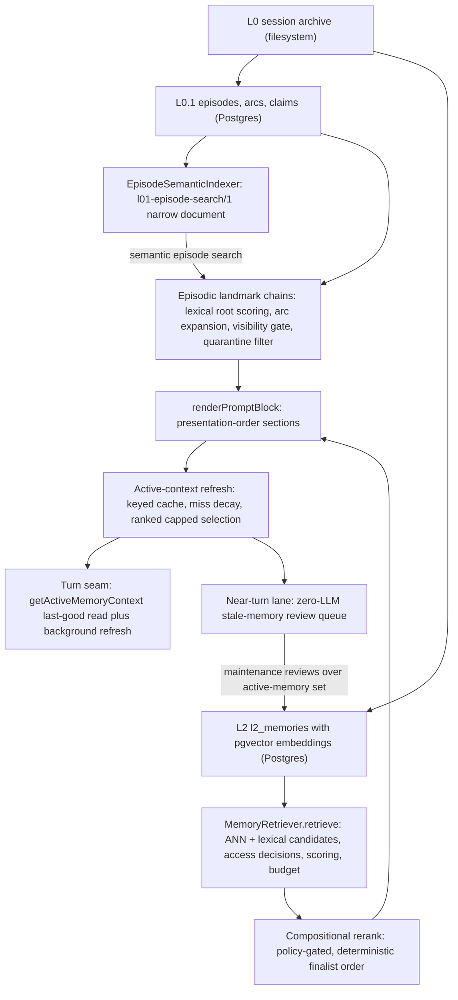

# Memory Projection: How L0.1 and L2 Memories Reach Active Context

## What the projection layer is

The projection layer is the machinery that turns **stored** L0.1 and L2 memory
into the **memory context block** that shapes what the companion sees and
recalls on a given turn. L0 is the append-only filesystem JSONL session archive,
L0.1 is the episodic landmark layer (`l01_*` Postgres tables, documented in
[`l01-episodes.md`](l01-episodes.md)), and L2 is typed long-term memory —
`PurrMemory` rows with pgvector embeddings (`l2_*` tables, documented in
[`l2-typed.md`](l2-typed.md)). Projection is the read side of that model: it
selects, gates, scores, renders, and caches a per-context projection so the
companion-facing prompt contains a fresh, safe, relevant view of the layers
below (see the layer map in [`overview.md`](overview.md)).

All projection state lives on Postgres with `pgvector`; there is **no SQLite
runtime path**, and fail-closed contracts stay fail-closed with no compatibility
shims or silent fallbacks. The operator-owned specifications are
[`docs/SPEC_L01_LANDMARK_SCHEMA.md`](../../docs/SPEC_L01_LANDMARK_SCHEMA.md)
and
[`docs/SPEC_MEMORY_PROJECTION_LAYER.md`](../../docs/SPEC_MEMORY_PROJECTION_LAYER.md).

*Projection pipeline: stored L0.1/L2 rows are selected, gated, scored, and rendered into a cached active-context block, which the turn seam reads synchronously and refreshes in the background.*

## Landmark schema projection — how L0.1 episodes become landmarks

### The narrow semantic document

Episodes are embedded into pgvector through a deliberately narrow document
projection (`EPISODE_SEARCH_DOCUMENT_SCHEMA = 'l01-episode-search/1'`):
`buildEpisodeSearchDocument` concatenates **title, landmark, themes, affect
labels, and companion meaning only** — transcript, participant, and provenance
data are never embedded (`src/faculties/memory/episodic/episode-index.ts`).
The `EpisodeSemanticIndexer` writes the embedding under that versioned schema
with an embedding profile (provider, model, dimensions) and a document hash, so
a changed document re-indexes instead of silently reusing a stale vector.

### Foreground chain retrieval

`retrieveEpisodicChains` (`src/faculties/memory/retrieval/episodic.ts`) builds
the always-injected landmark view for a turn. When the query tokenizes to
nothing and there is no scope query, it returns rolled-out-session breadcrumbs;
otherwise it ranks episodes and expands arcs:

- **Root scoring** — `scoreEpisode` matches query tokens against weighted
  fields: themes × 2.4, title + companion meaning × 2.0, landmark × 1.3, affect
  labels × 0.8, plus a phrase boost, salience (× 0.22), and a scope-match bonus
  (× 0.18). An episode with no matched terms and no scope match is dropped;
  roots must clear `minRootMatchScore` (default 0.18).
- **Arc expansion** — `buildEpisodeChain` walks `listEpisodeArcsForEpisode`
  through `maxDepth` (default 2) and `maxEpisodesPerChain` (default 5); a
  related episode is useful when it scores above `minRelatedMatchScore` (0.08),
  shares query themes, shares a root theme with a confident arc, or is a
  `continuation` / `causal` / `resolution` arc at sufficient confidence. The
  scan is bounded by `arcScanLimit` (8) and `scanLimit` (1,000).
- **Visibility gate** — `isEpisodeVisibleForTurn` admits same-channel episodes
  outright; a cross-channel episode requires the canonical contact among its
  participants **and** a non-broadcast channel **and** at least `trusted` trust
  (the retired broadcast check is now the envelope flag, E3.3). A
  `companion_self_reflection` access scope bypasses the channel/contact checks
  but still honors a scope query in `only` mode.
- **Quarantine and breadcrumbs** — `resolveEpisodicChains` wraps the store with
  `filterQuarantinedEpisodicChains` (session quarantine) and any unexpected
  failure is wrapped in `RetrievalIntegrityError` with stage
  `episodic_retrieve`, keeping the fail-closed contract.

### The rendered landmark block

`renderEpisodicLandmarkChains` (`src/faculties/memory/retrieval/formatting.ts`)
renders the `episodic_landmark_chains` section: chains sorted most-relevant
first, episodes capped globally by the presentation profile's `episodeCap`
(default 5), each line carrying the episode id, title (96 chars), time range,
top-5 themes, and the landmark (260 chars). The block enforces
**candidates-not-verdicts**: an episode without companion meaning renders the
explicit line `(unreviewed: machine-drafted summary — you have not yet given
this episode its meaning)` — a machine draft never reads as settled
autobiography. Arc detail is intentionally omitted from the always-on block; it
belongs to the episode drill-down tool path so it cannot ride in ungated.

## Active-context refresh — the projection cache that spans turns

### Identity keying

Every active-context projection is keyed by
`resolveActiveMemoryContextIdentity` (`src/faculties/memory/active-context.ts`):
the key joins the subject (`contact:<id>` or `channel:<id>`), session channel,
trust level, channel disclosure privacy, broadcast visibility scope, a
canonicalized scope query (`focus:`), caller access scope, caller retrieval
mode, retrieval mode, and turn `taskKind`. A change to any of these — a room
demotion, a contact-scoped focus, a different task class — mints a different
cache entry instead of poisoning a shared one. `conversationScope` (E1 epic) is
plumbed through the request so refreshes run with the same scope the turn
resolved, but it is not part of the request identity yet.

### The refresh loop

`refreshActiveMemoryContext` (`src/faculties/memory/retrieval.ts`) is the
off-path writer. Per identity key it keeps one `ActiveMemoryRefreshLoop`:
concurrent calls with an equal fingerprint (context hash + corpus version +
access-policy hash) share the in-flight promise; a newer fingerprint supersedes
the loop's `latestWork`, which the running loop drains after finishing, so
rapid query changes coalesce instead of stampeding the embedding provider.
`performActiveMemoryRefresh` short-circuits when the completed fingerprint
already matches, marks the entry `refreshing`, runs a full retrieval with a
captured turn snapshot, and on failure marks the entry `degraded` while keeping
the previous snapshot (`markActiveMemoryDegraded` — last-good, never empty-on-
error).

### Retention with miss decay, and ranked capped selection

The refresh is not a blind snapshot. `applyActiveMemoryContextRefresh`
(`src/faculties/memory/retrieval/active-context-refresh.ts`) keeps prior
entries across turns:

- **Miss decay** — an entry not selected this turn survives only if it has
  missed fewer than `ACTIVE_MEMORY_MISS_LIMIT` (3) consecutive turns and is not
  quarantined; its retained score decays by `ACTIVE_MEMORY_MISS_DECAY` (0.72)
  per miss, so fading topics linger briefly instead of flickering out.
- **Selected entries** are re-stamped with `retainedScore = max(score,
  previous)` and fresh `firstSelectedAt` / `lastSelectedAt`.
- **Ranked capped selection** — entries sort by retained score, recency, then
  importance; per-type selection caps from `memoryRetrievalPolicy` apply, and
  the total is capped at `max(ACTIVE_MEMORY_ENTRY_MIN_LIMIT, retrievalLimit ×
  2, selectedCount)` (minimum 12).
- **Access-policy continuity** — prior entries are retained **only when** the
  current access-policy hash equals the completed one; a policy change (trust,
  visibility, disclosure consent, quarantine set, retrieval policy) resets the
  entry map so previously admitted content cannot leak across a rights change.
  `completedAccessPolicyHash` / `completedRefreshFingerprint` record what the
  snapshot was built under.

The result is a snapshot carrying `contextBlock`, `selectedMemoryIds`,
`contextChars`, `refreshStatus` (`ready | refreshing | degraded`), a
`versionPointer` over key + refresh serial + selection + block, and a
`manifestSeed` (reason defaults to `active_projection`) that folds retrieval
telemetry into the context manifest.

### Sensitivity and disclosure provenance on the snapshot

Every memory admitted to the projection is mirrored as content-free provenance:
`artifactSensitivitySources` records `memory:<id>` → sensitivity for selection,
evolution-chain links, emotional-continuity, and recent-contact-shape sources;
`collectDisclosureMemorySources` records sensitivity, subject contact, source
channel, provenance refs, and — critically — the **source-channel
classification epoch as-of the conversation instant** (`provenance.sourceConversationAt`),
not the extraction instant, so deferred extraction cannot make pre-demotion
content auto-eligible to a now-public room (jp36.6.4). When the conversation
instant is missing, no epoch is stamped — the conservative, fail-closed
direction that denies auto-share to epoch-tracked rooms. The turn seam folds
these into the outbound disclosure lineage (bible §9.2).

### The turn seam and degradation semantics

At pre-turn assembly (`src/core/agent/substrate-agent/turn-execution/pre-turn-state.ts`)
the hot path **never awaits embed+search**: `getActiveMemoryContext` reads the
synchronous last-good snapshot, and `refreshActiveMemoryContext` is scheduled
as background work correlated as `memory.active_context.refresh`
(maintenance-reflection lane class). Turn execution requires both methods on
the memory provider — a provider without them fails closed at
`requireTurnActiveMemorySurface`. When the turn proceeds without a fresh
context (cold start, failed refresh, or a refresh still in flight) the typed
`memory.active_context.turn_degraded` event records why (E5.5): degradation is
explicit, never silent, and the turn serves the last-good block while the
background refresh catches up next pass. Vision turns (`bypassMemoryForVisionTurn`)
skip the active-memory surface entirely. On boot,
`hydrateStartupActiveMemoryContexts` (`src/faculties/memory/startup-hydration.ts`)
refreshes the most recent sessions (default 4 sessions, 18 messages, 6,000-char
context) so the first turn of the day starts warm; failures are collected as
per-channel `degraded` entries, never fatal.

### Invalidation

`invalidateActiveMemoryContexts` deletes cached contexts whose key session, or
whose selected/active entries, match the request's memory ids or session
channel ids, and emits `memory.active_context.invalidate`. The CogSec
revocation path (`src/core/cogsec/revocation.ts`) calls it when subject access
is revoked, so a revoked subject's memories leave the projection immediately.
Subagents see the same surface through the memory-governance facade, which
forwards only `retrieve`, `createTurnRetrievalQueryEmbedding`,
`getActiveMemoryContext`, `refreshActiveMemoryContext`, and
`captureTurnMemorySnapshot` — an explicit allow-list, so a subagent loop can
never reach broader store methods.

## Retrieval composition — what shapes the block

### The rendered sections

`renderPromptBlock` (`src/faculties/memory/retrieval/formatting.ts`) renders
each present section into a slot and emits it in the presentation profile's
`sectionOrder` (default: `core_profile` → `relationship_context` →
`emotional_continuity_snapshot` → `cross_session_emotional_continuity` →
`memory_context_note` → `episodic_landmark_chains` → `relevant_memories`);
missing or empty slots are skipped, so the default order reproduces the
historical fixed ordering byte-for-byte. The presentation profile
(`memoryPresentationProfile`, versioned) owns section order, heading wording,
valence markers, recency-band labels, the `episodeCap`, per-type display caps,
and withheld-memory wording — it deliberately does **not** touch selection or
privacy, which stay with `memoryRetrievalPolicy` and the access filters.
`finalizeRetrievalPromptBlock` feeds the rendered block into the active-context
refresh so the projection and the cache never diverge.

### Compositional reranking

After `computeRetrievalScore` ranks candidates, `applyCompositionalRetrievalRanking`
(`src/faculties/memory/retrieval/compositional.ts`) may rerank the top slice:

- It is **policy-gated**: `shouldUseCompositionalRetrieval` requires a runtime
  config, an LLM provider, and the compositional policy to allow the channel
  (`evaluateCompositionalPolicyForChannelId`, purpose `retrieval`). Disabled,
  insufficient candidates (fewer than 2), or an unavailable LLM return a typed
  mode (`disabled_policy | insufficient_candidates | llm_unavailable`) without
  touching the score order.
- The composition itself (`composeRetrievalRanking` in
  `src/faculties/memory/retrieval-compose.ts`) is **deterministic today**: it
  takes up to `RETRIEVAL_COMPOSITION_MAX_CANDIDATES` (12) candidates, computes
  a term-overlap relevance plus a structured score over similarity, evidence
  support, importance, confidence, salience, and explicit-query flag, and
  produces the `RETRIEVAL_COMPOSITION_FINALIST_LIMIT` (6) finalists. The
  declared `llmClient` parameter and `RETRIEVAL_COMPOSITION_BATCH_SIZE` (4)
  define the seam for an LLM-evaluation batch mode; the current implementation
  never calls the provider. The applied rerank multiplies each candidate's
  score by a relevance and finalist-position multiplier, re-sorts, and reports
  `mode: 'applied'` plus candidate/finalist/batch counts into telemetry.

The context block's telemetry becomes the `ContextManifestMemorySeed`
(`buildManifestSeedFromTelemetry`) — reason, retrieval source, candidate and
rejection counts, withheld summaries, selected types, and compositional mode —
so downstream manifest accounting reflects exactly what was projected.

## Near-turn memory lanes — keeping the projection fresh with zero LLM spend

`NearTurnMemoryLane` (`src/faculties/memory/near-turn-memory-lane.ts`) is the
lightweight post-turn lane that keeps active-memory maintenance honest between
turns. It replaced the old turn-based "sleeptime" cadence and **holds no LLM
provider — it structurally cannot spend tokens**; heavy passes (sleep
consolidation, arc weaving, dream meaning, episode synthesis) are unreachable
from it and run only from their own gated scheduler lanes.

- **Cadence** — JSON-owned (`scheduler.json` `nearTurnMemory`, validated at
  construction with fail-closed positive-integer checks). Direct (1:1/DM)
  scope fires every `direct.cadenceTurns`-th turn; group scope batches instead
  of firing per turn: eligible only when at least `group.minNewEntries` new
  turns have accumulated **and** at least `group.minIntervalMinutes` of
  wall-clock time has elapsed since the last run.
- **Scope** — direct-vs-group comes from the canonical group-memory topology
  classifier port (the same `memoryMode`/`observed-group` pipeline as group
  extraction); without a classifier or `channelType` the historical direct
  posture applies. A classification failure degrades to `group` — the
  fail-closed direction for background compute, since batching fires less.
- **Action** — a firing turn infers the post-turn action kind
  `memory.near-turn.run` with a per-session dedupe key and one retry; the
  post-turn runtime registers its handler with `executionMode: 'background'`
  and the `maintenance-reflection` runtime class
  (`src/core/scheduler/post-turn-runtime/scheduler-lanes.ts`).
- **Deterministic work only** — `execute` refreshes the stale-memory review
  queue over the active-memory set: it scans up to `MAX_STALE_REVIEW_SCAN`
  (50) active memories and upserts at most `MAX_STALE_REVIEWS_PER_RUN` (3)
  `stale_memory` maintenance reviews via `buildStaleMemoryReviewInput` (a
  memory is stale when its last access/extraction is older than the stale age
  and it is high-impact or low-confidence). Extraction-trigger evaluation and
  concern-candidate derivation stay with their own per-turn pipelines.
- **Skipped surfaces** — `internal:` channels, testing sessions
  (`terminal:testing:*`), and retired/quarantined sessions never infer or
  execute near-turn work (test-enforced).
- **Telemetry** — each fire emits `memory.near_turn.cadence` with scope, turn
  count, new entries, and a rolling per-channel `firesLastHour` count so Garden
  renders a fire-rate without re-aggregating raw events.

## Abstraction — the projection transform for sensitive memories

`abstractMemoryText` (`src/faculties/memory/abstraction.ts`) is the
deterministic transform that converts a specific, sensitive event memory into a
generalized lesson. It infers the subject (`Partner` when relationship context
or first-person possessive language is present, else `Someone`), matches known
pattern lessons (medication-miss → "Partner benefits from medication reminders
during high workload periods"; schedule-miss → proactive schedule reminders),
and otherwise redacts identifiers — email, URL, phone, handle, id/uuid/ticket,
dates, times, weekdays, years, long numbers, single initials, and proper names —
into `[private]`/`[link]`/`[handle]`/`[id]`/`[date]`/`[time]`/`[count]`/`[name]`
tokens, reporting each hit in `redactedSignals`. The fallback lesson is a
normalized sentence ("Partner benefits from support when …" or the empty-input
"consistent support and proactive check-ins" default), so a redacted memory
never carries the identifier back into context.

The writer consumes it in the `abstract` redaction behavior
(`MemoryWriter.redact`, `src/faculties/memory/writer.ts`): the abstraction is
written as a new `reflection` memory with `abstracted`/`lesson` tags,
importance/confidence floors (0.55 / 0.6), a sensitivity downgrade (`intimate`
/ `confidential` → `personal`), an `abstraction:<uuid>` external provenance
ref, and a consent-aware choice between `delete` and `abstract`; an
`l2_memory_abstraction_links` row (`recordAbstractionLink`) binds the source to
the abstraction, and the source memory is then soft-deleted. Abstraction is
thus a supersede-based projection: the lesson is what remains visible in
retrieval, while the specific source stays in history with provenance.

## Invariants and failure semantics

- **Fail closed, never degrade silently.** The turn requires
  `getActiveMemoryContext`/`refreshActiveMemoryContext` on the memory provider;
  a provider without them throws. Episodic retrieval failures are wrapped in
  `RetrievalIntegrityError` (stage `episodic_retrieve`). Active-context refresh
  failures mark `degraded` with a typed event — the turn never receives a
  silently stale or empty block as if it were fresh.
- **Last-good beats empty.** A failed or in-flight refresh keeps the previous
  snapshot (`markActiveMemoryDegraded`), and the turn proceeds on it; the
  background refresh catches up next pass.
- **Entries cannot outlive a rights change.** Retention across turns is
  conditional on the access-policy hash matching; revocation invalidates
  contexts immediately via the event bus.
- **Candidates, not verdicts, in the prompt.** Landmark chains render the
  unreviewed marker when an episode lacks companion meaning; machine-drafted
  landmarks are explicitly labeled as awaiting her review.
- **The always-on landmark block is bounded.** `episodeCap` (5) caps rendered
  episodes; arc detail lives in the drill-down tool, not the injected block.
- **Zero-token maintenance.** The near-turn lane has no LLM provider; heavy
  passes are unreachable from it by construction.
- **Abstraction is supersede-based.** The source is soft-deleted behind an
  abstraction link; the lesson carries the provenance forward and the specific
  source stays in history.

## Configuration and operations summary

| Concern | Keys |
| --- | --- |
| Presentation of the block | `memoryPresentationProfile` — `sectionOrder`, `episodeCap` (5), headings, valence markers, recency labels, display caps, withheld wording |
| Selection caps and episodic depth | `memoryRetrievalPolicy` — `episodic` (`maxChains` 3, `maxDepth` 2, `maxEpisodesPerChain` 5, `scanLimit` 1,000, `arcScanLimit` 8, `minRootMatchScore` 0.18, `minRelatedMatchScore` 0.08), `selectionCaps`, `scoreGuaranteeMinK` |
| Compositional rerank | `compositionalPolicy` (per-channel, purpose `retrieval`); constants `RETRIEVAL_COMPOSITION_BATCH_SIZE` 4 / `MAX_CANDIDATES` 12 / `FINALIST_LIMIT` 6 |
| Active-context cache | constants `ACTIVE_MEMORY_ENTRY_MIN_LIMIT` 12, `ACTIVE_MEMORY_ENTRY_LIMIT_MULTIPLIER` 2, `ACTIVE_MEMORY_MISS_LIMIT` 3, `ACTIVE_MEMORY_MISS_DECAY` 0.72 |
| Near-turn cadence | `scheduler.json` `nearTurnMemory.direct.cadenceTurns`, `nearTurnMemory.group.minIntervalMinutes` + `minNewEntries` (validated fail-closed at construction) |
| Startup hydration | `hydrateStartupActiveMemoryContexts` (4 recent sessions, 18 messages, 6,000-char context cap) |
| Telemetry events | `memory.active_context.refresh` (phase `ready`/`degraded`), `memory.active_context.invalidate`, `memory.active_context.turn_degraded`, `memory.near_turn.cadence` |

## Related pages

- [`l01-episodes.md`](l01-episodes.md) — the L0.1 episode contract, synthesis
  lane, arcs, and lifecycle that feed the landmark projection.
- [`l2-typed.md`](l2-typed.md) — `PurrMemory`, embeddings, decay, subject
  authorization, and the memory tool surface that the projection reads.
- [`overview.md`](overview.md) — the top-level map of the three canonical
  memory layers and where projection fits.
<!-- openwiki: broken internal link [../chat-turn-lifecycle.md] file "../chat-turn-lifecycle.md" does not exist. Fix the href or restore the target, then delete this comment. -->
- [`../chat-turn-lifecycle.md`](../chat-turn-lifecycle.md) — where the
  background active-context refresh and the near-turn lane fit inside one
  interactive turn.
- [`docs/SPEC_L01_LANDMARK_SCHEMA.md`](../../docs/SPEC_L01_LANDMARK_SCHEMA.md)
  and
  [`docs/SPEC_MEMORY_PROJECTION_LAYER.md`](../../docs/SPEC_MEMORY_PROJECTION_LAYER.md)
  — the operator-owned specifications for the L0.1 schema and the projection
  layer.
