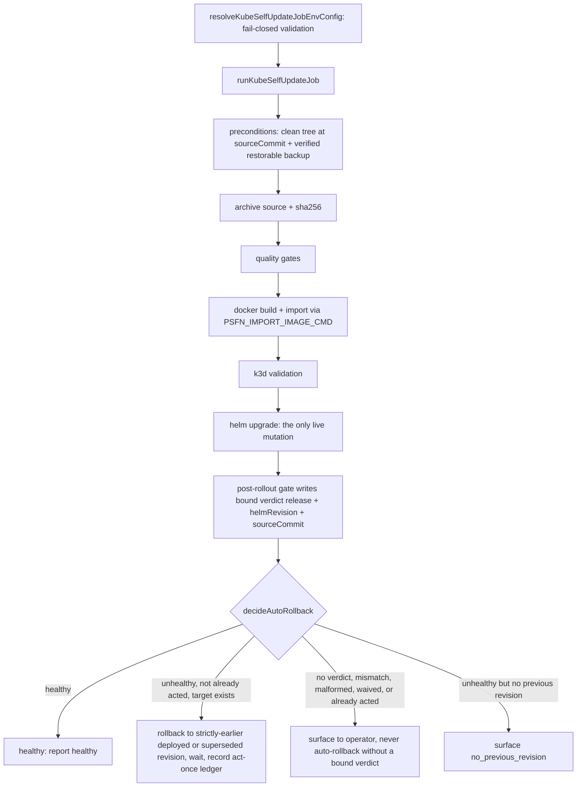
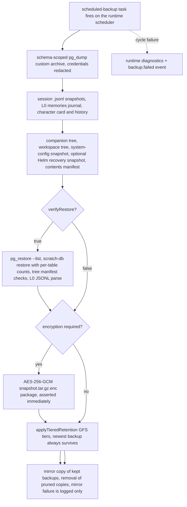

# Operations and Lifecycle

The repository owns complete lifecycle commands for exactly three public
deployment paths: **Docker Compose** (`scripts/compose-lifecycle.ts` +
`docker/compose.yml`), **repository-native** (`scripts/local-lifecycle.ts`
running the built entrypoints on the host), and **Helm / Kubernetes**
(`scripts/helm-lifecycle.ts` + `deploy/helm/psfn`). The split runtime —
gateway, isolated agent, operator — is the only supported runtime shape, and
Postgres (pgvector) is the only persistence backend; there is no SQLite runtime
path and no parallel Kustomize/proxy deployment tree. Live details of any
installation (addresses, kubeconfig, Helm values, credentials, host inventory,
infrastructure automation) are operator-owned and must never be committed.

Every lifecycle command runs from the same checkout and environment used for
installation, validates the required owner files and credentials before acting,
and never silently switches providers or deployment paths.

## Lifecycle map

| Operation | Docker Compose | Repository-native | Helm / Kubernetes |
| --- | --- | --- | --- |
| Start / install | `npm run compose:up` | `npm run local:up` | `npm run helm:up` |
| Inspect | `npm run compose:status` | `npm run local:status` | `npm run helm:status` |
| Diagnose | `npm run compose:doctor` | `npm run local:doctor` | `npm run helm:doctor` |
| Full persistence proof | `npm run compose:verify` | `npm run local:verify` | `npm run helm:verify` |
| Restart | `npm run compose:restart` | `npm run local:restart` | `npm run helm:restart` |
| Update | `npm run compose:update` | `npm run local:update` | `npm run helm:update` |
| Logs | `npm run compose:logs` | `npm run local:logs` | `npm run helm:logs` |
| Stop, preserving data | `npm run compose:down` | `npm run local:down` | `npm run helm:down` |

All three lifecycles expose the same default local endpoints: Garden login at
`http://127.0.0.1:10053/login` and the OpenAI-compatible API at
`http://127.0.0.1:10054/v1`. Ports are overridable per path: `PSFN_API_PORT` /
`PSFN_GARDEN_PORT` for Compose and Helm, `API_PORT` / `ADMIN_PORT` for the
repository-native path, whose in-process operator alert sink additionally
defaults to `PSFN_LOCAL_ALERT_PORT` 10055. Compose and repository-native take
the Garden `ADMIN_TOKEN` from the ignored `.env`; Kubernetes keeps it in the
retained application Secret and exposes it only through `npm run helm:token` on
explicit request.

## Access and readiness

`*:doctor` is the routine readiness check on every path. It verifies the
supervisor/workloads, the Postgres role/schema topology, gateway
`/health` with the `memory`, `embeddings`, and `scheduler` subsystems healthy,
Garden `/health`, the Garden token login challenge, and the authenticated Garden
UI. `*:verify` goes further: it runs one real provider-backed chat turn, proves
the exact user/assistant pair landed in the canonical `_turn_records` JSONL
journal, performs a full runtime restart (Compose restart, supervised restart,
or `kubectl rollout restart` of all three Deployments), and re-proves the same
persisted turn plus the authenticated surfaces afterwards.

`*:down` on every path stops compute while retaining runtime data; resume with
the corresponding `*:up` and then run `*:doctor`. Manual volume deletion,
`docker compose down --volumes`, or Helm uninstall are not ordinary stop
operations.

## Docker Compose lifecycle

`scripts/compose-lifecycle.ts` is the supported persistent single-host
deployment. `loadContext` reads the ignored `.env` (explicit process
environment wins over file values), requires `COMPANION_ID`,
`PSFN_POSTGRES_SUPERUSER_PASSWORD`, `PSFN_COMPANION_DATABASE_PASSWORD`,
`PSFN_SHARED_MIGRATION_DATABASE_PASSWORD`, `API_KEY`, `ADMIN_TOKEN`,
`GATEWAY_SESSION_HMAC_KEY`, `PSFN_BACKUP_ENCRYPTION_KEY`, and
`PSFN_PROVIDER_API_KEY`, and rejects a `PSFN_IMAGE` ending in `:latest`. The
data root defaults to `data/` (`PSFN_DATA_ROOT`); the lifecycle injects the
host UID/GID (`PSFN_HOST_UID`/`PSFN_HOST_GID`) and records `PSFN_GIT_COMMIT` so
image builds carry provenance. Before any command runs, the required
system-data files (`settings.json`, `models.json`, `providers.json`,
`companions.json`) and companion files (`companion.json`, `scheduler.json`,
`capability-tier.json`) must exist, and the host directories for the
workspace, logs, tmp, backups, and models are created.

- `compose:up` / `compose:update` — validate the Compose file, run
  `docker compose up -d --build --wait --wait-timeout 900`, then `doctor`.
  `update` is the same safe, data-preserving convergence as `up`.
- `compose:status` — `docker compose ps`.
- `compose:doctor` — verifies the required services (`postgres`,
  `operator-alert-sink`, `gateway`, `agent`, `garden`) are running, gateway
  subsystems are healthy, Garden health/login/authenticated UI succeed, and the
  Postgres role/schema topology is exactly two roles
  (`companion_main_runtime`, `shared_schema_migration`) and three schemas
  (`extensions`, `companion_main`, `shared`).
- `compose:verify` — doctor, then a real provider-backed chat whose exact turn
  is asserted in the canonical TurnRecord journal, a restart of
  `gateway`/`agent`/`garden`, and a re-assertion that the same persisted turn
  survived.
- `compose:restart` — `docker compose restart gateway agent garden`, then
  `up -d --wait --wait-timeout 300`, then `doctor`.
- `compose:logs` — follows `gateway`, `agent`, and `garden` logs.
- `compose:down` — `docker compose down`; persistent data and the Postgres
  volume are preserved.

## Repository-native lifecycle

`scripts/local-lifecycle.ts` runs the built runtime directly on the host under
a detached supervisor. `loadLocalContext` requires the full generated `.env`
(including `POSTGRES_ADMIN_DATABASE_URL`, the three role-bound database URLs,
`GATEWAY_SOCKET`, `ADMIN_TRANSPORT_SOCKET`, `PSFN_AGENT_AUTH_DIR`,
`BACKUP_ROOT_DIR`, and the workspace/character-card paths) and resolves every
path relative to the repo. It defaults `API_PORT` to `10054`, `ADMIN_PORT` to
`10053`, and `PSFN_LOCAL_ALERT_PORT` to `10055` (an in-process local operator
alert sink addressed by `NTFY_BASE_URL`/`NTFY_TOPIC`, default topic
`local-operator-alerts`), forces `NODE_ENV=production` and
`PERSISTENCE_BACKEND=postgres`, and creates the runtime-owned directories.
Runtime state lives in `local-lifecycle.json` (`RuntimeState`:
`starting`/`running`/`failed`/`stopped`, supervisor PID, component PIDs,
`gitHead`) and `local-release.json` (`ReleaseState`: last-good build dir,
recorded time, git head) under the temp dir, with a consolidated log at
`local-runtime.log`.

- `local:up` — preflights the three ports, removes stale Unix sockets (and
  refuses to replace a non-socket at a socket path), runs the Postgres
  bootstrap (`scripts/ops/psfn-compose-bootstrap.mjs`), ensures the runtime
  build (`npm run build:runtime`) and Garden UI build, prefetches the pinned
  local ONNX model assets on first start, then spawns a detached
  `tsx local-lifecycle.ts supervise` process.
- `supervise` — writes the `starting` state, then starts
  `operator-alert-sink` (`scripts/ops/psfn-compose-smoke-operator-alert-sink.mjs`),
  `gateway` (`dist/gateway-main.js`), `agent` (`dist/agent-main.js`), and
  `garden` (`dist/operator-main.js`). The agent receives role-bound credentials
  from `PSFN_AGENT_AUTH_DIR` (`agent-auth.env` lines must match the strict
  `export KEY=value` grammar and include `GATEWAY_COMPANION_AUTH_TOKEN`,
  `GATEWAY_SESSION_INTEGRITY_AUTH_TOKEN`, and `PSFN_BACKUP_ENCRYPTION_KEY`) and
  the `postgres-database-url` file; the gateway process is started with the
  superuser/migration credentials stripped from its environment. Startup waits
  up to 10 minutes for the gateway `/health` surface. If any child exits
  unexpectedly the state flips to `failed` and all children are stopped with
  SIGTERM then SIGKILL; SIGINT/SIGTERM to the supervisor performs the same
  graceful teardown and records `stopped`.
- `local:status` — prints state status, supervisor/component PID liveness, any
  recorded failure, and the log path.
- `local:doctor` — validates the state file, that every component PID is alive,
  gateway subsystems, the local alert sink, Garden health/login/UI, and the
  Postgres role/schema topology.
- `local:verify` — doctor, real chat with TurnRecord journal proof, full
  supervised restart, and re-proof of the persisted turn.
- `local:update` — doctor first, then copies the current `dist/` to
  `tmp/local-dist-good-<timestamp>` as the last-good build, builds the current
  checkout, restarts, and records the release state. On any failure it stops
  the runtime, preserves the failed build under
  `tmp/local-dist-failed-update-<timestamp>`, restores the last-good build, and
  restarts before throwing.
- `local:recover` — restores the last-good build recorded by the most recent
  `local:update`, preserving the replaced build.
- `local:logs` — tails the consolidated runtime log.
- `local:down` — SIGTERMs the detached supervisor and waits up to 30 seconds;
  owner files, workspace, memories, and PostgreSQL data are preserved.

## Helm / Kubernetes lifecycle

`scripts/helm-lifecycle.ts` requires `PSFN_KUBE_CONTEXT` explicitly and never
guesses a live cluster; `PSFN_HELM_NAMESPACE` and `PSFN_HELM_RELEASE` default to
`psfn` and must be Kubernetes DNS labels. It validates the 11 required system
owner files (including `trust-policy.json`, `intake-policy.json`,
`backup.json`, `mcp-servers.json`, `automata-policy.json`, `places.json`, and
`runtime-prompt-layers.json`) and six companion files (including
`charge-policy.json`, `skills.json`, and `partner-affect-shadow.json`), then
requires exactly one `companions.json` entry with valid UUID and the
`companion_main` / `companion_main_runtime` tenancy contract, and exactly one
enabled provider whose `apiKeyRef` names an uppercase environment variable.
Provider credentials are exported to the process environment and never enter
Helm values.

Images must be pinned: `PSFN_IMAGE` must be an exact tag or a
`@sha256:<64 hex>` digest — never `latest`/`main`/`main-latest`. When
`PSFN_K3D_CLUSTER` or `PSFN_HELM_LOCAL_BUILD=1` selects a local build, the
lifecycle builds and imports `psfn-framework:s11-<12-char-shortsha>` (digest
references are rejected for local builds), and the k3d cluster name must equal
the `k3d-<cluster>` context exactly.

- `helm:up` / `helm:update` — deploy, then replace the supervised
  port-forwards (a healthy pre-upgrade forward can remain attached to a pod
  Helm is terminating), reconcile the native Garden edge, and run `doctor`.
- `deploy` — ensures the chart's pinned cert-manager (`v1.20.3`) with an
  idempotent `helm upgrade --install`, ensures the namespace, stages the owner
  files into the `<release>-owner-files` ConfigMap, stages the
  `<release>-runtime-secrets` and `<release>-postgres-secrets` Secrets (existing
  secret values are retained across runs; the runtime role-proof tokens are
  derived with HMAC-SHA256 from `GATEWAY_SESSION_HMAC_KEY`), builds/imports the
  image, and runs `helm upgrade --install --atomic --wait --wait-for-jobs
  --timeout 30m` with the image, runtime, owner-file, and secret references
  passed as `--set-string` values. `fleet`, `fleetAuth`, `redis`, and `emosim`
  are disabled and `modelPrefetch` enabled by the lifecycle's own values.
- `helm:status` — Helm status, pod/PVC listing, and local connection state.
- `helm:connect` / `helm:disconnect` — start/stop the supervised loopback
  `kubectl port-forward` processes (`<release>-gateway` to the API port, and
  `<release>-garden` to the Garden port unless a native k3d Garden is in use).
  Forward PIDs are recorded in `/tmp/psfn-helm-<identity>.json` where identity
  is derived from `kubeContext\0namespace\0release`; stale forwards are
  detected and replaced. `disconnect` stops only the forwards — cluster
  workloads, the native k3d Garden binding, and a configured Tailscale Serve
  route keep running.
- `helm:doctor` — Helm release status `deployed`, exactly 1/1 ready for the
  `gateway`, `agent`, `garden`, and `operator-alert-sink` Deployments plus the
  `postgres` StatefulSet, gateway subsystems, Garden health/login/UI.
- `helm:verify` — real chat with `X-Session-Id` (`helm-verify-<uuid>`), reads
  the exact TurnRecord JSONL back out of the agent pod's PVC via
  `kubectl exec` (path
  `/runtime/companion-data/main/state/sessions/_turn_records/<channelId>.jsonl`),
  restarts all three Deployments with `kubectl rollout restart` + status, then
  re-asserts the same persisted turn and runs `doctor`.
- `helm:restart` — rollout restart of gateway/agent/garden, wait for readiness,
  reconnect, reconcile the Garden edge, `doctor`.
- `helm:logs` — follows all release container logs.
- `helm:token` — prints the runtime `ADMIN_TOKEN` from the Secret.
- `helm:down` — stops supervised forwards and scales every release Deployment
  and StatefulSet to zero, preserving PVCs, Secrets, the Helm release, owner
  files, memories, and Postgres data.

### Native k3d Garden and Tailscale

`PSFN_K3D_NATIVE_GARDEN=1` (requires `PSFN_K3D_CLUSTER`) maps
`https://127.0.0.1:<gardenPort>` directly to the k3d server node's Traefik
HTTPS ingress, bypassing the load balancer; the lifecycle creates the pinned
cluster when absent and fails without deleting or changing an existing cluster
with a different port mapping. `PSFN_TAILSCALE_SERVE=1` additionally requires
the native garden and a `PSFN_TAILNET_HOST` matching the currently connected
node (`*.ts.net`); Tailscale terminates browser-trusted HTTPS and forwards to
the same local route. Both roots must return exactly `302 Location: /login`,
preserving standalone Garden token authentication.

## Operator self-update job

The kube self-update operator job (`src/app/operator/kube-self-update-job-main.ts`)
is the production caller that turns the guarded deploy pipeline, the
post-rollout validation gate, and the Helm rollback safety net into one live,
credential-bearing flow. It constructs the docker/helm/kubectl transports in
the **operator** process only — the agent never carries them. It is invoked by
the operator (or CI) after an approved deploy is dispatched, and exits
fail-closed: any missing or invalid pinned config aborts before touching the
cluster.

`resolveKubeSelfUpdateJobEnvConfig` validates the whole job environment up
front: `PSFN_KUBE_SELF_UPDATE_ENABLED=true`, DNS-label namespace/release/
resource prefix, a 40-character `PSFN_GIT_COMMIT`, a pinned
`PSFN_KUBE_TARGET_IMAGE`, the repo/chart/dockerfile paths, the Garden health /
model route / chat completions URLs, the expected model id, the
`PSFN_CONFORMANCE_EXEC_CMD` and `PSFN_DIAGNOSTICS_EXEC_CMD` JSON arrays, and
optional `PSFN_HELM_GLOBAL_ARGS`/`PSFN_KUBECTL_GLOBAL_ARGS`.
`PSFN_AUTO_ROLLBACK_ENABLED` defaults to true; `PSFN_IMPORT_IMAGE_CMD` and
`PSFN_VERIFY_BACKUP_CMD` are required at run time and are executed through the
injected command runner.

*The self-update job runs the deploy pipeline, persists a post-rollout verdict bound to the exact rollout, and auto-rolls back exactly once when that verdict is unhealthy.*

### Deploy pipeline and fail-closed ordering

`runKubeDeployPipeline` (`src/system/lifecycle/kube-deploy-pipeline.ts`) runs
stages in order: `preconditions` (clean working tree at the source commit plus
a verified backup), `archive` (git archive + sha256), `gate` (quality gates;
empty gate lists are rejected outside a justified emergency recovery),
`build`, `import`, `k3d_validation`, `helm_upgrade`, and
`post_rollout_validation`. The Helm upgrade is the **only** stage that mutates
the running release; a failure in any earlier stage yields a record with
`liveUntouched === true` and no rollback. Live Helm values are captured before
upgrade and redacted (secret-bearing keys replaced with `[redacted]`) in the
record. The live transports (`createExecFileCommandRunner`,
`createLiveDeployPipelineRunner`, `createLiveHelmRollbackApi`,
`createLiveRollbackTargetResolver` in
`src/app/operator/kube-self-update-transport.ts`) shell out to
git/docker/helm/kubectl, propagate every command failure, and parse
`helm history` to resolve the current revision. The rollback-target resolver
only ever returns the highest strictly-earlier revision whose status is
`deployed` or `superseded` — never a `failed` or `pending-*` revision.
`helm rollback --wait` creates a new revision whose content is the target's,
and the resulting revision is read back from history.

### Post-rollout validation and auto-rollback

The post-rollout gate (`src/system/lifecycle/kube-post-rollout-validation.ts`)
runs nine checks against the live-rolled companion: `rollout_status`,
`garden_health`, `model_route`, `pgvector`, `redis_ping`, `agent_readiness`,
`chat_turn_probe`, `tool_conformance` (the only check that may be explicitly
skipped, with a recorded reason), and `log_scan`. It is fail-closed: any
inconclusive, erroring, or timed-out check counts as a failure, and the gate is
healthy only when every required check passes or the run carries a documented
emergency waiver with a non-empty justification. The verdict is persisted
(`post-rollout-validation-latest.json` style store with a bounded history) on
both the healthy and unhealthy paths before the rollback surface consults it.

`runKubeSelfUpdateJob` (`src/system/lifecycle/kube-self-update-job.ts`)
enforces three contracts: persist is always wired when auto-rollback is enabled
(and the job refuses to run without a validation runner then); every
`executeAutoRollback` call is serialized through a process-wide single-flight
guard so the act-once ledger's read-modify-write never races; and auto-rollback
is evaluated only after the rollout reached a live Helm revision.
`decideAutoRollback` (`src/system/lifecycle/kube-auto-rollback.ts`) trusts the
latest verdict only when it binds to the current rollout on
`(release, helmRevision, sourceCommit)`; a missing, malformed, or stale verdict
is surfaced to the operator and never read as health and never auto-rolled
back; a `waived` verdict is surfaced; a healthy verdict reports healthy; an
unhealthy verdict for the current rollout triggers exactly one rollback unless
the ledger already records one (act-once). The job exit codes are: `0` when the
pipeline succeeded and the rollout is healthy, `2` when the safety net rolled
back, and `1` for every other terminal state the operator must inspect.

## Backups and retention

Backup behavior is governed by the system owner file `backup.json`
(`src/system/config/backup-config.ts`: `intervalHours` ≥ 1,
`maxRotatingBackups` ≥ 1, `maxDailyBackups`/`maxWeeklyBackups`/
`maxMonthlyBackups`, `mirrorDir`, `verifyRestore`, `groupMode`, and
`encryption.mode: "required"` with an env `keyRef`), plus environment
overrides (`BACKUP_INTERVAL_MS`, `BACKUP_RETENTION_COUNT`, `BACKUP_MIRROR_DIR`,
`BACKUP_VERIFY_RESTORE`, `BACKUP_GROUP_MODE`, `BACKUP_ROOT_DIR`). Defaults are
a 12-hour interval, 9 rotating / 7 daily / 2 weekly / 1 monthly slots, and
`verifyRestore: true`; the encryption key environment variable is mandatory —
config resolution throws when it is missing. The backup root must be durable
and writable: `assertBackupRootWritable` (`src/persistence/backups/backup-root.ts`)
performs create/write/remove probes and fails closed with
`BackupRootNotWritableError` when the lane's volume was never mounted.

### Backup lanes

- **Single-companion**: the agent scheduler registers the `scheduled-backup`
  task ("Session + database backup") on the runtime scheduler
  (`src/app/agent/scheduler-runtime.ts`), skipping the first run by default.
  Each cycle runs `runBackupCycle`; a failure is recorded in the runtime
  diagnostics and emitted as a `backup.failed` event.
- **Multi-companion fleet**: exactly one process — the fleet leader,
  deterministically the first companion in `companions.json` order — runs a
  fleet backup cycle that captures every companion slice plus the
  shared/cluster artifact (or one whole-database family artifact in group
  mode); follower processes register no backup lane.
- **Fleet-auth consistent lane**: when `config.fleetAuth` is enabled the
  gateway owns a consistent fleet-auth backup cycle whose cadence survives pod
  restarts through the `fleet-auth-backup-watermark.json` file in the backup
  root; an unreadable watermark schedules a catch-up cycle rather than
  suppressing backups.

### What a cycle captures and verifies

`runBackupCycle` (`src/persistence/backups/service.ts`) requires Postgres dump
configuration (a database-less backup is refused), then captures, under a
timestamp-named directory (`YYYYMMDDTHHMMSSFFFZ`): a schema-scoped
`pg_dump --format=custom` archive (schema names are strictly validated before
interpolation; credentials are redacted from errors), a copy of the session
`.jsonl` snapshots, the L0 memories journal (`notes/memories.jsonl`), the
character card and history, the companion tree (excluding the sessions dir,
backup roots, `backups`, and `state/repair-backups`), the workspace tree
(excluding backup/mirror roots and protected paths — overlapping roots are
rejected up front), the system-config snapshot, an optional Kubernetes Helm
recovery snapshot, and a backup-contents manifest. With `verifyRestore`, the
cycle runs `pg_restore --list` on the dump, optionally restores into a
dedicated scratch database (dropping all user tables/sequences/views each run;
pgvector must be pre-created because it is untrusted on stock installs) and
compares per-table counts against the source, verifies every captured tree
against its manifest, and parses the L0 journal JSONL. When encryption is
configured the staged directory is packaged as `snapshot.tar.gz.enc` encrypted
with AES-256-GCM under an scrypt-derived key, with an `encrypted-backup.json`
manifest recording the KDF parameters, IV, auth tag, sha256, and size, and the
package is asserted immediately.

*A scheduled backup cycle captures Postgres, sessions, memories, and the companion/workspace/system trees, verifies restore fidelity when configured, encrypts when required, then applies tiered retention and mirrors.*

### Tiered retention and mirroring

After a successful cycle, `applyTieredRetention`
(`src/persistence/backups/retention.ts`) applies GFS tiers: monthly (newest
backup per calendar month), weekly (newest per ISO week), daily (newest per UTC
calendar day), then rotating (most recent unprotected backups). Only
timestamp-shaped directory names participate, so operator inspection copies can
neither hijack the newest-survives invariant nor be pruned; the single newest
backup always survives even if every tier count is zero. Pruned directories are
removed recursively, and a configured mirror (`BACKUP_MIRROR_DIR`) receives a
recursive copy of each completed backup plus removal of mirror copies of pruned
directories; a mirror failure is logged while the local backup stays intact.

### Restore verification and rehearsal

`npm run verify:backup-restore` (`scripts/verify-backup-restore.ts`) validates
the generic backup/restore contract against the latest snapshot in
`BACKUP_ROOT_DIR` (or an explicit `--backup-dir`, or an auto-generated repo
fixture when neither exists). It decrypts encrypted packages to a temp
directory (cleaned up afterwards), lists the session snapshot files, verifies
the Postgres dump archive via `pg_restore --list`, optionally performs a full
restore-into-scratch-database fidelity check (`--postgres-restore-url`,
`--postgres-source-url`) with restored-vs-source row-count assertions, verifies
the companion/workspace/system-config tree snapshots, the backup-contents
manifest, and the Kubernetes Helm recovery snapshot when required, and prints a
JSON report. Legacy database snapshots that are not `.dump` archives are
rejected — SQLite backup verification is retired; current backups must use
Postgres dump archives and/or tree manifests.

A real recovery rehearsal must restore into an isolated target and prove owner
fingerprints, PostgreSQL state, sessions, workspace content, and post-restore
startup; retention rules, storage endpoints, and recovery evidence remain in
the operator's external configuration authority.

## Data retention across lifecycle operations

- `compose:down` stops and removes containers and the network but preserves
  named volumes and bind-mounted data.
- `local:down` stops the supervisor and all four host processes, preserving
  every persistent root.
- `helm:down` scales workloads to zero, preserving PVCs, Secrets, the Helm
  release, and the local k3d ingress/Tailscale coordinates.
- Updates never replace data roots: `local:update` swaps only `dist/` (with an
  automatic restore of the last-good build on failure), and the Helm seed init
  container imports owner files from the staged ConfigMap **only when absent**
  — once a file reaches its PVC, the PVC remains authoritative across upgrades
  and Garden changes. Helm's `--atomic` upgrade and the operator job's
  auto-rollback restore the previous release revision without touching
  application PVCs, the Postgres StatefulSet claim, or generated Secrets.
- Maintenance/repair CLIs create their own timestamped repair backups before
<!-- openwiki: broken internal link [maintenance-scripts-inventory.md] file "maintenance-scripts-inventory.md" does not exist. Fix the href or restore the target, then delete this comment. -->
  mutation (see the [maintenance scripts inventory](maintenance-scripts-inventory.md)).

## Recovery: session repair

`npm run session:repair` (`src/app/maintenance/session-repair.ts`) is the
read-only recovery scan for the canonical session journals: it scans every
`.jsonl` under the sessions dir, reports loaded vs quarantined lines per file
with the quarantine sidecar path, and sets exit code 1 when any corruption
exists — it never writes. The sanctioned L0 re-sign path
(`session:repair:integrity`), the derived-surface rebuilds
(`session:repair:attribution`, `session:repair:transcript-projection`), and
exact-session purge are documented on the maintenance scripts inventory page.

## Diagnosis order

When `*:doctor` fails, inspect in this order:

1. the lifecycle's status output and component/workload logs;
2. persistent-root separation, volume attachment, ownership, and free space;
3. required owner files and settings-contract versions;
4. PostgreSQL/pgvector readiness and migration-role access;
5. gateway-to-agent transport and role-bound authentication;
6. model-prefetch completion and provider authentication/quota/model access;
7. Garden native ingress or existing-context loopback forwarding for Helm.

Do not weaken policy or add a second configuration path to make a failed health
check green. Repair the owning file, credential, volume, or workload and rerun
the same lifecycle command.

## Public/private deployment boundary

The generic public deployment authorities are `scripts/compose-lifecycle.ts`
with `docker/compose.yml`, `scripts/local-lifecycle.ts` with the runtime
entrypoints, and `scripts/helm-lifecycle.ts` with `deploy/helm/psfn`. There are
no parallel Kustomize, proxy, or deployment trees. Private operators may wrap
these public lifecycles, but their values, overlays, service names, addresses,
cluster definitions, credentials, and run evidence stay outside the application
repository; the public source never identifies or infers a live deployment.
