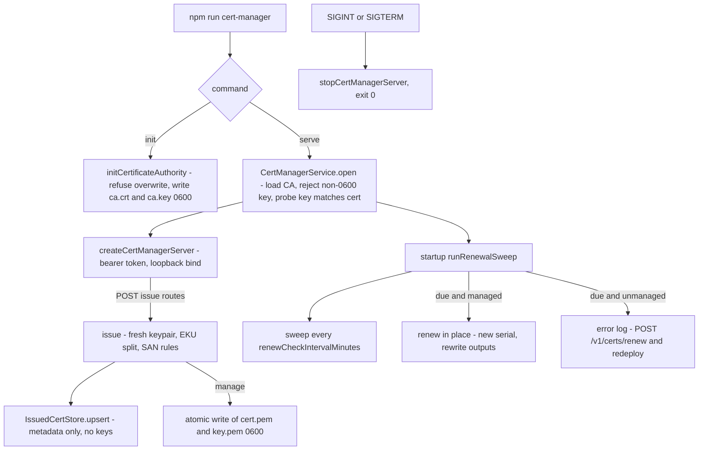
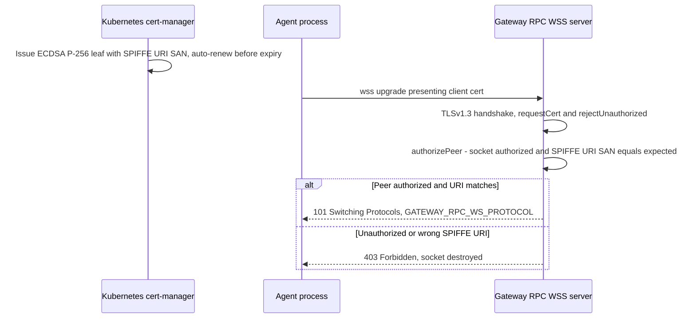

# Certificates

PSFN authenticates machine-to-machine traffic along two PKI tracks, both
fail-closed by construction:

1. **The cert-manager sidecar** (`src/app/cert-manager/`) is a standalone
   process that hosts a deployment-owned private CA. It issues server
   certificates for the gateway's direct-TLS API edge and client certificates
   for satellite mTLS identities, tracks their expiry, and auto-renews managed
   bundles.
2. **The Kubernetes cert-manager chart track**
   (`deploy/helm/psfn/templates/certificates.yaml`) uses the cluster's
   cert-manager controller to mint ECDSA P-256 certificates carrying SPIFFE URI
   SANs for the in-cluster RPC transports: gateway↔agent, agent admin
   (garden), fleet SSO, and the satellite hub's staged mTLS client identity.

Both tracks share one operator-relevant posture: verification exceptions stay
endpoint-scoped, private keys are delivered exactly once (or kept in the
issuer's own 0600 store), and no failure degrades silently into weaker
authentication. The full bootstrap walkthrough lives in
[`docs/certificates.md`](../../docs/certificates.md); the authority model for
fleet authentication is in
<!-- openwiki: broken internal link [../fleet-auth-authority-model.md] file "../fleet-auth-authority-model.md" does not exist. Fix the href or restore the target, then delete this comment. -->
[`fleet-auth-authority-model.md`](../fleet-auth-authority-model.md), and the
deployment lifecycles that run these components are in
[`operations.md`](../operations.md) and [`setup.md`](../setup.md). Fail-closed
contracts are cross-referenced from
[`specifications.md`](../specifications.md).

## The cert-manager sidecar application

The sidecar is a standalone process: it shares nothing with the gateway or
agent runtimes except `src/shared/` utilities, the logger, and the persistence
path discipline. It is built as its own tsup entry (`cert-manager-main` →
`dist/cert-manager-main.js`) and exposed as npm scripts:

```text
npm run cert-manager -- init    # one-time: generate the root CA + default config
npm run cert-manager            # serve the issuance API + renewal loop (serve is the default command)
npm run cert-manager:start      # same, from the tsup build
```

`init` generates the root CA into the state dir and writes a default
`cert-manager.json`; it **refuses to overwrite existing CA material**, so
re-running it after moving the CA aside for rotation is safe and deliberate.
`serve` (the default command) parses `CERT_MANAGER_TOKEN` and the config,
opens the service — which re-verifies the CA key and its 0600 mode — starts
the HTTP API, runs one renewal sweep at startup, then sweeps on the configured
interval. SIGINT/SIGTERM stop the server and exit 0; a failed shutdown exits 1.



*The cert-manager sidecar lifecycle: `init` creates the root once, `serve` runs the authenticated issuance API plus the background renewal loop; unmanaged expiring certificates surface as loud errors instead of silent skips.*

### State directory

All state lives under one directory — default `<system-data>/cert-manager/`,
overridable with `CERT_MANAGER_STATE_DIR` (which wins over the runtime path
layout; without it the sidecar resolves the system-data root exactly like the
runtime and nests under it, never under companion-data):

```text
cert-manager.json    sidecar config (created by init)
ca/ca.key            CA private key, mode 0600 — never served, never leaves this dir
ca/ca.crt            CA certificate (public; also served at GET /ca.pem)
issued-certs.json    issued-cert metadata (serial, expiry, SANs) — never keys
live/<kind>-<id>/    default output dir for managed (auto-renewed) bundles
```

### Configuration and authentication

Parsing is strict and fail-closed: `version` must be 1, and unknown keys,
wrong types, and out-of-range values are startup errors, never silently
defaulted. `renewBeforeDays` must be smaller than both `serverCertDays` and
`clientCertDays`, otherwise every issued certificate is immediately due.
Defaults: loopback `127.0.0.1:10070`, `allowNonLoopback: false`, CA commonName
`PSFN Private CA` with 3650-day validity, 90-day server and client leaves,
30-day renew window, 60-minute sweep interval.

`CERT_MANAGER_TOKEN` is **required** (≥ 32 characters) and lives in the
environment, not in the config file — the sidecar mints credentials and must
never run unauthenticated, even on loopback; there is no tokenless escape
hatch. Binding any non-loopback host requires the explicit
`listen.allowNonLoopback: true` opt-in.

## PKI core and issuance contract

All crypto is pure JavaScript on `@peculiar/x509` over Node's WebCrypto —
ECDSA P-256 with SHA-256 everywhere, and **no openssl subprocesses, ever**.

- **Identity ids** become the certificate CN *and* the registry key, so they
  must be DN-safe and stable: `IDENTITY_ID_PATTERN =
  /^[A-Za-z0-9][A-Za-z0-9._-]{0,63}$/`; anything else fails issuance.
- **CA generation** mints a self-signed root with `BasicConstraints CA=true`
  (critical), `keyCertSign | cRLSign` key usage, a Subject Key Identifier, and
  a notBefore backdated five minutes so fresh certificates survive small clock
  skew.
- **CA loading fails closed.** The certificate must carry `CA=true`; the key
  PEM must contain exactly one `PRIVATE KEY` block; and the service signs a
  random probe with the loaded key and verifies it against the certificate's
  public key — a mismatched key on disk is a startup error, never a silent
  accept. `CertManagerService.open` additionally refuses to start when CA
  material is missing (telling you to run `init` first) or when the CA key
  file has any group/other permission bits (must be 0600).
- **Leaf issuance** (server or client): server certificates require at least
  one SAN (DNS name or IP literal — the SAN extension distinguishes IP vs DNS
  entries); the EKU is exactly `serverAuth` for server certs and exactly
  `clientAuth` for client certs; leaves are `CA=false`, carry SKI + AKI, and
  get a random 16-byte serial with the sign bit cleared (positive DER INTEGER
  per RFC 5280). Issuance refuses any validity that outlives the CA's
  `notAfter`.
- **Pin material**: every issued certificate reports
  `fingerprintSha256` (sha256 over the certificate DER, lowercase hex without
  colons — the exact normalized pin format the client-cert identity module
  accepts) and `spkiSha256` (sha256 over the SubjectPublicKeyInfo DER). These
  are the values `satellites.json` bindings use.

## Issuance, renewal, and the issued-cert registry

`CertManagerService` owns every operation the API and renewal loop expose.
`issue()` maintains **one active certificate per identity per kind** — the
registry key is `${kind}:${identityId}` — defaulting validity to the config
defaults (`serverCertDays` / `clientCertDays`). Re-issuing an existing
identity preserves its original `issuedAt` and stamps `renewedAt`. The
`manage` option opts the identity into sidecar-managed renewal:

- `true` — write the bundle under `live/<kind>-<id>/` inside the state dir;
- `{"certPath": "...", "keyPath": "..."}` — explicit absolute paths (both
  must be absolute and distinct), so `API_TLS_*` and satellite configs can
  point wherever they already look.

Managed keys are written with explicit mode 0600 and everything is written
atomically (tmp file, chmod, rename); the CA key itself always gets 0600 even
on the happy path. Unmanaged certificates (keys held only by the satellite)
are returned once in the response and never persisted.

`renew()` re-issues a tracked identity with a **fresh keypair**, preserving
kind, SAN set, and validity days, and rewrites managed outputs in place.
`runRenewalSweep()` walks every registry record inside the `renewBeforeDays`
window: managed records are renewed in place and logged loudly (`RENEWED
certificate before expiry` with old and new serials); expiring unmanaged
records are logged as **errors** with the manual action (`POST /v1/certs/renew`
and redeploy); per-certificate failures never abort the sweep — every due
certificate gets its attempt. The loop runs one sweep at startup, then every
`renewCheckIntervalMinutes`; a sweep-level crash is fatal-loud (error log) but
keeps the sidecar API alive.

`IssuedCertStore` persists `issued-certs.json` (version 1) and validates
strictly: on load and on every upsert it round-trips records through the
parser, rejects unknown keys, wrong versions, malformed timestamps, and
duplicate ids — so a programming error can never persist a record that would
brick the next startup. Writes are atomic JSON.

## HTTP control surface

```text
GET  /healthz            liveness probe (no state disclosed, public)
GET  /ca.pem             CA certificate PEM (public material)
GET  /v1/certs           issued-cert metadata + expiries (bearer)
POST /v1/certs/server    issue server cert  {identityId, sans, validityDays?, manage?}
POST /v1/certs/client    issue client cert  {identityId, sans?, validityDays?, manage?}
POST /v1/certs/renew     re-issue           {kind, identityId}
```

Every route except `/healthz` and `/ca.pem` requires
`Authorization: Bearer <token>` compared with `timingSafeEqual`. Bodies are
capped at 64 KiB (413); unknown request fields are rejected (400); issuance
errors are operator input problems (bad identity id, SAN, or validity vs CA
expiry) and surface as 400 with the message rather than a blind 500. Issue
responses carry `certPem`, `keyPem` (the one and only delivery of the key
unless managed outputs were configured), `caCertPem`, and the fingerprint/SPKI
pins; renew responses are identical. The CA private key is never reachable
through any route — `/v1/certs` lists metadata only, and the tests probe
`/ca.key`, `/v1/ca.key`, and `/ca/ca.key` for 404s.

## Gateway TLS wiring

### Process-level custom CA trust

`src/boundary/gateway/tls.ts` wires process-level custom CA trust at startup.
When `caPath` (e.g. `GATEWAY_TLS_CA_PATH`) points at an existing PEM bundle it
sets `NODE_EXTRA_CA_CERTS` so Node trusts the private CA for outbound HTTPS
(LLM, embeddings, and friends); a missing file is an error log, not a silent
accept. `rejectUnauthorized: false` only records that an endpoint-scoped
exception was requested — the helper never sets or mutates
`NODE_TLS_REJECT_UNAUTHORIZED` and never disables process-global TLS
verification; any insecure development exception must be wired on the intended
client transport. The gateway entrypoint calls it early in startup, before
any HTTPS connections.

### The API direct-TLS edge

The gateway's `/v1` API listener optionally terminates TLS directly
(`src/channels/api/server/http.ts`). `API_TLS_CERT_PATH` and
`API_TLS_KEY_PATH` must be configured together; `API_TLS_CLIENT_CA_PATH`
without a cert/key pair is a startup error. When TLS is configured the server
reads the files at startup (`readFileSync`), sets `requestCert: true` with
`rejectUnauthorized: false` and `minVersion: 'TLSv1.2'` — it *requests* a
client certificate so satellite bindings can be verified against the real
peer certificate, but never *requires* one, because non-satellite API clients
have none. Identity is enforced by fail-closed binding matching, not by TLS
rejection.

### Client-cert identity derivation and satellite bindings

`src/channels/backplane/http/client-cert.ts` is the only sanctioned source of
client-cert identity (Sprint-10 finding C1), from exactly two authenticated
sources:

- **`tls_peer`** — the real peer certificate of the terminated TLS socket.
  Fingerprint/SPKI hashes are self-authenticating pins and always usable;
  `subject`/`san` are exposed only when the socket chain-validated the
  certificate (`authorized === true`), because any self-signed certificate can
  carry an arbitrary subject.
- **`trusted_proxy`** — `X-PSFN-Client-Cert-*` headers asserted by a
  TLS-terminating proxy that authenticated itself with the configured
  `API_TRUSTED_PROXY_CLIENT_CERT_TOKEN` (timing-safe compare; weak tokens are
  startup errors). Without that token, cert headers are never trusted.

After derivation, every ingress calls `stripClientCertHeaders` so
unauthenticated certificate assertions can never leak downstream.

Satellite endpoints bind these identities in `satellites.json` with
`clientCertFingerprintSha256`, `clientCertSpkiSha256`, `clientCertSubject`,
and/or `clientCertSan`. Matching is fail-closed **all-of**: every configured
attribute must be present on the authenticated identity and match exactly;
mTLS endpoints must configure at least one binding at parse time (the parser
rejects a vacuous zero-binding mTLS endpoint), and a missing identity always
fails. Because fingerprint pins rotate whenever cert-manager renews a
keypair, the SPIFFE URI SAN binding (`clientCertSan`) is the stable choice
for auto-renewed identities.

## Kubernetes track: SPIFFE-URI mTLS identities

### Chart topology and issuer rules

In the Helm topology the cluster's cert-manager is a hard dependency —
`validations.yaml` fails the release unless `certificates.enabled` is true
because the Kubernetes network transports require mTLS. With
`certificates.issuer.create`, the chart renders a self-signed `Issuer`, a
`Certificate` for the CA (`isCA: true`, ECDSA P-256, stored in
`<release>-ca-tls`), and a CA `Issuer` backed by that secret. An existing
`Issuer`/`ClusterIssuer` can be referenced instead (`existingIssuerRef`), with
fail-closed combination rules: `existingIssuerRef.name` must be empty when
`create=true`, and a chart-created CA can never back a `ClusterIssuer`
(because cert-manager resolves ClusterIssuer CA secrets in its
cluster-resource namespace), so `issuer.kind` must be `Issuer` when
`create=true`.

### Workload certificates

Workload certificates are issued from the CA issuer, all ECDSA P-256 with
`duration: 2160h` (~90 days) and `renewBefore: 360h` (~15 days), and mounted
read-only under `certificates.mountBasePath` (default
`/run/psfn/tls/<name>/`) as `tls.crt`, `tls.key`, and `ca.crt`:

- **gateway-rpc** — the gateway's RPC WSS server certificate, with DNS SANs
  for the RPC service and a SPIFFE URI SAN.
- **agent-rpc-client** — per companion (in fleet mode, one per
  `fleet.companions` entry), a client certificate carrying the companion's
  SPIFFE URI; the gateway listener authenticates the fleet-agent role at mTLS
  and binds the exact companion during RPC registration.
- **agent-admin** — the agent's private admin surface certificate, with
  `server auth` + `client auth` usages and DNS + SPIFFE SANs.
- **garden-admin-client**, **garden-sso-server**, **gateway-sso-client** —
  the operator Garden plane and fleet SSO mTLS identities.
- **satellite-hub-client** — the satellite hub's staged mTLS client identity.

SPIFFE URIs are derived from `certificates.trustDomain` (default
`cluster.local`) as `spiffe://<trustDomain>/psfn/{gateway|agent|garden}/<id>`,
with the `/fleet` form when `fleet.enabled` and a per-companion
`spiffe://<trustDomain>/psfn/agent/<companionId>` in fleet mode.

### Transport verification

Every in-cluster mTLS consumer requires the full quartet — CA path, cert
path, key path, and an **expected peer SPIFFE URI** — and fails closed at
startup when any piece is missing (`wss` without `GATEWAY_RPC_TLS_*` is a
startup error). SPIFFE URI normalization is strict: the value must parse as
`spiffe://` with a host and no credentials, query, or fragment.



*The in-cluster mTLS contract: cert-manager issues and renews SPIFFE-URI leaf certificates; the gateway RPC server accepts only authorized peers whose SPIFFE URI SAN matches the configured expectation.*

The gateway RPC WSS server (`src/boundary/gateway/transport.ts`) terminates
with `requestCert: true`, `rejectUnauthorized: true`, TLSv1.3, and
authorizes each websocket upgrade by checking the socket is `authorized` and
that the peer certificate's SPIFFE URI SAN exactly equals the expected value
(`authorizeMutualTlsPeer` → `verifyPeerCertificateSpiffeUri`); unauthorized or
wrong-URI peers get 403 and a destroyed socket. Clients symmetrically verify
the server with `createSpiffeCheckServerIdentity`. The same pattern covers the
agent admin transport (`ADMIN_TRANSPORT_TLS_*`), fleet SSO
(`FLEET_SSO_GARDEN_TLS_*` / `FLEET_SSO_GATEWAY_TLS_*` with expected peer
SPIFFE URIs), and the session-integrity worker source.

### Satellite hub staged mTLS

The satellite-hub client certificate is issued and auto-renewed by the chart
and mounted into the hub pod today, but runtime auth remains the scoped
bearer key until the gateway `/v1` edge terminates direct TLS
(`API_TLS_*`). The `satellites.json` binding for the hub uses the SPIFFE URI
SAN (`clientCertSan`), which stays stable across renewals — deliberately
chosen over fingerprint/SPKI pins that rotate whenever cert-manager replaces
the private key.

## Lifecycle: renewal, rotation, revocation

- **Consumers read files at startup.** `createApiHttpServer` uses
  `readFileSync`, so restart the gateway (or have the process manager watch
  the managed paths) after a server-cert renewal; satellites likewise need
  renewed bundles redeployed.
- **There is no CRL/OCSP in v1.** Removing one satellite means removing its
  bearer key from `API_SATELLITE_KEYS` and its `satellites.json`
  endpoint/binding — a lingering leaf alone grants nothing, because satellite
  auth requires the bearer key *and* the cert binding.
- **CA key compromise is a full rotation.** Stop the sidecar, move `ca/` and
  `issued-certs.json` aside for forensics, re-run `init` to mint a new root,
  restart, re-issue the gateway server cert and every satellite client cert,
  swap `API_TLS_CLIENT_CA_PATH` and every satellite's pinned `psfn-ca.crt` to
  the new root (old leaves are now untrusted everywhere — that *is* the
  revocation), and rotate `API_SATELLITE_KEYS` and `CERT_MANAGER_TOKEN`.
- **CA rotation for the Kubernetes track** is cert-manager's normal lifecycle:
  the CA `Certificate` and each workload `Certificate` are re-issued and the
  secrets swapped by the controller before their `renewBefore` window.

## Invariants and failure semantics

- **No tokenless mode, ever.** Both the sidecar and the mTLS transports
  refuse to start with missing or weak secrets; there are no compatibility
  shims or silent fallbacks.
- **Keys are delivered once.** The sidecar returns issued keys in the API
  response; only managed bundles get written to disk, with 0600 modes, and
  only the CA public certificate is served.
- **Nothing expires silently.** Unmanaged expiring certificates are logged at
  error level with the manual renewal action; managed renewals rewrite outputs
  in place and log old/new serials.
- **Individual failures stay isolated.** A per-certificate renewal failure
  never aborts the sweep; a sweep-level crash is fatal-loud (error log) but
  keeps the sidecar API alive; the process exits 1 on failed shutdown.
- **Verification exceptions stay scoped.** Process-global TLS verification is
  never disabled by config flags; endpoint-scoped exceptions must be wired
  per client.

## Focused tests

- `src/app/cert-manager/pki.test.ts` pins the CA/leaf extension contract:
  self-signed CA with ~10-year validity, client certs chaining to the CA with
  a critical `clientAuth` EKU only, server certs with `serverAuth` + requested
  SANs, rejection of server certs without SANs, DN-unsafe identity ids,
  issuance past CA expiry, and fail-closed key/cert mismatch.
- `src/app/cert-manager/server.test.ts` pins the auth and custody contract:
  0600 CA key mode, `/ca.pem` public with no key material, CA key paths 404,
  missing/wrong tokens 401, unknown fields 400, one-time key delivery with
  metadata-only listing, and a real mutual-TLS handshake with sidecar-issued
  certs (including the negative case where a certless client is refused).
- `src/app/cert-manager/renewal.test.ts` pins the renewal loop: in-place
  renewal of expiring managed certs with fresh serials and preserved SANs,
  untouched fresh certs, error-level reporting of expiring unmanaged certs,
  and registry reload across a simulated sidecar restart.
- `src/boundary/gateway/tls.test.ts` pins the gateway TLS config helper:
  `NODE_EXTRA_CA_CERTS` is set only when `caPath` exists, a missing file is
  never applied, and `rejectUnauthorized: false` reports the exception request
  without mutating `NODE_TLS_REJECT_UNAUTHORIZED`.

## See also

- [`docs/certificates.md`](../../docs/certificates.md) — full bootstrap walkthrough
- [`operations.md`](../operations.md) — lifecycle and operating procedures
- [`setup.md`](../setup.md) — setup and provisioning
- [`specifications.md`](../specifications.md) — configuration and fail-closed contracts
<!-- openwiki: broken internal link [../fleet-auth-authority-model.md] file "../fleet-auth-authority-model.md" does not exist. Fix the href or restore the target, then delete this comment. -->
- [`fleet-auth-authority-model.md`](../fleet-auth-authority-model.md) — fleet auth authority model
