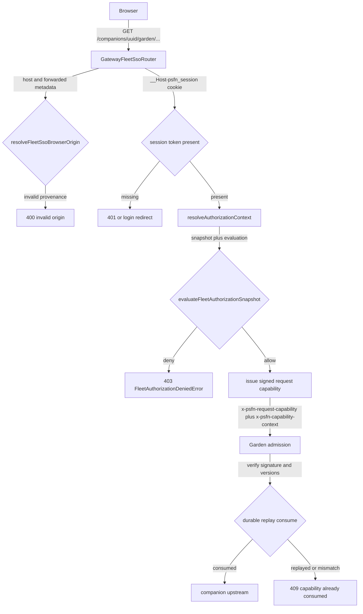
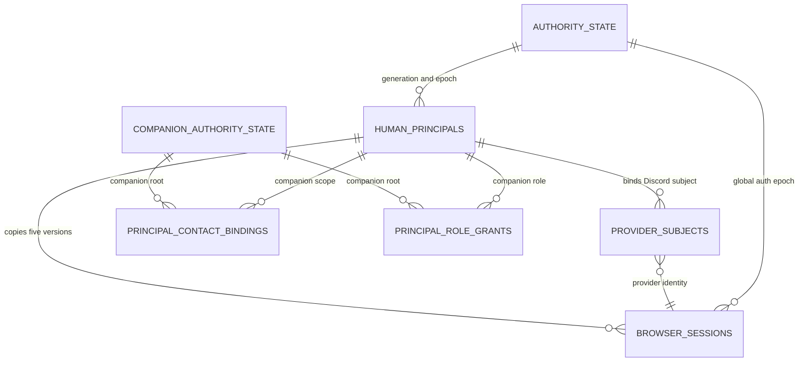
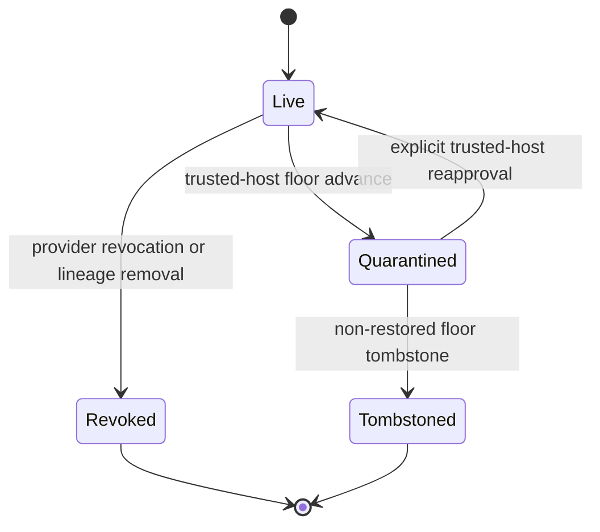

# Fleet Auth

> **Terminology:** Per charter §8.12 (2026-07-20) the multi-companion system is a
> **companion cluster**. "Fleet" persists only in code identifiers (the
> `fleet-auth` subsystem, `fleet-auth.json`, `fleet-garden-*` modules). The
> companion control plane is **Garden**. The charter is operator-owned law:
> [docs/PSFN_PROJECT_CHARTER.md](../../docs/PSFN_PROJECT_CHARTER.md).

`fleet-auth` is a consistency model, not a single role lookup. A database-backed
principal authorizes a companion request only when seven projections describe
the same current authority, and the gateway hands the companion a short-lived,
signed request capability that binds the exact request bytes to the exact
authorization decision. The browser never talks to Garden directly; the gateway
is the only process that ever sees session tokens and the only signer of
operator capabilities. Everything else — origin resolution, session cookies,
authorization snapshots, capability issuance, replay fences — fails closed by
construction.



*The gateway is the unified fleet origin: it authenticates the browser session, resolves the exact authorization context per companion and action, mints a single-use signed capability, and proxies the request to Garden, which verifies and replays that capability.*

## The seven authority projections

For a database-backed principal to authorize a companion request, these
projections must all describe the same current authority:

1. **`human_principals`** must be `active` and `live`; its
   `authority_generation` must equal the current generation, and its
   `authn_version`, `authz_version`, `binding_version`, `grant_version`, and
   `policy_version` are the versions copied into sessions and checked later.
2. **`provider_subjects`** binds the authenticated provider subject (a Discord
   snowflake) to the principal. The row must be `active`, `live`, at the
   current authority generation, and not tombstoned.
3. **`companion_authority_state`** is the per-companion authority root. The row
   for the requested companion must be `active`, `live`, at the current
   authority generation, and lineage-current against the trusted-host floor.
4. **`principal_contact_bindings`** connects the principal to a companion
   contact. The companion-scoped row must be `active`, `live`, unfenced,
   untombstoned, at the current authority generation, and at the principal's
   `binding_version`.
5. **`principal_role_grants`** supplies the companion-scoped role. The row must
   be `active`, `live`, untombstoned, permitted by `disabledActionsByRole`, at
   the current authority generation, and at the principal's `grant_version`.
6. **`authority_state`** supplies the global `authority_generation` and
   `global_auth_epoch` against which the other projections and the session are
   evaluated.
7. **`browser_sessions`** is minted at login and copies the principal's five
   versions together with the current global epoch and provider identity. The
   table does not duplicate `authority_generation`; session validity derives
   the generation from the joined principal and the non-restored trusted-host
   floor. The copied values and the derived generation must all remain current
   when the session is used.



*The seven authority projections and the version/epoch edges that must all agree for an allow.*

Child assertion authorization requires exactly one matching cluster session,
provider subject, contact binding, and role grant for the requested companion,
plus exact parent-decision and authority values. A stale or duplicate row does
not degrade to weaker authorization: it produces a denial such as
`child_authority_denied` or `session_ambiguous`.

## Authorization evaluation

The gateway-side evaluator (`fleet-authorization-context.ts`) is a pure function
over a snapshot plus the closed `FLEET_AUTH_ACTIONS` vocabulary:

- The session must be exactly one (`session_absent` / `session_ambiguous`),
  `fleet` audience, unrevoked, unreplaced, unexpired, with a principal that is
  active and live, and with every copied version (`authn`, `authz`, `binding`,
  `grant`, `policy`) equal to the principal's current values; the session's
  `global_auth_epoch` must equal the authority's current epoch.
- The provider subject must be exactly one row matching the session's provider
  and subject, active and live, not tombstoned.
- The companion must be exactly one row, active and live, with current
  authority lineage against the trusted-host floor (`companion_tombstoned`
  otherwise).
- Exactly one active live contact binding and exactly one active live role
  grant for the companion; the grant role must satisfy
  `FLEET_AUTH_ACTION_BASE_ROLE` (a null base role means no routine role
  authorizes the action) and not be listed in
  `disabledActionsByRole[role]` (`role_action_denied`).
- Discord evidence, when the request asks for it, must exist, be bound to the
  exact principal/subject/companion, be positive on both the PSFN and Discord
  permission results with no member-specific deny veto, be config- and
  epoch-current, and be unexpired (`evidence_absent`, `evidence_misbound`,
  `evidence_not_positive`, `evidence_stale`).

Every `deny` carries a reason code, and every allow/deny decision is written to
`authorization_audit_events` inside the same repeatable-read transaction
(`PostgresFleetAuthorizationContextStore.resolve`). The resolver
(`GatewayFleetAuthorizationContextResolver`) additionally validates the raw
request against the boot-frozen set of known companion IDs and the closed
`FLEET_AUTH_ACTIONS` vocabulary before the store is consulted, records parse
denials, and throws `FleetAuthorizationDeniedError` (403).

The `accountRoster` is the one deliberate bypass: `evaluateAccountRosterAuthorization`
grants the roster role directly from `fleet-auth.json` when — and only when —
the request rides an authenticated, unrevoked, unexpired fleet browser session
whose token-verified Discord subject exactly matches a roster entry for exactly
the requested companion. It never denies: any non-match returns `undefined` so
non-rostered subjects flow through the unchanged full gauntlet. Discord-
evidence-gated requests also fall through, because the roster does not vouch
for guild evidence.

## Sessions and why authority changes end them

The copied session values make version changes revocation boundaries. Changing
an authentication, authorization, binding, grant, or policy version makes every
session holding the prior value stale. Generation is checked through the joined
principal and the trusted-host floor rather than copied into the session;
reconciliation advances the global epoch and deletes/revokes existing sessions.
Advancing either generation or epoch therefore invalidates prior sessions, and
the next login creates a session from the new values.

Routine cluster login enforces the exact-one-session invariant at creation. In
the same transaction that inserts a replacement, the broker atomically
supersedes every active session for the same principal and audience
(`insertSession`), revokes that session's live escalation grants
(`fenceSessionDependents`), and leaves exactly the new session active. The
authorization check stays strict: multiple active sessions are prevented
instead of accepted. Session rotation and logout apply the same fencing, and
the Discord-evidence lifecycle can fence a principal's sessions for
reauthentication.

## Lifecycle ceremonies

Authority mutations complete directly under the authenticated Discord SSO
session (operator ruling D2): there is no step-up ceremony. The
`GatewayFleetAuthLifecycleCeremonyService` parses a closed set of ceremony
actions (`binding.activate`, `provider.add`, `provider.relink`,
`provider.replace`, `role.grant`, `role.change`, `role.revoke`), maps each to a
role-checked action (`contacts.bind`, `provider.link`, `roles.manage`), reads
the exact current session through the version/epoch gauntlet, and — for binding
and provider actions — requires an exact current contact-authority snapshot for
the companion/contact/provider triple. Provider proofs come only from completed
lifecycle OAuth callbacks, never from browser-supplied identity fields. The
store (`GatewayFleetAuthAuthorityLifecycleStore`) locks the authority state,
validates the actor/target version claims, bumps the affected versions, writes
a lifecycle decision receipt, and audits the transition. Every denial path is
audited (`authorization_audit_events` with `resource = 'lifecycle-ceremony'`).

## Reconciliation quarantine and recovery

When the trusted-host authority floor advances, reconciliation treats restored
durable authority as untrusted by default. `fleet_auth.reconcile_authority_floor`
(a `SECURITY DEFINER` function) quarantines regular principals, their provider
subjects, bindings, and grants; a companion-authority row also enters
quarantine unless a current owner for that shared companion carries it forward
under the narrow exception below. Ephemeral sessions, OAuth transactions, token
custody, challenges, grants, evidence, ceremonies, and decision receipts are
removed. A regular account returns only through the explicit trusted-host
reapproval flow; the runtime cannot reactivate quarantined rows directly.

An already-current owner is the narrow exception. Reconciliation recognizes a
principal only when it is active and live and holds an active, live `owner`
grant whose generation and version match the pre-transition authority. That
owner principal, its active provider subject, and the active
companion/binding/owner-grant chain are carried to the new authority generation
instead of quarantined. All browser sessions are still invalidated, so the
owner signs in again against the new epoch. This exception deliberately derives
ownership from durable active authority — it never guesses from contact names,
provider metadata, or a partial row.



*Authority state transitions: floor advances quarantine restorable rows; only the owner exception or the explicit reapproval flow returns them to live; tombstones from the non-restored floor are permanent.*

**Hand-seeding is unsupported.** Inserting an `owner` grant is not sufficient:
the principal, provider subject, companion authority, contact binding, role
grant, global authority, and a newly minted session must agree on every
applicable generation and version. Fixing one row commonly reveals the next
mismatch, while changing a version also invalidates any session created before
the change. Schema guards and restricted database roles additionally prevent
ordinary runtime SQL from bypassing quarantine. Hand-seeding must not be
documented or automated as a bootstrap procedure.

## Sanctioned administrator path: `accountRoster`

The sanctioned single-operator bootstrap and recovery path is the
`accountRoster` in `fleet-auth.json`. A roster entry binds an exact provider
subject and companion UUID to an allowed role:

```json
{
  "providerSubjectId": "<discord-snowflake>",
  "companionId": "<companion-uuid>",
  "contactId": "<canonical-companion-contact-id>",
  "role": "owner"
}
```

An exact roster match is configuration-owned administrator authority. It
bypasses database principal activation and the nested child-authority
generation/version chain. Non-roster subjects remain fail-closed. The roster
must be validated strictly and must never use display names or partial
identifiers as fallback identity: `findFleetAuthAccountRosterEntry` matches only
the real Discord provider, a well-formed snowflake string that strictly equals a
rostered subject, and an exact companion UUID.

On a fresh authority database with no active live principal, the first exact
rostered `owner` login also promotes its pending principal and Discord subject
to active before issuing the browser session (`activateRosteredFirstOwner`).
Owner roster entries carry the canonical `contactId`; the same transaction
registers their companion authority and materializes active contact bindings
and owner grants from those exact entries. It serializes the one-time
transition on the authority-state lock, advances the principal's five
revocation versions, fences its earlier sessions and evidence, and records an
`authority.first_owner` audit event. No contact identity is synthesized. Any
unexpired pending trusted-host first-owner ceremony takes precedence
fleet-wide, so the existing ceremony consumer remains usable instead of being
invalidated by the automatic roster transition.

For the actor's subject scope, a single valid active live principal contact
binding is authoritative when present; ambiguous or invalid existing binding
state denies rather than falling through to another identity. When no binding
row exists, the roster `contactId` is the configuration-owned canonical
identity; a roster entry with neither source is not authorized and the runtime
never fabricates a contact identifier.

Because roster authorization bypasses the authority-generation staleness gate,
its revocation trust anchor is the browser-session row itself
(`revoked_at` / `replaced_by` / expiry). Every current generation-advancing
path also deletes or revokes sessions directly; any future revocation path that
advances the generation or floor **without** touching session rows would
silently leave a rostered subject live and must revoke sessions as well.

## Authentication and escalation doctrine

Discord SSO is the **only** authentication (operator rulings D1/D2,
2026-07-30). There are no passkeys, no WebAuthn, and no just-in-time step-up
ceremonies; the former `webauthn_uv` assurance tier, JIT challenge/grant
tables, and trusted-host passkey ceremonies were removed (migration
`discord_sso_only_authority`). SSO exists to unify auth across surfaces — it
never gates the operator from their own information.

Deployment access mode is derived from the roster, per companion
(`resolveFleetAccessMode`), and signed into every request capability:

- **Sole admin** (exactly one rostered human): nothing is subject-gated. The
  admin sees all settings, sessions, contacts, and memories, including
  companion-private and multi-contact classes. The only remaining barriers are
  the audited high-intimacy body escalation and the companion-privacy
  break-glass consent boundary.
- **Multi admin** (zero or two-plus rostered humans): every admin sees
  everything EXCEPT sensitive/intimate memories derived from OTHER humans'
  chats with the companion. Group-chat memories stay visible to admins.
  Other-humans' sensitive memories open only through an audited escalation.
  Zero roster entries fail closed to `multi_admin`.

Escalation is an audited SSO action, not a ceremony
(`FleetEscalationCoordinator`): the authenticated admin states a reason, a
single-use grant with a bounded TTL (`ttls.escalationGrantMs`, 30s–1h) is
recorded in `fleet_auth.escalation_grants` together with an
`escalation.grant.issue` audit event naming actor, scope, and reason, and the
exact gated request consumes it via the `x-psfn-escalation-grant` header
(audited again on consume). The grant binds one exact route resource (path
params included, body- and query-independent) for one companion. Routes
declaring the `escalated` or `privacy_break_glass` assurance — memory
elevation/reveal, cogsec remediation actions, and the privacy break-glass
confirm phase — fail closed with `403 Audited escalation grant required` when
no valid grant accompanies the request; presenting a grant on a non-escalation
target is rejected as `unexpected_escalation_grant`.

## Gateway composition and the gateway↔Garden boundary

`initializeGatewayFleetAuthPersistence` (in `src/app/gateway/fleet-auth-persistence.ts`)
is the single gateway composition point. It is a no-op when `PSFN_FLEET_AUTH`
config is absent; when enabled it requires the gateway credential vault,
resolves secrets, migrates the `fleet_auth` schema, asserts runtime and
backup/restore privileges, opens the trusted-host authority floor, and
reconciles restorable database state up to the floor **before** any listener
can accept authentication — a database failure therefore leaves authority
over-fenced and the next startup retries. Raw pools stay private; callers
receive only bounded stores, ports, and domain operations: the broker, portal
authorization batch, request-capability signer/verifier/replay, child-assertion
broker, primary embodiments, escalation coordinator, trusted-host recovery,
authority-lifecycle store, contact-lifecycle authority, lifecycle ceremonies
(composed exactly once), Discord evidence runtime, hub-device assertion
verification, and account/companion reapproval authorities. The gateway
API-surface wiring keeps every principal-composition conjunct mandatory — a
dropped conjunct must fail closed at startup, never silently downgrade.

The authority boundary between gateway and Garden is a signed envelope, not
shared session state. The gateway compiles the request target from the exact
request bytes (`compileGatewayGardenRequestTarget`), authorizes it, and mints
an Ed25519 `HOP-RC` JWT (`GatewayRequestCapabilitySigner`) whose claims bind
method, canonical path, query, body digest, resource, action, decision id,
immutable auth context, and the seven authority versions, with a TTL capped at
60 seconds. The canonical transport is exactly one token header
(`x-psfn-request-capability`) plus one canonical context header
(`x-psfn-capability-context`); there is no alternate envelope. Garden admission
recompiles the target from the same bytes, verifies the signature and audience
(`operator:<companion>` or the opt-in testing-harness audience, which the
gateway signs and verifies only when `testingHarness` is enabled), strips all
browser-authority headers (`stripFleetCallerAuthority`), and consumes the
capability in a durable single-use replay fence before proxying to the
companion. The gateway consumes its own issued capability before forwarding
(the `issueCapability` path verifies and replays the token it just signed), so
a replay anywhere downstream is detected.

Agent-bound work is covered by child assertions
(`GatewayFleetAuthChildAssertionBroker`): an authenticated operator control
plane may exchange, but never forward, an operator capability. The gateway
verifies and consumes the parent, reauthorizes exact current authority through
the store, then signs a linked agent-only child (`audience = agent:<companion>`
with a parent binding); agent capabilities without a parent binding are
rejected by the signer itself, and a fence/version transition observed during
reauthorization denies the exchange rather than carrying stale authority into
a child. A testing-harness child exchange consumes a derived replay fence of
its own, so it never re-consumes the gateway's already-consumed parent.

## SSO transport

`GatewayFleetSsoRouter` is the unified fleet origin handler. It resolves the
one public origin first (`resolveFleetSsoBrowserOrigin`): either direct TLS on
the socket (any forwarded-origin metadata is forbidden) or exactly one trusted
proxy hop with an exact host, `https` (or `wss` for upgrades), an optional
exact port, and a valid IP in `x-forwarded-for`. Mixed or duplicate forwarding
metadata fails closed with `400` before any OAuth or session processing. All
other requests are handled through one router: session cookie
`__Host-psfn_session`, companion-scoped route parsing
(`/companions/<companion-uuid>/garden/...`), the fleet portal page
(`/fleet`) and API (`/v1/fleet/portal`), the companion UI
(`/companion-ui`), model-usage telemetry (`/v1/fleet/model-usage`), login
landing (`/fleet/login`), and Garden HTTP/WebSocket proxying. Non-loopback
Garden upstreams require HTTPS mTLS with an expected peer SPIFFE URI and TLS
1.3; request/response headers pass through strict allowlists; bodies are
bounded (1 MiB) and length-verified; every denial is logged through
`garden-denial-observability`. WebSocket upgrades authorize and issue a
capability for method `WS` before the upstream `101` is relayed, and map
failure statuses to close codes (`4400`/`4401`/`4404`/`4503`).

The broker (`GatewayFleetAuthBroker`) is the OAuth orchestrator: `beginLogin`
mints a state, an initiating-browser token, and a PKCE S256 verifier against
the exact configured callback URI and an allowlisted return path; the callback
classifies the transaction as `login` or `lifecycle` before consuming it,
exchanges the code server-side, requires the exact configured scope set back
from Discord, resolves only the stable snowflake subject, and creates a
pending no-role session (`pending` until a binding ceremony or roster
activation promotes it). Lifecycle OAuth transactions bind
ceremony/action/proof-role and produce provider proofs without creating login
sessions; the proof purpose must match the transaction kind exactly at
completion. Mutations (`rotateSession`, CSRF issuance, logout, provider
revocation, escalation, lifecycle OAuth) enforce the exact canonical origin.

## Hub device assertion ingress

Hub devices (satellite hub endpoints) authenticate to the gateway with
`PSFN-HUB-DEVICE` version-1 Ed25519 compact JWTs
(`hub-device-assertion.ts`). Verification requires an allowlisted, exactly
one-active key ring whose active key is inside its validity window; claims are
parsed in protocol canonical order and must match the expected binding exactly:
issuer, exact normalized HTTPS audience, companion UUID, device id, session id,
optional place id, and an enrollment version that must equal the enrollment
authority's current version with enrollment `active`. The token must be within
its bounded lifetime (TTL 5–60 s, clock skew 0–10 s), and consumption runs
through a durable single-use replay fence keyed on the full signed token digest
(`fleet_auth.hub_device_assertion_replays`) that returns
`consumed` / `replayed` / `mismatch`. Audit digests for issuer, key id,
audience, companion, device, session, enrollment version, and jti are keyed
HMAC-SHA256 under the configured session pepper so a reader of
`authorization_audit_events` cannot confirm candidate identifiers without it.

`GatewayHubDeviceIngressService` (`hub-device-ingress.ts`) composes the
ingress: it first resolves enrollment strictly through the server-side
enrollment authority (never from browser- or device-supplied identity), then
verifies and consumes the assertion against the resolved connection, verifies
the normalized principal still matches the authenticated connection, records
the human attachment (guest by default, or a fleet browser session token, or a
detach), and admits the device session with disposition
`created` / `continued` / `retry`. Any enrollment-resolution or verification
failure fences the device attachment (`assertion_rejected` or
`enrollment_authority_changed`) before the denial propagates, so a rejected
assertion cannot be retried against the same connection.

## Persistence and operations

The `fleet_auth` schema is owned and migrated by three distinct least-privilege
PostgreSQL roles (`runtime`, `migration`, `backupRestore`) configured in
`fleet-auth.json` and asserted at startup: no memberships, no `SET ROLE`
targets, no cross-membership into the authority roles. The runtime role can
mutate runtime tables but cannot write `authority_state`,
`companion_authority_state`, lifecycle decision receipts, contact authority
intents, or the replay/tombstone tables directly; quarantine and epoch
transitions run only inside `SECURITY DEFINER` functions
(`reconcile_authority_floor`, reapproval procedures, first-owner procedures).

Two non-secret, system-owned files make authority durable across the
database/trusted-host split:

- **The authority floor** (`fleet-auth-authority-floor.json`): the
  non-restored trusted-host record holding lineage id, provisioning-secret-
  derived lineage, `authority_generation`, `activation_generation`, restore and
  revocation checkpoints, and account tombstones. The gateway re-reads it on
  every session validation and keeps the highest observed generation so it can
  never accept a regression; the floor is published before database mutations
  (safe over-fencing), and the restorable copy of the floor is kept as a
  projection for restore.
- **The lifecycle witness** (`fleet-auth-lifecycle.json`): makes
  disable → re-enable observable (`enabled`/`disabled` phase, transition id,
  authority lineage id) and is deliberately absent until fleet auth has either
  completed its first enabled startup or found an existing floor requiring
  recovery, preserving never-enabled feature-off behavior.

Backup/restore keeps the authority family consistent: backup cycle
coordination, restore import receipts, and companion-restore reconciliation
are part of the fleet-auth persistence family, and restore runs the same
reconciliation transaction (quarantine, epoch advance, audit) atomically.

Provider revocation publishes the non-restored tombstone **before** any
database mutation (`revokeProviderAuthority` → `createGatewayAccountAuthorityFencePort`):
if the later SQL fails, the durable floor remains advanced and the next startup
quarantines the stale database. Account and companion reapproval stay
subordinate to that floor: tombstoned resources and non-current lineage are
rejected before the reapproval procedure runs.

## Configuration

`fleet-auth.json` (seed `config/fleet-auth.seed.json`) is validated strictly on
load: `canonicalOrigin` must be an exact normalized HTTPS origin with no
wildcard, username/password, path, query, or fragment; `callbackPath` must be an
absolute normalized path; OAuth scopes are limited to the closed set
(`identify`, `guilds`, `guilds.members.read`) with no duplicates and `identify`
required; `verifierKeys` must contain exactly one `active` Ed25519 public key
inside its configured validity window (plus optional `retiring`/`revoked`
keys); hub-device assertion keys likewise require one active key with bounded
TTL and skew. Credentials are referenced by env-name (`CredentialReference`)
and resolved through the credential vault. A key-boundary check forces the
broker signing key and the Hub verifier ring to be distinct Ed25519 keys and
rejects the distributed seed/test fixture fingerprints and `replace-before-enable`
placeholder key ids before fleet auth can be enabled. Fleet-auth-enabled mode
also rejects standalone Garden/API token, cookie, HTTP, and WebSocket surfaces
before listen (`assertFleetAuthStandaloneSurfacesUnavailable`), and
`ALLOW_INSECURE_LOCAL_API=true` is silently ineffective (with a loud startup
warning) once fleet auth is active.

## Invariants and failure modes

- **Fail closed, never degrade.** Stale, ambiguous, tombstoned, or duplicate
  projections produce explicit denial reason codes — never weaker
  authorization.
- **Sessions are revocation boundaries.** Any version change, generation
  advance, or epoch advance invalidates sessions holding the prior values.
- **Exactly one active session per principal/audience.** Login, rotation, and
  logout all maintain this inside one transaction and fence dependent
  escalation grants.
- **The roster bypass trusts only the session row.** Future revocation paths
  that advance the generation or floor must also revoke sessions or a rostered
  subject would silently remain live.
- **The floor is written before the database.** Any mid-transaction failure
  leaves authority over-fenced; recovery is a retry, never a downgrade.
- **The gateway is the only session holder and operator-capability signer.**
  Garden and companions verify signed capabilities against the verifier key
  ring and strip every browser-authority header.
- **Replay is durable and single-use.** Capability consumption, hub-device
  assertion consumption, and trusted-host recovery consumption are all fenced
  in the database.

## Focused tests

- `src/boundary/gateway/fleet-authorization-context.test.ts` — session/companion/
  binding/grant evaluation, request parsing, and the admin-unconditional roster
  authorization cases.
- `src/boundary/gateway/fleet-auth-broker.test.ts` — OAuth transactions, PKCE,
  lifecycle proofs without login sessions, provider scope enforcement.
- `src/boundary/gateway/fleet-sso-router.test.ts` and `fleet-sso-router.portal.test.ts`
  — origin provenance, upgrade close contracts, capability envelope, portal
  routing.
- `src/persistence/postgres/fleet-auth/authority-lifecycle-store.integration.test.ts`
  and `gateway-persistence.integration.test.ts` — lifecycle transitions,
  reconciliation quarantine, owner exception, first-owner activation.
- `src/persistence/postgres/fleet-auth/schema.integration.test.ts` — role
  posture, privilege boundaries, and the fail-closed schema contract.
- `src/app/gateway/fleet-auth-wiring.test.ts` — composition conjuncts and the
  boundary-import discipline that keeps persistence free of boundary runtime
  imports.
- `src/persistence/backups/fleet-auth-family-restore.integration.test.ts` —
  backup family restore under the authority floor.
- `src/boundary/fleet-auth/hub-device-assertion.test.ts` and
  `hub-device-ingress.test.ts` — assertion verification, durable replay, and
  the enrollment/attachment/session admission flow.

## Related pages

- [apps/garden.md](../apps/garden.md) — the Garden operator plane that admits
  and consumes the signed request capabilities.
- [apps/satellite-hub.md](../apps/satellite-hub.md) — the Hub device registry
  and Ed25519 assertion issuer whose assertions the gateway verifies.
- [channels/world-and-presence.md](../channels/world-and-presence.md) — the
  satellites.json claim spine and places registry that bound device claims.
- [certificates.md](./certificates.md) — the PKI tracks that mint the mTLS and
  SPIFFE identities fleet SSO upstreams verify.
<!-- openwiki: broken internal link [../multi-companion.md] file "../multi-companion.md" does not exist. Fix the href or restore the target, then delete this comment. -->
- [multi-companion.md](../multi-companion.md) — companion-cluster topology and
  isolation that define the known-companion set.
<!-- openwiki: broken internal link [../context-envelope.md] file "../context-envelope.md" does not exist. Fix the href or restore the target, then delete this comment. -->
- [context-envelope.md](../context-envelope.md) — the companion-side context
  envelope that fleet principals route through.
<!-- openwiki: broken internal link [../approval-envelope.md] file "../approval-envelope.md" does not exist. Fix the href or restore the target, then delete this comment. -->
- [approval-envelope.md](../approval-envelope.md) — approval and confirmation
  requirements that fleet routes can declare.
pe.md) — the companion-side context
  envelope that fleet principals route through.
<!-- openwiki: broken internal link [../approval-envelope.md] file "../approval-envelope.md" does not exist. Fix the href or restore the target, then delete this comment. -->
- [approval-envelope.md](../approval-envelope.md) — approval and confirmation
  requirements that fleet routes can declare.
