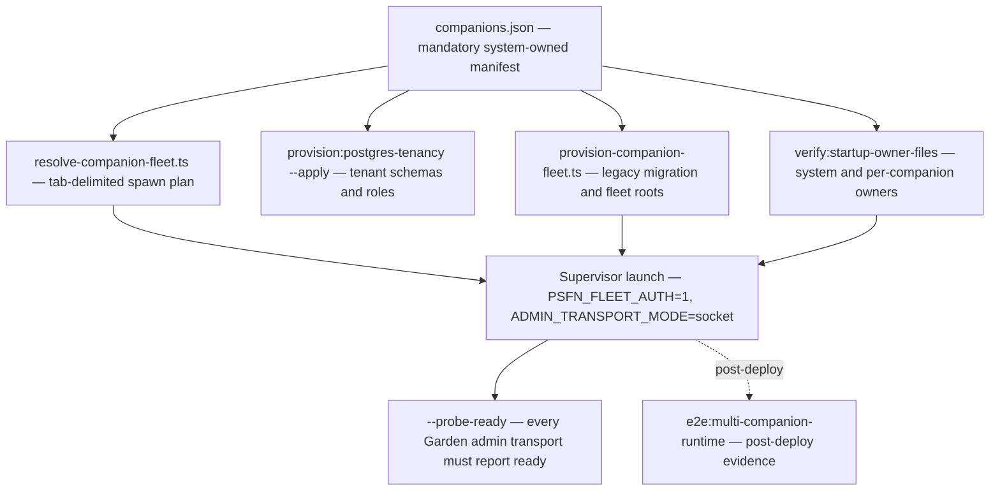
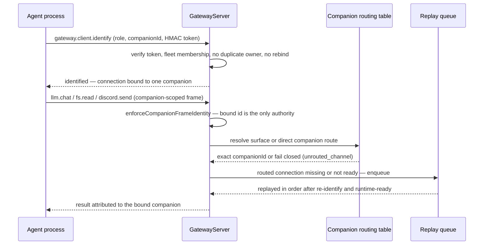

# Multi-Companion Operation

This page is the operator-facing companion to the fleet topology page:
<!-- openwiki: broken internal link [/openwiki/multi-companion.md] file "/openwiki/multi-companion.md" does not exist. Fix the href or restore the target, then delete this comment. -->
[multi-companion.md](/openwiki/multi-companion.md) documents the topology and
isolation model in depth; this page documents what an operator must configure,
provision, launch, and verify to run **one deployment hosting several peer
companion cores**, and the surfaces that validate the running system. The
canonical operations walkthrough lives in
[`docs/multi-companion.md`](../../docs/multi-companion.md); process roles and
the split-runtime shape are in [architecture.md](/openwiki/architecture.md);
the operator plane that administers the cluster is in
[apps/garden.md](/openwiki/apps/garden.md); the Partner authority model that
signs per-companion Garden requests is in
[operator/fleet-auth.md](/openwiki/operator/fleet-auth.md); deployment
lifecycles are in [operations.md](/openwiki/operations.md).

> **Terminology:** Per charter §8.12 (2026-07-20) the multi-companion system is
> a **companion cluster**. "Fleet" persists only in code identifiers
> (`resolveCompanionFleet`, `fleet-auth`, `fleet-garden-*`, `companionFleet` on
> the config) pending a staged engineering rename. Source and tests are
> authority; if prose and code disagree, write the code.

## Operating model

The split runtime is the only supported shape: **one gateway, N isolated agent
processes, one operator process**. Every deployment is a cluster of one or more
peer companions enumerated by the mandatory system-owned `companions.json`
manifest. A peer companion has its own root identity — it is not a shard,
subagent, or satellite — and runs its own Companion Core in its own OS process
behind the one gateway.

Two consequences matter for operations:

- **There is no flag-gated single mode.** Topology is derived from the manifest
  entry count (`multiCompanion = companions.length > 1` in `load-config.ts`).
  A one-entry manifest is the canonical single-companion shape ("a fleet of
  one") that follows the same authenticated, companion-bound gateway path as a
  larger roster. Only peer-to-peer behaviors (shared satellites, fleet-ledger
  aggregation, cross-companion rooms) depend on the manifest having more than
  one entry.
- **The manifest is mandatory.** Missing or invalid `companions.json` refuses
  startup with an actionable error; the seed template is
  `config/companions.seed.json`.

*Operator workflow for a companion cluster: every process path derives from the one validated manifest, provisioning runs before launch, verification gates startup, and the e2e surface produces the post-deploy evidence.*

## The cluster manifest (`companions.json`)

`resolveCompanionFleet` (`src/system/config/companions-config.ts`) is the single
validation authority; the supervisor scripts reuse it rather than duplicating
logic. Every entry (`CompanionFleetEntry`, strict — unknown keys rejected)
carries:

| Field | Operator meaning | Validation |
| --- | --- | --- |
| `companionId` | cluster-wide identity and routing key | lowercase RFC-4122 UUID (`LOWERCASE_RFC4122_COMPANION_ID_PATTERN`) |
| `companionDataDir` | companion data root, relative to the persistence root | relative path, must not escape the root |
| `characterCardPath` | character card, relative to the persistence root | relative path, must not escape the root |
| `postgresSchema` | tenant schema owning this companion's tables | lowercase identifier, ≤63 chars, no `pg_` prefix |
| `postgresRole` | dedicated owner/runtime role for that schema | safe role name, unique, distinct from the shared migration role |
| `postgresDatabaseUrlRef` | launcher-resolved credential reference (kind `env`) | unique across the cluster, never `POSTGRES_DATABASE_URL` |
| `observerEvalSidecar` | optional immutable EmoSim sidecar binding | all-or-none across the cluster; every identity field and persistence root unique and non-overlapping |
| `displayName` / `avatarRef` | optional roster labels | bounded, no control characters, display-only (never a routing key) |

The root `postgres` block owns the dedicated shared-schema migration role and a
gateway-only credential reference for shared DDL — independent of
`fleet-auth.json`.

Cross-entry validation rejects duplicate `companionId`, `postgresSchema`,
`postgresRole`, and credential env names; overlapping `companionDataDir`
entries; a companion role or credential that collides with the shared migration
authority; and partial or reused observer-sidecar identities (an enabled
multi-companion runtime can never fall back to another companion's EmoSim
session, agent, server, or storage root). `gardenPort` per entry is retired —
the one fleet Garden listener is configured with `ADMIN_PORT`.

Path resolution (`resolveCompanionFleetPaths`) resolves every
owner-file-relative path to a canonical absolute strict subpath of the
validated runtime persistence root, following existing symlink ancestors and
rejecting escapes, then derives the installation-owned workspace layout from
the companion UUIDs alone: `workspaces/personal/<companionId>` per companion
and one `workspaces/shared` root. Workspace paths are **not** mutable manifest
fields, and personal roots must not overlap each other, the shared root, or any
protected runtime root (system data, companion data, logs, temp, backups).

## Per-companion data and identity separation

### Runtime identity binding

`load-config.ts` projects the resolved fleet onto the config
(`config.companionFleet`, `config.multiCompanion`, `config.sharedWorkspacePath`)
and, for gateway/agent modes, binds the process to exactly one manifest entry
via `resolveCompanionRuntimeIdentity`:

- `COMPANION_ID` must be present in the manifest.
- `COMPANION_DATA_DIR`, `CHARACTER_CARD_PATH`, and `COMPANION_PG_SCHEMA` must
  match that entry exactly (path values compare canonically).
- Agent mode additionally requires `WORKSPACE_PATH` to resolve to the entry's
  derived Personal Workspace (`requireWorkspaceBinding`); the gateway owns all
  fleet roots and does not impersonate one workspace.
- Any unknown ID or drift refuses startup before persistence or
  character-card loading.

Identity resolution (`src/core/identity/companion-runtime.ts`) is explicit:
`resolveCompanionIdFromConfig` throws without `COMPANION_ID` ("explicit
deployment identity is required before startup"), and the companion name comes
from the character card (or the configured `characterName`) — never from a
silent default.

Agent mode also requires the gateway auth tokens: `GATEWAY_COMPANION_AUTH_TOKEN`
and `GATEWAY_SESSION_INTEGRITY_AUTH_TOKEN` are mandatory env vars at config
load, one per role per companion, both derived from the gateway session HMAC
keyring.

### Per-companion owner files

Whole-file per-companion owners are rooted at `companionDataDir`
(`PER_COMPANION_OWNER_FILES` in `src/system/config/settings-contract.ts`):
`capability-tier.json`, `scheduler.json`, `charge-policy.json`, `skills.json`,
and `partner-affect-shadow.json`. This keeps capability tiers, circadian
cadence, charge budgets, enabled skills, and co-emotion subjects individuated —
one companion can never inherit another companion's policy owner file.

- `verifyStartupOwnerFiles` validates the system owners once and the companion
  owners at the companion root (defaulting to `dataDir` only for the legacy
  shared-root layout).
- `verifyStartupFleetOwnerFiles` validates global owners once, then **every
  exact root from the resolved fleet** — the guard an operator runs against a
  cluster before rollout.
- `seedCompanionStartupOwnerFiles` seeds one new companion root from the
  canonical per-companion registry: existing destinations fail closed, and if a
  copy or validation fails only files created by that invocation are removed.
- `fleet-auth.json` is the **only** optional-when-missing owner file
  (`OPTIONAL_WHEN_MISSING_OWNER_FILES`): absent means fleet auth is disabled,
  and its distributed seed carries a `replace-before-enable` placeholder that
  fails validation until an operator provisions real keys. Every other checked
  owner fails closed on a missing file.

Canonical POSIX modes come from one authority (`owner-file-modes.ts`):
auth-adjacent owners (`fleet-auth.json`) are `0600`, per-companion policy
owners are `0640`, fleet-shared system owners are `0644`. Rollout maintenance
restores the mode after any rewrite, and the mode preflight rejects drift.
`describeStartupOwnerFileChecks` exposes the guard's static check list so
`verify:startup-owner-files` stays in parity — a newly required owner that the
seed script forgets to stage fails loudly instead of masking a seed regression.

### Postgres tenancy: schema-per-companion plus one shared schema

Each agent process pins its runtime persistence to its own provisioned tenant
schema; one extra `shared` schema holds cross-companion world data. The
canonical model-usage ledger is the one narrow cross-schema read exception and
stays owned by the first (primary) companion rather than becoming a second
shared DML schema.

- **Fail-closed pool scoping.** `resolveConfigTenantPoolScope`
  (`src/persistence/postgres/tenant-pool-scope.ts`) refuses to start a
  per-companion pool whenever a fleet manifest is present unless an exact
  `postgresSchema` + `postgresRole` + `companionId` triple matches a manifest
  entry. A pool without the tenant scope silently defaults to the libpq
  `"$user", public` search_path, which is unsafe two ways: an unqualified
  `CREATE` dies at boot (`no schema has been selected to create in`), and — worse —
  an unqualified `READ` would resolve against the primary tenant's `public`
  schema instead of the companion's own data. A one-entry manifest uses the
  exact same schema/role binding as a larger fleet.
- **Pool pinning.** `createPostgresPool(url, { schema, role })` sets
  `options=-c role=<role> -c search_path=<schema>,extensions` at connection
  startup; a role without an explicit schema is refused. Identifiers are
  validated before they reach the connection option, so they cannot smuggle
  SQL. The operator-provisioned `extensions` schema keeps `pgvector` resolvable
  without exposing legacy `public` objects.
- **Provisioning is deployment-time only.** `provisionPostgresTenantAccess`
  (`src/persistence/postgres/tenancy.ts`) is invoked explicitly by
  `npm run provision:postgres-tenancy -- --apply`, never by runtime startup.
  Every mutation runs in one advisory-locked transaction (`0x5053464e` lock
  class): create the `extensions` schema, relocate extensions (e.g. `vector`)
  out of `public`, create the `NOLOGIN` tenant role hardened with
  `NOSUPERUSER NOCREATEDB NOCREATEROLE NOINHERIT NOREPLICATION`, create the
  schema `AUTHORIZATION <role>`, re-own every existing table/view/sequence/
  function/type to the tenant role, `REVOKE ALL ON SCHEMA ... FROM PUBLIC`,
  grant `USAGE, CREATE` on the tenant schema and `USAGE` on `extensions`, apply
  the optional approved-shared-schema read (or `read_write`) grants, grant the
  fleet backup role owner-scoped read access, and grant the tenant role to the
  runtime login role. A failed provision either commits the complete boundary
  or leaves it untouched. The script requires `fleet-auth.json` and resolves
  the backup-restore role from it; re-running it is also the repair path for a
  drifted fleet schema.
- **Startup verifies, never repairs.** The agent persistence runtime
  (`src/persistence/runtime-factory.ts`) runs
  `assertPostgresTenantAccessProvisioned` — schema owner, role existence,
  extension schema, `pgvector` location, and login membership must all match
  the plan exactly — and then `assertSharedSchemaRuntimeAuthority` proves the
  ordinary credential's exact own-schema + shared DML authority and zero
  `fleet_auth` access before opening any store.
- **Cleanup refuses drift.** `dropPostgresTenantAccess` is transactional,
  refuses a schema whose owner drifted or a role with unexpected memberships,
  revokes only provisioning-created grants, and relies on a restrictive
  `DROP ROLE` to reject every unknown dependency class instead of broadening
  cleanup with `DROP OWNED`.
- **Ephemeral shards.** Shard schemas derive deterministically from parent
  companion ID, parent schema, and shard ID — a readable 16-char parent prefix
  plus a 160-bit SHA-256 digest, inside the 63-byte Postgres identifier limit.
- **Fleet ledger pool.** `resolveFleetLedgerPoolScope` pins the fleet-wide
  cost/usage aggregation pool (the ICP admin cost projection) to the canonical
  first companion's ledger schema plus the current runtime role, and only
  exists in multi-companion mode — it fails closed rather than silently opening
  a pool on the default `public` search_path.

## Multi-companion gateway wiring

The gateway builds its routing config with `resolveGatewayMultiCompanionConfig`
(`src/boundary/gateway/multi-companion.ts`) from the canonical resolved config
(`config.companionFleet`) plus `channels.json` and `satellites.json`:

- `fleetCompanionIds` — the manifest-owned identities accepted at the RPC
  authentication boundary;
- `channelRouting` — surface → companionId for `discord`, `telegram`, `api`,
  and plugin surfaces (a one-entry roster routes every surface to its sole
  companion unless a `companionId` field overrides it);
- `discordAccounts` — accountId → companionId (W1-P2 multi-account discord, one
  bot identity per companion; mutually exclusive with `channelRouting.discord`);
- `personalWorkspaceByCompanionId` and `sharedWorkspacePath`.

Routing config is fail-closed at resolution time: `channels.json` companionId
fields, `discord.accounts`, or `satellites.json` sharedDevice declarations on a
one-entry deployment throw instead of being silently ignored; any route that
names a companion absent from `companions.json` throws; and an enabled fleet
with satellites requires `sharedDevice` authority on every satellite.
`resolveGatewaySurfaceForChannelType` maps channel types onto routable surfaces
only for `discord`, `telegram`, `api`, and `multica`; anything else returns
null and callers must fail closed.

*The identify handshake pins a connection to exactly one manifest companion; every later frame and route derives scope from that binding, never from caller-supplied parameters, and deploy-window traffic queues per companion rather than rerouting.*

### Authentication and frame authorization

Agent connections identify once with `gateway.client.identify`. Tokens are
HMAC-SHA256 digests over
`substrate-gateway-companion-auth-v1\0<role>\0<companionId>` derived from the
gateway session HMAC keyring (`deriveCompanionAuthToken`, verified with
`timingSafeEqual`); the `agent` and `internal_session_integrity` roles have
disjoint tokens and disjoint method surfaces. In multi-companion mode a
companionId is required, must be a member of the active fleet, and a duplicate
live owner or a re-identify as a different companion is rejected — the first
connection keeps routing ownership.

Every inbound frame passes `enforceCompanionFrameIdentity`:
unidentified connections may call only `gateway.client.identify`; a frame that
claims a `companionId` different from the connection's bound id is treated as
identity spoofing (audited `gateway.companion.identity_mismatch` + disconnect);
a malformed identity claim disconnects; and the internal session-integrity
methods are denied to normal agents and vice versa. Violations flow through
`alarmCompanionViolation`, which logs, writes a `DENY` audit entry, and pages
the operator via ntfy when configured.

### Surface routing is exact, never a broadcast

`notifyChannelMessage` resolves `discordAccounts[accountId]` when multi-account
discord is active (an inbound discord message without an accountId, or with an
unknown one, throws and audits `gateway.companion.unrouted_discord_account`),
otherwise `channelRouting[surface]`. An unrouted surface throws and audits
`gateway.companion.unrouted_channel`. `requestAgent` routes to the `api`
surface's companion rather than the first ready agent; `api.stream.delta`
frames are dropped unless the sending connection is the request-bound api
companion.

### Deploy-window replay

When the routed companion's connection is missing or not ready,
`GatewayInboundChannelReplay` queues the notification. Queues are isolated per
authenticated companion route so one offline companion cannot consume a
sibling's budget, bounded at 100 messages per companion (overflow drops the
oldest and pages operator sinks), and replayed in order only after the
replacement connection re-identifies **and** declares runtime ready (or
recovers from a stale healthcheck). Queued traffic is never rerouted to another
agent.

### Construction-time requirements

A fleet-enabled `GatewayServer` refuses to construct without: one resolved
Personal Workspace per fleet companion; companion-owned text and vision intake
screening providers matching the configured screening mode for **every** fleet
companion (singleton screening services are rejected); and, when
`discord.accounts` routing is active, an outbound dock per routed companion.
Capability tiers are per-companion: `GatewayCapabilityTierResolver` owns one
`CapabilityRuntime` per companion rooted at that companion's data dir, so
shard-backend admission, approval auto-clear, and LLM eligibility resolve
against the authenticated companion's own `capability-tier.json` and fail
closed (throw) when the identity is absent — never a silent fallback to the
gateway-root tier.

## Supervisor launch plan and provisioning

The repository emits a validated cluster plan for an external process
supervisor (`npm run resolve:companion-fleet`): one tab-delimited line per
companion in the fixed order `companionId, companionDataDir, characterCardPath,
postgresSchema, personalWorkspacePath, companionAuthToken,
sessionIntegrityAuthToken, databaseUrl, adminTransportSocket`. Tabs or newlines
inside any field are rejected fail-closed so the launcher can parse the plan
with a plain `IFS=$'\t'` read. The plan reuses the canonical
`resolveCompanionFleet` and `resolveCompanionDatabaseTopology` — deliberately
no duplicate path-resolution or validation logic. A `--probe-ready` mode probes
every fleet Garden admin transport through `FleetGardenAdminTransportProxy` and
fails unless all targets report ready.

Database topology fan-out (`resolveCompanionDatabaseTopology`) requires: each
per-companion credential authenticates as the manifest role; every authority
(shared migration plus every companion) gets a distinct credential; all must
target the same exact database; and the gateway `POSTGRES_DATABASE_URL` must
exactly match the primary/canonical companion credential.

`npm run provision:companion-fleet` runs before any process starts: it migrates
a legacy `WORKSPACE_PATH` into exactly one companion's Personal Workspace, then
provisions every fleet root: each personal workspace receives the personal
files layout and the versioned Companion Library seed bundle
(`docs/companion-library/`, no-overwrite copies verified against a checked-in
manifest), and the Shared Companion Workspace is created with its strict policy
file (`read_only` companion access, `operator_reviewed_only` writes,
independent reviewer and cogsec approval required).

Assigning a legacy `WORKSPACE_PATH` to one companion requires explicit operator
approval: `PSFN_LEGACY_WORKSPACE_COMPANION_ID` plus
`PSFN_LEGACY_WORKSPACE_SHA256` (the exact SHA-256 tree digest of
path-and-content entries printed by the check). The migration rejects symlinks
and non-file entries, copies with no overwrite to a staging directory, verifies
the staged tree digest, renames into the destination (which must not exist —
there is no merge), and writes an integrity receipt under
`workspaces/.migration/` while retaining the source. Receipts are re-verified
on later runs, and a digest change or a receipt/identity conflict aborts rather
than best-effort migrating.

Local supervisor startup requires `PSFN_FLEET_AUTH=1` and
`ADMIN_TRANSPORT_MODE=socket`: the fleet Garden target registry derives one
`garden-admin-<companionId>.sock` endpoint per agent from the validated
companion ID alone, and network admin-transport mode is rejected fail-closed.
The `FleetGardenTargetRegistry` itself is immutable — companionId, exact
endpoint, and expected agent audience (`agent:<companionId>`) are frozen at
construction, construction fails on empty/duplicate/colliding entries, and only
the separate health map mutates (`reportHealth`), so no health transition can
ever rewrite where a companion's requests go.

## Runtime validation surfaces

Two families of surfaces prove a cluster is correctly wired:

**`npm run e2e:multi-companion-runtime`** runs
`src/app/e2e/multi-companion-runtime-validation.ts`, the principal end-to-end
certification. It starts a real in-process `GatewayServer` on a Unix socket,
forks one agent process per companion (each a real `SubstrateAgent` runtime
connecting through the gateway with derived auth tokens), and provisions a
disposable Postgres harness with per-companion tenant schemas and roles. It
asserts every agent reports `runtimeClass: SubstrateAgent` and
`multiCompanion: true`, and that the gateway identified exactly two agents.
The scenario proofs are:

- **Colliding-route crossover isolation** — identical request ids dispatched
  concurrently to the `api` surface (companion A) and the `telegram` surface
  (companion B) must complete on exactly the routed companion with **zero**
  peer leakage across channel entries, memories, summaries, and turn records,
  and zero gateway crossover alarms.
- **Companion-room exchange** — a companion-to-companion weighted-thought
  exchange charges both companions' fatigue ledgers to `exhausted` and their
  run-charge lanes, the exchange stops by suppression with provably zero
  overcharge, and turns, channel state, and fatigue amounts survive a full
  agent restart.
- **Fatigue closeout reserve** — under the `final_reserve` profile a finalized
  `decision='overcharge'` row in `shared.icp_fatigue_turn_reservations` proves
  the continuation-evidence-gated closeout reserve fired through the real
  production regulation code (no stubs).
- **Flag-off parity** — a single-companion autonomy-disabled fixture must
  report `multiCompanion: false` with runtime class unchanged, fail autonomy
  closed, dispatch no model requests, and tear down cleanly (processes exited,
  gateway socket removed).

The driver emits a JSON evidence record (`schemaVersion: 1`, `coverageCaseIds`,
a topology snapshot with per-companion data-root identities, per-scenario
evidence, and a teardown verdict) and exits non-zero with an error code on any
invariant failure. The `--probe-ready` launcher mode and the
`FleetGardenAdminTransportProxy` readiness gate are the pre-launch counterpart.

**Owner-file guards** — `npm run verify:startup-owner-files` (and the
`preflight:startup-owner-files` / `preflight:owner-file-modes` scripts) validate
that every system owner and every exact fleet companion root carries the
required owner files, seeds, and canonical modes before rollout.

## Invariants and failure modes

- **Manifest mandatory.** Missing or invalid `companions.json` refuses startup;
  there is no flag-gated single mode. A one-entry roster is a fleet of one.
- **Identity is explicit and unique.** Lowercase RFC-4122 UUIDs only; the
  connection binding is immutable; duplicate live owners, rebinds, and
  cross-companion frame claims are rejected and alarmed.
- **No silent fallback.** Ambiguity — an unrouted surface, an unknown account,
  a missing companion credential, a missing tenant scope, an absent capability
  tier — throws or denies; it never broadcasts, reroutes to a first-ready agent,
  or defaults to `public`.
- **Startup verifies, deployment provisions.** Tenant boundaries, shared grants,
  and ledger authority are provisioned explicitly (advisory-locked, idempotent,
  re-runnable as the repair path) and only verified at runtime.
- **Tenancy is reciprocal.** Each companion's credential has exact own-schema +
  shared DML authority and zero `fleet_auth` access; cross-schema grants reach
  only dedicated gateway roles (backup, welfare verifier), never companion
  runtime logins.

## Focused tests

`src/boundary/gateway/server.multi-companion.test.ts` is the principal gateway
spec: it covers `resolveGatewayMultiCompanionConfig` fail-closed resolution
(single-companion routing declarations, absent-from-fleet routes, satellite
sharedDevice authority), identify semantics (missing/unknown/invalid tokens,
role-bound tokens, duplicate and rebind rejection, posture attribution and
spoof rejection), exact surface routing (discord/telegram/api/multica, shared
satellite voice lease fallback), the bounded replay queue and its
healthcheck-stale recovery, per-connection cancellation and `api.stream.delta`
scoping, Personal-Workspace confinement and managed-skills protection,
confirmation owner scoping, the read-only shared workspace surface,
multi-account discord docks and outbound routing, per-companion capability
tiers, and crossover isolation under concurrent load. Tenancy behavior is
covered by `src/persistence/postgres/tenant-pool-scope.test.ts` and the
integration coverage in
`src/persistence/postgres/named-tenant-store-boot.integration.test.ts`;
supervisor-plan behavior by `scripts/companion-fleet-runtime.test.ts` (complete
immutable registry derivation from canonical IDs, `garden-admin-<companionId>.sock`
naming, and fail-closed rejection of local network transport or missing fleet
auth before any launch plan).

## Related pages

<!-- openwiki: broken internal link [/openwiki/multi-companion.md] file "/openwiki/multi-companion.md" does not exist. Fix the href or restore the target, then delete this comment. -->
- [multi-companion.md](/openwiki/multi-companion.md) — fleet topology and the
  full per-companion isolation surface catalogue
- [apps/garden.md](/openwiki/apps/garden.md) — the operator plane, admission,
  and the fleet target registry
- [operator/fleet-auth.md](/openwiki/operator/fleet-auth.md) — per-companion
  human authorization and signed request capabilities
- [architecture.md](/openwiki/architecture.md) — split runtime process roles
  and the gateway↔agent RPC contract
- [operations.md](/openwiki/operations.md) — deployment lifecycles and what
  survives every lifecycle operation
- [`docs/multi-companion.md`](../../docs/multi-companion.md) — canonical
  operations walkthrough for the cluster
