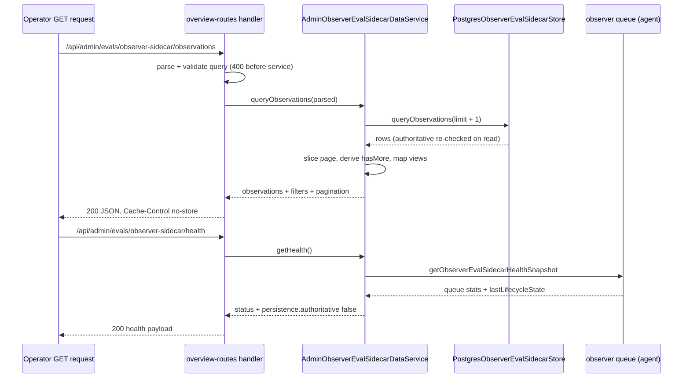
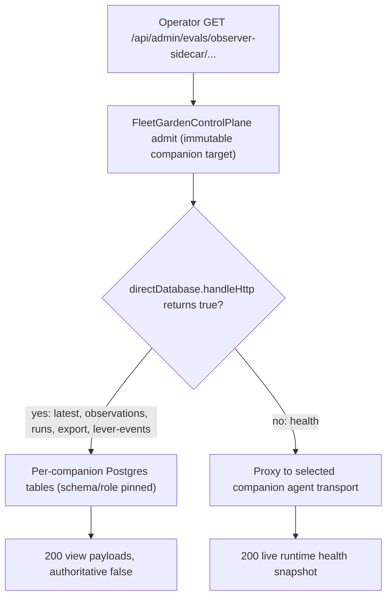

# Observer Eval Sidecar — Garden Operator Surface

The observer eval sidecar is a **disabled-by-default, eval-owned, strictly
non-authoritative** telemetry surface. On each real turn it snapshots a
privacy-sanitized copy of the companion's live PSFN `EmotionState`, projects it
into an `emo_sim` appraisal stimulus, runs it against a long-lived `emo_sim`
server, crosswalks the two emotion representations, computes divergence
metrics, and persists everything to eval-owned Postgres rows. **The Garden
admin plane is the only reader of that persistence**: the operator surface is a
set of GET-only routes under `/api/admin/evals/observer-sidecar/*` served by
`AdminObserverEvalSidecarDataService`, plus a runtime health snapshot of the
per-agent observer queue.

This page covers the operator-facing slice: the Garden admin surface, fleet
(multi-companion) dispatch, the startup netpol-race handling, and how
operator-run evaluations observe live runtime behavior without mutating
production state. The full per-turn pipeline (privacy gate, projection, emo_sim
adapter, crosswalk, metrics, shadow levers, and the one `would_message`
felt-impulse handoff) is documented on
<!-- openwiki: broken internal link [/openwiki/observer-eval-sidecar.md] file "/openwiki/observer-eval-sidecar.md" does not exist. Fix the href or restore the target, then delete this comment. -->
[observer-eval-sidecar.md](/openwiki/observer-eval-sidecar.md).

## The operator evaluation surface

All six routes are GET-only, declared in
`src/operator/garden/routes/overview-routes.ts`, and every success response
uses `ADMIN_DYNAMIC_JSON_HEADERS` (`Cache-Control: no-store`):

| Path | Returns |
| --- | --- |
| `…/health` | Runtime queue/health snapshot + lifecycle state + `persistence.authoritative: false`; always 200 when the route exists. |
| `…/latest` | The single most-recent observation (`limit` is stripped from the query). |
| `…/observations` | Paginated observations (`observations`, `filters`, `pagination`). |
| `…/runs` | Paginated run records. |
| `…/export` | `{ exportVersion: 'garden.observer-eval-sidecar.export.v1', generatedAtMs, redacted: true, filters, observations }`. |
| `…/lever-events` | Paginated shadow-lever WOULD-ACT events (the only lever-event reader). |

Query parameters are validated **before** the service is called:
`parseObserverEvalObservationQuery`, `parseObserverEvalRunQuery`, and
`parseObserverEvalLeverEventQuery` accept `runId`, `evalSessionId`,
`scenarioId`, `testRunId`, `turnId`, `privacyClass`, `status`, `lever`,
`minDivergenceScore`, `sinceMs`, `untilMs`, and `limit`, each whitelisted to
its canonical enum (`OBSERVER_EVAL_PRIVACY_CLASSES`,
`OBSERVER_EVAL_OBSERVATION_STATUSES`, `OBSERVER_EVAL_LEVER_NAMES`,
`OBSERVER_EVAL_RUN_STATUSES`). An invalid value — for example
`?privacyClass=raw` — returns 400 *without* calling the service.

Unavailability is mapped fail-closed: a missing service returns 503
`Observer eval sidecar backend unavailable`; a service whose persistence port is
absent throws `ObserverEvalSidecarApiUnavailableError`, which the route handler
maps to 503 (`isObserverEvalSidecarApiUnavailableError`); any other failure is
a sanitized 500. A disabled sidecar therefore reports `status: 'disabled'` on
health (200, because health is runtime-backed) while the telemetry routes
return 503 (`server.test.ts` "reports disabled observer sidecar health when
persistence is unavailable").


*Every observer telemetry read flows through the admin service into the
Postgres store; the health route additionally reads the live runtime queue
snapshot, so health works even when persistence is unavailable.*

## The admin service layer

`AdminObserverEvalSidecarDataService`
(`src/operator/garden/services/observer-eval-sidecar-service.ts`) implements
`AdminObserverEvalSidecarService` and is the **only reader** of sidecar
persistence. It owns:

- **Pagination by overfetch.** `queryObservations`, `queryRuns`, and
  `queryLeverEvents` ask the store for `limit + 1` rows, slice to `limit`, and
  set `hasMore` from the probe row. Page `limit` defaults to 100 and is capped
  at `MAX_PAGE_LIMIT = 1_000`; the store's own `MAX_QUERY_LIMIT` is `1_001`
  ("one above the Garden admin page cap ... so the service's hasMore probe row
  (limit + 1) is never clamped away at the maximum page size").
- **View projection.** `toObservationView`, `toRunView`, `toLeverEventView`,
  `toProjectionView`, and `toEmoSimView` deep-clone the persisted sanitized
  payload (which already carries `redactedIdentifiers` — `requestId`,
  `sourceMessageId`, `channelId`, `emotionSessionId` are dropped at sanitize
  time), re-derive the comparison summary from persisted
  crosswalk/projection/privacy via `createObserverEvalComparisonSummary`, and
  re-assert `authoritative: false` plus the
  `OBSERVER_EVAL_SIDECAR_NON_AUTHORITATIVE_NOTICE` on every view. The emo_sim
  view surfaces the afterTick dominant emotion, valence/arousal mood, and the
  top 8 positive-intensity emotions.
- **Export.** `exportObservations` wraps the observation list in
  `exportVersion: 'garden.observer-eval-sidecar.export.v1'`,
  `generatedAtMs`, and `redacted: true` — the export is a projection of the
  same sanitized views, never raw rows.
- **Fail-closed persistence access.** `requirePersistence` /
  `requireLeverPersistence` throw `ObserverEvalSidecarApiUnavailableError`
  when the port is absent; the store implements both the observation port and
  the lever port, so one Postgres store backs both route families.

## Wiring and tenant scoping

`createObserverEvalSidecarAdminService` (`src/operator/garden/local-admin-contract.ts`)
builds the service for a Garden surface:

```ts
const persistence = settings.persistence.enabled
  && settings.garden.exposeTelemetry
  && input.config.persistenceBackend === 'postgres'
  && postgresDatabaseUrl
  ? createPostgresObserverEvalSidecarStore(postgresDatabaseUrl, {}, input.tenant)
  : null;
```

So the persistence-backed telemetry surface exists only when the sidecar
persistence is enabled **and** `garden.exposeTelemetry` is true **and** the
runtime is on the Postgres backend **and** an explicit database URL is present.
When persistence is null the telemetry routes 503 while `getHealth` still
reports the runtime snapshot (and `persistence.available: false`).

Both construction sites pass a `TenantPoolScope`:

- The agent's in-process Garden (`createInProcessGardenAdminContract`) pins
  `resolveConfigTenantPoolScope(options.config)` because "the agent process:
  this Garden serves exactly one companion, so its sidecar pool must stay
  inside that companion's tenant boundary".
- The fleet Garden (`createFleetGardenDirectDatabaseServices`) pins the
  selected companion's exact schema/role ("an unscoped pool would resolve
  against the primary/public tenant").

## Fleet (multi-companion) dispatch

In fleet mode the operator surface splits the six routes by data source:

- **Direct database.** `FleetGardenDirectDatabase`
  (`src/operator/garden/fleet-garden-direct-database.ts`) serves
  `latest`, `observations`, `runs`, `export`, and `lever-events` from
  per-companion Postgres tables. Its constructor builds one route table per
  companion from `buildAdminOverviewRoutes` with services constructed for
  exactly that companion (`createFleetGardenDirectDatabaseServices`),
  filtering to `DIRECT_DATABASE_ROUTE_PATHS`, and `handleHttp` dispatches only
  when the admitted immutable target's canonical path is in that list.
  `FleetGardenOperatorRouter` calls `directDatabase.handleHttp` before any
  proxy fallback, so these reads never traverse the agent transport.
- **Health stays runtime-backed.** The comment in
  `fleet-garden-direct-database.ts` is explicit: "Health is runtime-backed, not
  persistence-backed, and stays on the selected companion agent so it reports
  that agent's live sidecar state." `handleHttp` returns `false` for the health
  path (asserted by `operator-surface.fleet-routing.test.ts`), so the router's
  remaining path proxies it to the admitted companion's admin transport with an
  exchanged child capability.


*Fleet dispatch: the five telemetry routes read companion-bound tables directly;
health is proxied to the companion agent so it reports live queue state.*

Multi-companion enablement is fail-closed. `bindCompanionObserverEvalSidecar`
(`src/system/config/observer-eval-sidecar-config.ts`) requires an exact
`companionRuntimeIdentity.observerEvalSidecar` binding (sidecarId, adapter
`serverUrl`/`sessionLabel`/`agentName`, persistence `rootDir`) on the
companion's immutable fleet tuple, and refuses a missing, mismatched, or
shared/primary fallback binding before runtime composition. The fleet Garden
refuses to construct when an enabled sidecar lacks those bindings
(`operator-surface.fleet-routing.test.ts` "refuses enabled fleet emotion
telemetry without companion-owned sidecar bindings").

## Observing without mutating production state

The load-bearing invariant is that nothing the sidecar or Garden reads is
authoritative or steerable. It is enforced at four layers:

- **Mode.** `observerEvalSidecar.mode` is validated to `observe_only` at
  startup; "observer sidecars are not allowed to steer runtime behavior".
- **Database.** Every sidecar table — `observer_eval_sidecar_runs`,
  `observer_eval_sidecar_observations`, `observer_eval_sidecar_lever_events`,
  `observer_eval_sidecar_lever_state` — carries
  `authoritative BOOLEAN NOT NULL DEFAULT FALSE` with
  `CHECK (authoritative = FALSE)` and
  `eval_owner TEXT NOT NULL DEFAULT 'observer_sidecar_eval'` with
  `CHECK (eval_owner = 'observer_sidecar_eval')`
  (`POSTGRES_OBSERVER_EVAL_SIDECAR_MIGRATIONS`). The read path re-checks every
  row through `assertNonAuthoritativeRow`, which throws
  `${table} row violated observer sidecar non-authoritative boundary` on
  anything else.
- **Contracts.** Every record type
  (`ObserverEvalSidecarRunRecord`, `ObserverEvalSidecarObservationRecord`,
  `ObserverEvalSidecarLeverEventRecord`) carries the literal type
  `authoritative: false` plus the
  `OBSERVER_EVAL_SIDECAR_NON_AUTHORITATIVE_NOTICE`: "Observer sidecar
  persistence is eval-owned telemetry only; it is not companion memory,
  production EmotionState, InternalState, prompt state, contacts, or
  concerns."
- **Surface.** The Garden surface is read-only GETs; every admin view
  re-asserts `authoritative: false` and re-serializes only the sanitized
  payload. There are no mutation endpoints and no write path out of Garden.
  The static lever-boundary test additionally bans `src/core/agent`,
  `src/core/scheduler`, and `src/core/tools` from importing lever code, so the
  live companion loop cannot reach the shadow-lever module.

Observation itself never blocks the admitted turn: `dispatchObserverEvalTurn`
enqueues a deep-frozen input and resolves a lifecycle state immediately, and
the queue is bounded (`maxQueuedTurns: 32`, `drop_newest`). `observeTurn`
propagates an error to the queue only when persistence is unavailable or the
error is non-recoverable (`shouldPropagateObserverEvalObservationError`);
with persistence available, recoverable failures — privacy-stopped projection,
unreachable emo_sim server — are recorded on the persisted row
(`status: 'error' | 'degraded'`) and the turn continues.

## Health snapshot

`getObserverEvalSidecarHealthSnapshot` (`runtime.ts`) resolves each runtime to
its queue (a `WeakMap`-keyed singleton per runtime) and returns the queue's
health snapshot; with no queue it falls back to `createStaticHealthSnapshot`,
which derives status purely from config/observer presence (`disabled` when not
enabled, `unavailable` when the observer is absent, `enabled` otherwise) with
zeroed counts. The snapshot includes `enabled`, `available`, `accepting`, queue
depth/running/max/overflow policy/shutting-down, per-reason `dropCounts` and
`failureCounts`, `lastDrop`/`lastFailure` (turn id, request id, sanitized
message), and `lastLifecycleState`. The admin health payload wraps this as
`{ status, observedAt, runtime, persistence: { available, evalOwned,
authoritative: false }, latestLifecycleState? }`, with status `unavailable`
when no runtime snapshot exists.

Lifecycle states (`disabled | enabled | degraded | unavailable`) flow from the
queue into the runtime's `onLifecycleState` hook; a failing hook increments
`lifecycleHookFailed` instead of breaking the pipeline. Error text escaping
the queue is sanitized to `'Observer eval sidecar error redacted'`, and
lifecycle `reason` values are whitelist-redacted.

## Startup and failure semantics (netpol race)

At pod start a kube-router netpol-programming race leaves a ~1 s window where
the Postgres endpoint refuses connections
(`psfn-framework-qicb.3` Garden-side, `qicb.4` agent-side). The sidecar store
starts its schema-ensure readiness promise **in its constructor**
(`startPostgresStoreReadiness('observer_eval_sidecar', …)` in
`PostgresObserverEvalSidecarStore`), and both construction sites — the agent's
`createObserverEvalSidecarRuntimeFromConfig` and Garden's
`createObserverEvalSidecarAdminService` — observe that readiness so a refused
pool produces **zero `unhandledRejection`**. The failure surfaces as durable
optional-store degradation, not a process crash:

- `src/core/eval/observer-sidecar/startup-race.test.ts` constructs the
  agent-process runtime against a loopback URL with no listener (immediate
  `ECONNREFUSED`) and asserts the `unhandledRejection` detector captures
  nothing; a fresh random port per call also keeps the store out of the
  databaseUrl-keyed memo.
- `src/operator/garden/observer-eval-sidecar-startup-race.test.ts` does the
  same for `createObserverEvalSidecarAdminService`, and confirms the
  persistence-disabled path stays untouched (no pool, no rejection).

Every store call awaits the observed readiness handle, so a startup Postgres
blip becomes a deferred, handled failure. Stores are memoized by
`databaseUrl + tenant schema` (`memoKey = databaseUrl \x00 schema`), so
distinct companion scopes sharing one database URL never resolve to the same
pooled store while every caller inside one companion process shares a single
instance; the pool pins `application_name = 'psfn-observer-eval-sidecar'` and
the tenant schema/role.

Run lifecycle is per-process: one run
(`runId = observer-eval-sidecar-{sidecarId}-{pid}-{startedAtMs}`, status
`running`, deployment from `deploymentTarget`) is upserted on the first
observation; observations are keyed
`{runId}:{normalizedTurnId}:{observedAtMs}`. `pruneExpiredRetention` runs after
each observation write, deleting expired observations and runs with no
remaining observations or lever events.

## Operator configuration and operations

Settings live under `observerEvalSidecar` in `settings.json` (defaults
`createDefaultObserverEvalSidecarSettings()`,
`src/system/config/runtime-config-contracts.ts`). The sidecar is **disabled by
default** (`enabled: false`, `adapter.kind: 'disabled'`,
`persistence.enabled: false`, `deploymentTarget: 'test_persona'`,
`mode: 'observe_only'`). Operator-relevant keys:

| Key | Default | Notes |
| --- | --- | --- |
| `garden.exposeHealth` | `true` | Health route exposure. |
| `garden.exposeTelemetry` | `true` | Gates the persistence-backed admin service wiring. |
| `persistence.enabled` | `false` | Requires `persistenceBackend: 'postgres'` and an explicit PostgreSQL URL; `retentionDays: 14`, `maxStoredObservations: 10000`. |
| `levers.enabled` | `false` | Requires `persistence.enabled` (lever events are persistence-only telemetry). |
| `deploymentTarget` | `'test_persona'` | Corpus label; drives the DB `deployment` value (`live | eval | test`). |

`validateObserverEvalSidecarStartupConfig`
(`src/system/config/observer-eval-sidecar-config.ts`) fails closed at startup:
`mode` must be `observe_only`; `adapter.kind` must not be `disabled` while the
sidecar is enabled; `kind: 'emosim_server'` requires an absolute `http(s)`
`serverUrl` plus non-empty `sessionLabel` and `agentName`; `levers.enabled`
requires `persistence.enabled`; and `persistence.rootDir` must not overlap any
authoritative runtime root (system-data, companion-data, workspace, logs,
temp, backups). The operator runbook for the emo_sim build pin, read cadence,
and calibration suites is cross-referenced from
<!-- openwiki: broken internal link [/openwiki/garden-control-plane.md] file "/openwiki/garden-control-plane.md" does not exist. Fix the href or restore the target, then delete this comment. -->
[garden-control-plane.md](/openwiki/garden-control-plane.md) and
[development-status.md](/openwiki/development-status.md).

## Tests that matter

- `api-routes-observer-eval-sidecar.test.ts` — route matching, `no-store`
  health, filter pass-through, 400 on invalid `privacyClass` before the
  service is called, `latest`/`export` shapes, and 503 when the service or
  persistence is absent.
- `services/observer-eval-sidecar-service.test.ts` — sanitized serialization
  (no raw identifiers in JSON), unavailable health, redacted export,
  `hasMore` true/false via `limit + 1` overfetch across observations, runs,
  and lever events.
- `observer-eval-sidecar-startup-race.test.ts` (Garden) and
  `startup-race.test.ts` (agent) — refused-pool construction with zero
  `unhandledRejection`.
- `operator-surface.fleet-routing.test.ts` — direct-database dispatch binds
  the admitted companion's schema/role, health is not a direct-database route,
  and enabled fleet telemetry without exact companion bindings refuses
  construction.
- `server.test.ts` — disabled sidecar health (200, `status: 'disabled'`,
  `persistence.available: false`) and 503 telemetry through the real server.

## Related pages

<!-- openwiki: broken internal link [/openwiki/observer-eval-sidecar.md] file "/openwiki/observer-eval-sidecar.md" does not exist. Fix the href or restore the target, then delete this comment. -->
- [observer-eval-sidecar.md](/openwiki/observer-eval-sidecar.md) — the full
  per-turn pipeline (privacy, projection, emo_sim adapter, crosswalk, metrics,
  shadow levers, felt-impulse handoff).
- [apps/garden.md](/openwiki/apps/garden.md) — the Garden operator plane that
  hosts the `/api/admin/evals/observer-sidecar/*` surface and the
  `FleetGardenOperatorRouter` dispatch order.
<!-- openwiki: broken internal link [/openwiki/garden-control-plane.md] file "/openwiki/garden-control-plane.md" does not exist. Fix the href or restore the target, then delete this comment. -->
- [garden-control-plane.md](/openwiki/garden-control-plane.md) — the operator
  control plane and operations runbook.
- [self-eval-prompt-audit.md](/openwiki/process/self-eval-prompt-audit.md) —
  the eval-owned, non-authoritative audit lineage the sidecar telemetry
  belongs to.
- [development-status.md](/openwiki/development-status.md) — what is true in
  source today.
