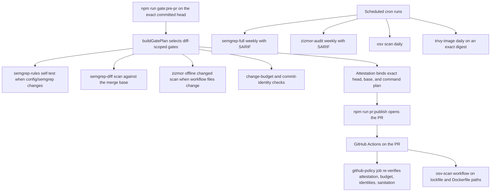

# Adversarial Review

The governing lesson of this repo's review practice comes from Bun's Rust rewrite
post: stop fixing the same bug class by hand. When a bug class recurs, improve
the feedback loop that allowed it — add a regression test, a verification
script, a lint/typecheck/dependency-cycle/hygiene gate, or a tracked baseline —
instead of re-fixing the instance. This page covers the adversarial review
practices, the fail-closed scanner tooling that enforces them, the baseline debt
gates, and how a bugfix is proven rather than asserted. The companion page
[internal-review.md](/openwiki/process/internal-review.md) documents the
pre-PR gate pipeline, attestation, publication flow, and PR policy that this
tooling feeds into.

## When adversarial review applies

A separate adversarial review is used when the assembled change carries an
actual trust boundary or complexity risk that focused validation cannot cheaply
cover. Risk signals include gateway policy and capability checks, runtime
startup and process supervision, owner-file and settings contracts,
trust/privacy/prompt-assembly surfaces, migrations and repair scripts, and
cross-cutting integration seams with a concrete failure mode. Priority, branch
size, or ordinary implementation judgement alone never require a reviewer;
small cosmetic and low-risk docs changes usually do not.

Review frequency is bounded by the same discipline: review an assembled PR
train at most once, and only when its actual trust boundaries or complexity
justify review. Never review the same code again at every bead, epic, and
train boundary, and never add a reviewer, extra agents, broad tests, or a
separate PR merely because a tracker priority is high.

## Review shape

Adversarial review means a separate reviewer tries to prove the change wrong.
The reviewer receives the bead or request, the commit range, the relevant files
and contracts, and the tests and validation output — never the implementer's
justification, a list of expected findings, or hints about the suspicious part.
Findings lead the review output; each finding carries severity, file and line,
the concrete failure mode, why existing tests would miss it, and the regression
test or gate that should catch it next time.

Blocking findings are limited to P0/P1 partner-data security/privacy/isolation,
companion welfare/consent/autonomy, real data or secret loss, a broken core
acceptance path, or a mandatory gate; everything else is nonblocking and
triggers no fixes.

## How bugfixes are proven rather than asserted

Bugfixes are closed by regression evidence, not by explanation. The default
sequence for a real bug is:

1. Reproduce the bug or describe the missing guard precisely.
2. Add the smallest failing regression test or verification-script change.
3. Implement the fix.
4. Run the targeted test or script.
5. Run `npm run lint:changed -- --base <fixed-point>` for tracked code changes;
   let the final pre-PR gate select full lint when the changed scope requires it.
6. Record the validation evidence in the bead close reason or handoff.

When a regression test is not practical, the fix must explain why and add the
nearest deterministic gate, smoke assertion, script check, or operator-visible
validation step instead. In internal review, the implementer reproduces any
alleged blocker and fixes accepted findings once; the focused regression is the
closure proof, and a second reviewer requires an explicit operator request or a
single concrete high-impact claim that remains materially ambiguous.

Reviewers reject fixes that rely on placeholder implementations or fake success
paths, silent fallback from canonical owner files to env/defaults/legacy paths,
swallowed errors or catch blocks that only log, capability checks that default
to allow, policy/URL/channel classification that accepts unknown values,
skipped or weakened tests without a stronger replacement, `as any` or unsafe
casts where shared guards exist, long comments that justify a workaround instead
of code that enforces the invariant, and new parallel abstractions that bypass
existing contracts. The working rule: if the code needs a paragraph to explain
why a fragile workaround is acceptable, assume the implementation is wrong and
ask for a stronger invariant.

When an agent or human makes the same kind of mistake twice, fix the process,
not just the instance: add a regression test for the exact failure, extend a
verification script, add an ESLint/TypeScript/dependency-cycle/hygiene check,
name the invariant in a bead acceptance criterion, or add a short AGENTS.md rule.
Broad planning documents for transient issues are explicitly not process repair.

## The fail-closed scanner contract

All four scanners share one contract, implemented by the wrappers in
`scripts/ci/`:

- **Immutable toolchains.** Every scanner runs from an OCI image pinned by
  digest, never a floating tag or Action: `semgrep/semgrep:1.170.0@sha256:f42392ee…`,
  `ghcr.io/google/osv-scanner@sha256:bcb04b6b…` (2.4.0),
  `ghcr.io/aquasecurity/trivy@sha256:c6e969c5…` (0.72.0),
  `ghcr.io/zizmorcore/zizmor@sha256:d55c5d99…` (1.27.0), and
  `rhysd/actionlint@sha256:b1934ee5…`.
- **Runtime version probe.** Before any scan, the wrapper runs the pinned image
  with `--version` and asserts the exact expected version with a whole-token
  regex (so `2.4.0` never satisfies `2.4.01`). Version drift or a failed probe
  fails closed before a single scan runs.
- **Exit codes are the contract.** 0 = clean; any nonzero result (findings or
  load/resolve/network failure) fails the gate. Missing or unexpected inputs are
  loud errors, never silent skips or silently narrowed scans.
- **Least privilege.** OSV and Trivy need no token; the zizmor audit passes only
  the default read-only GitHub token; Trivy never mounts the Docker socket.

## Semgrep: the blocking security scanner

Semgrep is the blocking security scanner in the local gate. The committed rule
sets under `config/semgrep/` are the authority:

- `psfn-security.yml` — dynamic code execution (`eval`, `new Function`),
  `shell: true`, non-literal `exec`/`execSync`, disabled TLS verification
  (`rejectUnauthorized: false`, `NODE_TLS_REJECT_UNAUTHORIZED=0`), React
  `dangerouslySetInnerHTML`, and Svelte `{@html}`. Each rule carries narrow,
  commented path exemptions (for example the legacy GitOps adapter in
  `src/boundary/integrations/git/ops.ts`, the mTLS API server, and the PQC probe
  script) so that new matches still fail while reviewed legacy seams stay
  exempt.
- `psfn-charter.yml` — correctness and charter-law rules such as empty catch
  blocks (matched on source text, not the AST, because an explanatory comment
  distinguishes a reviewed fallback from a silent catch), Core reading
  credentials directly from `process.env`, and Core importing `node:child_process`.
  Rules carry `charter_law` metadata tying them to
  `docs/PSFN_PROJECT_CHARTER.md` sections.

The rule fixtures (`psfn-security.ts/.tsx/.svelte`, `psfn-charter.ts`) carry
`// ruleid:` / `// ok:` annotations, and `semgrep test config/semgrep`
self-tests the rules against them. `scripts/ci/run-semgrep.sh` supports three
modes: `test` (rule self-test), `full` (scans `src scripts admin-ui/src
companion-ui/src` with `--error` and `--metrics=off`, excluding `**/*.test.*`,
`**/*.spec.*`, `src/test-support/**`, and `src/app/e2e/**`), and `diff` (the
same scan narrowed with `--baseline-commit`).

Enforcement points: the local gate always plans a `semgrep-diff` scan against
the merge base, and plans the `semgrep-rules` self-test when `config/semgrep/`
changes (the wrapper and lockfile are part of the self-test's content-manifest
inputs, so a wrapper change invalidates stage reuse; a clean-main canary always
runs the self-test). The weekly `semgrep-full.yml` workflow runs the rule
self-test first, then the full repository scan with `--error`, and retains the
SARIF as a 30-day artifact; `SEMGREP_SARIF_OUTPUT` switches the wrapper into
SARIF-emitting mode.

## Zizmor and actionlint: workflow security

`scripts/ci/run-zizmor-changed.mjs` owns exactly the set
`.github/workflows/*.ya?ml`, `.github/actions/*.ya?ml`, and
`.github/dependabot.yml`. Explicit inputs outside that set are refused; the
discovery path filters a changed-file list down to the owned set and returns an
empty result (a legitimate no-op) without throwing.

Two modes exist:

- **Changed-input scan** (used by the local gate when `.github/` workflow,
  action, or Dependabot files change): offline, `--strict-collection`,
  `--persona=regular`; it runs actionlint over changed workflows first and fails
  on actionlint findings before zizmor runs.
- **Audit** (used by the weekly `zizmor-audit.yml` workflow): a full online scan
  of `.` with `--persona=regular`; `GH_TOKEN` is passed through so remote rules
  run (no `--offline`).

Two zizmor specifics are deliberate. First, SARIF is never a gate: zizmor's
SARIF output exits 0 even when findings exist, so enforcement always uses
`--format=github` or `plain` and SARIF is only a retained report. Second, the
pinned image's own OCI metadata labels the version `main` and references a
post-release commit; the digest plus the runtime assertion of `1.27.0` is the
source of truth, so the pin must not be "fixed" by chasing a newer tag.

## OSV: npm lockfile vulnerability scanning

`run-osv-scan.mjs` is the sole owner of npm dependency-vulnerability scanning.
It pins the osv-scanner 2.4.0 image, names every committed lockfile explicitly
(`package-lock.json`, `admin-ui/`, `companion-ui/`, `apps/satellite-hub/`,
`tools/evals/`), and scans only those five files through a read-only repo mount.
The scan runs online against the live osv.dev API because the pinned image ships
no offline database; online is the only authoritative source and matches how the
advisory baseline was reproduced. The wrapper passes no ignore/override
configuration, so any non-ignored finding fails the gate. Exit codes are the
contract: 0 clean, 1 = at least one non-ignored vulnerability, 127/128 =
load/resolve/network failure — and findings fail under `--format=json` too, so a
JSON report is a real gate, not just a retained artifact. A missing or
unreadable owned lockfile is a loud failure before the version probe even runs.

The `osv-scan.yml` workflow runs on PRs touching lockfiles, Dockerfiles, the
workflow itself, the wrapper, or the npm-project contract, plus a daily cron.
The JSON report step uses `continue-on-error` so report generation can never
mask the gate result, and the report is retained 30 days.

## Trivy: immutable image vulnerability rescan

`run-trivy-scan.mjs` accepts only `image` mode with exactly one target: either
`--image` with an exact `…@sha256:<64 hex>` digest ref (scanned with
`--offline-scan`) or `--input` with a read-only-mounted archive. Floating tags,
both targets, or neither are rejected. Scans use `--scanners vuln`, severities
HIGH and CRITICAL, `--pkg-types os,library`, and `--exit-code 1` — all findings
fail. The scan is tokenless and never mounts the Docker socket; a private-
registry target would require a separately reviewed credentialed path.

The daily `trivy-image.yml` rescan encodes a feed/target asymmetry: Trivy's
vulnerability database is a **mutable** security feed, refreshed on every run so
advisories that land after build time are caught; the application image is
**immutable**, always an exact digest, never a floating tag. Target resolution
is fail closed: the `workflow_dispatch` `image_digest` input wins, otherwise the
`TRIVY_IMAGE_DIGEST` repository variable; if neither is set the run fails loudly
instead of skipping, and a non-digest ref is rejected.

## Baseline debt gates

Debt that is tolerated today is tracked in reviewed baseline files, and the
gates fail closed in both directions: new debt outside the baseline fails, and
baseline entries that no longer match reality fail too (baselines cannot rot).

- **Dependency cycles.** `scripts/check-dependency-cycles.ts` builds the `src/`
  import graph, detects cycles with a DFS, and canonicalizes each cycle
  (rotation- and reversal-insensitive) before comparing against
  `config/dependency-cycle-baseline.json`. The baseline requires
  `schemaVersion: 1` and a non-empty `remediationTracker`
  (`psfn-framework-683cc`). Any detected cycle outside the baseline is a
  regression failure; any baseline entry not currently detected must be pruned.
  The current baseline is empty.
- **Duplicate exported type names.** `scripts/check-duplicate-type-names.ts`
  scans `src/` (excluding test files and `src/test-support/`) for exported
  interface/type-alias/enum names defined in more than one file, classifying
  each as `identical` (same normalized shape; a consolidation candidate) or
  `collision` (different shapes; the dangerous case). The gate fails on new
  findings, identical-to-collision upgrades, footprints that spread to new
  files, and stale entries. `--update` is reduction-only: it refuses new names,
  worsened classifications, and spreading footprints — accepting a new duplicate
  requires hand-adding an entry with a non-empty review note. The current
  baseline is empty.
- **Sibling baselines (same pattern).** `verify-typecheck-baseline.mjs`
  aggregates root TypeScript diagnostics by `(path, TS code)` count so line
  movement does not churn the file while a new diagnostic code or an increased
  count still fails; `verify-knip-baseline.mjs` tracks unused files as an
  explicit sorted path list and other knip categories as integer counts. Both
  updates are reduction-only: new entries and count increases are rejected, and
  deleting the baseline is not a legitimate re-baseline.

## Change budget

`scripts/ci/check-change-budget.mjs` enforces the publication window so coherent
work is bundled instead of published as tiny PRs: PRs may touch at most 25 files
(15 target), 800–2,500 counted changed lines (1,500 target) with an 800-line
floor, and at most 8 commits (5 target); each individual commit is capped at 25
files and 2,500 lines. The five committed `package-lock.json` files are excluded
from line counts. Budget evaluation also runs `git diff --check` over the range,
and merge resolutions count only paths that genuinely differ from every parent.

The exception path is explicit: the `change-budget:exception` label plus a
non-empty `## Change-budget exception` section in the PR body bypasses recorded
violations — but an exception on a change that is already within the limits is
itself a violation asking for the label to be removed. Metadata resolution fails
closed: connected runs read the open PR via `gh pr view` (state must be `OPEN`);
offline runs require `CHANGE_BUDGET_EXCEPTION` to be exactly `true` or `false`
plus `CHANGE_BUDGET_PR_BODY`, and explicit metadata that conflicts with GitHub
PR metadata is an error.

## Where these gates run

*Where the adversarial gates run: one exact-head local attestation is trusted by
CI, which re-verifies PR-host policy cheaply; the OSV scan is a PR-path
workflow, and the weekly/daily scheduled workflows retain SARIF/JSON reports as
30-day artifacts.*

Enforcement surfaces: the local pre-PR gate is the primary surface — its
attestation binds the exact head, base, and command plan, and GitHub CI trusts
that attestation rather than repeating the broad suites. The `github-policy` job
in `ci.yml` is deliberately cheap PR-host policy: it re-verifies the exact
local-gate attestation, then enforces the change budget, the commit-identity
allowlist, and public-repository sanitation. The OSV scan is a separate
PR-path-triggered workflow, and the weekly Semgrep full scan, weekly zizmor
audit, daily OSV rescan, and daily Trivy rescan are scheduled workflows that
retain SARIF/JSON reports as 30-day artifacts. Gate inputs are content-hashed so
reusable stages are only reused when base, command, gate version, and committed
inputs are unchanged.

UBS (Universal Behavior Scanner) stays complementary to Semgrep in the local
gate: it runs `--no-auto-update --skip-js=4,7` over changed scannable source
files for runtime bug classes, without re-flagging literals and ordinary
equality throughout every touched file as security-critical false positives.

## Relationships

- [internal-review.md](/openwiki/process/internal-review.md) — the portable
  pre-PR gate, attestation, publication flow, PR labels, and closure-proof rules
  this page's tooling supports.
- [orchestration.md](/openwiki/process/orchestration.md) — multi-bead waves
  whose trains are gated here; the clean-main canary stops a wave before branch
  fanout.
- [self-eval-prompt-audit.md](/openwiki/process/self-eval-prompt-audit.md) —
  the model-facing prompt audit, a different adversarial surface from the code
  gates described here.
- [shakedown.md](/openwiki/process/shakedown.md) — the end-to-end shakedown
  surface that the heavy test phase certifies.
- [cognitive-security.md](/openwiki/security/cognitive-security.md) — the
  intake/cogsec firewall, the runtime adversarial surface this page's review
  discipline protects.
- `docs/PSFN_PROJECT_CHARTER.md` — the charter law the `psfn.charter.*` Semgrep
  rules cite via `charter_law` metadata.
