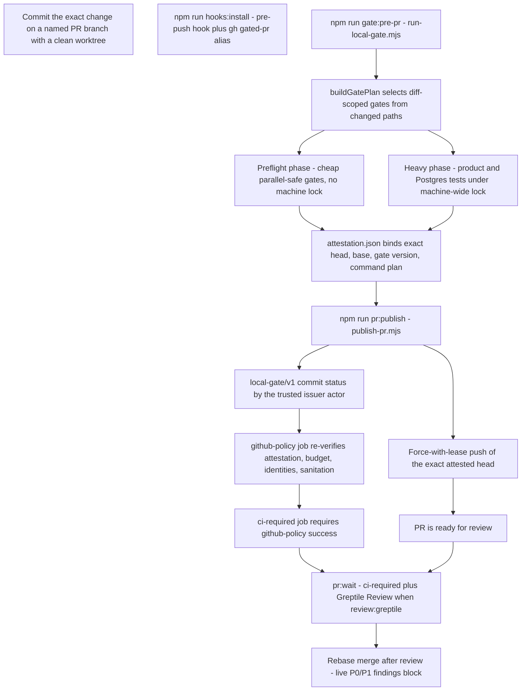

# Internal review

Every change to this repository passes through one internal review pipeline
before it can be published as a PR: a local pre-PR gate produces a
cryptographically exact-head attestation, a publication script opens the PR and
records a trusted commit status, and GitHub CI re-verifies the attestation and
the cheap PR-host policy instead of repeating the broad suites. Internal review
is also a boundary discipline: review intensity follows actual diff risk, never
tracker priority, and the assembled PR train is reviewed at most once. Review
artifacts attach to beads through bead notes and statuses (`gated`,
`published, awaiting checks`) without re-running the gate per bead.

The authority for every statement here is the source and its tests
(`scripts/ci/*.mjs` and `scripts/ci/*.test.mjs`), `AGENTS.md`,
`docs/internal-review-workflow.md`, and `docs/orchestration-process.md`. When
prose and code disagree, the code wins.

## Review boundaries: when a review is justified

Review work is proportional to the actual risk of the diff. Small or low-risk
changes use one implementer, one branch, focused tests, and no model reviewer,
agent bus, or clean-main canary unless a concrete risk or a current operator
instruction requires one. Review an assembled PR train at most once, and only
when its actual trust boundaries or complexity justify review — never the same
code again at every bead, epic, and train boundary. Tracker priority is product
priority, not automatic review intensity: a P0/P1 label alone never requires
extra agents, model reviews, broad tests, or a separate PR
(`AGENTS.md#L36-L45`).

- **No model review by default.** Focused tests plus the final gate are
  sufficient for ordinary fixes, tests, documentation, UI truth/display changes,
  local refactors, and owner-file changes that stay within an existing validated
  contract.
- **One independent review when concrete risk justifies it.** Use one
  independent reviewer on the frozen final train when the diff changes one or
  more of: authentication, authorization, tenant/companion isolation, secrets,
  or consent; destructive persistence, schema migration, backup/restore, or
  irreversible data mutation; concurrency, queue ownership, process boundaries,
  or distributed coordination; a new externally reachable execution surface;
  production deployment behavior with meaningful rollback risk; or a broad
  cross-subsystem contract whose failure is not covered by focused tests. The
  reviewer receives the immutable base/head, intent, relevant acceptance
  criteria, and the exact risk question, and reports concrete reproducible
  blockers — not general improvements. The implementer verifies and fixes
  accepted blockers once, then reruns the focused regression that proves the
  fix; there is no closure reviewer
  (`docs/orchestration-process.md#L253-L287`).
- **CLI review passes are read-only and integrity-checked.** A delegated review
  runs from the worktree it owns against an immutable base/head resolved by the
  orchestrator — the model is never asked to infer its assignment from the
  backlog. The first pass is Kimi Code (`kimi-code/kimi-for-coding`); after the
  implementer fixes accepted blockers and freezes the new head, Pi runs a blind
  independent review (`zai-coding-cn/glm-5.2`) whose prompt never includes the
  Kimi transcript. Both runs assert `git rev-parse HEAD` and a clean worktree
  before and after; if either integrity check fails the verdict is invalid and
  is not treated as independent evidence. Do not automatically rerun Kimi after
  a fix or commission a third reviewer
  (`docs/orchestration-process.md#L289-L347`).
- **A second model reviewer is exceptional.** It requires either an explicit
  operator request or one concrete high-impact claim that remains materially
  ambiguous after the first review and local reproduction. Never use two
  reviewers merely because a bead is P0/P1, and never run per-bead review plus
  train/epic review (`docs/orchestration-process.md#L343-L347`).
- **Greptile is paid and opt-in.** Repository configuration limits automatic
  review to PRs carrying `review:greptile` and disables repeat review on
  pushes. Never add that label, mention the bot, or otherwise trigger a review
  unless the operator explicitly requests the spend; priority alone is never
  enough. When requested, apply the label once to the frozen final train —
  never per bead — and triage findings asynchronously
  (`docs/orchestration-process.md#L349-L357`, `AGENTS.md#L58-L59`).
- **Urgency cancels ceremony.** When the operator says ship, publish, hurry, or
  stop reviewing, all optional review and reporting stops immediately; finish
  only the minimum safe focused checks, the final gate, and the requested
  delivery (`AGENTS.md#L60-L62`).

## The portable gate and publication pipeline

*One exact-head local attestation is trusted by CI, which re-verifies policy
cheaply instead of repeating the broad suites.*

| Stage | What runs | Produces |
| --- | --- | --- |
| Local gate | `run-local-gate.mjs` (`npm run gate:pre-pr`) | `.git/local-delivery-gate/attestation.json` |
| Publication | `publish-pr.mjs` (`npm run pr:publish`) | PR plus `local-gate/v1` commit status |
| PR CI | `ci.yml` `github-policy` job | `ci-required` check result |
| Wait | `wait-for-pr.mjs` (`npm run pr:wait`) | Success handback or failure |

### Entrypoints and prerequisites

The npm scripts wire the pipeline (`package.json#L40-L45`):

- `tools:doctor` — `check-local-tools.mjs`: requires Node `>=24.19.0 <25` and
  UBS exactly `5.3.7`, plus working `npm`, `git`, `gh` (authenticated), and a
  Docker server (`check-local-tools.mjs#L22-L46`).
- `hooks:install` — `install-local-hooks.mjs`: verifies the tracked hooks are
  executable, then sets `core.hooksPath=.githooks` under
  `extensions.worktreeConfig` so linked worktrees inherit the hooks
  automatically, and installs the `gh` alias `gated-pr`, which expands to
  `!npm run pr:publish -- "$@"`. The installer refuses to replace a custom
  hooksPath, existing hooks, or a differing alias
  (`install-local-hooks.mjs#L28-L79`).
- `gate:pre-pr` — `run-local-gate.mjs`, the local pre-PR gate.
- `gate:canary` — `run-local-gate.mjs --canary`, the clean-main canary.
- `pr:publish` — `publish-pr.mjs`, the attested publication flow.
- `pr:wait` — `wait-for-pr.mjs`, the required-checks waiter.

Both gate and publish run with `PUBLIC_SANITIZE_REQUIRE_LOCAL_BLOCKLIST=1`, so
the public-sanitation gate fails when the ignored local privacy blocklist
(`workspace/sanitize/local-blocklist.json` by default, overridable by
`PUBLIC_SANITIZE_LOCAL_BLOCKLIST` or `git config publicSanitize.localBlocklist`)
is absent (`public-sanitize-check.mjs#L90-L107`). Publishing also requires the
local hooks to be installed: `publish-pr` refuses to run when `core.hooksPath`
is not `.githooks`.

### Local pre-PR gate

`run-local-gate.mjs` is the primary enforcement surface. It must run on the
exact committed head: the gate state resolver rejects any uncommitted work, so
there is no "test what I will commit later" mode.

**State resolution** (`resolveLocalGateState`, `run-local-gate.mjs#L51-L95`):

- The checkout must be on a named branch that is not `main`.
- The worktree and index must be clean (`git status --porcelain=v1
  --untracked-files=all` empty) — commit the exact change first.
- The base ref (default `origin/main`) must be an ancestor of HEAD; a
  non-ancestor base is an error that says to rebase the branch before
  validation.
- HEAD must differ from the base (`paths.length === 0` is an error).
- The state directory is `.git/local-delivery-gate/`, holding
  `attestation.json`, `canary-attestation.json`, `logs/<head>/`, and
  `stage-cache/`.

**Gate plan selection** (`buildGatePlan`, `local-delivery-contract.mjs#L101-L339`)
turns the changed paths into the ordered gate list. `detect-change-scope` and
`buildRootValidationScope` classify the change; the planner then selects:

- **Always-on delivery and policy gates**: `ci-rules` (the
  `scripts/ci/*.test.mjs` suite), `change-budget`, `commit-identities`,
  `public-sanitize`, `startup-owner-files`, `semgrep-diff`, and `ubs`
  (Universal Behavior Scanner, `--no-auto-update --skip-js=4,7` over scannable
  changed source files).
- **Root versus diff-scoped gates**: a change touching the root build contract
  (`tsup.config.ts`, `tsconfig.tsup.json`, the DTS entrypoints) forces the full
  `lint`, `build`, `typecheck`, `repository-hygiene`, and `tests` gates;
  otherwise the diff-scoped variants run — `lint-changed` instead of `lint`,
  `runtime-build` instead of `build`, and `targeted-tests` / `related-tests` /
  `unit-tests` / `script-tests` / `integration-tests` selected from the changed
  test and source paths. Test-only changes run `targeted-tests` and never the
  full product suites; test-fixture changes run `related-tests`.
- **Conditional gates**: `settings-contract` when settings owner files or
  `runtime.ts` change; `supply-chain` when lockfiles, Dockerfiles, or the
  supply-chain verifier change; `garden-ui`, `companion-ui`, `satellite-hub`,
  `evals`, and `garden-route-body-policy` when their owned surfaces change;
  `changed-workflow-analysis` (zizmor offline scan) when workflow or action
  files change; `semgrep-rules` self-test when `config/semgrep/` rules change.

Every gate is either `parallelSafe` (cheap, explicitly opted in) or serial. The
gate list and its command identities are later bound into the attestation, so
plan changes invalidate old attestations.

**Two-phase execution** (`partitionGatePlan`, `local-delivery-contract.mjs#L65-L69`):

- **Preflight** (`runPreflightPhase`, `run-local-gate.mjs#L591-L598`): cheap
  gates, pooled only when explicitly `parallelSafe`. Lint, typecheck, build,
  hygiene, and the product tests stay serial. Pooled results all settle before
  the first failure surfaces, so no child process is left running behind a
  failed gate.
- **Heavy** (`runHeavyPhase`, `run-local-gate.mjs#L575-L585`): the
  product/Postgres test suites run serialized machine-wide under the
  heavy-phase lock. A delivery-only change (no active heavy gate) never takes
  the lock; preflight never takes it either.

**Stage-level reuse** (`makeGateOrchestrator`, `run-local-gate.mjs#L604-L644`).
A gate with a content-input manifest (`local-delivery-inputs.mjs`) has its
committed inputs hashed (`contentInputHash`, `run-local-gate.mjs#L155-L176`); a
stage record is reusable only when schema, gate version, base, command
identity, name, and the SHA-256 input hash all match (`isStageReusable`,
`local-delivery-attestation.mjs#L84-L101`) — which allows reuse **across
heads** when the manifest inputs are identical. Gates without a manifest keep
exact-head reuse. `--force` bypasses both attestation and stage reuse. A failed
partial run leaves passing stages recorded; the next run reruns only the failed
stage.

**Attestation.** `createAttestation` writes `attestation.json` binding the
exact `head`, `base`, `baseRef`, the `gateVersion`, the ordered gate names, and
the exact command plan (`local-delivery-attestation.mjs#L16-L34`).
`validateAttestation` rejects an attestation whose schema version, gate
version, head, base, gate list, or command plan differ from the current plan
(`local-delivery-attestation.mjs#L36-L65`). `GATE_VERSION` (currently 10) must
be bumped whenever gate semantics change so old stages and attestations rerun;
`LOCAL_GATE_SCHEMA_VERSION` is 3 and `STAGE_SCHEMA_VERSION` is 2
(`local-delivery-attestation.mjs#L4-L10`). The whole-gate attestation is
written only after every active gate passes, and its validity is exact-head: a
docs follow-up on the same head reuses stage records but produces a new
attestation for the new head.

**Clean-main canary** (`runCanaryGate`, `run-local-gate.mjs#L703-L735`)
validates `origin/main` itself: the checkout must be exactly `origin/main` with
a clean tree (base == head, an empty diff). The plan forces the whole-repo
gates on and skips every diff-scoped gate (`change-budget`,
`commit-identities`, `semgrep-diff`, `ubs`) with an explicit logged reason.
Canary runs with no stage reuse and records a `canary-attestation.json`
(`kind: "canary"`) that deliberately does not validate as a branch
attestation. A red canary stops a multi-PR wave before branch fanout: any gate
failure propagates and no attestation is left behind.

**Heavy-phase lock.** The heavy phase serializes under a machine-wide directory
lock at `tmpdir()/local-delivery-gate-heavy.lock`
(`local-delivery-contract.mjs#L45`). The holder publishes `meta.json` (pid,
worktree, command, startedAt) with a temp-then-rename write. Invariants
(`run-local-gate.mjs#L374-L452`):

- A live owner is never displaced: liveness is probed with `kill(pid, 0)`,
  where ESRCH is a provably dead owner and EPERM means alive under another
  user.
- A provably dead owner's lock is reclaimed under a single-owner reap mutex
  (`<lockDir>.reap`), so liveness re-check and removal are atomic; a reaper
  that itself died leaves its marker clearable.
- A metaless orphan (owner killed between `mkdir` and the meta publish) is
  reclaimed only after a 10-second grace period, which can never race a live
  writer yet bounds the wedge; the reap mutex re-checks that meta is still
  absent before removing.
- Release verifies ownership: the releasing process must match the recorded pid
  and startedAt, and a vanished or changed lock is an error, not a removal.
- Waiters print who holds the lock, from where, since when, and how long they
  have waited (`describeLockWait`).

The root build also gets a fixed heap ceiling,
`ROOT_BUILD_NODE_HEAP_MB = 12288` (`local-delivery-contract.mjs#L47-L56`).
tsup spawns the `.d.ts` rollup as a worker thread with no resource limits, so
the derived old-generation cap must clear the DTS working set; GitHub trusts
the exact local-gate attestation and deliberately does not repeat this build
remotely, so lowering the ceiling without re-verifying the rollup margin would
flake the one build that runs.

### Change budget

`check-change-budget.mjs` enforces the publication window so coherent work is
bundled instead of published as tiny PRs.

The budget (`check-change-budget.mjs#L19-L29`):

- **PR**: at most 25 files (target 15), 800–2,500 counted changed lines
  (target 1,500, with an 800-line **floor**), at most 8 commits (target 5).
- **Per commit**: at most 25 files and 2,500 lines.
- Five committed lockfiles are excluded from line counts (but still count as
  files): `package-lock.json`, `admin-ui/package-lock.json`,
  `companion-ui/package-lock.json`, `apps/satellite-hub/package-lock.json`,
  `tools/evals/package-lock.json` (`check-change-budget.mjs#L31-L37`).
- Evaluation also runs `git diff --check` over the range, so whitespace errors
  fail the budget gate (`checkDiffIntegrity`,
  `check-change-budget.mjs#L185-L187`).

`collectRangeStats` (`check-change-budget.mjs#L160-L183`) resolves the base to
the merge base, walks the commit range, and computes per-commit stats with `-M`
rename detection. Base-integration merges are excluded from commit counts, and
only genuinely novel merge resolutions count — a file that arrived verbatim
from a parent is not authored by the PR, so `--cc --numstat` over-reporting is
corrected by intersecting the per-parent change sets (`novelMergePaths`,
`check-change-budget.mjs#L132-L158`). Both the whole-PR range and every
individual commit are evaluated against their budgets; target-exceeded metrics
warn, maximum-exceeded metrics violate.

The `change-budget:exception` label is the only bypass, and it is explicit
(`decideChangeBudget`, `check-change-budget.mjs#L392-L419`):

- Recorded violations are bypassed only when the PR body contains a non-empty
  `## Change-budget exception` section (`extractExceptionReason` strips HTML
  comments before matching, `check-change-budget.mjs#L269-L275`).
- An exception on a change already inside the window is itself a violation
  ("remove change-budget:exception; this change is within the publication
  limits").
- Metadata resolution fails closed (`resolvePullRequestMetadata`,
  `check-change-budget.mjs#L350-L390`): connected runs read the open PR via
  `gh pr view --json body,labels,state` and require state `OPEN`; offline runs
  need `CHANGE_BUDGET_EXCEPTION` to be exactly `true` or `false` plus
  `CHANGE_BUDGET_PR_BODY`; `CHANGE_BUDGET_USE_OFFLINE=true` forces
  publisher-provided metadata; and explicit metadata that conflicts with the
  GitHub PR is an error.

The PR template states the policy in human terms: a PR is inside the standard
window (800–2,500 counted changed lines, at most 25 files, at most 8 commits)
or carries an explicit coherent variance, and compatible work is bundled rather
than padded or delayed to fit the window (`pull_request_template.md#L22-L33`).

### Commit identity allowlist

`commit-identity-check.mjs` requires every commit in `base..head` to have both
its **author** and **committer** email on the allowlist, compared
case-insensitively. The allowlist is the union of three sources
(`resolveAllowedCommitEmails`, `commit-identity-check.mjs#L17-L32`):

1. A built-in list (`ALLOWED_COMMIT_EMAILS`) that intentionally stays minimal:
   approved automation and hosted-git identities already present in repository
   history. Alternate human identities are not accepted
   (`commit-identity-check.mjs#L9-L15`).
2. `DELIVERY_ALLOWED_COMMIT_EMAILS` (repository variable, newline- or
   comma-separated) — this is how the CI job supplies the maintainer identity.
3. `git config --get-all delivery.allowedCommitEmail` local entries.

The `PRESERVED_IMPORT_HEADS` provenance exemption
(`commit-identity-check.mjs#L37-L46`) lets the satellite-hub and eval-toolkit
immutable source heads retain their original author/committer identities — but
only for commits within their exact imported ancestry; descendants and ordinary
framework commits still use the allowlist. Violation reports list the SHA and
role with the address redacted (`formatCommitIdentityViolations`,
`commit-identity-check.mjs#L172-L176`), and any violation exits nonzero.

### CI re-verifies instead of repeating

**Remote attestation.** After the local gate passes, `publish-pr` publishes a
commit status on the head with context `local-gate/v1`, state `success`, and
description `base=<sha>` (`publishRemoteAttestation`,
`publish-pr.mjs#L223-L236`), using the authenticated `gh` actor. That actor
must be the configured issuer: `requireConfiguredStatusActor`
(`publish-pr.mjs#L149-L164`) compares the current `gh` user against the
`LOCAL_GATE_STATUS_ACTOR` repository variable and refuses to publish otherwise.

`verify-pr-attestation.mjs` polls the head's statuses (`gh api
repos/{owner}/{repo}/commits/{head}/statuses`) and accepts only a status that
(`validateRemoteAttestation`, `local-delivery-attestation.mjs#L103-L116`):

- uses context `local-gate/v1`,
- was created by the trusted issuer login,
- has state `success`, and
- has description exactly `base=<sha>` — so the attestation binds the exact
  base the CI will compare against.

A missing status, wrong issuer, or mismatched base is an error after up to 20
attempts at 3-second intervals (`verify-pr-attestation.mjs#L18-L37`).

**The github-policy job.** `ci.yml` runs on non-draft PRs
(`github.event.pull_request.draft == false`) with read-only permissions and
concurrency cancellation per PR. The `github-policy` job checks out the exact
change head with full history and then runs four cheap policy checks
(`ci.yml#L22-L62`):

1. `verify-pr-attestation.mjs` — re-verifies the exact remote local-gate status
   (with `GH_TOKEN`, `HEAD_SHA`, `BASE_SHA`,
   `EXPECTED_LOCAL_GATE_STATUS_ACTOR` from the repository variable).
2. `check-change-budget.mjs --base $BASE_SHA --head $HEAD_SHA` — re-enforces
   the budget, adding `--exception` when the PR carries
   `change-budget:exception` and passing the PR body for the rationale check.
3. `commit-identity-check.mjs --base $BASE_SHA --head $HEAD_SHA` — re-enforces
   the commit identity allowlist using `DELIVERY_ALLOWED_COMMIT_EMAILS`.
4. `public-sanitize-check.mjs` — verifies public-repository sanitation.

The `ci-required` job (`ci.yml#L64-L78`) runs `if: always()` and fails unless
`github-policy` succeeded, so a policy failure is a loud, required-check
failure on every PR. The broad suites are deliberately **not** repeated here —
GitHub trusts the exact local-gate attestation.

**Public sanitation.** `public-sanitize-check.mjs` scans tracked content for
local-only surfaces that must never reach the public repository: forbidden
path rules (`.beads`, `working_docs`, `deploy` outside the public Helm chart,
`shakedown`, agent config dirs, private deployment config, character-card
artifacts, tracked session archives, tracked beads logs,
`public-sanitize-check.mjs#L17-L41`), secret-like tokens (Telegram, OpenAI,
GitHub PAT, Google API, Discord), private IPv4 and tailnet addresses, internal
`.local.internal` hostnames, and live hardware UUIDs
(`public-sanitize-check.mjs#L43-L62`). With
`PUBLIC_SANITIZE_REQUIRE_LOCAL_BLOCKLIST=1` it also requires the local privacy
blocklist to exist, so local runs cannot pass with a missing blocklist.

### PR labels

Labels split into two classes: **automatic** labels computed from the diff and
**judgment** labels applied by humans.

**Automatic labels.** The `pr-labels` workflow (`pr-labels.yml`) runs on
`pull_request_target` with a checkout of the trusted base revision — so a PR
cannot inject code into the labeler — and executes `github-pr-labels.mjs
apply`. `classifyPullRequest` (`pr-label-classifier.mjs#L19-L43`) uses
`.github/pr-label-rules.json` to compute:

- **Exactly one `size:*` label** from counted changed lines (lockfile
  exclusions apply): `size:XS` ≤ 50, `size:S` ≤ 200, `size:M` ≤ 500, `size:L`
  ≤ 800, `size:XL` beyond.
- **Every matching `system:*` label** from path-pattern rules — one label per
  affected system (memory, session, scheduler, garden, helm-ops,
  agent-tooling, metacog, emotion, channels, cogsec, persistence, voice, world,
  docs, fleet-auth, companion-ui, icp, shards, prompts, testing), so a
  multi-system PR carries several.

`reconcileManagedLabels` (`pr-label-classifier.mjs#L45-L61`) then adds desired
labels and removes only labels under the managed prefixes `system:` and
`size:` — **judgment labels are never touched**. The workflow's catalog job
(`github-pr-labels.mjs sync`) creates and updates labels from
`.github/labels.json` and never deletes labels.

**Judgment labels.** Per the PR template, humans apply exactly one `kind:*`
label (`kind:bug`, `kind:feat`, `kind:chore`, `kind:design`), `severity:*` for
defects, and `risk:*` for review depth. `review:greptile` explicitly triggers
one paid Greptile review and is never auto-applied; `change-budget:exception`
is a maintainer-approved variance marker. `system:*` and `size:*` are stated in
the template as maintained automatically (`pull_request_template.md#L16-L21`).

### Publication flow

`publish-pr.mjs` (`npm run pr:publish`, invoked through the `gated-pr` gh
alias) is the only supported way to open or update a PR. Its steps
(`publish-pr.mjs#L238-L374`):

1. Verify local hooks are installed (`core.hooksPath` is `.githooks`) and the
   branch is a named non-main branch.
2. Reuse an existing open PR for the branch or require `--title` and
   `--body-file` for a new one (an unreviewable empty body is refused).
3. Fetch the base, store `branch.<branch>.psfnGateBase`, then **re-run the
   local gate** under the PR's change-budget metadata using
   `CHANGE_BUDGET_USE_OFFLINE` (`withChangeBudgetMetadata`), so the gate sees
   the same exception state the PR will carry.
4. Validate the fresh attestation against the resolved gate state; failure
   aborts with the validation reason.
5. Verify the authenticated `gh` Partner is the configured status issuer, and
   that every requested `--label` exists.
6. Update existing PR metadata and labels, flip a draft PR ready, then push
   exactly the attested head with `--force-with-lease=<ref>:<remoteBefore>`
   (branch HEAD is re-checked before and after the push; the remote head must
   match the attested head) (`pushBranch`, `publish-pr.mjs#L189-L221`).
7. Publish the `local-gate/v1` status, create the PR (labeled new PRs start as
   drafts and are flipped ready after labels apply — failure paths restore
   draft), and optionally wait for required checks.
8. After a successful wait, surface every live Greptile inline comment and
   **refuse success while a live P0/P1 finding exists**
   (`surfaceReviewFindings`, `publish-pr.mjs#L376-L415`): comments whose badge
   is `badges/p0.svg` or `badges/p1.svg` with a live `position` block;
   outdated comments (position null) are listed but never block.

**Pre-push hook.** The installed pre-push hook runs `pre-push.mjs`, which reads
the push updates from stdin and applies `planPrePush`
(`local-delivery-attestation.mjs#L140-L187`):

- No branch update → allow.
- Any update to `refs/heads/main` → **block** (direct pushes to main are
  prohibited).
- Any remote branch deletion (zero local SHA) → **block** (pushed checkpoints
  are preserved).
- Anything other than exactly the checked-out branch HEAD to its same-name
  remote branch → **block**.
- A non-fast-forward update → **block** unless the push is an exact-head
  attested publication, in which case force-with-lease is allowed.
- Otherwise → allow as a fast-forward checkpoint push.

`validateAttestedPublication` (`pre-push.mjs#L32-L57`) only engages when
`PSFN_ATTESTED_PUBLISH=1` (set by `publish-pr`); it re-reads the stored
attestation for `branch.<branch>.psfnGateBase` and throws if the attestation no
longer validates, so an expired or mismatched attestation cannot push.

**Opt-in waiting.** `wait-for-pr.mjs` polls the PR status rollup until
`evaluateRequiredChecks` passes (`local-delivery-attestation.mjs#L189-L216`).
Required checks are `ci-required` always, plus `Greptile Review` when the
`review:greptile` label is present. The waiter fails fast when the PR head
changed from the expected head, when a required check has not completed, or
when it concluded with anything other than SUCCESS; duplicate check runs are
normalized by recency (run id, then timestamps) and unresolvable duplicates are
marked AMBIGUOUS and never pass (`wait-for-pr.mjs#L74-L99`). The default
timeout is 45 minutes at 15-second polls (`wait-for-pr.mjs#L101-L139`).

## How review artifacts attach to beads without duplicating gates

The gate and the review each run once per delivery, and their artifacts attach
to beads through notes and statuses — never by re-running the gate per bead:

- **One final gate.** Run `npm run gate:pre-pr` once on the final committed
  train head; never on worker checkpoints, and do not rerun an unchanged
  attested head (`AGENTS.md#L46-L47`). Before it, verify only that the train is
  within hard limits on the intended fetched base, the worktree and branch are
  correct and clean, focused tests for all included beads pass, accepted
  risk-review blockers are covered, and no planned source edit remains
  (`docs/orchestration-process.md#L359-L372`).
- **Focused tests own bead-local correctness.** Workers run focused tests and
  changed-file lint while implementing; the assembled train is reviewed at most
  once, and only when risk triggers it. If the gate fails, reproduce the
  specific failed stage, fix its verified cause, and run that focused command
  to green before committing one new final head; do not commission a model
  review of a gate failure unless the fix itself introduces a risk trigger
  (`docs/orchestration-process.md#L374-L378`).
- **Bead notes record the evidence.** One publication note carries the branch,
  exact head, focused tests, gate result, and PR. Statuses are reserved
  accurately: `implemented`, `checkpoint-pushed`, `gated`, `published, awaiting
  checks`, and `done` only for code present on `main` with the bead closed
  (`docs/orchestration-process.md#L490-L521`, `AGENTS.md#L105-L106`).
- **Review findings are triaged asynchronously.** After an opt-in wait, live
  P0/P1 Greptile comments block the success handback and are triaged in the PR
  thread; the merger or a later reconciliation sweep closes delivered beads —
  agents return the PR URL and move on instead of polling
  (`docs/orchestration-process.md#L405-L426`).
- **Delivery closes the bead; remaining proof becomes a new bead.** An
  implementation bead or epic closes immediately when its implementation is on
  `main`, citing the merge evidence. If validation remains, create a new
  testing/validation bead (`kind:chore`, `system:testing` unless a more
  specific testing contract is canonical) linked with
  `discovered-from:<implementation-id>`, naming the exact environment, command,
  fixture, or observable evidence, with independent pass/fail acceptance; any
  failure it discovers creates a new bug bead. Never reopen the delivered
  implementation bead (`docs/orchestration-process.md#L471-L489`,
  `AGENTS.md#L141-L151`).

## Failure semantics

The pipeline is fail-closed throughout:

- The local gate refuses dirty trees, missing branches, and non-ancestor bases
  before running anything.
- Attestations are exact-head, exact-base, exact-command-plan; any mismatch
  (including a bumped `GATE_VERSION`) invalidates them.
- The budget floor (800 lines) is a violation, not a warning; an unnecessary
  exception label is a violation.
- Commit identities outside the allowlist (and descendants of preserved
  imports) fail with redacted diagnostics.
- CI re-verifies the attestation and fails `ci-required` loudly on any policy
  failure; drafts are exempt because the pipeline only publishes ready work.
- The pre-push hook blocks main pushes, deletions, and history rewrites unless
  the push is an exact-head attested publication.
- Review findings: live P0/P1 Greptile comments block the success handback.

## Relationships

- `/openwiki/process/adversarial-review.md` — the complementary security
  scanners (Semgrep full/diff, UBS, OSV, Trivy, zizmor), baseline debt gates,
  and the adversarial review invocation practices this pipeline's tooling
  supports.
- `/openwiki/process/orchestration.md` — multi-bead waves whose trains are
  gated here; the clean-main canary stops a wave before branch fanout, and the
  proportional review policy decides when a train is reviewed at all.
- `/openwiki/process/productivity-pack.md` — the delivery practices and
  prompts that feed this pipeline.
- `/openwiki/process/public-history-rewrite.md` — history rewriting, which the
  pre-push hook restricts to exact-head attested publications.
- `/openwiki/security/attribution.md` — the identity discipline the commit
  identity allowlist and redacted diagnostics enforce.
- `docs/PSFN_PROJECT_CHARTER.md` — charter law the review gates implement.
