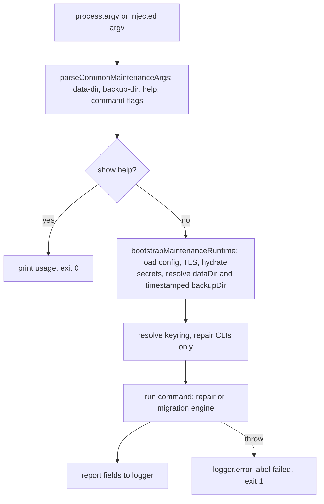
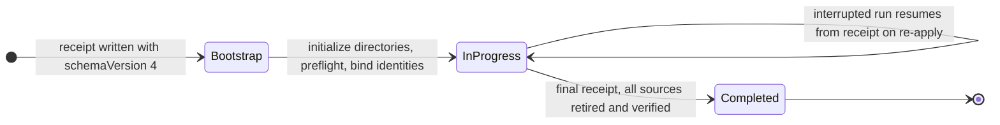

# Maintenance Scripts

This page is the operator's map to one-off maintenance: what the maintenance CLI
in `src/app/maintenance/` does, how the shared harness makes every command fail
closed, which migrations and backfills exist and when each is safe to run, and
which verification gates keep the repository from regressing. It is a **process**
page: the discipline for running a repair or landing a baseline matters as much
as the command itself. Source and tests are the authority; when prose and code
disagree, the code wins.

Every destructive tool shares the same discipline: **dry-run is the default**,
`--apply` (or an equivalent explicit flag) is required to write, repairs create
timestamped backups before mutation, and unknown arguments fail closed. Fleet-
affecting surgery additionally requires the owning workloads stopped, a backup,
and operator sign-off — each command states that requirement in its own usage
text.

Related pages: [operations](/openwiki/operations.md) (lifecycle commands that
stop/start the workloads a repair needs stopped),
[specifications](/openwiki/specifications.md) (owner-file and persistence
contracts these migrations upgrade), [orchestration](/openwiki/process/orchestration.md)
and [internal review](/openwiki/process/internal-review.md) (the pre-PR gate
that runs the verification gates), [adversarial review](/openwiki/process/adversarial-review.md)
(baseline-debt gates), and [shakedown](/openwiki/process/shakedown.md) (the E2E
harness whose artifacts `shakedown:cleanup` removes).

## The safety discipline shared by every maintenance command

- **Dry-run by default, explicit apply.** Every mutating command — repairs,
  backfills, migrations, cleanup, retirement, seeding — defaults to planning or
  reporting and requires `--apply` (or an equivalent) to write. `--approve`,
  `--approval-id`, and similar gate flags are accepted only in apply mode.
- **Backups before mutation.** Repair runs write to a timestamped
  `repair-backups/<label>-<timestamp>` directory under the data root; several
  commands refuse to overwrite pre-existing backups or require an empty backup
  target.
- **Fail closed on ambiguity.** Unknown arguments throw, so a typo never
  silently widens a repair. Channel and mapping targets cannot widen; ambiguous
  channels are never guessed; incomplete L0 chains refuse repair; unapproved or
  unidentified sources abort.
- **Canonical append-only L0 is protected.** Only `session:repair:integrity`
  (with an operator reason) rewrites sealed L0 bytes; every other session repair
  rebuilds derived state from canon and never touches the sealed archives.
- **Content-free audit and reporting.** Audit events and disposition ledgers
  carry structural counts and stable reason codes, never message text or raw
  row bytes.
- **Fleet surgery requires the fleet stopped.** The system-owner fleet
  migration, session purge, and shakedown cleanup each document that the owning
  workloads must be stopped first.

## The maintenance CLI harness

Every command in `src/app/maintenance/` is built on the shared harness in
`src/app/maintenance/cli-harness.ts`, which provides the common argument
grammar, the runtime bootstrap, and the fail-closed execution wrapper:

- `parseCommonMaintenanceArgs` understands `--help`/`-h` and the common
  `--data-dir` and `--backup-dir` value flags, plus per-command extra flags.
  Unknown arguments throw, so a typo never silently widens a repair
  (`repo://src/app/maintenance/cli-harness.ts#L35-L90`).
- `bootstrapMaintenanceRuntime` loads the config, applies the gateway TLS
  config, and (unless `hydrateSecrets: false`) hydrates secret-bearing config.
  It resolves `dataDir` from `--data-dir` or config, and derives a `backupDir`
  as `<dataDir>/repair-backups/<backupLabel>-<timestamp>` when the command
  passes a backup label — every repair run therefore gets its own timestamped
  backup directory (`repo://src/app/maintenance/cli-harness.ts#L127-L169`).
- `runMaintenanceCli` / `runRepairCli` execute the command, log a
  `label failed: message` line on error, and exit with code 1. The repair
  variant additionally resolves a keyring (when the repair needs one) and
  prints a deterministic report (`repo://src/app/maintenance/cli-harness.ts#L189-L267`).
- `isMaintenanceCliEntrypoint(import.meta.url)` guards every entrypoint so
  importing the module (for tests) never executes the command
  (`repo://src/app/maintenance/cli-harness.ts#L269-L277`).

*Every maintenance CLI funnels through the same harness: common arg parsing, secret-safe bootstrap, and fail-closed error handling.*

## Session archive repair family

The session family repairs or inspects the canonical L0 JSONL session archives
and the derived surfaces (`_turn_records`, the channel index, and the Postgres
transcript projection). The L0 append-only law is enforced per command:
integrity repair is the one sanctioned re-sign path and records an operator
reason; attribution and transcript-projection repairs rebuild derived state
from canon and never touch the sealed L0 bytes.

| npm script | Entrypoint | What it does | Safe to run |
| --- | --- | --- | --- |
| `session:repair` | `src/app/maintenance/session-repair.ts` | Read-only scan of every `.jsonl` session archive; counts loaded vs quarantined lines and lists files with corruption | Anytime; sets exit code 1 when corruption exists |
| `session:repair:integrity` | `src/app/maintenance/session-integrity-repair.ts` | Re-seals L0 HMAC chains under keyring, quarantines malformed rows, rebuilds channel index | With the runtime stopped; requires `--reason` |
| `session:repair:attribution` | `src/app/maintenance/session-attribution-repair.ts` | Rewrites the derived `_turn_records` mirror and channel index to normalize role/author attribution | Anytime; no keyring, L0 untouched |
| `session:repair:transcript-projection` | `src/app/maintenance/transcript-projection-repair.ts` | Rebuilds the Postgres transcript projection from canonical L0 chains | Anytime; requires `config.postgresDatabaseUrl` |
| `session:purge` | `src/app/maintenance/purge-testing-session.ts` | Deletes one exact session: archive files, Postgres memories, recent contact shapes, optional Redis tail cache | Runtime workloads stopped; non-testing sessions need `--force-non-testing` plus interactive exact-id confirmation |

### `session:repair`

`runSessionRepairScan` in `src/persistence/repair/repair.ts` lists `*.jsonl`
files under the sessions dir, parses each archive, and reports
`quarantinedEntries` per file. It never writes. The CLI prints a per-file
listing of corruption (channel id, loaded/quarantined counts, sidecar path) and
sets `process.exitCode = 1` when any quarantined lines exist, so the command
doubles as a CI-style signal
(`repo://src/app/maintenance/session-repair.ts#L43-L95`).

### `session:repair:integrity`

`runSessionIntegrityRepair` in `src/persistence/repair/integrity-repair.ts` is
the sanctioned L0 re-sign path. Key properties:

- **Fail closed on justification**: the CLI rejects a run without a non-empty
  `--reason <text>` before any secret hydration, and the engine re-checks it
  (`repo://src/app/maintenance/session-integrity-repair.ts#L27-L55`).
- **Keyring required**: the CLI resolves the session HMAC keyring via
  `createSessionHmacBoundaryService(...).requireKeyring(...)`; the engine
  builds an integrity provider from it.
- **Targets stay narrow**: `--channel <id>` (repeatable) allows an exact
  channel allowlist; `targetJournalChain` (used by automatic background-work
  recovery) pins one exact file chain plus an archive fingerprint. Both modes
  fail closed: an empty/unresolved channel set, a fingerprint mismatch, or a
  changed chain (`ESTALE`) aborts, and an explicitly targeted repair can never
  widen to an all-channel mutation. Incomplete L0 chains refuse the whole run.
- **Durable evidence before mutation**: each chain file is copied to a
  containment-checked, fsync-durable backup (`resolveJournalBackupPath`
  refuses paths outside the sessions root); malformed rows are recorded in a
  two-phase `quarantine-receipts.jsonl` ledger (`prepared` before the rewrite,
  `completed`/`aborted` after) so an interrupted run leaves recoverable raw
  bytes.
- **Content-free audit**: one `session_integrity_repair` event per run — on
  success and failure alike — is appended to the durable safeguard audit trail
  (companion-data `state/safeguards-audit.jsonl` that Garden surfaces), carrying
  only structural counts, channel ids, the operator reason, and an outcome.
- **Post-repair index rebuild**: the derived session channel index is
  re-primed from disk after all chains are rewritten.

### `session:repair:attribution`

`runAttributionRepair` in `src/persistence/repair/attribution-repair.ts`
normalizes role/author attribution in the **derived** `_turn_records` mirror
only, then re-primes the channel index. The canonical L0 chains are never
rewritten — the runtime already normalizes attribution at read time, so this
tool only heals stale derived state (intention appraisal entries become
`system:intention`, scheduled prompts become `scheduler`). Backups are written
to the timestamped `repair-backups/attribution-*` directory, and the CLI
explicitly resolves no HMAC keyring.

### `session:repair:transcript-projection`

`runTranscriptProjectionRepair` in `src/persistence/repair/transcript-projection-repair.ts`
rebuilds the Postgres transcript projection **from the canonical L0 archive
files**, never from the projection itself. Each discovered chain is loaded
through `SessionJournalRuntime` and pushed via `replaceChannelEntries`;
incomplete chains and load failures are marked as projection drift; previously
drifted channels with no surviving L0 chain are cleared. The CLI requires
`config.postgresDatabaseUrl` (PostgreSQL persistence) and reports drift before
and after.

### `session:purge`

`purge-testing-session.ts` deletes exactly one session: L0 archive files,
Postgres `l2_memories` rows, recent contact shapes, and — when Redis is
configured — the companion-scoped tail cache entries. Wildcards are never
accepted. Testing sessions must use the `<existing-channel-prefix>:testing:<name>`
shape; any other session requires `--force-non-testing` plus an interactive
re-type of the exact id
(`repo://src/app/maintenance/purge-testing-session.ts#L39-L80`). The CLI
resolves the purge target (fleet companions need `--companion-id`) and requires
`config.postgresDatabaseUrl`.

## Memory repair and backfill family

These commands repair or migrate L2 typed memory rows in PostgreSQL. All of
them are dry-run by default, `--apply` writes, and every applied update records
an `l2_memory_patch_events` row with provenance.

| npm script | Entrypoint | What it does |
| --- | --- | --- |
| `memory:repair:participant-names` | `src/app/maintenance/backfill-memory-participant-names.ts` | Replaces generic participant labels (`{{user}}`, `the user`, `the companion`, ...) in L2 memory text with resolved names |
| `memory:repair:provenance` | `src/app/maintenance/backfill-memory-provenance.ts` | Rebuilds empty `provenance_json`/`source_type` from the append-only `memories.jsonl` ledger |
| `memory:repair:subject-attribution` | `src/app/maintenance/reattribute-memory-subjects.ts` | Remaps historical contact ids in memory/episode records, then resets and drains the subject-classification checkpoint |
| `migrate:embeddings` | `src/app/maintenance/migrate-embeddings.ts` | Re-embeds every L2 memory with the currently configured embedding provider |

### `memory:repair:participant-names`

`repairPostgresMemoryParticipantNames` in
`src/persistence/repair/memory-participant-name-repair.ts` selects candidates
with a conservative SQL predicate — explicit placeholder forms only: `{{...}}`
macros and the definite labels `the user`, `Partner`, `the companion`,
`the assistant`. Bare nouns such as "research assistant" are never selected.
Names come from `--user-name`/`--companion-name` or are resolved from config;
a candidate whose placeholders cannot be resolved to a name is **refused** with
a stable reason (`missing_user_name`, `missing_companion_name`). The scan limit
defaults to 500 and caps at 10 000; `--include-archived` admits superseded or
soft-deleted rows.

### `memory:repair:provenance`

`backfillPostgresMemoryProvenance` in
`src/persistence/repair/memory-provenance-backfill.ts` rebuilds rows whose
`provenance_json` is empty from `memories.jsonl` insert events (the ledger
preserved in-memory provenance that the legacy Postgres store never wrote).
Two derivations are deliberately conservative:

- `sourceContactId := routedContactId` **only** when `routingReason` is
  `speaker_name_prefix` or `transcript_content_match` — lanes where the routed
  contact is definitionally the matched source speaker. Never on
  `single_speaker_transcript`.
- `addressMode := overheard_room_context` **only** when the channel has at
  least `roomMinMembers` distinct members (default 2) in
  `contact_channel_activity`.

Rows with non-empty provenance are never touched (the UPDATE re-checks that
guard, so the operation is idempotent). A malformed non-final ledger line
aborts; one torn final line is tolerated, and `--apply` refuses if any
malformed line remains.

### `memory:repair:subject-attribution`

`reattributePostgresMemorySubjects` in
`src/persistence/repair/memory-subject-reattribution.ts` applies
`--map <old-contact-id>=<current-contact-id>` (repeatable) across memory
provenance contact fields (`triggerContactId`, `routedContactId`,
`sourceContactId`, `subjectContactId`), `subjectContactIds`, `scope_tags`
(`contact:` prefixes), `scope_ref_id` for contact scopes, and episode
`participant_contact_ids`/`episode_json`. Mappings must be non-chained and
non-ambiguous (validation rejects a source with multiple targets or a target
that is also a source). In apply mode it then resets the subject-classification
checkpoint and re-runs classification with the configured embedding dims.

### `migrate:embeddings`

`migrate-embeddings.ts` re-embeds all L2 memories (optionally including
soft-deleted rows with `--include-deleted`) using the configured embedding
provider, with `--batch-size` (default 64) and `--parallelism` (default 4)
controls (`repo://src/app/maintenance/migrate-embeddings.ts#L26-L60`). It
requires `config.persistenceBackend=postgres` and a database URL.

## Owner-file migrations and fleet fan-out

The owner-file migrations upgrade the JSON owner files that constitute runtime
configuration. `migrate:system-owner-fleet` is the most consequential: a
receipt-driven, crash-recoverable transaction that fans system-root owner files
out to every fleet companion.

### `migrate:system-owner-fleet`

`migrate-system-owner-fleet.ts` plans or applies the explicit
system-owner-to-fleet-companion fan-out migration. The migrated owner files are
exactly `SYSTEM_OWNER_FLEET_MIGRATION_FILES`: `charge-policy.json` and
`skills.json` (scheduler and capability-tier use a separate per-release Helm
cutover that retains their old sources as rollback evidence;
`repo://src/persistence/system-owner-fleet-migration-files.ts#L4-L11`).

- **Default mode is a read-only plan.** `npm run migrate:system-owner-fleet`
  prints a JSON plan including the exact `--approve <owner-file>=<sha256>`
  approvals required for each present source. `--approve` is accepted only
  with `--apply`, and each digest must be an exact lowercase SHA-256 of a
  supported owner file (`repo://src/app/maintenance/migrate-system-owner-fleet.ts#L22-L48`).
- **Apply requires approval digests.** `executeSystemOwnerFleetMigration`
  (`src/persistence/system-owner-fleet-migration-execution.ts`) requires an
  exact lowercase SHA-256 approval per source; digests must match
  `expectedSourceDigests` or the run aborts. Destination conflicts (a
  companion already has the owner file) refuse the whole migration.
- **Split roots required.** `resolveSystemOwnerFleetContext` throws unless the
  runtime layout uses production split roots (system-data distinct from
  companion-data). When `companions.json` does not yet exist, the single
  companion fleet is synthesized from the environment so an existing
  pre-manifest install can be migrated into the fleet owner-file world
  (`repo://src/app/maintenance/system-owner-fleet-context.ts#L48-L80`).
- **Receipt-driven transaction.** A receipt at
  `<systemDataDir>/migrations/system-owner-fleet-reroot.json` (schema v4)
  records source identities, quarantine paths, per-destination staging and
  temporary paths, and per-file/per-destination status. The engine pins every
  directory with `pinned-filesystem` descriptors, verifies source unchanged
  before every step, publishes destinations through staging with fsync-durable
  writes, retires sources into an operation-scoped quarantine directory, and
  marks the receipt `completed` only after every destination is verified.
- **Crash recovery.** Re-running apply with the same approvals resumes from
  the receipt: unverified destinations are re-published (superseding unbound
  temporaries), retired files are never re-created, and a reappeared retired
  source or a drifted fingerprint fails closed.

*System-owner fleet migration receipt lifecycle: bootstrap to in-progress to completed, with the receipt making every intermediate step resumable.*

- **Pre-migration snapshot tooling.** `snapshot:system-owner-fleet` (capture)
  and `restore:system-owner-fleet-snapshot` (restore) wrap
  `captureSystemOwnerFleetSnapshot`/`restoreSystemOwnerFleetSnapshot` in
  `src/persistence/system-owner-fleet-snapshot.ts`: whole-root tree snapshots
  of the system data dir and every companion data dir, verified and
  fsync-durable, plus a `system-owner-fleet-snapshot.json` manifest. Capture
  refuses an existing output dir or overlapping source roots; restore replays
  into an empty persistence root
  (`repo://src/app/maintenance/system-owner-fleet-snapshot.ts#L29-L56`).
- **Upgrade readiness probe.** `src/app/maintenance/owner-upgrade-readiness-probe.ts`
  is the operator probe used to certify the owner-file upgrade rollout: a
  `seed-legacy` mode lays down a legacy pre-fan-out layout, a `legacy-server`
  mode asserts the legacy release still serves old values, and a `companion`
  mode asserts each migrated companion owns distinct `charge-policy.json`/
  `skills.json` files (distinct device/inode identity, matching identity
  digests) before writing a ready barrier.

### `migrate:scheduler-owner` and `migrate:intake-policy-owner`

- `migrate:scheduler-owner` (`migrate-scheduler-owner.ts`) migrates the
  retired salience/social-graph scheduler cadences into
  `scheduler.json > backgroundMaintenance`. It requires the exact
  `--data-dir` (companion owner-file directory) and validates + atomically
  replaces the file in apply mode.
- `migrate:intake-policy-owner` (`migrate-intake-policy-owner.ts`) upgrades
  schema-v1/v2/v3/v4/v5 `intake-policy.json` owners to v6, removes retired
  screener model selectors, and adds required posture sections to current
  owners. Requires the exact system `--data-dir`.

### `migrate:required-settings-blocks`

`migrate-required-settings-blocks.ts` is an operator script (no npm alias)
wrapping `migrateRequiredOwnerAdditions` in
`src/system/config/required-owner-additions-migration.ts`; it adds required
owner blocks to `settings.json` (and optionally a companion-dir owner file)
with `--apply`/`--dry-run` and requires `--data-dir`
(`repo://src/app/maintenance/migrate-required-settings-blocks.ts#L8-L41`).

## Persistence migrations

| npm script | Entrypoint | What it does |
| --- | --- | --- |
| `migrate:persistence-layout` | `src/app/maintenance/migrate-persistence-layout.ts` | Plans or applies the split-root persistence cutover from the legacy shared data root (`src/persistence/cutover.ts`) |
| `migrate:session-filenames` | `src/app/maintenance/migrate-session-filenames.ts` | Renames retired L0 session archive filenames to the readable format and updates the channel index |
| `migrate:turn-record-background-work` | `src/app/maintenance/migrate-turn-record-background-work.ts` | Durably retires exact pre-drift emotion-appraisal jobs in `_turn_records` mirrors |
| `migrate:channel-envelope` | `src/app/maintenance/migrate-channel-envelope.ts` | Seeds `channels.json` `contextEnvelope.channels` from contact rows and session archives (E3.2) |
| `migrate:prompt-layer-identifiers` | `src/app/maintenance/backfill-prompt-layer-identifiers.ts` | Adds `identifier: "main"` to a persisted base prompt layer that has none |

- **`migrate:persistence-layout`** builds the cutover plan from config
  (`buildPersistenceCutoverOptionsFromConfig`) with optional
  `--legacy-data-dir`/`--legacy-companion-dir` overrides; dry-run prints the
  plan, `--apply` executes the split-root migration.
- **`migrate:session-filenames`** lists files matching the legacy archive
  filename shape, and in apply mode runs `migrateLegacyFilenames` plus a
  channel-index re-prime. `--data-dir` or the exact `--sessions-dir` is
  required (exactly one).
- **`migrate:turn-record-background-work`** parses every `_turn_records`
  JSONL file under the rotation lock, retires exact pre-drift emotion-appraisal
  `backgroundWorkHandoff` jobs, and rewrites atomically. Apply requires an
  empty `--backup-dir` and refuses to overwrite an existing backup; any
  malformed or near-legacy record aborts the whole plan before the first
  mutation (`repo://src/app/maintenance/migrate-turn-record-background-work.ts#L29-L71`).
- **`migrate:channel-envelope`** enumerates known channels from
  `contact_channel_activity` rows and the session archives, derives
  channel-owned Context Envelope labels through `planChannelEnvelopeMigration`
  (trust policy + existing labels), and seeds `contextEnvelope.channels`.
  Ambiguous channels are never guessed: they receive fail-closed
  `invite_only` plus a `needsReview` flag that surfaces as a Garden warning
  badge. Dry-run reports; `--apply` writes
  (`repo://src/app/maintenance/migrate-channel-envelope.ts#L44-L63`).
- **`migrate:prompt-layer-identifiers`** surgically inserts the JSON property
  `"identifier": "main"` into base prompt layers that lack it, preserving
  source formatting and validating every stored layer first. It fails closed
  if a layer already has a non-empty identifier or if the source bytes cannot
  be mapped back to parsed records
  (`repo://src/app/maintenance/backfill-prompt-layer-identifiers.ts#L28-L52`).

## Report-only audits

| npm script | Entrypoint | What it reports |
| --- | --- | --- |
| `audit:core-memory-scopes` | `src/app/maintenance/audit-core-memory-scopes.ts` | Core-memory rows that are `legacy_global` scoped or whose scope key does not match the canonical `channel:<channelId>` derivation |
| `audit:companion-memory-tenancy` | `src/app/maintenance/audit-companion-memory-tenancy.ts` | Postgres memory rows in the configured companion schema whose companion-channel provenance does not include this runtime |
| `audit:prompt-macros` | `src/app/maintenance/audit-prompt-layer-macros.ts` | References to removed prompt macros and unregistered macro names in persisted prompt layers/registry |

All three are strictly read-only (they never migrate or mutate) and exit with
code 1 when findings exist. The tenancy audit builds its room-membership
authority from the local channel index and archive bindings without repairing
or rewriting them — missing or malformed bindings fail the audit closed — and
never emits memory bodies, raw channel ids, source refs, or session ids
(`repo://src/app/maintenance/audit-companion-memory-tenancy.ts#L49-L56`).

## Cleanup and retirement

| npm script | Entrypoint | What it does |
| --- | --- | --- |
| `shakedown:cleanup` | `src/app/maintenance/cleanup-shakedown-artifacts.ts` | Deletes the canonical testing-harness session and its artifacts, bound to an exact manifest, with a rollback-capable backup |
| `satellite:retire-synthetic` | `src/app/maintenance/retire-synthetic-satellite.ts` | Retires synthetic testing-harness satellites (file-backed backplane identities) |

- **`shakedown:cleanup`** requires `--manifest <exact-manifest.json>` and
  fails unless the manifest names the canonical testing-harness session
  (`TESTING_HARNESS_SESSION_CHANNEL_ID`) and its companion matches the resolved
  runtime authority. Default is a content-free dry run; `--apply` additionally
  requires `--approval-id <exact-id>`, resolves a backup config, and runs the
  cleanup runtime's apply (backup created and verified before exact deletion).
  "Stop the owning runtime workloads before apply so the fenced snapshot stays
  stable."
- **`satellite:retire-synthetic`** requires the exact synthetic
  `--satellite`, at least one `--endpoint`, `--run-id`, and `--manifest-id`.
  Physical, unknown, or provenance-mismatched satellites are rejected before
  backup or mutation; apply requires `--approval-id`.

## Seeding, import, and provisioning

| npm script | Entrypoint | What it does |
| --- | --- | --- |
| `seed:sibling-contacts` | `src/app/maintenance/seed-sibling-contacts.ts` | Seeds mutual ICP-eligible sibling contacts for every companion pair in the fleet |
| `import-character` | `src/app/maintenance/import-character.ts` | Imports and normalizes a character card into `CHARACTER_CARD_PATH` |
| `wiki:import` | `src/app/maintenance/import-wiki.ts` | Bulk-imports a Markdown directory into a companion's personal wiki or a site's shared-world scope |
| `wiki:publish:places` | `src/app/maintenance/publish-places-wiki.ts` | Projects `places.json` into shared-world wiki pages (idempotent) |
| `projects:quarantine-legacy-artifacts` | `src/app/maintenance/quarantine-legacy-project-artifacts.ts` | Marks pre-existing model-asserted project artifacts `legacy_unverified` and contains them to `private`/`self` (bible §9.5) |
| `projects:migrate-manifests-v2` | `src/app/maintenance/migrate-project-manifests-v2.ts` | Upgrades personal-project manifests v1 → v2 with a private work context |
| `projects:migrate-free-time-visibility` | `src/app/maintenance/migrate-free-time-visibility.ts` | Flips existing free-time history to private and contains `public` projects to `primary_contact` (adjudication S11.4) |

- **`seed:sibling-contacts`** mirrors the ICP certification sequence
  (`resolveChannelIdentity` → `setMachineIntelligence` → `setTrustLevel` →
  `updateRelationshipType`) for each ordered companion pair at trust
  `regular` (the ICP floor) or `trusted`; requires a fleet of at least two
  companions and PostgreSQL. Dry-run plans, `--apply` writes into each
  companion's tenant schema/role.
- **`wiki:import`** routes every file through the deterministic
  personal-fact guard for shared-world scope (a personal fact rejects the file
  with a per-file reason), fails closed on an unknown `siteId` (not in
  `places.json`), and runs write + pgvector projection together so the
  filesystem tree and `shared.shared_wiki_chunks` cannot drift silently
  (`repo://src/app/maintenance/import-wiki.ts#L3-L16`). Personal scope imports
  skip the shared gate. The projection context resolves the configured
  embedding provider through the canonical provider composition and fails
  closed under multi-companion when Postgres or the embedder is unavailable,
  otherwise reporting an honest `skipped` flag-off
  (`repo://src/app/maintenance/shared-wiki-projection-context.ts#L18-L41`).
- **`wiki:publish:places`** builds site-overview and per-place pages under
  `<system-data>/shared-world/wiki/sites/<siteId>/`, never in companion-data;
  re-running with an unchanged registry is a no-op.
- **The three `projects:*` migrations** are one-time, idempotent, dry-run by
  default, and report malformed manifests by hand instead of rewriting them.

## Runtime-invoked repairs

Not every repair is a CLI. `src/persistence/repair/background-work-handoff-recovery-disposition.ts`
is invoked by the runtime when a deterministic `EBADMSG` authority poison
(corrupt turn-record recovery evidence) would otherwise wedge background-work
handoff recovery. It converts the poison into a crash-durable disposition:

- It first runs `runSessionIntegrityRepair` against the exact source chain
  (backup + quarantine path). When repair proves there is nothing to rewrite,
  an exact-generation receipt in
  `background-work-handoff-recovery-dispositions.jsonl`
  (`BackgroundWorkHandoffRecoveryDispositionStore`, fingerprint-keyed and
  write-locked) retires only that physical owner while the raw source stays in
  place.
- Every step is logged and audited with the content-free
  `background_work_handoff_recovery_disposition` event; source archives are
  containment-checked against the sessions root.

## Preflight and verification scripts

These live in `scripts/` and gate rollouts or certify tooling rather than
mutating data.

| npm script | Script | What it verifies |
| --- | --- | --- |
| `preflight:startup-owner-files` | `scripts/preflight-startup-owner-files.ts` | Startup owner files exist and pass `verifyStartupOwnerFiles`/`verifyStartupFleetOwnerFiles` in operator mode |
| `preflight:owner-file-modes` | `scripts/preflight-owner-file-modes.ts` | Owner-file mode/ownership expectations (stat metadata only, never contents) |
| `verify:startup-owner-files` | `scripts/verify-startup-owner-files.ts` | Seed→owner staging parity against the startup owner-file guard, in an isolated split fixture |
| `verify:backup-restore` | `scripts/verify-backup-restore.ts` | Postgres dump archive restore fidelity, companion/workspace/system tree snapshots, encrypted manifest handling, Kubernetes Helm snapshot |
| `verify:shell-sandbox-image` | `scripts/verify-shell-sandbox-image.mjs` | Sandbox image contract (shell sandbox runtime) |

`verify:startup-owner-files` is notable for `assertOwnerFileSeedParity`, which
cross-checks the `OWNER_FILE_SEEDS` literal against the guard's own owner-check
list so a newly required owner can never be forgotten in staging. The shell
sandbox contract is also probed at runtime by
`src/app/maintenance/verify-shell-sandbox-runtime.ts`, which executes every
analysis tool the image contract promises (`jq`, `file`, `unzip`, `zip`,
`sqlite3`, `pdftotext`, `pandoc`, `python3`, `uv`) inside the policy-enforcing
shell runner — a missing binary fails the probe, never skips it.

## Verification gates and baselines

The verification gates are fail-closed scans that compare the current tree
against a checked-in **baseline**. Their discipline: the baseline is
**reduction-only**. Fix the source or remove resolved entries; never grow a
baseline to silence a gate, and never delete a baseline to bypass it. Each gate
supports `--update` to regenerate its baseline, but update only *shrinks* the
baseline (or preserves existing reviewed notes) and refuses new debt.

### `verify:hardcoded-settings`

`npm run verify:hardcoded-settings` (script `scripts/verify-hardcoded-settings.mjs`)
prevents **new** hardcoded tuning/policy values from accreting in production
`src/` without either (a) being migrated into an owned setting (the settings
contract + owner-file validation + Garden exposure + tests chain) or (b) being
explicitly recorded as intentionally code-owned in
`scripts/hardcoded-settings-baseline.json`, reviewed like code
(`repo://scripts/verify-hardcoded-settings.mjs#L1-L37`).

- The scanner finds declarations and object/class/enum members whose identifier
  contains a tuning/policy token and whose value is a literal, plus
  syntax-aware call-site forms (timers, truncation, Math clamps, retry/options
  call objects, length guards, policy-context return arithmetic). Test/e2e
  support, 0/1 structural guards, hash/UUID/date slices, and
  identifier-derived values are excluded to keep the signal reviewable.
- Any scanned value not in the baseline fails with an actionable message;
  stale baseline entries (constant no longer present) also fail, so the
  baseline cannot rot. Extended-form entries (those with a `form`) require a
  non-empty reviewed `note`.
- `npm run verify:hardcoded-settings -- --update` regenerates the baseline from
  the current tree, preserving the `note` justification on every entry that
  still exists — it never invents justification, and it exits nonzero while any
  extended-form entry lacks a reviewed note
  (`repo://scripts/verify-hardcoded-settings.mjs#L242-L292`).

### `verify:duplicate-type-names`

`npm run verify:duplicate-type-names` (script `scripts/check-duplicate-type-names.ts`)
scans `src/` for exported interface/type-alias/enum names defined in more than
one file and compares them against `config/duplicate-type-baseline.json`.
Findings are classified `identical` (same normalized shape; consolidation
candidate) or `collision` (different shapes; the dangerous case). Test files
and `src/test-support` are excluded
(`repo://scripts/check-duplicate-type-names.ts#L1-L22`).

Updating is reduction-only: `--update` refuses new names,
identical-to-collision upgrades, and footprints that spread to new files.
Accepting a new duplicate requires hand-adding a baseline entry with a
non-empty review note
(`repo://scripts/check-duplicate-type-names.ts#L116-L150`).

### Knip, typecheck, and TODO-bead baselines

- **`verify:knip`** (`scripts/verify-knip-baseline.mjs`) runs
  `knip@6.23.0` and rejects dead-code findings beyond the baseline
  (`config/knip-baseline.json` for the root project, plus per-project baselines
  for `admin-ui` and `companion-ui`). Unused files are baselined as an explicit
  sorted path list so a new unused file fails precisely; the remaining
  categories are baselined as integer counts per category. Updating is
  reduction-only, and deleting the baseline to bypass the check is not a
  legitimate re-baseline (`repo://scripts/verify-knip-baseline.mjs#L1-L21`).
- **`verify:typecheck-baseline`** (`scripts/verify-typecheck-baseline.mjs`)
  runs root TypeScript diagnostics and rejects errors beyond
  `config/typecheck-baseline.json`. The baseline aggregates diagnostics by
  path and TS code instead of source line, so unrelated line movement does not
  churn the file while a new diagnostic code or an increased count still fails.
  Update is reduction-only (`repo://scripts/verify-typecheck-baseline.mjs#L1-L21`).
- **`verify:todo-bead-links`** (`scripts/check-todo-bead-links.mjs`) enforces
  the repository convention that every `TODO`/`FIXME`/`HACK`/`XXX` marker in a
  scanned comment names its owning bead as `MARKER(bead-ref)`, or is
  grandfathered in `config/todo-comment-baseline.json` with a reviewed note.
  Only comments are scanned; tests and this script itself are excluded.
  Updating is reduction-only; grandfathering a new violation means
  hand-authoring its entry with a non-empty note, and fixing the comment to
  name its bead is almost always the right move
  (`repo://scripts/check-todo-bead-links.mjs#L1-L50`).

### The repository-hygiene suite and where the gates run

`npm run verify:repository-hygiene` composes the public-sanitize check with
`verify:repository-hygiene:structural`, which runs, in order:
`verify:intake-sink-wiring` (static production call-site evidence for every
canonical intake sink), `verify:identity-literals` (no `PSFN`-style identity
literals outside the allowlist), `verify:actor-terminology` (retired human/
partner/HUD phrasing and relational copy, with a baseline),
`verify:model-facing-tool-guidance`, `verify:dependency-cycles`
(`config/dependency-cycle-baseline.json`),
`verify:shared-type-guards` (no local `isRecord` reimplementations),
`verify:model-usage-capture`, `verify:postgres-only` (no SQLite runtime paths
or retired packages anywhere), `verify:hardcoded-settings`,
`verify:duplicate-type-names`, `verify:knip`, and `verify:todo-bead-links`
(`repo://package.json#L161-L173`).

These gates run in CI and in the local pre-PR gate: `npm run gate:pre-pr`
(`scripts/ci/run-local-gate.mjs` via `scripts/ci/local-delivery-contract.mjs`)
plans a `repository-hygiene` command that executes
`verify:repository-hygiene:structural` whenever the change scope touches root
validation, together with the `typecheck` baseline gate
(`repo://scripts/ci/local-delivery-contract.mjs#L182-L193`). A gate therefore
protects both main and every PR train, and its baseline is part of the diff
that must be reviewed.

## Test coverage

The behavior above is pinned by focused tests:

- `src/app/maintenance/maintenance-cli.e2e.test.ts` drives the CLI entrypoints
  directly (help text, report shapes, targeted integrity repair through the
  compiled CLI) via the injectable `argv`/`logger`/`exit` dependencies
  (`repo://src/app/maintenance/maintenance-cli.e2e.test.ts#L23-L150`).
- `src/app/maintenance/cli-harness.test.ts` pins the argument grammar, the
  unknown-argument and missing-value errors, the timestamped backup-dir
  derivation, and the fail-closed wrappers
  (`repo://src/app/maintenance/cli-harness.test.ts#L39-L97`).
- `src/persistence/repair/integrity-repair.test.ts` (and
  `integrity-repair-targeting.test.ts`) cover re-signing, quarantine receipts,
  fail-closed targeting, and audit emission.
- `src/persistence/repair/attribution-repair.test.ts`,
  `memory-participant-name-repair.test.ts`, `memory-provenance-backfill.test.ts`,
  `transcript-projection-repair.test.ts`, and `memory-subject-reattribution`
  tests cover the respective engines.
- `src/persistence/system-owner-fleet-migration.test.ts`,
  `system-owner-fleet-migration-evolution.test.ts`, and
  `system-owner-fleet-snapshot.test.ts` exercise receipt recovery, fault
  injection, and snapshot capture/restore.
- `scripts/verify-startup-owner-files.test.ts` and the
  `src/app/maintenance/script-verification/` suites (hardcoded-settings,
  actor-terminology, identity-literal, postgres-only, public-sanitize,
  companion-id-type gates) pin the verification-gate behavior.
