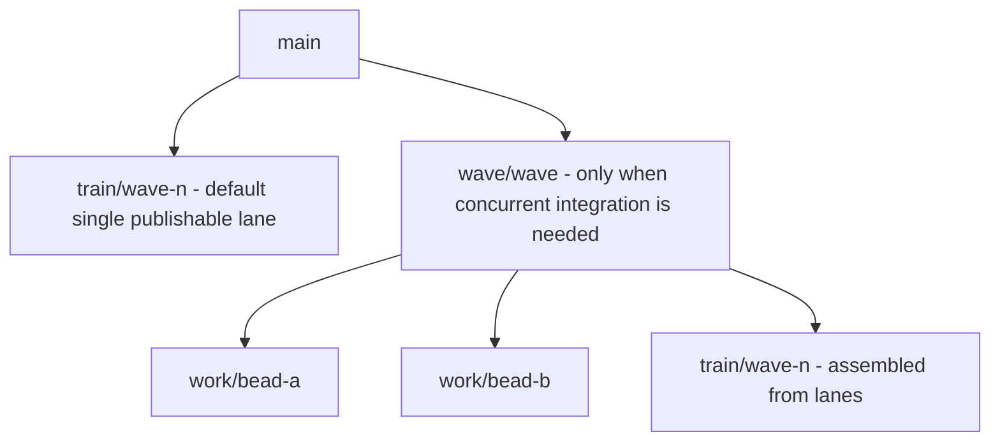
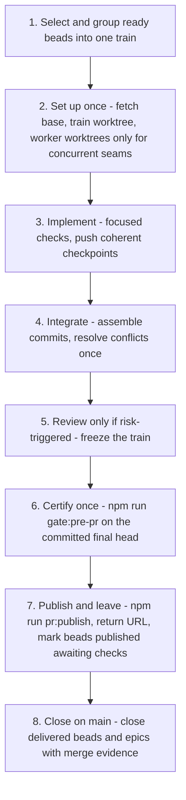

# Orchestration

This page documents how several implementation beads are worked as one delivery
wave: when orchestration is worth its cost, the topology of branches and
worktrees, the change-budget publication window, the single final gate and the
asynchronous publication ceremony, the proportional review policy, and the
delivery-closure rules. It is the process contract for multi-bead work
(`docs/orchestration-process.md` in the repository) plus the mechanics of the
scripts that enforce it.

Precedence: `AGENTS.md` and the current operator instruction win over this
page, and this page's failure-review rules win over any older document, skill,
or tool default that recreates the reviewed failure loops. When prose and code
disagree, the code wins — the gate, publication, hook, and budget scripts under
`scripts/ci/` and `scripts/prewarm-worktree.mjs` are the authority. The
operator-owned project law lives in `docs/PSFN_PROJECT_CHARTER.md`; this page
links to it and never restates it.

## When orchestration exists

Orchestration is not a phase or a ceremony; it exists only to increase
delivered functionality per unit of time and model cost. A multi-bead wave is
orchestrated only when several implementation beads are being worked as one
delivery and when parallelizing genuinely independent seams reduces wall time
after setup and integration cost. If orchestration is slower than one agent
implementing the work sequentially, do not orchestrate.

The purpose is never to maximize lanes, reviews, tracker events, attestations,
or process artifacts. `AGENTS.md` makes the same point structurally: the
project is functionality-constrained, not ceremony-constrained, and a process
action is justified only when it prevents a specific plausible defect, protects
work from loss, or coordinates genuinely concurrent writers.

## The 2026-08-03/04 failure review

The P1 runtime-truth wave demonstrated a process failure: small changes reached
a passing, pushed train, but publication was delayed while agents repeated
review, tracker, bus, gate, and external-check work. The process consumed more
attention than the implementation and made a ready PR feel unfinished. The
causes were in this repository's own instructions, and each cause now has a
replacement rule:

| Cause | Replacement rule |
| --- | --- |
| Review intensity was derived from bead priority | Priority orders work; actual diff risk selects validation and review |
| Review happened per bead and again at the assembled epic seam | Review the final train once; focused tests own bead-local correctness |
| A second reviewer and closure reviewer were routine | At most one independent reviewer by default; another only for a concrete unresolved high-risk question or an explicit operator request |
| Every lane and phase generated bus traffic and tracker evidence | Direct messages and concise bead notes by default; a bus only for concurrent writers who need durable shared findings |
| Clean-main canary and broad gates ran before or during fanout | Focused checks while implementing; `gate:pre-pr` once on the frozen final train head |
| PR publication waited synchronously for CI and paid review | Publication ends when the PR is created; checks are asynchronous and waiting is explicit opt-in |
| Every bead became a separate PR and paid scan | Batch compatible beads into one train to amortize paid scans; tag an under-floor PR as a variance and ship it |
| Worktree isolation was confused with PR ceremony | Every concurrent writer gets a branch and worktree; many worktrees still integrate into one train and one PR |
| Agents stayed with published work until merge and tracker closure | Mark `published, awaiting checks`, return the URL, move on; the merger or later reconciliation closes beads |
| Implementation beads and epics stayed open for post-delivery validation | Delivery to `main` closes the implementation bead or epic; remaining proof moves to a new testing/validation bead |

These are not suggestions. If any later section, older document, skill, or
tool default appears to recreate these loops, the replacement rules win unless
the operator explicitly requests the extra work.

## Value and time guardrails

Before performing any process action, name which of these it buys:

1. prevents a concrete plausible defect in the current diff;
2. protects unpushed work from loss;
3. coordinates a concurrent writer who otherwise lacks needed information; or
4. satisfies the one final publication gate.

If none applies, skip it. Concrete budgets follow:

- **Setup ≤ 10 minutes** before the first useful implementation edit. The
  ordinary setup is `bd prime`, bead claim, target inspection, and
  branch/worktree verification — minutes, not a review cycle.
- **Overhead ≤ ~25%** of active wave time for coordination, review, tracker,
  and publication. Above that boundary, stop optional process and implement.
- **No dispatch for confidence.** Never send an agent to produce confidence,
  restate a diff, or check another agent's paperwork; dispatch only a bounded
  independent implementation seam or a risk-triggered final-train review.
- **No idle lanes.** Never leave an implementation lane idle while compatible
  ready functionality exists; a check, reviewer, or PR may continue
  asynchronously.
- **Urgency cancels ceremony.** Operator words such as `ship`, `publish`,
  `hurry`, or `now` cancel all optional review and reporting; complete only the
  minimum safe focused checks, the final gate, and the requested delivery.

## Choose the smallest topology

### One train lane is the default for one writer

Use one branch and worktree when changes touch overlapping files or contracts,
the same agent can implement them without blocking, setup and integration would
cost more than parallelism saves, or the train is already comfortably within
the hard PR limits. One writer may claim and implement several compatible beads
sequentially in one train lane, recording each bead in the PR body — never one
PR per bead.

### Worktree isolation is mandatory for concurrent writers

When two or more agents or subagents write concurrently, each writer uses a
distinct branch and worktree. This rule applies even when work touches the same
system or files: overlap requires explicit file ownership and integration
ordering, never concurrent edits in one checkout. Workers run focused tests and
push coherent checkpoints; they do not run broad gates or commission reviews.
Parallelism must still repay setup and conflict-resolution cost.

Do not open a wave branch, train branch, and bead branch when a single train
branch suffices. A wave integration branch is useful only for multiple
concurrent lanes or multiple PR trains:



*Worktrees are writer isolation, not PR boundaries: compatible lanes integrate into one train, and a lone sequential writer needs no worktree per bead.*

## Roles

**Implementer** — owns the behavior through focused validation: reads and
claims the scope, inspects the production entrypoint before designing a
parallel abstraction, implements the smallest coherent fix or feature, adds
regression coverage proportional to the changed behavior, runs focused tests
and changed-file lint, commits and pushes coherent non-main checkpoints, and
reports branch, head, focused validation, and any concrete remaining risk.

**Orchestrator** — exists only when there are concurrent lanes. It keeps the
intent, assigns independent seams, resolves integration, assembles the train,
and runs the single final publication gate. It does not commission routine
reviewer swarms, duplicate worker investigations, or turn status reporting into
a separate phase. When one lane finishes, give it another independent
implementation bead if that saves time; otherwise release it — empty agent
slots are not a defect.

## Train composition and the change budget

A bead is a scope and acceptance boundary, not a PR boundary. Combine
compatible ready beads into a coherent train. The change-budget gate
(`check-change-budget.mjs`) fixes the window:

| Budget | Target | Hard maximum |
| --- | --- | --- |
| Files | 15 | 25 |
| Counted changed lines | 1,500 | 2,500 (800-line publication floor) |
| Commits | 5 | 8 |

The limits are not set in stone: variances are fine when the change is
coherent. Tag an out-of-window PR `change-budget:exception` with a one-line
reason, then finish the work. Never reshape, split, pad, or delay a ready
change to fit the numbers. The 800-line floor exists because each PR can incur
a flat paid-review cost regardless of diff size; hold and batch compatible
ready work when that is cheap, and tag the variance and ship when it is not.
Lockfiles (`package-lock.json` and the per-project lockfiles) are excluded from
the line count, and base-integration merge resolutions are counted only for
their genuinely novel paths.

The exception path is itself enforced: `change-budget:exception` requires a
non-empty `## Change-budget exception` section in the PR body, and applying the
label to a change that is actually within the limits is a violation. The label
and its rationale must come together.

## The canonical wave



*The canonical eight-step wave: one setup, one integration, one optional
review, one final gate, one publication, and immediate closure on main.*

1. **Select and group.** Read ready beads, group compatible work into a train,
   and identify only genuinely independent seams.
2. **Set up once.** Fetch the intended base. Create one train worktree, plus
   worker worktrees only for concurrent seams. Install dependencies only where
   missing. A whole-repository clean-main canary is not a routine
   prerequisite.
3. **Implement.** Workers make production and test edits, run focused checks,
   and push coherent checkpoints. No per-bead model review, UBS ceremony, or
   broad gate runs here.
4. **Integrate.** Assemble compatible commits into the train. Resolve conflicts
   once and exercise the affected production composition or contract with
   focused tests.
5. **Review only if risk-triggered.** Freeze the train and apply the review
   policy below. A low-risk train proceeds without a model review.
6. **Certify once.** Commit the clean final head and run `npm run gate:pre-pr`
   once. Fix attributed failures with focused commands before one new
   final-head run.
7. **Publish and leave.** Run `npm run pr:publish`, return the PR URL, mark
   beads `published, awaiting checks`, and assign the next implementation
   work. Do not wait for CI, Greptile, or merge unless the operator explicitly
   requests it.
8. **Close on main.** When the train lands on `main`, close every delivered
   implementation bead and implementation epic immediately with the merge
   evidence. If validation remains, create its new testing bead before
   closure.

## Proportional review policy

### Priority is not risk

P0/P1 means the outcome should be delivered soon; it does not imply the diff
touches a dangerous boundary. Do not select reviewers from tracker priority,
changed-line count alone, or a desire for reassurance.

### No model review by default

Focused tests plus the final gate are sufficient for ordinary fixes, tests,
documentation, UI truth/display changes, local refactors, and owner-file
changes that stay within an existing validated contract.

### One independent review when concrete risk justifies it

Use one independent reviewer on the frozen final train when the diff changes
one or more of:

- authentication, authorization, tenant/companion isolation, secrets, or
  consent;
- destructive persistence, schema migration, backup/restore, or irreversible
  data mutation;
- concurrency, queue ownership, process boundaries, or distributed
  coordination;
- a new externally reachable execution surface;
- production deployment behavior with meaningful rollback risk; or
- a broad cross-subsystem contract whose failure is not covered by focused
  tests.

The reviewer receives the immutable base/head, intent, relevant acceptance
criteria, and the exact risk question, and reports concrete reproducible
blockers — not general improvements. The implementer verifies and fixes
accepted blockers once. Do not schedule a closure reviewer; rerun the focused
regression that proves the fix.

### CLI delegation: Kimi first pass and Pi review

Either CLI runs from the worktree it owns, and the orchestrator resolves the
Bead, branch, immutable base, and current head before invoking it — the model
is never asked to infer its assignment from the backlog. Prompts must name the
outcome, owned files or seam, acceptance criteria, allowed validation,
prohibited actions, and the exact handoff format. For a bounded implementation
pass, Kimi Code runs with the exact `kimi-code/kimi-for-coding` selector while
the orchestrator claims and updates the Bead; Kimi owns only the named worktree
and branch. A typical review pass looks like:

```bash
BEAD_ID="psfn-framework-..."
WORKTREE_PATH="<operator-provided-external-worktree-root>/<review-lane>"
BASE_SHA="<full-base-sha>"
HEAD_SHA="<full-head-sha>"
REVIEW_OUT="/tmp/${BEAD_ID}-kimi-review.txt"

set -o pipefail
cd "$WORKTREE_PATH"
test "$(git rev-parse HEAD)" = "$HEAD_SHA"
test -z "$(git status --short)"
kimi --auto --model kimi-code/kimi-for-coding --prompt "
Perform a read-only first-pass review of Bead $BEAD_ID over the immutable range
$BASE_SHA..$HEAD_SHA. Read AGENTS.md, the complete diff, and the affected
production path and tests.

Acceptance: <paste the complete relevant Bead clauses>.

Look only for concrete correctness, security, isolation, data-loss, or acceptance
blockers introduced by this range. You may run a focused reproduction. Do not edit
files, mutate Git or Beads, open or inspect PRs, read prior model-review output, or
run the broad gate.

Return VERDICT: PASS or VERDICT: BLOCK. For every blocker give severity, file and
line, violated acceptance clause, causal path, and a reproducible check. Separate
nonblocking observations. State every command you actually ran.
" | tee "$REVIEW_OUT"
test "$(git rev-parse HEAD)" = "$HEAD_SHA"
test -z "$(git status --short)"
```

The implementer verifies and fixes accepted Kimi blockers, then freezes the
new head and gives Pi a blind independent review — the Kimi transcript is never
included in the Pi prompt. Every new Pi review uses the exact selector
`zai-coding-cn/glm-5.2` (`pi --approve --no-extensions --no-skills
--no-prompt-templates --model zai-coding-cn/glm-5.2 --thinking medium
--tools read,grep,find,ls,bash`). If either post-run integrity check fails, the
review is invalid: preserve the unexpected changes for inspection and do not
treat the verdict as independent evidence. Do not automatically rerun Kimi
after a fix or commission a third reviewer; verify the accepted blocker
locally, add its focused regression, and continue unless the operator asks for
another review.

A second model reviewer is exceptional: it requires either an explicit
operator request or one concrete high-impact claim that remains materially
ambiguous after the first review and local reproduction. Never use two
reviewers merely because the bead is P0/P1, and never run per-bead review plus
train/epic review.

### Greptile is paid and opt-in

Greptile is a paid, explicitly triggered review. Repository configuration
limits automatic review to PRs carrying `review:greptile` and disables repeat
review on pushes. Do not apply that label, mention the bot, or otherwise
trigger a review unless the operator explicitly requests the spend; priority
alone is never enough. When requested, apply the label once to the frozen final
train — never per bead — and triage findings asynchronously. The wait path
requires Greptile Review only when the label is present.

## Focused validation and one final gate

During implementation: run the smallest test that exercises the changed
behavior, run adjacent contract checks only when the changed boundary demands
them, run changed-file lint or typecheck where relevant, and never run the full
suite after each edit, checkpoint, bead, or integration.

Before the final gate, verify only that (1) the train is within hard limits and
based on the intended fetched base, (2) the worktree and branch are correct and
clean, (3) focused tests for all included beads pass, (4) accepted risk-review
blockers, if any, are covered, and (5) no planned source edit remains. Then run
`npm run gate:pre-pr` on the committed final head. The gate owns broad PREFLIGHT
and HEAVY checks; its exact-head attestation is reused by `npm run pr:publish`,
and the gate is never invoked again on the unchanged head.

If the gate fails, reproduce the specific failed stage, fix its verified cause,
and run that focused command to green. Finish all source edits before
committing one new final head and invoking the broad gate once more. Do not
commission a model review of a gate failure unless the fix itself introduces a
risk trigger.

### Gate mechanics

`run-local-gate.mjs` enforces the preconditions in `resolveLocalGateState`: the
checkout must be on a named branch that is not `main`, the worktree and index
must be clean (commit the exact change first), the base ref (default
`origin/main`) must be an ancestor of HEAD, and HEAD must differ from the base.
`buildGatePlan` turns the changed paths into an ordered gate list —
always-on delivery and policy gates (`ci-rules`, `change-budget`,
`commit-identities`, `public-sanitize`, `startup-owner-files`, `semgrep-diff`,
`ubs`), root-versus-diff-scoped lint/build/typecheck/test gates, and
conditional specialist gates (settings contract, supply chain, Garden UI,
companion UI, Satellite Hub, evals, and changed-workflow analysis) — partitioned
into a **preflight** phase of cheap parallel-safe gates that take no machine
lock and a **heavy** phase (the product and Postgres test suites) serialized
machine-wide by a lock directory whose dead-owner and metaless orphans are
reclaimed under a reap mutex.

Every gate flows through an orchestrator that reuses a passing stage record
when gate version, base, command, and (for content-manifested gates) the input
hash match, so a partial rerun on the same head reuses earlier passes. A fully
passing run writes an attestation binding the exact head, base, `baseRef`,
ordered gate list, and command plan to
`.git/local-delivery-gate/attestation.json`; the attestation is invalid
whenever head, base, gate version, gate list, or command plan changes. The
canary variant (`npm run gate:canary`) checks out exactly `origin/main` and
runs the full gate against an empty diff as a clean-main certification,
recording `canary-attestation.json`; a red canary stops a multi-PR wave before
branch fanout.

## Publication is asynchronous

Publish through the tracked wrapper:

```bash
npm run pr:publish -- --title "<title>" --body-file <path>
```

The default command validates the exact-head attestation, pushes the branch,
creates or updates the ready PR, prints its URL, and returns. CI and external
services continue asynchronously. Only when the operator explicitly asks this
session to monitor checks, opt in:

```bash
npm run pr:publish -- --wait --title "<title>" --body-file <path>
```

Do not poll a PR in the foreground, spend a subagent on passive waiting,
repeatedly rerun Actions, re-request Greptile, or toggle labels to manufacture
events. A later merge/triage session handles failures and closes delivered
beads. If a required check is unavailable, report that fact; it does not undo
implementation or justify waiting on every other ready lane.

### The publication ceremony

`publish-pr.mjs` refuses to run unless `core.hooksPath` is `.githooks` and the
checkout is on a named non-main branch. It fetches the intended base, re-runs
the gate with the change-budget exception and PR body metadata supplied as
environment, validates the exact-head attestation, requires the authenticated
`gh` user to be the configured `LOCAL_GATE_STATUS_ACTOR`, validates that every
requested label exists, pushes the exact attested head (a `--force-with-lease`
update only when the branch already exists, under `PSFN_ATTESTED_PUBLISH=1`),
publishes a `local-gate/v1` commit status whose description pins the base, and
creates or updates the PR. A new PR requires `--title` and `--body-file`; a
labeled new PR is created in draft, gets its labels, and is then flipped ready
so CI and paid review never run against a stale head. The command returns the
PR URL and, without `--wait`, reports that checks continue asynchronously.

### Fail-closed pre-push hook

The tracked pre-push hook (`pre-push.mjs` behind `.githooks/pre-push`) is the
last line of delivery safety. It blocks direct pushes to `main`, remote branch
deletions, pushes that are not exactly the checked-out branch HEAD pushed to
its same-name remote branch, and non-fast-forward checkpoint pushes. Only an
attested publication — `PSFN_ATTESTED_PUBLISH=1` plus a valid exact-head gate
attestation for the configured base — may update the branch with
`force-with-lease`. Publication fails closed unless the hook is active.

### CI re-verifies instead of repeating

GitHub CI does not repeat the broad local suites. The `github-policy` job
re-verifies the remote `local-gate/v1` status for the exact head and base from
the trusted issuer (`verify-pr-attestation.mjs`), re-runs the change-budget and
commit-identity allowlist checks, and verifies public-repository sanitation;
the `ci-required` aggregate job requires `github-policy` success, so the PR
cannot pass without the attestation-backed validation.

### Opt-in waiting

`wait-for-pr.mjs` (also `--wait` inside `publish-pr`) requires `ci-required`
plus `Greptile Review` only when the `review:greptile` label is present. It
fails immediately on a PR head mismatch or a failed check, times out after 45
minutes, and after a successful wait surfaces live inline review comments,
refusing success while a live P0/P1 finding exists (outdated comments are
listed but never block).

## Delivery closure and the testing split

An implementation bead's lifecycle ends when its implementation is present on
`main`. The merging session or the next reconciliation sweep closes it
immediately and cites the main commit or merged PR. Do not keep implementation
beads or epics open for manual, live, deployment, regression, release, or
acceptance testing.

If proof remains after delivery, create a new testing or validation bead before
closing the implementation bead. The new bead must use `kind:chore` and
`system:testing` unless a more specific testing contract is already canonical,
link `discovered-from:<implementation-id>`, name the exact environment,
command, fixture, or observable evidence required, and define independent
pass/fail acceptance criteria. Any failure it discovers creates a new bug bead.
Never reopen the delivered implementation bead, and never keep an
implementation epic open as a testing umbrella. This split does not weaken
focused checks or the single pre-PR gate; it prevents post-delivery testing
from falsifying implementation status.

## Tracker and handoff discipline

Beads should preserve state without becoming a second implementation:

- one claim before edits;
- a checkpoint note only when another session may need to resume;
- one publication note with branch, exact head, focused tests, gate result, and
  PR;
- immediate implementation closure after merge, with remaining proof moved to a
  new testing bead.

Do not append command-by-command progress, duplicate the same evidence across
multiple beads, or keep an agent idle to close a bead in the same motion as
merge. Statuses are reserved accurately: `implemented`, `checkpoint-pushed`,
`gated`, `published, awaiting checks`, and `done` only for code present on
`main` with the bead closed. A worker handoff needs only:

```text
Beads: <ids>
Branch/head: <remote branch>@<sha>
Implemented: <outcome>
Validation: <focused commands and final gate if run>
Concrete remaining risk: <none or exact risk>
Next action: integrate | publish | async checks | fix <failure>
```

The tracker itself is the `bd` CLI: `bd prime` starts tracked work, every new
bead carries `kind:<bug|feat|chore|design>` and one `system:<system>` label,
search-before-create and `discovered-from:<parent-id>` keep the graph
deduplicated, the local shared Dolt server is authoritative (`bd dolt commit`
persists state; `bd dolt push` runs only on an explicit operator request), and
closure evidence cites the main commit or merged PR.

## Bus use

Direct agent messages, commits, and bead notes are the default. Open an agent
bus only for two or more concurrent writers who need durable cross-lane
findings and only when that record will reduce rather than add coordination
time. Do not open a bus merely because a wave has multiple phases or reviewers;
do not install an embedding model, embed every message, deduplicate routine
status, or make bus lint a publication gate unless the run actually relied on
the bus as its handoff record.

## Git and operational safety

- Push coherent non-main checkpoints so work is remotely durable; a checkpoint
  push is remote backup, not publication.
- Direct pushes to `main` remain prohibited without a current explicit operator
  exception.
- At assignment and before the first edit, every writer and subagent verifies
  its explicit worktree path, owned branch, HEAD, and expected base; repeat the
  check before commit, merge, cherry-pick, rebase, or revert; abort on
  mismatch.
- Never manually force-push, delete worktrees/branches/stashes, or rewrite
  shared history. The exact-head publisher is the only normal lease-protected
  update path; otherwise rebase before publication when the base moves.
- A parked lane is still remotely durable: its bead note records the remote
  branch, exact pushed head, validation state, and blocker. Local-only parking
  is forbidden.
- Preserve fail-closed security and configuration contracts. Runtime and
  framework operations follow `docs/operations.md`; live deployment remains
  operator-directed and requires an explicitly supplied external configuration
  location.
- Manual, live, deployment, and release validation are separate work tracked in
  new testing beads; they never reopen a completed implementation loop.

## Worktree bootstrap and the shared npm cache

Every clone runs `npm run hooks:install` once: it configures
`core.hooksPath=.githooks` under `extensions.worktreeConfig` so linked
worktrees inherit the tracked hooks automatically, and installs the `gh` alias
`gated-pr` expanding to `npm run pr:publish`. The installer refuses to replace
a custom hooksPath, existing hooks, or a differing alias.

The tracked post-checkout hook runs `bootstrap-worktree.mjs`, which prewarms
npm's shared content cache from the repository lockfile in disposable
directories, attests the cache with the lockfile SHA-256 only after a clean
offline install proves the complete dependency graph, and then installs
lockfile-exact, worktree-local `node_modules` without network access. Mutable
`node_modules` directories are never linked or shared between worktrees; a new
lockfile hash selects a new attestation and forces a rewarm.

## How this document is maintained

This page is generated by OpenWiki from repository source and copied into
`docs/` by `scripts/sync-openwiki-to-docs.mjs`, which skips
`INSTRUCTIONS.md`, `index.md`, `log.md`, and `quickstart.md` and refuses to
overwrite the operator-frozen `PSFN_PROJECT_CHARTER.md`. The scheduled
`openwiki-update` and `openwiki-docs` workflows regenerate the wiki and open
their own automated PRs on dedicated branches (`openwiki/update`,
`openwiki/docs-update`) outside the agent publication ceremony; do not
hand-edit generated OpenWiki pages — update source and docs instead.

## Related pages

- [internal-review.md](/openwiki/process/internal-review.md) — the pre-PR gate,
  attestation, change budget, commit identity, and CI re-verification pipeline.
- [adversarial-review.md](/openwiki/process/adversarial-review.md) — the
  complementary security scanners and regression-first bugfixing practices.
- [automata-bus.md](/openwiki/faculties/automata-bus.md) — the durable finding
  ledger used only when concurrent writers need shared findings.
- [maintenance-scripts.md](/openwiki/process/maintenance-scripts.md) —
  migration and maintenance tooling that ships through these same waves.
- [productivity-pack.md](/openwiki/process/productivity-pack.md) — the delivery
  practices and prompts that feed this pipeline.
- [development-status.md](/openwiki/development-status.md) — what is actually
  true in source now, tracked separately from the live bead graph.
