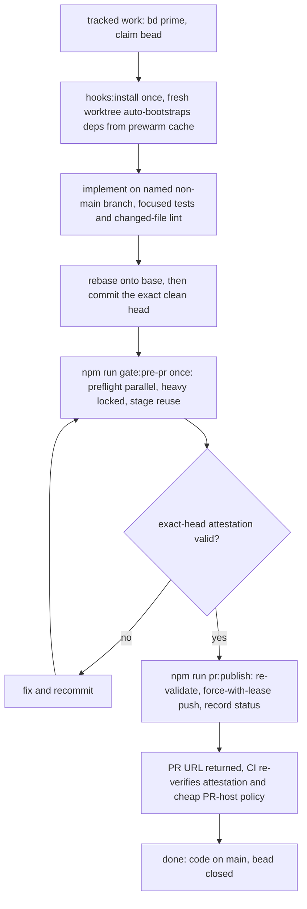

# Productivity pack

The **productivity pack** is the curated set of workflow accelerators and
prompts that compress engineering process overhead without skipping required
gates: the `AGENTS.md` operating contract, the Beads tracker commands, the
worktree bootstrap and hook installation, the one-shot `gate:pre-pr` with its
exact-head attestation and stage reuse, the `pr:publish` ceremony, the
structural hygiene verification gates, and the maintenance CLI in
`src/app/maintenance/`. This page is the map of that pack; the detailed
mechanics of the gate, review, orchestration, and maintenance families live on
their own pages ([internal review](/openwiki/process/internal-review.md),
[orchestration](/openwiki/process/orchestration.md),
[maintenance scripts](/openwiki/process/maintenance-scripts.md),
[self-eval prompt audit](/openwiki/process/self-eval-prompt-audit.md)).

Do not confuse this page with `docs/productivity-pack.md`, which is the
**Personal Operations Pack** — a product-layer design for one designated
companion operating the partner's work and external personal systems under
explicit delegation. That is product direction (accepted design, mostly target
design in source), not engineering tooling. This page documents the
engineering accelerators only; source and tests are the authority for both, and
when prose and code disagree, the code wins.

## The cost rule: process must earn its cost

The pack exists because this repository is functionality-constrained, not
ceremony-constrained. A process action — and therefore any productivity tool in
this pack — is justified only when it does one of three things:

1. prevents a specific plausible defect in the current diff;
2. protects unpushed work from loss; or
3. coordinates genuinely concurrent writers.

Producing more tracker, review, bus, gate, or status artifacts is not progress
by itself (`AGENTS.md#L18-L24`). Concrete guardrails follow from the rule
(`AGENTS.md#L26-L62`):

- **Setup ≤ 10 minutes.** The ordinary start of tracked work is `bd prime`,
  bead claim, target inspection, and branch/worktree verification — minutes,
  not a review cycle.
- **Overhead ≤ ~25%.** If non-implementation work exceeds roughly a quarter of
  the active task time, stop every optional process activity and return to
  implementation.
- **No dispatch for confidence.** Never send an agent to produce confidence,
  restate a diff, or check another agent's paperwork; dispatch only bounded
  independent implementation seams or a risk-triggered final-train review.
- **Urgency cancels ceremony.** Operator words such as `ship`, `publish`,
  `hurry`, or `now` stop all optional review and documentation work
  immediately; finish only the minimum safe validation and delivery actions.

The same rule gates new accelerators: a productivity tool earns its place only
when it prevents a specific defect, protects work from loss, or coordinates
concurrent writers — never because it produces more artifacts.

## The operating contract and the on-demand prompts

`AGENTS.md` is the repository map and operating contract for coding agents. It
defines precedence (current operator instructions win; runtime and
configuration contracts win when prose has drifted) and points to detailed
workflow documents that are loaded only when the task needs them
(`AGENTS.md#L3-L16`):

| Prompt | Load when |
| --- | --- |
| `docs/orchestration-process.md` | Multi-bead or multi-PR implementation wave |
| `docs/internal-review-workflow.md` | Portable gate/reviewer setup |
| `docs/adversarial-review-and-bugfixing-practices.md` | High-risk review practices |
| `docs/operations.md` | Runtime and framework operations |

The prompt pack around the contract is deliberately thin: `CLAUDE.md` is a
managed pointer to `AGENTS.md` (`repo://CLAUDE.md#L1-L6`); `GEMINI.md` tells
agents to reach for CodeGraph (when a `.codegraph/` directory exists) before
grep/find when locating code (`repo://GEMINI.md#L1-L10`); `.cursor/mcp.json` and
`.gemini/settings.json` wire the `codegraph` MCP server into the IDEs; and the
tracked `skills/` directory holds just-in-time skills (`mermaid-diagrams` for
generated diagrams, `write-connector` for new OpenWiki connectors) that are
read only when a task matches their description. Local IDE settings and any
machine-specific paths are never part of the documented pack.

## Beads: the durable tracker

Beads is the durable, shared issue tracker for this repository. Run `bd prime`
at the start of tracked work, use `--json` for programmatic operations, and
never use the interactive `bd edit` command. The compact quick-reference
(`AGENTS.md#L392-L408`):

```bash
bd ready --json
bd show <id> --json
bd update <id> --claim --json
bd create "Title" --description "Self-contained task details" \
  --acceptance "Checkable completion criteria" -t task -p 2 \
  -l kind:chore,system:agent-tooling --json
bd close <id> --reason "Commit, validation, and delivery evidence" --json
bd dolt commit --json
```

The tracker rules that keep it cheap (`AGENTS.md#L109-L161`): search before
creating; every new bead carries one `kind:` and one `system:` label; link
discovered work with `discovered-from:<parent-id>`; close an implementation
bead as soon as its implementation is present on `main` (manual, live, or
deployment testing is not a reason to keep a delivered bead open — move
remaining proof to a new testing/validation bead); the local shared Dolt server
is authoritative, commit local bead changes with `bd dolt commit --json`, and
never run `bd dolt push` unless the operator asks; keep `export.git-add` at
`false` and never stage `.beads/` state.

## Bootstrap and hooks

`npm run hooks:install` must run once in every clone. It verifies the local
toolchain (`npm run tools:doctor`, implemented by
`scripts/ci/check-local-tools.mjs` — Node `>=24.19.0 <25`, UBS `5.3.7`,
git/gh/docker availability and `gh auth status`), checks that the tracked
`.githooks/pre-push`, `post-checkout`, `post-merge`, and `post-rewrite` exist
and are executable, then configures `core.hooksPath=.githooks` in the shared
git directory so linked worktrees inherit the tracked hooks automatically
(`repo://scripts/ci/install-local-hooks.mjs#L28-L79`).
It refuses to replace a custom `core.hooksPath`, disable existing hooks, or
overwrite a divergent `gh` alias; it installs the `gated-pr` gh alias as
`!npm run pr:publish -- "$@"` when absent. Publication fails closed unless the
tracked pre-push hook is active.

The tracked `post-checkout` hook (`repo://.githooks/post-checkout`) automatically
installs only the root project's lockfile-exact, worktree-local dependencies
when a fresh worktree is created or the root lockfile changes
(`AGENTS.md#L91-L96`). The install goes through
`scripts/ci/bootstrap-worktree.mjs` (`deps:ensure`), which asserts the project
path against the known npm project contract, verifies the Node version from
`.node-version`, and requires `node_modules` to be a real directory — never a
symlink to a shared mutable store
(`repo://scripts/ci/bootstrap-worktree.mjs#L31-L98`).
Specialist gates install their own project dependencies lazily when selected.

`npm run prewarm` prepares the shared npm content cache without sharing mutable
worktree output: it runs `npm ci --ignore-scripts` only in disposable
directories, proves the lockfile's complete graph installs offline, and only
then writes a lockfile-SHA-256 attestation inside the cache
(`repo://scripts/prewarm-worktree.mjs#L1-L25`). A new
`package-lock.json` hash selects a new attestation and forces a rewarm;
`--check` fails on missing or mismatched attestations, and no `node_modules`,
`dist`, test cache, or git state is ever linked or reused
(`repo://scripts/prewarm-worktree.mjs#L49-L65`).

## The one-shot pre-PR gate

`npm run gate:pre-pr` is the single final validation of an exact committed
train head; it is never run on worker checkpoints and a passing attestation for
an unchanged head is never rerun (`AGENTS.md#L46-L47`). The entrypoint
`scripts/ci/run-local-gate.mjs` enforces the contract:

- **Named non-main branch, clean tree, base ancestor.** The gate refuses to run
  on `main`, requires a named branch, a clean worktree and index, and requires
  `origin/main` to be an ancestor of `HEAD` (rebase before validating)
  (`repo://scripts/ci/run-local-gate.mjs#L51-L95`).
- **Diff-scoped plan.** `buildGatePlan` inspects the changed paths and builds
  the exact gate list for that diff (whole-repo gates when the scope requires
  them, targeted tests otherwise)
  (`repo://scripts/ci/local-delivery-contract.mjs#L101-L339`).
- **Two phases.** Cheap, parallel-safe preflight gates run first with no lock;
  the heavy product/Postgres suite runs second, serialized machine-wide by a
  single directory lock at `${tmpdir}/local-delivery-gate-heavy.lock` whose
  holder metadata and stale-lock reap live beside it
  (`repo://scripts/ci/local-delivery-contract.mjs#L40-L45`,
  `repo://scripts/ci/run-local-gate.mjs#L374-L440`,
  `repo://scripts/ci/run-local-gate.mjs#L575-L598`).
  A lock directory that stays metaless past the 10-second grace period is
  reclaimed as an orphan; a lock whose PID is provably dead (ESRCH) may be
  reaped, never one owned by a live process
  (`repo://scripts/ci/run-local-gate.mjs#L241-L320`).
- **Stage reuse.** Gates with a complete content-input manifest can reuse a
  passing stage record from a different head when those inputs are identical;
  unmanifested gates reuse only on the exact head+base+gate-version. The final
  attestation always remains exact-HEAD
  (`repo://scripts/ci/run-local-gate.mjs#L155-L176`,
  `repo://scripts/ci/run-local-gate.mjs#L600-L644`).
- **Attestation.** On success the gate writes an exact-head attestation to
  `.git/local-delivery-gate/attestation.json`; `--plan` prints the plan without
  running, `--force` reruns, and a valid cached attestation short-circuits the
  run (`repo://scripts/ci/run-local-gate.mjs#L646-L695`).
- **Canary.** `gate:canary` verifies the checkout is exactly `origin/main` with
  a clean tree (fetching the true remote tip first), then runs the full gate
  against main itself with every diff-scoped gate skipped explicitly; a red
  canary stops a multi-PR wave before branch fanout
  (`repo://scripts/ci/run-local-gate.mjs#L97-L127`,
  `repo://scripts/ci/run-local-gate.mjs#L703-L735`).

The planned gate list covers `ci-rules`, `change-budget`, `commit-identities`,
`public-sanitize`, lint (full `lint` or `lint:changed`), `typecheck`
(baselined), `companion-id-types`, `repository-hygiene:structural`, `build` or
`runtime-build`, `startup-owner-files`, semgrep (rules self-test and diff
scan), UBS, and the test families (`tests`, `targeted-tests`, `related-tests`,
`unit-tests`, `script-tests`, `integration-tests`), plus conditional gates for
the settings contract, supply chain, Garden UI, companion UI, satellite hub,
evals, and changed GitHub-workflow analysis
(`repo://scripts/ci/local-delivery-contract.mjs#L138-L338`).

## Change budget and commit identities

Two cheap gates keep the train reviewable. `verify:change-budget`
(`scripts/ci/check-change-budget.mjs`) enforces the publication window of
800–2,500 counted changed lines, at most 25 files, and at most 8 commits
(targets 1,500 lines / 15 files / 5 commits), excluding lockfiles; the
`change-budget:exception` label or `--exception` with a non-empty rationale in
the PR body is the variance path, and an out-of-window PR is tagged
`change-budget:exception` with a one-line reason instead of being padded,
reshaped, or delayed (`AGENTS.md#L339-L343`,
`repo://scripts/ci/check-change-budget.mjs#L19-L37`).

`verify:commit-identities` checks every commit in the range against the
allowlist — the fixed defaults plus `delivery.allowedCommitEmail` git config
and the `DELIVERY_ALLOWED_COMMIT_EMAILS` repository variable — with preserved
import heads exempt; rejected identities are never printed in CI diagnostics
(`AGENTS.md#L242-L245`, `repo://scripts/ci/commit-identity-check.mjs#L9-L46`).

## Publication ceremony

`npm run pr:publish` (`scripts/ci/publish-pr.mjs`) is the only sanctioned path
to a PR. It refuses to run without the tracked hooks installed or from `main`,
fetches the intended base, records `branch.<branch>.psfnGateBase`, runs the
local gate with change-budget metadata, re-validates the exact-head
attestation, verifies the authenticated `gh` Partner is the configured
`LOCAL_GATE_STATUS_ACTOR`, then pushes with an exact-remote
`--force-with-lease` under `PSFN_ATTESTED_PUBLISH=1`, confirms the remote head
matches the attested head, records the local-gate success status on the head,
and creates or updates the PR (draft-first when labels are requested)
(`repo://scripts/ci/publish-pr.mjs#L238-L360`,
`repo://scripts/ci/publish-pr.mjs#L189-L236`). The
pre-push hook (`scripts/ci/pre-push.mjs`) evaluates the pushed refs and, when
`PSFN_ATTESTED_PUBLISH=1` is set, re-validates the attestation before allowing
the push — a checkpoint push without it is remote backup, not publication
(`repo://scripts/ci/pre-push.mjs#L32-L72`, `AGENTS.md#L78-L106`).

Publication is asynchronous: the ceremony ends when the PR URL is returned
(`--wait` only when the operator explicitly asks this session to monitor
checks), CI re-verifies the exact local-gate attestation plus the cheap PR-host
policy without repeating the broad suites, and the worker records
`published, awaiting checks` and moves on (`AGENTS.md#L52-L57`,
`AGENTS.md#L388-L390`). Delivery is remote by default: every checkpoint push
is durable backup rather than publication, direct pushes to `main` are
prohibited, and `done` is reserved for code present on `main` with the bead
closed (`AGENTS.md#L78-L106`).

## Structural hygiene verification gates

`verify:repository-hygiene:structural` composes the scanner gates that keep the
repository from regressing; the plan runs it whenever the diff touches root
validation scope (`repo://package.json#L169-L170`). The gates are:

- `verify:intake-sink-wiring`, `verify:identity-literals` (tracked identity and
  path literals, with the `psfn-framework-<id>` bead-namespace exemption),
  `verify:actor-terminology` (retired copy terminology such as
  "Partner", "Partner", "operator"),
  `verify:model-facing-tool-guidance`, `verify:dependency-cycles`,
  `verify:shared-type-guards`, `verify:model-usage-capture`,
  `verify:postgres-only` (no SQLite runtime imports), and
  `verify:public-sanitize` — local runs require
  `PUBLIC_SANITIZE_REQUIRE_LOCAL_BLOCKLIST=1` plus a local blocklist
  (`workspace/sanitize/local-blocklist.json` or an external path), while CI
  runs the generic privacy rules without tracking or printing private values
  (`AGENTS.md#L236-L245`).

The baseline-backed gates are **reduction-only**: fix the source or remove
resolved entries, never grow a baseline to silence a gate
(`AGENTS.md#L285-L322`):

- `verify:hardcoded-settings` is an AST-based gate over policy-shaped literal
  declarations at any scope (including `CHILD_SOURCE`/`WORKER_SOURCE`
  templates) and low-noise literal call-site shapes; `--update` may write the
  mechanical inventory but exits nonzero until every extended-form entry has a
  reviewed justification note, and it never invents code ownership
  (`repo://scripts/verify-hardcoded-settings.mjs#L1-L37`).
- `verify:knip` rejects new unused files, exports, and types against a
  reduction-only baseline (`config/knip-baseline.json`); new unused files fail
  precisely as an explicit sorted path list
  (`repo://scripts/verify-knip-baseline.mjs#L1-L21`).
- `verify:duplicate-type-names` rejects new exported interface/type/enum
  duplicates or shape collisions; existing debt lives in
  `config/duplicate-type-baseline.json` with mandatory review notes.
- `verify:todo-bead-links` requires every `TODO`, `FIXME`, `HACK`, or `XXX`
  source comment to name its owning Bead in parentheses, with a reduction-only
  baseline in `config/todo-comment-baseline.json`
  (`repo://scripts/check-todo-bead-links.mjs#L1-L51`).

## Settings and contract gates

`verify:settings-contract` enforces the settings ownership chain (owner-file
contract, Garden exposure, and tests); the gate plan adds it whenever
`.env.example`, runtime contracts, or config/settings sources change
(`repo://scripts/verify-settings-contract.ts#L1-L13`,
`repo://scripts/ci/local-delivery-contract.mjs#L281-L287`).
`verify:startup-owner-files` and `verify:supply-chain` (pinned dependency
policy, run when lockfiles or Dockerfiles change) complete the contract layer;
`preflight:startup-owner-files` and `preflight:owner-file-modes` run the cheap
startup checks earlier, and `verify:backup-restore` certifies the backup path
(`repo://package.json#L133-L135`, `repo://package.json#L172-L173`).

## Maintenance CLI

One-off repairs, migrations, backfills, audits, cleanup, and seeding live under
`src/app/maintenance/` behind the shared harness `cli-harness.ts`
(`parseCommonMaintenanceArgs` for the common grammar, `bootstrapMaintenanceRuntime`
for config/TLS/secret hydration and the timestamped backup dir, and
`runMaintenanceCli`/`runRepairCli` for fail-closed execution)
(`repo://src/app/maintenance/cli-harness.ts#L35-L90`,
`repo://src/app/maintenance/cli-harness.ts#L127-L169`,
`repo://src/app/maintenance/cli-harness.ts#L189-L267`).
The discipline is identical across the family: dry-run by default, `--apply`
(or equivalent) to write, timestamped backups before mutation, and fail closed
on unknown arguments and ambiguity. The full inventory and safe-to-run
conditions are on the [maintenance scripts](/openwiki/process/maintenance-scripts.md)
page; this pack only claims the accelerator surface (`session:repair*`,
`migrate:*`, `memory:repair:*`, `audit:*`, `shakedown:cleanup`,
`satellite:retire-synthetic`, and the fleet snapshot/restore commands wired in
`package.json`).

## The wiki regeneration loop

The `openwiki/` tree is generated, not hand-edited: the scheduled
`openwiki-update` workflow regenerates it and opens a PR touching `openwiki/`,
`AGENTS.md`, `CLAUDE.md`, and the workflow itself
(`repo://.github/workflows/openwiki-update.yml#L13-L63`,
`AGENTS.md#L410-L421`). `docs:openwiki:sync` copies the wiki into `docs/` after
every run, skipping `INSTRUCTIONS.md`, `index.md`, `log.md`, and
`quickstart.md`, and refusing to overwrite the frozen
`PSFN_PROJECT_CHARTER.md`
(`repo://scripts/sync-openwiki-to-docs.mjs#L6-L29`).
`.openwikiignore` defines the read boundary so private or runtime paths are
never scanned into generated docs (`repo://.openwikiignore`).

## The delivery flow at a glance



*One implementer, one train: the pack compresses setup, validation, and
publication to a single exact-head gate and an asynchronous ceremony, and every
accelerator is justified by preventing a defect, protecting work from loss, or
coordinating concurrent writers.*

Related pages: [internal review](/openwiki/process/internal-review.md) (the
gate and review boundaries), [orchestration](/openwiki/process/orchestration.md)
(multi-bead waves and delivery windows), [maintenance scripts](/openwiki/process/maintenance-scripts.md)
(the CLI inventory and safety discipline),
[self-eval prompt audit](/openwiki/process/self-eval-prompt-audit.md) (the
audit tooling that keeps self-eval prompts honest), and
[operations](/openwiki/operations.md) (lifecycle commands).
