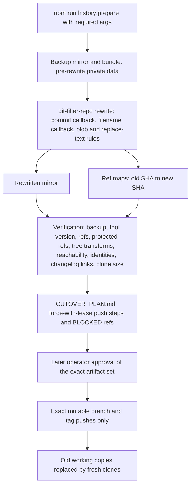
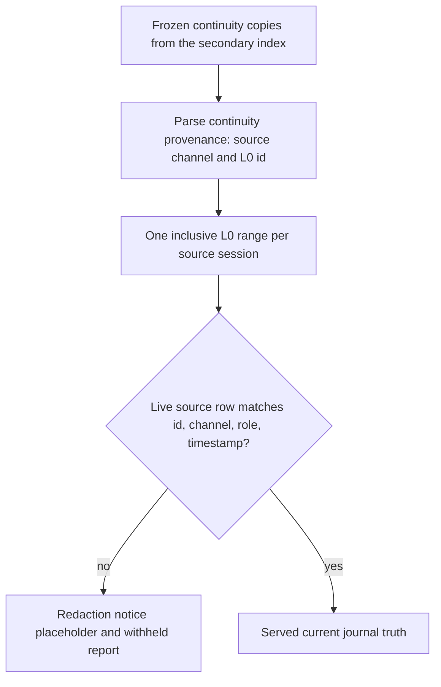

# Public history rewrite

Deleting private files in a new commit does not remove them from earlier Git
objects: every reachable mutable ref still points at a graph whose historical
objects carry the private surface. Before this repository is made public, the
public history rewrite rewrites the entire reachable graph, strips private
deployment surfaces, rewrites private identities to a public persona, remaps
changelog links to the rewritten SHAs, and produces exact lease-protected
cutover and rollback commands.

The entrypoint is `scripts/history/public-history-rewrite.mjs`, invoked as
`npm run history:prepare` (`repo://package.json#L46`). The implementation module
lives under `scripts/history/`, which the OpenWiki read boundary
(`.openwikiignore`) excludes from scans; its behavior is pinned by
`scripts/ci/public-history-rewrite.test.mjs` and documented in the operator
runbook `docs/public-history-rewrite.md`. Source and tests are the authority —
when prose and code disagree, the code wins.

## Scope: what may be rewritten, what never is

The rewrite covers the **entire reachable Git graph** of the private repository:
historical blobs, commit identities, filenames, and the changelog's commit links.
It is the repository-level counterpart of the runtime's append-only canon
discipline. Where the Git rewrite purges private history **before** publication,
the data layer keeps the canonical record append-only and redacts derived copies
at read time. The append-only canon rule itself is charter law
([`docs/PSFN_PROJECT_CHARTER.md`](../../docs/PSFN_PROJECT_CHARTER.md)), and it
draws the hard boundary: canonical L0 session journals are never rewritten, and
derived surfaces (continuity copies, persisted turn records) are rebuilt or
redacted at read time instead of being frozen as truth.

Two kinds of refs are likewise out of scope for the cutover itself: server-owned
refs (`refs/pull/*`) and protected refs (`refs/dolt/*`) are never touched by the
push plan — changed ones are reported as blocked (see
[Ref classification and cutover plan](#ref-classification-and-cutover-plan)).

## Safety rules

- **Preparation is read-only with respect to the source remote.** It never
  pushes and never mutates the origin; it clones into a fresh output directory
  and keeps all private material there.
- **Never manually force-push or rewrite a shared branch.** Rebase before
  publication when the base moves; the exact-head `pr:publish` wrapper alone may
  update a branch with an attestation-checked, exact-remote
  `--force-with-lease` (`repo://AGENTS.md#L99-L101`).
- **Fail closed.** Missing required arguments, malformed replacement rows,
  duplicate or escaping removal paths, and changelog links whose commits were
  pruned all abort instead of guessing.
- **Backup before rewrite, authorization before cutover.** The pre-rewrite graph
  is mirrored and bundled before any rewrite runs, and preparation/local
  rehearsal never authorizes the remote mutation — a later operator instruction
  must approve the exact artifact set.
- **Private stays private.** The backup bundle and raw mirrors contain pre-rewrite
  private data; the output directory is ignored and private by design, and after
  cutover old working copies are replaced with fresh clones so private objects
  cannot be pushed back accidentally.

## Preparation pipeline

Preparation is read-only with respect to the source remote and produces:

- a **backup mirror and bundle** containing the pre-rewrite graph (private data —
  the output directory must stay ignored and private);
- a separate **rewritten mirror**;
- **ref maps** from old SHAs to rewritten SHAs;
- **validation evidence**; and
- a **cutover plan** with exact lease-protected push and rollback commands.

Every run uses a new output directory (`workspace/history-rewrite/<run-id>`).
The command requires the complete private origin URL, the public identity, a
pinned `git-filter-repo` binary, and the two private input files:

```bash
npm run history:prepare -- \
  --source <complete-private-origin-url> \
  --output workspace/history-rewrite/<run-id> \
  --public-name "PSFN Maintainer" \
  --public-email "maintainer@example.invalid" \
  --filter-repo workspace/history-rewrite/filter-repo-venv/bin/git-filter-repo \
  --private-replacements workspace/history-rewrite/private-replacements.txt \
  --private-remove-paths workspace/history-rewrite/private-remove-paths.txt
```

Argument parsing fails closed: `--source`, `--output`, `--public-name`,
`--public-email`, `--filter-repo`, `--private-replacements`, and
`--private-remove-paths` are all required, a missing `--source` throws, and the
public email must be syntactically valid. `--main-ref` is optional and defaults
to `refs/heads/main` (`repo://scripts/ci/public-history-rewrite.test.mjs#L27-L56`).

**Preconditions.** The source repository stays private and Git writers are
frozen for the duration. The runbook pins the rewrite tool to exactly
`git-filter-repo==2.47.0` installed in an ignored environment. The replacement
file (every private identity, hostname, address, and operator path that may have
appeared in history) and the removal file (additional exact private paths) are
also ignored inputs (`repo://docs/public-history-rewrite.md#L96-L104`).



*The history:prepare pipeline: read-only preparation, verified rewrite, then an operator-authorized cutover that touches only mutable refs.*

## Replacement and removal inputs

The private replacement file accepts one rule per row in
`PATTERN==>REPLACEMENT` form, with a kind prefix
(`repo://scripts/ci/public-history-rewrite.test.mjs#L82-L104`):

| Prefix | Effect |
| --- | --- |
| `literal:` | Exact-text replacement in blobs and messages |
| `regex:` | Regular-expression replacement |
| `path-literal:` | Exact-path replacement that also renames historical filenames |
| `path-regex:` | Regex path replacement that also renames historical filenames (`renamePath: true`) |

Rows are assigned deterministic names in row order, and any row without the
`==>` separator is rejected (`PATTERN==>REPLACEMENT` error). The module also
ships built-in replacement rules that rewrite private network examples to
documentation addresses in `192.0.2.0/24`. These run together with the parsed
rules through every rewrite surface: `applyReplacementRules` sanitizes text,
`rewriteBlob` sanitizes blob bytes, and `renameIdentityPath` renames
identity-bearing paths such as `deployment/private-companion-watchdog.service`
(`repo://scripts/ci/public-history-rewrite.test.mjs#L58-L80`).

The private removal file lists additional exact private paths not covered by
the built-in removal list. `parsePrivateRemovalPaths` normalizes entries to
repository-relative paths (paths escaping the repository are rejected),
rejects duplicates, and requires at least one path
(`repo://scripts/ci/public-history-rewrite.test.mjs#L106-L120`). Path removal
matches any historical path under the listed prefixes (`isRemovedHistoryPath`),
so `working_docs/` strips `working_docs/nested/note.md` while leaving
`docs/public.md` untouched. The built-in removal list strips all historical
Beads snapshots, working docs, deployment trees, shakedown material, private
Trivy configuration, context packets, module registries, and repository-local
agent/editor integrations from the full graph.

## Rewrite mechanics

The module drives the pinned `git-filter-repo` binary with serialized
directives rather than ad-hoc Git commands:

- **Commit callback** — `buildCommitCallback` emits a Python commit callback
  that rewrites `commit.author_email` (and committer identity) to the public
  identity, so no private operator identity survives in rewritten commits.
- **Filename callback** — `buildFilenameCallback` emits a filename callback that
  renames identity-bearing historical paths, with the conventional
  `if filename is None: return filename` guard.
- **Text replacement** — `serializeFilterRepoReplacementRules` serializes the
  combined built-in and private rules into git-filter-repo `regex:` replace
  directives.
- **Blob rewriting** — `rewriteBlob` applies the rules at the byte level.

After the rewrite, `parseCommitMap` reads the old-to-new SHA map that
git-filter-repo emits. `remapChangelogLinks` then rewrites every
`https://github.com/CGIC-AI/psfn-framework/commit/<old-sha>` link in
`CHANGELOG.md` to its rewritten SHA — and **fails closed** when a commit was
pruned from the rewritten graph (its map entry is the zero SHA), because that
link "did not survive" and must not silently dangle
(`repo://scripts/ci/public-history-rewrite.test.mjs#L122-L140`).

## Ref classification and cutover plan

Not every ref may be moved by the cutover. `classifyRemoteRef` splits refs into
(`repo://scripts/ci/public-history-rewrite.test.mjs#L142-L170`):

| Class | Examples | Cutover treatment |
| --- | --- | --- |
| `mutable-head` | `refs/heads/*`, tags | Updated by exact lease-protected push |
| `server-owned` | `refs/pull/*` | Never touched; changed refs are BLOCKED |
| `protected` | `refs/dolt/*` | Never touched; changed refs are BLOCKED |

`buildCutoverPlan` compares the before/after ref maps, lists the mutable
branches and tags that actually changed, and reports every server-owned or
protected ref that changed as **blocked**. The generated markdown emits only
exact per-ref operations protected by
`--force-with-lease=refs/heads/main:<old-sha>`; **`git push --mirror` is never
generated**, because mirror pushes can target protected and server-owned refs.
If the plan reports changed `refs/pull/*`, branch and tag updates alone cannot
make the repository safe: it stays private and publication requires repository
recreation or a reviewed provider-side purge.

## Verification, evidence, and authorization

Preparation verifies the backup, the pinned tool version, ref coverage,
protected refs, declared tree transformations, removed-path reachability,
rewritten identities, CHANGELOG commit links, and the before/after clone size.
The operator reviews `validation-report.json`, both ref maps, and
`CUTOVER_PLAN.md` before anything is pushed.

The backup bundle and raw mirrors contain pre-rewrite private data; the output
directory is ignored and private by design. **Preparation and local rehearsal
do not authorize a remote history cutover** — a later operator instruction must
approve the exact artifact set and the remote mutation. After cutover, old
working copies are replaced with fresh clones so private objects cannot be
pushed back accidentally (`repo://docs/public-history-rewrite.md#L208-L221`).

## Continuity invariants: rewriting never falsifies canon

The rewrite never touches runtime canon, and the runtime mirrors the same
principle internally. Canonical L0 session journals are append-only and are
never rewritten; derived surfaces are rebuilt or redacted at read time.

**Per-user continuity index.** `UserContinuityStore` is a secondary index of
recent messages across all of a Partner's channels, persisted as one JSONL file per
user (`user_<sanitizedId>.jsonl`). The in-memory window is capped (default 20
entries), but the JSONL file retains every row for audit. Each row carries
continuity provenance metadata: `kind: 'continuity'`, `continuityUserId`,
`sourceChannelId`, `sourceVisibility` (a `ChannelPrivacy`, with legacy
`broadcast`/`semi_private` labels decoded), `sourceRole`, `recordedAt`, an
optional `sourcePersistence` of `'l0'` or `'non_persistent'`, and an optional
immutable `sourceEntryId` into the source L0 journal
(`repo://src/core/session/continuity.ts#L31-L135`,
`repo://src/core/session/continuity-provenance.ts#L6-L26`).
`parseContinuityEntryProvenance` fails closed: any malformed or unprovable
record parses to `null` rather than being guessed at
(`repo://src/core/session/continuity-provenance.ts#L39-L85`).

**Read-time resolution and redaction.** Frozen continuity copies are never
trusted as truth. `resolveContinuityEntryContent` groups the copies by source
session and resolves one inclusive L0 range per source channel, then serves the
journal's current content only when the live source row matches the stamped
provenance (id, channel, role, timestamp, origin channel). Any state that cannot
prove a live, identity-matching source row — missing source ref, resolver error,
absent source, identity mismatch, or a CogSec-redacted source — is replaced by
the placeholder `[redacted: source entry removed from the session journal]` and
reported as withheld. Resolver failures never block the read and never expose
the secondary-index plaintext. Continuity rows marked `sourcePersistence:
'non_persistent'` on channels that are not persisted session channels pass
through unmodified, since they are intentionally ephemeral
(`repo://src/core/session/continuity-redaction.ts#L88-L170`).



*Continuity resolution at read time: the journal's current truth is the only content served; every unprovable copy heals to a redaction notice.*

The cross-channel continuity port wires this gate into session context
assembly: `getMerged` validates each entry's provenance
(`resolveValidatedCrossChannelContinuityProvenance`), resolves the frozen copies
through `resolveContinuityEntryContent`, and logs each withheld entry; when no
store is wired, missing and disabled ports return empty merged sets with
explicit health status
(`repo://src/core/session/cross-channel-continuity-port.ts#L201-L250`).
Retrieval also enforces a directional visibility filter —
`visibilitiesShareContinuity` lets source continuity flow into the target
channel only when the target allows every sensitivity the source may disclose,
so a private-surface message cannot leak into a less-private channel's context
(`repo://src/system/trust/policy.ts#L686-L696`).
`SessionContinuityArtifactStore` adds an append-only per-session JSONL of
low-stress `checkpoint` and `wake_return` summaries (`task`/`relational`/`life`
facets, `wake`/`return` occasions), with fail-closed validation (an `occasion`
is only allowed on `wake_return` rows, and its absence there throws) and
warn-and-skip handling for malformed persisted lines
(`repo://src/core/session/continuity-artifacts.ts#L169-L236`,
`repo://src/core/session/continuity-artifacts.test.ts#L52-L65`).

**Turn records keep redaction authority with L0.** Persisted turn records store
verbatim `SessionEntry.content` only for entries with no resolvable positive L0
id (a "divergence delta" that never lived in the journal); every entry with a
real L0 id is stored as a bare id and re-read from the journal at the
persistence read boundary. A redacted, tombstoned, or rolled-off L0 entry can
therefore never be resurrected from a turn record of any vintage — the read
surfaces the journal's current truth (redaction marker or absence), never frozen
inline plaintext (`repo://src/persistence/sessions/turn-record-session-refs.ts#L12-L80`).

## Relationship to attribution

Attribution follows the same append-only discipline: who said what is stamped
into the L0 journal and derived surfaces reference it by provenance, so
mis-attribution is corrected by sanctioned repair paths
(`session:repair:attribution` and friends) that rebuild derived state — never by
rewriting the canonical record. See
<!-- openwiki: broken internal link [/openwiki/attribution.md] file "/openwiki/attribution.md" does not exist. Fix the href or restore the target, then delete this comment. -->
[attribution](/openwiki/attribution.md) for the repair paths; the history
rewrite is the one sanctioned, operator-authorized rewrite in the system, and it
is strictly scoped to the Git graph before publication, never to runtime canon.

## Post-publication enforcement

After the rewrite, CI and local gates keep the public history clean:

- **Commit identity check** —
  `scripts/ci/commit-identity-check.mjs` allows only the approved maintainer and
  automation emails (built-in `ALLOWED_COMMIT_EMAILS` plus
  `DELIVERY_ALLOWED_COMMIT_EMAILS` environment entries and
  `delivery.allowedCommitEmail` Git config additions) and exempts the exact
  preserved import heads (`satellite-hub`, `eval-toolkit`) — original identities
  survive only within those heads' ancestry, never in ordinary framework commits
  (`repo://scripts/ci/commit-identity-check.mjs#L9-L46`,
  `repo://scripts/ci/commit-identity-check.mjs#L104-L153`).
- **Identity literal scan** — `scripts/identity-literal-scan.mjs` scans `src`,
  `admin-ui/src`, and `scripts` for identity literals against
  `config/identity-literal-scan-allowlist.json`, excluding `history/` and other
  private trees from the scan; the `psfn-framework-<id>` bead-tracker citation
  namespace is exempted from the legacy-slug pattern
  (`repo://scripts/identity-literal-scan.mjs#L14-L37`).
- **Public sanitation check** — `scripts/public-sanitize-check.mjs` enforces
  forbidden path rules (Beads, working docs, deployment, shakedown,
  agent/editor surfaces, Trivy config, character-card artifacts, tracked session
  archives, Beads runtime logs) and token/address text rules (Telegram, OpenAI,
  GitHub PAT, Google, and Discord tokens; `100.64.0.0/10` tailnet addresses;
  private IPv4; `*.local.internal` hostnames; hardware UUIDs) plus a NUL-byte
  scan of source files, with an optional but gate-required local blocklist
  (`PUBLIC_SANITIZE_REQUIRE_LOCAL_BLOCKLIST=1`) loaded from
  `PUBLIC_SANITIZE_LOCAL_BLOCKLIST` or the `publicSanitize.localBlocklist` Git
  config (`repo://scripts/public-sanitize-check.mjs#L17-L62`,
  `repo://scripts/public-sanitize-check.mjs#L90-L136`).

GitHub CI runs the exact local-gate attestation verification, change budget,
commit identity check, and public sanitation check on every non-draft PR in the
`github-policy` job, without repeating the broad lint/build/test suites already
bound to the attested head (`repo://.github/workflows/ci.yml#L22-L62`,
`repo://AGENTS.md#L54-L57`).

## Relationship to delivery

Daily delivery never rewrites history: direct pushes to `main` are prohibited,
checkpoints go to named non-main branches, and `npm run gate:pre-pr` runs once
on the exact final committed head before publication through `npm run pr:publish`
(`repo://AGENTS.md#L78-L101`). The one sanctioned force update on a shared
branch is the exact-head `pr:publish` wrapper: it re-verifies the local `HEAD`
after validation, reads the remote ref, and pushes
`--force-with-lease=<remoteRef>:<remoteBefore>` only then — an
attestation-checked, exact-remote update, not a manual rewrite
(`repo://scripts/ci/publish-pr.mjs#L189-L221`). The history rewrite is the
deliberate, operator-authorized exception that prepares the whole graph for
public release; everything after it is designed to keep the public history from
ever needing another one.

## Related pages

<!-- openwiki: broken internal link [/openwiki/attribution.md] file "/openwiki/attribution.md" does not exist. Fix the href or restore the target, then delete this comment. -->
- [attribution](/openwiki/attribution.md) — session-entry attribution and the
  repair paths that correct mis-attribution without rewriting append-only history.
- [internal review](/openwiki/process/internal-review.md) — the pre-PR gate,
  attestation, and publication ceremony that enforce the delivery rules above.
- [maintenance scripts](/openwiki/process/maintenance-scripts.md) — the
  one-off repair and verification tooling family the pipeline's verification
  gates belong to.
- [operations](/openwiki/operations.md) — runtime and lifecycle operations the
  public repository is allowed to document.
<!-- openwiki: broken internal link [/openwiki/cognitive-security.md] file "/openwiki/cognitive-security.md" does not exist. Fix the href or restore the target, then delete this comment. -->
- [cognitive-security](/openwiki/cognitive-security.md) — intake firewall, sink
  gates, and quarantine that drive the read-time redaction state.
- [specifications](/openwiki/specifications.md) — config, persistence, and
  fail-closed contracts.
