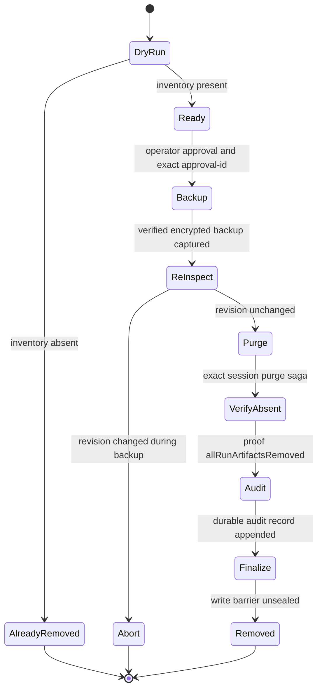
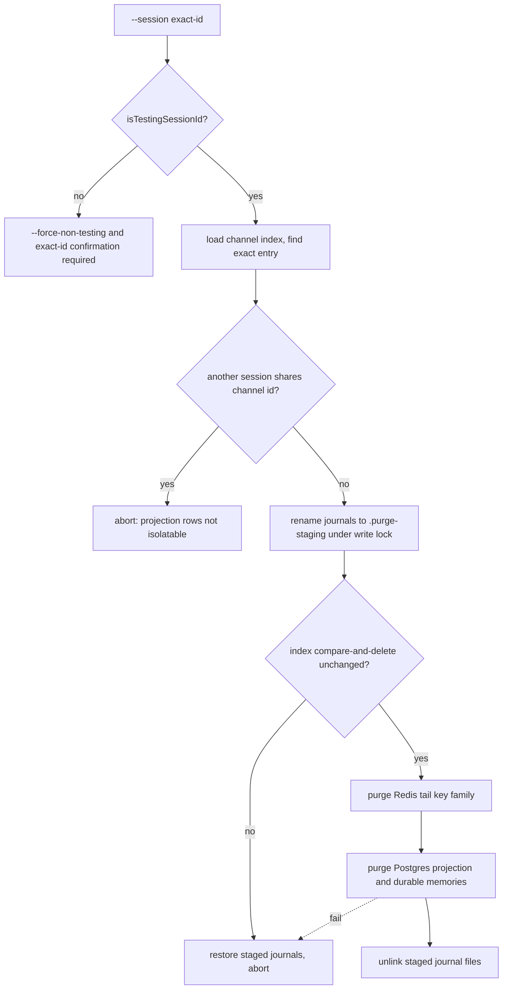

# Shakedown: Live-Operator Verification and Testing-Session Cleanup

Shakedown is the cumulative release-recertification surface of PSFN: every
change that touches a live path is expected to prove itself against the harness
layers documented here before it counts as validated. It is also a
**process** discipline — how a run is identified, how its residue is removed,
and how the evidence of the run is recorded. Source and tests are the
authority; when prose and code disagree, the code wins.

The surface has four responsibility groups:

1. **Smoke harnesses** (`scripts/*-smoke.*`) — fast, operator-invoked,
   fail-closed probes that prove a live or composed runtime is wired correctly:
   admin bootstrap + chat edge, the split Docker Compose stack plumbing, Discord
   DM/voice readiness, and the CogSec remediation lifecycle.
2. **E2E harnesses and certifications** (`src/app/e2e/`) — non-interactive
   full-stack tests (conversation, memory, sessions, REPL, voice round-trip,
   fleet resolution), an interactive walkthrough, and heavy certification suites
   (multi-companion runtime validation, fleet posture, Garden cutover, fleet SSO
   unified origin, idle purity).
3. **Shakedown artifact cleanup** (`cleanup-shakedown-artifacts.ts` +
   `shakedown-artifact-cleanup-runtime.ts` + the lifecycle service) — deletes
   the canonical testing-harness session and every run-owned artifact across
   journals, turn records, Postgres, and Redis, bound to an exact manifest and a
   rollback-capable backup, so validation never pollutes canonical state.
4. **Session purge** (`purge-testing-session.ts` + purge target/Postgres
   helpers) — the exact, rollback-safe single-session purge that both the
   testing-harness lifecycle and operator hygiene use, with the same tenant
   authority as the live runtime.

**Fail-closed is the standing rule across the whole surface**: a smoke script
that cannot prove its check exits non-zero, a cleanup that cannot prove
provenance refuses to delete, and a certification that observes an invariant
violation aborts with a structured error. There are no compatibility shims or
silent fallbacks between these layers.

## Entrypoints

| Command (package.json) | Harness | What it proves |
| --- | --- | --- |
| `npm run smoke:chat` | `scripts/chat-cockpit-smoke.mjs` | Admin bootstrap fields, OpenAI-compatible chat completion, optional voice websocket handshake |
| `npm run smoke:docker` | `scripts/smoke-docker.mjs` | Split Compose stack (postgres + gateway + agent) up, `/health` plumbing, one persisted chat turn, provider-boundary classification |
| `npm run smoke:cogsec` | `scripts/cogsec-remediation-smoke.ts` | Tombstone → revocation → regeneration → persona conformance → safe notices, with zero dirty-payload leakage |
| `npm run smoke:discord:dm-voice` | `scripts/discord-dm-voice-smoke.mjs` | DM/voice/TTS/STT/Opus readiness, optional read-only live Discord API checks, Phase V regression profile |
| `npm run e2e` | `src/app/e2e/e2e-test.ts` | Full runtime stack: conversation, persistence, memory, embeddings, reload, REPL, fleet resolution |
| `npm run e2e:voice` | `src/app/e2e/e2e-voice-roundtrip.ts` | Closed-loop TTS → STT → agent → TTS → STT with sign/countersign semantics |
| `npm run walkthrough` | `src/app/e2e/e2e-walkthrough.ts` | Interactive orientation tour of the real agent loop |
| `npm run e2e:multi-companion-runtime` | `src/app/e2e/multi-companion-runtime-validation.ts` | Process-level two-agent isolation, fatigue suppression, closeout reserve, flag-off fail-closed |
| `npm run e2e:fleet-posture` | `src/app/e2e/fleet-posture-runtime-validation.test.ts` | Authenticated posture attribution, staleness, expiry, disconnect/reconnect |
| `npm run shakedown:cleanup` | `src/app/maintenance/cleanup-shakedown-artifacts.ts` | Exact, backed-up deletion of the canonical testing-harness session and its artifacts |
| `npm run session:purge` | `src/app/maintenance/purge-testing-session.ts` | Exact, rollback-safe purge of one indexed session and its projection rows |
| `npm run verify:idle-purity` | `src/app/e2e/idle-purity-certification/` | An idle runtime performs zero filesystem/Postgres writes outside an allowlist |

Both maintenance entrypoints are wired through the shared maintenance CLI
harness (`runMaintenanceCli` / `bootstrapMaintenanceRuntime`) and are guarded by
`isMaintenanceCliEntrypoint`, so importing the module for tests never executes
the command.

## The testing-harness provenance contract

What makes a run-owned artifact recognizable — and therefore safely deletable —
is the provenance contract in `src/shared/contracts/testing-harness.ts`:

- The canonical session identity is `TESTING_HARNESS_SESSION_CHANNEL_ID =
  'api:testing-harness'`. The testing-harness API writes turns into exactly this
  session, and cleanup accepts nothing else.
- Run provenance rides on two headers: `x-testing-harness-run-id` and
  `x-testing-harness-manifest-id`.
- `normalizeTestingHarnessRunProvenance` reduces both to a `schemaVersion: 1`,
  `kind: 'testing_harness'` record whose `runId`/`manifestId` must match the
  canonical identifier syntax `^[a-zA-Z0-9][a-zA-Z0-9._:-]*$` and rejects
  unknown keys — there is no ad-hoc run identity.

The API edge enforces the contract: only the authenticated `testing_harness`
principal may attach run provenance. Testing-harness chat requests without
exact run and manifest identifiers get `400 testing_harness_provenance_required`
(or `testing_harness_provenance_invalid`); any other principal sending the
headers gets `403 testing_harness_provenance_not_allowed`. Provenance is then
stamped into each session entry's metadata under the `testingHarness` key by
`buildSessionMetadataWithTestingHarnessProvenance`, and
`resolveSessionEntryTestingHarnessProvenance` reads it back — this is the exact
key the cleanup runtime inspects. `assertMemorySourceIsNotTestingHarness`
additionally refuses testing-harness entries as sources for derived memory, so
validation content cannot become canonical companion memory.

Outside the API harness, testing sessions are recognized structurally:
`isTestingSessionId` requires a `testing` namespace segment after the channel
prefix (`<channel-prefix>:testing:<name>`), composing with prefixes that carry
routing identity (`api:<principal>:testing:<name>`) without matching ordinary
names that merely contain the word "testing".

## Smoke harnesses

The smoke scripts share a convention: self-contained Node entrypoints that print
tagged `[smoke:<label>]` PASS/FAIL lines and exit non-zero when any check fails.
Each harness either talks to a real runtime over HTTP/WebSocket or exercises
real subsystems in-process, and none of them mutates canonical repository state.

`scripts/chat-cockpit-smoke.mjs` targets the split runtime's admin surface in
three staged checks: admin bootstrap (`GET /api/admin/chat/bootstrap`, bearer
`ADMIN_TOKEN`), an OpenAI-compatible chat completion against the bootstrap-
provided `api.chatCompletionsUrl` using the dedicated testing-harness API key,
and an opt-in `voice-wire-v2` websocket handshake. Secrets and runtime values
come from CLI flags or the `.env` next to the repo (`PSFN_LIVE_ENV` overrides
that path). When `--report-path` is set (default from
`PSFN_SMOKE_REPORT_PATH`) the harness writes a JSON report artifact with
`status: ok` or `status: failed` plus the error message; on failure the process
exits 1 — the harness never exits 0 on a failed check.

`scripts/smoke-docker.mjs` is the Compose analogue of the Kubernetes
`smoke:chat` pod. It brings up the real split runtime from
`docker/docker-compose.smoke.yml`, waits for the gateway `/health` endpoint
against the `PLUMBING_SUBSYSTEMS` set (`memory`, `embeddings`, `scheduler`),
drives one OpenAI-compatible turn through the gateway `/v1` edge, and then
proves persistence by execing `node` inside the agent container and asserting
the exact user/assistant pair appears in the channel's L0 journal files. Exit
codes classify the result: **0** = full persisted turn, **2** = provider
boundary reached (`llm` health degraded, `isProviderBoundary` matched, no
`OPENROUTER_API_KEY`), **1** = plumbing failure.

`scripts/cogsec-remediation-smoke.ts` runs the cognitive-security remediation
pipeline in-memory against real stores (session store with in-memory transcript
projection, `CogSecEventStore`, `CogSecForensicArchive`, in-memory memory store,
real `MemoryRetriever`), seeded with a `memory_poisoning` event plus dirty L0
text, dirty memory, and a dirty compaction summary. It asserts the full
lifecycle — tombstone, revocation, regeneration from clean entries only,
persona conformance — and asserts the final event and safe CogSec notice block
carry the case id but never the dirty payloads, the sealed forensic ref, or the
word `payload`. The run lives under a `mkdtempSync` root removed on exit unless
`COGSEC_SMOKE_KEEP=1`.

## E2E harnesses and certifications

`createIsolatedE2ERuntime` (`src/app/e2e/runtime-harness.ts`) is the substrate
for every in-process e2e run. It creates a temp tree with distinct
`system-data`, `companion-data`, `workspace`, `logs`, `tmp`, and `backups`
roots, snapshots an allowlist of runtime env keys (including `DATA_DIR`,
`COMPANION_ID`, `PSFN_RUNTIME_LAYOUT_MODE`) and restores them on `cleanup()`,
copies `.seed.json` owner files from `config/`, writes a bootstrap starter card,
and emits a one-entry `companions.json` fleet manifest so single-companion
resolution matches the old topology. `runtime-harness.test.ts` pins the key
isolation property: the harness boots against copied owner files, never against
an ambient `DATA_DIR`.

The full-stack `npm run e2e` composes the real agent loop, session
store/manager, memory store, embedding provider, capability runtime, and
shard/think wiring inside an isolated runtime with a scripted LLM provider and
background work disabled, asserting conversation, persistence, multi-turn
memory, forced extraction, retrieval, embedding shape, JSONL reload, RLM loop,
REPL access, and (flag-gated) multi-companion fleet resolution. `npm run
e2e:voice` validates the voice pipeline closed-loop with real providers and
sign/countersign phrases. `npm run walkthrough` is an interactive orientation
tour that cleans up its isolated runtime in a `finally` block.

`npm run e2e:multi-companion-runtime` is the process-level certification: a real
gateway in-process plus two real agent processes over a Unix socket against a
real pgvector Postgres test harness with per-companion tenant schemas. Its
scenarios cover colliding routes (zero crossover), the companion room (fatigue
ledgers charged to `exhausted`, suppression, durability across an agent
restart), the fatigue closeout reserve (provable `overcharge` rows in
`shared.icp_fatigue_turn_reservations`), and flag-off (autonomy disabled
resolves `multiCompanion=false`, rejects autonomy runs, creates no state, and
leaves no process or socket behind). Fleet posture validation
(`npm run e2e:fleet-posture`) runs a local two-agent `GatewayServer` and proves
attribution, staleness, expiry, disconnect, and reconnect replacement.

The certification suites go further: the Fleet Garden cutover certification
assembles the production control-plane chain with **no test doubles on the
certified chain**, the fleet SSO unified-origin certification covers the
unified-origin authorization surface end to end, and idle purity snapshots
filesystem/Postgres write counters and fails on any write outside an explicit
allowlist.

## Shakedown artifact cleanup

Validation is allowed to create residue — the canonical testing-harness session
(`api:testing-harness`) is where the testing-harness API writes turns — but that
residue must never leak into canonical state. `npm run shakedown:cleanup`
removes it exactly, durably, and with a rollback path.

### CLI and manifest contract

The CLI requires an exact `--manifest <exact-manifest.json>` and defaults to a
**content-free dry run**; `--apply` additionally requires `--approval-id
<exact-id>`. The manifest is `schemaVersion: 1` with exactly `sessionId`,
`companionId`, `runId`, `manifestId`, and `artifacts` keys; `runId`/`manifestId`
are normalized through `normalizeTestingHarnessRunProvenance`, artifact kinds
are restricted to `session | channel | task | memory | event`, ids must be
canonical, duplicates are rejected, and an empty artifact manifest is refused.
The manifest must name the canonical `api:testing-harness` session, and the
resolved runtime companion (from `--companion-id` or the config) must equal the
manifest's companion — the CLI fails otherwise. It is wired through the shared
maintenance CLI harness with backup label `shakedown-cleanup` and requires
`config.postgresDatabaseUrl`; usage text instructs the operator to stop the
owning runtime workloads before apply so the fenced snapshot stays stable.

### Service lifecycle

`ShakedownArtifactCleanupService` (`src/system/lifecycle/shakedown-artifact-cleanup.ts`)
orchestrates dry-run and apply through injected ports (`inspectExact`,
`captureBackup`, `removeExact`, `verifyAbsent`, `appendAudit`, `finalize`):

*Shakedown cleanup apply: backup-before-delete against the exact target revision, absence proof, audit, and barrier release.*

Apply refuses without explicit operator approval, requires the backup digest to
be a SHA-256 and the backup to cover the inspected target revision, re-inspects
after the backup and aborts if the revision moved while it was captured, deletes
via the exact purge, validates absence proof (`allRunArtifactsRemoved` true and
zero remaining counts), appends the audit, and only then finalizes (unseals the
write barrier). A target that is already absent is finalized without deletion
and reported as `already_removed`. The inventory validator additionally rejects
a targetRevision that is not a SHA-256, negative or non-integer artifact
counts, an absent status with nonzero counts, and a present inventory whose
artifact identities do not match the manifest exactly.

### Runtime inspection

`createShakedownArtifactCleanupRuntime` (`src/app/maintenance/shakedown-artifact-cleanup-runtime.ts`)
implements the ports against real stores and binds **every** run-owned artifact
to the manifest's run provenance:

- **Journals** — every message in the channel index's journal chain must carry
  the exact `runId` + `manifestId` testing-harness provenance; quarantined
  files, compaction entries, mixed provenance, orphan run-owned journals not in
  the index, and missing files all abort.
- **Turn records** — every turn record must reference exact run-owned session
  entry ids; `.quarantine` segments abort; background-work handoff jobs
  contribute task ids.
- **Postgres** — the session-messages projection, projection drift,
  `l2_memories`, `recent_contact_shapes`, `memory_links`, and
  `l2_memory_maintenance_reviews` for the run's memories, plus background-work
  jobs/handoffs/leases and subsystem output refs/status for the session. An
  incomplete durable-memory schema, non-terminal run-owned background work, or
  append-only subsystem output evidence aborts.
- **Redis tail** — the tail cache key family for the session, when a Redis tail
  cache is configured.

The inventory produces a SHA-256 `targetRevision` from index, journal, turn
record, tail, and Postgres row digests (`shakedownCleanupRevision`), and reports
artifact counts plus the exact artifact identities the manifest must match.
Inspection opens a read-only, single-connection inspection pool; fleet mode
derives the tenant role so inspection happens under the same authority as the
live companion.

### Deletion, backup, and failure semantics

Apply captures a rollback-capable backup first: `runBackupCycle` with
`verifyRestore: true`, encrypted output whose SHA-256 digest is persisted
durably in a receipt keyed to the target revision (recovery of an in-progress
saga requires a matching receipt). Deletion runs `ProductionExactSessionPurge`
with a Postgres exclusive fence, the filesystem automata retention write
barrier (sealed before and unsealed after), a file-backed saga store with
concurrency checks, and six purge surfaces: `redis_tail_pointers`,
`transcript_projection`, `turn_records`, `journal_rolls`, `journals`, and
`channel_index`. The purge authority re-resolves the exact index target,
rejects any change to the channel index or new run-owned journals after
authorization, and refuses unverified preserve references outright.

Every apply appends an fsynced JSONL audit record under
`companion-data/state/maintenance/shakedown-cleanup-audit.jsonl` with the
approval id, backup/rollback refs, target revision, and artifact counts — see
[Evidence without leaking private state](#evidence-without-leaking-private-state).
If the runtime refuses to prove provenance, finds new run-owned journals after
authorization, or observes any concurrent change, it fails closed with no
partial-deletion claim.

## Session purge

`npm run session:purge` (`src/app/maintenance/purge-testing-session.ts`) is the
exact single-session purge that the shakedown lifecycle and operator hygiene
share. Testing sessions must use `<existing-channel-prefix>:testing:<name>`;
non-testing sessions require `--force-non-testing` **and** an interactive
confirmation in which the operator types the exact id. Wildcards and control
characters are refused, `config.postgresDatabaseUrl` is required, and fleet
mode requires `--companion-id`.

`resolveTestingSessionPurgeTarget` binds journals, Postgres, and Redis to one
companion identity. In multi-companion mode it resolves both the companion data
root and the Postgres schema **exclusively** from the validated
`companions.json` fleet manifest (`--data-dir` cannot override the manifest,
and a `--sessions-dir` that disagrees with the manifest is rejected);
single-companion mode keeps `public` as the explicit default schema and
resolves the sessions dir under the companion root — never the split system
root. `createTestingSessionPurgePostgresAdapters` opens the destructive
session-projection boundary with the same tenant authority as the live
companion runtime: fleet mode derives the tenant role and preflights
`assertPostgresTenantAccessProvisioned` before creating any adapter that can
migrate or delete projection rows; single-companion mode stays role-free on
`public`.

The purge itself (`purgeTestingSession` in
`src/persistence/sessions/testing-session-purge.ts`) is rollback-safe by
construction:

*Session purge: files are staged out of the journal namespace before any destructive commit; the projection commit is the last irreversible step.*

Journals are first atomically renamed out of the journal namespace under the
session journal write lock and the index entry is removed with a
compare-and-delete; if that compare fails, staged journals are restored. The
Redis tail key family is then purged and the Postgres projection/memories are
deleted; any failure before the projection commit restores the staged journals
and re-inserts the index entry, and staged files are unlinked only after the
projection commit succeeds. Sessions that collide on the resolved channel id
abort up front because their projection rows cannot be isolated.
`purgeTestingSessionPostgresData` removes the transcript projection and drift
rows by channel id, plus `l2_memories` by provenance session id and the derived
`recent_contact_shapes`, `memory_links`, and `l2_memory_maintenance_reviews`
that reference those memories; an incomplete durable-memory schema aborts.
Run this maintenance while the owning runtime workloads are stopped so no
process retains a pre-purge in-memory session cache.

## Evidence without leaking private state

Shakedown evidence is recorded in three places, and every one of them is
structural rather than content-bearing:

- **Certification evidence documents.** `npm run e2e:multi-companion-runtime`
  writes a `schemaVersion: 1` JSON evidence document to stdout with `event`,
  `status`, the git `revision`, `coverageCaseIds`, a sanitized `topology`
  (companion ids and schema names, with filesystem path identities hashed via a
  SHA-256 path identity and no credentials), per-scenario evidence, `fixBeadIds`,
  and a `teardown` section proving every spawned process exited and the gateway
  socket and support-fixture paths were removed. On failure the harness writes a
  `status: 'failed'` document with the structured `errorCode` and exits 1 —
  never a partial pass.
- **Cleanup audit records.** Every shakedown cleanup apply appends an fsynced
  JSONL record under `companion-data/state/maintenance/shakedown-cleanup-audit.jsonl`
  carrying the approval id, backup/rollback refs, target revision, and artifact
  counts — never message text, row bytes, or payloads.
- **Smoke report artifacts.** `smoke:chat` writes `status: ok`/`status: failed`
  JSON reports; its focused test asserts the report carries bootstrap fields,
  chat content, `voice.skipped`, and **no secret leakage**. CogSec remediation
  asserts the same for dirty payloads: they never surface in events, notices,
  regenerated content, or audit records.

The rule extends to this wiki: shakedown evidence as recorded here must be
sanitized — no live deployments, real identities, credentials, private
addresses, kubeconfigs, or operator machine names appear on this page or in the
evidence it describes.

## Invariants

- **Fail-closed exits**: every smoke script exits non-zero on an unproven
  check; the Discord harness's `--report-only` is an explicit opt-out.
- **No canonical-state mutation**: e2e runs use isolated temp roots with env
  snapshot/restore; smoke-docker tears down with `down -v` unless `--keep-up`;
  cleanup refuses anything that is not run-owned.
- **Exactness**: cleanup accepts only the canonical testing-harness session,
  only exact run provenance, only canonical identifiers, and only SHA-256
  revisions; any ambiguity aborts.
- **Backup-before-delete**: no apply-path deletion happens before a verified
  encrypted backup of the exact inspected revision exists and a re-inspection
  confirms the revision did not move.
- **Rollback-before-commit**: session purge never unlinks staged journals until
  the Postgres projection commit succeeded, and restores them on any earlier
  failure.
- **Leak prevention**: remediation and cleanup flows assert dirty payloads and
  secrets never surface in events, notices, regenerated content, report
  artifacts, or audit records.
- **Tenancy**: multi-companion validation and purge both assert unique
  per-companion Postgres schemas and zero crossover across colliding routes.

## Relationships

- [development-status](/openwiki/development-status.md) — the validation
  baseline list and which suites make up the cumulative recertification
  contract referenced from this page.

## Focused tests

- `src/system/lifecycle/shakedown-artifact-cleanup.test.ts` — service-level
  dry-run without backup or mutation, backup-before-delete with absence proof,
  change-during-backup abort, remaining-artifact failure, approval enforcement,
  and exact artifact-manifest matching.
- `src/app/maintenance/cleanup-shakedown-artifacts.test.ts` — CLI parsing and a
  reachable dry-run command with no backup or mutation.
- `src/app/maintenance/purge-testing-session.test.ts` — purge target resolution:
  companion-root sessions dir by default, fleet schema from `companions.json`,
  and named resolution errors.
- `src/app/maintenance/testing-session-purge-postgres.test.ts` — tenant
  preflight ordering before the scoped adapter opens, and preflight-failure
  refusal.
- `src/core/session/session-id.test.ts` — `isTestingSessionId` accepts only the
  `<channel-prefix>:testing:<name>` shape.
- `src/app/e2e/runtime-harness.test.ts` — proves `createIsolatedE2ERuntime`
  ignores ambient `DATA_DIR`; `src/app/e2e/chat-cockpit-smoke.test.ts` — runs
  the chat smoke against a local HTTP server and asserts no secret leakage.
- The certification suites (`multi-companion-runtime-validation`,
  `fleet-posture-runtime-validation`, `fleet-garden-cutover`, `fleet-sso-unified-origin`,
  `idle-purity`) — the heavy verification the harness layers depend on.
