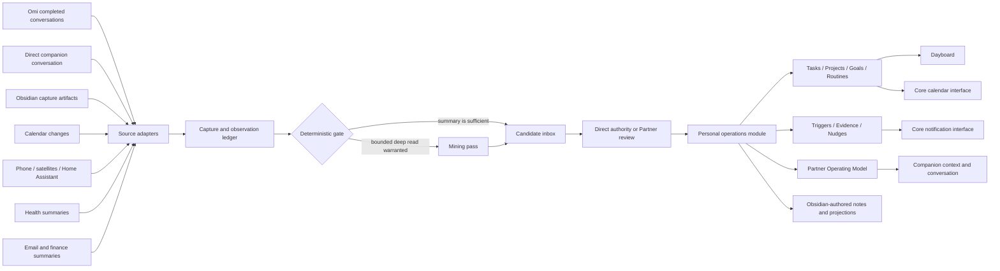

# Productivity Pack Design Bible

> Status: accepted product direction, updated 2026-07-18.
>
> This document defines the intended product and architecture. It distinguishes
> current PSFN capabilities from target Productivity Pack work; nothing marked
> as target behavior should be read as already shipped.

## 1. Product Thesis

The Productivity Pack is an optional PSFN product layer for turning the
partner's conversations, notes, calendar, routines, places, and explicitly
authorized personal data into useful follow-through.

Its job is not to replace the partner's thoughts or run their life without
them. Its job is to reduce the distance between:

1. saying or noticing something;
2. deciding that it matters;
3. remembering it in the right context;
4. making time for it;
5. doing, snoozing, changing, or dropping it; and
6. learning from the outcome without inventing a story.

The Pack should feel like a trusted partner who remembers the shape of the
partner's life, not a corporate task manager and not an autonomous manager.
It is deliberately one-to-one, self-hosted software. It is not a multi-tenant
SaaS product and should not acquire SaaS abstractions that weaken that shape.

The working product names are:

- **Productivity Pack** — the optional capability set and runtime modules;
- **Productivity Companion** — the one companion authorized to operate it;
- **Dayboard** — the dedicated Partner-facing planning and review application;
- **Partner Operating Model** — the inspectable, correctable model of the
  partner's preferences, routines, context, and relevant behavioral patterns.

The "clone of me" framing is a useful product metaphor for familiarity. It is
not an identity claim and never authorizes the system to replace the partner's
judgment.

## 2. Constitutional Invariants

These rules are charter-level. Implementations and integrations must preserve
them.

### 2.1 Optional by construction

PSFN must remain a complete companion framework without the Productivity Pack.
Disabling or never installing the Pack must leave ordinary conversation,
memory, relationships, creativity, care reminders, scheduling, embodiment, and
world presence intact. It must also leave core
[Partner Affect Estimation](partner-affect.md) operational from whatever core
signals remain authorized.

Pack enablement is a feature and data-access decision, not a companion
maturation tier.

### 2.2 Exactly one Productivity Companion

A runtime may have zero or one Productivity Companion:

- a single-companion runtime may designate its one companion;
- a cluster may designate exactly one companion across the cluster;
- enabling two Productivity Companions in the same cluster must fail closed;
- other companions do not gain access to Pack state, sensitive connectors, or
  the Partner Operating Model merely because they share a cluster.

The invariant applies to Pack ownership, not to ordinary core care. Other
companions may still remember birthdays, hold their own concerns, use their
own schedules, and participate in normal relational life under existing
policy.

A future cross-companion handoff may let another companion submit a bounded,
provenance-tagged candidate to the Productivity Companion. It must not let that
companion query the Pack's private state or use its connectors. This handoff is
not part of the first implementation.

### 2.3 One partner, not a user-management product

The Pack serves one designated partner identity. Durable Pack state must still
carry the exact canonical partner contact identity so a routing or restoration
mistake cannot silently bind it to somebody else.

The first implementation must not add organizations, workspaces, teams,
tenant administration, billing, or generalized multi-user ownership.

### 2.4 Partner authority over inferred work

An explicit instruction may create or change work directly. Passive or
ambiguous inference may only create a Candidate.

Examples:

- "Remind me to buy eggs at Costco" may create a Task and Trigger directly.
- "I should probably get my pants repaired before Thursday" creates a
  Candidate unless the companion obtains confirmation.
- An Omi-generated action item is always a Candidate, never authoritative
  merely because Omi labeled it a to-do.

### 2.5 Evidence is not implication

Observed context and evidence have narrow meanings:

- entering Costco may trigger the shopping list;
- entering Costco does not prove that eggs were purchased;
- an exercise-session summary may satisfy one Routine occurrence when an
  operator-approved evidence rule says it can;
- heart rate alone does not prove exercise, stress, illness, or intent;
- a calendar event passing does not prove attendance;
- a receipt may support purchase completion but must not be stretched beyond
  what it actually contains.

### 2.6 Deterministic gates before model calls

Location updates, sensor events, calendar changes, file notifications, and
other high-frequency signals must not cause an LLM call by default.

Cheap deterministic gates decide whether there is eligible new work. LLM
reasoning is reserved for interpretation that cannot be answered from typed
state, cached summaries, or explicit rules. Every recurring inference lane
must expose why it ran or skipped.

### 2.7 Sensitive access is narrow and explicit

Calendar access does not imply email access. Email access does not imply
financial access. Health summaries do not imply raw biometric access.

Each source has its own consent, credential, retention, provenance, and action
policy. The Productivity Companion designation alone grants none of them.

### 2.8 No silent second authority

Postgres, Obsidian, external calendars, Omi, and Thoth may all
participate, but each datum must have one declared authority. Synchronization
creates projections and external bindings, not several competing canonical
copies.

## 3. Core Companion Capabilities Versus Pack Capabilities

Some useful productivity behavior belongs in core because it is ordinary
companion care. Sensitive, high-volume, and cross-source personal operations
belong in the optional Pack.

| Capability | Core PSFN | Productivity Pack |
|---|---:|---:|
| Birthdays, anniversaries, and important dates | Yes | May plan around them |
| Explicit reminders and scheduled follow-ups | Yes | May attach them to Tasks and Projects |
| Calendar event read/create/update through a canonical interface | Yes | Uses it for planning and time blocking |
| Explicit appointment creation | Yes | May resolve it against Projects and availability |
| Ordinary companion concerns and care nudges | Yes | Must not store the Partner's backlog in concerns |
| Voice conversation and direct commands | Yes | Adds Pack-aware capture and planning actions |
| Typed sensor ingest and situated place semantics | Yes | Adds task/routine Trigger and Evidence rules |
| Partner Dossier, contact profiles, and relationship graph | Yes | Adds operational context and import Candidates |
| Partner Affect Estimate and Support Posture | Yes | May contribute additional Signal Observations |
| Task, Project, Area, Goal, and Routine management | No | Yes |
| Passive transcript mining and Candidate review | No | Yes |
| Dayboard | No | Yes |
| Productivity and workflow correlations | No | Yes |
| Financial, subscription, or inbox analysis | No | Optional and separately authorized |

Calendar capability is therefore core-capable but policy-scoped. A companion
does not gain access to the partner's real calendar simply because the
interface exists. In a cluster, Partner-calendar write authority may still be
restricted to the Productivity Companion.

The existing canonical [`schedule`](tool-surface.md#canonical-schedule-surface)
surface is the starting seam. Calendar event operations should deepen that
semantic surface or share one internal calendar module; they should not arrive
as a spray of provider-specific model-facing tools.

## 4. Ubiquitous Language

These terms are canonical for the Pack.

| Term | Meaning |
|---|---|
| **Capture Artifact** | A finalized source artifact: conversation, note, direct command, imported item, or external event. |
| **Candidate** | A proposed Task, Project, Goal, Routine, calendar event, note, or profile update awaiting review. |
| **Task** | A concrete approved action. "Buy toilet paper" is a Task; it need not be called a commitment. |
| **Commitment** | Reserved for an explicit promise or hard obligation when that distinction matters. It is not the generic Task type. |
| **Area** | A persistent sphere of responsibility such as Work, Home, House, Health, Money, or Friends. |
| **Project** | A bounded multi-step outcome within an Area, with a definition of done. |
| **Goal** | A desired outcome that may span Projects and Routines. Its horizon may be short, medium, long, or ongoing. |
| **Routine** | A repeated behavior or cadence, evaluated as occurrences rather than cloned recurring Tasks. |
| **Execution Context** | A place, person, tool, state, or condition useful for doing a Task, such as Costco, phone, office, or with-Alex. |
| **Trigger** | A deterministic rule deciding when a Task, Routine, or question becomes eligible to surface. |
| **Evidence** | A provenance-bearing observation that supports a narrow completion or state claim. |
| **Nudge** | One delivery attempt with a lifecycle: eligible, delivered, acknowledged, snoozed, acted on, expired, or suppressed. |
| **Review** | A Partner-in-the-loop reconciliation of Candidates, Tasks, scheduling, outcomes, and stale work. |
| **Observation** | A normalized source event retained with freshness and confidence. |
| **Insight** | A bounded correlation or pattern with its evidence window, sample size, missingness, and uncertainty. |
| **External Binding** | The idempotent relationship between Pack state and an external object such as a calendar event or Obsidian document. |
| **Partner Dossier** | Core PSFN's governed view of the partner and their social context, composed from contact profiles, relational memory, social graph, and personal wiki references. |
| **Partner Operating Model** | The Pack's partner-correctable operational overlay: routines, execution context, friction, strategies, and evidence-backed productivity patterns. |

### 4.1 Area, Project, Goal, Task, and context are not synonyms

The hierarchy is intentionally modest:

```text
Area: Home
├── Project: Repair the upstairs bathroom
│   ├── Task: Measure the damaged trim
│   └── Task: Call the contractor
└── Routine: Replace HVAC filter every three months

Goal: Make the house easier to maintain
└── supported by the Project and Routine above
```

An Area persists even when no Project is active. A Project ends. A Goal may
span several Projects or Routines. A Task is the next concrete action.

Execution Context is orthogonal to that hierarchy:

```text
Task: Buy eggs
Area: Home
Execution contexts: errands, grocery_store
Place trigger: costco
```

A long-horizon Goal does not require an "epic" clone. Horizon and parent
relationships are enough until real usage proves otherwise.

### 4.2 Partner Tasks are not companion concerns

The current companion intention substrates are deliberately bounded:

- [`ActiveConcern`](../src/core/intention/concerns.ts) keeps a small,
  short-lived attention set;
- [`PendingFollowUp`](../src/core/intention/pending-follow-ups.ts) holds
  short-horizon whispers;
- [`CareReminder`](../src/core/intention/care-reminders.ts) owns narrow
  important-date and self-reminder behavior;
- [`NorthStarItem`](../src/faculties/north-star/store.ts) holds at most a few
  companion orientation priorities;
- [`PersonalProjectLibrary`](../src/faculties/wiki/personal-projects.ts) owns
  companion-created projects and artifacts.

Those limits protect companion welfare and attention. The Pack must not widen,
reuse, or bypass them to hold an effectively unbounded Partner backlog.

## 5. Product Topology

The target shape is one deep personal-operations module with several adapters,
not an alternate companion runtime.



### 5.1 External interface

The model-facing interface should remain one semantic `productivity` tool, not
one tool per entity or connector. A likely action family is:

- `capture`
- `inbox`
- `list`
- `create`
- `update`
- `complete`
- `snooze`
- `review`
- `plan`

The final action schema must be designed against real call patterns and token
cost. Provider names, file paths, OAuth details, and sync cursors stay behind
the interface.

### 5.2 Internal seams

The implementation should extend existing primitives before introducing new
ones.

| Concern | Intended seam |
|---|---|
| Sensor and environment intake | Existing [`SensorIngestPort`](../src/shared/telemetry/sensor-ingest-port.ts) and typed event bus |
| Places and affordances | Existing [`places.json` contract](../src/shared/contracts/places-registry.ts) and `world` integration |
| Calendar and reminders | Existing scheduler plus a focused calendar port |
| Notifications | Existing policy-controlled notification path |
| Obsidian access | Existing `vault` integration or bounded filesystem adapter |
| Durable Pack state | New personal-operations store port with Postgres adapter |
| Omi and generic completed conversations | One completed-capture ingest port with API, webhook, and vault-file adapters |
| Partner identity and relationships | Existing contact profile, relational memory, and social-graph stores |
| Partner affect | Core [`Partner Affect Estimation`](partner-affect.md); Pack contributes observations only |
| Research lookup | A narrow Thoth query/delivery adapter once a real integration is selected |

Source adapters normalize into the same Capture Artifact or Observation
contracts. Downstream modules must not know whether an Omi conversation arrived
through a webhook, API poll, self-hosted backend, or finalized Obsidian file.

## 6. Persistence and Authority

### 6.1 Same Postgres, focused tables

Pack operational state belongs in the designated companion's existing
Postgres schema. It does not require a separate database.

The target store is expected to need focused tables or equivalent modules for:

- captures and source-processing receipts;
- observations;
- candidates and review decisions;
- areas, projects, goals, tasks, and routines;
- triggers and evidence;
- nudge delivery state and snoozes;
- external bindings and sync cursors;
- reviews;
- insights and their evidence windows.

Every record carries the designated partner identity, provenance, timestamps,
and sensitivity needed by its domain. Capture processing must be idempotent
across restart and adapter retries.

### 6.2 Authority by datum

| Datum | Canonical authority | Other copies |
|---|---|---|
| Raw Omi transcript in the established vault workflow | Finalized source file or Omi record, selected per deployment | Search projection and provenance reference |
| Omi summary and extracted action hints | Source artifact | Inputs to Pack Candidate mining |
| Pack Candidate and review decision | Postgres | Dayboard and Obsidian views |
| Task, Project, Goal, Routine | Postgres | Dayboard, companion context, optional Obsidian projection |
| Calendar event | External calendar | External Binding and bounded cached projection |
| Long-form partner-authored note | Obsidian | Search/index projection |
| General research wiki and bulk reference ingestion | Thoth | PSFN query result or delivered artifact |
| Partner Dossier and relationship graph | PSFN core contact, memory, social-graph, and personal-wiki stores | Bounded prompt/retrieval view |
| Companion lived conversation | Existing canonical L0 archive | Existing projections |
| Companion durable memory | Existing PSFN memory substrate | Prompt/retrieval projections |
| Derived Partner Operating Model entry | Pack Postgres store with provenance | Bounded prompt context and Dayboard inspection |

No sync path may silently promote a projection into authority.

### 6.3 Backup and export

Pack Postgres tables participate in the existing Postgres backup and verified
restore path. Pack-authored Obsidian documents must live in the partner's
backed-up Personal Workspace or another explicitly backed-up vault root.

The Pack must support a human-readable export of its operational state, but
that export is not a replacement for transactional backup.

## 7. Capture and Ingestion

### 7.1 Finalized-capture contract

Passive ingestion consumes finalized artifacts, not arbitrary streaming
fragments. A normalized completion event should identify:

- stable source and source artifact id;
- start, completion, and receipt timestamps;
- source kind and adapter;
- raw artifact reference and content hash;
- summary, if the source created one;
- source-generated action hints, dates, or events;
- size measures such as duration, segment count, line count, and character or
  token estimate;
- participant/source provenance and privacy classification;
- processing version and idempotency key.

The adapter must not expose a partially written transcript as complete.

### 7.2 Omi

Omi is the initial passive-capture source, but its device and application are
not the architectural seam.

Observed behavior today is that Omi finalizes a conversation after a quiet
period, processes it, and produces a transcript, summary, and action items.
The existing external workflow places those artifacts into Obsidian. The Pack
may consume Omi through either:

1. an Omi completion webhook or developer API, then ensure the required
   Obsidian copy exists; or
2. the existing vault-first workflow, detecting a finalized Obsidian artifact
   and reading it locally.

Only one route is active for a given source record. Stable Omi ids and content
hashes deduplicate retries and prevent the API and file adapters from processing
the same conversation twice.

The first implementation should favor the route that preserves the existing
reliable archive with the least new authority. It must not force a migration of
the current vault layout before that layout is inspected.

The source summary and action items are useful first-pass evidence. They are
not trusted as complete or correct. The Pack performs a bounded secondary pass
when deterministic evidence says the conversation deserves one.

Omi's official developer surfaces currently include conversations, memories,
action items, and webhook-triggered integrations:

- <https://docs.omi.me/doc/developer/api/overview>
- <https://docs.omi.me/doc/developer/apps/Integrations>

The adapter contract remains vendor-neutral so later glasses, an ESP32 badge,
or another capture device can produce the same completed-capture shape.

### 7.3 Direct companion conversation

Direct conversation is not delayed passive ingestion.

When the partner opens the companion application, taps a communicator-style
device, or speaks through another authenticated channel:

- direct questions receive immediate answers;
- explicit Task, reminder, or calendar instructions may act immediately under
  normal policy;
- ambiguous possibilities become Candidates or prompt one focused
  clarification;
- "What am I supposed to be doing?" reads the current Pack snapshot and
  calendar rather than mining a new transcript;
- the normal conversation still enters canonical L0 and ordinary memory under
  existing rules.

Hardware changes the adapter, not the personal-operations model.

### 7.4 Obsidian capture

Obsidian is an input as well as an output. Partner-authored notes, clipped
material, Omi conversation artifacts, and other finalized vault documents may
enter through a bounded vault scanner.

File intake must:

- use stable frontmatter ids or content hashes;
- wait for finalized/atomic files;
- retain the source path and checksum as provenance;
- respect configured namespaces rather than scanning the entire vault blindly;
- distinguish personal notes, passive transcripts, research material, and
  Pack-authored projections;
- never interpret a Pack projection as a fresh Partner-authored source.

### 7.5 Other sources

Future capture adapters may include:

- phone or wearable voice capture;
- email notices;
- calendar changes;
- GitHub or research activity;
- financial summaries;
- receipts;
- manual Dayboard input;
- home and mobile sensor summaries.

Each adapter must declare whether its material is:

- an explicit command;
- a passive Capture Artifact;
- an Observation;
- a reference document; or
- an external state change.

That classification determines what the system may do next.

## 8. Mining and Candidate Review

### 8.1 Pipeline

A completed Capture Artifact passes through these stages:

1. **Validate and deduplicate.** Reject malformed, partial, replayed, or
   unauthorized input.
2. **Screen and classify.** Apply source provenance, privacy, CogSec, and
   content boundaries before model access.
3. **Read cheap source output.** Inspect the source summary, action hints,
   explicit dates, and size metadata.
4. **Evaluate the deterministic deep-read gate.**
5. **Optionally perform one bounded mining pass.**
6. **Normalize and deduplicate Candidates.**
7. **Apply direct authority or queue Partner review.**
8. **Record the decision and advance the source receipt.**

Failure at any stage leaves a visible retryable or quarantined state. It does
not advance the watermark and does not silently discard the artifact.

### 8.2 Deep-read gate

A full transcript read may be warranted when one or more deterministic signals
fire, for example:

- the source produced at least one action item;
- the conversation exceeds an owner-configured duration, line, segment, or
  token threshold;
- the summary is missing, unusually short, malformed, or contradicts the
  action hints;
- explicit dates, appointments, promises, purchases, projects, or goals appear
  in cheap extraction;
- several Areas or Projects may be mixed together;
- the source reports failed or incomplete processing;
- a review request explicitly asks for deeper analysis.

A short, low-signal conversation with a sufficient summary should require no
second LLM call.

The gate returns a typed decision with its inputs and reason. Thresholds live
in canonical JSON configuration, not module constants.

### 8.3 Secondary mining

The secondary pass does not merely regenerate Omi's list. It compares the
source output against the transcript and returns structured differences:

- confirmed source hint;
- corrected source hint;
- additional Candidate;
- rejected/noisy source hint;
- unresolved ambiguity requiring review;
- relevant profile or reference-note Candidate.

It must not write Tasks, calendar events, memory, or the Partner Operating
Model directly.

### 8.4 Candidate lifecycle

A Candidate can be:

- pending;
- approved as-is;
- edited and approved;
- merged with an existing item;
- deferred;
- dismissed as noise;
- rejected as unsafe or ungrounded;
- routed to another substrate;
- expired after a configured review window.

Every transition retains source provenance and the deciding actor.

Daily review should be small and interruption-aware. Weekly review may cover
stale Tasks, Project direction, Goal alignment, Routine evidence, and
rescheduling. The system should help the partner decide; it should not create
review busywork merely to prove it is active.

## 9. Obsidian, Thoth, and Human-Shape Knowledge

Obsidian is the partner's durable, browsable knowledge workspace. It is both an
input and an output, but a file's namespace and source class decide who owns
its meaning.

**Thoth** remains the authority for:

- bulk ingestion from bookmarks, papers, articles, repositories, and clips;
- general wiki and reference construction;
- the reference-oriented portions of the partner's Obsidian corpus;
- paper, article, archive, and artifact retrieval.

PSFN must not absorb Thoth's crawler, archivist, or general wiki builder into
companion core or the Productivity Pack.

The division of labor is:

| System | Owns |
|---|---|
| Thoth | General wiki/reference data, bulk ingestion, reference-oriented Obsidian data, and research retrieval |
| PSFN core | Companion conversation and memory, Partner Dossier, contact profiles, social graph, care, situated presence, partner affect, and core calendar/schedule |
| Productivity Pack | Tasks, Projects, Areas, Goals, Routines, reviews, operational context, evidence, and Partner Operating Model |
| Obsidian | Partner-facing Markdown workspace whose declared namespaces retain the authorities above |

### 9.1 Partner Dossier versus Partner Operating Model

Human-shape knowledge belongs in PSFN when it is needed for companionship:

- the partner's exact identity and durable preferences;
- family, friends, coworkers, providers, and other important contacts;
- roles such as manager, colleague, partner, or family member;
- provenance-bearing relationship edges;
- stable personal context and corrections.

Core already has contact profiles, relational memory, a social graph, and a
personal wiki. The target Partner Dossier is a deeper composite read surface
over those authorities, not another identity database.

The Pack's Partner Operating Model is narrower. It owns operational patterns,
routines, execution context, friction, strategies, and links to Areas,
Projects, Goals, and Tasks.

It may reference the Partner Dossier. It must not duplicate basic contact
identity or relationship authority.

### 9.2 Markdown and YAML interchange

Thoth and PSFN should exchange governed documents as Markdown with strict YAML
frontmatter. A minimal transfer record needs:

- stable document and source ids;
- source class and canonical authority;
- subject contact id when the document is human-shaped;
- provenance references and content hash;
- sensitivity and consent scope;
- created, updated, and observed timestamps;
- schema and processing version.

A `human_shape` source class may create import Candidates for the Partner
Dossier, relational memory, social graph, or Partner Operating Model.

It does not write those stores directly. Review, confidence, subject identity,
consent, and destination policy still apply.

Stable ids and hashes make the interchange idempotent. A PSFN projection must
never be re-ingested by Thoth or PSFN as a new partner-authored source.

### 9.3 Narrow collaboration

A companion may ask Thoth to find a paper by topic, retrieve metadata or an
abstract, summarize it, and deliver the PDF or a reference.

That request does not give Thoth access to Pack state and does not give PSFN
ownership of the general reference wiki.

The Obsidian integration should eventually define explicit namespaces for:

- source-owned Omi transcripts and summaries;
- partner-authored human-shape notes;
- Thoth reference pages and ingested source material;
- Pack-authored Project or Review documents;
- read-only Pack status projections, if retained.

Exact folder names must follow the live vault after inspection. The design must
not invent a parallel vault tree and then require the partner to migrate.

The existing PSFN `vault` surface remains an optional external bridge and must
not silently copy vault contents into companion memory. See the
[personal knowledge-base boundary](memory.md#personal-knowledge-base-wiki).

## 10. Calendar and Time

### 10.1 Calendar is core

Calendar capability belongs beside core scheduling and care, even when the
Productivity Pack is absent.

Core calendar behavior should support:

- reading authorized events and availability;
- creating an explicit appointment or time-specific reminder;
- updating or cancelling a Pack-owned or explicitly selected event;
- birthdays, anniversaries, important dates, and ordinary care reminders;
- stable external ids and idempotent sync;
- event location metadata and provider-native travel alerts where supported;
- timezone-correct date and recurrence handling.

The Pack uses this interface for planning, but does not own the calendar
provider implementation.

### 10.2 Creation rules

| Statement or source | Default result |
|---|---|
| "Remind me at 4 PM to call the doctor" | Immediate core reminder; calendar event only if configured or requested |
| "I have a doctor appointment Thursday at 4 PM" | Calendar event Candidate or direct create when the statement is an explicit instruction in direct conversation |
| Passive transcript says "I should call sometime Thursday" | Candidate with unresolved time |
| Omi emits a calendar event hint | Candidate |
| Finance source says an autopay bill is due | Announcement/monitoring state by default, not calendar clutter |

When a known appointment place can be resolved from trusted contact/place
knowledge, the calendar event may include its address so the provider can offer
ordinary departure-time behavior. The companion must not guess an address or
silently select among ambiguous providers.

### 10.3 Tasks and time blocks

A Task remains canonical in Postgres. A time block is an external calendar
binding owned by that Task. Deleting or moving the event updates the binding;
it does not silently delete the Task unless an explicit policy says so.

The Pack should suggest time blocks from availability and constraints. It must
not fill every open hour or turn every due date into an event.

Google Calendar supports stable client-selected event ids and incremental
sync, both of which fit the external-binding model:

- <https://developers.google.com/workspace/calendar/api/guides/create-events>
- <https://developers.google.com/workspace/calendar/api/guides/sync>

Provider-specific behavior remains in the adapter.

## 11. Context, Triggers, and Nudges

### 11.1 Context sources

Useful context may include:

- time and calendar availability;
- current or entered Place;
- device and satellite presence;
- required person or tool;
- current Routine window;
- bounded partner-state summaries;
- recent direct intent;
- store opening hours or travel constraints from an authorized source.

Raw phone coordinates should terminate at the mobile/Hub geofencing adapter.
PSFN consumes stable Place semantics such as `costco`, `home`, or `out`, not a
continuous latitude/longitude trail.

### 11.2 Trigger evaluation

Trigger evaluation is deterministic:

```text
place entered
  + eligible unfinished Tasks for that place
  + freshness and quiet-hour checks
  + nudge cooldown
  + notification permission
= zero or one bundled nudge decision
```

No eligible item means no LLM call and no notification.

### 11.3 Nudge lifecycle

A Nudge records:

- what became eligible and why;
- delivery channel and target;
- delivered, denied, or suppressed outcome;
- acknowledgement;
- snooze deadline and condition;
- repeat count and cap;
- completion or expiry link.

Snooze must be first-class. A grocery nudge acknowledged and snoozed for eight
minutes may reappear once if the partner is still at the store and the Task
remains open. It must not repeat indefinitely.

Several eligible store Tasks should become one shopping nudge, not one
notification per item.

### 11.4 Recent-intent room reminder

The "why did I come into the kitchen?" case is a short-lived Trigger over recent
explicit intent:

1. the partner says they are going to get food;
2. the intent is retained with a tight expiry;
3. trusted presence detects entry into the kitchen;
4. the deterministic gate finds the eligible intent;
5. the companion or satellite reminds them what they came for.

This uses existing situated presence and satellite infrastructure. It does not
require an upstairs/downstairs application or a separate room task manager.

### 11.5 Shared physical devices

`satellites.json` now records separate Primary, Observation Recipient, and
Emanation Member authorities. The retired presence-follow path previously
moved a companion's emanation when a trusted partner entered another bound
room.

The implemented multi-companion policy separates three authorities:

1. **Satellite Primary** — the companion that owns the device's default
   relationship and gets the first opportunity to respond.
2. **Observation Recipient** — a companion allowed to receive selected sensor
   metadata from the device.
3. **Emanation Member** — a companion explicitly allowed to speak or appear
   through the device.

These sets are not interchangeable. Receiving a presence observation does not
grant speech, movement, world control, or access to the room's history.

The designated Productivity Companion may be an Observation Recipient for
`presence`, `location`, or another exact scope even when it is not the
Satellite Primary.

It receives the minimum normalized metadata needed to evaluate Pack Triggers.
Raw sensor feeds and unrelated room activity remain withheld.

#### 11.5.1 Presence is not a summons

Entering a room publishes a presence observation. It does not automatically
move, wake, or interrupt any companion.

An active conversation may continue across rooms when the current companion,
partner intent, availability, and device policy allow it. Mere presence
without an active interaction does not imply that a resting, reading, or
otherwise occupied companion should follow.

This rule replaces the former trust-gated auto-follow behavior. Physical
presence cannot reach a movement or world-control operation.

#### 11.5.2 Primary-first response arbitration

When more than one Emanation Member becomes eligible to speak:

1. explicit partner address or an active conversation wins;
2. otherwise the Satellite Primary receives a short response lease;
3. the Satellite Primary may speak, decline, or return a deterministic no-op;
4. timeout or release makes the next policy-eligible member eligible;
5. exactly one companion may hold the speech lease at a time.

The Productivity Companion does not gain speaker priority merely because it
found an eligible Task. It may speak only after the Satellite Primary declines/releases
and the device allows its emanation.

Arbitration happens before a model call when eligibility is answerable from
Task state, availability, fatigue, quiet hours, active conversation, and
device policy.

Voice and authenticated satellite HTTP responses use the same lease. Fatigue
is read from the exact companion/partner/channel ledger before acquisition.
Lease acquisition, decline, timeout, release, speech outcome, and normalized
observation delivery are persisted through the gateway audit store.
No companion is fabricated as having chosen to speak when it did not.

Shared-device support must preserve the single-Productivity-Companion
invariant, companion rest, and cluster privacy.

## 12. Goals, Projects, and Routines

### 12.1 Projects

Projects give Tasks enough structure to avoid one giant life bucket. Each
Project has:

- one Area;
- a bounded outcome and definition of done;
- status;
- next meaningful action;
- linked Tasks, notes, artifacts, and calendar bindings;
- optional supporting Goals;
- review cadence and provenance.

Human Projects are distinct from the companion-owned personal projects already
stored in the wiki.

### 12.2 Goals

A Goal states an outcome, not a disguised Task list. It may define:

- horizon;
- target or qualitative success condition;
- supported Areas, Projects, and Routines;
- review cadence;
- active, paused, achieved, abandoned, or revised state.

The system may show whether current work supports a Goal. It must not force
every mundane Task to justify itself against one.

### 12.3 Routines

Recurring behaviors are Routines, not endlessly cloned Tasks.

Example:

```text
Goal: Improve physical conditioning
Routine: Work out three times per week
Evidence policy: one qualifying exercise session satisfies one occurrence
Current week: 2 of 3 supported by evidence
```

A missed occurrence remains an outcome to review. It does not create an
ever-growing pile of overdue copies.

## 13. Sensors, Biometrics, and Evidence

PSFN already exposes typed satellite health/location scopes and an authenticated
telemetry ingest path, but the current external telemetry allowlist is limited
to heartbeat, status, and incident events. Productivity work should extend
that path with explicit summary contracts rather than build a second sensor
bus.

Health and wearable adapters should normally emit summaries such as:

- exercise session completed;
- asleep, awake, active, or unknown;
- summary freshness and confidence;
- source record id and time range.

Raw biometric streams, routes, face descriptors, and vendor credentials stay
at the edge unless a separately reviewed use case requires more.

Health Connect models workouts as exercise-session records with explicit start,
end, and exercise type, which is suitable for a summarized Evidence adapter:

<https://developer.android.com/health-and-fitness/health-connect/experiences/workouts>

Evidence policies are operator-owned and narrow. A new evidence type fails
closed until mapped.

Some of the same summaries may also be eligible Signal Observations for core
[Partner Affect Estimation](partner-affect.md). That use is independently
consented and policy-scoped.

The Pack contributes the observation with provenance. Core owns the composite
estimate, Support Posture, interaction constraints, and any affect advisory to
another companion.

Routine Evidence and affect evidence remain separate claims. A workout may
satisfy a Routine without proving a mood, and an activity change may inform an
affect estimate without completing a Task.

Receipts may later provide useful evidence:

- compare purchased items against an active shopping list;
- suggest which Tasks appear satisfied;
- point out a likely omission while the partner is still near the store.

A receipt still creates completion Candidates unless the partner has approved
an exact automatic rule.

## 14. Partner Operating Model

The Partner Operating Model gives the Productivity Companion an operational
picture of the one person it assists.

It may contain:

- sleep/wake, meal, work, and activity patterns;
- current execution context with freshness;
- recurring friction and successful strategies;
- Area, Project, Goal, and Routine context;
- preferred planning, review, and nudge patterns;
- links to relevant people, places, providers, and notes;
- explicit partner corrections and boundaries.

Core's Partner Dossier owns durable identity, preferences, contact profiles,
and relationship edges. The Operating Model references those records rather
than copying them.

It must distinguish:

1. **dossier reference** — the core fact or relationship being used;
2. **observed pattern** — "wake time has usually fallen in this window over
   the last four weeks";
3. **current observation** — "the phone is presently at the kitchen Place";
4. **inference** — "coding activity and mood reports moved together in this
   sample";
5. **unknown** — insufficient, stale, revoked, or contradictory evidence.

High-frequency observations and statistical patterns belong in focused Pack
stores or projections rather than flooding the Partner Dossier, memory, or
prompt context.

The Operating Model may emit a consented Signal Observation to core Partner
Affect Estimation. It does not own the Partner Affect Estimate or change a
Support Posture directly.

The partner must be able to inspect, correct, suppress, and delete model
entries. A correction is durable provenance, not a temporary UI override.

### 14.1 Insights

Exist-style correlations are useful when presented honestly.

Every Insight includes:

- variables compared;
- time window;
- sample count and missingness;
- method;
- effect size or direction;
- confidence/uncertainty;
- provenance;
- generated and expiry timestamps;
- explicit "correlation is not causation" semantics.

An Insight does not automatically become a memory fact, Goal, or intervention.
The weekly review may offer it for discussion.

## 15. Sensitive Connectors

### 15.1 Finance

Financial data is Pack-only and separately authorized. It is not ordinary
companion core context.

The first financial capability should be read-only:

- identify subscriptions and renewal dates;
- surface unusual or forgotten recurring charges;
- distinguish autopay monitoring from Tasks requiring action;
- create review Candidates;
- answer bounded partner questions.

Payment, transfer, cancellation, account changes, or purchase blocking are out
of the first scope and require separate high-risk design.

An autopay bill should not automatically fill the calendar. The Pack may issue
a quiet announcement, maintain a monitoring item, or create a Task when action
is actually required.

### 15.2 Email

Email is likewise optional and screened as untrusted inbound content.

Useful first behavior includes:

- bill and appointment notice extraction;
- renewal and cancellation deadline Candidates;
- bounded inbox cleanup proposals;
- lookup of a message explicitly requested by the partner.

Email-derived instructions never execute merely because an email says to do
something.

### 15.3 Self-binding and coercive interventions

Blocking a food-delivery domain because a health Goal exists may be funny, but
it is not part of the initial Pack.

Any future self-binding feature must be:

- explicitly authored by the partner;
- narrow, time-bounded, inspectable, and reversible;
- impossible to infer from a Goal alone;
- safe against emergencies and account lockout;
- independently reviewed as a high-risk control action.

## 16. Partner-Facing Surfaces

### 16.1 Dayboard

Dayboard is a separate application backed by the same Pack state. It should
provide:

- Capture/Candidate inbox;
- Today and Now views;
- Task lists by Area, Project, Goal, and Execution Context;
- calendar overlay and time-block planning;
- Routine progress with Evidence;
- daily and weekly Review;
- snooze, complete, reschedule, defer, and dismiss;
- source provenance and "why am I seeing this?";
- Partner Operating Model and Insight inspection/correction;
- connector and sync status appropriate to the partner.

It needs responsive mobile and desktop layouts. Mobile optimizes rapid capture,
Now, errands, snooze, and completion. Desktop optimizes board, calendar,
Project planning, Review, source inspection, and longer edits.

### 16.2 Companion application

The companion application remains a relational conversation surface. Its
current design intentionally presents one continuous relationship thread
rather than becoming a dashboard; see
[`companion-ui/README.md`](../companion-ui/README.md#current-ui-surfaces).

Pack additions there should be contextual:

- answer "what am I supposed to be doing?";
- show one relevant Candidate or Nudge card;
- accept direct capture;
- complete, snooze, or reschedule the surfaced item;
- open Dayboard for deeper planning.

The full board and calendar do not take over the conversation screen.

### 16.3 Garden

Garden remains the operator and safety control plane. It should own:

- Pack enablement and Productivity Companion designation;
- connector health and credential-presence status;
- source consent, retention, and automation policy;
- ingestion/quarantine health;
- deterministic-gate observability;
- audit and provenance;
- emergency disable and repair operations.

Garden is not the daily Task application.

### 16.4 PWA before desktop wrapper

A responsive PWA is the first delivery target. It can cover normal mobile and
desktop browsers, installability, web notifications, and offline-tolerant
views.

Electron, Tauri, or another desktop wrapper should be introduced only when a
proven requirement cannot be met safely by the PWA, such as reliable tray
behavior or a required local operating-system integration. Sensitive
connectors and canonical state remain server-side; a desktop wrapper must not
become an alternate backend or credential authority.

## 17. Configuration and Capability Policy

### 17.1 Canonical owner

The target design requires one canonical `productivity.json` owner in the
system/cluster-owned config domain because designation cardinality is a
cluster-wide invariant.

It is expected to own:

- schema version and enablement;
- exact Productivity Companion id;
- exact designated partner contact id;
- enabled source classes;
- review cadence;
- deterministic mining thresholds;
- nudge, snooze, and bundling policy;
- evidence-policy selections;
- retention and insight windows;
- connector references and non-secret settings.

Secrets remain in credential custody. Paths remain governed by existing
workspace/data-root contracts. No environment variable or browser field may
override Productivity Companion identity.

Adding this owner requires the full owner-file contract: loader, validator,
startup checks, Garden exposure, backup/restore, tests, and cluster cardinality
validation. A partially configured enabled Pack fails closed.

### 17.2 Capabilities

The Pack is not a tier adjacent to nursery, apprentice, or autonomous.

Fine-grained tokens should separate at least:

- Pack read;
- Task/Candidate mutation;
- calendar mutation;
- sensitive source read;
- notification delivery;
- high-risk external action, if ever added.

The exact token vocabulary should be designed with the tool interface.
Productivity Companion designation and capability grants are conjunctive: one
never substitutes for the other.

### 17.3 No generic pack framework yet

"Productivity Pack" is a product bundle, not proof that PSFN needs a generic
runtime plugin marketplace. Implement the focused module and extract pack
infrastructure only after a second real pack demonstrates which behavior
actually varies.

## 18. Privacy, Consent, and Safety

The Pack combines intimate sources. Its privacy model is product behavior, not
an afterthought.

Required rules:

- source-specific opt-in and revocation;
- exact designated partner identity;
- source provenance on every Candidate, Observation, Evidence, and Insight;
- separate observation-recipient and emanation-member allowlists for shared
  satellites;
- sensor delivery to the Productivity Companion grants no speech or movement
  authority;
- no raw coordinates in prompts or Pack state;
- no raw biometric streams in ordinary context;
- no financial or email data in another companion's context;
- no Pack-derived Partner Affect Estimate; Pack data enters core only as
  consented Signal Observations;
- no passive transcript instruction becomes an external action without
  authority;
- no third-party conversation participant is silently modeled as the partner;
- raw-source retention is explicit and inspectable;
- derived data can be corrected, suppressed, exported, and deleted;
- stale context degrades to unknown;
- connector failure is visible and never fabricated as "nothing changed";
- every external write is idempotent and audited;
- summaries and Insights disclose their source and uncertainty;
- model calls over sensitive content use the existing trust/CogSec path.

Deeper delegation to the Productivity Companion is a relationship and consent
decision expressed through explicit policy, not a bypass around policy.

## 19. Reference Scenarios

These scenarios are acceptance probes for future design and implementation.

### 19.1 Eggs at Costco

1. The partner explicitly asks to buy eggs and chicken at Costco.
2. A Task or grouped shopping Tasks are created.
3. Phone geofencing resolves entry to the stable Costco Place.
4. One bundled Nudge appears.
5. The partner snoozes it for eight minutes.
6. One bounded retry occurs only if still present and incomplete.
7. Presence never marks the purchase complete.
8. A later receipt may create completion Candidates.

### 19.2 Pants before Thursday

1. A passive transcript mentions getting pants repaired before Thursday.
2. The Pack creates a Candidate with a deadline and unresolved time.
3. Review or direct conversation confirms the Task.
4. The companion asks whether to block a proposed free time.
5. Approval creates an idempotently bound calendar event.
6. Known shop hours/address may constrain the proposal only when grounded.

### 19.3 Doctor appointment

1. In direct conversation, the partner explicitly says the doctor appointment
   is Thursday at 4 PM and asks to add it.
2. Core calendar behavior creates the event.
3. A known unambiguous doctor address is attached.
4. The calendar provider may produce its ordinary travel notification.
5. The Pack may associate the event with a health Project but is not required.

### 19.4 Three workouts this week

1. A Goal is supported by a three-times-per-week Routine.
2. Health Connect produces a qualifying exercise-session summary.
3. The configured Evidence rule satisfies one occurrence.
4. Raw heart-rate samples do not enter Pack context.
5. The weekly Review shows supported, manual, missing, and unknown occurrences.

### 19.5 Why did I enter the kitchen?

1. The partner says they are going downstairs to get food.
2. The short-lived intent is retained.
3. Trusted presence detects kitchen entry.
4. The deterministic gate surfaces that exact recent intent.
5. The satellite or companion reminds the partner without opening a general
   mining pass.

### 19.6 What am I supposed to be doing?

1. The partner asks through the companion application.
2. The companion reads Now, calendar, active time block, urgent Task, and
   relevant context.
3. It gives a short grounded answer and offers a link to Dayboard.
4. It does not dump the entire backlog.

### 19.7 Autopay and renewals

1. A read-only finance or email adapter detects an upcoming renewal.
2. The Pack determines whether action is required.
3. Autopay with no anomaly remains monitoring state or a quiet announcement.
4. A cancellable annual renewal may become a review Candidate.
5. No payment or cancellation occurs automatically.

### 19.8 Find that paper

1. The partner remembers a paper by topic but not title.
2. The companion sends a bounded query to Thoth.
3. Thoth returns likely references and provenance.
4. The companion confirms the intended paper, summarizes it, and delivers the
   PDF or Obsidian reference.
5. The Pack does not ingest the entire research archive to answer the request.

### 19.9 Cluster isolation

1. A cluster contains ten companions.
2. Exactly one is designated Productivity Companion.
3. Another companion attempts to query Pack Tasks or financial state.
4. The request fails closed and is audited.
5. Ordinary relational conversation and that companion's core reminders remain
   available.

### 19.10 Shared kitchen satellite

1. The kitchen satellite has one Satellite Primary.
2. The Productivity Companion is an allowed presence Observation Recipient and
   Emanation Member.
3. The Partner enters the kitchen while the Satellite Primary is resting.
4. Both receive only the observations allowed by their scopes.
5. Presence does not move or wake either companion.
6. An eligible grocery Task gives the Productivity Companion a reason to
   request the speech lease.
7. The Satellite Primary receives first opportunity and returns a no-op.
8. The Productivity Companion acquires the released lease and gives one
   bundled grocery nudge.
9. The audit shows observation delivery, Satellite Primary no-op, lease handoff, and one
   speaker.

## 20. Delivery Sequence

Implementation should proceed as vertical slices that produce a usable loop.

### Slice 1: Captured conversation to reviewed Task

- add Pack owner and cluster designation validation;
- add focused Postgres store and canonical domain contracts;
- ingest one finalized Omi/vault conversation idempotently;
- evaluate the deterministic summary/deep-read gate;
- create and review Candidates in a minimal Dayboard inbox;
- approve, edit, merge, defer, and dismiss;
- create a Task with provenance.

This proves the hardest semantic distinction: passive extraction is not
authority.

### Slice 2: Direct conversation and daily operation

- add the canonical `productivity` tool;
- support explicit Task capture and "what should I do?";
- add Today/Now views;
- complete, snooze, reschedule, and defer;
- add daily Review;
- add bounded companion cards.

### Slice 3: Core calendar and time blocking

- deepen core scheduling with a provider-neutral calendar seam;
- add read availability and explicit event creation;
- add stable External Bindings and incremental sync;
- propose and create Task time blocks;
- preserve birthdays, anniversaries, appointments, and core reminders outside
  Pack enablement.

### Slice 4: Places and context nudges

- consume coarse phone/Hub Place transitions;
- add place and recent-intent Triggers;
- add Nudge lifecycle, bundling, cooldown, and snooze;
- add observation-recipient and emanation-member policy for shared devices;
- replace unconditional multi-companion auto-follow with availability-aware
  response leasing;
- ship the Costco and kitchen scenarios;
- keep raw coordinates out of core.

### Slice 5: Areas, Projects, Goals, and Routines

- add the planning hierarchy;
- add desktop Dayboard planning views;
- add weekly Review;
- add manual Routine completion before automatic Evidence.

### Slice 6: Health evidence and Partner Operating Model

- add summarized workout and partner-state events;
- add freshness-aware Evidence policies;
- add inspectable/correctable Partner Operating Model projections;
- add bounded Insights with deterministic preconditions.

Core Partner Affect Estimation is a separate delivery track. This slice may
contribute Signal Observations only after the core contract exists.

### Slice 7: Thoth and richer Obsidian collaboration

- formalize vault namespaces and source receipts;
- add Markdown/YAML human-shape interchange Candidates;
- add long-form Project and Review documents;
- add bounded Thoth lookup and artifact delivery;
- preserve Thoth's general wiki and bulk-ingestion authority.

### Slice 8: Sensitive connectors

- add separately authorized read-only email;
- add separately authorized read-only financial summaries;
- create monitoring state and Candidates;
- perform an independent security/privacy review before any mutation feature.

### Slice 9: Additional devices

- add communicator badge, glasses, or other completed-capture adapters;
- reuse the same direct-conversation and finalized-capture contracts;
- avoid device-specific cognition paths.

## 21. Existing Work to Reuse

The issue graph already contains related work. Implementation planning should
inspect and extend it rather than create duplicates:

- `psfn-framework-7ang.8` — phone GPS terminates as Place semantics;
- `psfn-framework-vinz.20` — retired trust-gated presence auto-follow;
- `psfn-framework-u4v0` — shipped replacement: shared-satellite observation
  scopes, emanation allowlists, and Satellite-Primary-first response leases;
- `psfn-framework-vinz.21` — location-scoped concerns/reminders on presence;
- `psfn-framework-z7qe.8` — derived partner health state from biometric
  summaries;
- `psfn-framework-twhd` — wake timing from physical signals;
- `psfn-framework-hcwu` — live concern routing into reminder, schedule, and
  project substrates.

The exact scope and status of each bead must be re-read before implementation.
This design supersedes none of them automatically.

Current code seams to inspect first:

- [`src/shared/telemetry/sensor-ingest-port.ts`](../src/shared/telemetry/sensor-ingest-port.ts)
- [`src/channels/api/server.ts`](../src/channels/api/server.ts)
- [`src/shared/contracts/satellite-registry.ts`](../src/shared/contracts/satellite-registry.ts)
- [`src/shared/contracts/places-registry.ts`](../src/shared/contracts/places-registry.ts)
- [`src/core/scheduler/`](../src/core/scheduler/)
- [`src/core/intention/`](../src/core/intention/)
- [`src/boundary/integrations/vault/`](../src/boundary/integrations/vault/)
- [`src/boundary/integrations/world/`](../src/boundary/integrations/world/)
- [`companion-ui/`](../companion-ui/)
- [`docs/partner-affect.md`](partner-affect.md)

## 22. Explicit Non-Goals

The initial Productivity Pack does not:

- become required companion core;
- create more than one Productivity Companion per runtime/cluster;
- become a multi-user or multi-tenant SaaS;
- replace companion concerns, pending follow-ups, care reminders, North Stars,
  or companion-owned personal projects;
- build a second calendar application or calendar protocol;
- replace Thoth or ingest its entire reference archive;
- duplicate core Partner Dossier or Partner Affect authority;
- treat Obsidian as output-only;
- stream every passive transcript fragment into cognition;
- call an LLM on every sensor, location, or calendar event;
- retain raw GPS or raw biometric streams in ordinary Pack state;
- perform medical diagnosis;
- summon a companion or move an emanation from presence alone;
- move, pay, transfer, cancel, purchase, or block services through financial
  access;
- infer coercive self-binding rules from Goals;
- let Omi, email, a webpage, or another untrusted source directly create
  external actions;
- create a generic pack/plugin framework before a second pack proves the need;
- create a separate Pack database;
- replace the partner's thinking or hide decisions behind an automated clone.

## 23. Open Design Decisions

These decisions should be resolved from live evidence during the relevant
slice:

1. Whether the first Omi adapter is vault-first or webhook/API-first.
2. The exact existing Obsidian layout and namespace ownership.
3. The first calendar provider and the split between reminder-only items and
   visible calendar events.
4. The final `productivity` tool action schema and capability tokens.
5. Deterministic deep-read thresholds after measuring real Omi summaries and
   transcript sizes.
6. Whether PWA notifications are reliable enough before a desktop wrapper is
   justified.
7. The exact Markdown/YAML human-shape schema and mapping into Partner Dossier
   versus Partner Operating Model Candidates.
8. The exact shared-satellite observation scopes, Emanation Member config
   fields, response-lease duration, and eligible-member ordering after the
   Satellite Primary releases.

These are bounded implementation decisions, not reasons to weaken the
constitutional invariants.

## 24. Product Success

The Pack succeeds when:

- changing phones or capture devices no longer fragments the partner's system;
- passive rambling reliably produces a small, reviewable set of useful
  Candidates rather than a noisy automatic backlog;
- explicit commands become reminders, Tasks, or calendar events with little
  friction;
- the companion can answer what matters now without dumping everything;
- place and time nudges arrive when useful and remain easy to snooze;
- Routines use narrow Evidence without pretending sensor data proves more than
  it does;
- Obsidian remains a durable source and destination for the partner's thinking;
- Thoth and the personal companion complement rather than duplicate one
  another;
- the Partner Operating Model becomes more accurate through use while
  remaining inspectable and correctable;
- shared satellites deliver scoped observations without summoning companions
  or producing competing speech;
- sensitive sources remain optional, isolated, and truthful;
- one designated companion can provide deep assistance without spreading the
  partner's private operational life across the cluster.
