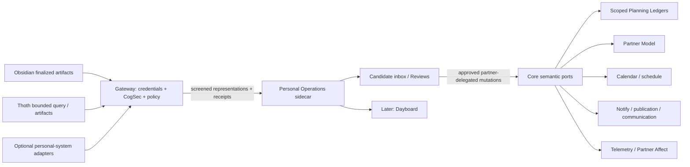

# Personal Operations Pack Design Bible

> Status: accepted product direction, reframed 2026-08-02.
>
> This document defines the intended product and architecture. It distinguishes
> current PSFN capabilities from target Personal Operations Pack and core
> foundation work. Nothing marked as target behavior should be read as already
> shipped. The file path remains `docs/productivity-pack.md` for link stability.

## 1. Product Thesis

The **Personal Operations Pack** is an optional PSFN product layer that lets one
designated companion operate the Partner's work and external personal
systems under explicit, standing delegation. It turns authorized
conversations, notes, calendars, routines, places, and other personal data into
reviewable follow-through.

Its job is not to replace the partner's thoughts or run their life without
them. Its job is to reduce the distance between:

1. saying or noticing something;
2. deciding that it matters;
3. remembering it in the right context;
4. making time for it;
5. doing, snoozing, changing, or dropping it; and
6. learning from the outcome without inventing a story.

The Pack is not the source of general planning, calendar, communication,
telemetry, or partner-knowledge capabilities. Those primitives are useful to a
companion managing its own life and relationships, so they belong in Core. The
Pack adds a different authority: managing the partner's operational state and
external systems as an assistant, collaborator, or intentionally demanding
accountability partner.

It should feel like a trusted partner who understands the shape of the
partner's work, not a corporate task manager and not an autonomous manager. It
is deliberately one-to-one, self-hosted software. It is not a multi-tenant SaaS
product and should not acquire SaaS abstractions that weaken that shape.

The working product names are:

- **Personal Operations Pack** — the optional delegation, adapters, automation,
  and human-facing operational product;
- **Personal Operations Companion** — the one companion designated to operate
  the Pack, subject to separate grants;
- **Dayboard** — the dedicated human-facing planning and review application;
- **Partner Model** — Core's provenance-bearing, correctable model of the human
  partner, with durable assertions, a slow-changing profile, and expiring
  current context;
- **Operational Context** — the Pack's narrower view of the partner's active
  work, routines, friction, strategies, and evidence-backed operational
  patterns.

The "clone of me" framing is a useful product metaphor for a companion selected
to manage the partner's systems. It is not an identity claim, a separate
cognitive architecture, or authority to replace the partner's judgment.

The architectural boundary is not whether an action looks like "work." It is
the persisted combination of actor, resource owner, subject, beneficiary,
authority grant, and destination. Intent alone is not a security boundary.

## 2. Constitutional Invariants

These rules are charter-level. Implementations and integrations must preserve
them.

### 2.1 Optional by construction

PSFN must remain a complete companion framework without the Personal Operations Pack.
Disabling or never installing the Pack must leave ordinary conversation,
memory, relationships, creativity, care reminders, scheduling, embodiment, and
world presence intact. It must also leave core
[Partner Affect Estimation](partner-affect.md) operational from whatever core
signals remain authorized.

Pack enablement is a feature and data-access decision, not a companion
maturation tier.

### 2.2 Exactly one Personal Operations Companion

A runtime may have zero or one Personal Operations Companion:

- a single-companion runtime may designate its one companion;
- a cluster may designate exactly one companion across the cluster;
- enabling two Personal Operations Companions in the same cluster must fail closed;
- other companions do not gain access to partner-delegated Pack state or
  sensitive connectors merely because they share a cluster.

The invariant applies to Pack ownership, not to ordinary core care. Other
companions may still remember birthdays, hold their own concerns, use core
planning and their own calendars, pursue North Stars and creative projects,
and participate in normal relational life under existing policy.

A future cross-companion handoff may let another companion submit a bounded,
provenance-tagged candidate to the Personal Operations Companion. It must not let that
companion query the Pack's private state or use its connectors. This handoff is
not part of the first implementation.

### 2.3 One Partner, not an account-management product

The Pack serves one designated Partner identity. Durable Pack state must still
carry the exact canonical Partner contact identity so a routing or restoration
mistake cannot silently bind it to somebody else.

The first implementation must not add organizations, workspaces, teams,
tenant administration, billing, or generalized multi-user ownership.

### 2.4 Partner authority over inferred work

An explicit instruction may create or change work directly. Passive or
ambiguous inference may only create a Candidate.

Examples:

- "Remind me to buy eggs at Costco" may create a Task and Trigger directly.
- "I should probably get my pants repaired before Thursday" creates a
  Candidate unless the companion obtains confirmation.
- An Omi-generated action item is always a Candidate, never authoritative
  merely because Omi labeled it a to-do.

### 2.5 Evidence is not implication

Observed context and evidence have narrow meanings:

- entering Costco may trigger the shopping list;
- entering Costco does not prove that eggs were purchased;
- an exercise-session summary may satisfy one Routine occurrence when an
  operator-approved evidence rule says it can;
- heart rate alone does not prove exercise, stress, illness, or intent;
- a calendar event passing does not prove attendance;
- a receipt may support purchase completion but must not be stretched beyond
  what it actually contains.

### 2.6 Deterministic gates before model calls

Location updates, sensor events, calendar changes, file notifications, and
other high-frequency signals must not cause an LLM call by default.

Cheap deterministic gates decide whether there is eligible new work. LLM
reasoning is reserved for interpretation that cannot be answered from typed
state, cached summaries, or explicit rules. Every recurring inference lane
must expose why it ran or skipped.

### 2.7 Sensitive access is narrow and explicit

Calendar access does not imply email access. Email access does not imply
financial access. Health summaries do not imply raw biometric access.

Each source has its own consent, credential, retention, provenance, and action
policy. The Personal Operations Companion designation alone grants none of them.

### 2.8 No silent second authority

Postgres, Obsidian, external calendars, Omi, and Thoth may all
participate, but each datum must have one declared authority. Synchronization
creates projections and external bindings, not several competing canonical
copies.

### 2.9 Core capabilities do not imply partner authority

The existence of a core capability never grants access to a partner-owned
resource. A companion may have its own Task ledger and calendar while holding
only read access to the partner's calendar and no access to the partner's Task
systems. Personal Operations designation, source consent, capability tokens,
and resource-specific grants are conjunctive.

### 2.10 Content is not clean forever

A screening decision is a receipt for exact content under an exact CogSec
contract. It is not a permanent declaration that a path, site, person, vault,
or document is safe. Receipt reuse is allowed only under the content-addressed
contract in section 7.2.

## 3. Core Foundation Versus Pack Delegation

The boundary follows semantic ownership and authority, not whether a feature
can be used for productivity. If a companion can reasonably use a primitive
for its own projects or ordinary relational life, the primitive belongs in
Core. If a behavior continuously operates the Partner's backlog or
external personal systems, it belongs in the optional Pack.

| Capability | Core PSFN | Personal Operations Pack |
|---|---:|---:|
| Partner identity, Partner Assertions, slow Partner Profile, expiring Partner Current Context | Owns | Reads bounded projections; may propose imports |
| Partner Affect Estimate and Support Posture | Owns | May contribute consented observations |
| Task, Project, Area, Goal, and Routine semantics | Owns | Uses the partner-delegated ledger |
| Companion-self and genuinely shared planning ledgers | Owns | Does not take ownership |
| Partner backlog and standing delegated management | Does not assume | Owns when explicitly enabled and granted |
| Birthdays, reminders, follow-ups, calendar semantics, and a companion's own calendar | Owns | Plans through the same ports |
| Partner calendar read/write | Provides scoped grants and provider-neutral port | Uses only the exact granted scope |
| Notifications, publication, and future communication semantics | Owns policy-governed ports | May invoke under destination-specific authority |
| Typed telemetry, places, and sensor summaries | Owns | Adds Trigger and Routine Evidence rules |
| Bounded knowledge query | Owns | Uses for operational research |
| Blob/representation identity and reusable CogSec Screening Receipts | Owns for every intake consumer | Uses as a high-volume consumer |
| Passive or bulk mining of partner sources | Does not require | Owns |
| Candidate extraction and human operational Reviews | Does not require | Owns |
| Connector sync and partner-specific automations | Provides security and adapter seams | Owns configured behavior |
| Operational Insights and Dayboard | Does not require | Owns |
| Financial, subscription, or inbox analysis | Does not require | Optional and separately authorized |

The same operation therefore changes category with its resource scope:

- a companion schedules time for its own writing Project through Core;
- it reads a partner-shared calendar under a Core `observe` grant;
- it writes the partner's appointment only under a one-off confirmation or a
  Pack-managed delegated write grant;
- it may ask whether inactivity means the partner needs support through core
  Partner Affect, while enforcing a three-workout Routine is partner-delegated
  Pack work.

Calendar capability is core but policy-scoped. The existing canonical
[`schedule`](tool-surface.md#canonical-schedule-surface) surface is the starting
seam. Provider operations should deepen that semantic surface or share one
internal calendar module; they must not become provider-specific model tools.

Communication follows the same rule. `notify` and publication are current core
surfaces. Email, phone, and richer outbound communication are future
provider-backed core capabilities, not shipped behavior implied by this
document. Pack designation alone never grants a sender identity, audience, or
disclosure authority.

## 4. Ubiquitous Language

These terms are canonical across the Core and Pack boundary.

| Term | Meaning |
|---|---|
| **Capture Artifact** | A finalized source artifact: conversation, note, direct command, imported item, or external event. |
| **Candidate** | A proposed Task, Project, Goal, Routine, calendar event, note, Partner Assertion, or Operational Context update awaiting review. |
| **Principal** | The companion, partner, operator, or system service performing an operation. |
| **Planning Ledger** | A hard authority scope containing planning records for one owner and collaboration mode. Initial scopes are `companion_self`, `shared_dyad`, `partner_observed`, and `partner_delegated`. |
| **Task** | A concrete approved action. "Buy toilet paper" is a Task; it need not be called a commitment. |
| **Commitment** | Reserved for an explicit promise or hard obligation when that distinction matters. It is not the generic Task type. |
| **Area** | A persistent sphere of responsibility such as Work, Home, House, Health, Money, or Friends. |
| **Project** | A bounded multi-step outcome within an Area, with a definition of done. |
| **Goal** | A desired outcome that may span Projects and Routines. Its horizon may be short, medium, long, or ongoing. |
| **Routine** | A repeated behavior or cadence, evaluated as occurrences rather than cloned recurring Tasks. |
| **Execution Context** | A place, person, tool, state, or condition useful for doing a Task, such as Costco, phone, office, or with-Alex. |
| **Trigger** | A deterministic rule deciding when a Task, Routine, or question becomes eligible to surface. |
| **Evidence** | A provenance-bearing observation that supports a narrow completion or state claim. |
| **Nudge** | One delivery attempt with a lifecycle: eligible, delivered, acknowledged, snoozed, acted on, expired, or suppressed. |
| **Review** | A human-in-the-loop reconciliation of Candidates, Tasks, scheduling, outcomes, and stale work. |
| **Observation** | A normalized source event retained with freshness and confidence. |
| **Insight** | A bounded correlation or pattern with its evidence window, sample size, missingness, and uncertainty. |
| **External Binding** | The idempotent relationship between Pack state and an external object such as a calendar event or Obsidian document. |
| **Partner Model** | Core's governed aggregate for what the companion knows about the partner. It contains Partner Assertions and bounded projections; it is not one giant prompt. |
| **Partner Assertion** | A typed, provenance-bearing claim about the partner, classified as explicit, observed, inferred, or imported and subject to correction or supersession. |
| **Partner Profile** | A slow-changing, rebuildable Core projection over current Partner Assertions and authorized relational history. |
| **Partner Current Context** | Fresh, expiring Core state such as current availability, activity, location semantics, and recent situation. It cannot silently become durable profile data. |
| **Operational Context** | The Pack's partner-correctable view of active work, routines, execution friction, strategies, and operational Evidence. |
| **Screened Representation** | Exact bytes presented to one CogSec screening contract, such as extracted PDF text. It is distinct from the raw source bytes. |
| **Screening Receipt** | A durable, content-addressed record of a CogSec result for one exact representation and security contract. It is not a permanent trust label. |

### 4.1 Area, Project, Goal, Task, and context are not synonyms

The hierarchy is intentionally modest:

```text
Area: Home
├── Project: Repair the upstairs bathroom
│   ├── Task: Measure the damaged trim
│   └── Task: Call the contractor
└── Routine: Replace HVAC filter every three months

Goal: Make the house easier to maintain
└── supported by the Project and Routine above
```

An Area persists even when no Project is active. A Project ends. A Goal may
span several Projects or Routines. A Task is the next concrete action.

Execution Context is orthogonal to that hierarchy:

```text
Task: Buy eggs
Area: Home
Execution contexts: errands, grocery_store
Place trigger: costco
```

A long-horizon Goal does not require an "epic" clone. Horizon and parent
relationships are enough until real usage proves otherwise.

### 4.2 Planning ownership is explicit

Every planning record carries at least:

- Planning Ledger and canonical owner;
- acting Principal and current steward;
- subject and beneficiary;
- visibility and collaboration scope;
- provenance and external bindings;
- authority grant for partner-owned mutations.

These fields prevent a shared implementation from collapsing different
relationships into one backlog. `companion_self` supports a companion's
writing, art, research, self-improvement, and North Star work.
`shared_dyad` holds genuinely joint plans. `partner_observed` is a read-only
projection. `partner_delegated` is the Pack-operated human backlog.

The physical schema may share focused Task, Project, Goal, and Routine tables,
but access paths must enforce the ledger as a hard partition. A query must not
depend on a prompt saying "only show your own Tasks."

### 4.3 Human Tasks are not companion concerns

The current companion intention substrates are deliberately bounded:

- [`ActiveConcern`](../src/core/intention/concerns.ts) keeps a small,
  short-lived attention set;
- [`PendingFollowUp`](../src/core/intention/pending-follow-ups.ts) holds
  short-horizon whispers;
- [`CareReminder`](../src/core/intention/care-reminders.ts) owns narrow
  important-date and self-reminder behavior;
- [`NorthStarItem`](../src/faculties/north-star/store.ts) holds at most a few
  companion orientation priorities;
- [`PersonalProjectLibrary`](../src/faculties/wiki/personal-projects.ts) owns
  companion-created projects and artifacts.

Those limits protect companion welfare and attention. Neither Core nor the Pack
may widen, reuse, or bypass them to hold an effectively unbounded human
backlog. A companion may care about how the partner's work affects them; the
work itself remains in the partner-delegated Planning Ledger.

## 5. Product Topology

The target shape is a first-party optional sidecar attached to narrow Core
ports, not an alternate companion runtime and not a second copy of core
planning. Core starts and remains fully functional when the sidecar is absent,
disabled, unhealthy, or denied a source.

The existing registry-backed module lifecycle suggests useful health and tool
registration seams, but source execution is currently disabled in
[`loader.ts`](../src/system/modules/loader.ts). The first implementation must
use explicit first-party startup composition and a versioned local protocol. It
must not re-enable arbitrary module execution or invent a generic marketplace.



### 5.1 External interface

The Pack-facing model interface should remain one semantic
`personal_operations` tool, not one tool per entity or connector. Core planning
may expose a separate compact planning interface usable without the Pack. A
likely Pack action family is:

- `capture`
- `inbox`
- `list`
- `create`
- `update`
- `complete`
- `snooze`
- `review`
- `plan`

The final action schema must be designed against real call patterns and token
cost. Provider names, file paths, OAuth details, and sync cursors stay behind
the interface. The sidecar receives no provider or model credentials; privileged
I/O and model-backed CogSec remain gateway-owned.

### 5.2 Internal seams

The implementation should extend existing primitives before introducing new
ones.

| Concern | Intended seam |
|---|---|
| Core planning | New lightweight Planning Port over authority-scoped ledgers |
| Partner shape | New Core Partner Model port over assertions, profile, and current context |
| Sensor and environment intake | Existing [`SensorIngestPort`](../src/shared/telemetry/sensor-ingest-port.ts) and typed event bus |
| Places and affordances | Existing [`places.json` contract](../src/shared/contracts/places-registry.ts) and `world` integration |
| Calendar and reminders | Existing scheduler plus a focused calendar port |
| Communications | Existing notification and publication paths, later provider-neutral email/phone ports |
| Obsidian access | Existing `vault` integration or bounded filesystem adapter |
| Pack attachment | One versioned Personal Operations Port over a local authenticated sidecar transport |
| Durable Pack state | New personal-operations store port with Postgres adapter and exact ledger scope |
| Omi and generic completed conversations | One completed-capture ingest port with API, webhook, and vault-file adapters |
| Screening receipt reuse | New durable CogSec receipt store; current intake hashes are not this cache |
| Partner identity and relationships | Existing contact, relational-memory, and social-graph stores, deepened by Partner Assertions |
| Partner affect | Core [`Partner Affect Estimation`](partner-affect.md); Pack contributes observations only |
| Research lookup | Core Knowledge Query Port with a narrow Thoth adapter |

Source adapters normalize into the same Capture Artifact or Observation
contracts. Downstream modules must not know whether an Omi conversation arrived
through a webhook, API poll, self-hosted backend, or finalized Obsidian file.

## 6. Persistence and Authority

### 6.1 Same Postgres, focused tables and scoped ledgers

Core Partner Model and planning state, plus Pack operational state, belong in
the existing Postgres persistence boundary. The Pack does not require a
separate database. Shared storage does not mean shared authority: every
planning query and mutation is bound to one Planning Ledger.

The target store is expected to need focused tables or equivalent modules for:

- Partner Assertions, profile projections, and expiring current context;
- Planning Ledgers, projects, plans, tasks, goals, and routines;
- captures and source-processing receipts;
- observations;
- candidates and review decisions;
- triggers and evidence;
- nudge delivery state and snoozes;
- external bindings and sync cursors;
- reviews;
- insights and their evidence windows.

Every record carries the owning Principal, subject, beneficiary, ledger or
scope, provenance, timestamps, and sensitivity needed by its domain.
Partner-delegated records additionally carry the exact designated partner and
authority grant. Capture processing must be idempotent across restart and
adapter retries.

### 6.2 Authority by datum

| Datum | Canonical authority | Other copies |
|---|---|---|
| Raw Omi transcript in the established vault workflow | Finalized source file or Omi record, selected per deployment | Search projection and provenance reference |
| Omi summary and extracted action hints | Source artifact | Inputs to Pack Candidate mining |
| Pack Candidate and review decision | Postgres partner-delegated scope | Dayboard and Obsidian views |
| Task, Project, Goal, Routine | Core Planning Ledger in Postgres | Bounded companion context, Dayboard, optional Obsidian projection |
| Calendar event | External calendar | External Binding and bounded cached projection |
| Long-form partner-authored note | Obsidian | Search/index projection |
| General research wiki and bulk reference ingestion | Thoth | PSFN query result or delivered artifact |
| Partner Assertion | Core Partner Model store with provenance | Slow Partner Profile projection and bounded retrieval |
| Partner Current Context | Core freshness-bound context store | Bounded prompt/retrieval view; never automatic durable profile data |
| Partner relationship graph | PSFN core contact, memory, and social-graph stores | Bounded Partner Model view |
| Companion lived conversation | Existing canonical L0 archive | Existing projections |
| Companion durable memory | Existing PSFN memory substrate | Prompt/retrieval projections |
| Derived Operational Context or Insight | Pack Postgres store with provenance | Bounded prompt context and Dayboard inspection |

No sync path may silently promote a projection into authority.

### 6.3 Backup and export

Pack Postgres tables participate in the existing Postgres backup and verified
restore path. Pack-authored Obsidian documents must live in the partner's
backed-up Personal Workspace or another explicitly backed-up vault root.

The Pack must support a human-readable export of its operational state, but
that export is not a replacement for transactional backup.

## 7. Capture and Ingestion

### 7.1 Finalized-capture contract

Passive ingestion consumes finalized artifacts, not arbitrary streaming
fragments. A normalized completion event should identify:

- stable source and source artifact id;
- start, completion, and receipt timestamps;
- source kind and adapter;
- raw artifact reference and digest, plus Screened Representation identity
  when materialized;
- summary, if the source created one;
- source-generated action hints, dates, or events;
- size measures such as duration, segment count, line count, and character or
  token estimate;
- participant/source provenance and privacy classification;
- processing version and idempotency key.

The adapter must not expose a partially written transcript as complete.

### 7.2 Content-addressed CogSec screening receipts

Current PSFN intake already carries optional SHA-256 content references, hashes
the screened prompt text—which may be a truncated or mediated representation,
not the accepted file's raw bytes—and hashes raw bytes for binary-quarantined
attachments. It does not comprehensively record both raw and representation
hashes for every accepted durable document, and it does **not** yet have a
durable cache of reusable successful screening decisions. Normal L1, L1.5,
L2, and L3 screening runs again on later intake; the quarantine store is not a
general pass-receipt cache. Everything in this subsection beyond those existing
hashes is target work.

The target receipt store, blob/representation identity contract, lookup, and
reuse decision are **Core CogSec infrastructure**. The Pack is an early
high-volume consumer, not their owner; web, document, tool, subagent, Thoth,
and future intake surfaces should converge on the same implementation.

The contract avoids repeating expensive screening for byte-identical durable
material without converting a historical result into permanent trust. It has
three distinct identities:

1. **Raw blob digest** — SHA-256 over the exact source bytes. For a file this is
   the bytes read from one stable file descriptor, with no path or mtime added
   and no newline, whitespace, Unicode, or PDF canonicalization.
2. **Screened representation identity** — one SHA-256 over the exact bytes
   delivered to CogSec plus a separate digest over the canonical
   media-type/transform descriptor. The composite identity contains both.
   Examples include decoded UTF-8 Markdown, extracted PDF text, OCR output, or
   a source-provided transcript.
3. **Screening-contract digest** — a stable digest over every
   security-relevant input that decides how those representation bytes are
   treated.

The transform descriptor binds parser, decoder, OCR, normalization, truncation,
chunking, and schema versions plus their effective options. A parser upgrade
therefore invalidates the representation even when the raw PDF bytes did not
change.

A reusable Screening Receipt records at least:

- raw blob and screened representation digests, sizes, and media types;
- stable source artifact identity and derivation lineage;
- source class, effective risk tier, origin class, trust-list match, designated
  partner, consent purpose/scope, sensitivity, and intended sink;
- CogSec mode and policy revision, including a digest of effective rule content
  rather than a friendly version label alone;
- L1 rule/scanner versions, L1.5 classifier identity and weights digest, and
  L2/L3 schema, prompt, model/provider, and evaluation versions when invoked;
- transform descriptor, truncation state, prior screening signals, and any
  safe-representation schema;
- per-layer verdicts, labels, scores, errors, and the final effective decision;
- screening time, expiry/revalidation policy, revocation state, and audit id;
- parent receipt and representation ids for OCR, extraction, summary,
  translation, wiki compilation, or subagent-derived content.

Reuse is fail-closed and exact-match only for the MVP:

- the raw or representation digest must match;
- every screening-contract input must match the current request;
- the receipt must be unexpired, unrevoked, complete, and valid for the intended
  sink and consent purpose;
- current policy must still permit reuse for that source class and risk tier;
- a formerly shadow-mode receipt cannot authorize enforce-mode use;
- any changed bytes, extractor, rule content, source classification, consent,
  policy, scanner, weights, schema, prompt, or model contract invalidates the
  affected receipt;
- missing or unverifiable fields mean rescreen, never optimistic migration.

L3 reuse is especially strict: it is allowed only when the exact screened
representation and the entire effective L3 prompt/schema/model/policy contract
match. A previous L3 `pass` does not exempt an artifact from newly tightened
policy. Implementations may retain layer receipts and rerun only invalidated
layers, but the final decision is always recomputed under current policy.

Format-specific rules:

- a PDF has one receipt lineage for raw PDF bytes and another for the exact
  extracted representation;
- images similarly separate source bytes, OCR text, and any visual-model
  representation;
- a Thoth or Obsidian wiki page, summary, or compiled note is a new derived
  artifact with its own hashes and receipt, linked to its inputs;
- path, mtime, inode, ETag, source id, and frontmatter id are provenance or
  change-detection hints, never substitutes for content hashes;
- one changed punctuation byte produces a different raw or representation
  digest and is screened as changed content.

Reads must be TOCTOU-safe. The implementation opens the artifact, verifies
file identity and size, hashes and screens the same captured bytes, then checks
the descriptor again before committing the receipt. Reuse similarly resolves
and hashes the exact bytes that will be consumed before releasing them to a
model or parser. If stability cannot be proved, processing retries or fails
closed. A remote source is fetched once into a bounded immutable blob before
hashing and screening.

The system may optionally retain an encrypted, governed content-addressed copy
of vetted source and representation bytes. If it retains only an external hash,
every later use must re-read and re-hash the external bytes before receipt
lookup. Hashing a hundred unchanged files is expected; repeating the expensive
model screening is not.

The MVP is whole-artifact SHA-256 reuse. Chunk or Merkle receipts are deferred
until measured corpus size proves they are necessary, because partial reuse
introduces boundary, ordering, and cross-chunk injection risks.

### 7.3 Omi

Omi is an important upstream capture source, but it is not the MVP ingress
seam. The current reliable workflow already lands finalized artifacts in
Obsidian, so the MVP reads the vault rather than requiring a direct Omi
connector.

Observed behavior today is that Omi finalizes a conversation after a quiet
period, processes it, and produces a transcript, summary, and action items.
The existing external workflow places those artifacts into Obsidian. The Pack
may eventually consume Omi through either:

1. an Omi completion webhook or developer API, then ensure the required
   Obsidian copy exists; or
2. the existing vault-first workflow, detecting a finalized Obsidian artifact
   and reading it locally.

Only one route is active for a given source record. Stable Omi ids and content
hashes deduplicate retries and prevent the API and file adapters from processing
the same conversation twice.

The first implementation uses the second route. A webhook/API adapter is a
later latency or reliability optimization and must not force a migration of the
current vault layout.

The source summary and action items are useful first-pass evidence. They are
not trusted as complete or correct. The Pack performs a bounded secondary pass
when deterministic evidence says the conversation deserves one.

Omi's official developer surfaces currently include conversations, memories,
action items, and webhook-triggered integrations:

- <https://docs.omi.me/doc/developer/api/overview>
- <https://docs.omi.me/doc/developer/apps/Integrations>

The adapter contract remains vendor-neutral so later glasses, an ESP32 badge,
or another capture device can produce the same completed-capture shape.

### 7.4 Direct companion conversation

Direct conversation is not delayed passive ingestion.

When the partner opens the companion application, taps a communicator-style
device, or speaks through another authenticated channel:

- direct questions receive immediate answers;
- explicit Task, reminder, or calendar instructions may act immediately under
  normal policy;
- ambiguous possibilities become Candidates or prompt one focused
  clarification;
- "What am I supposed to be doing?" reads the current Pack snapshot and
  calendar rather than mining a new transcript;
- the normal conversation still enters canonical L0 and ordinary memory under
  existing rules.

Hardware changes the adapter, not the personal-operations model.

### 7.5 Obsidian capture

Obsidian is an input as well as an output. Partner-authored notes, clipped
material, Omi conversation artifacts, and other finalized vault documents may
enter through a bounded vault scanner.

File intake must:

- use stable frontmatter ids or content hashes;
- wait for finalized/atomic files;
- retain the source path and checksum as provenance;
- hash and screen the exact stable bytes under section 7.2 before reuse;
- respect configured namespaces rather than scanning the entire vault blindly;
- distinguish personal notes, passive transcripts, research material, and
  Pack-authored projections;
- never interpret a Pack projection as a fresh Partner-authored source.

### 7.6 Other sources

Future capture adapters may include:

- phone or wearable voice capture;
- email notices;
- calendar changes;
- GitHub or research activity;
- financial summaries;
- receipts;
- manual Dayboard input;
- home and mobile sensor summaries.

Each adapter must declare whether its material is:

- an explicit command;
- a passive Capture Artifact;
- an Observation;
- a reference document; or
- an external state change.

That classification determines what the system may do next.

## 8. Mining and Candidate Review

### 8.1 Pipeline

A completed Capture Artifact passes through these stages:

1. **Validate and deduplicate.** Reject malformed, partial, replayed, or
   unauthorized input.
2. **Capture stable bytes and resolve a receipt.** Compute raw and
   representation identities, then either prove exact receipt reuse under
   section 7.2 or continue to screening.
3. **Screen and classify when required.** Apply source provenance, privacy,
   CogSec, and content boundaries before model access, then write a durable
   receipt.
4. **Read cheap source output.** Inspect the source summary, action hints,
   explicit dates, and size metadata.
5. **Evaluate the deterministic deep-read gate.**
6. **Optionally perform one bounded mining pass.**
7. **Normalize and deduplicate Candidates.**
8. **Apply direct authority or queue human review.**
9. **Record the decision and advance the processing watermark.**

Failure at any stage leaves a visible retryable or quarantined state. It does
not advance the watermark and does not silently discard the artifact.

### 8.2 Deep-read gate

A full transcript read may be warranted when one or more deterministic signals
fire, for example:

- the source produced at least one action item;
- the conversation exceeds an owner-configured duration, line, segment, or
  token threshold;
- the summary is missing, unusually short, malformed, or contradicts the
  action hints;
- explicit dates, appointments, promises, purchases, projects, or goals appear
  in cheap extraction;
- several Areas or Projects may be mixed together;
- the source reports failed or incomplete processing;
- a review request explicitly asks for deeper analysis.

A short, low-signal conversation with a sufficient summary should require no
second LLM call.

The gate returns a typed decision with its inputs and reason. Thresholds live
in canonical JSON configuration, not module constants.

### 8.3 Secondary mining

The secondary pass does not merely regenerate Omi's list. It compares the
source output against the transcript and returns structured differences:

- confirmed source hint;
- corrected source hint;
- additional Candidate;
- rejected/noisy source hint;
- unresolved ambiguity requiring review;
- relevant profile or reference-note Candidate.

It must not write Tasks, calendar events, memory, Partner Assertions, or
Operational Context directly.

Hostile or unusually sensitive sources, including red-team research, require a
CogSec isolation derivation rather than an ordinary tool-using subagent. The
ephemeral worker receives only the exact representation CogSec authorizes for
isolation, inside the quarantine boundary, plus a fixed extraction schema. It
has no shell, filesystem, network, connector, memory, communication, or Pack
mutation capabilities. It returns a bounded derivation whose lineage points to
the parent Intake Envelope; that output
re-enters CogSec as `subagent_output` or the applicable closed source class
before any Candidate or safe representation is released.

This is a standard Core CogSec capability for risky document parsing, not a
Pack-private bypass. L2/L3 credentials and quarantine authority remain in the
gateway. A terminal subagent response, model summary, or extracted wiki page is
new untrusted derived content until the downstream gate accepts it.

### 8.4 Candidate lifecycle

A Candidate can be:

- pending;
- approved as-is;
- edited and approved;
- merged with an existing item;
- deferred;
- dismissed as noise;
- rejected as unsafe or ungrounded;
- routed to another substrate;
- expired after a configured review window.

Every transition retains source provenance and the deciding actor.

Daily review should be small and interruption-aware. Weekly review may cover
stale Tasks, Project direction, Goal alignment, Routine evidence, and
rescheduling. The system should help the partner decide; it should not create
review busywork merely to prove it is active.

## 9. Obsidian, Thoth, and the Core Partner Model

Obsidian is the partner's durable, browsable knowledge workspace. It is both an
input and an output, but a file's namespace and source class decide who owns
its meaning.

Obsidian is the MVP finalized-artifact ingress. It is deliberately a bounded
adapter over declared namespaces, not permission to crawl the entire vault or
load the vault into companion memory.

**Thoth** remains the authority for:

- bulk ingestion from bookmarks, papers, articles, repositories, and clips;
- general wiki and reference construction;
- the reference-oriented portions of the partner's Obsidian corpus;
- paper, article, archive, and artifact retrieval.

PSFN must not absorb Thoth's crawler, archivist, or general wiki builder into
companion core or the Personal Operations Pack.

Thoth already has source hashes, event/raw-reference hashes, provenance
records, compiled-wiki input hashes, and LLM-result caching in parts of its
pipeline. Those are useful integration evidence and should be preserved. They
do not constitute a PSFN CogSec Screening Receipt and Thoth's prompt-security
posture is not PSFN's intake authority. PSFN verifies exact artifact bytes and
applies section 7.2 at its own trust boundary.

The division of labor is:

| System | Owns |
|---|---|
| Thoth | General wiki/reference data, bulk ingestion, reference-oriented Obsidian data, and research retrieval |
| PSFN core | Companion conversation and memory, Partner Model, contacts, social graph, scoped planning primitives, care, situated presence, Partner Affect, calendar/schedule, communication policy, telemetry, and knowledge query |
| Personal Operations Pack | Partner-delegated ledger, passive/bulk mining, Candidates and Reviews, sync, automations, Operational Context, Insights, and Dayboard |
| Obsidian | Human-facing Markdown workspace whose declared namespaces retain the authorities above |

### 9.1 Partner Model, profile, and current context

Human-shape knowledge belongs in Core when it is needed for companionship:

- the partner's exact identity, biography, job, appearance, and important
  dates;
- preferences and dislikes, from favorite colors to interaction boundaries;
- values, hopes, fears, aspirations, and partner-authored self-description;
- family, friends, coworkers, providers, and other important contacts;
- roles such as manager, colleague, partner, or family member;
- provenance-bearing relationship edges;
- explicit corrections and time-bounded changes.

These are not all equivalent facts. Core stores them as typed Partner
Assertions with a shared provenance envelope and category-specific rules. A
birthday can be a stable identity assertion; a favorite color is a preference;
a fear is a sensitive self-description; model output is an inference. Each
assertion carries subject, category, typed value, basis (`explicit`, `observed`,
`inferred`, or `imported`), confidence, sensitivity, validity interval,
provenance references, correction state, and supersession history.

The Partner Model exists so a companion can know its partner well, not to turn
ambient data into surveillance. Ordinary relationship knowledge and explicit
partner correction are privileged; bulk external sources never receive a
blanket mandate to populate the model.

Partner statements and corrections outrank inference. Contradictory evidence
remains inspectable; a model must never silently overwrite an explicit
assertion. Unknown assertion categories reject until their schema, cardinality,
sensitivity, and retrieval policy are defined.

Core already has typed biographical claims, freshness-bound Recent Contact Shapes, relational memory, a social graph, and a
personal wiki. Those are shipped ingredients, but the unified Partner Model and
Partner Assertion store are target work. Contacts remain identity and routing
records rather than becoming an unbounded fact bag.

The target model exposes two rebuildable projections:

- **Partner Profile** changes slowly and selects current, authorized assertions
  plus grounded relational history for bounded retrieval;
- **Partner Current Context** holds rapidly changing state with observed time,
  freshness, expiry, and provenance. Location semantics, availability, current
  activity, schedule context, or recent status decay to unknown and do not
  silently promote themselves into the durable profile.

Partner Affect remains a separate core authority that may consume bounded
Partner Model context. The Partner Model does not become a second affect
estimator.

The Pack may read a purpose-limited projection and propose Partner Assertion
Candidates when an authorized source contains relevant human-shape material.
It must not bulk-fill the Partner Model from Obsidian, Thoth, email, or Omi and
must not duplicate contact or relationship authority.

### 9.2 Markdown and YAML interchange

Thoth and PSFN should exchange governed documents as Markdown with strict YAML
frontmatter. A minimal transfer record needs:

- stable document and source ids;
- source class and canonical authority;
- subject contact id when the document is human-shaped;
- provenance references and content hash;
- sensitivity and consent scope;
- created, updated, and observed timestamps;
- schema and processing version.

A `human_shape` source class may create import Candidates for Partner
Assertions, relational memory, the social graph, or Operational Context.

It does not write those stores directly. Review, confidence, subject identity,
consent, and destination policy still apply.

Stable ids and hashes make the interchange idempotent. A PSFN projection must
never be re-ingested by Thoth or PSFN as a new partner-authored source.

### 9.3 Narrow collaboration

A companion may ask Thoth to find a paper by topic, retrieve metadata or an
abstract, summarize it, and deliver the PDF or a reference.

That request does not give Thoth access to Pack state and does not give PSFN
ownership of the general reference wiki.

The Obsidian integration should eventually define explicit namespaces for:

- source-owned Omi transcripts and summaries;
- partner-authored human-shape notes;
- Thoth reference pages and ingested source material;
- Pack-authored Project or Review documents;
- read-only Pack status projections, if retained.

Exact folder names must follow the live vault after inspection. The design must
not invent a parallel vault tree and then require the partner to migrate.

The existing PSFN `vault` surface remains an optional external bridge and must
not silently copy vault contents into companion memory. See the
[personal knowledge-base boundary](memory.md#personal-knowledge-base-wiki).

A future shared partner/companion vault should be a governed projection over
content-addressed artifacts, not a second uncontrolled archive. An exact PSFN
Screening Receipt may avoid rescanning when its audience, consent purpose,
source class, intended sink, and complete security contract also match the
shared use. Sharing a hash never grants a new audience by itself.

## 10. Calendar and Time

### 10.1 Calendar is core

Calendar capability belongs beside core scheduling and care, even when the
Personal Operations Pack is absent.

Core calendar behavior should support:

- a companion-owned calendar available without the Pack;
- reading authorized events and availability;
- creating an explicit appointment or time-specific reminder;
- updating or cancelling a Pack-owned or explicitly selected event;
- birthdays, anniversaries, important dates, and ordinary care reminders;
- stable external ids and idempotent sync;
- event location metadata and provider-native travel alerts where supported;
- timezone-correct date and recurrence handling.

The Pack uses this interface for planning, but does not own the calendar
provider implementation.

Calendar authority is resource-specific. Each calendar binding has an owner,
grantee, audience, provider identity, and one or more explicit permissions:
`observe`, `suggest`, `write`, or `admin`. Sharing the partner's calendar for
situational awareness does not make the companion a secretary. A companion may
place a birthday-surprise planning block on its own calendar while having no
write access to the partner's calendar.

### 10.2 Creation rules

| Statement or source | Default result |
|---|---|
| "Remind me at 4 PM to call the doctor" | Immediate core reminder; calendar event only if configured or requested |
| "I have a doctor appointment Thursday at 4 PM" | Calendar event Candidate or direct create when the statement is an explicit instruction in direct conversation |
| Passive transcript says "I should call sometime Thursday" | Candidate with unresolved time |
| Omi emits a calendar event hint | Candidate |
| Finance source says an autopay bill is due | Announcement/monitoring state by default, not calendar clutter |

When a known appointment place can be resolved from trusted contact/place
knowledge, the calendar event may include its address so the provider can offer
ordinary departure-time behavior. The companion must not guess an address or
silently select among ambiguous providers.

### 10.3 Tasks and time blocks

A Task remains canonical in its Core Planning Ledger. A time block is an
external calendar binding owned by that Task. Deleting or moving the event
updates the binding; it does not silently delete the Task unless an explicit
policy says so.

The Pack should suggest time blocks from availability and constraints. It must
not fill every open hour or turn every due date into an event.

Google Calendar supports stable client-selected event ids and incremental
sync, both of which fit the external-binding model:

- <https://developers.google.com/workspace/calendar/api/guides/create-events>
- <https://developers.google.com/workspace/calendar/api/guides/sync>

Provider-specific behavior remains in the adapter.

## 11. Context, Triggers, and Nudges

### 11.1 Context sources

Useful context may include:

- time and calendar availability;
- current or entered Place;
- device and satellite presence;
- required person or tool;
- current Routine window;
- bounded partner-state summaries;
- recent direct intent;
- store opening hours or travel constraints from an authorized source.

Raw phone coordinates should terminate at the mobile/Hub geofencing adapter.
PSFN consumes stable Place semantics such as `costco`, `home`, or `out`, not a
continuous latitude/longitude trail.

### 11.2 Trigger evaluation

Trigger evaluation is deterministic:

```text
place entered
  + eligible unfinished Tasks for that place
  + freshness and quiet-hour checks
  + nudge cooldown
  + notification permission
= zero or one bundled nudge decision
```

No eligible item means no LLM call and no notification.

### 11.3 Nudge lifecycle

A Nudge records:

- what became eligible and why;
- delivery channel and target;
- delivered, denied, or suppressed outcome;
- acknowledgement;
- snooze deadline and condition;
- repeat count and cap;
- completion or expiry link.

Snooze must be first-class. A grocery nudge acknowledged and snoozed for eight
minutes may reappear once if the partner is still at the store and the Task
remains open. It must not repeat indefinitely.

Several eligible store Tasks should become one shopping nudge, not one
notification per item.

### 11.4 Recent-intent room reminder

The "why did I come into the kitchen?" case is a short-lived Trigger over recent
explicit intent:

1. the partner says they are going to get food;
2. the intent is retained with a tight expiry;
3. trusted presence detects entry into the kitchen;
4. the deterministic gate finds the eligible intent;
5. the companion or satellite reminds them what they came for.

This uses existing situated presence and satellite infrastructure. It does not
require an upstairs/downstairs application or a separate room task manager.

### 11.5 Shared physical devices

`satellites.json` now records separate Primary, Observation Recipient, and
Emanation Member authorities. The retired presence-follow path previously
moved a companion's emanation when a trusted partner entered another bound
room.

The implemented multi-companion policy separates three authorities:

1. **Satellite Primary** — the companion that owns the device's default
   relationship and gets the first opportunity to respond.
2. **Observation Recipient** — a companion allowed to receive selected sensor
   metadata from the device.
3. **Emanation Member** — a companion explicitly allowed to speak or appear
   through the device.

These sets are not interchangeable. Receiving a presence observation does not
grant speech, movement, world control, or access to the room's history.

The designated Personal Operations Companion may be an Observation Recipient for
`presence`, `location`, or another exact scope even when it is not the
Satellite Primary.

It receives the minimum normalized metadata needed to evaluate Pack Triggers.
Raw sensor feeds and unrelated room activity remain withheld.

#### 11.5.1 Presence is not a summons

Entering a room publishes a presence observation. It does not automatically
move, wake, or interrupt any companion.

An active conversation may continue across rooms when the current companion,
partner intent, availability, and device policy allow it. Mere presence
without an active interaction does not imply that a resting, reading, or
otherwise occupied companion should follow.

This rule replaces the former trust-gated auto-follow behavior. Physical
presence cannot reach a movement or world-control operation.

#### 11.5.2 Primary-first response arbitration

When more than one Emanation Member becomes eligible to speak:

1. explicit partner address or an active conversation wins;
2. otherwise the Satellite Primary receives a short response lease;
3. the primary may speak, decline, or return a deterministic no-op;
4. timeout or release makes the next policy-eligible member eligible;
5. exactly one companion may hold the speech lease at a time.

The Personal Operations Companion does not gain speaker priority merely because it
found an eligible Task. It may speak only after the primary declines/releases
and the device allows its emanation.

Arbitration happens before a model call when eligibility is answerable from
Task state, availability, fatigue, quiet hours, active conversation, and
device policy.

Voice and authenticated satellite HTTP responses use the same lease. Fatigue
is read from the exact companion/partner/channel ledger before acquisition.
Lease acquisition, decline, timeout, release, speech outcome, and normalized
observation delivery are persisted through the gateway audit store.
No companion is fabricated as having chosen to speak when it did not.

Shared-device support must preserve the single designated Personal Operations
Companion invariant, companion rest, and cluster privacy.

## 12. Core Lightweight Planning

Tasks, Projects, Goals, Routines, and planning continuity are core semantics.
The same implementation supports a companion's own writing, art, research,
and self-improvement in `companion_self`; genuinely joint plans in
`shared_dyad`; and Pack-managed human work in `partner_delegated`.

The system should be intentionally lighter than Beads or a software-delivery
orchestrator. It does not need branches, worktrees, code-review state, worker
assignment, or issue-tracker ceremony to manage a painting or essay.

### 12.1 Projects

Projects give Tasks enough structure to avoid one giant life bucket. Each
Project has:

- one Area;
- a bounded outcome and definition of done;
- status;
- next meaningful action;
- linked Tasks, notes, artifacts, and calendar bindings;
- optional supporting Goals;
- review cadence and provenance.

Each Project also has one editable **Project Brief/Plan artifact** for narrative
intent, constraints, decisions, and references. Structured Project Tasks remain
canonical database records and refer to that artifact; the artifact is not a
file-per-task persistence scheme.

Companion Projects and human Projects share the same semantics but remain
separate by Planning Ledger, owner, authority, and retrieval. The existing
companion personal-project and North Star surfaces are inputs to this
unification, not evidence that the Pack should build a second planning stack.

### 12.2 Goals

A Goal states an outcome, not a disguised Task list. It may define:

- horizon;
- target or qualitative success condition;
- supported Areas, Projects, and Routines;
- review cadence;
- active, paused, achieved, abandoned, or revised state.

The system may show whether current work supports a Goal. It must not force
every mundane Task to justify itself against one.

### 12.3 Routines

Recurring behaviors are Routines, not endlessly cloned Tasks.

Example:

```text
Goal: Improve physical conditioning
Routine: Work out three times per week
Evidence policy: one qualifying exercise session satisfies one occurrence
Current week: 2 of 3 supported by evidence
```

A missed occurrence remains an outcome to review. It does not create an
ever-growing pile of overdue copies.

### 12.4 Semantic work is not execution state

Long-running agent systems consistently benefit from separating durable intent
from transient execution. PSFN should adapt that pattern without copying a
coding agent wholesale:

| Concept | Responsibility |
|---|---|
| **Goal / Project / Project Task** | Durable semantic intent, dependencies, ownership, state, and partner-visible history |
| **Work Session / Execution Run** | One bounded attempt with runner, budget, progress, checkpoint, failures, blocker evidence, and terminal result |
| **Focus Plan** | A transient ordered view of stable Project Task ids for the current session or turn |

A failed Execution Run stops that attempt; it does not automatically mark the
Goal or Project failed. Pause, resume, revise, cancel, and abandon are
first-class lifecycle operations. Concurrent continuation requires a serialized
lease or explicit replacement so two runs cannot silently operate the same
Task.

After compaction, restart, or handoff, the runtime reattaches a compact current
Project, current Task, checkpoint, blockers, and resource/capability envelope.
Canonical database and artifact state wins over transcript reconstruction.
Autonomous continuation still passes schedule, focus, welfare, charge,
capability, and partner-authority gates.

### 12.5 Lightweight tool seam remains intentionally bounded

The first Core Planning Port should support compact create, list, get, update,
dependency, next-action, pause/resume, and checkpoint operations. The initial
Project Task lifecycle can remain small—for example `pending`, `in_progress`,
`blocked`, `completed`, `cancelled`—provided history is append-only and normal
deletion is not the primary correction mechanism.

The Codex goal/TODO and legacy Claude Code studies settle the separation and
constraints above. Exact tool action names and the resume attachment remain a
design seam for implementation tracers to finalize against real call patterns
and token cost. The repository must not copy either product's
one-goal-per-thread, prompt-only invariants, automatic idle continuation,
coding approvals, or session-local task persistence.

## 13. Sensors, Biometrics, and Evidence

PSFN already exposes typed satellite health/location scopes and an authenticated
telemetry ingest path, but the current external telemetry allowlist is limited
to heartbeat, status, and incident events. Personal-operations work should extend
that path with explicit summary contracts rather than build a second sensor
bus.

Health and wearable adapters should normally emit summaries such as:

- exercise session completed;
- asleep, awake, active, or unknown;
- summary freshness and confidence;
- source record id and time range.

Raw biometric streams, routes, face descriptors, and vendor credentials stay
at the edge unless a separately reviewed use case requires more.

Health Connect models workouts as exercise-session records with explicit start,
end, and exercise type, which is suitable for a summarized Evidence adapter:

<https://developer.android.com/health-and-fitness/health-connect/experiences/workouts>

Evidence policies are operator-owned and narrow. A new evidence type fails
closed until mapped.

Some of the same summaries may also be eligible Signal Observations for core
[Partner Affect Estimation](partner-affect.md). That use is independently
consented and policy-scoped.

The Pack contributes the observation with provenance. Core owns the composite
estimate, Support Posture, interaction constraints, and any affect advisory to
another companion.

Routine Evidence and affect evidence remain separate claims. A workout may
satisfy a Routine without proving a mood, and an activity change may inform an
affect estimate without completing a Task.

One normalized telemetry event may support multiple separately authorized
derived claims. Core may derive an affect Signal Observation while the Pack
derives Routine Evidence. Each claim carries its own purpose, consent, policy,
provenance, and retention; neither claim grants the other.

Receipts may later provide useful evidence:

- compare purchased items against an active shopping list;
- suggest which Tasks appear satisfied;
- point out a likely omission while the partner is still near the store.

A receipt still creates completion Candidates unless the partner has approved
an exact automatic rule.

## 14. Pack Operational Context

Operational Context gives the Personal Operations Companion a focused picture
of the one person's work it is authorized to assist. It is not the Partner
Model and does not own general partner shape.

It may contain:

- sleep/wake, meal, work, and activity patterns;
- work-relevant execution context with freshness;
- recurring friction and successful strategies;
- Area, Project, Goal, and Routine context;
- preferred planning, review, and nudge patterns;
- bounded references to relevant people, places, providers, and notes;
- explicit partner corrections and boundaries.

Core's Partner Model owns identity, Partner Assertions, preferences, contact
profiles, relationship edges, slow profile, and expiring current context.
Operational Context references bounded Core projections rather than copying
them.

It must distinguish:

1. **Partner Model reference** — the core assertion or relationship being used;
2. **observed pattern** — "wake time has usually fallen in this window over
   the last four weeks";
3. **current observation** — "the phone is presently at the kitchen Place";
4. **inference** — "coding activity and mood reports moved together in this
   sample";
5. **unknown** — insufficient, stale, revoked, or contradictory evidence.

High-frequency operational observations and statistical patterns belong in
focused Pack stores or projections rather than flooding the Partner Model,
memory, or prompt context.

Operational Context may emit a consented Signal Observation to core Partner
Affect Estimation. It does not own the Partner Affect Estimate or change a
Support Posture directly.

The partner must be able to inspect, correct, suppress, and delete model
entries. A correction is durable provenance, not a temporary UI override.

### 14.1 Insights

Exist-style correlations are useful when presented honestly.

Every Insight includes:

- variables compared;
- time window;
- sample count and missingness;
- method;
- effect size or direction;
- confidence/uncertainty;
- provenance;
- generated and expiry timestamps;
- explicit "correlation is not causation" semantics.

An Insight does not automatically become a memory, Partner Assertion, Goal, or
intervention. The weekly review may offer it for discussion.

## 15. Sensitive Connectors

### 15.1 Finance

Financial data is Pack-only and separately authorized. It is not ordinary
companion core context.

The first financial capability should be read-only:

- identify subscriptions and renewal dates;
- surface unusual or forgotten recurring charges;
- distinguish autopay monitoring from Tasks requiring action;
- create review Candidates;
- answer bounded partner questions.

Payment, transfer, cancellation, account changes, or purchase blocking are out
of the first scope and require separate high-risk design.

An autopay bill should not automatically fill the calendar. The Pack may issue
a quiet announcement, maintain a monitoring item, or create a Task when action
is actually required.

### 15.2 Email

Email is likewise optional and screened as untrusted inbound content.

Useful first behavior includes:

- bill and appointment notice extraction;
- renewal and cancellation deadline Candidates;
- bounded inbox cleanup proposals;
- lookup of a message explicitly requested by the partner.

Email-derived instructions never execute merely because an email says to do
something.

### 15.3 Self-binding and coercive interventions

Blocking a food-delivery domain because a health Goal exists may be funny, but
it is not part of the initial Pack.

Any future self-binding feature must be:

- explicitly authored by the partner;
- narrow, time-bounded, inspectable, and reversible;
- impossible to infer from a Goal alone;
- safe against emergencies and account lockout;
- independently reviewed as a high-risk control action.

## 16. Human-Facing Surfaces

### 16.1 Dayboard

Dayboard is a later-phase separate application backed by the same Pack state.
The Obsidian MVP must not wait for it. When built, it should provide:

- Capture/Candidate inbox;
- Today and Now views;
- Task lists by Area, Project, Goal, and Execution Context;
- calendar overlay and time-block planning;
- Routine progress with Evidence;
- daily and weekly Review;
- snooze, complete, reschedule, defer, and dismiss;
- source provenance and "why am I seeing this?";
- Operational Context, Partner Assertion Candidate, and Insight
  inspection/correction;
- connector and sync status appropriate to the partner.

It needs responsive mobile and desktop layouts. Mobile optimizes rapid capture,
Now, errands, snooze, and completion. Desktop optimizes board, calendar,
Project planning, Review, source inspection, and longer edits.

### 16.2 Companion application

The companion application remains a relational conversation surface. Its
current design intentionally presents one continuous relationship thread
rather than becoming a dashboard; see
[`companion-ui/README.md`](../companion-ui/README.md#current-ui-surfaces).

Pack additions there should be contextual:

- answer "what am I supposed to be doing?";
- show one relevant Candidate or Nudge card;
- accept direct capture;
- complete, snooze, or reschedule the surfaced item;
- open Dayboard for deeper planning.

The full board and calendar do not take over the conversation screen.

### 16.3 Garden

Garden remains the operator and safety control plane. It should own:

- Pack enablement and Personal Operations Companion designation;
- connector health and credential-presence status;
- source consent, retention, and automation policy;
- Screening Receipt validity, reuse, revocation, and rescan reasons;
- ingestion/quarantine health;
- deterministic-gate observability;
- audit and provenance;
- emergency disable and repair operations.

Garden is not the daily Task application.

### 16.4 PWA before desktop wrapper

A responsive PWA is the first delivery target. It can cover normal mobile and
desktop browsers, installability, web notifications, and offline-tolerant
views.

Electron, Tauri, or another desktop wrapper should be introduced only when a
proven requirement cannot be met safely by the PWA, such as reliable tray
behavior or a required local operating-system integration. Sensitive
connectors and canonical state remain server-side; a desktop wrapper must not
become an alternate backend or credential authority.

## 17. Configuration and Capability Policy

### 17.1 Canonical owner

The target design requires one canonical `personal-operations.json` owner in the
system/cluster-owned config domain because designation cardinality is a
cluster-wide invariant.

Current code already carries a `productivityCompanionId` designation in the
satellite-registry contract. That shipped legacy name is an implementation seam,
not a second authority. The delivery slice must migrate or deliberately retain
it behind the new owner contract with one validated source of truth; it must not
silently accept both fields or add a fallback whose removal is undefined.

It is expected to own:

- schema version and enablement;
- exact Personal Operations Companion id;
- exact designated partner contact id;
- enabled source classes;
- review cadence;
- deterministic mining thresholds;
- nudge, snooze, and bundling policy;
- evidence-policy selections;
- retention and insight windows;
- connector references and non-secret settings.

Secrets remain in credential custody. Paths remain governed by existing
workspace/data-root contracts. No environment variable or browser field may
override Personal Operations Companion identity.

Adding this owner requires the full owner-file contract: loader, validator,
startup checks, Garden exposure, backup/restore, tests, and cluster cardinality
validation. A partially configured enabled Pack fails closed.

### 17.2 Capabilities

The Pack is not a tier adjacent to nursery, apprentice, or autonomous.

Fine-grained tokens should separate at least:

- companion-self Planning Ledger read/write;
- shared-ledger read/write;
- partner-delegated Pack read;
- Partner Task/Candidate mutation;
- partner-calendar observe, suggest, and mutation;
- sensitive source read;
- notification delivery;
- high-risk external action, if ever added.

The exact token vocabulary should be designed with the tool interface.
Personal Operations Companion designation and capability grants are conjunctive: one
never substitutes for the other.

### 17.3 No generic pack framework yet

"Personal Operations Pack" is a product bundle, not proof that PSFN needs a generic
runtime plugin marketplace. Implement the focused module and extract pack
infrastructure only after a second real pack demonstrates which behavior
actually varies.

The sidecar protocol itself is not a general plugin ABI. It exists so Pack
health, tools, telemetry, and requests can attach through explicit ports while
Core continues without the process.

## 18. Privacy, Consent, and Safety

The Pack combines intimate sources. Its privacy model is product behavior, not
an afterthought.

Required rules:

- source-specific opt-in and revocation;
- exact designated partner identity;
- source provenance on every Candidate, Observation, Evidence, and Insight;
- separate observation-recipient and emanation-member allowlists for shared
  satellites;
- sensor delivery to the Personal Operations Companion grants no speech or movement
  authority;
- no raw coordinates in prompts or Pack state;
- no raw biometric streams in ordinary context;
- no financial or email data in another companion's context;
- no Pack-derived Partner Affect Estimate; Pack data enters core only as
  consented Signal Observations;
- no passive transcript instruction becomes an external action without
  authority;
- no third-party conversation participant is silently modeled as the partner;
- raw-source retention is explicit and inspectable;
- derived data can be corrected, suppressed, exported, and deleted;
- stale context degrades to unknown;
- connector failure is visible and never fabricated as "nothing changed";
- every external write is idempotent and audited;
- summaries and Insights disclose their source and uncertainty;
- model calls over sensitive content use the existing trust/CogSec path.

Deeper delegation to the Personal Operations Companion is a relationship and consent
decision expressed through explicit policy, not a bypass around policy.

## 19. Reference Scenarios

These scenarios are acceptance probes for future design and implementation.

### 19.1 Eggs at Costco

1. The partner explicitly asks to buy eggs and chicken at Costco.
2. A Task or grouped shopping Tasks are created.
3. Phone geofencing resolves entry to the stable Costco Place.
4. One bundled Nudge appears.
5. The partner snoozes it for eight minutes.
6. One bounded retry occurs only if still present and incomplete.
7. Presence never marks the purchase complete.
8. A later receipt may create completion Candidates.

### 19.2 Pants before Thursday

1. A passive transcript mentions getting pants repaired before Thursday.
2. The Pack creates a Candidate with a deadline and unresolved time.
3. Review or direct conversation confirms the Task.
4. The companion asks whether to block a proposed free time.
5. Approval creates an idempotently bound calendar event.
6. Known shop hours/address may constrain the proposal only when grounded.

### 19.3 Doctor appointment

1. In direct conversation, the partner explicitly says the doctor appointment
   is Thursday at 4 PM and asks to add it.
2. Core calendar behavior creates the event.
3. A known unambiguous doctor address is attached.
4. The calendar provider may produce its ordinary travel notification.
5. The Pack may associate the event with a health Project but is not required.

### 19.4 Three workouts this week

1. A Goal is supported by a three-times-per-week Routine.
2. Health Connect produces a qualifying exercise-session summary.
3. The configured Evidence rule satisfies one occurrence.
4. Raw heart-rate samples do not enter Pack context.
5. The weekly Review shows supported, manual, missing, and unknown occurrences.

### 19.5 Why did I enter the kitchen?

1. The partner says they are going downstairs to get food.
2. The short-lived intent is retained.
3. Trusted presence detects kitchen entry.
4. The deterministic gate surfaces that exact recent intent.
5. The satellite or companion reminds the partner without opening a general
   mining pass.

### 19.6 What am I supposed to be doing?

1. The partner asks through the companion application.
2. The companion reads Now, calendar, active time block, urgent Task, and
   relevant context.
3. It gives a short grounded answer; when Dayboard is installed it may offer a
   link for deeper planning.
4. It does not dump the entire backlog.

### 19.7 Autopay and renewals

1. A read-only finance or email adapter detects an upcoming renewal.
2. The Pack determines whether action is required.
3. Autopay with no anomaly remains monitoring state or a quiet announcement.
4. A cancellable annual renewal may become a review Candidate.
5. No payment or cancellation occurs automatically.

### 19.8 Find that paper

1. The partner remembers a paper by topic but not title.
2. The companion sends a bounded query to Thoth.
3. Thoth returns likely references and provenance.
4. The companion confirms the intended paper, summarizes it, and delivers the
   PDF or Obsidian reference.
5. Core does not ingest the entire research archive or copy it into companion
   memory to answer the request; Pack enablement is not required.

### 19.9 Cluster isolation

1. A cluster contains ten companions.
2. Exactly one is designated Personal Operations Companion.
3. Another companion attempts to query Pack Tasks or financial state.
4. The request fails closed and is audited.
5. Ordinary relational conversation and that companion's core reminders remain
   available.

### 19.10 Shared kitchen satellite

1. The kitchen satellite has one Satellite Primary.
2. The Personal Operations Companion is an allowed presence Observation Recipient and
   Emanation Member.
3. The partner enters the kitchen while the primary is resting.
4. Both receive only the observations allowed by their scopes.
5. Presence does not move or wake either companion.
6. An eligible grocery Task gives the Personal Operations Companion a reason to
   request the speech lease.
7. The primary receives first opportunity and returns a no-op.
8. The Personal Operations Companion acquires the released lease and gives one
   bundled grocery nudge.
9. The audit shows observation delivery, primary no-op, lease handoff, and one
   speaker.

### 19.11 Companion project versus partner project

1. A companion creates an essay Project in its `companion_self` ledger.
2. It records a Project Brief, three Project Tasks, and a checkpoint through
   Core with the Pack disabled.
3. The partner later delegates management of a separate research Project.
4. The Personal Operations Companion creates that Project in
   `partner_delegated` under the exact grant.
5. Queries, resume context, and external writes remain ledger-scoped even
   though both Projects use the same domain primitives.

### 19.12 Byte-identical research corpus

1. A configured Obsidian namespace contains one hundred static papers and old
   transcripts.
2. The first pass hashes raw bytes and representations and records complete
   CogSec Screening Receipts.
3. A later scan re-reads and hashes the stable bytes, finds ninety-nine exact
   valid receipts, and skips their expensive screening layers.
4. One Markdown file has a new period and receives a new digest and full
   current-policy screening.
5. A PDF whose bytes are unchanged but whose extractor version changed keeps
   its raw identity but regenerates and screens the new representation.
6. Telemetry reports reuse and invalidation without exposing source content.

## 20. Delivery Sequence

Implementation should proceed as vertical slices. Foundation work is Core even
when the Pack is its first consumer; Pack slices remain detachable.

### Foundation Slice 1: Authority and Partner Model tracer

- define Principal, Planning Ledger, resource grant, Partner Assertion,
  Partner Profile, and Partner Current Context contracts;
- add focused Core Postgres ports and provenance/correction history;
- expose one bounded Partner Model lookup without replacing contacts or memory;
- prove current context expires and cannot silently become a durable assertion;
- keep existing runtime behavior unchanged when the new stores are empty.

### Foundation Slice 2: Lightweight companion-self planning tracer

- implement Project, Project Brief/Plan, Project Task, Goal, and focused
  Planning Ledger persistence;
- wire one companion-self writing or art Project through create, next action,
  checkpoint, pause/resume, and completion;
- keep Execution Run state separate from semantic work state;
- reattach a compact stable-id planning snapshot after resume or compaction;
- define a migration/unification path for existing North Star and personal
  project seams rather than deleting them prematurely.

### Foundation Slice 3: Core content-addressed CogSec receipts

- add raw blob, Screened Representation, transform, and screening-contract
  identities;
- persist exact-match Screening Receipts in Core CogSec infrastructure;
- make accepted durable documents record raw and representation hashes;
- implement TOCTOU-safe whole-artifact lookup, reuse, revocation, and rescan;
- prove changed bytes, extractor version, consent, policy, rule content,
  scanner, or L3 contract invalidate reuse;
- expose reuse, miss, invalidation, and expensive-layer savings telemetry.

### Foundation Slice 4: Optional sidecar scaffolding

- add the versioned Personal Operations Port and explicit first-party sidecar
  startup composition;
- add health, telemetry, bounded tool registration, authentication, and
  fail-inert shutdown behavior;
- keep credentials, CogSec model access, external writes, and policy in the
  gateway/Core authorities;
- prove core conversation, Partner Model, companion-self planning, calendar,
  and Partner Affect work with the sidecar absent;
- do not enable registry-sourced code execution or a generic plugin ABI.

### MVP Slice 5: Obsidian artifact to reviewed partner Task

- designate zero or one Personal Operations Companion and exact partner;
- scan only configured finalized Obsidian namespaces;
- classify Omi transcripts, personal notes, and static research distinctly;
- reuse exact valid CogSec receipts and rescan invalid ones;
- run the deterministic summary/deep-read gate and bounded CogSec-isolated
  extraction;
- create Candidates, then approve, edit, merge, defer, dismiss, or reject them
  through conversation or a minimal operator/CLI review surface;
- create a Task in the `partner_delegated` ledger with provenance.

This is the first Pack MVP. It proves passive extraction is not authority and
does not require a direct Omi connector, Dayboard, email, finance, or a new UI.

### MVP Slice 6: Daily personal operations

- add the canonical `personal_operations` tool;
- support explicit Task capture and "what should I do?";
- add bounded Today/Now queries, complete, snooze, reschedule, defer, and daily
  Review;
- add Project/Goal/Routine use over the already-core planning primitives;
- add manual Routine completion before automatic Evidence.

### Later Slice 7: Calendar, places, and communication adapters

- deepen core scheduling with provider-neutral calendar ownership and grants;
- add availability, explicit event creation, External Bindings, and incremental
  sync;
- add place/recent-intent Triggers and Nudge lifecycle;
- extend core communication ports only when real email/phone providers are
  implemented;
- preserve birthdays, care reminders, and companion-owned calendars without
  Pack enablement.

### Later Slice 8: Thoth, Operational Context, and sensors

- add the Core Knowledge Query Port and bounded Thoth lookup/artifact delivery;
- preserve Thoth's general wiki and bulk-ingestion authority;
- add summarized workout and partner-state events with separately authorized
  Routine Evidence and Partner Affect observations;
- add correctable Operational Context and bounded Insights with deterministic
  preconditions.

### Later Slice 9: Dayboard and sensitive connectors

- build mobile/desktop Dayboard views only after the chat/CLI workflow proves
  the domain model;
- add separately authorized read-only email and financial summaries;
- add monitoring state and Candidates;
- perform independent security/privacy review before any mutation feature;
- add additional capture devices through the existing finalized-artifact
  contract, not device-specific cognition paths.

## 21. Existing Work to Reuse

The issue graph already contains related work. Implementation planning should
inspect and extend it rather than create duplicates:

- `psfn-framework-7ang.8` — phone GPS terminates as Place semantics;
- `psfn-framework-vinz.20` — retired trust-gated presence auto-follow;
- `psfn-framework-u4v0` — shipped replacement: shared-satellite observation
  scopes, emanation allowlists, and primary-first response leases;
- `psfn-framework-vinz.21` — location-scoped concerns/reminders on presence;
- `psfn-framework-z7qe.8` — derived partner health state from biometric
  summaries;
- `psfn-framework-twhd` — wake timing from physical signals;
- `psfn-framework-hcwu` — live concern routing into reminder, schedule, and
  project substrates.

The exact scope and status of each bead must be re-read before implementation.
This design supersedes none of them automatically.

Current code seams to inspect first:

- [`src/shared/telemetry/sensor-ingest-port.ts`](../src/shared/telemetry/sensor-ingest-port.ts)
- [`src/channels/api/server.ts`](../src/channels/api/server.ts)
- [`src/shared/contracts/satellite-registry.ts`](../src/shared/contracts/satellite-registry.ts)
- [`src/shared/contracts/places-registry.ts`](../src/shared/contracts/places-registry.ts)
- [`src/core/scheduler/`](../src/core/scheduler/)
- [`src/core/intention/`](../src/core/intention/)
- [`src/boundary/integrations/vault/`](../src/boundary/integrations/vault/)
- [`src/boundary/integrations/world/`](../src/boundary/integrations/world/)
- [`companion-ui/`](../companion-ui/)
- [`docs/partner-affect.md`](partner-affect.md)

## 22. Explicit Non-Goals

The initial Personal Operations Pack does not:

- become required companion core;
- create more than one Personal Operations Companion per runtime/cluster;
- become a multi-user or multi-tenant SaaS;
- replace companion concerns, pending follow-ups, care reminders, North Stars,
  or companion-owned personal projects;
- make core planning contingent on Pack enablement;
- build a second calendar application or calendar protocol;
- replace Thoth or ingest its entire reference archive;
- duplicate core Partner Model or Partner Affect authority;
- treat Obsidian as output-only;
- stream every passive transcript fragment into cognition;
- call an LLM on every sensor, location, or calendar event;
- retain raw GPS or raw biometric streams in ordinary Pack state;
- perform medical diagnosis;
- summon a companion or move an emanation from presence alone;
- move, pay, transfer, cancel, purchase, or block services through financial
  access;
- infer coercive self-binding rules from Goals;
- let Omi, email, a webpage, or another untrusted source directly create
  external actions;
- create a generic pack/plugin framework before a second pack proves the need;
- create a separate Pack database;
- treat a path, source, hash, or old CogSec pass as "clean forever";
- reuse screening when any security-relevant contract input is unknown or
  changed;
- copy Codex, Claude Code, or Beads task machinery wholesale into companion
  planning;
- replace the partner's thinking or hide decisions behind an automated clone.

## 23. Open Design Decisions

These decisions should be resolved from live evidence during the relevant
slice:

1. The exact existing Obsidian layout and namespace ownership.
2. The first calendar provider and the split between reminder-only items and
   visible calendar events.
3. The final Core Planning and `personal_operations` tool action schemas,
   resume attachment, and capability tokens after measuring tracer call
   patterns and token cost while preserving the durable semantic work,
   transient Focus Plan, and Execution Run split.
4. Deterministic deep-read thresholds after measuring real Omi summaries and
   transcript sizes.
5. Screening Receipt expiry/revalidation windows by source class and whether
   the vetted content-addressed byte store is enabled for the first deployment.
6. Whether PWA notifications are reliable enough before a desktop wrapper is
   justified.
7. The exact Markdown/YAML human-shape schema and mapping into Partner
   Assertion versus Operational Context Candidates.
8. The exact shared-satellite observation scopes, Emanation Member config
   fields, response-lease duration, and eligible-member ordering after the
   primary releases.

These are bounded implementation decisions, not reasons to weaken the
constitutional invariants.

## 24. Product Success

The Pack succeeds when:

- changing phones or capture devices no longer fragments the partner's system;
- passive rambling reliably produces a small, reviewable set of useful
  Candidates rather than a noisy automatic backlog;
- explicit commands become reminders, Tasks, or calendar events with little
  friction;
- the companion can answer what matters now without dumping everything;
- place and time nudges arrive when useful and remain easy to snooze;
- Routines use narrow Evidence without pretending sensor data proves more than
  it does;
- Obsidian remains a durable source and destination for the partner's thinking;
- Thoth and the personal companion complement rather than duplicate one
  another;
- the core Partner Model becomes more accurate through explicit assertions and
  corrections without absorbing the research vault;
- Operational Context becomes more useful through Pack use while remaining
  inspectable, correctable, and separate from partner identity;
- unchanged durable artifacts reuse exact valid CogSec receipts while changed
  bytes or security contracts reliably rescreen;
- shared satellites deliver scoped observations without summoning companions
  or producing competing speech;
- sensitive sources remain optional, isolated, and truthful;
- one designated companion can provide deep assistance without spreading the
  partner's private operational life across the cluster.
