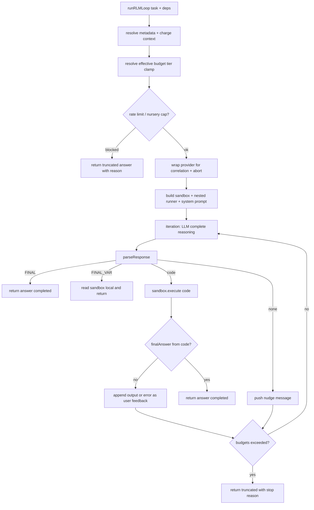

# Analysis Workbench

The **analysis workbench** (`analysis_workbench`, module `src/core/tools/analysis-workbench/`) is a core-tier agent tool that lets the companion solve large-context analytical tasks in a **temporary, bounded REPL sandbox** instead of stuffing raw material into the primary conversation. The model drives an iterative loop — write code, run it out-of-process, read the output, repeat — until it calls `FINAL(...)` or a budget stop truncates the run. The loop, sandbox, response parser, prompt, budget governance, and the host-helper surface that the sandbox code may call all live in this module; the actual child-process execution and the host-helper capability factories live at `src/boundary/sandbox/`.

## Responsibilities

| Area | Responsibility |
| --- | --- |
| Tool surface | Register the core `analysis_workbench` tool with a task-only schema plus caller-side lower-bound budget overrides (`src/core/tools/analysis-workbench/tools.ts`) |
| Iteration loop | Run the RLM cycle — LLM completion, response parse, sandboxed code execution, execution feedback — until `FINAL` or a budget stop (`loop.ts`) |
| Budget & governance | Intersect configured budgets with capability-tier ceilings, enforce per-provider invocation rate limits and per-tier daily cost caps, track session/day USD spend (`loop.ts`, `types.ts`) |
| Sandbox orchestration | Out-of-process REPL with default-deny helper IPC, persistent locals across iterations, output truncation, variable diffing, evidence collection (`sandbox.ts`, `src/boundary/sandbox/sandbox-execution-port.ts`) |
| Response protocol | Parse `FINAL(...)`, `FINAL_VAR(...)`, and fenced code blocks with strict priority (`parse.ts`) |
| Prompt contract | Tell the model when and how to use the workbench, keep mutation out of the model-visible surface, document helpers and shell only when actually wired (`prompt.ts`) |
| Nested analysis | Run child `runRLMLoop` invocations against the remaining shared budget, gated by compositional policy and a depth cap (`loop.ts`) |
| Telemetry | Redacted trace emission (`agent.analysis_workbench.trace`), focus-session evidence recording, and Postgres trace persistence (`tools.ts`, `src/persistence/postgres/analysis-workbench-trace-store.ts`) |

## Entrypoints and integration

`createAnalysisWorkbenchTool(deps)` returns a `SubstrateAgentTool` named `analysis_workbench` (`tools.ts`). Startup composition registers it on the agent loop as a **core** tool with repo and workspace mutation disabled (`allowRepoMutation=false`, `allowWorkspaceWrite=false`) — see `src/app/startup/composition/composition.ts`. The canonical tool-surface registry lists it under the `analysis` domain at core exposure (`src/core/agent/tool-surface/registry.ts`), and capability policy maps it to the `repl.execute` requirement (`src/system/capabilities/requirements.ts`); the safeguard table classifies it `reversible` (`src/system/capabilities/safeguards.ts`).

The tool's parameter schema is `task` (string) plus optional `maxIterations` and `maxTokens` **lower-bound overrides**: a caller may only reduce the loop, never raise it above the owner-controlled ceiling, and any violation is rejected before the loop runs (`tools.ts`).

Parent turns gate availability in `ToolRuntimeFacade`: for routine `memory` / `ops` / `reflection` intents the facade strips the core `analysis_workbench` tool unless the message explicitly requests large-context analysis or carries a parsed attachment; bounded worker contexts (subagent/shard) always keep it (`src/core/agent/substrate-agent/tool-runtime-facade.ts`). Channel adapters treat it as a long-running tool and emit progress status to the channel (`src/channels/shared/long-running-tool-status.ts`), and the runtime context exposes `runtime_analysis_workbench_available` plus the extension-band charge line only when the tool is active (`src/core/agent/substrate-agent/runtime-context-sections/`).

## Control flow: the RLM iteration loop

`runRLMLoop(task, deps, toolInvocationMetadata, runOptions)` is the engine. One pass is: LLM completion (purpose `reasoning`, non-durable work spec) → `parseResponse` → either return a final answer or execute code in the sandbox → append execution output/error as a Partner message → next iteration.

*One workbench iteration: the model writes at most one code block per turn; execution output feeds back as a Partner message until a final action or a budget stop.*

Key mechanics inside the loop (`loop.ts`):

- **Effective budget** — `resolveEffectiveBudget` intersects the configured `budget` with the active capability tier's `tierBudgets` ceiling (element-wise `min`). Defaults: nursery 5 iterations / 30 000 ms / 10 sub-queries / 25 tool calls / 128 MB; apprentice 10 / 60 000 / 15 / 40 / 192 MB; autonomous 60 / 600 000 / 60 / 50 / 256 MB (`types.ts`).
- **Governance** — a `WeakMap` keyed by the LLM provider object keeps invocation timestamps (rate limit, default 5 per 60 s) and per-tier daily USD snapshots that reset on UTC day change (`loop.ts`).
- **Direct response deadline** — direct parent-turn runs share `directResponseTimeoutMs` (validated ≤ `PARENT_TURN_MAX_WALL_TIME_MS − 60 s`); bounded worker requests (`workloadType` `subagent`/`shard`, or a `subagentId`/`shardId`) skip the deadline and keep the full tier wall budget (`loop-helpers.ts`, `types.ts`).
- **Charging** — iterations after the first run under the `analysisWorkbenchExtensionBand` charge surface; charge-quota exhaustion stops the loop with reason `charge quota` before the next iteration. Every iteration's input/output tokens are converted to USD via configured per-million rates and accumulated into session and day cost; the sandbox LLM proxy's token deltas are charged identically (`loop.ts`).
- **Autonomous warning** — crossing `autonomousDailyWarningUsd` in a day appends a soft warning to `budgetStatus.warnings` exactly once.
- **Nursery cap** — nursery-tier runs stop with `daily cost cap` as soon as the day's spend reaches `nurseryDailyCapUsd`, checked before the first iteration and again before each subsequent one.

## Response protocol

`parseResponse` (`parse.ts`) has fixed priority: `FINAL` > `FINAL_VAR` > code block > `none`.

- `FINAL(...)` detection strips fenced code blocks first (so a `FINAL` inside sandbox code is never mistaken for a model action), unwraps single/double/backtick quoted payloads, tracks parenthesis depth for raw structured payloads, and returns the payload; an empty payload is a legal empty answer.
- `FINAL_VAR(name)` looks up a persisted sandbox local after the loop; a missing variable yields `[Variable "name" not found]`.
- `extractCodeBlock` takes the **last** fenced block tagged `repl`, `javascript`, `js`, or bare.
- When the model emits none of these, the loop appends a nudge asking for a code block or `FINAL`.

`FINAL` may also be called **inside** sandbox code: the child throws a sentinel (`__analysisWorkbenchFinalAnswer`) that the sandbox surfaces as `finalAnswer` without an error, and the loop returns it immediately.

## Sandboxed execution

`REPLSandbox.execute(code, timeoutMs, truncationLimit)` (`sandbox.ts`):

1. Snapshots user locals, then rewrites top-level `var`/`let`/`const` declarations into `globalThis` assignments so variables persist across iterations (the async IIFE would otherwise scope them away), wraps the code, and forwards it to the execution port with `initialLocals`, helper names, and the host-helper table.
2. Truncates joined output at `config.outputTruncation` (default 8192 chars) with an explicit omitted-chars suffix, diffs variables against the snapshot, and records the `FinalAnswerSignal` payload or a normalized error.

**Execution boundary** (`src/boundary/sandbox/sandbox-execution-port.ts`): production code execution defaults to a short-lived child process spawned with an **empty environment**, Node `--permission`, `--disallow-code-generation-from-strings`, `--disable-proto=throw`, and a fixed denied-capability list (filesystem, network, process, module_import, global_escape, child_process, environment). The IPC protocol is `analysis-workbench-child-v1`; the parent validates any supplied boundary must be exactly `child_process` + `out_of_process_default_deny` (fail closed). `shell_exec` is only wired when the execution port carries a `sandbox_broker` boundary with a `shellExec` entrypoint — never derived from the LLM provider alone.

**Child runtime** (`src/boundary/sandbox/execution/analysis-workbench-child-source.ts`): code runs in `node:vm` with `process`, `require`, `module`, `exports`, `Buffer`, `fetch`, `WebSocket`, and other globals blocked; `eval` and `Function` are `undefined`; the pure text-analysis helpers are injected; host helpers are IPC stubs that round-trip through the parent (results sanitized for IPC depth/array/object-key bounds); `FINAL(answer)` throws the sentinel; a best-effort memory ceiling is enforced with a 20 ms heap poll and the execution is raced against a timeout.

**Host helper surface** — wired from capability factories and gated (`sandbox.ts`, mirrored by the conformance catalog in `src/core/agent/tool-conformance/sandbox-helper-probe.ts`):

| Gate | Helpers |
| --- | --- |
| always | `llm_query`, `llm_query_strict`, `llm_query_json`, `memory_search`, `episode_search`, `memory_count`, `memory_get_by_id`, `session_messages`, `session_search`, `schedule_list`, `module_list`, `module_health`, `repo_status`, `repo_diff`, `read_file`, `list_files`, `web`, `web_fetch`, `crawler_fetch`, `web_research` |
| nested_analysis | `nested_analysis` (only when a runner is provided) |
| repo_mutation | `repo_apply_patch`, `repo_commit` (only with `allowRepoMutation`) |
| workspace_write | `write_file` (only with `allowWorkspaceWrite`) |
| shell_exec | `shell_exec` (only for autonomous/custom tier **and** a broker shell-exec port) |

Memory helpers run against a **subject-authorized** store derived from the request correlation, and memory/retrieval helpers fail closed without a trusted subject context; `memory_search` requires an embedding service and filters quarantined memories. File helpers route through the governed `SandboxFileRead` paging seam (one bounded page with `content`/`offsetBytes`/`nextOffsetBytes`/`eof`/`truncated`), and web helpers route through gateway `webFetch` lanes (`default` vs `local_crawler`) with SSRF defenses. All helper classes consume the shared `SandboxBudgetRef` (`subQueries` / `toolCalls` counters); once exhausted they return fixed `[Budget exceeded: max sub-queries reached]` / `[Budget exceeded: max tool calls reached]` strings instead of executing.

The pure text helpers (`search`, `grep`, `grep_v`, `between`, `head`, `tail`, `word_frequency`, `diff`, `text_similarity`, `dedupe`, `group_by`, `partition`) live in `helpers.ts` and are duplicated verbatim into the child so text analysis works without host IPC.

## Nested analysis

The `nested_analysis(task, options?)` host helper spawns a fresh child `runRLMLoop` with its own system prompt and message array and returns **only the child's final answer string** (conclusion-only; no scratchpad leaks). It is gated by compositional policy: the loop evaluates `evaluateCompositionalPolicyForChannelId(..., purpose: 'analysis_workbench')` and throws `nested_analysis is disabled by compositional policy (...)` when denied; depth is capped at `MAX_NESTED_ANALYSIS_DEPTH = 2` (`loop.ts`, `src/system/capabilities/compositional-policy.ts`). Child budgets derive from the **remaining shared budget** — iterations, tokens, and wall time left in the root envelope — so nested LLM spend counts against the parent token budget. Diagnostics count calls, successes, failures, and the max depth reached.

## Budget stops, results, and failures

`BudgetStatus.exceeded` carries exactly one reason: `max iterations`, `token budget`, `wall time`, `sub-query limit`, `tool-call limit`, `llm timeout`, `invocation rate limit`, `daily cost cap`, or `charge quota`. Truncated results return a fixed fallback answer for the reason (e.g. `[Analysis workbench loop stopped: max iterations]`, or the dedicated rate-limit/cost-cap/timeout strings) and are surfaced as tool errors. `runAbortableAnalysisOperation` races each completion against a deadline timer plus combined parent signals; parent cancellation aborts with `Analysis Workbench parent cancelled` and the direct-response deadline aborts with an `llm timeout` stop.

`AnalysisWorkbenchResult` (`types.ts`) carries `outcome` (`completed` | `limit_reached`), `continuation` (`not_needed` | `restart_required`), the projected `limitPolicy`, iteration/token/duration counters, per-iteration `steps` (code, output, error, tokens, evidence, variables changed), flattened `evidence`, and nested-analysis `diagnostics`.

## Correlation, telemetry, and evidence

Every iteration, sandbox sub-query, and nested child derives correlation from the tool invocation: `requestId` suffixes `iteration-{N}`, `sandbox-subquery:{N}`, and `nested-analysis-{N}`; origin stages `repl.analysis_workbench.iteration`, `repl.sandbox.llm_query`, and `repl.analysis_workbench.subcall`; ICP conversation-cost correlation is derived for child tool costs. Evidence entries carry a `source` tag (memory/episode/search/llm/web/repo/...), a truncated query and snippet (100/200 chars via `addEvidence`), optional attempt index, and timestamp; `collectEvidence` drains per-step evidence and the result flattens it.

On completion the tool writes a **redacted** trace through `costTelemetry.recordAnalysisWorkbenchTrace` (`agent.analysis_workbench.trace`): steps keep code, tokens, and timings but omit sandbox output and substitute error text (`tools.ts`). The trace persists to a companion-scoped Postgres ring (`analysis_workbench_traces`) pruned to a retention cap, and hydrates the Garden dashboard's in-memory ring (`src/persistence/postgres/analysis-workbench-trace-store.ts`). When channel metadata exists, collected evidence is also recorded into the active focus session via `sessionManager.recordFocusEvidence`.

## Configuration and operations

- **Owner settings** — `SubstrateConfig.analysisWorkbench*` fields (`maxTokens`, `maxWallTimeMs`, `directResponseTimeoutMs`, `maxSubQueries`, `maxIterations`, `executionTimeoutMs`, `outputTruncation`) flow through `buildReplConfig` (`src/app/startup/composition/parity.ts`), which **lifts matching tier ceilings** so owner-set limits are the real loop ceilings and production runs are never silently truncated below the settings contract.
- **Rate limiting** — `rateLimit.maxInvocationsPerMinute` / `windowMs` (default 5/min) govern how often the workbench may be invoked per provider process.
- **Cost** — `cost.inputUsdPerMillionTokens` / `outputUsdPerMillionTokens`, `nurseryDailyCapUsd`, `autonomousDailyWarningUsd`.
- **Mutation policy** — the workbench surface is read-only by composition; `REPLMutationPolicy` can opt into repo/workspace mutation, but even then the system prompt keeps mutation out of the model-visible surface ("produce reviewable patch plans and use direct repo tools outside this workbench").

## Related pages

- [Shards](/openwiki/faculties/shards.md) — shard workers invoke the workbench as bounded workers that keep the full tier wall budget
<!-- openwiki: broken internal link [/openwiki/tool-surface.md] file "/openwiki/tool-surface.md" does not exist. Fix the href or restore the target, then delete this comment. -->
- [Tool surface](/openwiki/tool-surface.md) — canonical tool registry, capability requirements, and safeguard classification
<!-- openwiki: broken internal link [/openwiki/cognitive-security.md] file "/openwiki/cognitive-security.md" does not exist. Fix the href or restore the target, then delete this comment. -->
- [Cognitive security](/openwiki/cognitive-security.md) — policy framing around tool escalation surfaces
- [Sandbox](/openwiki/runtime/sandbox.md) — shared sandbox contracts and the gateway shell boundary
