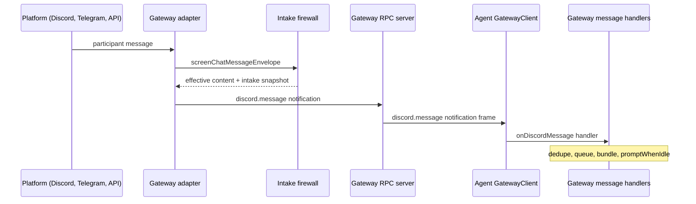
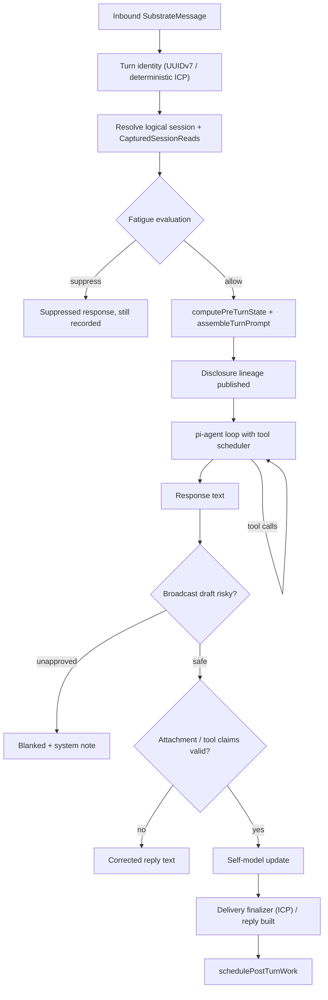

# Chat Turn Lifecycle

This page traces one turn end to end: inbound platform message → intake firewall →
gateway notification over the RPC transport → agent-side pump → session-bound turn
execution (prompt assembly, model loop, tool calls) → reply disposition and
delivery back through the gateway → persistence to canonical storage → post-turn
background work, deferred post-turn actions, and the post-turn appraisal lanes.
Source and tests are authoritative; when prose and code disagree, write the code.

## 1. Runtime split and the gateway RPC transport

The runtime is always the split shape (see `/openwiki/architecture.md`): the
**gateway** owns platform adapters, the intake firewall, LLM/model provisioning,
and fleet authority; the **agent** is an isolated process owning the turn, the
session store (L0), and memory faculties; the **operator** plane observes. The
agent's model calls are RPCs to the gateway — `GatewayClient` implements
`LLMProviderPort`/`EmbeddingProviderPort` (plus model discovery, system-data
writing, shard-workload lifecycle, and memory-deletion approval ports), so it is
a drop-in client for direct providers (`src/boundary/gateway/client.ts#L392-L398`).

The wire itself is NDJSON over a unix socket or `wss://` with mandatory mTLS:
`GatewayRpcEndpoint` resolves from `GATEWAY_RPC_ENDPOINT` (or the legacy
`GATEWAY_SOCKET`), and a WSS endpoint requires TLS file config plus an expected
peer SPIFFE URI that is verified against the peer certificate
(`src/boundary/gateway/transport.ts#L123-L218`, `L900-L935`). `NdjsonConnection`
frames one JSON value per line, answers transport-level liveness probes with
`PSFN_RPC_HEARTBEAT_PONG`, closes on a malformed frame, and records per-method
serialized byte/frame statistics (`transport.ts#L22-L32`, `L244-L300`). The agent
client runs a keepalive timer that sends heartbeat frames and piggybacks a fleet
posture health report (`gateway.client.health`); a failed heartbeat closes the
connection so the gateway-connect recovery path can rebuild it
(`src/boundary/gateway/client/transport-runtime.ts#L184-L223`). Egress RPC
requests carry the turn-scoped canary token as a carrier parameter when one is
active (`transport-runtime.ts#L252-L264`).

## 2. Inbound entry: adapters, the intake firewall, and notifications

Platform adapters live on the gateway side. Each adapter builds a
`SubstrateMessage` and — for prompt-bearing chat bodies — runs it through the
intake firewall **before** anything is forwarded to the agent. The firewall is
`screenChatMessageBody`/`screenChatMessageEnvelope`
(`src/core/cogsec/intake/chat-message-screening.ts`), which wraps the
`IntakeScreeningService` (`src/core/cogsec/intake/screening.ts`). It returns the
effective (sanitized/quarantined) content plus an `IntakeEnvelopeSnapshot` that
must travel with that exact body. The Discord adapter, for example, screens the
envelope, applies document-ingest screening for attachments, and carries the
snapshots onward in `routing.intakeEnvelopes`
(`src/channels/discord/adapter.ts#L1089-L1136`). The snapshot is later persisted
onto the session entry so context assembly and memory extraction can consult the
prompt-assembly / memory-write sink gates without re-screening
(`src/core/session/manager.ts#L836-L858`); persisting envelope snapshots while
intake screening is off fails closed.

The gateway then notifies the agent over RPC:

- `discord.message` → `GatewayClient.onDiscordMessage`
  (`src/boundary/gateway/client.ts#L1727-L1732`)
- `companion.message` / `companion.message.delivery_failure` → the
  inter-companion lane
- `voice.handleMessage` (and `voice.transcript.*`) arrive as **reverse RPCs**
  (`src/boundary/gateway/reverse-methods.ts#L164-L195`) and are dispatched to the
  same `onHandleMessage` handler.

All of these land in `registerGatewayMessageHandlers`
(`src/app/agent/gateway-message-handlers.ts`), the single inbound wiring point
installed by `src/app/agent/main.ts#L1872-L1892`.

*Inbound path: platform → adapter → intake firewall → gateway notification → agent-side handler.*

## 3. Agent-side pump: dedupe, queueing, bundling, never-drop

`registerGatewayMessageHandlers` keeps per-route in-flight and recent-state maps
with a fixed `DUPLICATE_MESSAGE_WINDOW_MS = 2 * 60_000` (2 minutes)
(`src/app/agent/gateway-message-handlers.ts#L68-L108`). A message is keyed by
`route:channelId:messageId`; a duplicate is answered from the cached response or
awaits the in-flight promise instead of re-running the turn, and each
suppression is recorded on the safeguard audit trail
(`src/app/agent/gateway-message-handlers.ts#L894-L1052`).

**No conversational message is ever dropped.** If the agent is busy, the handler
matches the busy error (`/already processing a prompt/i`), awaits
`agentLoop.waitForIdle()`, and retries indefinitely — a wedged agent surfaces as
repeated warnings, never silent loss (`promptWhenIdle`,
`src/app/agent/gateway-message-handlers.ts#L699-L724`; covered by tests at
`src/app/agent/gateway-message-handlers.test.ts#L819-L863`).

The Discord lane uses a dedicated queue with a single pump. While a turn is in
flight, messages that arrive are **bundled** — same channel, same author,
contiguous — into one follow-up turn whose content joins the newest envelope's
identity (`takeNextDiscordBundle`/`bundleDiscordMessages`,
`src/app/agent/gateway-message-handlers.ts#L726-L775`; test at
`gateway-message-handlers.test.ts#L865-L904`). A burst of operator messages gets
one reply that has seen all of them, and each bundled message is measured from
enqueue to dequeue with its own queue-wait telemetry. The companion lane
(`companionPromptQueue`) processes one message per turn; a message whose durable
recorded source already exists is dropped as a restart replay, unless an ICP
correlation requires delivery recovery.

Messages routed `responseMode: 'observe'` never invoke the model: they are
persisted via `agentLoop.observeMessage` and additionally drive the observed
group-memory scheduler and the social-participation candidate gate on the Discord
lane (`src/app/agent/gateway-message-handlers.ts#L1110-L1254`).

## 4. Turn execution: SubstrateAgent → turn-execution-runtime

`SubstrateAgent.handleMessage` classifies the session, flushes queued internal
follow-ups, and dispatches under `TurnRunReservation.runShared` — a reader-writer
lock that lets consecutive ordinary turns overlap while trusted candidate turns
run exclusively (`src/core/agent/substrate-agent.ts#L1562-L1575`;
`src/core/agent/substrate-agent/turn-run-reservation.ts#L39-L108`). Only one
overlapping turn becomes pi-agent's active run; the rest are throw-away
dispatches that wait on the busy pattern in the pump. Cancellation identity is
claimed only by the turn that carries one, so a concurrent scheduler turn can
never clear a voice barge-in's identity (`substrate-agent.ts#L1577-L1632`).

The actual turn body is `handleMessageForTurn`
(`src/core/agent/substrate-agent/turn-execution-runtime.ts#L366-L1849`). Its
stages:

1. **Identity and correlation.** A `TurnID` is a UUIDv7 by default; ICP reply
   turns derive a deterministic turn ID from the correlation seed, and a
   transport-supplied `routing.turnId` is honored only when no authoritative ICP
   correlation binds the turn (`src/core/turns/id.ts#L7-L36`;
   `turn-execution-runtime.ts#L417-L442`). Private ICP target turns require a
   delivery finalizer, and recovered delivery requires durable ICP correlation —
   both fail closed at ingress.
2. **Session binding.** The logical session is resolved at ingress
   (`resolveSessionForIngress`), then the turn captures owner-bound
   `CapturedSessionReads` so admitted work can never mutate active-context
   resolution for a different session (`src/core/session/manager.ts#L439-L484`).
   Under a captured owner, mutable active-context resolution fails closed unless
   the channel is the owner itself; a source-record uniqueness gate guards ICP
   recovery replays.
3. **Fatigue and attention.** `evaluateRuntimeFatigue` runs before model spend;
   suppression short-circuits to a `suppressed` response that still follows the
   ordinary completion contract (end event, `recordTurn`), and ICP turns record
   durable fatigue reservations that a recovered response replays
   (`turn-execution-runtime.ts#L687-L829`).
4. **Pre-turn state and prompt assembly.** `computePreTurnState` builds the
   context envelope, memory blocks, emotion/situated snapshots, and a
   `TurnSnapshot`; `assembleTurnPrompt` renders the full prompt, records the
   prompt snapshot and budget characteristics, and publishes the generation
   disclosure lineage before the first model step
   (`turn-execution-runtime.ts#L830-L946`).
5. **Agent loop.** `invokeAgentForTurn` runs the pi-agent loop with the tool
   scheduler, streaming, tool-result intake screening at the scheduler seam,
   capability gates, and paid-deliverable tracking; every model call goes through
   the gateway client (`turn-execution-runtime.ts#L948-L1024`).
6. **Response guards.** The model text is stripped of mimicked history stamps;
   broadcast drafts are classified and held for approval when risky and
   unapproved; image-attachment and tool-execution claims are validated
   (`healMissingImageAttachmentClaim`, `rejectsUnconfirmedToolExecutionClaim`,
   `rejectsUnfulfilledImageEditRequest`, unfinished-narration detection); an
   intentional no-reply is honored only when no Partner-facing reply was authored
   (`turn-execution-runtime.ts#L1040-L1052`, `L1319-L1413`).
7. **Self-model update.** Internal state, metacognitive flags, and the emotion
   snapshot are computed and persisted before the reply is finalized.
8. **Delivery finalization.** For ICP turns the `TurnDeliveryLifecycle`
   finalizer is awaited **before** any post-turn work begins — it owns transport
   and durable delivery-state recording; a recovered response replays the
   recorded reply and its pending fatigue spend
   (`turn-execution-runtime.ts#L1500-L1608`).

*Turn execution stages inside handleMessageForTurn.*

## 5. Persistence: session entries, TurnRecord, and the completed marker

User/assistant/tool entries land in the session store (L0) as they are produced:
`recordUserMessage` (with authorship guard, intake envelopes, addressing
metadata), `recordAssistantMessage`, `recordToolObservation`, and
`appendSystemNote`. Tool outputs are screened **before** they become persisted
session content: `recordToolObservation` either reuses the
`precomputedToolIntakeScreening` outcome produced at the scheduler seam (same
envelope, same marking plan — never a second side-effecting `screenSync`) or runs
the screen itself; what lands in the entry is the screening's effective text, so
raw hostile output never reaches context assembly, memory extraction, or the
emotion-appraisal feed (`src/core/session/manager-primitives.ts#L126-L164`;
`src/core/session/manager.ts#L1150-L1230`).

The authoritative per-turn record is the `TurnRecord`, written through
`SessionManager.recordTurn` → `store.appendTurnRecord`
(`src/core/session/manager.ts#L1232-L1234`). A TurnRecord carries `status:
'completed' | 'failed'`, the Partner/assistant messages and tool calls, the turn
snapshot and `TurnObservabilityRecord`, version pointers, provenance refs, the
background-work handoff manifest, and projection refs
(`src/shared/contracts/runtime.ts#L19-L53`). The observability record is the
joined list of `TurnStageTelemetryRecord`s (per-stage elapsed/duration data),
`TurnRetrievalTelemetryRecord`s (count + source per retrieval), and the snapshot;
the persisted `TurnSnapshotRecord` is sanitized from the live `TurnSnapshot` —
embeddings are stripped, withheld memory candidates are filtered, and the
rendered prompt strings live on the schema-versioned `PromptPlan` because the
persisted snapshot **is** the plan (`src/core/turns/observability.ts#L104-L133`,
`L217-L240`; `src/core/turns/snapshot.ts#L198-L222`).

Ordering matters: the TurnRecord is persisted **before** background work is
enqueued, so no queue row can outlive its canonical source, and startup replay
can re-enqueue stable turn IDs (`src/core/agent/substrate-agent/turn-execution/post-turn-scheduling.ts#L389-L404`).
A failed turn records a `status: 'failed'` TurnRecord (unless a completed record
already exists, which would destroy the source uniqueness gate), settles its
durable ICP fatigue reservation, and emits `agent.error`
(`turn-execution-runtime.ts#L1706-L1838`).

## 6. Reply delivery back through the gateway

The Discord pump owns delivery: it builds a `DiscordDeliveryCheckpoint` from the
response, sends **text first, then each attachment**, and records the text into
the shared `OutboundReplyGuard` as soon as it is delivered so internal
continuation paths can suppress an exact duplicate
(`src/app/agent/discord-reply-delivery.ts#L35-L102`). Terminal failures are
classified by stage (`handle_message` / `text_delivery` / `media_delivery`),
parked in `DiscordFailedDeliveryCache` for retry on a re-delivered notification,
audited, and surfaced to the room with a fixed system notice; dedupe maps are
transitioned only on success (`src/app/agent/delivery-pump-outcomes.ts#L46-L100`).
A media-only failure retries media without re-sending the text
(`gateway-message-handlers.test.ts#L780-L817`).

The companion lane sends the reply via `gateway.companionSend` (no media on this
lane), reports `processing_failed`/`reply_delivery_failed` receipts to the peer,
and uses the durable delivery lifecycle for at-most-once replay after a crash
(`src/app/agent/gateway-message-handlers.ts#L1320-L1616`).

`OutboundReplyDeduper` is the shared, in-process, content-level guard: it records
every delivered reply per channel (whitespace-normalized hash) and answers
`evaluate` within a 5-minute window so any sender path — the inbound pump, an
internal continuation, or the egress-lease sender — can suppress a duplicate of a
reply the room already received. Suppression is always surfaced loudly, never
silent (`src/system/lifecycle/outbound-reply-dedupe.ts#L24-L133`).

## 7. Post-turn work and background lanes

`schedulePostTurnWork` runs after delivery finalization. It:

1. Infers post-turn actions (skipped for testing-harness turns) and emits
   `agent.post_turn.actions.inferred` for the deferred-action runtime.
2. Records turn usage cost telemetry.
3. Builds and persists the completed `TurnRecord` with a
   `backgroundWorkHandoff` manifest.
4. Enqueues background work: `memory_extraction`, `intention_post_turn_hooks`,
   `emotion_appraisal` (when narrative drift was reserved), and
   `auto_compaction` (`post-turn-scheduling.ts#L189-L404`). Enqueue failure defers
   the handoff for recovery (`sessionManager.deferBackgroundWorkHandoffRecovery`).

Background work runs through the `BackgroundWorkSupervisor` with anti-starvation
welfare policy, bounded attempts, and handoff recovery
(`src/core/agent/substrate-agent.ts#L643-L685`). Heavier memory passes
(sleep consolidation, arc weaving, dream meaning, orientation rewrite) are
rest-window only.

## 8. Deferred post-turn actions and the post-turn appraisal lanes

`wirePostTurnActionRuntime` (`src/app/startup/composition/post-turn-actions.ts`)
owns the deferred action queue. Actions arrive either from the inferred-actions
event (`agent.post_turn.actions.inferred`) or through the public `enqueue` API;
each action gets an id (or a deterministic hash), a `dedupeKey` (explicit or
`kind:channelId:hash(payload)`), a capability, and a **runtime lane class** —
`foregroundChat`, `postTurnAppraisal`, `backgroundContinuation`, or
`maintenanceReflection` (`post-turn-actions.ts#L131-L139`). Lane budget profiles
cap queued depth and per-tick runs; overflow drops the oldest same-class entries
with a `dropped_budget` handoff, never silently
(`post-turn-actions.ts#L880-L944`).

Execution is driven by a scheduler task (`post-turn-action-executor`,
`intervalMs` floored at 50 ms; default 250) that drains due entries in lane
priority order. Handlers are registered per action kind with an execution-mode
declaration that must be consistent with the lane profile (a `foreground` handler
must map to a lane with `requiresForegroundIdle`; fail closed at registration,
`post-turn-actions.ts#L1475-L1519`). Before a handler runs, an optional
`EligibilityGate` may deny with `memory.write` required; a missing handler is a
terminal failure. Handler results may `rescheduleAt` (no attempt consumed),
contention errors reschedule at the base delay, and other failures retry with
exponential backoff up to `maxRetries` (default 2), then fail terminal
(`post-turn-actions.ts#L946-L1154`).

The queue is durable: the complete candidate state is persisted **before** it
becomes observable in memory, hydration quarantines invalid/duplicate entries to
a `.quarantine` sidecar, and legacy payloads are migrated with an atomic rewrite
(`post-turn-actions.ts#L388-L566`). Every transition emits telemetry and a
completion-handoff journal record — deferred actions are runtime bookkeeping and
never write into session transcripts (`post-turn-actions.ts#L685-L699`).
Registered kinds include sleeptime memory, contact trust-drift review, drift
velocity, second-arrow review, near-turn memory, episode synthesis
(`src/core/scheduler/post-turn-runtime/scheduler-lanes.ts#L361-L571`), plus
notify-companion handoff/candidate and lifecycle tools
(`src/core/tools/notify-companion-handoff.ts#L283-L302`).

The **post-turn appraisal lanes** are wired by `wirePostTurnRuntime`
(`src/core/scheduler/post-turn-runtime.ts`): it registers the intention
post-turn appraisal as a post-turn action inferer (optionally gated by the
compositional capability policy, with a motivation bridge and a
per-channel intention-follow-up activation budget), owns the scheduler-created
post-turn lanes (near-turn memory, episode synthesis, drift and sleeptime
lanes), and builds the outbound provenance/activation gates for intention
follow-ups and social-desire outreach (`post-turn-runtime.ts#L69-L158`). The
appraisal reads the recent transcript through the turn's owner-bound
`CapturedSessionReads` — never through mutable session resolution, which fails
closed under the read-attribution guard — and its follow-up/outreach decisions
are emitted as deferred post-turn actions with due times and concern-typed
provenance (`post-turn-runtime.ts#L178-L216`).

## 9. Autonomous room participation: observe → appraise → reserve → egress lease

On observed group-room traffic the Discord lane builds passive-name candidates,
appraises them into `ignore`/`react`/`reply` with a cheap tool-less appraiser
(fail-closed to `ignore`), and — when the multi-companion speaking arbiter is
wired — runs the deterministic reservation phase **before** the appraiser's model
call (`reserveAndAppraiseCandidate`,
`src/app/agent/gateway-message-handlers.ts#L404-L677`). A gated candidate never
reaches the model; an `ignore` outcome releases the reservation; a retained
`reply` reservation is handed to the egress-lease phase.

`SpeakingEgressLeasePhase.grantReply` binds the exclusive send-once lease in a
settled gate order: reservation-status guard → room-episode pressure + Law-36
single-probe breaker → lease-threshold confidence bar → speak-least fairness →
social-pot draw → acquire the fenced lease → deliver and complete
(`src/core/agent/arbiter/egress-lease-phase.ts#L404-L560`). The phase and its
sender are **off by default** — the `enabled` flag is code-pinned `false` and no
config path may enable autonomous send, so observe/appraise/reserve is live but
nothing sends autonomously (`src/app/agent/startup/speaking-arbiter-lane.ts#L152-L218`).

`createAgentLoopEgressReplySender` (`src/app/agent/egress-reply-sender.ts`) is the
concrete sender used when the lease is granted. It is fail-closed by design:

- **Discord only** — any other channel type returns `unsupported_channel_type`.
- **Per-trigger-event fence** keyed `(channelId, sourceMessageId)` armed before
  the delivery ambiguity window and retained past lease expiry plus a 30-minute
  safety window, so a post-TTL re-drive is suppressed before regeneration
  (at-most-once delivery even when a regenerated reply differs textually).
- **Destination-clamped disclosure** — generation runs on a synthetic
  `internal:` terminal message, but the destination room's disclosure pair is
  resolved fail-closed and its privacy stamped onto `routing.channelPrivacy`, so
  the Context Envelope is the destination ceiling, never the permissive internal
  default; resolution failure means no generation and no send.
- **Real datamarking** — the untrusted trigger text is sanitized with
  participation-appraiser conventions and fenced with `wrapUntrustedContext` so a
  crafted closing delimiter cannot forge the boundary.
- **Shared content dedupe** — the same `OutboundReplyGuard` the reply pump uses
  suppresses an exact-content duplicate from any sender; a silent/empty
  generation is reported as a delivery failure, never sent
  (`src/app/agent/egress-reply-sender.ts#L138-L260`).

## 10. Invariants and failure semantics

- **Never drop a conversational message**: `promptWhenIdle` retries busy
  collisions indefinitely; a wedged agent warns loudly.
- **At-most-once delivery**: inbound dedupe (2-minute window, cached/in-flight),
  checkpointed delivery with success-only dedupe transitions, the shared
  content-level `OutboundReplyDeduper` (5-minute window), and the egress sender's
  per-event fence.
- **Fail-closed participation**: appraiser and egress phases never throw into the
  observe path; a failure can only suppress participation, never invent it;
  autonomous send is off by default.
- **Firewall integrity**: intake envelopes persist only when screening is wired;
  tool results are screened at the scheduler seam before they enter the turn, and
  quarantined content never reaches context assembly, memory extraction, or
  emotion appraisal.
- **Turn identity is unique**: UUIDv7 default, deterministic for ICP replies,
  strict validation; a completed source TurnRecord gates recovery replays.
- **Ordering**: delivery finalization precedes post-turn work; TurnRecord
  persistence precedes background-work enqueue; a failed-turn record never
  overwrites an existing completed record.
- **No raw action text as partner update**: deferred-action completions are
  internal handoffs only.

## 11. Extension points and configuration

- **Channel surfaces**: new platform adapters follow the
  `screenChatMessageEnvelope` → gateway-notification pattern; the agent-side
  handler already registers `discord.message`, `companion.message`, and the
  `voice.handleMessage` reverse RPC family.
- **Post-turn actions**: register a handler per action kind with
  `postTurnActions.registerHandler(kind, handler, { executionMode, runtimeClass })`;
  lane budgets, retry defaults, and the persistence path are composition options.
- **Post-turn appraisal lanes**: `wirePostTurnRuntime` composition options select
  the compositional appraisal policy, capability tier, intention-appraisal
  enablement, and outbound gates; scheduler-owned lanes register their own
  action kinds and maintenance operations.
- **Speaking arbiter**: `passiveNameCandidateBuilder`, `participationAppraiser`,
  `reservationPhase`, and `egressLeasePhase` are optional deps of
  `registerGatewayMessageHandlers`; runtimes without the arbiter store keep the
  observe/appraise path unchanged (nothing is sent).
- **Turn execution**: `TurnExecutionRuntime` adapters (`resolveTaskKind`,
  `resolveAuthorContext`, `buildTurnBudgetCharacteristics`, callbacks) let
  runtimes vary prompt/tool/budget behavior per turn; the `TurnSnapshot` and
  `TurnObservabilityRecord` are the persisted evidence.
- **Transport**: endpoint (unix socket or `wss://`), TLS file paths, expected
  peer SPIFFE URI, keepalive interval, and the session-integrity RPC endpoint are
  all composition options of `GatewayClient`.

## 12. Focused tests

- `src/app/agent/gateway-message-handlers.test.ts` — busy-hold and repeated-busy
  never-drop behavior, same-author bundling into one turn, media-only delivery
  retry without text resend, per-message queue-wait and outbound-delivery
  performance traces, participation appraiser/reservation wiring.
- `src/app/agent/egress-reply-sender.test.ts` — single delivery per trigger
  event, duplicate-event and duplicate-content suppression, disclosure-resolution
  failure, silent-token decline, discord-only gate.
- `src/app/startup/composition/post-turn-actions.test.ts` — queue dedupe, lane
  budget drops, retries/backoff, reschedule, persistence hydration and
  quarantine, eligibility denial, restart recovery.
- `src/core/agent/substrate-agent/turn-execution-runtime.test.ts` and
  `turn-records.test.ts` — turn identity, response guards, record shapes, failure
  recording.
- `src/core/session/manager-intake-screening.test.ts` and
  `src/core/cogsec/intake/chat-message-screening.test.ts` — firewall behavior on
  the inbound path.
- `src/boundary/gateway/transport.test.ts` — NDJSON framing, heartbeat handling,
  endpoint resolution, and WSS mTLS configuration.

Related pages: `/openwiki/architecture.md`, `/openwiki/cognitive-security.md`,
`/openwiki/faculties/automata.md`, `/openwiki/memory/overview.md`,
`/openwiki/runtime/scheduler.md`, `/openwiki/runtime/session.md`,
`/openwiki/runtime/tool-surface.md`, `/openwiki/security/approval-envelope.md`,
`/openwiki/security/context-envelope.md`. Charter law governing the runtime
split and fail-closed contracts is operator-owned and lives in
[`docs/PSFN_PROJECT_CHARTER.md`](../../docs/PSFN_PROJECT_CHARTER.md).
