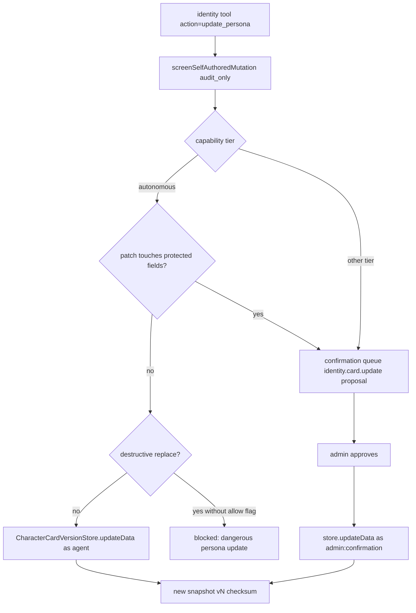
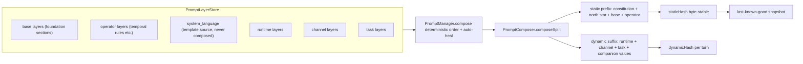

# Identity Runtime

The identity runtime (`src/core/identity/`) is the canonical foundation that anchors
the companion voice. It owns the character card (load, import, versioning, persona
mutation), the layered prompt stack that renders the system prompt, the static
prompt registry used by runtime LLM call-sites, the persona preamble that frames
schema-bound automata prompts, and the system-language template source. Operator
law is `docs/PSFN_PROJECT_CHARTER.md`; this page documents only the code.
Source and tests are authority; when prose and code disagree, write the code.

Related pages: [Core Memory](/openwiki/faculties/core-memory.md), [North Star & Values](/openwiki/faculties/north-star-and-values.md), [Prompt Macros](/openwiki/runtime/prompt-macros.md), [Session](/openwiki/runtime/session.md), [Attribution](/openwiki/security/attribution.md).

## 1. Responsibilities at a glance

- **Character card lifecycle** — explicit identity is required before startup; the
  card is loaded, validated, versioned, rollback-able, and mutable only through
  tier-gated, confirmation-screened paths (`loader.ts`, `card-versioning.ts`,
  `importer.ts`, `companion-runtime.ts`).
- **Prompt stack** — ordered layers (`base → operator → system_language → runtime →
  channel → task`) persisted to JSON with JSONL history, composed by
  `PromptComposer.composeSplit` into a byte-stable static prefix and a per-turn
  dynamic suffix (`prompt-store.ts`, `prompt-composer.ts`, `prompt-manager.ts`,
  `runtime-prompt-layers.ts`).
- **Prompt macros** — one manifest (`PROMPT_RUNTIME_MACRO_HINTS`) with volatility
  classes and producers; a single-pass renderer; a removed-macro table that fails
  closed instead of aliasing; a no-silent-leak final-render invariant
  (`prompt-runtime.ts`, `prompt-runtime/macro-hints.ts`, `prompt-variable-namespace.ts`).
- **Static prompt registry** — operator-editable, file-backed, keyed prompt
  templates with required-key validation and JSONL history (`prompt-registry.ts`).
- **Persona preamble (E6.1)** — one shared service that prepends soft companion
  framing to every recurring schema-bound subprocess prompt; template, labels, and
  instructions are registry-editable while `{{char}}` and `{{personality_summary}}`
  derive from the live card (`persona-preamble.ts`, `persona-preamble-seeds.ts`).
- **System language** — an owner-backed `system_language` layer that is a template
  source, never rendered into the composed prompt, with diagnostic-driven fallback
  to defaults (`system-language.ts`, `system-language-contracts.ts`).

## 2. Character card: load, compose, bootstrap

`loadCharacterCard` reads and parses the card JSON and rejects a missing file with
"explicit companion identity is required before startup"; `assertValidCharacterCard`
requires a non-empty `name` and `personality`
(`src/core/identity/loader.ts#L12-L29`, `#L76-L80`). `composeIdentity` (startup
composition) derives the runtime companion id from config — `resolveCompanionIdFromConfig`
throws on a missing `COMPANION_ID` with the same "explicit deployment identity is
required before startup" rule — and composes the startup system prompt from the card
(`src/app/startup/composition/composition.ts#L388-L401`,
`src/core/identity/companion-runtime.ts#L36-L52`). `createBootstrapStarterCard`
seeds a first-run companion whose card carries `tags: ['bootstrap']` and
`creator: 'system'`, detected by `isBootstrapStarterCard`
(`src/core/identity/loader.ts#L31-L55`).

`composeSystemPrompt(card, userName)` renders the card into XML-wrapped sections
(`<identity>`, `<description>`, `<personality>`, `<scenario>`, `<system_prompt>`,
`<post_history_instructions>`). It resolves `{{char}}` and its aliases to the card
name, preserves `{{user}}` by default for runtime interpolation, skips placeholder
`system_prompt`/`post_history_instructions` values, and omits `mes_example` from the
persistent prompt (`src/core/identity/loader.ts#L82-L120`).

### 2.1 Import

The importer delegates to `@character-foundary/character-foundary`'s `parseCard`,
then normalizes to `chara_card_v2` `2.0` (`normalizeImportedCard`), requiring a
name and personality at runtime. Character-book entries become semantic memory
seeds: `mapCharacterBookEntriesToMemorySeeds` clamps entry priority with a default
importance of `0.55`, caps keywords at 6, tags seeds `lorebook`/`character_book`,
and marks them `sensitivity: 'personal'`. Extracted assets are persisted under
`character-assets/` with sha256-digest filenames (`persistExtractedCharacterAssets`);
`importCharacterCardToPath` writes the normalized card and asset metadata
(`src/core/identity/importer.ts#L129-L158`, `#L160-L184`, `#L195-L275`).
The admin import/rollback confirmation flow lives in the UI component
`identity-confirmation-flow` (import path trimming, versioned rollback context)
(`src/core/identity/identity-confirmation-flow.test.ts#L11-L72`).

## 3. Card versioning and persona mutation

`CharacterCardVersionStore` is the identity state owner: it loads the card at
construction, derives `version = history.length + 1`, and computes a 16-hex sha256
`checksum` of the card JSON. `update` validates the next card, appends a JSONL
history entry (previous/new card snapshots, checksums, actor, optional reason) and
persists the card atomically; no-op checksum-equal updates return the current
snapshot. `updateData` applies a `CharacterCardPatch`; `rollback(version)` restores
`previousCard` from history as an `admin:rollback` update
(`src/core/identity/card-versioning.ts#L90-L115`, `#L275-L379`).

### 3.1 Persona update enforcement (tier-gated)

`executePersonaUpdateAction` (shared by the `persona_update` tool factory and the
`identity` tool's `update_persona` action) is the single mutation gate
(`src/core/identity/card-versioning.ts#L386-L469`):

- In the `autonomous` tier, the protected identity fields — `name`, `description`,
  `personality`, `scenario`, `first_mes`, `mes_example`, `system_prompt`,
  `post_history_instructions`, `creator_notes`, `alternate_greetings`,
  `extensions_visual_description` — cannot be updated autonomously: they are queued
  to the confirmation queue as `identity.card.update` proposals
  (`#L74-L88`, `#L480-L515`).
- Destructive replacements of long text fields are blocked without an explicit
  `allow_destructive_replace=true` (`detectDestructivePatchRisks` compares trimmed
  lengths against the shared destructive-replace heuristic) (`#L54-L72`, `#L196-L219`).
- Every other tier routes all persona patches through a confirmation proposal whose
  approval re-applies the patch as `admin:confirmation`.

The `persona_update` tool is a retired alias of the `identity` tool's
`update_persona` action in the tool-surface registry
(`src/core/agent/tool-surface/registry.ts#L238-L241`); the identity tool wires
`cardStore`, `confirmationQueue`, `getCapabilityTier`, `identityCoolingOff`, and
`intake` at runtime (`src/app/agent/core-runtime.ts#L787-L803`).

## 4. Prompt stack

### 4.1 Layer model

`LayerType` is ordered `base → operator → system_language → runtime → channel →
task` (`LAYER_TYPE_ORDER`); each `PromptLayer` carries `content`, `enabled`,
`priority`, optional `identifier`/`role`/`promptOrder`, optional `channelType` /
`taskKind` routing keys, and `updatedAt`/`updatedBy`/`checksum`/`version` audit
fields (`src/core/identity/prompt-types.ts#L5-L44`). `PromptLayerStatePort` and
`PromptRegistryStatePort` abstract the stores; `createPromptStatePort` provides
disabled-runtime variants whose mutations throw, so a runtime with the prompt stack
off behaves consistently (`src/core/identity/prompt-state-port.ts#L17-L159`).

### 4.2 PromptLayerStore

`PromptLayerStore` is JSON-file-backed with JSONL history and atomic writes. Load is
strict: stored layers are validated field-by-field and the persisted `checksum`
must equal the sha256 prefix of `content`. `system_language` layer content is
validated against the template contract, and a migration rewrites retired
`system_language` template keys (`src/core/identity/prompt-store.ts#L170-L250`,
`#L116-L168`). `seedFromCharacterCard` seeds or migrates the Character Foundation:
an empty store is seeded from the composed card template decomposed into per-section
base layers; a single legacy "Character Foundation" monolith is decomposed into the
per-section layers (`migrateLegacyCanonicalFoundation`); missing foundation sections
are created and system-owned ones normalized
(`src/core/identity/prompt-store.ts#L903-L979`, `#L982-L1050`).

### 4.3 Canonical Character Foundation

`FOUNDATION_SECTION_DEFINITIONS` defines the nine sections — identity, description,
appearance, personality, scenario, system_prompt, post_history_instructions,
mes_example, first_mes — each with a layer name, prompt-manager identifier
(`main`, `charDescription`, `visualDescription`, `charPersonality`, `scenario`,
`systemPrompt`, `postHistoryInstructions`, `dialogueExamples`, `firstMessage`),
order, priority, and default macro content (`src/core/identity/foundation-sections.ts#L7-L98`).
`isCanonicalCharacterFoundationLayer` recognizes those base layers (by name,
identifier, or section identifiers), and the constant
`CARD_BACKED_FOUNDATION_PROMPT_MESSAGE` — "Character Foundation is human-owned
prompt soil. Automated edits are blocked." — is the rejection message used wherever
automated edits would touch them (`src/core/identity/canonical-foundation.ts#L4-L28`).

### 4.4 PromptManager deterministic ordering

`PromptManager.compose` gives deterministic prompt ordering by identifier. Required
identifiers (`main`, `charDescription`, `charPersonality`, `scenario`,
`dialogueExamples`, `postHistoryInstructions`) auto-heal when missing, using
fallback content, and legacy spellings are aliased (`main_prompt` → `main`,
`character_description` → `charDescription`, `mes_example` → `dialogueExamples`,
etc.). A `base` layer without an identifier fails closed, naming the
`npm run migrate:prompt-layer-identifiers -- --apply` backfill command
(`src/core/identity/prompt-manager.ts#L22-L62`, `#L88-L181`,
`src/core/identity/prompt-layer-identifier-contract.ts#L1-L13`).

### 4.5 Composer: static prefix / dynamic suffix

`PromptComposer.composeSplit` is the single composer entrypoint. It keeps
`base` and `operator` layers in the byte-stable static prefix (plus the optional
constitution and North Star sections) and renders `runtime`, `channel`, and `task`
layers plus the companion-values layer into the per-turn dynamic suffix. Channel
and task layers are filtered by `ComposeContext` (`channelType`/`taskKind`);
`system_language` layers never compose into the prompt. Static-class layers are
validated for macro volatility and removed-macro references at compose time (fail
closed). The result carries `staticHash`/`dynamicHash`, layer id lists, prompt
identifiers, and auto-healed identifiers; a last-known-good snapshot is persisted
atomically when the output changes and reloaded on restart
(`src/core/identity/prompt-composer.ts#L35`, `#L302-L411`, `#L430-L456`,
`#L413-L428`).

With `enableConstitution`, the immutable human-safety amendments are prepended as
the `<constitution>` frame, followed by the North Star layer (static) and the
companion-values layer (dynamic, so the static prefix does not churn as the values
journal ages). `ensureConstitutionPrefix` rebuilds the canonical constitution frame
when a persisted prefix drifted (`src/core/identity/prompt-composer.ts#L44-L49`,
`#L77-L90`, `#L326-L339`, `#L528-L556`). Compaction summaries are wrapped as
untrusted context with a guard and control-character stripping; a guard line is
enforced whenever untrusted summary content appears
(`src/core/identity/prompt-composer.ts#L63-L69`, `#L176-L219`).

### 4.6 Runtime prompt layers

Runtime layers are seeded from `config/runtime-prompt-layers.seed.json` (resolved
from `CONFIG_DIR` or `config/`). `ensureRuntimePromptLayers` creates/normalizes the
umbrella layers and migrates legacy identifiers (`runtime.trust`,
`runtime.emotional_affect`, `runtime.last_message_received`, and the rest of the
legacy sets), deleting system-owned legacy defaults and retaining operator-customized
ones; the outcome is summarized as a typed migration outcome. A required-signal
manifest (`runtime.last_message_received`, `runtime.internal_turn_context`,
`runtime.conversation_state`, …) is validated for coverage — each signal must be
present, enabled, and content-anchored, else `validateRuntimePromptLayerCoverage`
reports `missing`/`disabled`/`empty`
(`src/core/identity/runtime-prompt-layers.ts#L79-L114`, `#L207-L251`, `#L287-L308`,
`#L428-L506`).

### 4.7 Prompt runtime layout and immutable anchors

`PROMPT_RUNTIME_BLOCKS` describes the system-prompt blocks (persona adaptation,
runtime context, scratchpad, memory core/retrieval, compaction summary, focus
knowledge, orientation, continuity, cogsec notices, current datetime) plus the
provider-managed `session.current_messages` and `tools.active_schemas`; `runtime.current_datetime`
is locked last so temporal anchors stay grounded. `PromptRuntimeLayoutStore`
persists `prompt-runtime-layout.json` (system-prompt block order + companion-editable
block content for `runtime.persona_adaptation` and `runtime.context`), reloads on a
30-second interval, and normalizes invalid/partial orders back to the default.
`PROMPT_RUNTIME_IMMUTABLE_ANCHORS` classifies the constitution amendments,
card-backed foundation sections, and card-backed persona identity as
`immutable_identity_anchor` (`src/core/identity/prompt-runtime.ts#L478-L651`,
`#L881-L1026`, `#L1024-L1026`). The runtime also seeds the `operator.temporal_rules`
"Temporal Grounding Rules" layer (priority 990, v2), refreshing system-owned content
and content that still references retired blocks (`src/core/identity/temporal-rules-layer.ts#L3-L65`).

## 5. Prompt macros and rendering

### 5.1 Manifest

`PROMPT_RUNTIME_MACRO_HINTS` is the single registry of prompt template variables.
`buildPromptMacroManifest` fails closed on any duplicate registration, so a macro
name can never be silently shadowed. Each entry carries a volatility class —
`static` (safe in the byte-stable prefix), `session_stable`, or `turn` (recomputed
every turn) — and a single producer. Open-ended families resolve through prefix
rules (`character.*`, `extensions_`). `assertStaticPromptLayerMacroVolatility`
rejects turn-volatile macros in `base`/`operator` layers so per-turn values cannot
contaminate the cached static prefix
(`src/core/identity/prompt-runtime.ts#L99-L112`, `#L135-L251`,
`src/core/identity/prompt-runtime/macro-hints.ts#L9-L41`).

### 5.2 Renderer

`renderPromptRuntimeTokens` renders with a single pass: conditionals resolve before
token substitution, substituted values that themselves contain macro syntax expand
recursively with a bounded depth of 8 and a cycle guard, clock macros
(`{{current_datetime}}`, `{{current_date}}`, `{{current_time}}`,
`{{unix_timestamp}}`) re-render from the active timezone, and empty wrapped sections
prune to a fixpoint (8 rounds). Unresolved tokens remain in the output text and are
reported via `unresolvedTokens` for template-composition stages
(`src/core/identity/prompt-runtime.ts#L64-L69`, `#L1126-L1141`, `#L1178-L1270`).
The final-render invariant (`renderFinalPromptSection`) never lets an unresolved
token reach the assembled prompt: a `required` section throws
`PromptRuntimeRenderError` naming the tokens; an optional section is dropped and
reported through `onSectionDrop` (`#L1290-L1367`).

### 5.3 Removed macros (E2.5 consolidation)

One canonical macro per datum: the removed alias spellings (`{{now}}`, `{{date}}`,
`{{time}}`, `{{timestamp}}`, `{{channel}}`, `{{model_id}}`, the
`runtime_affect_profile_*` duplicates, and prose convenience macros) live only in
`REMOVED_PROMPT_MACROS`, which produces clear validation errors naming the canonical
replacement — it is never an alias map, and module init throws if a removed name is
still registered in the live manifest. `assertNoRemovedPromptMacros` is applied at
layer create/update and at compose time; the report-only `auditPromptMacroUsage`
scans persisted layers and registry entries for removed and unregistered references
without rewriting anything (`src/core/identity/prompt-runtime.ts#L253-L352`,
`src/core/identity/prompt-macro-audit.ts#L58-L99`).

### 5.4 Variable namespace and card macros

`TurnPromptVariableNamespace` is the single fail-closed construction path for turn
variables: every key must resolve in the macro manifest, duplicate writes throw
regardless of phase, phases are ordered (`session` before `turn`), and the records
freeze for rendering (`src/core/identity/prompt-variable-namespace.ts#L24-L115`).
`buildCharacterMacroMap` produces the card-derived variables — name aliases
(`char`, `char_name`, `character`, `character_name`), description, personality,
scenario, system prompt, post-history instructions, `mes_example` prefixed with
"Example dialogue style:", tags, creator, alternate greetings, visual description,
dotted `character.*` fields, and flattened card extensions as both
`extensions_<snake_case>` and `character.extensions.<dotted>`; placeholder values
("system prompt", "post history instructions") are cleaned to empty
(`src/core/identity/character-macro-map.ts#L3-L13`, `#L59-L124`).

## 6. Static prompt registry

`PromptRegistryStore` is a file-backed, operator-editable registry for runtime LLM
prompt templates with JSONL history. Seed keys include `memory.extraction`,
`memory.extraction.group`, `session.compaction.summary`, `session.recent.summary`,
`session.search.summary`, `memory.recent_contact_shape.synthesis`,
`memory.sleeptime.orientation`, `memory.sleeptime.wiki`, plus every persona-preamble
key registered by `buildSubsystemPersonaPromptSeeds`. The constructor creates the
seed file when absent and loads strictly; `loadStrict` validates every entry and
auto-adds missing required keys as `system:migration` seeds. `update` validates
(non-empty text, no removed macros, required substrings for structured prompts),
appends history, and bumps the version; `rollback(key, version)` restores
`previousText` as `admin:rollback`. The store reloads when the file mtime advances
and notifies `onMutation` on writes
(`src/core/identity/prompt-registry.ts#L19-L36`, `#L287-L310`, `#L384-L464`,
`#L504-L648`). `syncCharacterFoundationPromptFromCard` gates card→prompt sync on the
required `name`/`personality` fields and an allow-list of runtime-resolved
unresolved tokens before calling `seedFromCharacterCard`
(`src/core/identity/prompt-sync.ts#L16-L79`).

## 7. Persona preamble (E6.1)

`createPersonaPreambleService` is the one shared service that assembles the soft
persona framing prepended to every recurring schema-bound subprocess prompt. The
shared template (`subsystem.persona.preamble`) and every per-subsystem label and
instruction are registry keys (`subsystem.persona.<id>.label` /
`.instruction`) — nothing is hardcoded at a consumer site; consumers only pick a
stable `SubsystemPersonaId` (`memory_extraction`, `profile_synthesis`,
`topic_segmentation`, `sleep_thematic_grouping`, `sleep_refinement`,
`arc_formation`, `concern_review`, `wiki_curation`). `{{char}}` and
`{{personality_summary}}` derive from the live character card: `compressPersonaSummary`
deterministically collapses whitespace and takes the leading sentences (default 320
chars / 2 sentences) with a "still becoming who I am" fallback. `prepend` puts the
soft framing first so schema/format sections stay byte-identical, and defensively
strips any unresolved card macro from the rendered framing
(`src/core/identity/persona-preamble.ts#L45-L153`,
`src/core/identity/persona-preamble-seeds.ts#L25-L48`, `#L72-L187`). The runtime
wires one instance with the prompt registry reader and the live-card variable
provider (`src/app/agent/core-runtime.ts#L521-L528`).

## 8. System language

The `system_language` layer type is an owner-backed template source, not prompt
content: `ensureSystemLanguagePromptLayer` creates or normalizes the "System
Language Templates" layer (`system.language`, prompt order 880), re-seeding
system-owned content to the default template map and validating content shape.
`installSystemLanguagePromptLayerSource` installs a module-level resolution source;
`resolveSystemLanguageTemplates` falls back to `cloneDefaultSystemLanguageTemplates`
with diagnostics when the layer is missing, disabled, or fails to parse, and
`renderSystemLanguageTemplate` renders a key with per-key placeholder validation
(`src/core/identity/system-language.ts#L52-L227`,
`src/core/identity/system-language-contracts.ts#L3-L8`, `#L81-L112`,
`src/core/identity/prompt-composer.ts#L435-L438`).

## 9. Identity tool surface and security invariants

The single `identity` tool exposes `list_layers`, `get_layer`, `diff_layer`,
`history`, `update_layer`, `rollback_layer`, `toggle_layer`, `update_persona`,
`commit_stage`, and `cancel_stage`. Capability tokens are resolved per action
(`identity.read` for reads; `identity.write.runtime` / `identity.write.base` /
`identity.write.operator` for writes by target layer type; fail-closed requirement
set otherwise). `update_persona` rejects prompt-layer parameters and vice versa
(`src/core/identity/prompt-tools.ts#L42-L88`, `#L448-L523`, `#L529-L693`).

Security invariants across the surface:

- **Human-owned foundation** — canonical Character Foundation layers reject
  automated edits (`CARD_BACKED_FOUNDATION_PROMPT_MESSAGE`), enforced at approval
  time and for staged commits (`src/core/identity/prompt-tools.ts#L190-L192`,
  `#L324-L326`).
- **Protected-layer confirmation** — `base`/`operator` layer mutations route through
  confirmation proposals that re-validate version, checksum, and enabled state at
  approval time and reject stale proposals; only canonical-foundation-excluded,
  still-protected layers may be approved (`#L115-L231`).
- **Intake screening** — model-authored mutations pass `screenSelfAuthoredMutation`
  with an audit-only posture for `update_persona`; held calls return a soft notice
  rather than an error (`#L604-L630`).
- **Identity cooling-off** — staged prompt-layer edits commit only after the
  cooling-off window; `commit_stage`/`cancel_stage` gate on stage readiness
  (`#L265-L350`).
- **Persona owner paths** — `createPersonaOwnerPathRegistry` classifies the canonical
  persona/prompt owner files (character card, history, prompt layers/history,
  last-known-good, registry/history, runtime layout) by canonical path and physical
  identity, canonicalizing traversal and symlink aliases, so mutation-attempt guards
  can scope to persona ownership (`src/boundary/gateway/persona-owner-path-registry.ts#L75-L118`).

## 10. Runtime wiring

`wirePromptRuntime` (shared by both agent modes) builds the `PromptLayerStore`,
values journal, and North Star store; seeds the foundation from
`composeSystemPromptTemplate()`; ensures the temporal, runtime, and system-language
layers; installs the system-language source; constructs the `PromptComposer` with
`enableConstitution: true` plus companion-values and North Star providers; and
registers the `identity` tool. `wireStaticPromptRegistry` builds the
`PromptRegistryStore`. `bootstrapAgentCoreRuntime` composes identity, constructs the
`CharacterCardVersionStore` against `config.characterCardPath` and the resolved
history path, and creates the card proposal queue used for persona confirmations
(`src/app/startup/composition/parity.ts#L86-L152`,
`src/app/agent/core-bootstrap.ts#L128-L137`). The persona preamble service and the
identity tool options (`cardStore`, `confirmationQueue`, `identityCoolingOff`,
`getCapabilityTier`, `intake`) are wired in the agent core runtime
(`src/app/agent/core-runtime.ts#L521-L528`, `#L787-L803`).

## 11. Focused tests

- **Card lifecycle**: `card-versioning.test.ts` (version starts at 1, JSONL history
  entries, snapshot/persistence contract, rollback, tier-gated persona updates with
  protected-field confirmation and destructive-replace blocking), `loader.test.ts`
  (macro resolution, placeholder skipping, `{{user}}` preservation),
  `importer.test.ts` (normalization, asset persistence, character-book seeds).
- **Prompt stack**: `prompt-composer.test.ts` (ordering, disabled/channel/task
  filtering, static/dynamic split, constitution mode, last-known-good reload,
  volatility enforcement, removed-macro safety valve), `prompt-manager.test.ts`,
  `runtime-prompt-layers.test.ts` (migration outcomes, coverage validation),
  `prompt-store.test.ts` (strict load, history, foundation seeding/migration),
  `system-language.test.ts` (layer normalization, fallback diagnostics).
- **Macros**: `prompt-runtime.test.ts` (manifest, volatility, removed-macro table,
  single-pass renderer semantics, no-silent-leak final render),
  `prompt-variable-namespace.test.ts`, `character-macro-map.test.ts`,
  `prompt-macro-audit.test.ts`.
- **Registry & preamble**: `prompt-registry.test.ts` (seed creation, validation,
  history/rollback, mtime reload), `persona-preamble.test.ts` and
  `persona-preamble-consumers.test.ts` (registry-driven template/labels, live-card
  derivation), `identity-confirmation-flow.test.ts` (import/rollback confirmation UI
  state).
