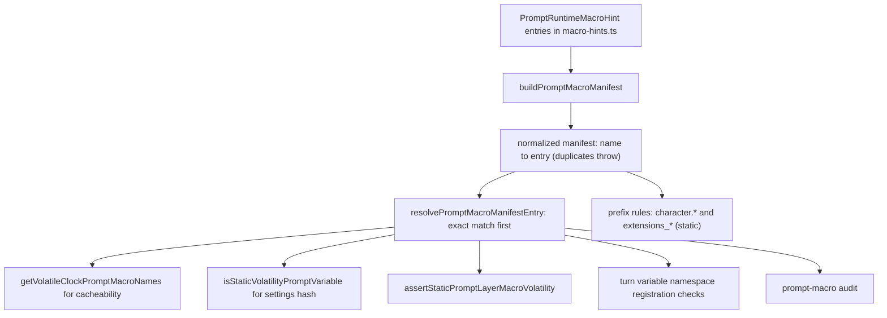
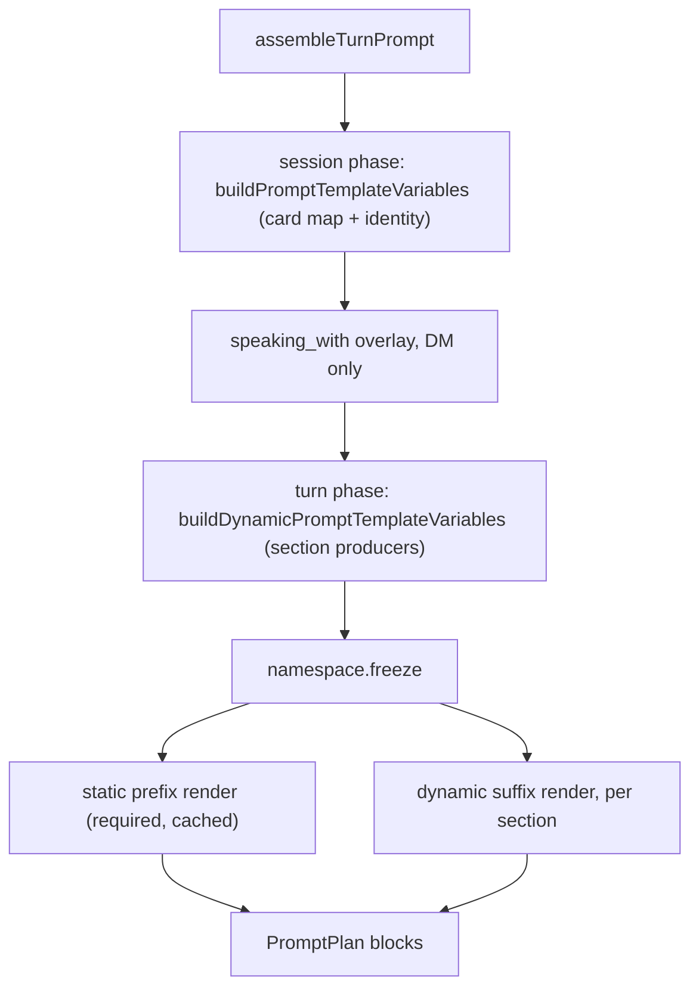

# Prompt macros

Runtime prompt macros are the template variables (`{{user}}`, `{{runtime_chat_type}}`,
`{{current_datetime}}`, ...) that turn character-card and per-turn runtime data into
prompt text. This page documents the machinery that keeps them consistent: **one
manifest** registers every macro with a volatility class and a single producer;
the **character macro map** derives card macros from the live identity source;
**audit gates** fail closed at every write; and the **renderer** expands macros
inside the prompt stack without ever leaking an unresolved token into prompt
bytes. Source and tests are authority; where prose and code disagree, write the
code. Fail-closed contracts stay fail-closed — there are no compatibility shims
or silent fallbacks for removed or unregistered macros.

Related pages: [Identity Runtime](/openwiki/runtime/identity.md) (the owning
<!-- openwiki: broken internal link [/openwiki/prompt-macros.md] file "/openwiki/prompt-macros.md" does not exist. Fix the href or restore the target, then delete this comment. -->
subsystem), [Prompt Macros, Prompt Layers, and the Purity Rule](/openwiki/prompt-macros.md)
(the layer-composition and purity-rule companion), [Chat Turn Lifecycle](/openwiki/runtime/chat-turn-lifecycle.md)
<!-- openwiki: broken internal link [/openwiki/context-envelope.md] file "/openwiki/context-envelope.md" does not exist. Fix the href or restore the target, then delete this comment. -->
(turn assembly), [Context Envelope](/openwiki/context-envelope.md) (per-turn
<!-- openwiki: broken internal link [/openwiki/tool-surface.md] file "/openwiki/tool-surface.md" does not exist. Fix the href or restore the target, then delete this comment. -->
privacy inputs), and [Tool Surface](/openwiki/tool-surface.md) (model-facing
surface). The operator-facing macro inventory, regenerated from the manifest, is
`docs/prompt-macros.md`.

## 1. Macro definition: one manifest, derived authority

Every prompt template variable is registered in `PROMPT_RUNTIME_MACRO_HINTS`
(`src/core/identity/prompt-runtime/macro-hints.ts`) — one registry with no
parallel lists (`src/core/identity/prompt-runtime/macro-hints.ts#L362-L373`).
Each `PromptRuntimeMacroHint` carries a display `token`, a display `group`, a
`description`, an `example`, a **volatility** class, and a **producer** — the
single code path allowed to write that variable into the turn namespace. The
hint interface and producer constants live in the same file:
`CLOCK_MACRO_PRODUCER`, `CHARACTER_CARD_PRODUCER`, `SESSION_BASE_PRODUCER`,
`DYNAMIC_TURN_PRODUCER`, plus per-domain producers for trust, response style,
affect, and metacognition (`macro-hints.ts#L21-L41`, `#L45-L54`).

`buildPromptMacroManifest` derives a normalized manifest (`name` → entry) from
the hints (`src/core/identity/prompt-runtime.ts#L135-L165`). Registration
**fails closed**: a name or alias registered twice throws a
`Duplicate prompt macro registration` error naming both producers, so a
conflicting registration can never silently shadow an existing one. The module
builds the live `PROMPT_MACRO_MANIFEST` once at import
(`prompt-runtime.ts#L167-L168`); every consumer — name resolution, the variable
namespace, layer validation, cache classification, the audit — derives from that
single object. Nothing in the prompt stack carries a parallel macro list.

### 1.1 Volatility classes and producers

The manifest classifies every macro into one of three volatility classes
(`macro-hints.ts#L9-L19`):

- **`static`** — changes only when identity/config artifacts change (character
  card fields, `active_timezone`). Only these participate in the static settings
  hash used by the static-prefix cache.
- **`session_stable`** — stable for a conversation scope (`user`, `channel_id`,
  `trust_level`, `model`, the Garden-editable `runtime_*_extra` overlays).
  Excluded from the settings hash; changes ride the per-scope prefix cache key.
- **`turn`** — recomputed every turn (the canonical clock macros and all
  `runtime_*` state/affect/tooling/attention macros).

The producer string is not documentation: the namespace refuses a variable whose
registered producer did not write it only indirectly — every write to a key the
namespace already holds throws, so each variable has exactly one producer in
practice (`prompt-variable-namespace.ts#L83-L90`).

### 1.2 Name resolution and the open-ended prefix families

`resolvePromptMacroManifestEntry` normalizes the input (lowercase, braces
stripped, trailing `()` removed), tries an exact manifest match first, then the
longest matching prefix rule (`prompt-runtime.ts#L175-L196`). Two open-ended
prefix families exist because character-card extension fields cannot be
enumerated ahead of time: `character.*` and `extensions_*` are both
`static`-volatility, produced by `buildCharacterMacroMap`
(`PROMPT_MACRO_PREFIX_RULES`, `prompt-runtime.ts#L99-L112`). Everything else
must be registered exactly; an unregistered name resolves to `null` and every
caller — the variable namespace, layer validation, the audit — must fail closed
on it.

The manifest also drives the derived rules that keep the cache honest:
`getVolatileClockPromptMacroNames` returns exactly the clock macros produced by
`CLOCK_MACRO_PRODUCER` (`current_datetime`, `current_date`, `current_time`,
`unix_timestamp`) — the only macros allowed to re-render from the wall clock
inside an otherwise cached static-prefix render (`prompt-runtime.ts#L209-L213`);
`isStaticVolatilityPromptVariable` answers true only for manifest-`static` keys,
with unknown keys failing closed to non-stable (`prompt-runtime.ts#L219-L221`).

*Manifest derivation: the manifest is the single authority for name resolution,
volatility classification, and producer ownership; every gate derives from it.*

### 1.3 Removed macros: a clean break, never an alias table

`REMOVED_PROMPT_MACROS` (`prompt-runtime.ts#L265-L298`) maps every removed
alias spelling and every removed prose/convenience macro to its canonical
replacement. It is **not** a runtime alias map: at module init a check throws if
a removed name is still registered in the live manifest, so the error table can
never silently become an alias table (`prompt-runtime.ts#L302-L309`). Removed
names never resolve at render time. `collectRemovedPromptMacroReferences` finds
references including `{{#if}}` conditions (`prompt-runtime.ts#L317-L333`), and
`assertNoRemovedPromptMacros` fails a layer create/update/compose with a clear
error naming the canonical replacement (`prompt-runtime.ts#L341-L352`) — fail
closed but recoverable (the operator edits the layer; nothing is rewritten).

## 2. The character macro map: identity source → variables

`buildCharacterMacroMap(card)` (`src/core/identity/character-macro-map.ts#L59-L123`)
is the bridge from the identity source (the current `CharacterCardV2`) to macro
values. It is the **only** producer for the card-field macros (`{{name}}`,
`{{description}}`, `{{personality}}`, `{{scenario}}`, `{{system_prompt}}`,
`{{mes_example}}`, `{{post_history_instructions}}`, `{{first_mes}}`,
`{{creator}}`, `{{creator_notes}}`, `{{tags}}`, `{{alternate_greetings}}`,
`{{visual_description}}`) and for the open-ended prefix families.

Its normalization rules are why card values cannot drift into the prompt:

- **Placeholder cleanup** — values that are blank or match the SillyTavern
  placeholder spellings (`"sytem prompt"`, `"system prompt"`, `"post history"`,
  `"post history instructions"`) collapse to `''` (`character-macro-map.ts#L3-L18`).
- **One datum, one value, several card-compatible spellings** — the map emits
  the flat spellings (`name`, `char`, `char_name`, `character`,
  `character_name`), the dotted spellings (`character.name`,
  `character.description`, ...), and the snake-cased extension spellings
  (`extensions_<field>`) for the same underlying field. This SillyTavern
  card-field group is the **only** macro family with multiple registered
  spellings; everything else has exactly one canonical name
  (`character-macro-map.ts#L82-L114`).
- **Extension flattening** — `extensions.*` nests flatten recursively into
  dotted keys with primitives stringified (arrays join with newlines), then the
  map emits both `extensions_<snake_case>` and `character.extensions.<dotted>`
  spellings (`character-macro-map.ts#L40-L57`, `#L116-L121`). Scalars survive;
  non-primitive objects are not stringified.
- **`mes_example` framing** — the message-example value ships as
  `Example dialogue style:\n<text>` so the instruction framing is part of the
  card value itself (`character-macro-map.ts#L93`).

The card macro map is then re-exported unchanged by
`buildCharacterPromptTemplateVariables` (`src/core/identity/loader.ts#L61-L63`)
and enters the turn's **session phase** through `buildPromptTemplateVariables`,
which spreads the card variables and overlays the resolved runtime identity
(`user`, `user_id`, `char`/`char_name`/`character`/`character_name` normalized
to the runtime character name, `channel_id`, `channel_type`, `channel_visibility`,
`trust_level`, `canonical_contact_id`, `model`, `active_timezone`)
(`src/core/agent/substrate-agent/runtime-context.ts#L229-L269`). Startup wiring
feeds the live card through `buildCharacterPromptVariablesProvider`, which calls
`buildCharacterPromptTemplateVariables(cardStore.getCurrent().card)` so the map
always reflects the current versioned card (`src/app/startup/composition/parity.ts#L74-L78`).

The same map powers the foundation-prompt sync: `syncCharacterFoundationPromptFromCard`
re-renders the foundation template from the card macro map, requires `name` and
`personality`, and refuses to seed a foundation that leaves any macro unresolved
except the allowed runtime tokens (`{{user}}`, `{{current_datetime}}`, the
session-stable scope tokens, ...) (`src/core/identity/prompt-sync.ts#L33-L79`).

## 3. The audit gate: fail-closed validation at every write

Every place a persisted prompt template can be written or composed re-checks the
macro surface against the manifest. There is no write path that skips the gate:

- **Layer edit time** — `PromptLayerStore.create` and `update` reject removed
  macro aliases (`assertNoRemovedPromptMacros`) for all layer types, and reject
  turn-volatile macros in static-class layers (`assertStaticPromptLayerMacroVolatility`)
  for `STATIC_PREFIX_VALIDATED_LAYER_TYPES` (`base`, `operator`) — the byte-stable
  static prefix (`src/core/identity/prompt-store.ts#L54`, `#L549-L557`,
  `#L672-L678`).
- **Registry edit time** — `PromptRegistryStore.validatePromptText` fails
  `create`/`update` of any subsystem prompt that references a removed macro,
  naming the canonical replacement, before the per-key required-substring check
  runs (`src/core/identity/prompt-registry.ts#L622-L648`).
- **Compose time** — `PromptComposer.composeSplit` re-runs both checks over every
  managed prompt, so a persisted layer that somehow predates the rules still
  fails closed instead of contaminating the cache
  (`src/core/identity/prompt-composer.ts#L341-L359`).

### 3.1 The static-layer volatility gate

`assertStaticPromptLayerMacroVolatility` collects every turn-volatile macro
referenced by a template (`collectTurnVolatilePromptMacroTokens`, which resolves
each token against the manifest) and throws a clear error naming each offending
`{{token}}` and the remedy (move it to a runtime/channel/task layer, or use a
static/session-stable macro) (`src/core/identity/prompt-runtime.ts#L224-L251`).
This mechanically prevents dynamic values from contaminating the byte-stable
cached static prefix — a `turn` macro there would render per-turn values into a
render the provider prompt cache treats as frozen, silently going stale.

### 3.2 Report-only persisted audit

`auditPromptMacroUsage` (`src/core/identity/prompt-macro-audit.ts#L58-L99`) is a
pure scan over already-loaded persisted prompt content (layers + registry
entries). It reports, per finding, the `removedMacros` (with canonical
replacement) and the `unregisteredMacros` (names that resolve to `null` in the
manifest) distinctly, and returns `ok` only when no finding exists. The runtime
fails closed at edit/compose time; this audit lets the operator find every
affected persisted template **up front**. The CLI (`npm run audit:prompt-macros`,
`src/app/maintenance/audit-prompt-layer-macros.ts`) reads the raw persisted
files directly — so the scan itself never triggers store auto-healing or
migrations — prints the findings, never rewrites anything, and exits 1 when
findings exist (`audit-prompt-layer-macros.ts#L115-L151`).

## 4. Expansion inside the prompt stack

### 4.1 The per-turn variable namespace

Variables for one turn are built once through `TurnPromptVariableNamespace`
(`src/core/identity/prompt-variable-namespace.ts`), constructed inside
`assembleTurnPrompt` (`src/core/agent/substrate-agent/turn-execution/prompt-assembly.ts#L242-L317`):

1. **`session` phase** — `buildPromptTemplateVariables` (card fields via the
   character macro map, plus contact/channel/trust/model identity) and the
   `runtime_speaking_with_is_machine_intelligence` overlay. The session-phase
   snapshot feeds the static prefix render and the static settings hash.
2. **`turn` phase** — `buildDynamicPromptTemplateVariables` gathers the
   turn-scoped inputs once and calls the declared section producers in order
   (clock, last message, conversation state, continuity gap, charge, turn
   binding, context envelope, tooling, trust, response style, affect,
   metacognition, internal state, situated location, concerns, emotion appraisal,
   behavioral notes, skills, extended tools, self-presentation), assembling
   their records into one namespace write (`runtime-context.ts#L320-L416`). No
   producer reads runtime state directly.
3. The namespace **freezes before rendering**; the merged variables drive every
   render in the turn (`prompt-assembly.ts#L316-L317`).

The namespace enforces four fail-closed rules (`prompt-variable-namespace.ts#L60-L105`):

- writing an **unregistered key** throws (it must resolve in the manifest or a
  prefix rule);
- writing a key **twice** throws regardless of value — each variable has exactly
  one producer, and the error names both producers;
- writing **after freeze** throws, and the returned records are `Object.frozen`
  so accidental property writes throw too (`prompt-variable-namespace.ts#L132-L145`);
- a **`session` write after the `turn` phase has started** throws (phase ordering
  is enforced).

The `speaking_with` macros (`{{runtime_speaking_with_name}}`,
`{{runtime_speaking_with_trust_level}}`,
`{{runtime_speaking_with_is_machine_intelligence}}`) are a one-on-one binding:
they carry values **only on DM turns** (`ConversationScope.kind === 'dm'`,
`speakingWithActive` in `buildTurnBindingPromptVariables`) and are blank on
group and internal turns, so any `{{#if}}` or XML-wrapped `speaking_with`
section prunes cleanly in a multi-human room
(`src/core/agent/substrate-agent/runtime-context-sections/turn-binding.ts#L8-L29`).
Use the group-aware `conversation_state` / author macros for group turns.

*Per-turn assembly: one frozen variable namespace feeds every render unit of the
turn; nothing writes a variable after rendering starts.*

### 4.2 The renderer: one pass, bounded recursion, no silent leaks

`renderPromptRuntimeTokens` (`src/core/identity/prompt-runtime.ts#L1246-L1270`)
makes **one token-resolution pass** over a template (`resolvePromptTextOnce`,
`#L1183-L1238`):

- `{{#if var}}...{{/if}}` conditionals resolve first (bounded rounds, so
  markers that only pair up after an earlier round still resolve); a falsy
  value is blank, `false`, `0`, `no`, or `null`;
- the canonical clock tokens substitute from the wall clock in the active
  timezone;
- variable tokens substitute from the lookup, and a substituted value that
  itself contains macro syntax expands **recursively** with bounded depth (8)
  and a cycle guard — the template-composition idiom `user='{{user}}'`
  terminates as a literal unresolved token instead of recursing;
- empty wrapped sections (`<tag>...</tag>` that became empty) then prune to a
  fixpoint (bounded rounds).

The old three-pass fixed-point loop is gone. Unresolved tokens are **preserved**
in the returned text — template-composition stages rely on this — and reported
via `unresolvedTokens`; `injectPromptRuntimeTokens` returns only the rendered
text for those intermediate stages (`prompt-runtime.ts#L1276-L1281`).

Final prompt bytes are produced **only** through `renderFinalPromptSection`
(`prompt-runtime.ts#L1333-L1367`), which enforces the no-silent-leak invariant
per render unit:

- a **required** section (the static prompt prefix; the required seeded runtime
  layer `runtime.state`) with an unresolved token → the turn fails loudly with
  `PromptRuntimeRenderError` naming the tokens, including the canonical
  replacement when the token is a removed macro (`prompt-runtime.ts#L1290-L1300`,
  `#L1318-L1327`);
- an **optional** section → the whole section is dropped and reported through
  the `onSectionDrop` hook, which `assembleTurnPrompt` wires to the
  `agent.prompt.section_dropped` telemetry event
  (`prompt-assembly.ts#L343-L371`);
- an unresolved token is **never** emitted into the assembled prompt; leftover
  unbalanced conditional markers are treated as a leak too
  (`prompt-runtime.ts#L1342-L1349`).

Each seeded runtime layer is its own render unit with its `required` flag from
`config/runtime-prompt-layers.seed.json` (`ComposeSplitResult.dynamicSections` /
`TurnPromptSnapshot.dynamicSuffixSections`); custom channel/task layers render
as optional units. When a turn snapshot only carries the joined dynamic suffix
template, it renders as **one required unit** — never a silent partial render
(`prompt-assembly.ts#L84-L101`).

### 4.3 Static prefix caching and the settings hash

`src/core/agent/substrate-agent/prompt-lifecycle.ts` owns the caching side of
the static prefix:

- `buildPromptPrefixCacheKey` derives the per-scope cache key from
  channel/channelType/author identity (`prompt-lifecycle.ts#L314-L325`);
- `buildStaticPromptSettingsHash` hashes only **static-volatility** variables
  **referenced by the prefix template** — `{{#if}}` guard variables count as
  references — so session-stable and turn variables never freeze into the
  settings hash, and unknown keys fail closed to non-stable
  (`prompt-lifecycle.ts#L334-L351`);
- `resolveStaticPromptPrefix` renders the prefix as a required render unit
  (unresolved macro → loud error) and caches per scope key on
  `staticHash + settingsHash` (`prompt-lifecycle.ts#L353-L382`);
- template cacheability classification
  (`buildPromptTemplateSectionCacheability`) derives the volatile class from the
  manifest's clock-token set: any macro in a section makes it session-bound
  instead of globally static, and a clock macro makes it per-turn volatile
  (`prompt-lifecycle.ts#L94-L144`).

`PromptCacheTurnRuntime` (`src/core/agent/substrate-agent/turn-execution/prompt-cache-runtime.ts`)
then tracks static-prefix stability per conversation scope:
`checkPrefixStability` hashes the plan's static blocks, compares against the
previous turn on the same scope, and reports the diff at block level
(`modified` / `added` / `removed`); an unstable static prefix defeats every
provider prefix cache, so the caller alerts
(`prompt.cache.prefix_instability`) (`prompt-cache-runtime.ts#L138-L191`). The
same runtime registers the turn's serialized system prompt with its cache
boundaries and resolves them back **only for a byte-identical system prompt** —
any mutation (contradiction retry, compaction guard) simply gets no cache
breakpoints (`prompt-cache-runtime.ts#L126-L131`).

## 5. Staying derived: why macros cannot drift from identity sources

Every macro surface in the system is a derived projection of one of two roots —
the **manifest** (`PROMPT_RUNTIME_MACRO_HINTS`) or the **live character card**
— and every projection re-derives rather than copying:

- Card macros come from `buildCharacterMacroMap(cardStore.getCurrent().card)` at
  the start of every turn's session phase; the map is recomputed from the
  current versioned card, never read from a stale snapshot
  (`parity.ts#L74-L78`, `runtime-context.ts#L229-L269`).
- The foundation prompt and its macros re-sync from the card through
  `syncCharacterFoundationPromptFromCard`, which refuses unresolved macros
  outside the allowed runtime set (`prompt-sync.ts#L33-L79`).
- The operator-facing inventory doc `docs/prompt-macros.md` is **generated**
  from the live manifest by `scripts/generate-prompt-macros-doc.ts`
  (`npm run docs:prompt-macros`); the inventory tables are derived from
  `PROMPT_RUNTIME_MACRO_HINTS` and `PROMPT_MACRO_PREFIX_RULES` so the doc can
  never drift from the registered macro surface — edit the generator, not the
  tables (`scripts/generate-prompt-macros-doc.ts#L41-L63`). Note the manifest is
  the authority: the generator's display grouping omits some registered groups
  (e.g. the `situated` group used by `runtime.situated_location`), which affects
  only doc tables, never resolution or validation.
- Cacheability, the settings-hash filter, static-layer validation, the removed
  macro table's init-time disjointness check, and the audit all resolve against
  the same manifest, so a registration change propagates everywhere or fails
  closed everywhere.

## 6. Focused tests

- `src/core/identity/prompt-runtime.test.ts` — manifest derivation and
  duplicate-registration failure; prefix-rule and alias resolution; removed
  macros disjoint from the live manifest and the `assertNoRemovedPromptMacros`
  error shape; static-layer volatility validation (seeded foundation and
  temporal-rules layers pass, turn-volatile macros fail with the clear error);
  every macro used by the seeded runtime layers resolves in the manifest;
  single-pass renderer semantics (self-referential template idiom terminates,
  nested expansion, pruning); `renderFinalPromptSection` no-silent-leak behavior
  (required throws with tokens, optional drops with telemetry, unbalanced
  conditionals fail closed).
- `src/core/identity/character-macro-map.test.ts` — canonical card macros with
  aliases, extension flattening into `extensions_*` / `character.extensions.*`,
  and placeholder normalization to empty values.
- `src/core/identity/prompt-variable-namespace.test.ts` — two-phase merge and
  freeze, duplicate-key failure naming both producers, unregistered-key failure,
  prefix-rule acceptance, phase ordering, double-freeze and frozen-record
  rejection.
- `src/core/identity/prompt-macro-audit.test.ts` — layers and registry entries
  reporting removed vs unregistered macros distinctly, clean content passing.
- `src/core/identity/prompt-composer.test.ts`, `prompt-store.test.ts`,
  `prompt-registry.test.ts` — split composition, edit-time validation, history
  and rollback.
